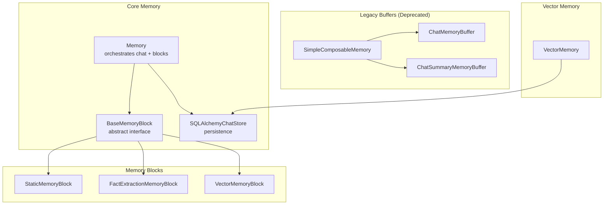
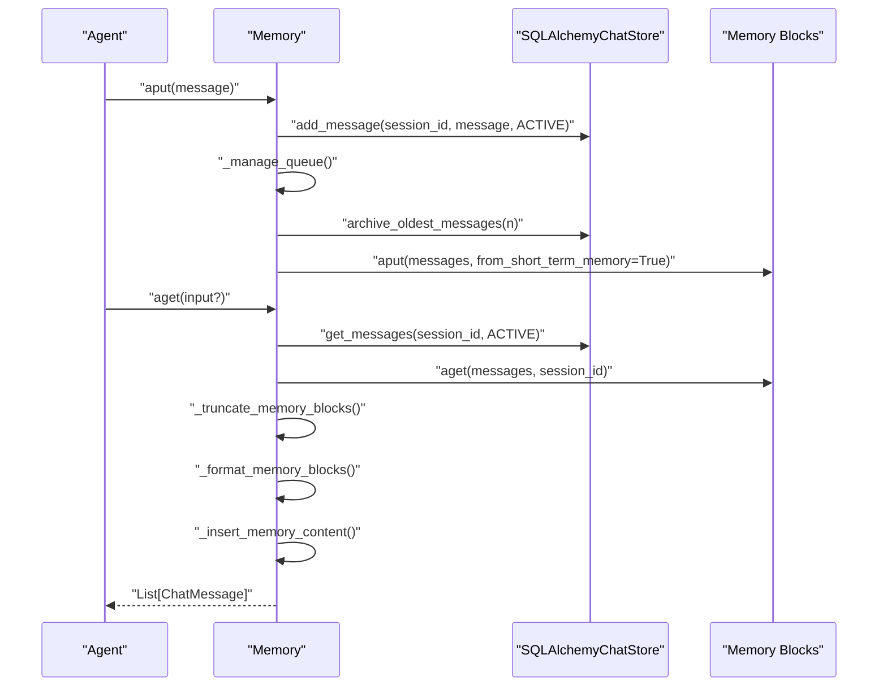
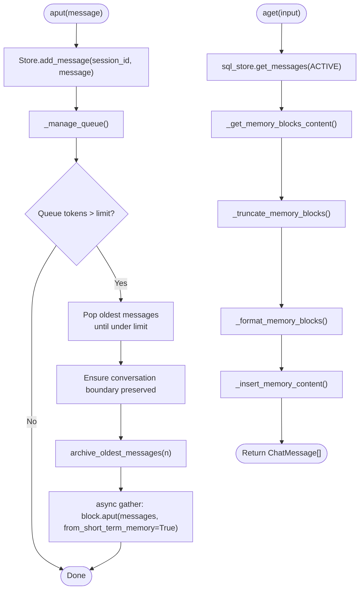
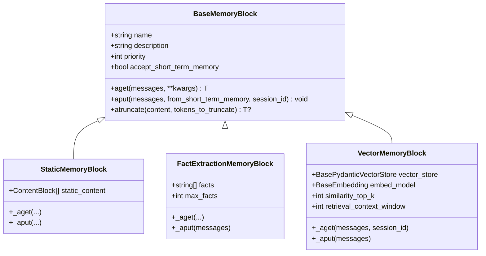
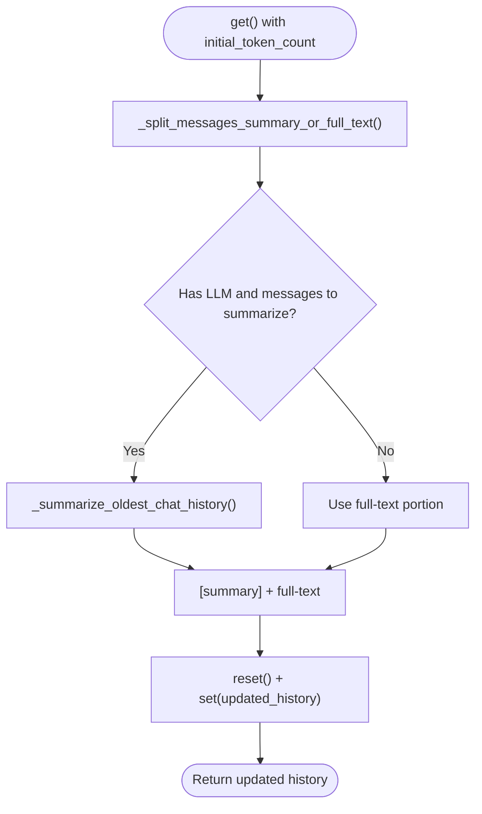
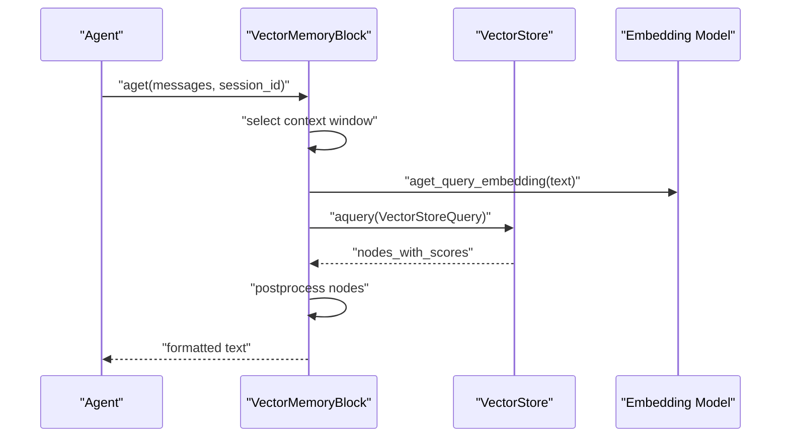
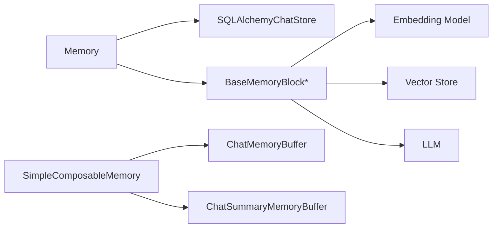

# Agent Memory Management

<cite>
**Referenced Files in This Document**
- [memory.py](file://llama-index-core/llama_index/core/memory/memory.py)
- [types.py](file://llama-index-core/llama_index/core/memory/types.py)
- [chat_memory_buffer.py](file://llama-index-core/llama_index/core/memory/chat_memory_buffer.py)
- [chat_summary_memory_buffer.py](file://llama-index-core/llama_index/core/memory/chat_summary_memory_buffer.py)
- [simple_composable_memory.py](file://llama-index-core/llama_index/core/memory/simple_composable_memory.py)
- [vector_memory.py](file://llama-index-core/llama_index/core/memory/vector_memory.py)
- [memory_blocks/static.py](file://llama-index-core/llama_index/core/memory/memory_blocks/static.py)
- [memory_blocks/fact.py](file://llama-index-core/llama_index/core/memory/memory_blocks/fact.py)
- [memory_blocks/vector.py](file://llama-index-core/llama_index/core/memory/memory_blocks/vector.py)
- [__init__.py](file://llama-index-core/llama_index/core/memory/__init__.py)
- [test_chat_memory_buffer.py](file://llama-index-core/tests/memory/test_chat_memory_buffer.py)
- [test_chat_summary_memory_buffer.py](file://llama-index-core/tests/memory/test_chat_summary_memory_buffer.py)
- [test_memory_base.py](file://llama-index-core/tests/memory/test_memory_base.py)
- [test_memory_blocks_base.py](file://llama-index-core/tests/memory/test_memory_blocks_base.py)
- [test_memory_schema.py](file://llama-index-core/tests/memory/test_memory_schema.py)
- [test_vector_memory.py](file://llama-index-core/tests/agent/memory/test_vector_memory.py)
</cite>

## Table of Contents
1. [Introduction](#introduction)
2. [Project Structure](#project-structure)
3. [Core Components](#core-components)
4. [Architecture Overview](#architecture-overview)
5. [Detailed Component Analysis](#detailed-component-analysis)
6. [Dependency Analysis](#dependency-analysis)
7. [Performance Considerations](#performance-considerations)
8. [Troubleshooting Guide](#troubleshooting-guide)
9. [Conclusion](#conclusion)
10. [Appendices](#appendices)

## Introduction
This document explains agent memory management in LlamaIndex with a focus on short-term and long-term memory systems for maintaining conversational context. It covers memory buffer implementations, summarization strategies, context preservation techniques, memory block types, composition patterns, and state persistence mechanisms. It also provides guidance on optimization, storage efficiency, retrieval strategies, custom memory implementations, memory scrubbing, and privacy considerations.

## Project Structure
The memory subsystem centers around a unified Memory orchestration component that coordinates short-term chat history with pluggable memory blocks for long-term knowledge. Supporting components include legacy buffers (deprecated), vector-backed memory, and composable memory for multi-source context.

**Diagram sources**
- [memory.py](file://llama-index-core/llama_index/core/memory/memory.py#L179-L800)
- [types.py](file://llama-index-core/llama_index/core/memory/types.py#L14-L153)
- [memory_blocks/static.py](file://llama-index-core/llama_index/core/memory/memory_blocks/static.py#L8-L40)
- [memory_blocks/fact.py](file://llama-index-core/llama_index/core/memory/memory_blocks/fact.py#L66-L177)
- [memory_blocks/vector.py](file://llama-index-core/llama_index/core/memory/memory_blocks/vector.py#L29-L202)
- [chat_memory_buffer.py](file://llama-index-core/llama_index/core/memory/chat_memory_buffer.py#L19-L167)
- [chat_summary_memory_buffer.py](file://llama-index-core/llama_index/core/memory/chat_summary_memory_buffer.py#L26-L341)
- [simple_composable_memory.py](file://llama-index-core/llama_index/core/memory/simple_composable_memory.py#L14-L164)
- [vector_memory.py](file://llama-index-core/llama_index/core/memory/vector_memory.py#L48-L207)

**Section sources**
- [__init__.py](file://llama-index-core/llama_index/core/memory/__init__.py#L1-L27)
- [memory.py](file://llama-index-core/llama_index/core/memory/memory.py#L179-L800)
- [types.py](file://llama-index-core/llama_index/core/memory/types.py#L14-L153)

## Core Components
- Memory: Central orchestrator that maintains a token-bounded short-term chat history and integrates long-term knowledge via memory blocks. It supports configurable token limits, flush sizes, insertion strategies (system vs. user message), and content truncation across blocks.
- BaseMemoryBlock: Abstract interface for memory blocks. Implementations define how to aget content and aput archived messages, with optional atruncate to reduce size.
- Memory Blocks:
  - StaticMemoryBlock: Injects fixed content into context.
  - FactExtractionMemoryBlock: Extracts and condenses factual statements from conversation history.
  - VectorMemoryBlock: Retrieves relevant past messages from a vector store.
- Legacy Buffers (Deprecated): ChatMemoryBuffer, ChatSummaryMemoryBuffer, SimpleComposableMemory.
- VectorMemory: Stores chat batches as nodes in a vector index for retrieval.

Key capabilities:
- Short-term memory: FIFO queue persisted via SQL chat store with token-aware eviction and conversation-boundary preservation.
- Long-term memory: Pluggable blocks that receive “waterfalled” messages (evicted from short-term) and produce context for injection.
- Context injection: Memory blocks’ content is inserted into the system message or the latest user message based on insert method.

**Section sources**
- [memory.py](file://llama-index-core/llama_index/core/memory/memory.py#L179-L800)
- [types.py](file://llama-index-core/llama_index/core/memory/types.py#L14-L153)
- [memory_blocks/static.py](file://llama-index-core/llama_index/core/memory/memory_blocks/static.py#L8-L40)
- [memory_blocks/fact.py](file://llama-index-core/llama_index/core/memory/memory_blocks/fact.py#L66-L177)
- [memory_blocks/vector.py](file://llama-index-core/llama_index/core/memory/memory_blocks/vector.py#L29-L202)
- [chat_memory_buffer.py](file://llama-index-core/llama_index/core/memory/chat_memory_buffer.py#L19-L167)
- [chat_summary_memory_buffer.py](file://llama-index-core/llama_index/core/memory/chat_summary_memory_buffer.py#L26-L341)
- [simple_composable_memory.py](file://llama-index-core/llama_index/core/memory/simple_composable_memory.py#L14-L164)
- [vector_memory.py](file://llama-index-core/llama_index/core/memory/vector_memory.py#L48-L207)

## Architecture Overview
The Memory component manages a bounded chat history and coordinates with memory blocks to preserve and inject relevant knowledge. It uses a SQL chat store for persistence and applies token estimation to enforce limits. When the queue grows beyond capacity, it evicts older messages in conversation-turn-safe chunks and “waters falls” them into memory blocks for archival and later retrieval.

**Diagram sources**
- [memory.py](file://llama-index-core/llama_index/core/memory/memory.py#L655-L800)
- [memory.py](file://llama-index-core/llama_index/core/memory/memory.py#L179-L246)

## Detailed Component Analysis

### Memory Orchestration
- Token management: Enforces a global token limit and reserves a minimum ratio for chat history. Flush size controls chunk eviction granularity.
- Queue management: Evicts oldest messages while preserving complete conversation turns and ensuring at least one message remains.
- Block integration: Aggregates content from memory blocks, formats via a template, and injects into the system message or latest user message.
- Persistence: Uses a SQL chat store keyed by session_id; supports async operations.

**Diagram sources**
- [memory.py](file://llama-index-core/llama_index/core/memory/memory.py#L655-L800)
- [memory.py](file://llama-index-core/llama_index/core/memory/memory.py#L429-L653)

**Section sources**
- [memory.py](file://llama-index-core/llama_index/core/memory/memory.py#L179-L800)

### Memory Block Types and Composition
- StaticMemoryBlock: Provides fixed content blocks for persistent instructions or context.
- FactExtractionMemoryBlock: Extracts explicit facts from conversation segments and condenses them when exceeding a maximum count.
- VectorMemoryBlock: Encodes recent context into embeddings and retrieves semantically similar stored messages from a vector store, optionally filtered by session_id.

**Diagram sources**
- [memory.py](file://llama-index-core/llama_index/core/memory/memory.py#L94-L177)
- [memory_blocks/static.py](file://llama-index-core/llama_index/core/memory/memory_blocks/static.py#L8-L40)
- [memory_blocks/fact.py](file://llama-index-core/llama_index/core/memory/memory_blocks/fact.py#L66-L177)
- [memory_blocks/vector.py](file://llama-index-core/llama_index/core/memory/memory_blocks/vector.py#L29-L202)

**Section sources**
- [memory_blocks/static.py](file://llama-index-core/llama_index/core/memory/memory_blocks/static.py#L8-L40)
- [memory_blocks/fact.py](file://llama-index-core/llama_index/core/memory/memory_blocks/fact.py#L66-L177)
- [memory_blocks/vector.py](file://llama-index-core/llama_index/core/memory/memory_blocks/vector.py#L29-L202)

### Summarization Strategies and Context Preservation
- ChatSummaryMemoryBuffer (Deprecated): Iteratively summarizes older messages using an LLM to keep the most recent portion as full-text within the token budget. Preserves assistant/tool pairs and enforces conversation boundaries.
- Memory’s waterfall: Evicts older messages safely and passes them to memory blocks, enabling archival and later retrieval without manual summarization.

**Diagram sources**
- [chat_summary_memory_buffer.py](file://llama-index-core/llama_index/core/memory/chat_summary_memory_buffer.py#L167-L341)

**Section sources**
- [chat_summary_memory_buffer.py](file://llama-index-core/llama_index/core/memory/chat_summary_memory_buffer.py#L26-L341)
- [memory.py](file://llama-index-core/llama_index/core/memory/memory.py#L655-L800)

### Vector-Based Memory and Retrieval
- VectorMemory: Stores message batches as nodes in a vector index and retrieves relevant nodes for a query. Supports combining adjacent messages by user role to preserve function-calling contexts.
- VectorMemoryBlock: Retrieves relevant stored messages from a vector store using embeddings, applies optional postprocessors, and formats results for inclusion.

**Diagram sources**
- [memory_blocks/vector.py](file://llama-index-core/llama_index/core/memory/memory_blocks/vector.py#L100-L168)

**Section sources**
- [vector_memory.py](file://llama-index-core/llama_index/core/memory/vector_memory.py#L48-L207)
- [memory_blocks/vector.py](file://llama-index-core/llama_index/core/memory/memory_blocks/vector.py#L29-L202)

### Legacy Buffers and Composability
- ChatMemoryBuffer (Deprecated): Maintains a sliding window of chat history respecting token limits and conversation boundaries.
- SimpleComposableMemory (Deprecated): Composes a primary memory with secondary sources, injecting secondary histories into the system prompt.

**Section sources**
- [chat_memory_buffer.py](file://llama-index-core/llama_index/core/memory/chat_memory_buffer.py#L19-L167)
- [simple_composable_memory.py](file://llama-index-core/llama_index/core/memory/simple_composable_memory.py#L14-L164)

## Dependency Analysis
- Memory depends on:
  - SQLAlchemyChatStore for persistence and session scoping.
  - Tokenizer for token estimation across text, images, audio, and video content.
  - Memory blocks for long-term context generation.
- Memory blocks depend on:
  - Embedding models for VectorMemoryBlock.
  - Vector stores for retrieval.
  - LLMs for FactExtractionMemoryBlock.
- Legacy buffers are standalone and deprecated in favor of Memory.

**Diagram sources**
- [memory.py](file://llama-index-core/llama_index/core/memory/memory.py#L179-L246)
- [memory_blocks/vector.py](file://llama-index-core/llama_index/core/memory/memory_blocks/vector.py#L29-L66)
- [memory_blocks/fact.py](file://llama-index-core/llama_index/core/memory/memory_blocks/fact.py#L66-L95)
- [simple_composable_memory.py](file://llama-index-core/llama_index/core/memory/simple_composable_memory.py#L14-L61)

**Section sources**
- [memory.py](file://llama-index-core/llama_index/core/memory/memory.py#L179-L246)
- [memory_blocks/vector.py](file://llama-index-core/llama_index/core/memory/memory_blocks/vector.py#L29-L66)
- [memory_blocks/fact.py](file://llama-index-core/llama_index/core/memory/memory_blocks/fact.py#L66-L95)
- [simple_composable_memory.py](file://llama-index-core/llama_index/core/memory/simple_composable_memory.py#L14-L61)

## Performance Considerations
- Token estimation: Accurate estimation of text and multimodal content prevents overflows and reduces unnecessary truncation.
- Flush size and chat history ratio: Tune to balance latency and context retention.
- Block truncation: Prioritized truncation minimizes impact on high-priority blocks.
- Vector retrieval: Adjust similarity_top_k and context window to trade recall for speed.
- Asynchronous operations: Use async APIs for chat store and embedding operations to avoid blocking.

[No sources needed since this section provides general guidance]

## Troubleshooting Guide
Common issues and resolutions:
- Token limit errors: Validate token_limit and token_flush_size; ensure tokenizer_fn is set.
- Conversation boundary violations: The queue manager preserves user-assistant-tool pairs; confirm input messages follow expected roles.
- Memory block content type errors: Ensure blocks return supported types (str, ContentBlock[], ChatMessage[]).
- Session scoping: When using VectorMemoryBlock, ensure session_id is propagated and filters are applied consistently.
- Legacy buffer deprecation: Prefer Memory for new implementations.

**Section sources**
- [memory.py](file://llama-index-core/llama_index/core/memory/memory.py#L251-L273)
- [memory.py](file://llama-index-core/llama_index/core/memory/memory.py#L429-L462)
- [memory_blocks/vector.py](file://llama-index-core/llama_index/core/memory/memory_blocks/vector.py#L123-L142)
- [chat_memory_buffer.py](file://llama-index-core/llama_index/core/memory/chat_memory_buffer.py#L37-L50)
- [chat_summary_memory_buffer.py](file://llama-index-core/llama_index/core/memory/chat_summary_memory_buffer.py#L65-L81)

## Conclusion
LlamaIndex provides a flexible, extensible memory framework. Memory orchestrates short-term chat history with long-term knowledge via memory blocks, supporting static context, factual extraction, and vector retrieval. Its design emphasizes token-awareness, conversation integrity, and asynchronous persistence, enabling efficient and privacy-conscious agent conversations.

[No sources needed since this section summarizes without analyzing specific files]

## Appendices

### Examples and Patterns
- Chat summaries: Use FactExtractionMemoryBlock to capture explicit facts and condense them over time.
- Conversation histories: Use VectorMemoryBlock to retrieve relevant past exchanges filtered by session_id.
- Knowledge retention: Combine StaticMemoryBlock for instructions and VectorMemoryBlock for dynamic retrieval.

**Section sources**
- [memory_blocks/fact.py](file://llama-index-core/llama_index/core/memory/memory_blocks/fact.py#L66-L177)
- [memory_blocks/vector.py](file://llama-index-core/llama_index/core/memory/memory_blocks/vector.py#L29-L202)
- [memory_blocks/static.py](file://llama-index-core/llama_index/core/memory/memory_blocks/static.py#L8-L40)

### Testing References
- Memory orchestration and block integration tests validate token handling, truncation, and injection logic.
- Legacy buffer tests cover backward compatibility and behavior under token constraints.
- Vector memory tests validate retrieval and storage semantics.

**Section sources**
- [test_memory_base.py](file://llama-index-core/tests/memory/test_memory_base.py)
- [test_memory_blocks_base.py](file://llama-index-core/tests/memory/test_memory_blocks_base.py)
- [test_memory_schema.py](file://llama-index-core/tests/memory/test_memory_schema.py)
- [test_chat_memory_buffer.py](file://llama-index-core/tests/memory/test_chat_memory_buffer.py)
- [test_chat_summary_memory_buffer.py](file://llama-index-core/tests/memory/test_chat_summary_memory_buffer.py)
- [test_vector_memory.py](file://llama-index-core/tests/agent/memory/test_vector_memory.py)