# Agent Systems

<cite>
**Referenced Files in This Document**
- [__init__.py](file://llama-index-core/llama_index/core/agent/__init__.py)
- [base_agent.py](file://llama-index-core/llama_index/core/agent/workflow/base_agent.py)
- [multi_agent_workflow.py](file://llama-index-core/llama_index/core/agent/workflow/multi_agent_workflow.py)
- [react_agent.py](file://llama-index-core/llama_index/core/agent/workflow/react_agent.py)
- [codeact_agent.py](file://llama-index-core/llama_index/core/agent/workflow/codeact_agent.py)
- [function_agent.py](file://llama-index-core/llama_index/core/agent/workflow/function_agent.py)
- [utils.py](file://llama-index-core/llama_index/core/agent/utils.py)
- [workflow_events.py](file://llama-index-core/llama_index/core/agent/workflow/workflow_events.py)
- [prompts.py](file://llama-index-core/llama_index/core/agent/workflow/prompts.py)
- [formatter.py](file://llama-index-core/llama_index/core/agent/react/formatter.py)
- [output_parser.py](file://llama-index-core/llama_index/core/agent/react/output_parser.py)
- [types.py](file://llama-index-core/llama_index/core/agent/react/types.py)
</cite>

## Table of Contents
1. [Introduction](#introduction)
2. [Project Structure](#project-structure)
3. [Core Components](#core-components)
4. [Architecture Overview](#architecture-overview)
5. [Detailed Component Analysis](#detailed-component-analysis)
6. [Dependency Analysis](#dependency-analysis)
7. [Performance Considerations](#performance-considerations)
8. [Troubleshooting Guide](#troubleshooting-guide)
9. [Conclusion](#conclusion)
10. [Appendices](#appendices)

## Introduction
This document explains the agent systems in LlamaIndex with a focus on multi-agent workflows, ReAct agents, and custom agent implementations. It covers agent communication patterns, shared memory, coordination mechanisms, tool integration, decision-making, state management, and operational guidance for debugging, performance optimization, and production deployment. Practical examples include research assistants, code execution agents, and specialized domain agents.

## Project Structure
The agent subsystem centers around a workflow-driven architecture that composes agents, tools, and memory into orchestrated conversations. Key modules include:
- Agent base and concrete agents (ReAct, Function, CodeAct)
- Multi-agent workflow orchestrator
- Shared utilities for structured outputs and message formatting
- React-specific formatter and output parser
- Workflow events and prompts

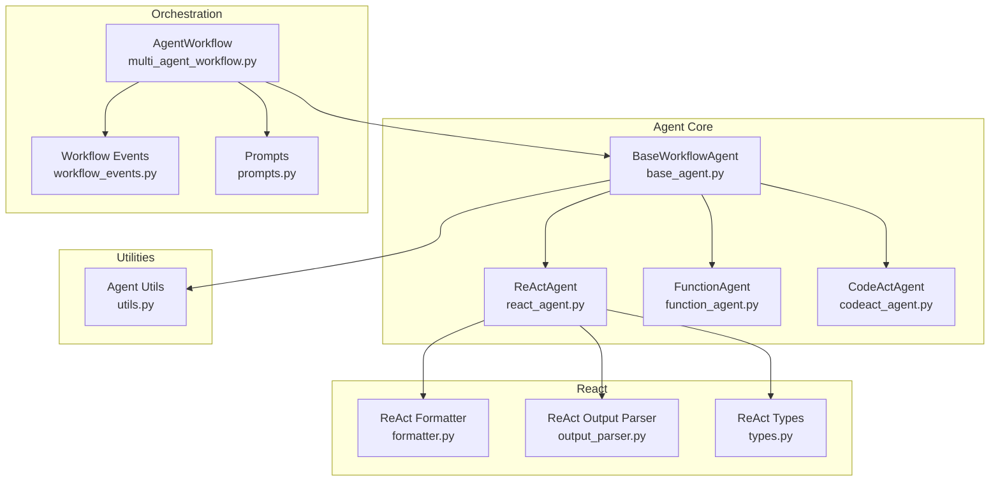

**Diagram sources**
- [base_agent.py](file://llama-index-core/llama_index/core/agent/workflow/base_agent.py#L83-L139)
- [react_agent.py](file://llama-index-core/llama_index/core/agent/workflow/react_agent.py#L36-L78)
- [function_agent.py](file://llama-index-core/llama_index/core/agent/workflow/function_agent.py#L18-L30)
- [codeact_agent.py](file://llama-index-core/llama_index/core/agent/workflow/codeact_agent.py#L62-L81)
- [multi_agent_workflow.py](file://llama-index-core/llama_index/core/agent/workflow/multi_agent_workflow.py#L96-L114)
- [workflow_events.py](file://llama-index-core/llama_index/core/agent/workflow/workflow_events.py#L1-L200)
- [prompts.py](file://llama-index-core/llama_index/core/agent/workflow/prompts.py#L1-L200)
- [formatter.py](file://llama-index-core/llama_index/core/agent/react/formatter.py#L1-L200)
- [output_parser.py](file://llama-index-core/llama_index/core/agent/react/output_parser.py#L1-L200)
- [types.py](file://llama-index-core/llama_index/core/agent/react/types.py#L1-L200)
- [utils.py](file://llama-index-core/llama_index/core/agent/utils.py#L1-L43)

**Section sources**
- [__init__.py](file://llama-index-core/llama_index/core/agent/__init__.py#L1-L38)

## Core Components
- BaseWorkflowAgent: Abstract base class defining the agent lifecycle, tool integration, memory, streaming, and state management. Provides shared steps for initialization, setup, tool invocation, aggregation, and finalization.
- ReActAgent: Implements the ReAct reasoning loop with a dedicated formatter and output parser. Maintains a reasoning scratchpad and transitions between Thought/Action/Observation/Answer steps.
- FunctionAgent: Uses function-calling LLMs to select and execute tools, optionally in parallel. Stores intermediate turns in a scratchpad.
- CodeActAgent: Specialized agent that generates executable code wrapped in markers and executes it via a provided executor. Integrates tools and maintains a scratchpad for iterative refinement.
- AgentWorkflow: Multi-agent orchestrator that coordinates agents, manages shared memory, enforces handoffs, and aggregates tool results. Supports structured outputs and early stopping strategies.
- Utilities: Structured output generation and XML formatting helpers for consistent schema-driven responses.

Key capabilities:
- Tool integration via BaseTool/AsyncBaseTool, with automatic adaptation to async
- Streaming-aware LLM interactions and event emission
- Shared memory buffer for persistent conversation state
- Handoff mechanism enabling agent-to-agent delegation
- Structured output generation via schema classes or custom functions

**Section sources**
- [base_agent.py](file://llama-index-core/llama_index/core/agent/workflow/base_agent.py#L83-L139)
- [react_agent.py](file://llama-index-core/llama_index/core/agent/workflow/react_agent.py#L36-L78)
- [function_agent.py](file://llama-index-core/llama_index/core/agent/workflow/function_agent.py#L18-L30)
- [codeact_agent.py](file://llama-index-core/llama_index/core/agent/workflow/codeact_agent.py#L62-L81)
- [multi_agent_workflow.py](file://llama-index-core/llama_index/core/agent/workflow/multi_agent_workflow.py#L96-L114)
- [utils.py](file://llama-index-core/llama_index/core/agent/utils.py#L12-L43)

## Architecture Overview
The agent architecture is workflow-centric. Agents inherit from BaseWorkflowAgent and participate in AgentWorkflow steps. Tools are dynamically resolved per agent and can be augmented by a retriever. Memory is shared across steps and agents. The orchestrator manages handoffs, tool call aggregation, and structured outputs.

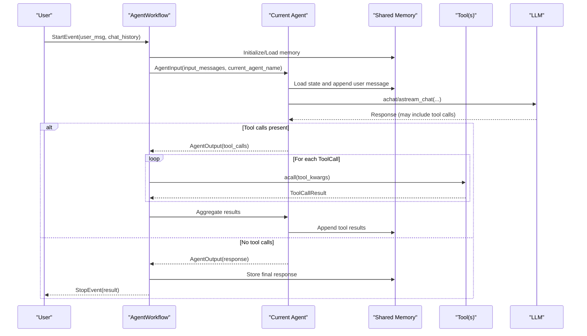

**Diagram sources**
- [multi_agent_workflow.py](file://llama-index-core/llama_index/core/agent/workflow/multi_agent_workflow.py#L378-L480)
- [base_agent.py](file://llama-index-core/llama_index/core/agent/workflow/base_agent.py#L370-L467)
- [workflow_events.py](file://llama-index-core/llama_index/core/agent/workflow/workflow_events.py#L1-L200)

## Detailed Component Analysis

### BaseWorkflowAgent
BaseWorkflowAgent defines the agent contract and shared behavior:
- Fields: name, description, system_prompt, tools/tool_retriever, can_handoff_to, llm, initial_state, state_prompt, output_cls, structured_output_fn, streaming, early_stopping_method
- Lifecycle steps:
  - init_run: initializes memory, state, max iterations, and user message
  - setup_agent: injects system prompt and augments last user message with state
  - run_agent_step: resolves tools and invokes take_step
  - parse_agent_output: handles retries, tool calls, and early stopping
  - call_tool: executes tools and streams ToolCallResult
  - aggregate_tool_results: collects tool results, updates state, and decides next step
  - finalize: persists intermediate messages and prepares final output

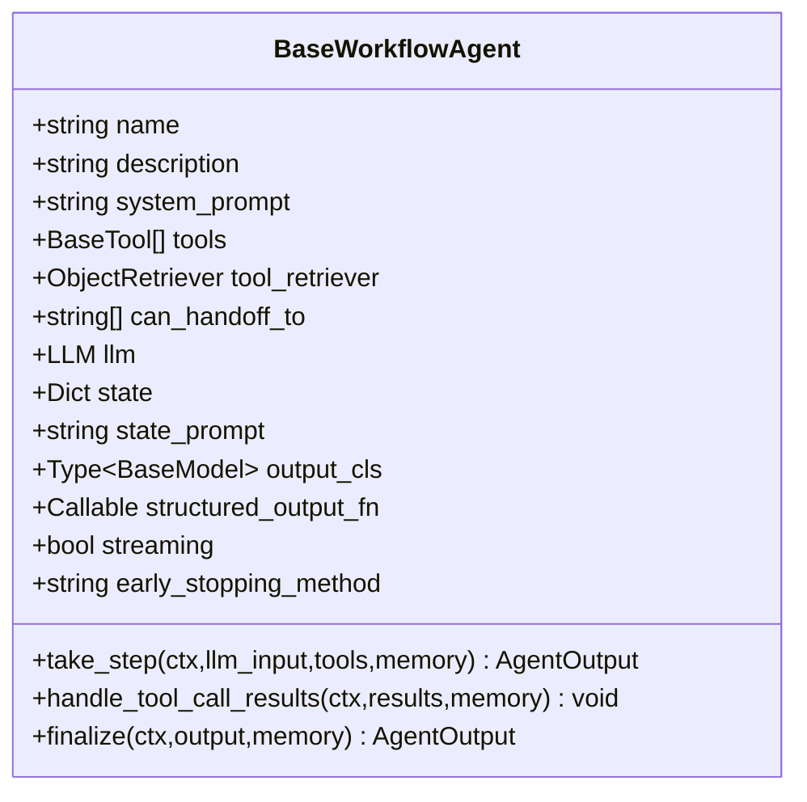

**Diagram sources**
- [base_agent.py](file://llama-index-core/llama_index/core/agent/workflow/base_agent.py#L83-L139)

**Section sources**
- [base_agent.py](file://llama-index-core/llama_index/core/agent/workflow/base_agent.py#L232-L252)
- [base_agent.py](file://llama-index-core/llama_index/core/agent/workflow/base_agent.py#L370-L467)
- [base_agent.py](file://llama-index-core/llama_index/core/agent/workflow/base_agent.py#L507-L594)

### ReActAgent
ReActAgent implements the ReAct loop:
- Uses a formatter to combine chat history and current reasoning into LLM input
- Uses an output parser to extract Thought/Action/Observation/Answer steps
- Maintains a reasoning scratchpad stored in context
- Emits AgentStream events during streaming
- On return_direct tool calls (except handoff), immediately produces a response

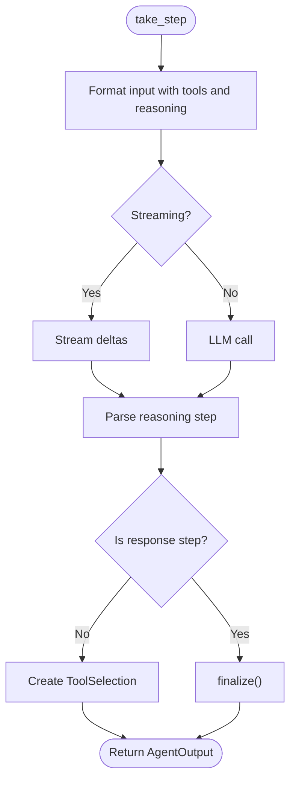

**Diagram sources**
- [react_agent.py](file://llama-index-core/llama_index/core/agent/workflow/react_agent.py#L116-L232)
- [react_agent.py](file://llama-index-core/llama_index/core/agent/workflow/react_agent.py#L234-L262)

**Section sources**
- [react_agent.py](file://llama-index-core/llama_index/core/agent/workflow/react_agent.py#L36-L78)
- [react_agent.py](file://llama-index-core/llama_index/core/agent/workflow/react_agent.py#L116-L232)
- [react_agent.py](file://llama-index-core/llama_index/core/agent/workflow/react_agent.py#L234-L301)

### FunctionAgent
FunctionAgent leverages function-calling LLMs:
- Supports parallel tool calls and optional forced initial tool choice
- Streams tool calls alongside text deltas
- Persists intermediate messages in a scratchpad
- Stops early on return_direct tool calls (except handoff)

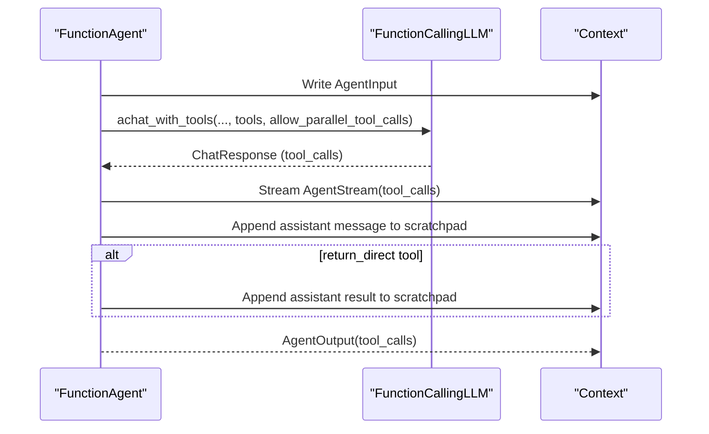

**Diagram sources**
- [function_agent.py](file://llama-index-core/llama_index/core/agent/workflow/function_agent.py#L100-L145)
- [function_agent.py](file://llama-index-core/llama_index/core/agent/workflow/function_agent.py#L147-L195)

**Section sources**
- [function_agent.py](file://llama-index-core/llama_index/core/agent/workflow/function_agent.py#L18-L30)
- [function_agent.py](file://llama-index-core/llama_index/core/agent/workflow/function_agent.py#L100-L145)
- [function_agent.py](file://llama-index-core/llama_index/core/agent/workflow/function_agent.py#L147-L195)

### CodeActAgent
CodeActAgent specializes in generating and executing code:
- Injects an execute tool and a system prompt describing available tools
- Extracts code from LLM responses using markers and creates a ToolSelection
- Executes code via a provided executor and appends results to scratchpad
- Supports handoff when configured

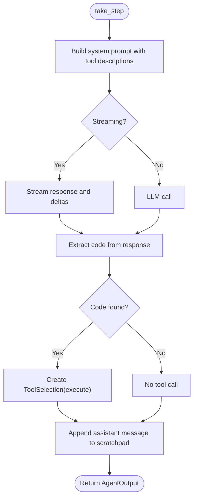

**Diagram sources**
- [codeact_agent.py](file://llama-index-core/llama_index/core/agent/workflow/codeact_agent.py#L261-L349)
- [codeact_agent.py](file://llama-index-core/llama_index/core/agent/workflow/codeact_agent.py#L351-L400)

**Section sources**
- [codeact_agent.py](file://llama-index-core/llama_index/core/agent/workflow/codeact_agent.py#L62-L81)
- [codeact_agent.py](file://llama-index-core/llama_index/core/agent/workflow/codeact_agent.py#L261-L349)
- [codeact_agent.py](file://llama-index-core/llama_index/core/agent/workflow/codeact_agent.py#L351-L400)

### AgentWorkflow (Multi-Agent Orchestration)
AgentWorkflow coordinates multiple agents:
- Validates agents, ensures unique names and descriptions, and sets a root agent
- Manages shared memory, state, max iterations, and early stopping
- Dynamically constructs tools per agent, including a handoff tool when enabled
- Streams AgentStream events and emits ToolCall/ToolCallResult events
- Supports structured output via custom function or schema class

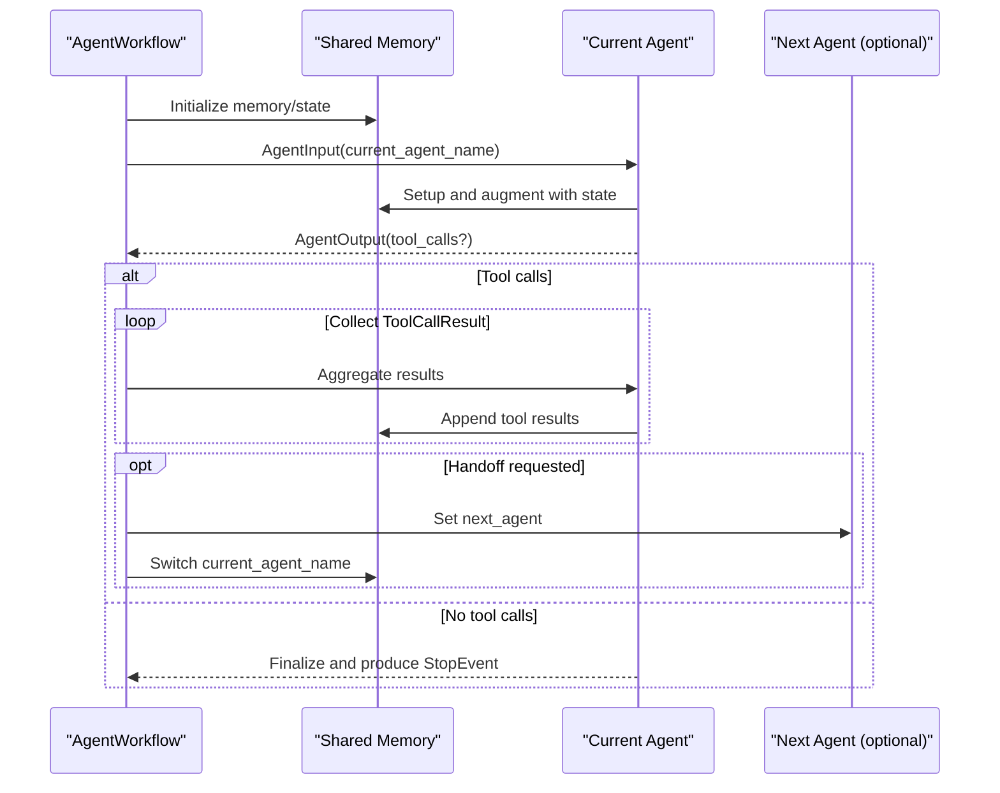

**Diagram sources**
- [multi_agent_workflow.py](file://llama-index-core/llama_index/core/agent/workflow/multi_agent_workflow.py#L378-L480)
- [multi_agent_workflow.py](file://llama-index-core/llama_index/core/agent/workflow/multi_agent_workflow.py#L627-L743)

**Section sources**
- [multi_agent_workflow.py](file://llama-index-core/llama_index/core/agent/workflow/multi_agent_workflow.py#L96-L114)
- [multi_agent_workflow.py](file://llama-index-core/llama_index/core/agent/workflow/multi_agent_workflow.py#L245-L264)
- [multi_agent_workflow.py](file://llama-index-core/llama_index/core/agent/workflow/multi_agent_workflow.py#L520-L625)
- [multi_agent_workflow.py](file://llama-index-core/llama_index/core/agent/workflow/multi_agent_workflow.py#L627-L743)

### Shared Memory and State Management
- Shared memory is a ChatMemoryBuffer initialized per run and persisted across steps
- State is stored in context and injected into the last user message via a state prompt
- State updates are guarded to prevent repeated injection during a single turn

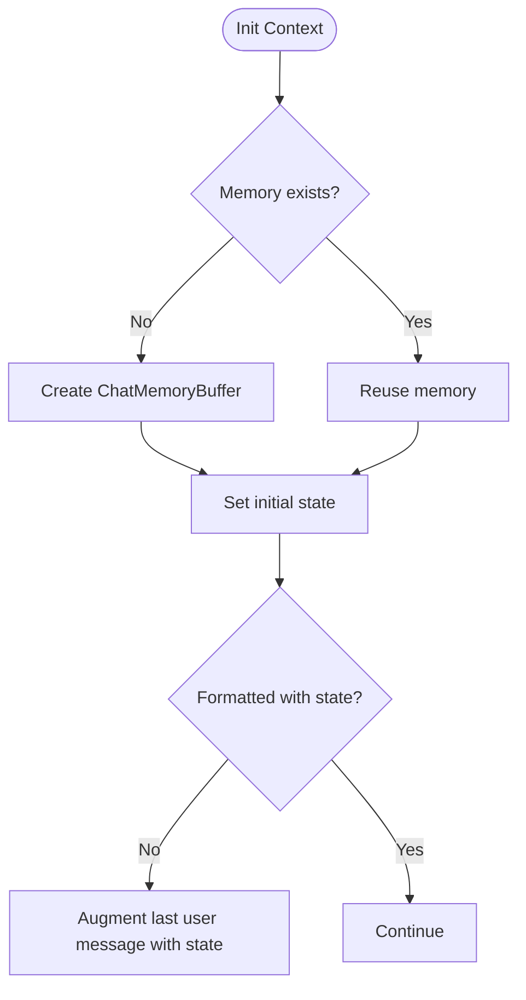

**Diagram sources**
- [base_agent.py](file://llama-index-core/llama_index/core/agent/workflow/base_agent.py#L271-L300)
- [base_agent.py](file://llama-index-core/llama_index/core/agent/workflow/base_agent.py#L424-L450)
- [multi_agent_workflow.py](file://llama-index-core/llama_index/core/agent/workflow/multi_agent_workflow.py#L266-L310)

**Section sources**
- [base_agent.py](file://llama-index-core/llama_index/core/agent/workflow/base_agent.py#L271-L300)
- [base_agent.py](file://llama-index-core/llama_index/core/agent/workflow/base_agent.py#L424-L450)
- [multi_agent_workflow.py](file://llama-index-core/llama_index/core/agent/workflow/multi_agent_workflow.py#L266-L310)

### Tool Integration and Decision-Making
- Tools are adapted to async automatically
- FunctionAgent supports parallel tool calls and optional initial tool choice
- ReActAgent parses explicit Thought/Action/Observation/Answer steps
- CodeActAgent extracts code from responses and executes it
- Handoff tool enables agent-to-agent delegation when configured

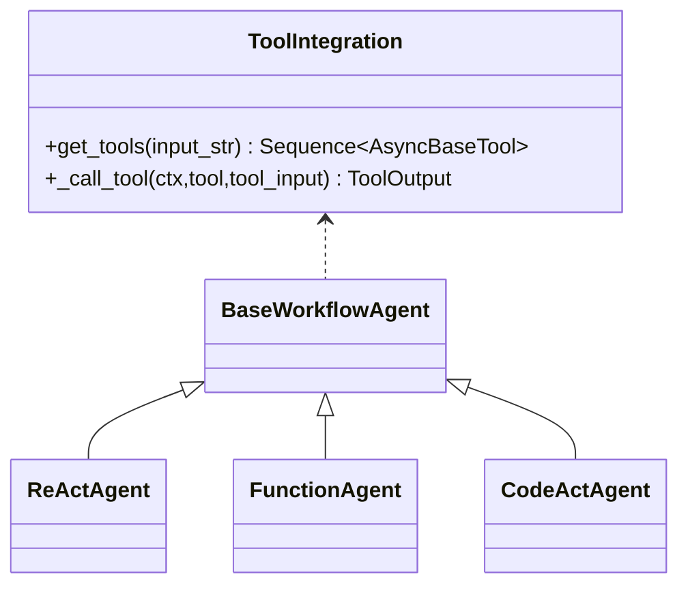

**Diagram sources**
- [base_agent.py](file://llama-index-core/llama_index/core/agent/workflow/base_agent.py#L260-L269)
- [base_agent.py](file://llama-index-core/llama_index/core/agent/workflow/base_agent.py#L334-L368)
- [function_agent.py](file://llama-index-core/llama_index/core/agent/workflow/function_agent.py#L100-L145)
- [react_agent.py](file://llama-index-core/llama_index/core/agent/workflow/react_agent.py#L116-L232)
- [codeact_agent.py](file://llama-index-core/llama_index/core/agent/workflow/codeact_agent.py#L261-L349)

**Section sources**
- [base_agent.py](file://llama-index-core/llama_index/core/agent/workflow/base_agent.py#L260-L269)
- [function_agent.py](file://llama-index-core/llama_index/core/agent/workflow/function_agent.py#L100-L145)
- [react_agent.py](file://llama-index-core/llama_index/core/agent/workflow/react_agent.py#L116-L232)
- [codeact_agent.py](file://llama-index-core/llama_index/core/agent/workflow/codeact_agent.py#L261-L349)

### Structured Outputs
- Schema-driven: generate_structured_response formats messages and asks the LLM to return JSON matching a Pydantic model
- Custom function: structured_output_fn receives the full message history and returns a dictionary

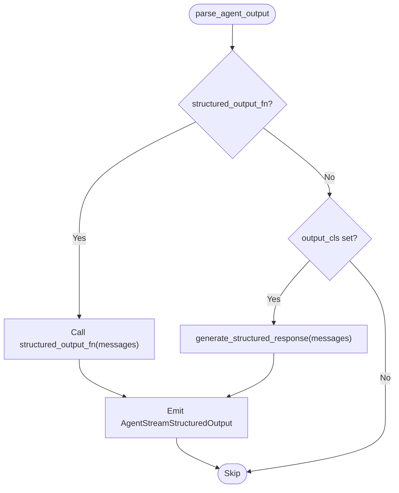

**Diagram sources**
- [multi_agent_workflow.py](file://llama-index-core/llama_index/core/agent/workflow/multi_agent_workflow.py#L576-L611)
- [utils.py](file://llama-index-core/llama_index/core/agent/utils.py#L35-L43)

**Section sources**
- [utils.py](file://llama-index-core/llama_index/core/agent/utils.py#L35-L43)
- [multi_agent_workflow.py](file://llama-index-core/llama_index/core/agent/workflow/multi_agent_workflow.py#L576-L611)

### Examples and Use Cases
- Research assistant: Use ReActAgent with a retriever to synthesize answers and cite sources
- Code execution agent: Use CodeActAgent with a sandboxed code_execute_fn to solve programming tasks
- Specialized domain agent: Use FunctionAgent with domain-specific tools for structured data retrieval or transformations
- Multi-agent orchestration: Use AgentWorkflow to route queries to specialized agents and coordinate handoffs

[No sources needed since this section provides conceptual examples]

## Dependency Analysis
Agent components depend on:
- LLM abstractions for chat and tool-calling
- Tools and tool retrievers for capabilities
- Memory for persistence
- Prompts and formatters for ReAct
- Workflow runtime for orchestration and event handling

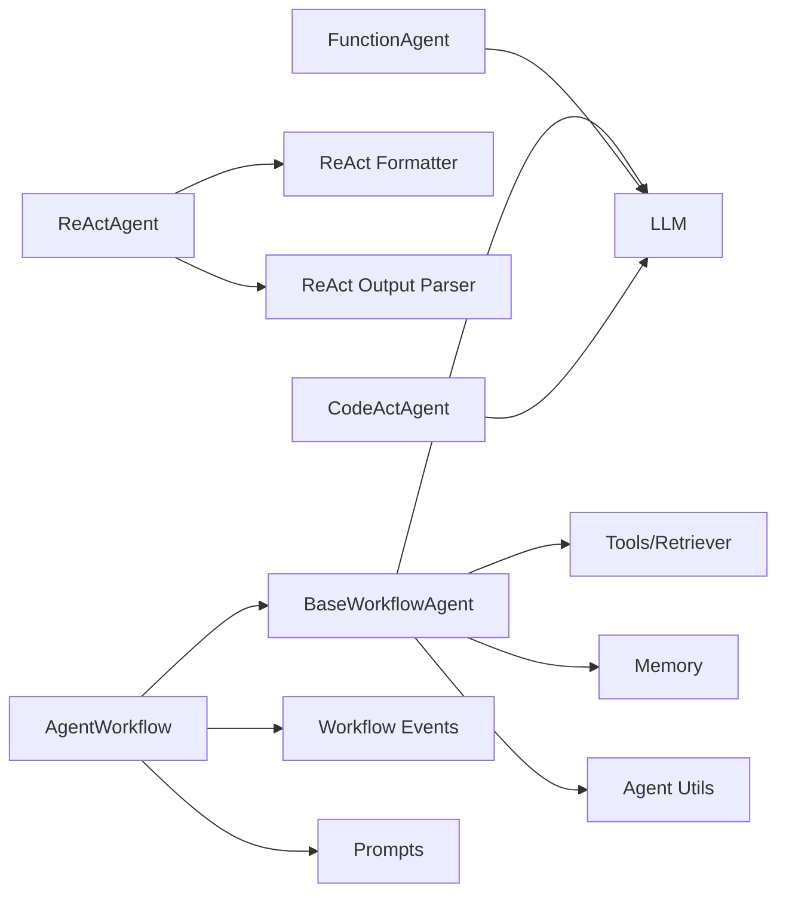

**Diagram sources**
- [base_agent.py](file://llama-index-core/llama_index/core/agent/workflow/base_agent.py#L41-L56)
- [react_agent.py](file://llama-index-core/llama_index/core/agent/workflow/react_agent.py#L4-L27)
- [function_agent.py](file://llama-index-core/llama_index/core/agent/workflow/function_agent.py#L10-L15)
- [codeact_agent.py](file://llama-index-core/llama_index/core/agent/workflow/codeact_agent.py#L13-L22)
- [multi_agent_workflow.py](file://llama-index-core/llama_index/core/agent/workflow/multi_agent_workflow.py#L44-L67)
- [utils.py](file://llama-index-core/llama_index/core/agent/utils.py#L5-L9)

**Section sources**
- [base_agent.py](file://llama-index-core/llama_index/core/agent/workflow/base_agent.py#L41-L56)
- [react_agent.py](file://llama-index-core/llama_index/core/agent/workflow/react_agent.py#L4-L27)
- [function_agent.py](file://llama-index-core/llama_index/core/agent/workflow/function_agent.py#L10-L15)
- [codeact_agent.py](file://llama-index-core/llama_index/core/agent/workflow/codeact_agent.py#L13-L22)
- [multi_agent_workflow.py](file://llama-index-core/llama_index/core/agent/workflow/multi_agent_workflow.py#L44-L67)
- [utils.py](file://llama-index-core/llama_index/core/agent/utils.py#L5-L9)

## Performance Considerations
- Prefer streaming where supported to improve perceived latency and enable incremental feedback
- Limit max iterations and configure early stopping to prevent runaway loops
- Use parallel tool calls judiciously; disable if tools are expensive or stateful
- Cache tool descriptions and system prompts where appropriate
- Optimize tool execution time and sandboxing for CodeActAgent
- Monitor memory growth and trim histories when necessary

[No sources needed since this section provides general guidance]

## Troubleshooting Guide
Common issues and remedies:
- Empty streaming response: Ensure the LLM supports streaming and handle empty deltas gracefully
- Tool not found: Verify tool names and availability; the orchestrator will return an error message
- Parsing failures in ReAct: The agent returns retry messages with guidance; refine prompts or output format
- Handoff misconfiguration: Ensure can_handoff_to lists valid agent names and that the handoff tool is enabled
- Structured output errors: Validate schema classes and custom functions; catch exceptions and log warnings

**Section sources**
- [base_agent.py](file://llama-index-core/llama_index/core/agent/workflow/base_agent.py#L334-L368)
- [react_agent.py](file://llama-index-core/llama_index/core/agent/workflow/react_agent.py#L162-L195)
- [multi_agent_workflow.py](file://llama-index-core/llama_index/core/agent/workflow/multi_agent_workflow.py#L627-L663)

## Conclusion
LlamaIndex’s agent systems provide a robust, extensible framework for building intelligent, tool-augmented workflows. BaseWorkflowAgent unifies lifecycle management, while ReAct, Function, and CodeAct agents address diverse interaction patterns. AgentWorkflow orchestrates multi-agent scenarios with shared memory, handoffs, and structured outputs. With careful configuration, monitoring, and optimization, these components scale to production-grade applications.

[No sources needed since this section summarizes without analyzing specific files]

## Appendices

### API and Event Types
Key event types emitted during agent runs:
- AgentInput, AgentSetup, AgentOutput, AgentStream, AgentStreamStructuredOutput
- ToolCall, ToolCallResult
- AgentWorkflowStartEvent

These types drive the workflow’s step transitions and enable streaming UIs and logging.

**Section sources**
- [workflow_events.py](file://llama-index-core/llama_index/core/agent/workflow/workflow_events.py#L1-L200)

### React Prompting and Formatting
- ReActFormatter composes system header and chat history into a single input
- ReActOutputParser extracts structured reasoning steps
- React types define reasoning step models

**Section sources**
- [prompts.py](file://llama-index-core/llama_index/core/agent/workflow/prompts.py#L1-L200)
- [formatter.py](file://llama-index-core/llama_index/core/agent/react/formatter.py#L1-L200)
- [output_parser.py](file://llama-index-core/llama_index/core/agent/react/output_parser.py#L1-L200)
- [types.py](file://llama-index-core/llama_index/core/agent/react/types.py#L1-L200)