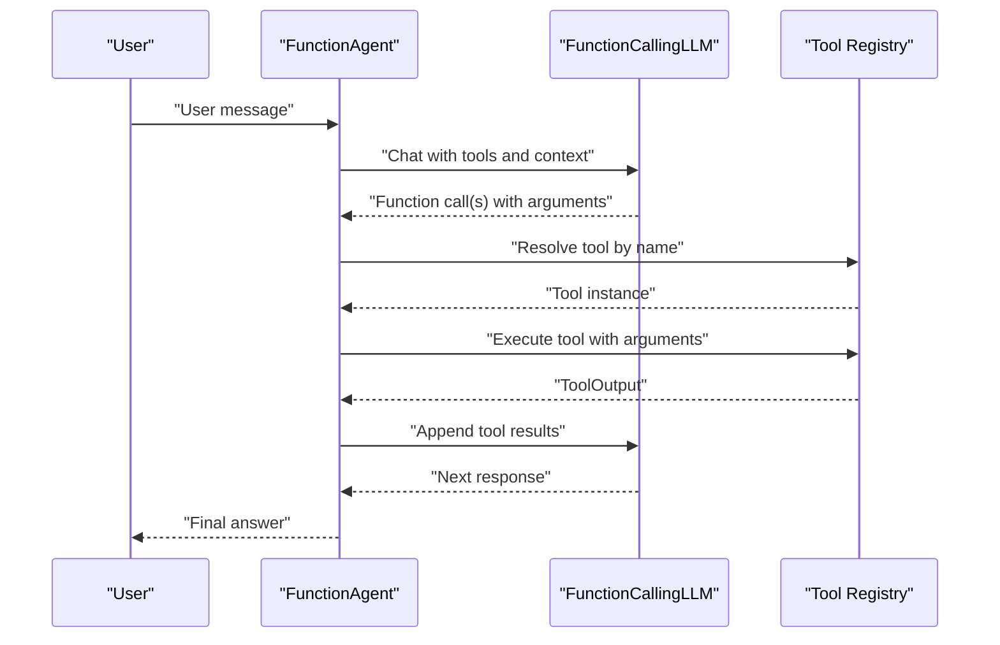
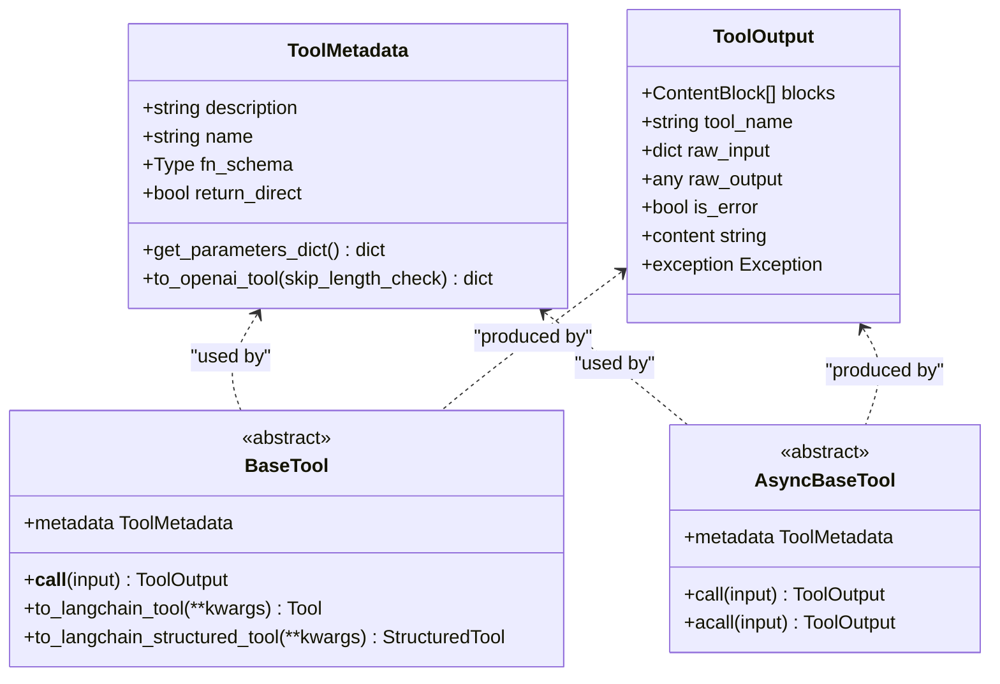
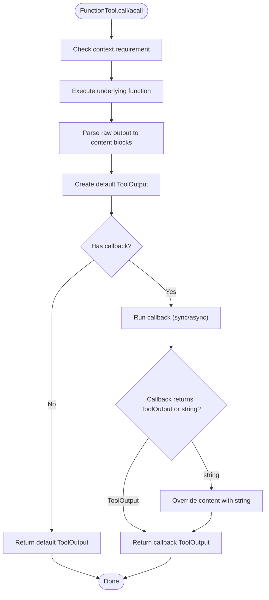
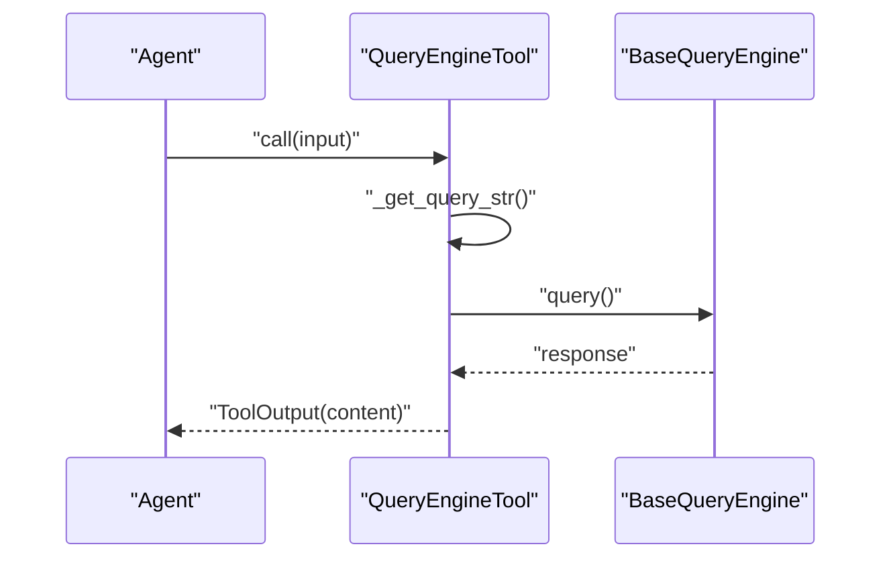
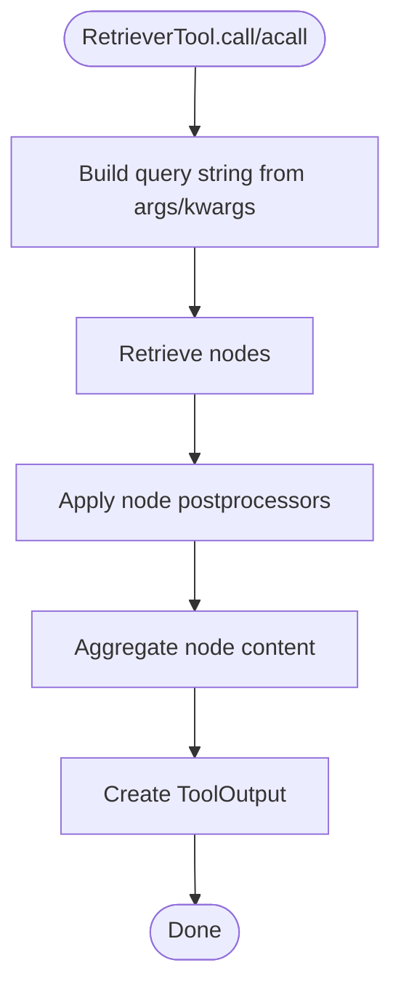
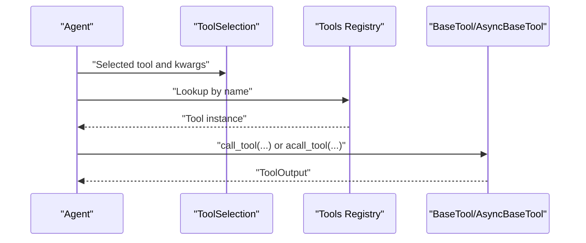
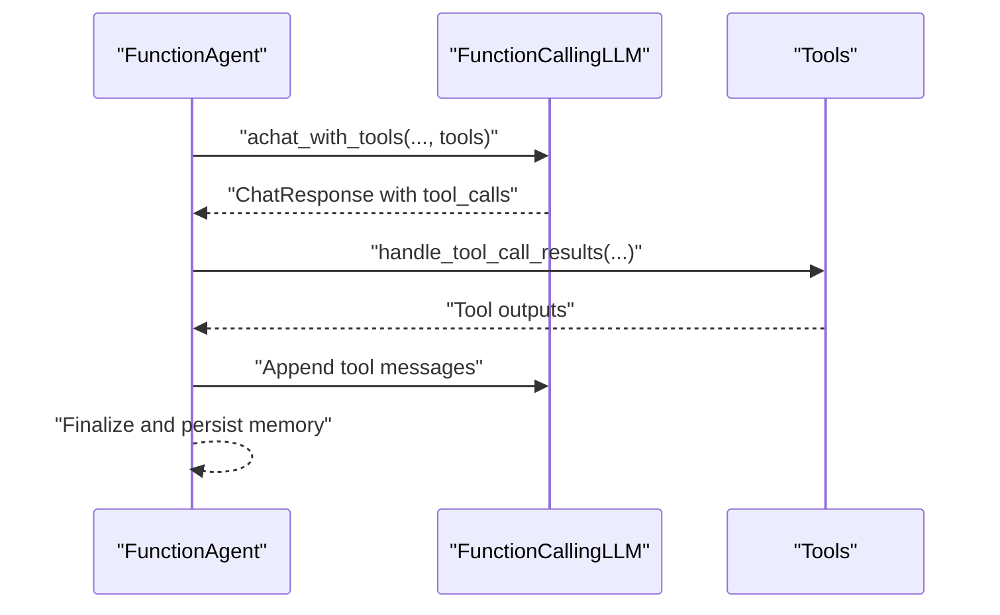
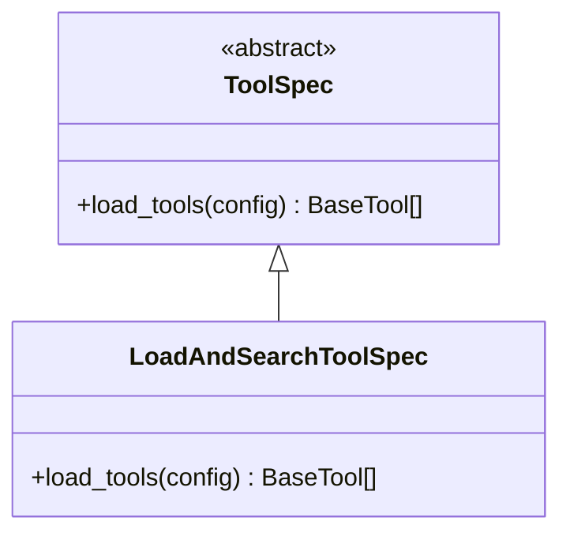
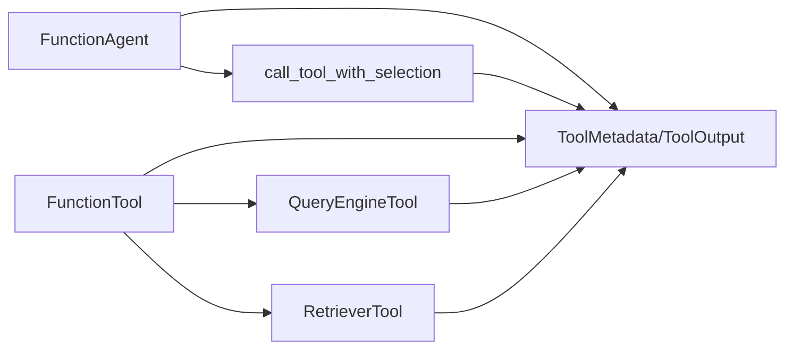

# Agent Tools Integration

<cite>
**Referenced Files in This Document**
- [__init__.py](file://llama-index-core/llama_index/core/tools/__init__.py)
- [types.py](file://llama-index-core/llama_index/core/tools/types.py)
- [function_tool.py](file://llama-index-core/llama_index/core/tools/function_tool.py)
- [query_engine.py](file://llama-index-core/llama_index/core/tools/query_engine.py)
- [retriever_tool.py](file://llama-index-core/llama_index/core/tools/retriever_tool.py)
- [calling.py](file://llama-index-core/llama_index/core/tools/calling.py)
- [function_agent.py](file://llama-index-core/llama_index/core/agent/workflow/function_agent.py)
- [tool_spec/base.py](file://llama-index-core/llama_index/core/tools/tool_spec/base.py)
- [tool_spec/load_and_search/base.py](file://llama-index-core/llama_index/core/tools/tool_spec/load_and_search/base.py)
- [tool_spec/load_and_search/README.md](file://llama-index-core/llama_index/core/tools/tool_spec/load_and_search/README.md)
- [tools.py](file://llama-index-core/llama_index/core/langchain_helpers/agents/tools.py)
- [toolkits.py](file://llama-index-core/llama_index/core/langchain_helpers/agents/toolkits.py)
- [test_tools_azure_code_interpreter.py](file://llama-index-integrations/tools/llama-index-tools-azure-code-interpreter/tests/test_tools_azure_code_interpreter.py)
- [test_tools_bing_search.py](file://llama-index-integrations/tools/llama-index-tools-bing-search/tests/test_tools_bing_search.py)
- [test_tools_arxiv.py](file://llama-index-integrations/tools/llama-index-tools-arxiv/tests/test_tools_arxiv.py)
- [test_tools_airweave.py](file://llama-index-integrations/tools/llama-index-tools-airweave/tests/test_tools_airweave.py)
- [test_tools_azure_cv.py](file://llama-index-integrations/tools/llama-index-tools-azure-cv/tests/test_tools_azure_cv.py)
- [test_tools_azure_speech.py](file://llama-index-integrations/tools/llama-index-tools-azure-speech/tests/test_tools_azure_speech.py)
- [test_tools_azure_translate.py](file://llama-index-integrations/tools/llama-index-tools-azure-translate/tests/test_tools_azure_translate.py)
- [test_tools_box.py](file://llama-index-integrations/tools/llama-index-tools-box/tests/test_tools_box.py)
- [test_tools.py](file://llama-index-integrations/llms/llama-index-llms-nvidia/tests/test_tools.py)
- [test_tool_required.py](file://llama-index-integrations/llms/llama-index-llms-ibm/tests/test_tool_required.py)
- [test_tool_required.py](file://llama-index-integrations/llms/llama-index-llms-vertex/tests/test_tool_required.py)
- [test_query_engine_tool.py](file://llama-index-core/tests/tools/test_query_engine_tool.py)
- [test_retriever_tool.py](file://llama-index-core/tests/tools/test_retriever_tool.py)
- [test_eval_query_engine_tool.py](file://llama-index-core/tests/tools/test_eval_query_engine_tool.py)
</cite>

## Table of Contents
1. [Introduction](#introduction)
2. [Project Structure](#project-structure)
3. [Core Components](#core-components)
4. [Architecture Overview](#architecture-overview)
5. [Detailed Component Analysis](#detailed-component-analysis)
6. [Dependency Analysis](#dependency-analysis)
7. [Performance Considerations](#performance-considerations)
8. [Troubleshooting Guide](#troubleshooting-guide)
9. [Conclusion](#conclusion)
10. [Appendices](#appendices)

## Introduction
This document explains how agents in LlamaIndex consume and execute tools to extend capabilities. It covers tool definition patterns, function calling mechanisms, tool composition strategies, and integration with built-in and third-party tools. It also provides guidance on safety, rate limiting, error handling, discovery, documentation, and performance optimization.

## Project Structure
The agent tools integration spans core tool abstractions, agent workflows, and integrations:
- Core tools define the tool interface, metadata, output, and calling utilities.
- Built-in tools wrap query engines, retrievers, and generic functions.
- Agent workflows orchestrate LLM-driven function calling and tool execution.
- Integrations provide third-party tools for web search, code execution, computer vision, speech, translation, and more.

```mermaid
graph TB
subgraph "Core Tools"
TInit["tools/__init__.py"]
TTypes["tools/types.py"]
TFunc["tools/function_tool.py"]
TQuery["tools/query_engine.py"]
TRetrieve["tools/retriever_tool.py"]
TCall["tools/calling.py"]
end
subgraph "Agent Workflow"
FA["agent/workflow/function_agent.py"]
end
subgraph "Integrations"
IntAzureCI["integrations/tools/azure-code-interpreter"]
IntBing["integrations/tools/bing-search"]
IntArxiv["integrations/tools/arxiv"]
IntAirweave["integrations/tools/airweave"]
IntCV["integrations/tools/azure-cv"]
IntSpeech["integrations/tools/azure-speech"]
IntTranslate["integrations/tools/azure-translate"]
IntBox["integrations/tools/box"]
end
TInit --> TTypes
TInit --> TFunc
TInit --> TQuery
TInit --> TRetrieve
TInit --> TCall
FA --> TTypes
FA --> TCall
IntAzureCI --> TTypes
IntBing --> TTypes
IntArxiv --> TTypes
IntAirweave --> TTypes
IntCV --> TTypes
IntSpeech --> TTypes
IntTranslate --> TTypes
IntBox --> TTypes
```

**Diagram sources**
- [__init__.py](file://llama-index-core/llama_index/core/tools/__init__.py#L1-L36)
- [types.py](file://llama-index-core/llama_index/core/tools/types.py#L1-L280)
- [function_tool.py](file://llama-index-core/llama_index/core/tools/function_tool.py#L1-L449)
- [query_engine.py](file://llama-index-core/llama_index/core/tools/query_engine.py#L1-L114)
- [retriever_tool.py](file://llama-index-core/llama_index/core/tools/retriever_tool.py#L1-L136)
- [calling.py](file://llama-index-core/llama_index/core/tools/calling.py#L1-L107)
- [function_agent.py](file://llama-index-core/llama_index/core/agent/workflow/function_agent.py#L1-L196)
- [test_tools_azure_code_interpreter.py](file://llama-index-integrations/tools/llama-index-tools-azure-code-interpreter/tests/test_tools_azure_code_interpreter.py)
- [test_tools_bing_search.py](file://llama-index-integrations/tools/llama-index-tools-bing-search/tests/test_tools_bing_search.py)
- [test_tools_arxiv.py](file://llama-index-integrations/tools/llama-index-tools-arxiv/tests/test_tools_arxiv.py)
- [test_tools_airweave.py](file://llama-index-integrations/tools/llama-index-tools-airweave/tests/test_tools_airweave.py)
- [test_tools_azure_cv.py](file://llama-index-integrations/tools/llama-index-tools-azure-cv/tests/test_tools_azure_cv.py)
- [test_tools_azure_speech.py](file://llama-index-integrations/tools/llama-index-tools-azure-speech/tests/test_tools_azure_speech.py)
- [test_tools_azure_translate.py](file://llama-index-integrations/tools/llama-index-tools-azure-translate/tests/test_tools_azure_translate.py)
- [test_tools_box.py](file://llama-index-integrations/tools/llama-index-tools-box/tests/test_tools_box.py)

**Section sources**
- [__init__.py](file://llama-index-core/llama_index/core/tools/__init__.py#L1-L36)
- [types.py](file://llama-index-core/llama_index/core/tools/types.py#L1-L280)
- [function_agent.py](file://llama-index-core/llama_index/core/agent/workflow/function_agent.py#L1-L196)

## Core Components
- Tool abstraction and metadata: Define tool identity, schema, and behavior.
- FunctionTool: Wrap arbitrary functions with optional callbacks and context injection.
- QueryEngineTool and RetrieverTool: Bridge LlamaIndex query engines and retrievers to tools.
- Tool calling utilities: Select and invoke tools by name and arguments.
- Agent workflow: Orchestrates LLM-driven function calling and tool execution.

Key responsibilities:
- ToolMetadata: Provides tool name, description, JSON schema, and return-direct flag.
- ToolOutput: Standardized output container for tool results and errors.
- BaseTool/AsyncBaseTool: Abstract interfaces for synchronous and asynchronous tools.
- FunctionTool.from_defaults: Auto-generates metadata and schema from function signatures and docstrings.
- QueryEngineTool/RetrieverTool: Convert natural language queries to structured tool outputs.

**Section sources**
- [types.py](file://llama-index-core/llama_index/core/tools/types.py#L17-L104)
- [function_tool.py](file://llama-index-core/llama_index/core/tools/function_tool.py#L67-L253)
- [query_engine.py](file://llama-index-core/llama_index/core/tools/query_engine.py#L17-L86)
- [retriever_tool.py](file://llama-index-core/llama_index/core/tools/retriever_tool.py#L26-L123)
- [calling.py](file://llama-index-core/llama_index/core/tools/calling.py#L10-L61)

## Architecture Overview
The agent invokes an LLM configured for function calling. The LLM selects tools and arguments; the agent resolves tool calls and executes them via standardized calling utilities. Results are appended to the conversation context for iterative refinement.

**Diagram sources**
- [function_agent.py](file://llama-index-core/llama_index/core/agent/workflow/function_agent.py#L31-L145)
- [calling.py](file://llama-index-core/llama_index/core/tools/calling.py#L63-L83)

**Section sources**
- [function_agent.py](file://llama-index-core/llama_index/core/agent/workflow/function_agent.py#L18-L196)
- [calling.py](file://llama-index-core/llama_index/core/tools/calling.py#L1-L107)

## Detailed Component Analysis

### Tool Abstractions and Metadata
- ToolMetadata: Holds name, description, JSON schema, and return-direct flag. Supports OpenAI-style tool conversion and sanitization.
- ToolOutput: Encapsulates content blocks, raw input/output, and error state with optional exception.
- BaseTool/AsyncBaseTool: Provide synchronous and asynchronous invocation contracts and LangChain interoperability helpers.

**Diagram sources**
- [types.py](file://llama-index-core/llama_index/core/tools/types.py#L24-L104)
- [types.py](file://llama-index-core/llama_index/core/tools/types.py#L106-L166)
- [types.py](file://llama-index-core/llama_index/core/tools/types.py#L168-L227)

**Section sources**
- [types.py](file://llama-index-core/llama_index/core/tools/types.py#L1-L280)

### FunctionTool: Function Calling and Callbacks
- Wraps a callable (sync or async) and metadata.
- Automatically detects context parameter and supports partial parameters.
- Parses outputs into content blocks and supports sync/async callbacks to override outputs.
- Converts to LangChain tools with schema propagation.

**Diagram sources**
- [function_tool.py](file://llama-index-core/llama_index/core/tools/function_tool.py#L304-L380)

**Section sources**
- [function_tool.py](file://llama-index-core/llama_index/core/tools/function_tool.py#L67-L449)

### QueryEngineTool: Natural Language Query Tool
- Converts natural language input into a query string and executes against a BaseQueryEngine.
- Supports both sync and async query execution.
- Produces ToolOutput with content derived from the query engine’s response.

**Diagram sources**
- [query_engine.py](file://llama-index-core/llama_index/core/tools/query_engine.py#L68-L86)

**Section sources**
- [query_engine.py](file://llama-index-core/llama_index/core/tools/query_engine.py#L17-L114)

### RetrieverTool: Retrieval-Based Tool
- Builds a query string from positional and keyword arguments.
- Executes retrieval and applies optional node postprocessors.
- Aggregates retrieved content into ToolOutput.

**Diagram sources**
- [retriever_tool.py](file://llama-index-core/llama_index/core/tools/retriever_tool.py#L76-L123)

**Section sources**
- [retriever_tool.py](file://llama-index-core/llama_index/core/tools/retriever_tool.py#L26-L136)

### Tool Calling Utilities
- call_tool/acall_tool: Resolve single tool by metadata name and invoke with arguments; handle single-argument vs keyword dispatch; capture exceptions into ToolOutput.
- call_tool_with_selection/acall_tool_with_selection: Resolve tool by name from a ToolSelection and invoke with verbose logging.

**Diagram sources**
- [calling.py](file://llama-index-core/llama_index/core/tools/calling.py#L63-L106)

**Section sources**
- [calling.py](file://llama-index-core/llama_index/core/tools/calling.py#L10-L107)

### Agent Workflow: FunctionAgent
- Enforces function-calling LLM usage.
- Streams or collects tool calls from LLM responses.
- Appends tool results to scratchpad and memory; supports return-direct behavior.

**Diagram sources**
- [function_agent.py](file://llama-index-core/llama_index/core/agent/workflow/function_agent.py#L31-L195)

**Section sources**
- [function_agent.py](file://llama-index-core/llama_index/core/agent/workflow/function_agent.py#L18-L196)

### Tool Specifications and Discovery
- ToolSpec base classes enable discovery and loading of tools from external services.
- Example: Load-and-search tool spec demonstrates a pattern for service-specific tool loading and metadata generation.

**Diagram sources**
- [tool_spec/base.py](file://llama-index-core/llama_index/core/tools/tool_spec/base.py)
- [tool_spec/load_and_search/base.py](file://llama-index-core/llama_index/core/tools/tool_spec/load_and_search/base.py)

**Section sources**
- [tool_spec/base.py](file://llama-index-core/llama_index/core/tools/tool_spec/base.py)
- [tool_spec/load_and_search/base.py](file://llama-index-core/llama_index/core/tools/tool_spec/load_and_search/base.py)
- [tool_spec/load_and_search/README.md](file://llama-index-core/llama_index/core/tools/tool_spec/load_and_search/README.md)

### Third-Party Integrations
- Azure Code Interpreter, Bing Search, ArXiv, AirWeave, Azure Computer Vision, Azure Speech, Azure Translate, Box.
- Tests demonstrate invocation patterns and expected behaviors for each integration.

Examples of integration coverage:
- Azure Code Interpreter tool tests
- Bing Search tool tests
- ArXiv tool tests
- AirWeave tool tests
- Azure CV tool tests
- Azure Speech tool tests
- Azure Translate tool tests
- Box tool tests

**Section sources**
- [test_tools_azure_code_interpreter.py](file://llama-index-integrations/tools/llama-index-tools-azure-code-interpreter/tests/test_tools_azure_code_interpreter.py)
- [test_tools_bing_search.py](file://llama-index-integrations/tools/llama-index-tools-bing-search/tests/test_tools_bing_search.py)
- [test_tools_arxiv.py](file://llama-index-integrations/tools/llama-index-tools-arxiv/tests/test_tools_arxiv.py)
- [test_tools_airweave.py](file://llama-index-integrations/tools/llama-index-tools-airweave/tests/test_tools_airweave.py)
- [test_tools_azure_cv.py](file://llama-index-integrations/tools/llama-index-tools-azure-cv/tests/test_tools_azure_cv.py)
- [test_tools_azure_speech.py](file://llama-index-integrations/tools/llama-index-tools-azure-speech/tests/test_tools_azure_speech.py)
- [test_tools_azure_translate.py](file://llama-index-integrations/tools/llama-index-tools-azure-translate/tests/test_tools_azure_translate.py)
- [test_tools_box.py](file://llama-index-integrations/tools/llama-index-tools-box/tests/test_tools_box.py)

## Dependency Analysis
- Agent depends on AsyncBaseTool and LLM function calling.
- Tools depend on ToolMetadata and ToolOutput.
- FunctionTool depends on schema generation and content block parsing.
- QueryEngineTool/RetrieverTool depend on LlamaIndex query engine and retriever abstractions.
- Integrations depend on external services and expose tool instances consumable by the agent.

**Diagram sources**
- [function_agent.py](file://llama-index-core/llama_index/core/agent/workflow/function_agent.py#L31-L145)
- [calling.py](file://llama-index-core/llama_index/core/tools/calling.py#L63-L106)
- [types.py](file://llama-index-core/llama_index/core/tools/types.py#L24-L104)
- [function_tool.py](file://llama-index-core/llama_index/core/tools/function_tool.py#L67-L121)
- [query_engine.py](file://llama-index-core/llama_index/core/tools/query_engine.py#L17-L58)
- [retriever_tool.py](file://llama-index-core/llama_index/core/tools/retriever_tool.py#L26-L66)

**Section sources**
- [function_agent.py](file://llama-index-core/llama_index/core/agent/workflow/function_agent.py#L18-L196)
- [calling.py](file://llama-index-core/llama_index/core/tools/calling.py#L1-L107)
- [types.py](file://llama-index-core/llama_index/core/tools/types.py#L1-L280)
- [function_tool.py](file://llama-index-core/llama_index/core/tools/function_tool.py#L1-L449)
- [query_engine.py](file://llama-index-core/llama_index/core/tools/query_engine.py#L1-L114)
- [retriever_tool.py](file://llama-index-core/llama_index/core/tools/retriever_tool.py#L1-L136)

## Performance Considerations
- Prefer async tool execution when available to avoid blocking the main thread.
- Use return_direct for tools that produce final answers to reduce iterations.
- Minimize tool output sizes by selecting relevant content and avoiding redundant serialization.
- Batch retriever calls when possible and apply node postprocessors judiciously.
- Cache frequently accessed tool inputs and outputs where safe and appropriate.

## Troubleshooting Guide
Common issues and resolutions:
- Tool schema mismatch: Ensure ToolMetadata.fn_schema matches actual parameters; use FunctionTool.from_defaults to auto-generate schemas.
- Missing context parameter: FunctionTool enforces context presence when annotated; provide the required context argument.
- Tool errors: call_tool/acall_tool catch exceptions and return ToolOutput with is_error=True; inspect exception and raw_output for diagnostics.
- LLM not function calling: FunctionAgent requires a function-calling LLM; otherwise, a ValueError is raised.
- Streaming tool calls: FunctionAgent streams tool_calls and deltas; ensure downstream handlers process these events.

**Section sources**
- [function_tool.py](file://llama-index-core/llama_index/core/tools/function_tool.py#L304-L380)
- [calling.py](file://llama-index-core/llama_index/core/tools/calling.py#L10-L61)
- [function_agent.py](file://llama-index-core/llama_index/core/agent/workflow/function_agent.py#L108-L110)

## Conclusion
LlamaIndex provides a robust, extensible framework for agent tools integration. With standardized tool abstractions, automatic schema generation, and seamless LLM function calling, developers can compose built-in and third-party tools to build powerful agent workflows. Following the patterns and guidelines in this document ensures safe, efficient, and maintainable tool usage.

## Appendices

### Built-in Tools Catalog
- FunctionTool: Wrap any function with metadata and callbacks.
- QueryEngineTool: Natural language query execution via a query engine.
- RetrieverTool: Retrieval of relevant documents with optional postprocessing.

**Section sources**
- [function_tool.py](file://llama-index-core/llama_index/core/tools/function_tool.py#L67-L253)
- [query_engine.py](file://llama-index-core/llama_index/core/tools/query_engine.py#L17-L86)
- [retriever_tool.py](file://llama-index-core/llama_index/core/tools/retriever_tool.py#L26-L123)

### Tool Composition Strategies
- Chain tools: Use the agent to iteratively select and execute tools until a final answer is produced.
- Conditional selection: Use tool metadata and descriptions to guide the LLM toward appropriate tools for the task.
- Parallel tool calls: Enable parallel execution when supported by the LLM to reduce latency.

**Section sources**
- [function_agent.py](file://llama-index-core/llama_index/core/agent/workflow/function_agent.py#L26-L49)

### Safety, Rate Limiting, and Error Handling
- Safety: Validate inputs using ToolMetadata.fn_schema; sanitize tool names; restrict tool scope to trusted integrations.
- Rate limiting: Apply throttling around external API calls; consider circuit breakers and retries with backoff.
- Error handling: Use ToolOutput.is_error and exception fields; log raw_input/raw_output for debugging.

**Section sources**
- [types.py](file://llama-index-core/llama_index/core/tools/types.py#L106-L166)
- [calling.py](file://llama-index-core/llama_index/core/tools/calling.py#L25-L60)

### Tool Discovery and Documentation
- Use ToolMetadata.name and description for discoverability.
- ToolSpec patterns enable dynamic loading and documentation of tool sets.
- LangChain interoperability: Tools can be exported as LangChain tools with schema propagation.

**Section sources**
- [types.py](file://llama-index-core/llama_index/core/tools/types.py#L24-L104)
- [tool_spec/base.py](file://llama-index-core/llama_index/core/tools/tool_spec/base.py)
- [tool_spec/load_and_search/base.py](file://llama-index-core/llama_index/core/tools/tool_spec/load_and_search/base.py)
- [function_tool.py](file://llama-index-core/llama_index/core/tools/function_tool.py#L382-L408)

### Integration Examples
- Azure Code Interpreter, Bing Search, ArXiv, AirWeave, Azure CV, Azure Speech, Azure Translate, Box.
- Tests illustrate invocation patterns and expected outcomes.

**Section sources**
- [test_tools_azure_code_interpreter.py](file://llama-index-integrations/tools/llama-index-tools-azure-code-interpreter/tests/test_tools_azure_code_interpreter.py)
- [test_tools_bing_search.py](file://llama-index-integrations/tools/llama-index-tools-bing-search/tests/test_tools_bing_search.py)
- [test_tools_arxiv.py](file://llama-index-integrations/tools/llama-index-tools-arxiv/tests/test_tools_arxiv.py)
- [test_tools_airweave.py](file://llama-index-integrations/tools/llama-index-tools-airweave/tests/test_tools_airweave.py)
- [test_tools_azure_cv.py](file://llama-index-integrations/tools/llama-index-tools-azure-cv/tests/test_tools_azure_cv.py)
- [test_tools_azure_speech.py](file://llama-index-integrations/tools/llama-index-tools-azure-speech/tests/test_tools_azure_speech.py)
- [test_tools_azure_translate.py](file://llama-index-integrations/tools/llama-index-tools-azure-translate/tests/test_tools_azure_translate.py)
- [test_tools_box.py](file://llama-index-integrations/tools/llama-index-tools-box/tests/test_tools_box.py)