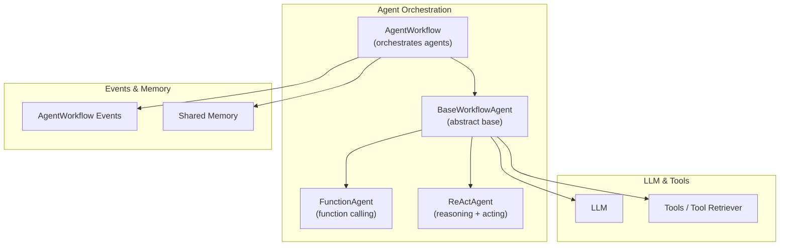
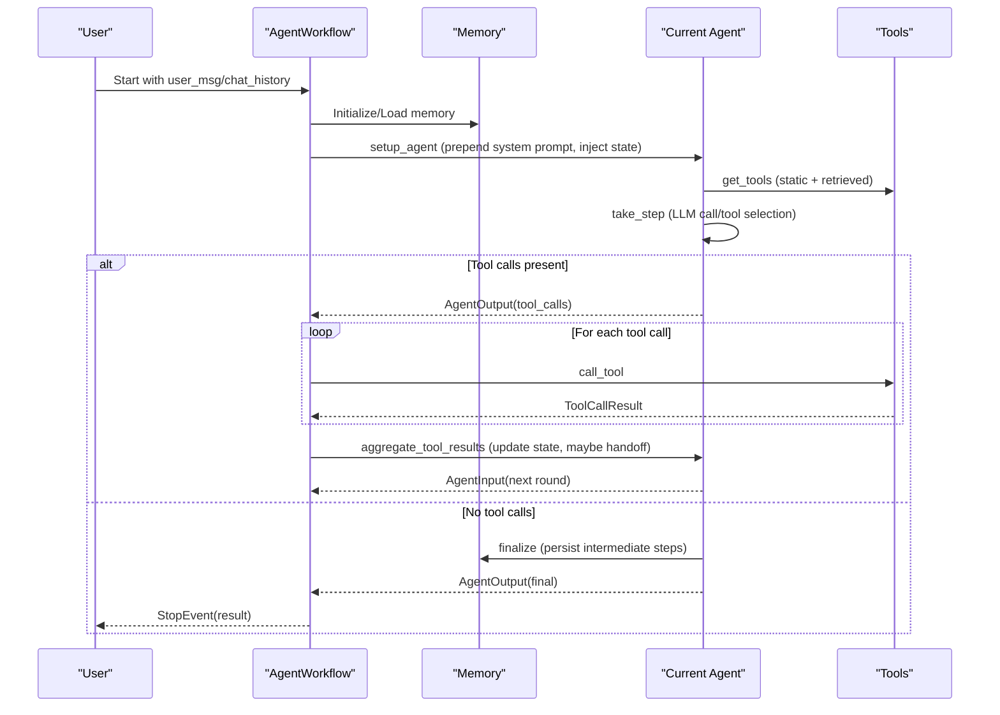
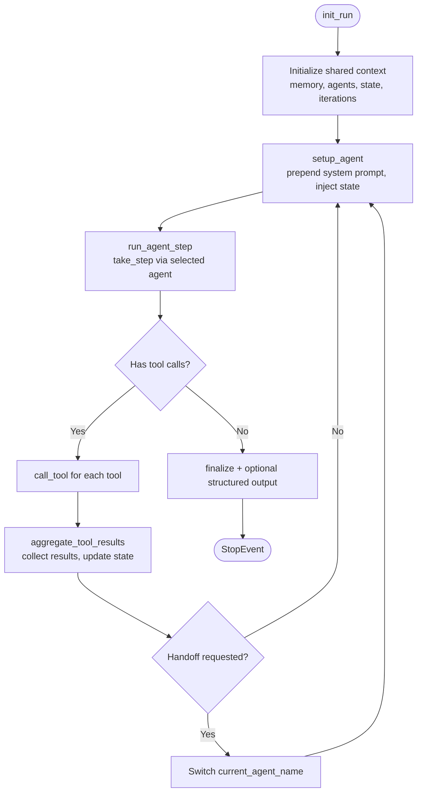
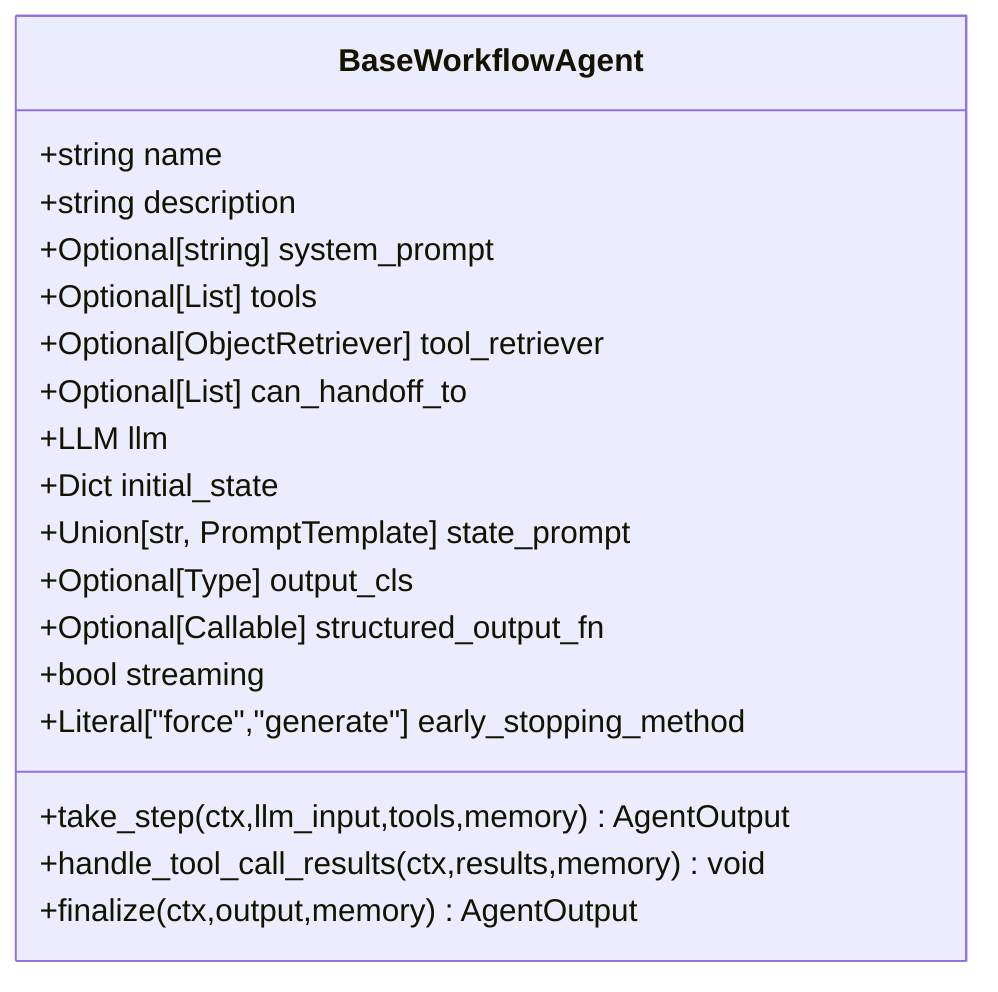
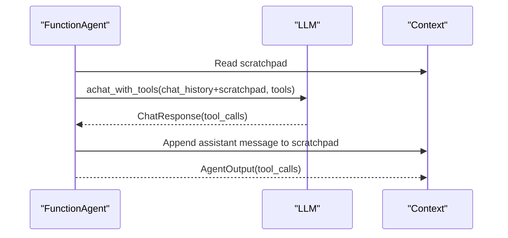
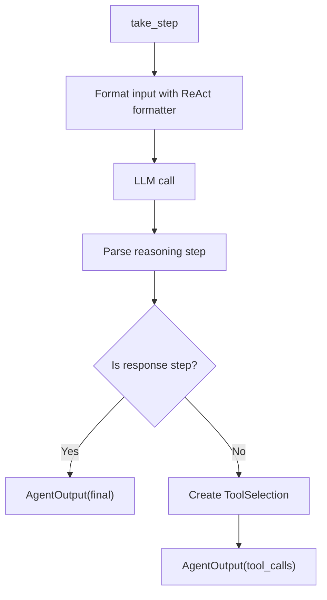
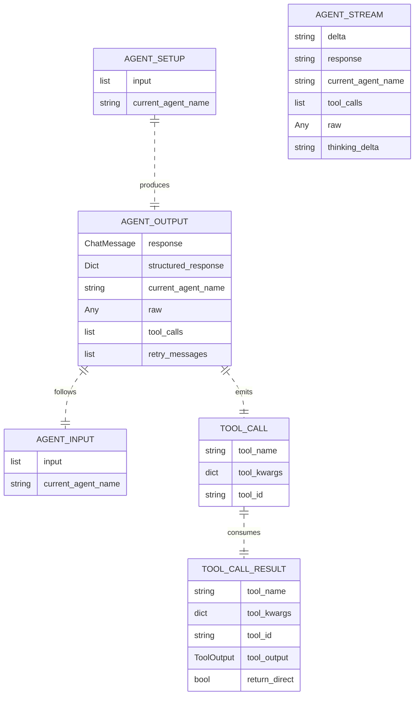
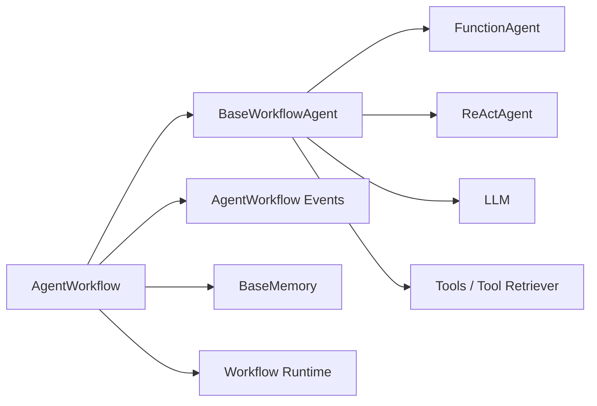

# Multi-Agent Workflows

<cite>
**Referenced Files in This Document**
- [multi_agent_workflow.py](file://llama-index-core/llama_index/core/agent/workflow/multi_agent_workflow.py)
- [base_agent.py](file://llama-index-core/llama_index/core/agent/workflow/base_agent.py)
- [function_agent.py](file://llama-index-core/llama_index/core/agent/workflow/function_agent.py)
- [react_agent.py](file://llama-index-core/llama_index/core/agent/workflow/react_agent.py)
- [workflow_events.py](file://llama-index-core/llama_index/core/agent/workflow/workflow_events.py)
- [prompts.py](file://llama-index-core/llama_index/core/agent/workflow/prompts.py)
- [workflow.py](file://llama-index-core/llama_index/core/workflow/workflow.py)
- [test_multi_agent_workflow.py](file://llama-index-core/tests/agent/workflow/test_multi_agent_workflow.py)
- [test_single_agent_workflow.py](file://llama-index-core/tests/agent/workflow/test_single_agent_workflow.py)
- [test_code_act_agent.py](file://llama-index-core/tests/agent/workflow/test_code_act_agent.py)
- [test_react_agent.py](file://llama-index-core/tests/agent/workflow/test_react_agent.py)
- [test_agent_with_structured_output.py](file://llama-index-core/tests/agent/workflow/test_agent_with_structured_output.py)
</cite>

## Table of Contents
1. [Introduction](#introduction)
2. [Project Structure](#project-structure)
3. [Core Components](#core-components)
4. [Architecture Overview](#architecture-overview)
5. [Detailed Component Analysis](#detailed-component-analysis)
6. [Dependency Analysis](#dependency-analysis)
7. [Performance Considerations](#performance-considerations)
8. [Troubleshooting Guide](#troubleshooting-guide)
9. [Conclusion](#conclusion)
10. [Appendices](#appendices)

## Introduction
This document explains multi-agent workflows in LlamaIndex, focusing on orchestration patterns, agent collaboration, inter-agent communication, shared memory, state synchronization, and coordination protocols. It covers workflow composition, conditional branching, error handling, and practical examples such as research team workflows, specialized agent pipelines, and hierarchical agent architectures. Guidance is also provided on scalability, performance monitoring, debugging, designing agent roles, managing dependencies, and optimizing execution.

## Project Structure
The multi-agent workflow implementation centers around a workflow orchestrator that coordinates multiple agents, manages shared memory, and routes control via tool-based handoffs. Agents encapsulate reasoning and tool-use logic, while events define the communication protocol between steps.

**Diagram sources**
- [multi_agent_workflow.py](file://llama-index-core/llama_index/core/agent/workflow/multi_agent_workflow.py#L96-L114)
- [base_agent.py](file://llama-index-core/llama_index/core/agent/workflow/base_agent.py#L83-L138)
- [function_agent.py](file://llama-index-core/llama_index/core/agent/workflow/function_agent.py#L18-L49)
- [react_agent.py](file://llama-index-core/llama_index/core/agent/workflow/react_agent.py#L36-L80)
- [workflow_events.py](file://llama-index-core/llama_index/core/agent/workflow/workflow_events.py#L24-L112)

**Section sources**
- [multi_agent_workflow.py](file://llama-index-core/llama_index/core/agent/workflow/multi_agent_workflow.py#L96-L114)
- [base_agent.py](file://llama-index-core/llama_index/core/agent/workflow/base_agent.py#L83-L138)

## Core Components
- AgentWorkflow: Orchestrates multiple agents, manages shared memory, routing, and handoffs. Supports early stopping and structured output generation.
- BaseWorkflowAgent: Abstract base for agents, defining common fields (name, description, tools, tool_retriever, can_handoff_to, llm, initial_state, state_prompt, output_cls, structured_output_fn, streaming, early_stopping_method), lifecycle steps, and tool invocation.
- FunctionAgent: Uses function-calling LLMs to produce tool calls and responses in a single step.
- ReActAgent: Implements a reasoning loop (Think/Action/Observe/Answer) with explicit parsing and streaming support.
- Events: Define the contract for input, output, tool calls, streaming deltas, and structured outputs.
- Prompts: Handoff prompt, state injection prompt, and early stopping prompt.

Key capabilities:
- Shared memory via BaseMemory (ChatMemoryBuffer by default).
- Dynamic tool retrieval via tool_retriever.
- Conditional handoff via a generated FunctionTool named “handoff”.
- Structured output via output_cls or structured_output_fn.
- Streaming deltas and tool call events for real-time feedback.

**Section sources**
- [multi_agent_workflow.py](file://llama-index-core/llama_index/core/agent/workflow/multi_agent_workflow.py#L96-L182)
- [base_agent.py](file://llama-index-core/llama_index/core/agent/workflow/base_agent.py#L83-L270)
- [function_agent.py](file://llama-index-core/llama_index/core/agent/workflow/function_agent.py#L18-L196)
- [react_agent.py](file://llama-index-core/llama_index/core/agent/workflow/react_agent.py#L36-L301)
- [workflow_events.py](file://llama-index-core/llama_index/core/agent/workflow/workflow_events.py#L24-L145)
- [prompts.py](file://llama-index-core/llama_index/core/agent/workflow/prompts.py#L1-L20)

## Architecture Overview
The AgentWorkflow composes a directed agent graph with a root agent and optional handoff edges. It initializes shared context (memory, agents list, handoff permissions, state, iteration counters) and routes control between agents based on tool outputs and handoff decisions.

**Diagram sources**
- [multi_agent_workflow.py](file://llama-index-core/llama_index/core/agent/workflow/multi_agent_workflow.py#L378-L743)
- [base_agent.py](file://llama-index-core/llama_index/core/agent/workflow/base_agent.py#L424-L710)
- [workflow_events.py](file://llama-index-core/llama_index/core/agent/workflow/workflow_events.py#L24-L112)

## Detailed Component Analysis

### AgentWorkflow Orchestration
Responsibilities:
- Validates agents and ensures unique names and descriptions for multi-agent setups.
- Builds a dynamic “handoff” tool per agent based on can_handoff_to permissions.
- Manages shared context (memory, agents, handoff permissions, state, iteration limits).
- Streams deltas and structured outputs; supports early stopping with a final LLM-generated response.

Handoff mechanism:
- Generates a FunctionTool named “handoff” with a prompt derived from available agents.
- On successful handoff, sets next_agent in context and emits a handoff output message.

Structured output:
- Supports two modes: output_cls (schema-based) and structured_output_fn (custom function).
- Emits AgentStreamStructuredOutput events for real-time updates.

Early stopping:
- Two strategies: “force” (raises error) and “generate” (final LLM summary).

**Diagram sources**
- [multi_agent_workflow.py](file://llama-index-core/llama_index/core/agent/workflow/multi_agent_workflow.py#L378-L743)

**Section sources**
- [multi_agent_workflow.py](file://llama-index-core/llama_index/core/agent/workflow/multi_agent_workflow.py#L96-L182)
- [multi_agent_workflow.py](file://llama-index-core/llama_index/core/agent/workflow/multi_agent_workflow.py#L213-L264)
- [multi_agent_workflow.py](file://llama-index-core/llama_index/core/agent/workflow/multi_agent_workflow.py#L378-L743)
- [prompts.py](file://llama-index-core/llama_index/core/agent/workflow/prompts.py#L1-L20)

### BaseWorkflowAgent Lifecycle
Defines the canonical agent lifecycle:
- init_run: initializes memory, state, iteration counters, and user message context.
- setup_agent: prepends system prompt and optionally injects state into the latest user message.
- run_agent_step: invokes take_step with tools and memory.
- parse_agent_output: increments iterations, handles retries, triggers finalize, and emits structured outputs.
- call_tool: resolves tool by name and executes it asynchronously.
- aggregate_tool_results: collects tool results, updates state, applies return-direct semantics, and decides next agent or termination.

Common features:
- Streaming-aware LLM calls.
- Tool validation and conversion to async tools.
- Error wrapping for tool failures with is_error flag.

**Diagram sources**
- [base_agent.py](file://llama-index-core/llama_index/core/agent/workflow/base_agent.py#L83-L270)

**Section sources**
- [base_agent.py](file://llama-index-core/llama_index/core/agent/workflow/base_agent.py#L232-L252)
- [base_agent.py](file://llama-index-core/llama_index/core/agent/workflow/base_agent.py#L424-L710)

### FunctionAgent
- Requires a function-calling LLM.
- Produces a ChatResponse with embedded tool calls.
- Maintains a scratchpad of messages and appends tool observations.
- Supports parallel vs sequential tool calls via allow_parallel_tool_calls.
- Emits AgentStream events with tool_calls during streaming.

**Diagram sources**
- [function_agent.py](file://llama-index-core/llama_index/core/agent/workflow/function_agent.py#L31-L145)

**Section sources**
- [function_agent.py](file://llama-index-core/llama_index/core/agent/workflow/function_agent.py#L18-L196)

### ReActAgent
- Formats reasoning steps and chat history into a single input.
- Parses outputs into reasoning steps; supports streaming deltas.
- Maintains a reasoning log and appends observations after tool calls.
- Emits AgentStream events and removes “Answer:” prefix on finalization.

**Diagram sources**
- [react_agent.py](file://llama-index-core/llama_index/core/agent/workflow/react_agent.py#L116-L232)

**Section sources**
- [react_agent.py](file://llama-index-core/llama_index/core/agent/workflow/react_agent.py#L36-L301)

### Events and Communication Protocol
- AgentInput/AgentSetup/AgentOutput: define the core message flow.
- AgentStream: streams deltas, tool_calls, and raw LLM outputs.
- ToolCall/ToolCallResult: decouple tool invocation from agent logic.
- AgentWorkflowStartEvent: validates and serializes start inputs.

**Diagram sources**
- [workflow_events.py](file://llama-index-core/llama_index/core/agent/workflow/workflow_events.py#L24-L145)

**Section sources**
- [workflow_events.py](file://llama-index-core/llama_index/core/agent/workflow/workflow_events.py#L24-L145)

## Dependency Analysis
- AgentWorkflow depends on:
  - BaseWorkflowAgent subclasses (FunctionAgent, ReActAgent).
  - Tool retrieval and asynchronous tool execution.
  - Shared memory abstraction.
  - Workflow runtime primitives (Context, StartEvent, StopEvent, step).
- BaseWorkflowAgent depends on:
  - LLM abstractions (function calling vs chat).
  - Tool validation/conversion.
  - Memory persistence.
- Events define a stable contract enabling loose coupling between agents and the orchestrator.

**Diagram sources**
- [multi_agent_workflow.py](file://llama-index-core/llama_index/core/agent/workflow/multi_agent_workflow.py#L96-L114)
- [base_agent.py](file://llama-index-core/llama_index/core/agent/workflow/base_agent.py#L83-L138)
- [workflow.py](file://llama-index-core/llama_index/core/workflow/workflow.py#L1-L2)

**Section sources**
- [multi_agent_workflow.py](file://llama-index-core/llama_index/core/agent/workflow/multi_agent_workflow.py#L96-L114)
- [base_agent.py](file://llama-index-core/llama_index/core/agent/workflow/base_agent.py#L83-L138)
- [workflow.py](file://llama-index-core/llama_index/core/workflow/workflow.py#L1-L2)

## Performance Considerations
- Streaming: Enable streaming for long-running agents to improve perceived latency and throughput. Both BaseWorkflowAgent and agents support streaming.
- Parallel tool calls: FunctionAgent allows parallel tool execution to reduce total latency when tools are independent.
- Early stopping: Choose “generate” to avoid abrupt termination and provide a final synthesis.
- Memory efficiency: Prefer concise state prompts and avoid storing large intermediate artifacts in memory.
- Tool retrieval: Use tool_retriever to dynamically fetch tools, reducing static tool lists and improving relevance.
- Iteration limits: Tune max_iterations to balance quality and cost.

[No sources needed since this section provides general guidance]

## Troubleshooting Guide
Common issues and resolutions:
- Empty streaming response: Ensure the LLM supports streaming and that the agent’s streaming flag is set appropriately.
- Tool not found: Verify tool names match exactly; the orchestrator emits an error message when a tool is unavailable.
- Handoff errors: Confirm can_handoff_to permissions and that the target agent exists in the agents list.
- Structured output validation: If Pydantic validation fails, adjust the output schema or disable strict validation warnings.
- Max iterations exceeded: Increase max_iterations or switch to early_stopping_method="generate".

**Section sources**
- [base_agent.py](file://llama-index-core/llama_index/core/agent/workflow/base_agent.py#L334-L368)
- [multi_agent_workflow.py](file://llama-index-core/llama_index/core/agent/workflow/multi_agent_workflow.py#L627-L663)
- [workflow_events.py](file://llama-index-core/llama_index/core/agent/workflow/workflow_events.py#L80-L90)

## Conclusion
LlamaIndex’s multi-agent workflows provide a robust, extensible framework for orchestrating heterogeneous agents with shared memory, dynamic handoffs, and structured outputs. By leveraging standardized events, tool abstractions, and configurable agents (function-calling or ReAct), teams can design scalable, observable, and maintainable multi-agent systems for complex tasks.

[No sources needed since this section summarizes without analyzing specific files]

## Appendices

### Designing Agent Roles and Dependencies
- Role definition: Clearly specify agent name, description, and can_handoff_to relationships.
- Tool exposure: Provide tools statically or via tool_retriever; ensure tools are async-compatible.
- State management: Use initial_state and state_prompt to inject contextual information into prompts.
- Coordination: Use handoff tool for explicit transitions; avoid cycles in handoff graphs.

**Section sources**
- [base_agent.py](file://llama-index-core/llama_index/core/agent/workflow/base_agent.py#L90-L138)
- [multi_agent_workflow.py](file://llama-index-core/llama_index/core/agent/workflow/multi_agent_workflow.py#L213-L264)

### Workflow Composition and Conditional Branching
- Composition: Chain agents by configuring can_handoff_to edges; the orchestrator enforces permissions.
- Branching: Use tool outputs and return_direct semantics to short-circuit or hand off.
- Hierarchical: Build a tree with a root agent delegating to specialists.

**Section sources**
- [multi_agent_workflow.py](file://llama-index-core/llama_index/core/agent/workflow/multi_agent_workflow.py#L693-L743)

### Examples and Tests
- Single-agent workflow: Demonstrates basic agent lifecycle and structured output.
- Multi-agent workflow: Shows handoff and shared memory usage.
- ReAct agent tests: Validate reasoning loop and parsing.
- Function agent tests: Validate tool-calling behavior.
- Structured output tests: Validate schema-based outputs.

**Section sources**
- [test_single_agent_workflow.py](file://llama-index-core/tests/agent/workflow/test_single_agent_workflow.py)
- [test_multi_agent_workflow.py](file://llama-index-core/tests/agent/workflow/test_multi_agent_workflow.py)
- [test_react_agent.py](file://llama-index-core/tests/agent/workflow/test_react_agent.py)
- [test_code_act_agent.py](file://llama-index-core/tests/agent/workflow/test_code_act_agent.py)
- [test_agent_with_structured_output.py](file://llama-index-core/tests/agent/workflow/test_agent_with_structured_output.py)