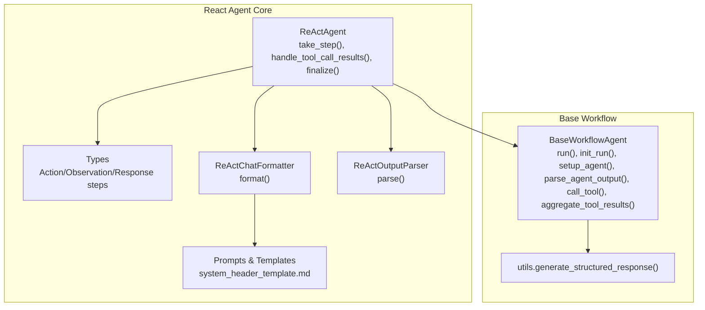
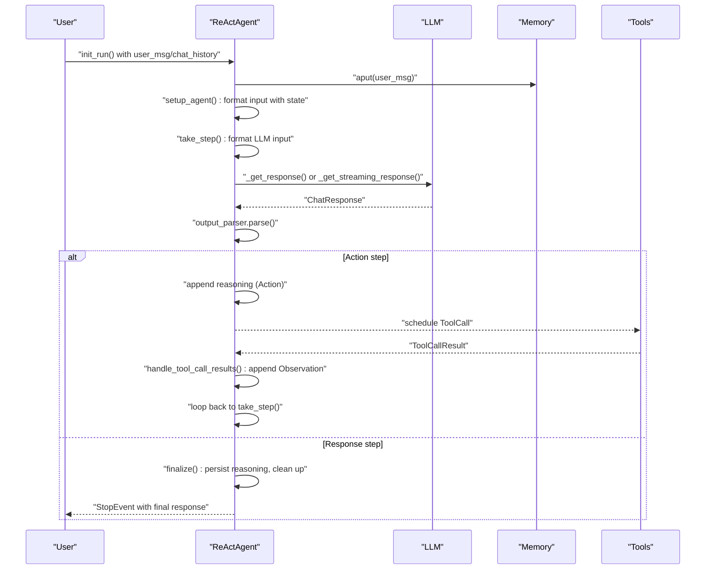
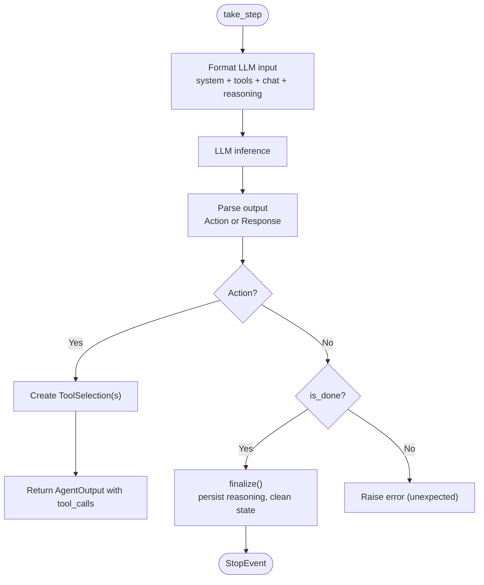
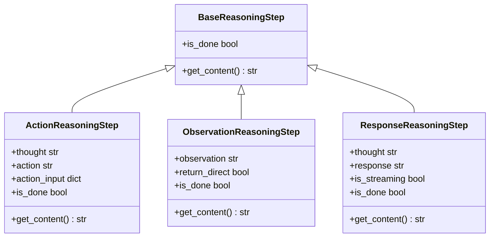
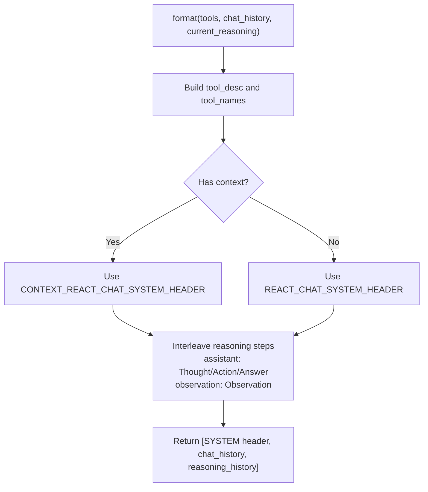
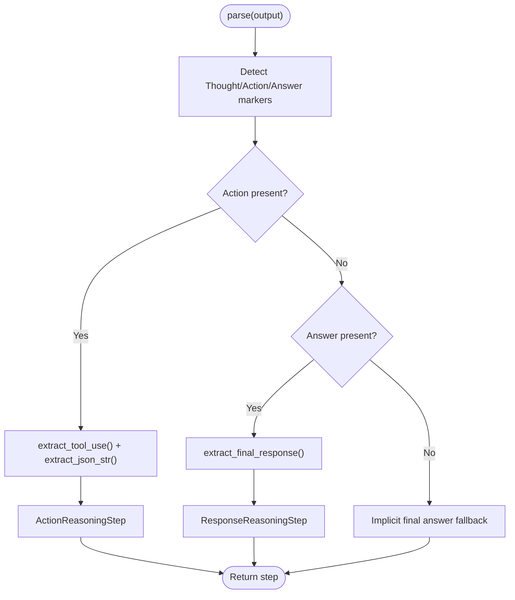
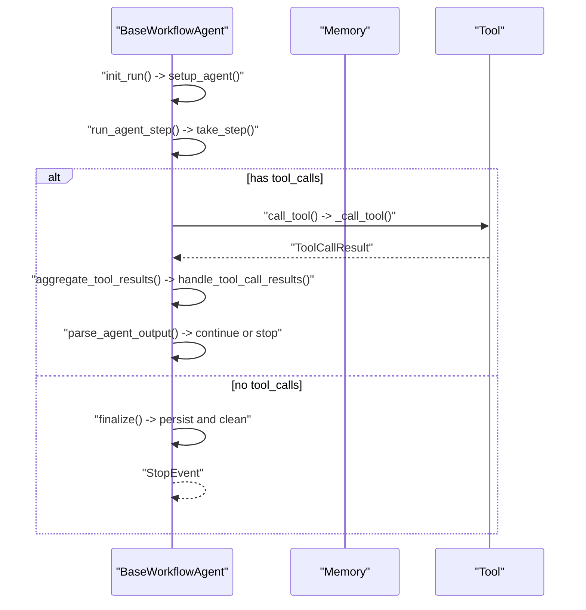
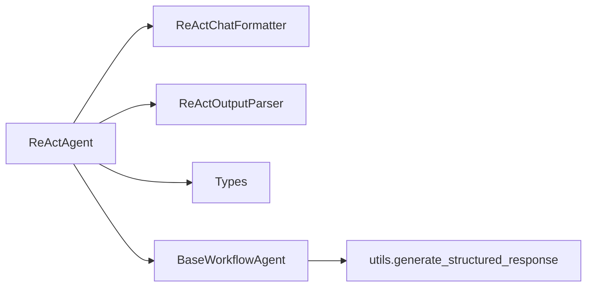

# React Agents

<cite>
**Referenced Files in This Document**
- [react_agent.py](file://llama-index-core/llama_index/core/agent/workflow/react_agent.py)
- [types.py](file://llama-index-core/llama_index/core/agent/react/types.py)
- [formatter.py](file://llama-index-core/llama_index/core/agent/react/formatter.py)
- [output_parser.py](file://llama-index-core/llama_index/core/agent/react/output_parser.py)
- [prompts.py](file://llama-index-core/llama_index/core/agent/react/prompts.py)
- [system_header_template.md](file://llama-index-core/llama_index/core/agent/react/templates/system_header_template.md)
- [base_agent.py](file://llama-index-core/llama_index/core/agent/workflow/base_agent.py)
- [utils.py](file://llama-index-core/llama_index/core/agent/utils.py)
</cite>

## Table of Contents
1. [Introduction](#introduction)
2. [Project Structure](#project-structure)
3. [Core Components](#core-components)
4. [Architecture Overview](#architecture-overview)
5. [Detailed Component Analysis](#detailed-component-analysis)
6. [Dependency Analysis](#dependency-analysis)
7. [Performance Considerations](#performance-considerations)
8. [Troubleshooting Guide](#troubleshooting-guide)
9. [Conclusion](#conclusion)
10. [Appendices](#appendices)

## Introduction
This document explains React agents in LlamaIndex: how they think through problems systematically, how they select and execute tools, and how they maintain reasoning traces and memory. It covers the reasoning-acting cycle, chain-of-thought prompting, tool selection and execution, configuration options, memory and state management, and practical examples for building research assistants, code execution agents, and multi-step problem solvers. It also provides debugging techniques, performance optimization tips, and guidance on integrating with query engines and customizing reasoning patterns.

## Project Structure
React agents are implemented as a specialized agent workflow built on top of the generic BaseWorkflowAgent. The key pieces are:
- React agent orchestrator that drives the reasoning-acting loop
- Types that represent reasoning steps
- Formatter that constructs the LLM input from tools, chat history, and reasoning
- Output parser that extracts Thought/Action/Answer or Thought/Answer patterns
- Prompts and templates that define the system header and output format
- Base workflow agent that manages memory, tool execution, iteration limits, and streaming

**Diagram sources**
- [react_agent.py](file://llama-index-core/llama_index/core/agent/workflow/react_agent.py#L36-L301)
- [types.py](file://llama-index-core/llama_index/core/agent/react/types.py#L9-L76)
- [formatter.py](file://llama-index-core/llama_index/core/agent/react/formatter.py#L51-L141)
- [output_parser.py](file://llama-index-core/llama_index/core/agent/react/output_parser.py#L69-L128)
- [prompts.py](file://llama-index-core/llama_index/core/agent/react/prompts.py#L1-L23)
- [base_agent.py](file://llama-index-core/llama_index/core/agent/workflow/base_agent.py#L83-L754)
- [utils.py](file://llama-index-core/llama_index/core/agent/utils.py#L35-L43)

**Section sources**
- [react_agent.py](file://llama-index-core/llama_index/core/agent/workflow/react_agent.py#L36-L301)
- [base_agent.py](file://llama-index-core/llama_index/core/agent/workflow/base_agent.py#L83-L754)

## Core Components
- ReActAgent: Orchestrates the reasoning-acting loop, formats inputs, parses outputs, tracks reasoning steps, and manages memory.
- Types: Define the reasoning steps (Action, Observation, Response) and whether a step terminates the process.
- ReActChatFormatter: Builds the system header, tool descriptions, and interleaved reasoning history into a chat input.
- ReActOutputParser: Parses LLM outputs into reasoning steps, handling Thought/Action/Action Input or Thought/Answer formats.
- BaseWorkflowAgent: Provides the runtime framework for running agents, managing memory, tool execution, iteration limits, and streaming.

Key responsibilities:
- Chain-of-thought prompting and output formatting
- Tool selection and execution with structured inputs
- Memory and state persistence across iterations
- Streaming and structured output generation

**Section sources**
- [react_agent.py](file://llama-index-core/llama_index/core/agent/workflow/react_agent.py#L36-L301)
- [types.py](file://llama-index-core/llama_index/core/agent/react/types.py#L9-L76)
- [formatter.py](file://llama-index-core/llama_index/core/agent/react/formatter.py#L51-L141)
- [output_parser.py](file://llama-index-core/llama_index/core/agent/react/output_parser.py#L69-L128)
- [base_agent.py](file://llama-index-core/llama_index/core/agent/workflow/base_agent.py#L83-L754)

## Architecture Overview
The React agent follows a strict reasoning-acting cycle:
1. Build input: Combine system prompt, chat history, and current reasoning into a formatted chat.
2. LLM inference: Get a response containing Thought/Action/Action Input or Thought/Answer.
3. Parse: Convert the response into a reasoning step.
4. If Action: schedule tool call(s); if Answer: finalize.
5. After tool execution: append Observation and continue until Done.

**Diagram sources**
- [react_agent.py](file://llama-index-core/llama_index/core/agent/workflow/react_agent.py#L116-L301)
- [base_agent.py](file://llama-index-core/llama_index/core/agent/workflow/base_agent.py#L424-L711)

## Detailed Component Analysis

### ReActAgent: reasoning-acting loop
- Formatting: Uses ReActChatFormatter to combine system header, tools, chat history, and current reasoning.
- Parsing: Uses ReActOutputParser to extract Action or Response steps.
- Iteration control: Integrates with BaseWorkflowAgent’s run loop, enforcing max iterations and early stopping.
- Memory: Persists reasoning steps and final answers to memory; clears scratchpad after completion.

**Diagram sources**
- [react_agent.py](file://llama-index-core/llama_index/core/agent/workflow/react_agent.py#L116-L232)
- [output_parser.py](file://llama-index-core/llama_index/core/agent/react/output_parser.py#L69-L128)

**Section sources**
- [react_agent.py](file://llama-index-core/llama_index/core/agent/workflow/react_agent.py#L36-L301)

### Types: reasoning step model
- ActionReasoningStep: Encodes Thought, Action, and Action Input; not terminal.
- ObservationReasoningStep: Encodes Observation and optional return_direct flag; terminal if return_direct is true.
- ResponseReasoningStep: Encodes Thought and final Answer; always terminal.

**Diagram sources**
- [types.py](file://llama-index-core/llama_index/core/agent/react/types.py#L9-L76)

**Section sources**
- [types.py](file://llama-index-core/llama_index/core/agent/react/types.py#L9-L76)

### Formatter: constructing the LLM input
- Generates system header with tool descriptions and optional context.
- Interleaves current reasoning as alternating assistant/user/tool messages.
- Supports configurable observation role to leverage tool/function calling capabilities.

**Diagram sources**
- [formatter.py](file://llama-index-core/llama_index/core/agent/react/formatter.py#L65-L104)
- [prompts.py](file://llama-index-core/llama_index/core/agent/react/prompts.py#L11-L22)

**Section sources**
- [formatter.py](file://llama-index-core/llama_index/core/agent/react/formatter.py#L51-L141)
- [prompts.py](file://llama-index-core/llama_index/core/agent/react/prompts.py#L1-L23)
- [system_header_template.md](file://llama-index-core/llama_index/core/agent/react/templates/system_header_template.md#L1-L49)

### Output Parser: extracting Thought/Action/Answer
- Extracts Thought/Action/Action Input or Thought/Answer using regex.
- Handles malformed JSON in Action Input by attempting lenient parsing.
- Implicit final answer fallback when only a final answer is produced.

**Diagram sources**
- [output_parser.py](file://llama-index-core/llama_index/core/agent/react/output_parser.py#L69-L128)

**Section sources**
- [output_parser.py](file://llama-index-core/llama_index/core/agent/react/output_parser.py#L69-L128)

### BaseWorkflowAgent: runtime, memory, and tool orchestration
- Manages memory buffer, initial state, max iterations, and early stopping.
- Streams deltas and structured outputs when enabled.
- Executes tools, aggregates results, and decides whether to continue or stop.
- Supports structured output generation via XML formatting and a structured LLM wrapper.

**Diagram sources**
- [base_agent.py](file://llama-index-core/llama_index/core/agent/workflow/base_agent.py#L424-L711)
- [utils.py](file://llama-index-core/llama_index/core/agent/utils.py#L35-L43)

**Section sources**
- [base_agent.py](file://llama-index-core/llama_index/core/agent/workflow/base_agent.py#L83-L754)
- [utils.py](file://llama-index-core/llama_index/core/agent/utils.py#L35-L43)

## Dependency Analysis
- ReActAgent depends on:
  - ReActChatFormatter for input construction
  - ReActOutputParser for step extraction
  - BaseReasoningStep types for internal state
  - BaseWorkflowAgent for runtime orchestration
  - Memory for persistence and streaming
  - Tools for execution

**Diagram sources**
- [react_agent.py](file://llama-index-core/llama_index/core/agent/workflow/react_agent.py#L36-L301)
- [formatter.py](file://llama-index-core/llama_index/core/agent/react/formatter.py#L51-L141)
- [output_parser.py](file://llama-index-core/llama_index/core/agent/react/output_parser.py#L69-L128)
- [types.py](file://llama-index-core/llama_index/core/agent/react/types.py#L9-L76)
- [base_agent.py](file://llama-index-core/llama_index/core/agent/workflow/base_agent.py#L83-L754)
- [utils.py](file://llama-index-core/llama_index/core/agent/utils.py#L35-L43)

**Section sources**
- [react_agent.py](file://llama-index-core/llama_index/core/agent/workflow/react_agent.py#L36-L301)
- [base_agent.py](file://llama-index-core/llama_index/core/agent/workflow/base_agent.py#L83-L754)

## Performance Considerations
- Streaming: Enable streaming to reduce latency and improve interactivity; supported by BaseWorkflowAgent’s streaming logic.
- Tool selection: Keep tool schemas concise and focused; fewer tools reduce prompt size and parsing overhead.
- Prompt size: Use context-aware formatting to include only relevant context; avoid long system headers.
- Early stopping: Configure max iterations and early stopping method to prevent runaway loops.
- Structured output: Use structured output generation judiciously; it adds extra LLM calls.

[No sources needed since this section provides general guidance]

## Troubleshooting Guide
Common issues and remedies:
- Empty LLM message: The agent raises an error and requests retry messages; ensure the LLM adheres to the expected format.
- Malformed Action Input: The parser attempts lenient JSON parsing; validate tool schemas and inputs.
- Unexpected step types: The agent expects Action or Response; ensure the LLM follows the Thought/Action/Action Input or Thought/Answer patterns.
- Tool not found: The agent reports tool availability; verify tool names and registration.
- Max iterations exceeded: Increase max_iterations or use early_stopping_method='generate' to allow a final response.

**Section sources**
- [react_agent.py](file://llama-index-core/llama_index/core/agent/workflow/react_agent.py#L158-L196)
- [output_parser.py](file://llama-index-core/llama_index/core/agent/react/output_parser.py#L15-L46)
- [base_agent.py](file://llama-index-core/llama_index/core/agent/workflow/base_agent.py#L518-L530)

## Conclusion
React agents in LlamaIndex provide a robust, extensible framework for chain-of-thought reasoning, tool selection, and execution. By combining a clear step model, structured prompting, and a powerful workflow runtime, they enable building intelligent assistants that can research, compute, and solve complex problems iteratively. With careful configuration of memory, tools, and prompts—and by leveraging streaming and structured outputs—you can tailor React agents to a wide range of applications.

[No sources needed since this section summarizes without analyzing specific files]

## Appendices

### Practical Examples and Patterns
- Research assistant: Provide a curated toolset (web search, document retrieval, summarization) and a context-aware system header. Use streaming to display incremental findings and conclusions.
- Code execution agent: Expose safe code execution tools with sandboxing and return_direct behavior for immediate results. Keep reasoning visible to explain decisions.
- Multi-step problem solver: Use memory to carry state across iterations; enforce max iterations with early stopping to produce a final synthesis.

[No sources needed since this section provides general guidance]

### Configuration Options
- ReActAgent
  - system_prompt: Global system instruction
  - formatter: ReActChatFormatter with system_header, context, observation_role
  - output_parser: ReActOutputParser
  - reasoning_key: Store key for current_reasoning
- BaseWorkflowAgent
  - name, description, tools/tool_retriever, can_handoff_to
  - llm, initial_state, state_prompt
  - streaming, early_stopping_method, max iterations
  - output_cls or structured_output_fn for structured outputs

**Section sources**
- [react_agent.py](file://llama-index-core/llama_index/core/agent/workflow/react_agent.py#L36-L78)
- [formatter.py](file://llama-index-core/llama_index/core/agent/react/formatter.py#L51-L126)
- [base_agent.py](file://llama-index-core/llama_index/core/agent/workflow/base_agent.py#L90-L139)

### Integration with Query Engines
- Use BaseWorkflowAgent’s memory to integrate with retrieval/query engines; append query results as Observations.
- Employ structured output generation to synthesize final answers from retrieved context.

**Section sources**
- [base_agent.py](file://llama-index-core/llama_index/core/agent/workflow/base_agent.py#L556-L591)
- [utils.py](file://llama-index-core/llama_index/core/agent/utils.py#L35-L43)