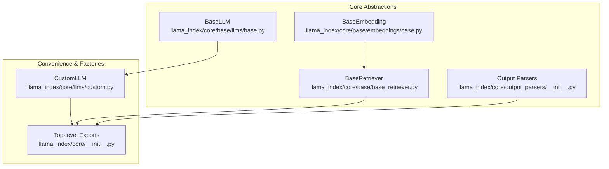
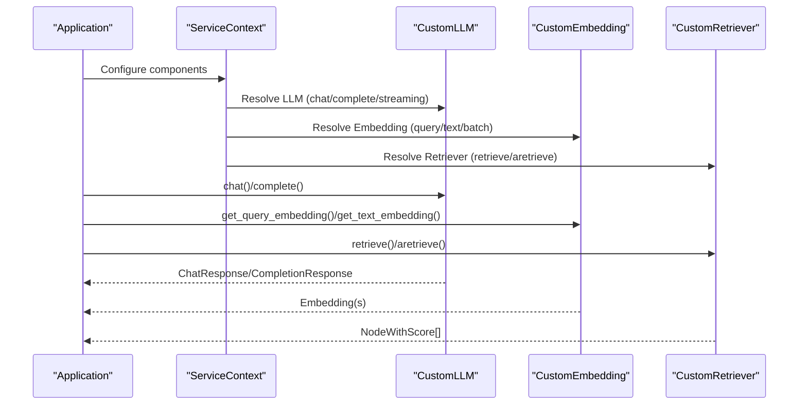
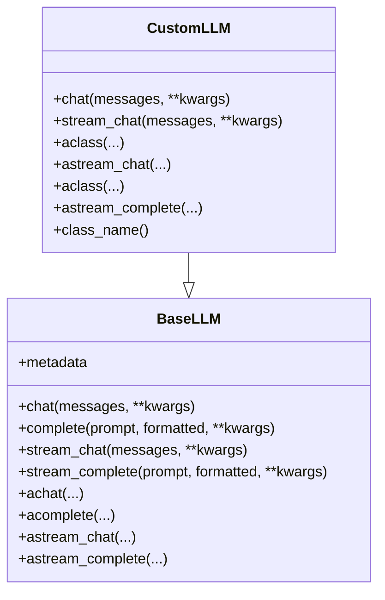
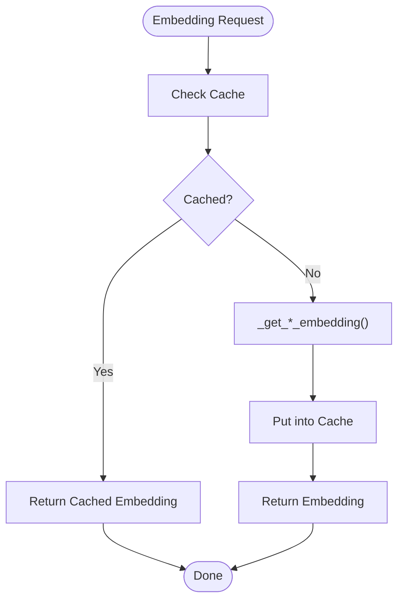
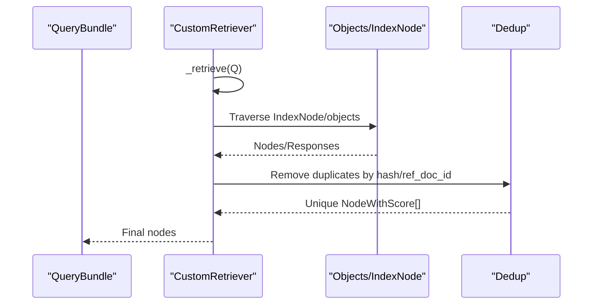
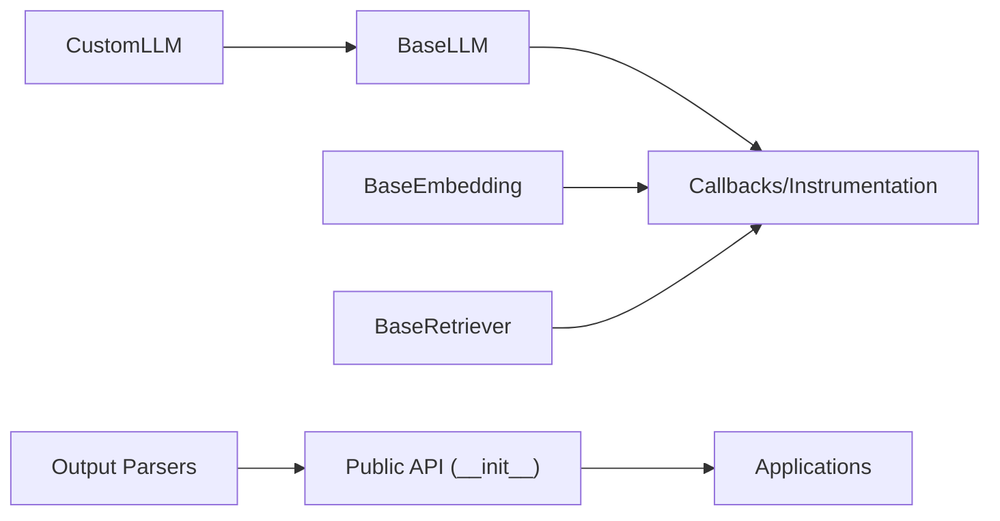

# Custom Integrations

<cite>
**Referenced Files in This Document**
- [__init__.py](file://llama-index-core/llama_index/core/__init__.py)
- [base.py](file://llama-index-core/llama_index/core/base/llms/base.py)
- [custom.py](file://llama-index-core/llama_index/core/llms/custom.py)
- [base.py](file://llama-index-core/llama_index/core/base/embeddings/base.py)
- [base_retriever.py](file://llama-index-core/llama_index/core/base/base_retriever.py)
- [__init__.py](file://llama-index-core/llama_index/core/output_parsers/__init__.py)
- [README.md](file://CONTRIBUTING.md)
</cite>

## Table of Contents
1. [Introduction](#introduction)
2. [Project Structure](#project-structure)
3. [Core Components](#core-components)
4. [Architecture Overview](#architecture-overview)
5. [Detailed Component Analysis](#detailed-component-analysis)
6. [Dependency Analysis](#dependency-analysis)
7. [Performance Considerations](#performance-considerations)
8. [Troubleshooting Guide](#troubleshooting-guide)
9. [Conclusion](#conclusion)
10. [Appendices](#appendices)

## Introduction
This document explains how to build custom integrations in LlamaIndex, focusing on three pillars:
- Custom LLM wrappers
- Custom embedding models
- Custom retrievers

It also covers the plugin architecture, extension points, integration patterns, and best practices for building robust, testable, and maintainable extensions. Practical examples are linked to real files in the repository, and guidance is provided for third-party integrations, prompt engineering, response parsing, and output formatting.

## Project Structure
LlamaIndex organizes its core abstractions under a clear hierarchy:
- LLMs: Base interface and a convenience custom base class
- Embeddings: Base interface for text/query embeddings with caching and batching
- Retrievers: Base interface for retrieval with recursive traversal and instrumentation
- Output Parsers: Extensible output parsing interfaces
- Top-level exports: Public API surface for indices, prompts, readers, and utilities

**Diagram sources**
- [base.py](file://llama-index-core/llama_index/core/base/llms/base.py#L25-L292)
- [custom.py](file://llama-index-core/llama_index/core/llms/custom.py#L22-L92)
- [base.py](file://llama-index-core/llama_index/core/base/embeddings/base.py#L72-L619)
- [base_retriever.py](file://llama-index-core/llama_index/core/base/base_retriever.py#L34-L275)
- [__init__.py](file://llama-index-core/llama_index/core/output_parsers/__init__.py#L1-L14)
- [__init__.py](file://llama-index-core/llama_index/core/__init__.py#L1-L162)

**Section sources**
- [__init__.py](file://llama-index-core/llama_index/core/__init__.py#L1-L162)

## Core Components
- BaseLLM defines the contract for LLMs, including synchronous and asynchronous chat/completion endpoints, streaming variants, and metadata. It integrates with callback/instrumentation systems and supports message conversion helpers.
- CustomLLM extends the LLM base class and provides a minimal path to integrate custom LLMs by implementing core completion/streaming methods and metadata.
- BaseEmbedding defines the embedding interface for queries and texts, with support for batching, caching, and similarity computation. It also exposes async variants and integrates with instrumentation and callbacks.
- BaseRetriever defines the retrieval contract, including synchronous and asynchronous retrieval, recursive traversal across composed objects, and instrumentation around retrieval events.
- Output Parsers expose extensible interfaces for parsing structured outputs, enabling custom response parsing and formatting.

**Section sources**
- [base.py](file://llama-index-core/llama_index/core/base/llms/base.py#L25-L292)
- [custom.py](file://llama-index-core/llama_index/core/llms/custom.py#L22-L92)
- [base.py](file://llama-index-core/llama_index/core/base/embeddings/base.py#L72-L619)
- [base_retriever.py](file://llama-index-core/llama_index/core/base/base_retriever.py#L34-L275)
- [__init__.py](file://llama-index-core/llama_index/core/output_parsers/__init__.py#L1-L14)

## Architecture Overview
The extension architecture centers on pluggable components that adhere to well-defined interfaces. Components can be composed and orchestrated via ServiceContext and top-level factories. Instrumentation and callbacks provide observability hooks for custom implementations.

**Diagram sources**
- [base.py](file://llama-index-core/llama_index/core/base/llms/base.py#L70-L178)
- [custom.py](file://llama-index-core/llama_index/core/llms/custom.py#L33-L87)
- [base.py](file://llama-index-core/llama_index/core/base/embeddings/base.py#L131-L223)
- [base_retriever.py](file://llama-index-core/llama_index/core/base/base_retriever.py#L186-L254)

## Detailed Component Analysis

### Custom LLM Wrapper
To create a custom LLM wrapper:
- Extend the convenience class CustomLLM and implement:
  - metadata property
  - complete(...) and stream_complete(...)
- Optionally override chat/stream_chat if your provider expects chat-style APIs; otherwise rely on the default conversion from chat to completion.
- Use callback decorators to capture timing and events automatically.

**Diagram sources**
- [base.py](file://llama-index-core/llama_index/core/base/llms/base.py#L25-L292)
- [custom.py](file://llama-index-core/llama_index/core/llms/custom.py#L22-L92)

Implementation notes:
- The convenience class delegates chat to completion after converting messages to a prompt, ensuring a single integration surface.
- Streaming chat/completion is supported via generators and async generators.
- Use the provided callback decorators to emit events and integrate with instrumentation.

**Section sources**
- [custom.py](file://llama-index-core/llama_index/core/llms/custom.py#L22-L92)
- [base.py](file://llama-index-core/llama_index/core/base/llms/base.py#L70-L178)

### Custom Embedding Model
To create a custom embedding model:
- Implement BaseEmbedding and define:
  - _get_query_embedding/_aget_query_embedding
  - _get_text_embedding/_aget_text_embedding
  - Optionally _get_text_embeddings/_aget_text_embeddings for batching
- Configure embed_batch_size, optional embeddings_cache (KVStore), and num_workers for async concurrency.
- Use built-in similarity modes and aggregation helpers.

**Diagram sources**
- [base.py](file://llama-index-core/llama_index/core/base/embeddings/base.py#L131-L223)
- [base.py](file://llama-index-core/llama_index/core/base/embeddings/base.py#L284-L348)

Key capabilities:
- Batch generation with progress and configurable batch size
- Async batch generation with optional worker concurrency
- Caching integration via KVStore
- Similarity computation and aggregation helpers

**Section sources**
- [base.py](file://llama-index-core/llama_index/core/base/embeddings/base.py#L72-L619)

### Custom Retriever
To create a custom retriever:
- Implement BaseRetriever and define:
  - _retrieve for synchronous retrieval
  - Optionally _aretrieve for async retrieval
- Leverage recursive traversal across composed objects (IndexNode, BaseRetriever, BaseQueryEngine) and deduplication logic.
- Instrumentation and callbacks are integrated automatically around retrieval.

**Diagram sources**
- [base_retriever.py](file://llama-index-core/llama_index/core/base/base_retriever.py#L186-L254)
- [base_retriever.py](file://llama-index-core/llama_index/core/base/base_retriever.py#L116-L183)

**Section sources**
- [base_retriever.py](file://llama-index-core/llama_index/core/base/base_retriever.py#L34-L275)

### Plugin Architecture and Extension Points
- Top-level exports provide a stable public API surface for indices, prompts, readers, and utilities. This enables third-party packages to integrate cleanly without relying on internal modules.
- Output parsers expose BaseOutputParser and specialized implementations (e.g., Pydantic, LangChain) to parse and format structured outputs.
- Integration patterns:
  - Wrap external providers behind BaseLLM/BaseEmbedding/BaseRetriever
  - Use ServiceContext to wire components together
  - Emit events and leverage callbacks for observability

**Section sources**
- [__init__.py](file://llama-index-core/llama_index/core/__init__.py#L1-L162)
- [__init__.py](file://llama-index-core/llama_index/core/output_parsers/__init__.py#L1-L14)

### Proprietary Model Integration Patterns
- For proprietary or closed-source LLMs:
  - Implement CustomLLM and map chat/completion endpoints to your provider’s SDK
  - Use metadata to advertise capabilities (context window, supports_function_calling, etc.)
  - Provide streaming support if the provider allows incremental tokens
- For proprietary embedding providers:
  - Implement BaseEmbedding and handle batching and caching according to provider limits
  - Respect rate limits and backoff strategies in your implementation

[No sources needed since this section provides general guidance]

### Custom Data Connectors and Specialized Pipelines
- Readers and ingestion pipelines enable connecting diverse data sources. While connector-specific implementations live in integration packages, the base abstractions remain consistent.
- Build connectors by implementing reader interfaces and integrating with ingestion pipelines to transform, chunk, and embed data.

[No sources needed since this section provides general guidance]

### Custom Prompt Engineering, Response Parsing, and Output Formatting
- Prompt engineering: Use prompt templates and composition patterns exposed by the core to construct prompts for your LLMs.
- Response parsing: Use output parsers to enforce structured outputs (e.g., JSON, Pydantic models) and format results consistently.
- Output formatting: Combine response synthesizers with postprocessors to refine answers and citations.

**Section sources**
- [__init__.py](file://llama-index-core/llama_index/core/output_parsers/__init__.py#L1-L14)

## Dependency Analysis
The core abstractions are loosely coupled and rely on shared interfaces and mixins for instrumentation and callbacks. This promotes modularity and enables third-party integrations without tight coupling.

**Diagram sources**
- [base.py](file://llama-index-core/llama_index/core/base/llms/base.py#L25-L292)
- [custom.py](file://llama-index-core/llama_index/core/llms/custom.py#L22-L92)
- [base.py](file://llama-index-core/llama_index/core/base/embeddings/base.py#L72-L619)
- [base_retriever.py](file://llama-index-core/llama_index/core/base/base_retriever.py#L34-L275)
- [__init__.py](file://llama-index-core/llama_index/core/output_parsers/__init__.py#L1-L14)
- [__init__.py](file://llama-index-core/llama_index/core/__init__.py#L1-L162)

**Section sources**
- [__init__.py](file://llama-index-core/llama_index/core/__init__.py#L1-L162)

## Performance Considerations
- Embedding batching: Tune embed_batch_size to balance throughput and latency; leverage async batch generation for higher concurrency.
- Caching: Enable embeddings_cache to avoid recomputation and reduce provider costs.
- Streaming: Prefer streaming endpoints for long responses to improve perceived latency.
- Deduplication: Retrievers automatically deduplicate by hash and ref_doc_id; ensure your custom implementations preserve this behavior.
- Instrumentation: Use built-in spans and callbacks to profile slow components and optimize bottlenecks.

[No sources needed since this section provides general guidance]

## Troubleshooting Guide
- LLM chat conversion: If mixing multimodal content, ensure proper conversion to text before calling chat endpoints.
- Embedding cache errors: Verify that embeddings_cache implements the required KVStore interface; otherwise, disable caching or provide a compatible store.
- Retrieval recursion: When composing retrievers, confirm that IndexNode objects resolve to valid underlying retrievers or query engines.
- Output parsing: Validate that output parsers match the expected schema and handle edge cases gracefully.

**Section sources**
- [base.py](file://llama-index-core/llama_index/core/base/llms/base.py#L50-L68)
- [base.py](file://llama-index-core/llama_index/core/base/embeddings/base.py#L100-L110)
- [base_retriever.py](file://llama-index-core/llama_index/core/base/base_retriever.py#L116-L183)
- [__init__.py](file://llama-index-core/llama_index/core/output_parsers/__init__.py#L1-L14)

## Conclusion
By adhering to the BaseLLM, BaseEmbedding, and BaseRetriever interfaces—and leveraging the convenience CustomLLM—you can build robust, testable, and observable custom integrations. Combine these components with output parsers, instrumentation, and the public API surface to deliver production-ready solutions that integrate seamlessly with the broader LlamaIndex ecosystem.

[No sources needed since this section summarizes without analyzing specific files]

## Appendices

### Contribution Guidelines
Follow the repository’s contribution guidelines for submitting extensions and integrations. Ensure:
- Clear documentation and examples
- Tests covering core behaviors
- Compatibility with existing interfaces
- Observability via callbacks and instrumentation

**Section sources**
- [README.md](file://CONTRIBUTING.md)