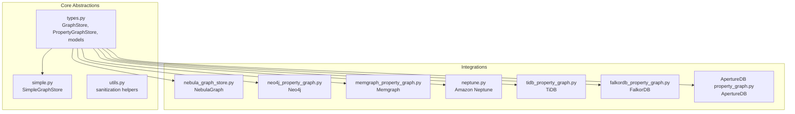
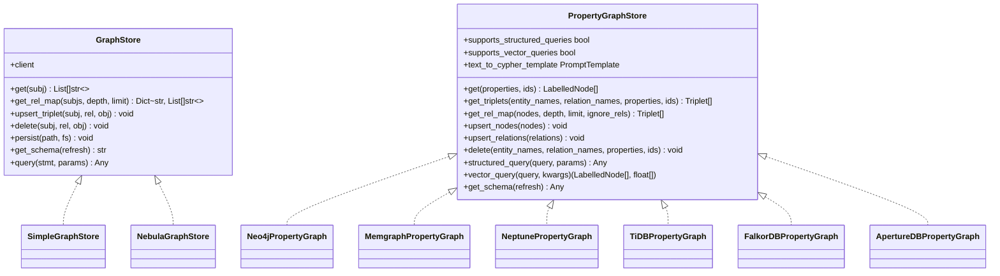
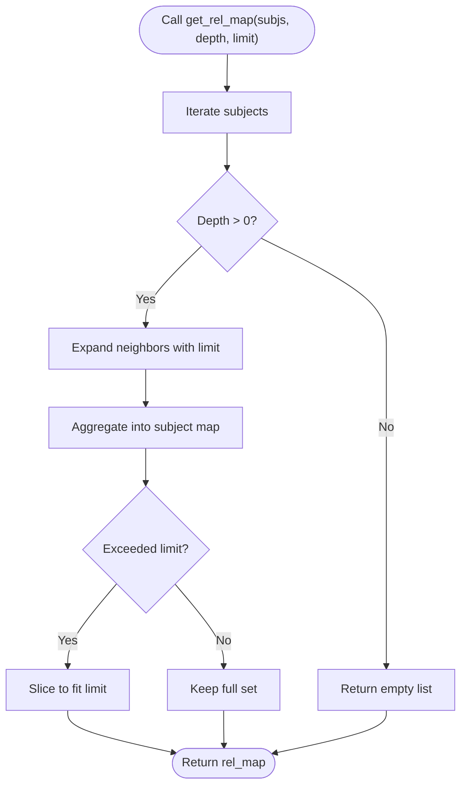
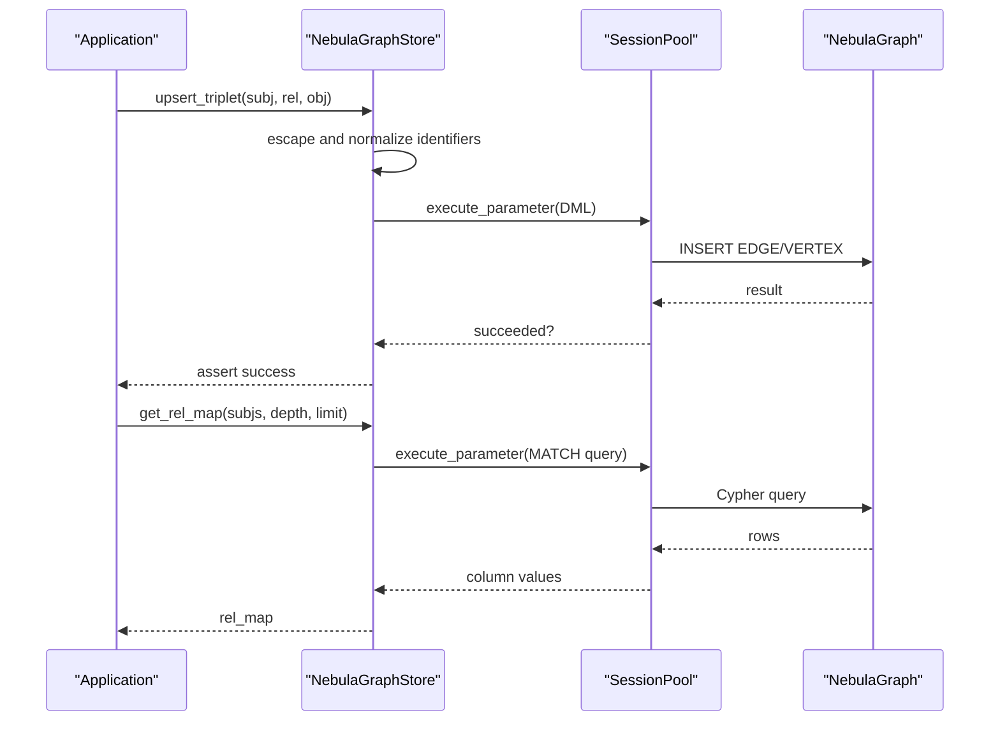
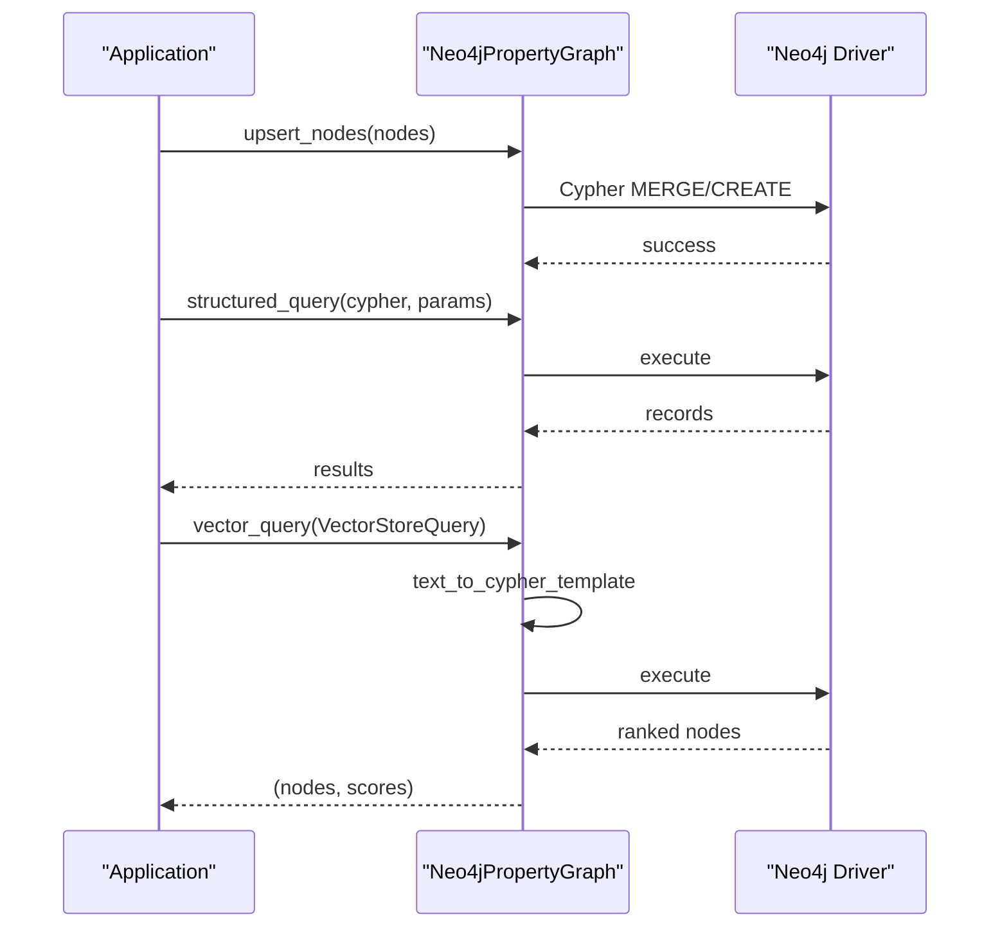
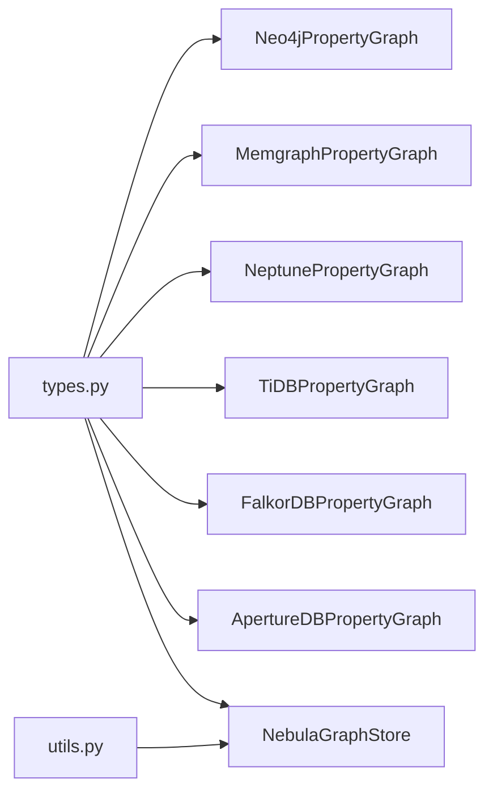
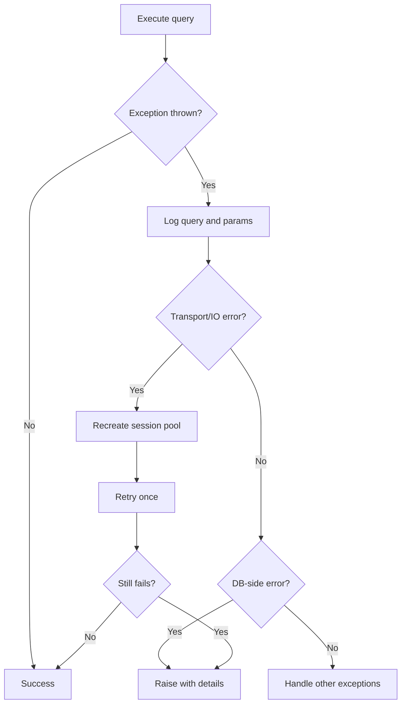

# Graph Database Integration

<cite>
**Referenced Files in This Document**
- [types.py](file://llama-index-core/llama_index/core/graph_stores/types.py)
- [simple.py](file://llama-index-core/llama_index/core/graph_stores/simple.py)
- [utils.py](file://llama-index-core/llama_index/core/graph_stores/utils.py)
- [nebula_graph_store.py](file://llama-index-integrations/graph_stores/llama-index-graph-stores-nebula/llama_index/graph_stores/nebula/nebula_graph_store.py)
- [neo4j_property_graph.py](file://llama-index-integrations/graph_stores/llama-index-graph-stores-neo4j/llama_index/graph_stores/neo4j/neo4j_property_graph.py)
- [memgraph_property_graph.py](file://llama-index-integrations/graph_stores/llama-index-graph-stores-memgraph/llama_index/graph_stores/memgraph/property_graph.py)
- [neptune.py](file://llama-index-integrations/graph_stores/llama-index-graph-stores-neptune/llama_index/graph_stores/neptune/neptune.py)
- [tidb_property_graph.py](file://llama-index-integrations/graph_stores/llama-index-graph-stores-tidb/llama_index/graph_stores/tidb/property_graph.py)
- [falkordb_property_graph.py](file://llama-index-integrations/graph_stores/llama-index-graph-stores-falkordb/llama_index/graph_stores/falkordb/falkordb_property_graph.py)
- [ApertureDB property_graph.py](file://llama-index-integrations/graph_stores/llama-index-graph-stores-ApertureDB/llama_index/graph_stores/ApertureDB/property_graph.py)
- [__init__.py](file://llama-index-core/llama_index/core/graph_stores/__init__.py)
</cite>

## Table of Contents
1. [Introduction](#introduction)
2. [Project Structure](#project-structure)
3. [Core Components](#core-components)
4. [Architecture Overview](#architecture-overview)
5. [Detailed Component Analysis](#detailed-component-analysis)
6. [Dependency Analysis](#dependency-analysis)
7. [Performance Considerations](#performance-considerations)
8. [Troubleshooting Guide](#troubleshooting-guide)
9. [Conclusion](#conclusion)
10. [Appendices](#appendices)

## Introduction
This document explains how LlamaIndex integrates with graph databases through a unified graph store abstraction. It covers:
- Abstraction layer for graph stores and property graphs
- Connectivity and configuration patterns for Neo4j, Amazon Neptune, Memgraph, NebulaGraph, and other providers
- Query translation and data synchronization patterns
- Deployment, scaling, and high availability strategies
- Examples of initialization, connection pooling, error handling, performance tuning, backup, and monitoring
- Guidance for selecting a graph store and migrating between providers

## Project Structure
LlamaIndex provides:
- A core abstraction for graph stores and property graphs
- A simple in-memory graph store for development
- Integrations for multiple graph databases via provider-specific implementations

**Diagram sources**
- [types.py](file://llama-index-core/llama_index/core/graph_stores/types.py#L215-L528)
- [simple.py](file://llama-index-core/llama_index/core/graph_stores/simple.py#L72-L187)
- [utils.py](file://llama-index-core/llama_index/core/graph_stores/utils.py#L1-L55)
- [nebula_graph_store.py](file://llama-index-integrations/graph_stores/llama-index-graph-stores-nebula/llama_index/graph_stores/nebula/nebula_graph_store.py#L109-L675)
- [neo4j_property_graph.py](file://llama-index-integrations/graph_stores/llama-index-graph-stores-neo4j/llama_index/graph_stores/neo4j/neo4j_property_graph.py)
- [memgraph_property_graph.py](file://llama-index-integrations/graph_stores/llama-index-graph-stores-memgraph/llama_index/graph_stores/memgraph/property_graph.py)
- [neptune.py](file://llama-index-integrations/graph_stores/llama-index-graph-stores-neptune/llama_index/graph_stores/neptune/neptune.py)
- [tidb_property_graph.py](file://llama-index-integrations/graph_stores/llama-index-graph-stores-tidb/llama_index/graph_stores/tidb/property_graph.py)
- [falkordb_property_graph.py](file://llama-index-integrations/graph_stores/llama-index-graph-stores-falkordb/llama_index/graph_stores/falkordb/falkordb_property_graph.py)
- [ApertureDB property_graph.py](file://llama-index-integrations/graph_stores/llama-index-graph-stores-ApertureDB/llama_index/graph_stores/ApertureDB/property_graph.py)

**Section sources**
- [__init__.py](file://llama-index-core/llama_index/core/graph_stores/__init__.py#L1-L22)

## Core Components
- GraphStore protocol: Defines CRUD and query operations for triplets and relationship maps.
- PropertyGraphStore protocol: Adds labeled nodes, relations, structured queries, vector queries, and conversion between LlamaIndex nodes and graph nodes.
- SimpleGraphStore: An in-memory implementation for quick prototyping and persistence to JSON.

Key capabilities:
- Upsert/delete triplets and nodes
- Retrieve relationships with depth and limits
- Persist/load graph state
- Structured and vector queries (provider-dependent)
- Asynchronous variants for all operations

**Section sources**
- [types.py](file://llama-index-core/llama_index/core/graph_stores/types.py#L215-L528)
- [simple.py](file://llama-index-core/llama_index/core/graph_stores/simple.py#L72-L187)

## Architecture Overview
The abstraction layer decouples LlamaIndex from specific graph engines. Providers implement GraphStore or PropertyGraphStore to expose engine-specific capabilities.

**Diagram sources**
- [types.py](file://llama-index-core/llama_index/core/graph_stores/types.py#L215-L528)
- [simple.py](file://llama-index-core/llama_index/core/graph_stores/simple.py#L72-L187)
- [nebula_graph_store.py](file://llama-index-integrations/graph_stores/llama-index-graph-stores-nebula/llama_index/graph_stores/nebula/nebula_graph_store.py#L109-L675)
- [neo4j_property_graph.py](file://llama-index-integrations/graph_stores/llama-index-graph-stores-neo4j/llama_index/graph_stores/neo4j/neo4j_property_graph.py)
- [memgraph_property_graph.py](file://llama-index-integrations/graph_stores/llama-index-graph-stores-memgraph/llama_index/graph_stores/memgraph/property_graph.py)
- [neptune.py](file://llama-index-integrations/graph_stores/llama-index-graph-stores-neptune/llama_index/graph_stores/neptune/neptune.py)
- [tidb_property_graph.py](file://llama-index-integrations/graph_stores/llama-index-graph-stores-tidb/llama_index/graph_stores/tidb/property_graph.py)
- [falkordb_property_graph.py](file://llama-index-integrations/graph_stores/llama-index-graph-stores-falkordb/llama_index/graph_stores/falkordb/falkordb_property_graph.py)
- [ApertureDB property_graph.py](file://llama-index-integrations/graph_stores/llama-index-graph-stores-ApertureDB/llama_index/graph_stores/ApertureDB/property_graph.py)

## Detailed Component Analysis

### GraphStore Abstraction and Simple Graph Store
- GraphStore defines the minimal contract for triplet-level graph operations.
- SimpleGraphStore provides an in-memory dictionary-backed store with JSON persistence and a depth-aware relationship map builder.

**Diagram sources**
- [simple.py](file://llama-index-core/llama_index/core/graph_stores/simple.py#L32-L69)

**Section sources**
- [types.py](file://llama-index-core/llama_index/core/graph_stores/types.py#L215-L274)
- [simple.py](file://llama-index-core/llama_index/core/graph_stores/simple.py#L72-L187)

### NebulaGraph Integration
- Implements GraphStore with a session pool for connection management.
- Provides relationship map retrieval, triplet upsert/delete, schema introspection, and generic query execution.
- Includes robust retry and error handling around transport and IO exceptions.

**Diagram sources**
- [nebula_graph_store.py](file://llama-index-integrations/graph_stores/llama-index-graph-stores-nebula/llama_index/graph_stores/nebula/nebula_graph_store.py#L109-L675)

**Section sources**
- [nebula_graph_store.py](file://llama-index-integrations/graph_stores/llama-index-graph-stores-nebula/llama_index/graph_stores/nebula/nebula_graph_store.py#L109-L675)

### Neo4j Integration (Property Graph)
- Implements PropertyGraphStore with labeled nodes and relations.
- Supports structured queries and vector queries, with conversion utilities between LlamaIndex nodes and graph nodes.
- Uses a base module for shared Neo4j constructs.

**Diagram sources**
- [neo4j_property_graph.py](file://llama-index-integrations/graph_stores/llama-index-graph-stores-neo4j/llama_index/graph_stores/neo4j/neo4j_property_graph.py)

**Section sources**
- [types.py](file://llama-index-core/llama_index/core/graph_stores/types.py#L276-L528)
- [neo4j_property_graph.py](file://llama-index-integrations/graph_stores/llama-index-graph-stores-neo4j/llama_index/graph_stores/neo4j/neo4j_property_graph.py)

### Memgraph Integration (Property Graph)
- Implements PropertyGraphStore with labeled nodes and relations.
- Provides upsert, retrieval, deletion, and schema introspection tailored to Memgraph semantics.

**Section sources**
- [memgraph_property_graph.py](file://llama-index-integrations/graph_stores/llama-index-graph-stores-memgraph/llama_index/graph_stores/memgraph/property_graph.py)

### Amazon Neptune Integration (Property Graph)
- Implements PropertyGraphStore with labeled nodes and relations.
- Offers structured and vector query capabilities aligned with Neptune’s SPARQL/Cypher-compatible APIs.

**Section sources**
- [neptune.py](file://llama-index-integrations/graph_stores/llama-index-graph-stores-neptune/llama_index/graph_stores/neptune/neptune.py)

### TiDB (PingCAP) Integration (Property Graph)
- Implements PropertyGraphStore with labeled nodes and relations.
- Designed for TiDB’s HTAP capabilities and compatibility with property graph semantics.

**Section sources**
- [tidb_property_graph.py](file://llama-index-integrations/graph_stores/llama-index-graph-stores-tidb/llama_index/graph_stores/tidb/property_graph.py)

### FalkorDB Integration (Property Graph)
- Implements PropertyGraphStore with labeled nodes and relations.
- Optimized for streaming and real-time graph analytics.

**Section sources**
- [falkordb_property_graph.py](file://llama-index-integrations/graph_stores/llama-index-graph-stores-falkordb/llama_index/graph_stores/falkordb/falkordb_property_graph.py)

### ApertureDB Integration (Property Graph)
- Implements PropertyGraphStore with labeled nodes and relations.
- Tailored for high-performance analytics and graph traversal.

**Section sources**
- [ApertureDB property_graph.py](file://llama-index-integrations/graph_stores/llama-index-graph-stores-ApertureDB/llama_index/graph_stores/ApertureDB/property_graph.py)

## Dependency Analysis
- Core abstractions live in the core module and are implemented by provider-specific packages.
- Provider implementations depend on their respective drivers and libraries.
- Utilities such as sanitization help reduce noise in returned properties.

**Diagram sources**
- [types.py](file://llama-index-core/llama_index/core/graph_stores/types.py#L215-L528)
- [utils.py](file://llama-index-core/llama_index/core/graph_stores/utils.py#L1-L55)
- [neo4j_property_graph.py](file://llama-index-integrations/graph_stores/llama-index-graph-stores-neo4j/llama_index/graph_stores/neo4j/neo4j_property_graph.py)
- [memgraph_property_graph.py](file://llama-index-integrations/graph_stores/llama-index-graph-stores-memgraph/llama_index/graph_stores/memgraph/property_graph.py)
- [neptune.py](file://llama-index-integrations/graph_stores/llama-index-graph-stores-neptune/llama_index/graph_stores/neptune/neptune.py)
- [tidb_property_graph.py](file://llama-index-integrations/graph_stores/llama-index-graph-stores-tidb/llama_index/graph_stores/tidb/property_graph.py)
- [falkordb_property_graph.py](file://llama-index-integrations/graph_stores/llama-index-graph-stores-falkordb/llama_index/graph_stores/falkordb/falkordb_property_graph.py)
- [ApertureDB property_graph.py](file://llama-index-integrations/graph_stores/llama-index-graph-stores-ApertureDB/llama_index/graph_stores/ApertureDB/property_graph.py)
- [nebula_graph_store.py](file://llama-index-integrations/graph_stores/llama-index-graph-stores-nebula/llama_index/graph_stores/nebula/nebula_graph_store.py#L109-L675)

**Section sources**
- [__init__.py](file://llama-index-core/llama_index/core/graph_stores/__init__.py#L1-L22)

## Performance Considerations
- Limit expansion: Use depth and limit parameters to cap traversal and prevent combinatorial blow-up.
- Property pruning: Avoid returning overly large or embedding-like properties; sanitize results to reduce context size.
- Connection pooling: Prefer persistent pools per provider to minimize handshake overhead.
- Batch operations: Upsert nodes and relations in batches to reduce round trips.
- Indexing: Ensure labels, relationship types, and property keys are indexed in the target graph engine.
- Vector similarity: Use vector queries judiciously; pre-filter with structured queries to narrow candidate sets.

**Section sources**
- [utils.py](file://llama-index-core/llama_index/core/graph_stores/utils.py#L16-L55)
- [nebula_graph_store.py](file://llama-index-integrations/graph_stores/llama-index-graph-stores-nebula/llama_index/graph_stores/nebula/nebula_graph_store.py#L246-L300)

## Troubleshooting Guide
Common issues and remedies:
- Connection failures: Implement retries and reinitialize session pools on transport errors. Verify credentials and endpoint configuration.
- Query errors: Log query and parameters; catch and inspect driver-specific exceptions; validate identifiers and quoting.
- Data inconsistencies: Normalize identifiers and sanitize properties; ensure consistent VID types and escaping.
- Schema mismatches: Refresh schema introspection and align labels/properties with expectations.

**Diagram sources**
- [nebula_graph_store.py](file://llama-index-integrations/graph_stores/llama-index-graph-stores-nebula/llama_index/graph_stores/nebula/nebula_graph_store.py#L246-L300)

**Section sources**
- [nebula_graph_store.py](file://llama-index-integrations/graph_stores/llama-index-graph-stores-nebula/llama_index/graph_stores/nebula/nebula_graph_store.py#L246-L300)

## Conclusion
LlamaIndex’s graph store abstraction enables seamless integration with multiple graph databases. By adhering to the PropertyGraphStore contract, providers deliver structured and vector queries, efficient traversal, and robust persistence. Select a provider based on your workload characteristics, scale needs, and ecosystem preferences, and apply the operational guidance herein for reliable production deployments.

## Appendices

### Connectivity Setup and Authentication Patterns
- Environment-based configuration: Many providers rely on environment variables for credentials and endpoints.
- Session pools: Reuse connections to improve throughput and reduce latency.
- TLS and IAM: Configure secure connections and authentication according to provider documentation.

**Section sources**
- [nebula_graph_store.py](file://llama-index-integrations/graph_stores/llama-index-graph-stores-nebula/llama_index/graph_stores/nebula/nebula_graph_store.py#L208-L232)

### Initialization Examples
- SimpleGraphStore: Load from persisted JSON or initialize in-memory.
- PropertyGraphStore implementations: Construct with driver clients, namespaces, and optional templates.

**Section sources**
- [simple.py](file://llama-index-core/llama_index/core/graph_stores/simple.py#L95-L187)
- [types.py](file://llama-index-core/llama_index/core/graph_stores/types.py#L276-L371)

### Query Translation and Synchronization
- Structured queries: Use Cypher or SPARQL templates; map LlamaIndex filters to graph predicates.
- Vector queries: Convert text to Cypher with configured templates; rank by similarity.
- Synchronization: Convert LlamaIndex nodes to graph nodes and vice versa; maintain provenance via metadata keys.

**Section sources**
- [types.py](file://llama-index-core/llama_index/core/graph_stores/types.py#L297-L371)
- [utils.py](file://llama-index-core/llama_index/core/graph_stores/utils.py#L16-L55)

### Deployment, Scaling, and High Availability
- Horizontal scaling: Use cluster-capable engines; configure replication and read replicas.
- Backups: Schedule periodic snapshots or exports; validate restore procedures.
- Monitoring: Track query latency, pool utilization, and error rates; alert on retried operations.

[No sources needed since this section provides general guidance]

### Choosing a Graph Database and Migration Strategies
- Choose by workload: Neo4j for mature Cypher tooling; Memgraph for speed; Neptune for AWS-native; NebulaGraph for distributed performance; TiDB/FalkorDB/ApertureDB for HTAP/streaming needs.
- Migration: Export triples or property graphs from source; transform to target schema; re-ingest with batched upserts; validate cardinality and relationships.

[No sources needed since this section provides general guidance]