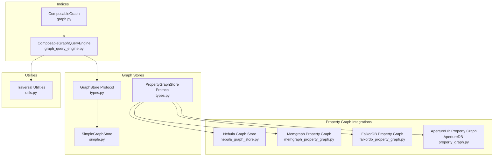
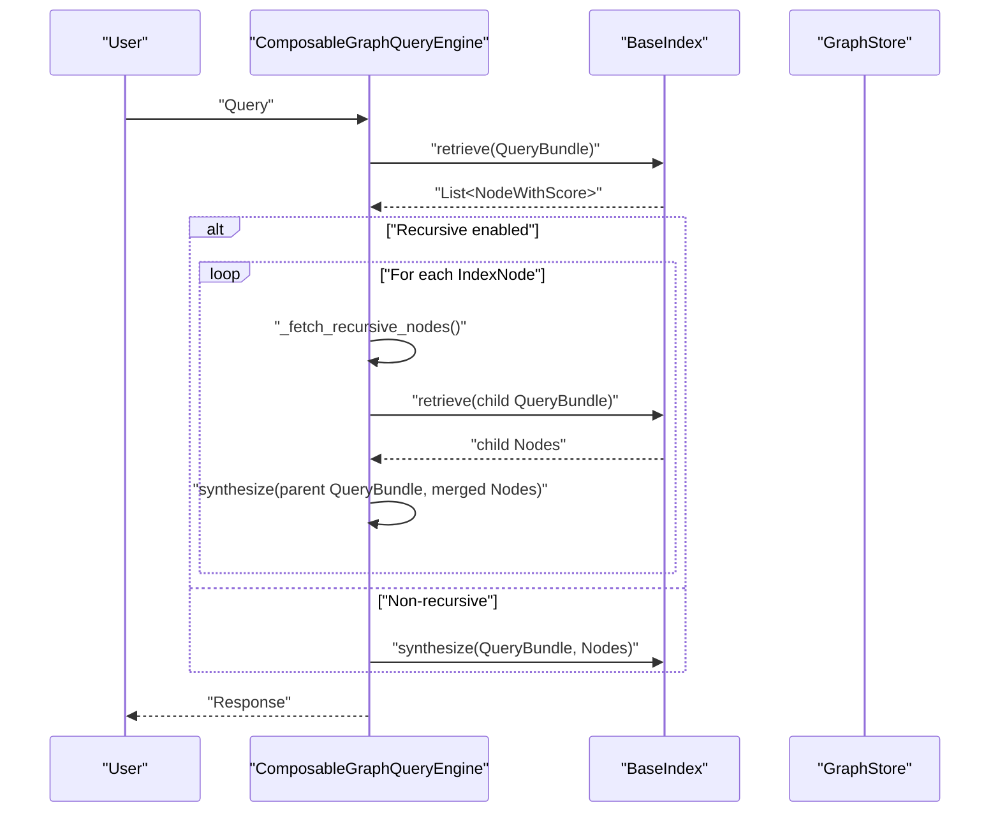
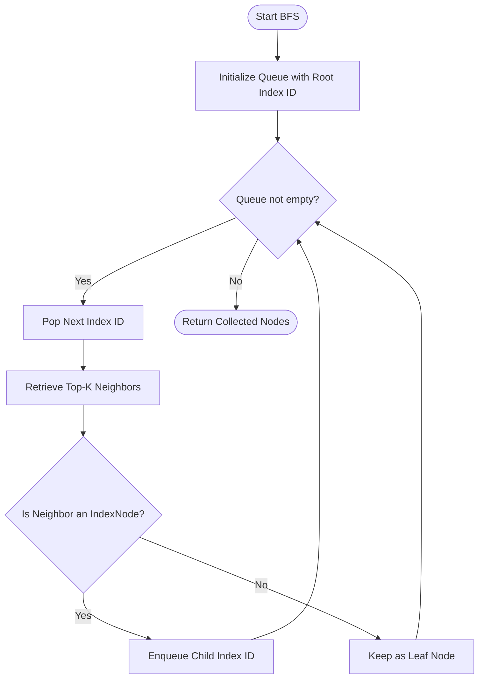
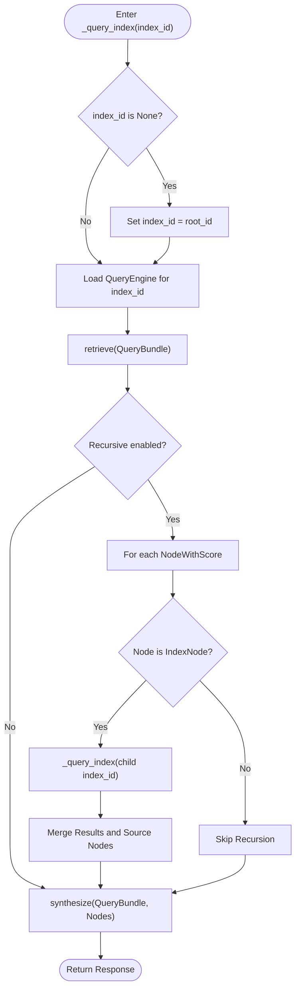
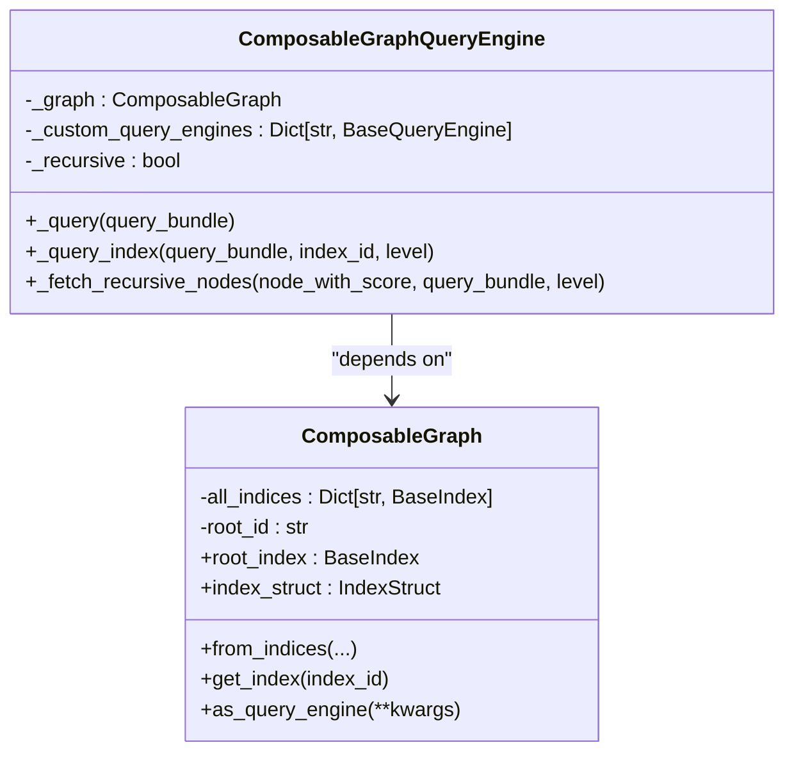
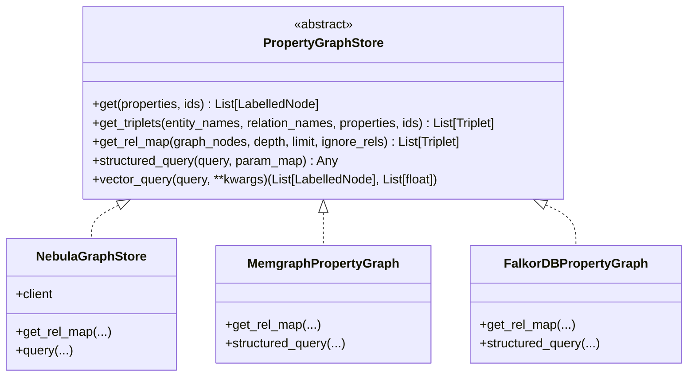
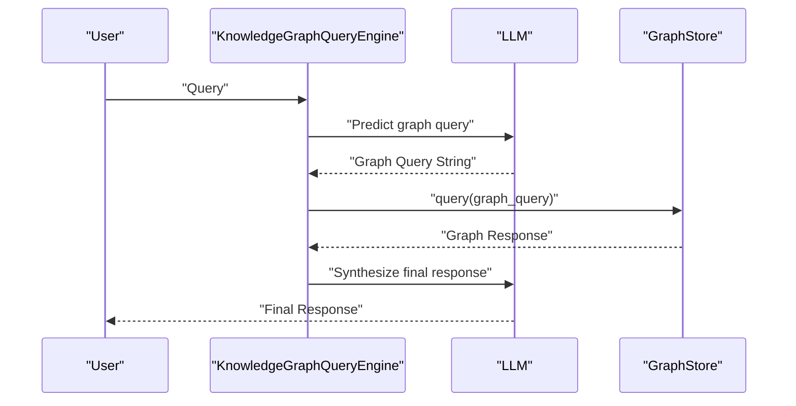
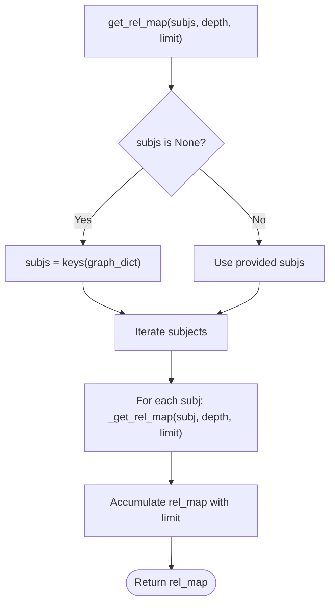
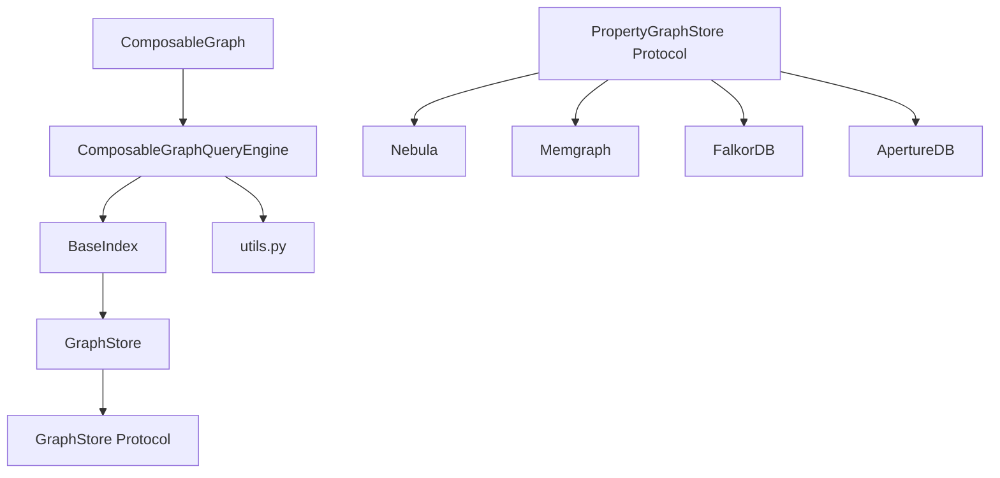

# Graph Traversal Algorithms

<cite>
**Referenced Files in This Document**
- [graph.py](file://llama-index-core/llama_index/core/indices/composability/graph.py)
- [graph_query_engine.py](file://llama-index-core/llama_index/core/query_engine/graph_query_engine.py)
- [knowledge_graph_query_engine.py](file://llama-index-core/llama_index/core/query_engine/knowledge_graph_query_engine.py)
- [simple.py](file://llama-index-core/llama_index/core/graph_stores/simple.py)
- [types.py](file://llama-index-core/llama_index/core/graph_stores/types.py)
- [utils.py](file://llama-index-core/llama_index/core/graph_stores/utils.py)
- [__init__.py](file://llama-index-core/llama_index/core/indices/property_graph/__init__.py)
- [graph_rag.py](file://llama-index-integrations/graph_rag/llama-index-graph-rag-cognee/llama_index/graph_rag/cognee/graph_rag.py)
- [test_visualize_graph.py](file://llama-index-integrations/graph_rag/llama-index-graph-rag-cognee/tests/test_visualize_graph.py)
- [graph_visualization.html](file://llama-index-integrations/graph_rag/llama-index-graph-rag-cognee/graph_visualization.html)
- [nebula_graph_store.py](file://llama-index-integrations/graph_stores/llama-index-graph-stores-nebula/llama_index/graph_stores/nebula/nebula_graph_store.py)
- [nebula_property_graph.py](file://llama-index-integrations/graph_stores/llama-index-graph-stores-nebula/llama_index/graph_stores/nebula/nebula_property_graph.py)
- [test_graph_stores_nebula.py](file://llama-index-integrations/graph_stores/llama-index-graph-stores-nebula/tests/test_graph_stores_nebula.py)
- [test_property_graph.py](file://llama-index-integrations/graph_stores/llama-index-graph-stores-nebula/tests/test_property_graph.py)
- [memgraph_property_graph.py](file://llama-index-integrations/graph_stores/llama-index-graph-stores-memgraph/llama_index/graph_stores/memgraph/property_graph.py)
- [test_graph_stores_memgraph.py](file://llama-index-integrations/graph_stores/llama-index-graph-stores-memgraph/tests/test_graph_stores_memgraph.py)
- [test_pg_stores_memgraph.py](file://llama-index-integrations/graph_stores/llama-index-graph-stores-memgraph/tests/test_pg_stores_memgraph.py)
- [falkordb_property_graph.py](file://llama-index-integrations/graph_stores/llama-index-graph-stores-falkordb/llama_index/graph_stores/falkordb/falkordb_property_graph.py)
- [test_graph_stores_falkordb.py](file://llama-index-integrations/graph_stores/llama-index-graph-stores-falkordb/tests/test_graph_stores_falkordb.py)
- [ApertureDB property_graph.py](file://llama-index-integrations/graph_stores/llama-index-graph-stores-ApertureDB/llama_index/graph_stores/ApertureDB/property_graph.py)
- [test_exec_utils.py](file://llama-index-experimental/llama_index/experimental/exec_utils.py)
- [test_polars.py](file://llama-index-experimental/llama_index/experimental/test_polars.py)
- [test_pandas.py](file://llama-index-experimental/llama_index/experimental/test_pandas.py)
</cite>

## Table of Contents
1. [Introduction](#introduction)
2. [Project Structure](#project-structure)
3. [Core Components](#core-components)
4. [Architecture Overview](#architecture-overview)
5. [Detailed Component Analysis](#detailed-component-analysis)
6. [Dependency Analysis](#dependency-analysis)
7. [Performance Considerations](#performance-considerations)
8. [Troubleshooting Guide](#troubleshooting-guide)
9. [Conclusion](#conclusion)
10. [Appendices](#appendices)

## Introduction
This document explains graph traversal algorithms and patterns in LlamaIndex, focusing on breadth-first exploration, depth-first recursion, shortest-path reasoning, and traversal orchestration across indices and graph stores. It covers traversal optimization, caching strategies, and performance considerations for large graphs. It also documents custom traversal implementations, traversal metrics, algorithm selection criteria, and practical examples for knowledge discovery, recommendation systems, and dependency analysis. Guidance is included for distributed graph environments, fault tolerance, incremental traversal strategies, visualization, debugging, and performance profiling.

## Project Structure
LlamaIndex organizes graph traversal around:
- Composable graph indices and traversal orchestration
- Knowledge graph query engines backed by external graph stores
- Property graph abstractions and retrievers
- Graph store adapters for distributed systems
- Utilities for sanitizing and limiting traversal payloads

**Diagram sources**
- [graph.py](file://llama-index-core/llama_index/core/indices/composability/graph.py#L17-L128)
- [graph_query_engine.py](file://llama-index-core/llama_index/core/query_engine/graph_query_engine.py#L15-L132)
- [types.py](file://llama-index-core/llama_index/core/graph_stores/types.py#L215-L528)
- [simple.py](file://llama-index-core/llama_index/core/graph_stores/simple.py#L72-L187)
- [nebula_graph_store.py](file://llama-index-integrations/graph_stores/llama-index-graph-stores-nebula/llama_index/graph_stores/nebula/nebula_graph_store.py)
- [memgraph_property_graph.py](file://llama-index-integrations/graph_stores/llama-index-graph-stores-memgraph/llama_index/graph_stores/memgraph/property_graph.py)
- [falkordb_property_graph.py](file://llama-index-integrations/graph_stores/llama-index-graph-stores-falkordb/llama_index/graph_stores/falkordb/falkordb_property_graph.py)
- [ApertureDB property_graph.py](file://llama-index-integrations/graph_stores/llama-index-graph-stores-ApertureDB/llama_index/graph_stores/ApertureDB/property_graph.py)
- [utils.py](file://llama-index-core/llama_index/core/graph_stores/utils.py#L12-L55)

**Section sources**
- [graph.py](file://llama-index-core/llama_index/core/indices/composability/graph.py#L17-L128)
- [graph_query_engine.py](file://llama-index-core/llama_index/core/query_engine/graph_query_engine.py#L15-L132)
- [types.py](file://llama-index-core/llama_index/core/graph_stores/types.py#L215-L528)
- [simple.py](file://llama-index-core/llama_index/core/graph_stores/simple.py#L72-L187)
- [utils.py](file://llama-index-core/llama_index/core/graph_stores/utils.py#L12-L55)

## Core Components
- ComposableGraph: Builds a hierarchical graph of indices, enabling traversal across multiple index layers.
- ComposableGraphQueryEngine: Orchestrates traversal via recursive retrieval and synthesis, supporting custom per-index query engines.
- GraphStore Protocol: Defines the interface for retrieving neighbors, upserting triplets, querying, and persistence.
- PropertyGraphStore Protocol: Extends GraphStore with labeled nodes, relations, triplets, and structured/vector queries.
- SimpleGraphStore: An in-memory, dictionary-backed store suitable for small graphs and demos; includes depth-aware relationship mapping.
- Property Graph Index and Retrievers: Provide retrieval strategies (custom Cypher templates, LLM synonym expansion, vector context) over labeled graphs.

**Section sources**
- [graph.py](file://llama-index-core/llama_index/core/indices/composability/graph.py#L17-L128)
- [graph_query_engine.py](file://llama-index-core/llama_index/core/query_engine/graph_query_engine.py#L15-L132)
- [types.py](file://llama-index-core/llama_index/core/graph_stores/types.py#L215-L528)
- [simple.py](file://llama-index-core/llama_index/core/graph_stores/simple.py#L72-L187)
- [__init__.py](file://llama-index-core/llama_index/core/indices/property_graph/__init__.py#L1-L54)

## Architecture Overview
The traversal architecture combines index-level recursion with graph store-backed retrieval. At a high level:
- ComposableGraph constructs a root index and child indices, linking them via IndexNode relationships.
- ComposableGraphQueryEngine retrieves top-k nodes from a chosen index, optionally recursing into child indices when encountering IndexNodes.
- GraphStore implementations (including property graph stores) provide neighbor traversal and query capabilities.
- Utilities cap traversal depth and limit result sizes to keep downstream LLM prompts tractable.

**Diagram sources**
- [graph_query_engine.py](file://llama-index-core/llama_index/core/query_engine/graph_query_engine.py#L56-L132)
- [graph.py](file://llama-index-core/llama_index/core/indices/composability/graph.py#L115-L128)

## Detailed Component Analysis

### Breadth-First Search (BFS) Patterns
- LlamaIndex does not expose a dedicated BFS traversal method. However, breadth-first exploration emerges naturally from:
  - Top-k retrieval from indices (e.g., vector or keyword indices) combined with iterative recursion.
  - Property graph retrievers that traverse neighbors up to a configured depth, returning a flattened set of related nodes.
- Practical BFS-like behavior can be achieved by:
  - Using a queue of pending index IDs and iterating through them in order while collecting neighbors.
  - Limiting depth and total returned triplets to control fan-out.

[No sources needed since this diagram shows conceptual workflow, not actual code structure]

### Depth-First Search (DFS) Patterns
- DFS is implemented via recursive traversal in ComposableGraphQueryEngine:
  - When a retrieved node is an IndexNode, the engine recurses into that index before synthesizing a response.
  - The recursion depth is implicit in the index hierarchy and can be bounded by limiting recursion levels or by limiting the number of child indices explored.

**Diagram sources**
- [graph_query_engine.py](file://llama-index-core/llama_index/core/query_engine/graph_query_engine.py#L60-L132)

**Section sources**
- [graph_query_engine.py](file://llama-index-core/llama_index/core/query_engine/graph_query_engine.py#L60-L132)

### Shortest Path Algorithms
- LlamaIndex does not implement explicit shortest path algorithms (e.g., Dijkstra’s or A*) within its core traversal stack.
- Shortest path reasoning can be approximated using:
  - Property graph retrievers with Cypher templates that encode path constraints.
  - Structured queries against property graph stores that support path finding (e.g., Neo4j/Cypher).
  - Vector similarity combined with graph constraints to bias toward shorter logical paths.

[No sources needed since this section provides general guidance]

### Graph Traversal Orchestration
- ComposableGraph builds a directed acyclic graph of indices, linking children to a root index via IndexNode relationships.
- ComposableGraphQueryEngine selects a root index and optionally delegates to custom per-index query engines, performing recursive traversal when encountering IndexNodes.

**Diagram sources**
- [graph.py](file://llama-index-core/llama_index/core/indices/composability/graph.py#L17-L128)
- [graph_query_engine.py](file://llama-index-core/llama_index/core/query_engine/graph_query_engine.py#L15-L132)

**Section sources**
- [graph.py](file://llama-index-core/llama_index/core/indices/composability/graph.py#L17-L128)
- [graph_query_engine.py](file://llama-index-core/llama_index/core/query_engine/graph_query_engine.py#L15-L132)

### Property Graph Retrievers and Traversal
- Property graph retrievers enable traversal over labeled graphs:
  - Custom retrievers allow arbitrary Cypher templates.
  - LLM synonym retrievers expand entity synonyms to broaden traversal.
  - Vector context retrievers combine vector similarity with graph context.
- PropertyGraphStore exposes:
  - get/get_triplets for fetching nodes and triplets by filters.
  - get_rel_map for depth-aware neighbor expansion with limits.
  - structured_query and vector_query for advanced retrieval.

**Diagram sources**
- [types.py](file://llama-index-core/llama_index/core/graph_stores/types.py#L276-L528)
- [nebula_graph_store.py](file://llama-index-integrations/graph_stores/llama-index-graph-stores-nebula/llama_index/graph_stores/nebula/nebula_graph_store.py)
- [memgraph_property_graph.py](file://llama-index-integrations/graph_stores/llama-index-graph-stores-memgraph/llama_index/graph_stores/memgraph/property_graph.py)
- [falkordb_property_graph.py](file://llama-index-integrations/graph_stores/llama-index-graph-stores-falkordb/llama_index/graph_stores/falkordb/falkordb_property_graph.py)

**Section sources**
- [types.py](file://llama-index-core/llama_index/core/graph_stores/types.py#L276-L528)
- [__init__.py](file://llama-index-core/llama_index/core/indices/property_graph/__init__.py#L1-L54)

### Knowledge Graph Query Engine (Deprecated)
- KnowledgeGraphQueryEngine translates natural language queries into graph database queries (e.g., Cypher), executes them against a graph store, and synthesizes a final response.
- While not a traversal engine itself, it demonstrates structured query generation and retrieval patterns that inform custom traversal strategies.

**Diagram sources**
- [knowledge_graph_query_engine.py](file://llama-index-core/llama_index/core/query_engine/knowledge_graph_query_engine.py#L125-L208)

**Section sources**
- [knowledge_graph_query_engine.py](file://llama-index-core/llama_index/core/query_engine/knowledge_graph_query_engine.py#L53-L269)

### Simple Graph Store and Depth-Aware Rel Map
- SimpleGraphStore maintains triplets in memory and supports depth-aware relationship mapping via get_rel_map.
- This enables controlled traversal by limiting depth and total returned relationships.

**Diagram sources**
- [simple.py](file://llama-index-core/llama_index/core/graph_stores/simple.py#L32-L69)

**Section sources**
- [simple.py](file://llama-index-core/llama_index/core/graph_stores/simple.py#L32-L69)

### Traversal Metrics and Instrumentation
- Traversal events are instrumented using callback managers and event payloads for queries and retrievals.
- Metrics can be derived from:
  - Number of recursive calls
  - Total nodes retrieved per level
  - Time spent in retrieval vs. synthesis
  - Size of returned triplets/relationships

**Section sources**
- [graph_query_engine.py](file://llama-index-core/llama_index/core/query_engine/graph_query_engine.py#L69-L104)

## Dependency Analysis
Key dependencies and relationships:
- ComposableGraph depends on BaseIndex and IndexNode relationships to form a hierarchical graph.
- ComposableGraphQueryEngine depends on ComposableGraph and delegates to per-index query engines.
- GraphStore and PropertyGraphStore define the abstraction for traversal and retrieval.
- Property graph integrations implement PropertyGraphStore for specific backends.

**Diagram sources**
- [graph.py](file://llama-index-core/llama_index/core/indices/composability/graph.py#L17-L128)
- [graph_query_engine.py](file://llama-index-core/llama_index/core/query_engine/graph_query_engine.py#L15-L132)
- [types.py](file://llama-index-core/llama_index/core/graph_stores/types.py#L215-L528)
- [utils.py](file://llama-index-core/llama_index/core/graph_stores/utils.py#L12-L55)

**Section sources**
- [graph.py](file://llama-index-core/llama_index/core/indices/composability/graph.py#L17-L128)
- [graph_query_engine.py](file://llama-index-core/llama_index/core/query_engine/graph_query_engine.py#L15-L132)
- [types.py](file://llama-index-core/llama_index/core/graph_stores/types.py#L215-L528)
- [utils.py](file://llama-index-core/llama_index/core/graph_stores/utils.py#L12-L55)

## Performance Considerations
- Limit traversal depth and fan-out:
  - Use depth parameters and relationship limits in get_rel_map to cap expansion.
  - Cap total returned triplets to prevent prompt overflow.
- Control recursion:
  - Disable recursion or limit recursion levels to reduce repeated retrieval overhead.
- Cache and reuse:
  - Cache repeated retrieval results keyed by query and index ID.
  - Persist graph stores to avoid recomputation across runs.
- Payload sanitization:
  - Use value_sanitize to remove overly large lists and embeddings from returned properties to reduce context size.

**Section sources**
- [simple.py](file://llama-index-core/llama_index/core/graph_stores/simple.py#L32-L69)
- [utils.py](file://llama-index-core/llama_index/core/graph_stores/utils.py#L16-L54)

## Troubleshooting Guide
Common issues and remedies:
- Missing summaries for child indices during composable graph construction:
  - Ensure index_summaries are provided when constructing ComposableGraph from children.
- Excessive traversal costs:
  - Reduce depth and limit parameters; enable caching; disable recursion if not needed.
- Oversized payloads:
  - Apply value_sanitize to limit nested lists and embeddings.
- Distributed store connectivity:
  - Verify client initialization and credentials for Nebula/Memgraph/FalkorDB/ApertureDB adapters.

**Section sources**
- [graph.py](file://llama-index-core/llama_index/core/indices/composability/graph.py#L59-L95)
- [utils.py](file://llama-index-core/llama_index/core/graph_stores/utils.py#L16-L54)

## Conclusion
LlamaIndex provides a flexible traversal framework centered on index composition and recursive retrieval, with optional depth-aware expansion and property graph integration. While explicit BFS/DFS and shortest path algorithms are not built-in, the architecture supports these patterns through top-k retrieval, recursion, and structured queries. Performance and reliability are addressed via configurable limits, caching, and sanitization utilities. For production-scale scenarios, leverage property graph stores and retrievers tailored to your backend and workload.

## Appendices

### Examples and Use Cases
- Knowledge discovery:
  - Use ComposableGraphQueryEngine to traverse hierarchical indices and synthesize answers from related nodes.
- Recommendation systems:
  - Combine vector similarity with property graph retrievers to surface related items within a bounded depth.
- Dependency analysis:
  - Employ property graph retrievers with Cypher templates to traverse relationships and detect dependency chains.

[No sources needed since this section provides general guidance]

### Distributed Graph Environments and Fault Tolerance
- Nebula/Memgraph/FalkorDB/ApertureDB integrations provide property graph capabilities with robust persistence and querying.
- Implement retry and circuit-breaker patterns around graph store queries.
- Use incremental traversal strategies: persist intermediate results and resume traversal after failures.

**Section sources**
- [nebula_graph_store.py](file://llama-index-integrations/graph_stores/llama-index-graph-stores-nebula/llama_index/graph_stores/nebula/nebula_graph_store.py)
- [memgraph_property_graph.py](file://llama-index-integrations/graph_stores/llama-index-graph-stores-memgraph/llama_index/graph_stores/memgraph/property_graph.py)
- [falkordb_property_graph.py](file://llama-index-integrations/graph_stores/llama-index-graph-stores-falkordb/llama_index/graph_stores/falkordb/falkordb_property_graph.py)
- [ApertureDB property_graph.py](file://llama-index-integrations/graph_stores/llama-index-graph-stores-ApertureDB/llama_index/graph_stores/ApertureDB/property_graph.py)

### Incremental Traversal Strategies
- Persist graph stores regularly to checkpoint traversal progress.
- Resume traversal by skipping already-visited nodes or using a work queue persisted to disk.
- Use property graph retrievers with filters to re-run targeted traversals.

[No sources needed since this section provides general guidance]

### Traversal Visualization and Debugging
- Use the Cognee Graph RAG integration to visualize graphs and inspect traversal outputs.
- Enable verbose modes in knowledge graph query engines to observe generated queries and responses.

**Section sources**
- [graph_rag.py](file://llama-index-integrations/graph_rag/llama-index-graph-rag-cognee/llama_index/graph_rag/cognee/graph_rag.py)
- [test_visualize_graph.py](file://llama-index-integrations/graph_rag/llama-index-graph-rag-cognee/tests/test_visualize_graph.py)
- [graph_visualization.html](file://llama-index-integrations/graph_rag/llama-index-graph-rag-cognee/graph_visualization.html)
- [knowledge_graph_query_engine.py](file://llama-index-core/llama_index/core/query_engine/knowledge_graph_query_engine.py#L152-L204)

### Performance Profiling
- Instrument traversal with callback events to measure retrieval and synthesis durations.
- Profile backend-specific graph stores to identify bottlenecks in query execution.
- Use experimental utilities to benchmark execution strategies across pandas/polars backends.

**Section sources**
- [test_exec_utils.py](file://llama-index-experimental/llama_index/experimental/exec_utils.py)
- [test_polars.py](file://llama-index-experimental/llama_index/experimental/test_polars.py)
- [test_pandas.py](file://llama-index-experimental/llama_index/experimental/test_pandas.py)