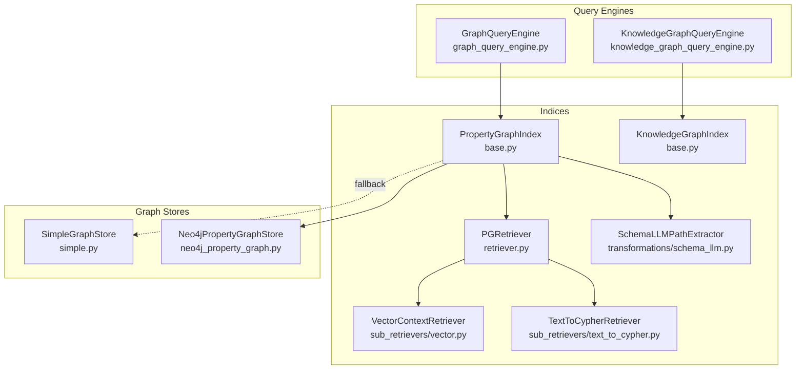
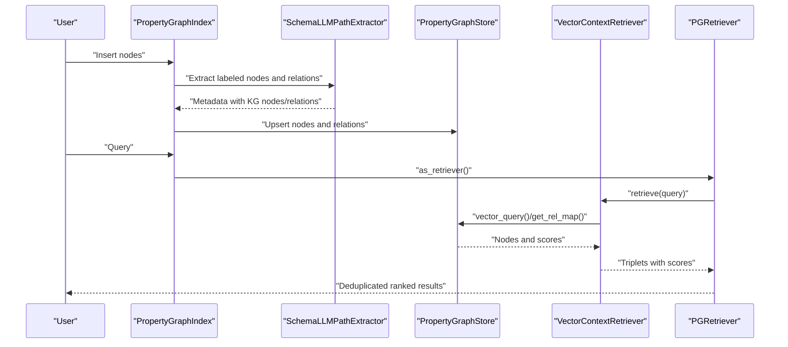
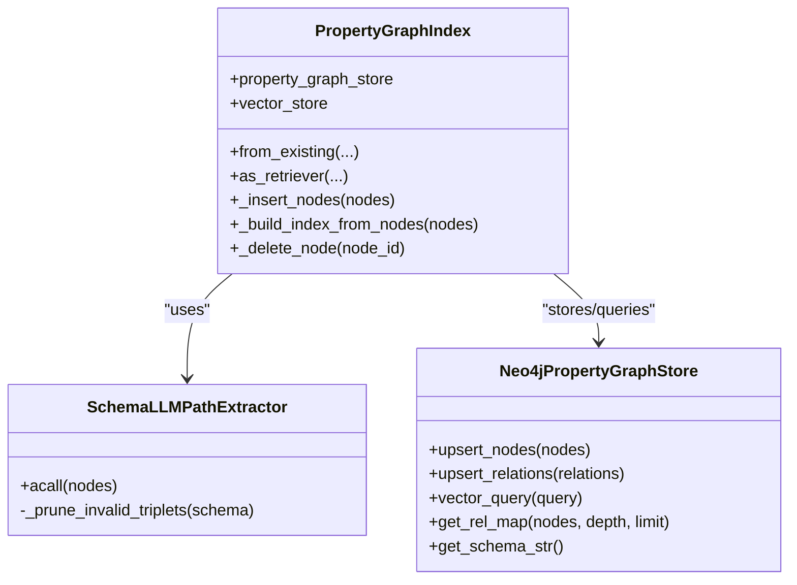
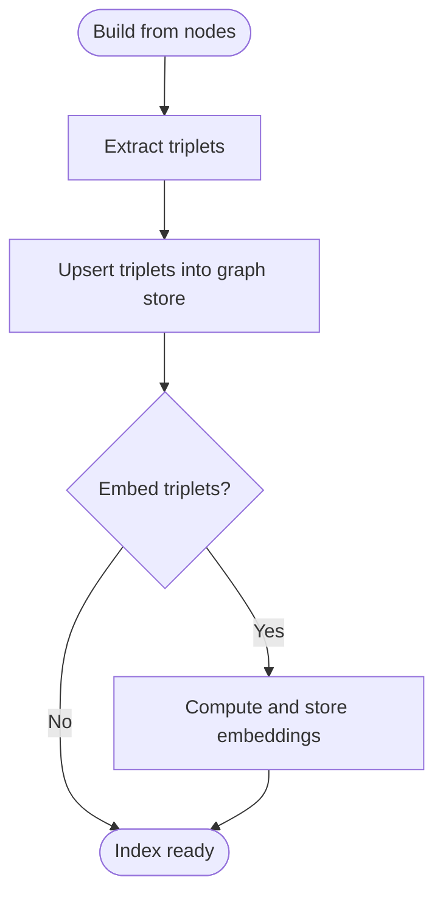
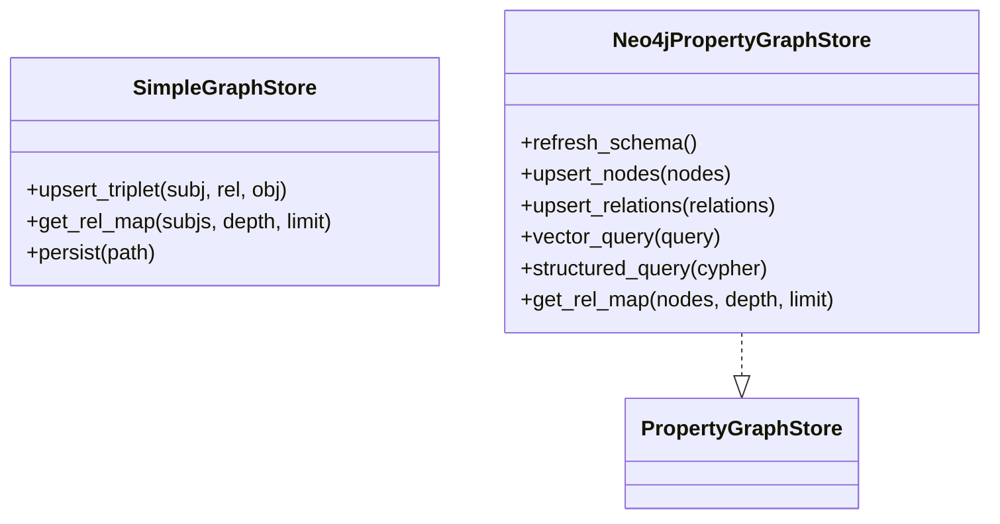
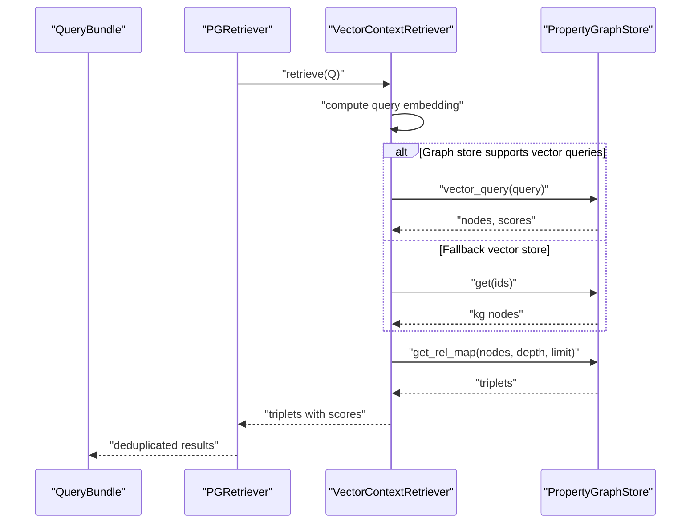
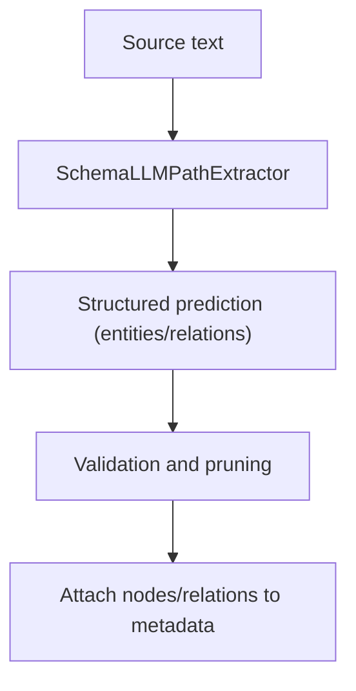
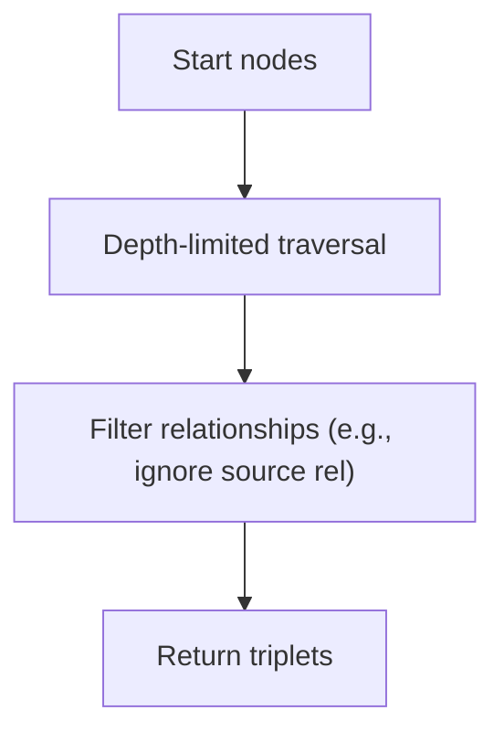
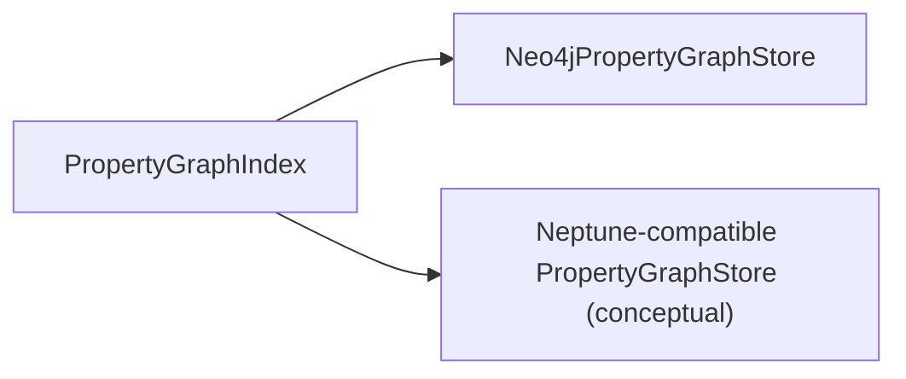
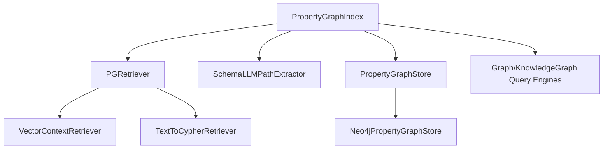

# Graph-Based RAG

<cite>
**Referenced Files in This Document**
- [base.py](file://llama-index-core/llama_index/core/indices/knowledge_graph/base.py)
- [base.py](file://llama-index-core/llama_index/core/indices/property_graph/base.py)
- [retriever.py](file://llama-index-core/llama_index/core/indices/property_graph/retriever.py)
- [utils.py](file://llama-index-core/llama_index/core/indices/property_graph/utils.py)
- [simple.py](file://llama-index-core/llama_index/core/graph_stores/simple.py)
- [neo4j_property_graph.py](file://llama-index-integrations/graph_stores/llama-index-graph-stores-neo4j/llama_index/graph_stores/neo4j/neo4j_property_graph.py)
- [vector.py](file://llama-index-core/llama_index/core/indices/property_graph/sub_retrievers/vector.py)
- [text_to_cypher.py](file://llama-index-core/llama_index/core/indices/property_graph/sub_retrievers/text_to_cypher.py)
- [schema_llm.py](file://llama-index-core/llama_index/core/indices/property_graph/transformations/schema_llm.py)
- [graph.py](file://llama-index-core/llama_index/core/indices/composability/graph.py)
- [graph_query_engine.py](file://llama-index-core/llama_index/core/query_engine/graph_query_engine.py)
- [knowledge_graph_query_engine.py](file://llama-index-core/llama_index/core/query_engine/knowledge_graph_query_engine.py)
- [test_property_graph.py](file://llama-index-core/tests/indices/property_graph/test_property_graph.py)
- [test_loading_graph.py](file://llama-index-core/tests/indices/test_loading_graph.py)
- [graph_rag.py](file://llama-index-integrations/graph_rag/llama-index-graph-rag-cognee/llama_index/graph_rag/cognee/graph_rag.py)
</cite>

## Table of Contents
1. [Introduction](#introduction)
2. [Project Structure](#project-structure)
3. [Core Components](#core-components)
4. [Architecture Overview](#architecture-overview)
5. [Detailed Component Analysis](#detailed-component-analysis)
6. [Dependency Analysis](#dependency-analysis)
7. [Performance Considerations](#performance-considerations)
8. [Troubleshooting Guide](#troubleshooting-guide)
9. [Conclusion](#conclusion)
10. [Appendices](#appendices)

## Introduction
This document explains graph-based Retrieval-Augmented Generation (RAG) in LlamaIndex with a focus on knowledge graph construction, property graph modeling, and graph traversal. It covers how triplets are extracted and ingested, how property graphs are modeled and queried, and how retrieval combines vector and structured graph capabilities. It also documents integrations with graph databases such as Neo4j and outlines patterns for Amazon Neptune and other custom graph stores. Practical topics include entity extraction, relationship mapping, graph traversal strategies, query optimization, schema design, analytics integration, lifecycle management, consistency, and performance tuning. Finally, it provides guidance on graph-based agent workflows and production deployment considerations.

## Project Structure
The graph-based RAG implementation spans several modules:
- Indices: Knowledge graph and property graph indices, retrievers, and transformations
- Graph stores: Core graph store abstractions and simple in-memory implementations
- Integrations: Neo4j property graph store and Cognee graph RAG pack
- Query engines: Graph and knowledge graph query engines
- Tests: Property graph and graph loading tests

**Diagram sources**
- [base.py](file://llama-index-core/llama_index/core/indices/property_graph/base.py#L43-L410)
- [base.py](file://llama-index-core/llama_index/core/indices/knowledge_graph/base.py#L42-L389)
- [retriever.py](file://llama-index-core/llama_index/core/indices/property_graph/retriever.py#L12-L72)
- [vector.py](file://llama-index-core/llama_index/core/indices/property_graph/sub_retrievers/vector.py#L22-L262)
- [text_to_cypher.py](file://llama-index-core/llama_index/core/indices/property_graph/sub_retrievers/text_to_cypher.py#L37-L224)
- [schema_llm.py](file://llama-index-core/llama_index/core/indices/property_graph/transformations/schema_llm.py#L89-L387)
- [simple.py](file://llama-index-core/llama_index/core/graph_stores/simple.py#L72-L187)
- [neo4j_property_graph.py](file://llama-index-integrations/graph_stores/llama-index-graph-stores-neo4j/llama_index/graph_stores/neo4j/neo4j_property_graph.py#L94-L800)
- [graph_query_engine.py](file://llama-index-core/llama_index/core/query_engine/graph_query_engine.py)
- [knowledge_graph_query_engine.py](file://llama-index-core/llama_index/core/query_engine/knowledge_graph_query_engine.py)

**Section sources**
- [base.py](file://llama-index-core/llama_index/core/indices/property_graph/base.py#L43-L410)
- [base.py](file://llama-index-core/llama_index/core/indices/knowledge_graph/base.py#L42-L389)
- [simple.py](file://llama-index-core/llama_index/core/graph_stores/simple.py#L72-L187)
- [neo4j_property_graph.py](file://llama-index-integrations/graph_stores/llama-index-graph-stores-neo4j/llama_index/graph_stores/neo4j/neo4j_property_graph.py#L94-L800)

## Core Components
- PropertyGraphIndex: Builds and maintains a property graph from node transformations, supports vector and structured queries, and exposes a composite retriever.
- KnowledgeGraphIndex: Legacy index that extracts triplets and leverages a simple graph store; superseded by PropertyGraphIndex.
- Graph stores: Abstractions for storing nodes, relations, and supporting vector/structured queries; includes a simple in-memory implementation and Neo4j integration.
- Sub-retrievers: Vector-based retrieval over embedded knowledge nodes and Cypher generation for structured retrieval.
- Transformations: LLM-based extraction of labeled nodes and relations with schema enforcement.

Key capabilities:
- Triple extraction and ingestion pipeline
- Property graph modeling with labeled nodes and typed relations
- Hybrid retrieval combining vector similarity and graph traversal
- Structured query generation via LLM and Cypher execution
- Async orchestration and deduplication in composite retriever

**Section sources**
- [base.py](file://llama-index-core/llama_index/core/indices/property_graph/base.py#L43-L410)
- [base.py](file://llama-index-core/llama_index/core/indices/knowledge_graph/base.py#L42-L389)
- [simple.py](file://llama-index-core/llama_index/core/graph_stores/simple.py#L72-L187)
- [vector.py](file://llama-index-core/llama_index/core/indices/property_graph/sub_retrievers/vector.py#L22-L262)
- [text_to_cypher.py](file://llama-index-core/llama_index/core/indices/property_graph/sub_retrievers/text_to_cypher.py#L37-L224)
- [schema_llm.py](file://llama-index-core/llama_index/core/indices/property_graph/transformations/schema_llm.py#L89-L387)

## Architecture Overview
The system orchestrates ingestion, storage, and retrieval:
- Ingestion: Nodes are transformed into labeled nodes and relations via LLM-based extractors.
- Storage: Property graph store persists nodes, relations, and optional embeddings; Neo4j integration provides vector and structured query support.
- Retrieval: Composite retriever runs synonym and vector retrievers concurrently, deduplicates results, and returns scored triplets.

**Diagram sources**
- [base.py](file://llama-index-core/llama_index/core/indices/property_graph/base.py#L195-L309)
- [schema_llm.py](file://llama-index-core/llama_index/core/indices/property_graph/transformations/schema_llm.py#L242-L387)
- [vector.py](file://llama-index-core/llama_index/core/indices/property_graph/sub_retrievers/vector.py#L119-L189)
- [retriever.py](file://llama-index-core/llama_index/core/indices/property_graph/retriever.py#L51-L72)

## Detailed Component Analysis

### PropertyGraphIndex
- Purpose: Central index for property graphs with labeled nodes and typed relations.
- Ingestion pipeline:
  - Runs transformations (e.g., LLM path extractor) to produce KG nodes and relations.
  - Filters duplicates across KG nodes and source Llama nodes.
  - Optionally embeds both source nodes and KG nodes.
  - Inserts nodes, relations, and updates schema if supported.
- Retrieval:
  - Provides a composite retriever that can combine synonym and vector retrievers.
  - Uses async orchestration and deduplication across sub-retrievers.

**Diagram sources**
- [base.py](file://llama-index-core/llama_index/core/indices/property_graph/base.py#L80-L410)
- [schema_llm.py](file://llama-index-core/llama_index/core/indices/property_graph/transformations/schema_llm.py#L89-L387)
- [neo4j_property_graph.py](file://llama-index-integrations/graph_stores/llama-index-graph-stores-neo4j/llama_index/graph_stores/neo4j/neo4j_property_graph.py#L329-L408)

**Section sources**
- [base.py](file://llama-index-core/llama_index/core/indices/property_graph/base.py#L80-L410)
- [schema_llm.py](file://llama-index-core/llama_index/core/indices/property_graph/transformations/schema_llm.py#L89-L387)

### KnowledgeGraphIndex (Legacy)
- Purpose: Extracts triplets from text and builds a simple graph store-backed index.
- Features:
  - Triple extraction via LLM or custom function.
  - Insert/update triplets and optionally embed triplets.
  - Retrieve via keyword/hybrid modes.
  - NetworkX graph export capability.

**Diagram sources**
- [base.py](file://llama-index-core/llama_index/core/indices/knowledge_graph/base.py#L204-L232)

**Section sources**
- [base.py](file://llama-index-core/llama_index/core/indices/knowledge_graph/base.py#L42-L389)

### Graph Stores
- SimpleGraphStore: In-memory dictionary-based graph store for small-scale or testing scenarios; supports upsert, deletion, and rel-map traversal with depth limits.
- Neo4jPropertyGraphStore: Full-featured property graph store with:
  - Upsert nodes (entities/chunks) and relations
  - Structured schema discovery and enhancement
  - Vector index support for embedding similarity
  - Structured Cypher queries and vector queries
  - Robust error handling and sanitization

**Diagram sources**
- [simple.py](file://llama-index-core/llama_index/core/graph_stores/simple.py#L72-L187)
- [neo4j_property_graph.py](file://llama-index-integrations/graph_stores/llama-index-graph-stores-neo4j/llama_index/graph_stores/neo4j/neo4j_property_graph.py#L94-L800)

**Section sources**
- [simple.py](file://llama-index-core/llama_index/core/graph_stores/simple.py#L72-L187)
- [neo4j_property_graph.py](file://llama-index-integrations/graph_stores/llama-index-graph-stores-neo4j/llama_index/graph_stores/neo4j/neo4j_property_graph.py#L94-L800)

### Retrievers and Retrieval Strategies
- PGRetriever: Orchestrates multiple sub-retrievers, supports async execution and deduplication.
- VectorContextRetriever:
  - Computes query embeddings if needed.
  - Executes vector queries against graph store or external vector store.
  - Retrieves relational context around matched nodes via get_rel_map.
  - Scores triplets by max of source/target similarities.
- TextToCypherRetriever:
  - Generates Cypher queries from natural language using LLM and schema.
  - Executes structured queries and optionally summarizes results.

**Diagram sources**
- [retriever.py](file://llama-index-core/llama_index/core/indices/property_graph/retriever.py#L51-L72)
- [vector.py](file://llama-index-core/llama_index/core/indices/property_graph/sub_retrievers/vector.py#L119-L189)

**Section sources**
- [retriever.py](file://llama-index-core/llama_index/core/indices/property_graph/retriever.py#L12-L72)
- [vector.py](file://llama-index-core/llama_index/core/indices/property_graph/sub_retrievers/vector.py#L22-L262)
- [text_to_cypher.py](file://llama-index-core/llama_index/core/indices/property_graph/sub_retrievers/text_to_cypher.py#L37-L224)

### Entity Extraction and Relationship Mapping
- SchemaLLMPathExtractor:
  - Builds a Pydantic model from provided entity/relation vocabularies and validation schema.
  - Enforces strict or flexible validation and prunes invalid properties.
  - Produces labeled nodes and relations attached to source nodes’ metadata.
- Utility parsing:
  - default_parse_triplets_fn parses raw LLM outputs into triplets for legacy/kg index usage.

**Diagram sources**
- [schema_llm.py](file://llama-index-core/llama_index/core/indices/property_graph/transformations/schema_llm.py#L89-L387)
- [utils.py](file://llama-index-core/llama_index/core/indices/property_graph/utils.py#L4-L38)

**Section sources**
- [schema_llm.py](file://llama-index-core/llama_index/core/indices/property_graph/transformations/schema_llm.py#L89-L387)
- [utils.py](file://llama-index-core/llama_index/core/indices/property_graph/utils.py#L4-L38)

### Graph Traversal and Query Strategies
- Depth-aware rel-map traversal:
  - SimpleGraphStore: Breadth-first expansion with depth and limit controls.
  - Neo4jPropertyGraphStore: Cypher-based traversal with configurable depth and relationship filtering.
- Vector similarity:
  - Neo4j vector index or fallback vector computation for nearest neighbors.
- Structured queries:
  - LLM generates Cypher; validated and executed safely; optional summarization.

**Diagram sources**
- [simple.py](file://llama-index-core/llama_index/core/graph_stores/simple.py#L32-L70)
- [neo4j_property_graph.py](file://llama-index-integrations/graph_stores/llama-index-graph-stores-neo4j/llama_index/graph_stores/neo4j/neo4j_property_graph.py#L543-L610)
- [vector.py](file://llama-index-core/llama_index/core/indices/property_graph/sub_retrievers/vector.py#L134-L152)

**Section sources**
- [simple.py](file://llama-index-core/llama_index/core/graph_stores/simple.py#L32-L70)
- [neo4j_property_graph.py](file://llama-index-integrations/graph_stores/llama-index-graph-stores-neo4j/llama_index/graph_stores/neo4j/neo4j_property_graph.py#L543-L610)
- [vector.py](file://llama-index-core/llama_index/core/indices/property_graph/sub_retrievers/vector.py#L119-L189)

### Integrations: Neo4j and Amazon Neptune
- Neo4j:
  - Full property graph store with vector and structured query support.
  - Schema refresh and enhancement, vector index creation, robust error handling.
- Amazon Neptune:
  - No dedicated integration module in the referenced codebase; however, the property graph store interface supports vector and structured queries. A Neptune-compatible implementation would follow the same interface contract: upsert nodes/relations, vector_query, structured_query, get_rel_map, and schema management.

**Diagram sources**
- [neo4j_property_graph.py](file://llama-index-integrations/graph_stores/llama-index-graph-stores-neo4j/llama_index/graph_stores/neo4j/neo4j_property_graph.py#L94-L205)
- [base.py](file://llama-index-core/llama_index/core/indices/property_graph/base.py#L112-L134)

**Section sources**
- [neo4j_property_graph.py](file://llama-index-integrations/graph_stores/llama-index-graph-stores-neo4j/llama_index/graph_stores/neo4j/neo4j_property_graph.py#L94-L205)
- [base.py](file://llama-index-core/llama_index/core/indices/property_graph/base.py#L112-L134)

### Graph Analytics Integration
- Structured schema discovery and enhancement enable analytics-friendly graph designs.
- Vector similarity and Cypher queries support analytics workloads:
  - Nearest neighbor entity search
  - Path-based analytics and traversal metrics
  - Aggregation over relationships and properties

**Section sources**
- [neo4j_property_graph.py](file://llama-index-integrations/graph_stores/llama-index-graph-stores-neo4j/llama_index/graph_stores/neo4j/neo4j_property_graph.py#L213-L328)

### Graph Data Lifecycle Management and Consistency
- Upsert semantics:
  - PropertyGraphIndex filters duplicates for both KG nodes and source nodes.
  - Neo4j upsert merges nodes and relationships; chunk nodes receive vector properties when present.
- Embedding lifecycle:
  - Embeddings computed during ingestion; optional vector index creation.
  - Memory-conscious clearing of embeddings after vector index insertion.
- Schema evolution:
  - Refresh schema on initialization and when needed; update schema-aware retrievers.

**Section sources**
- [base.py](file://llama-index-core/llama_index/core/indices/property_graph/base.py#L236-L309)
- [neo4j_property_graph.py](file://llama-index-integrations/graph_stores/llama-index-graph-stores-neo4j/llama_index/graph_stores/neo4j/neo4j_property_graph.py#L329-L408)
- [vector.py](file://llama-index-core/llama_index/core/indices/property_graph/sub_retrievers/vector.py#L310-L330)

### Production Deployment Guidance
- Neo4j:
  - Use vector index for scalable similarity search.
  - Apply schema constraints and indexes for uniqueness and performance.
  - Configure timeouts and sanitize query outputs.
- Amazon Neptune:
  - Implement a compatible PropertyGraphStore adhering to the interface contract.
  - Ensure vector and structured query capabilities are exposed.
- General:
  - Prefer async ingestion and retrieval for throughput.
  - Deduplicate results in composite retriever to avoid redundant context.
  - Monitor embedding dimensionality and vector index health.

**Section sources**
- [neo4j_property_graph.py](file://llama-index-integrations/graph_stores/llama-index-graph-stores-neo4j/llama_index/graph_stores/neo4j/neo4j_property_graph.py#L155-L205)
- [retriever.py](file://llama-index-core/llama_index/core/indices/property_graph/retriever.py#L51-L72)

## Dependency Analysis

**Diagram sources**
- [base.py](file://llama-index-core/llama_index/core/indices/property_graph/base.py#L341-L393)
- [retriever.py](file://llama-index-core/llama_index/core/indices/property_graph/retriever.py#L12-L72)
- [vector.py](file://llama-index-core/llama_index/core/indices/property_graph/sub_retrievers/vector.py#L22-L74)
- [text_to_cypher.py](file://llama-index-core/llama_index/core/indices/property_graph/sub_retrievers/text_to_cypher.py#L37-L105)
- [schema_llm.py](file://llama-index-core/llama_index/core/indices/property_graph/transformations/schema_llm.py#L89-L147)
- [graph_query_engine.py](file://llama-index-core/llama_index/core/query_engine/graph_query_engine.py)
- [knowledge_graph_query_engine.py](file://llama-index-core/llama_index/core/query_engine/knowledge_graph_query_engine.py)

**Section sources**
- [base.py](file://llama-index-core/llama_index/core/indices/property_graph/base.py#L341-L393)
- [retriever.py](file://llama-index-core/llama_index/core/indices/property_graph/retriever.py#L12-L72)

## Performance Considerations
- Asynchronous orchestration:
  - Use async retrievers and vector store queries to maximize throughput.
- Vector efficiency:
  - Prefer native vector index when available; otherwise, offload to external vector store.
  - Limit traversal depth and result counts to control latency.
- Deduplication:
  - Composite retriever deduplicates by text to reduce repeated context.
- Embedding management:
  - Clear embeddings after vector index insertion to save memory.
- Neo4j specifics:
  - Create vector index and constraints; tune timeouts; sanitize outputs.

**Section sources**
- [retriever.py](file://llama-index-core/llama_index/core/indices/property_graph/retriever.py#L51-L72)
- [vector.py](file://llama-index-core/llama_index/core/indices/property_graph/sub_retrievers/vector.py#L310-L330)
- [neo4j_property_graph.py](file://llama-index-integrations/graph_stores/llama-index-graph-stores-neo4j/llama_index/graph_stores/neo4j/neo4j_property_graph.py#L190-L205)

## Troubleshooting Guide
- Neo4j errors:
  - Structured queries handle specific Neo4j errors and fall back to session execution; sanitize output to avoid sensitive data leakage.
- Schema mismatches:
  - Neo4j schema refresh and enhancement help align schema with data types and cardinality.
- Retrieval anomalies:
  - Adjust similarity thresholds and path depths; review filters passed to vector queries.
- Testing:
  - Property graph and graph loading tests validate ingestion and retrieval behavior.

**Section sources**
- [neo4j_property_graph.py](file://llama-index-integrations/graph_stores/llama-index-graph-stores-neo4j/llama_index/graph_stores/neo4j/neo4j_property_graph.py#L612-L657)
- [test_property_graph.py](file://llama-index-core/tests/indices/property_graph/test_property_graph.py)
- [test_loading_graph.py](file://llama-index-core/tests/indices/test_loading_graph.py)

## Conclusion
LlamaIndex provides a robust, extensible framework for graph-based RAG centered on property graphs. The ingestion pipeline converts unstructured text into labeled nodes and relations, while the retriever stack combines vector and structured graph strategies. Neo4j integration demonstrates production-ready capabilities including vector indexing, schema management, and safe Cypher execution. For Amazon Neptune, a compatible property graph store can be built to the same interface. With careful schema design, query optimization, and lifecycle management, graph-based RAG delivers powerful semantic retrieval and reasoning.

## Appendices

### Example Workflows
- Graph-based agent workflow:
  - Use PropertyGraphIndex with Neo4j store.
  - Enable vector and Cypher retrievers; compose with LLM for grounded answers.
  - Reference: [graph_rag.py](file://llama-index-integrations/graph_rag/llama-index-graph-rag-cognee/llama_index/graph_rag/cognee/graph_rag.py)

**Section sources**
- [graph_rag.py](file://llama-index-integrations/graph_rag/llama-index-graph-rag-cognee/llama_index/graph_rag/cognee/graph_rag.py)