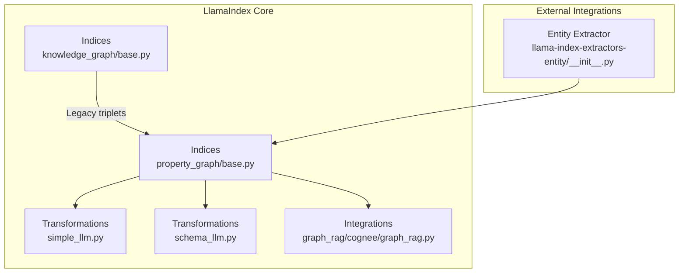
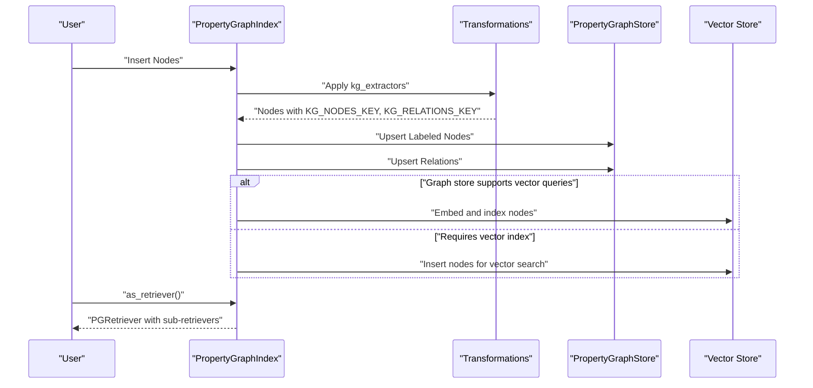
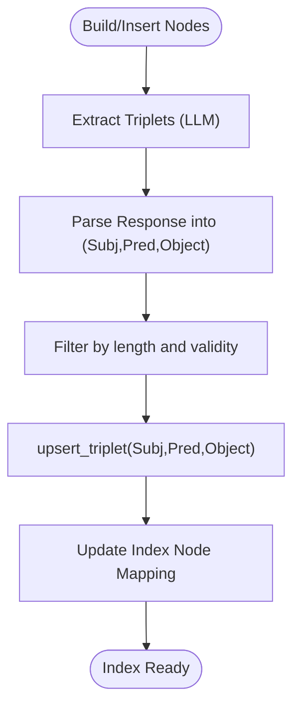
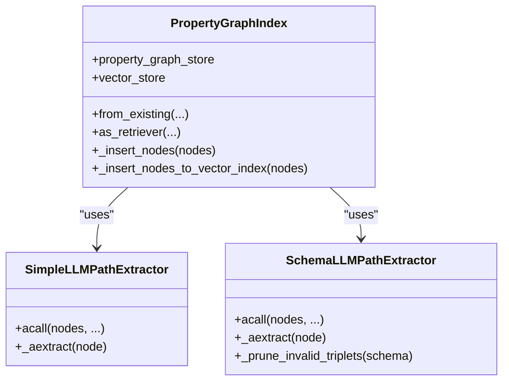
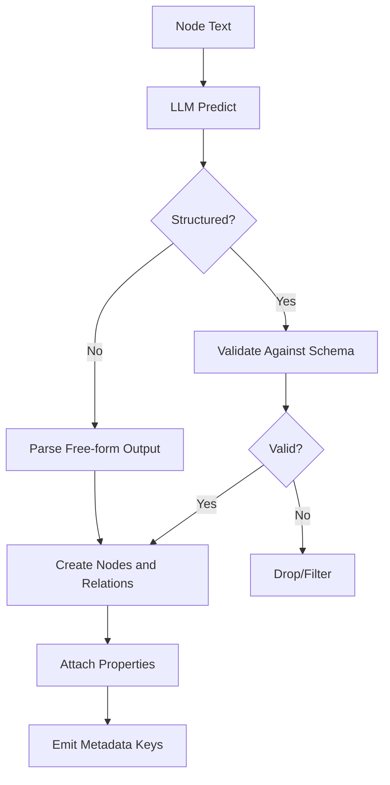
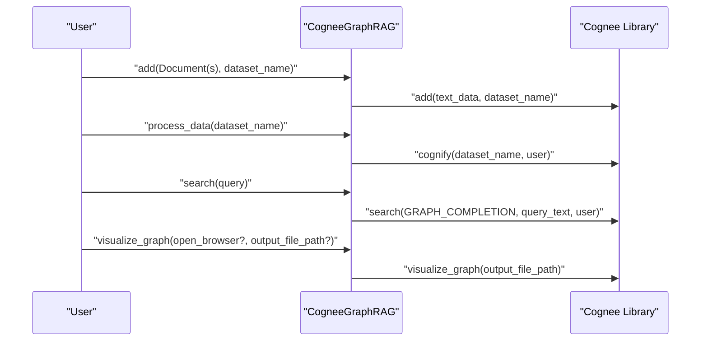
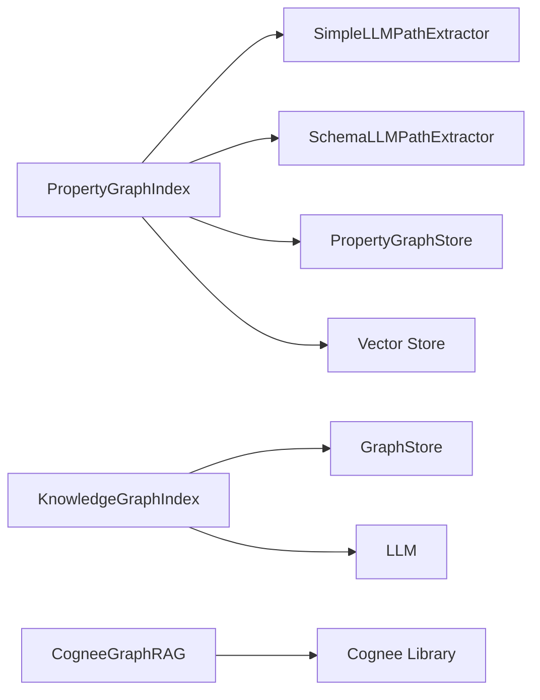

# Knowledge Graph Construction

<cite>
**Referenced Files in This Document**
- [base.py](file://llama-index-core/llama_index/core/indices/knowledge_graph/base.py)
- [__init__.py](file://llama-index-core/llama_index/core/indices/knowledge_graph/__init__.py)
- [base.py](file://llama-index-core/llama_index/core/indices/property_graph/base.py)
- [__init__.py](file://llama-index-core/llama_index/core/indices/property_graph/__init__.py)
- [simple_llm.py](file://llama-index-core/llama_index/core/indices/property_graph/transformations/simple_llm.py)
- [schema_llm.py](file://llama-index-core/llama_index/core/indices/property_graph/transformations/schema_llm.py)
- [graph_rag.py](file://llama-index-integrations/graph_rag/llama-index-graph-rag-cognee/llama_index/graph_rag/cognee/graph_rag.py)
- [__init__.py](file://llama-index-integrations/extractors/llama-index-extractors-entity/llama_index/extractors/entity/__init__.py)
</cite>

## Table of Contents
1. [Introduction](#introduction)
2. [Project Structure](#project-structure)
3. [Core Components](#core-components)
4. [Architecture Overview](#architecture-overview)
5. [Detailed Component Analysis](#detailed-component-analysis)
6. [Dependency Analysis](#dependency-analysis)
7. [Performance Considerations](#performance-considerations)
8. [Troubleshooting Guide](#troubleshooting-guide)
9. [Conclusion](#conclusion)
10. [Appendices](#appendices)

## Introduction
This document explains how to construct knowledge graphs using LlamaIndex, focusing on entity extraction algorithms, relationship mapping strategies, and graph schema design patterns. It also covers integration with external knowledge graph frameworks such as Cognee, including data ingestion pipelines, entity recognition, and relationship extraction workflows. Practical examples demonstrate building graphs from unstructured documents, handling updates, maintaining consistency, managing the graph data lifecycle, versioning strategies, and optimizing performance for large-scale knowledge graphs.

## Project Structure
LlamaIndex provides two primary pathways for knowledge graph construction:
- Legacy Knowledge Graph Index: extracts triplets and stores them in a simple graph store.
- Property Graph Index: a modern, extensible framework supporting labeled nodes, relations, schema enforcement, and hybrid retrieval.

External integrations enable ingestion and processing via Cognee, while dedicated extractors support entity extraction.

**Diagram sources**
- [base.py](file://llama-index-core/llama_index/core/indices/knowledge_graph/base.py#L1-L389)
- [base.py](file://llama-index-core/llama_index/core/indices/property_graph/base.py#L1-L410)
- [simple_llm.py](file://llama-index-core/llama_index/core/indices/property_graph/transformations/simple_llm.py#L1-L131)
- [schema_llm.py](file://llama-index-core/llama_index/core/indices/property_graph/transformations/schema_llm.py#L1-L387)
- [graph_rag.py](file://llama-index-integrations/graph_rag/llama-index-graph-rag-cognee/llama_index/graph_rag/cognee/graph_rag.py#L1-L273)
- [__init__.py](file://llama-index-integrations/extractors/llama-index-extractors-entity/llama_index/extractors/entity/__init__.py#L1-L4)

**Section sources**
- [base.py](file://llama-index-core/llama_index/core/indices/knowledge_graph/base.py#L1-L389)
- [base.py](file://llama-index-core/llama_index/core/indices/property_graph/base.py#L1-L410)
- [simple_llm.py](file://llama-index-core/llama_index/core/indices/property_graph/transformations/simple_llm.py#L1-L131)
- [schema_llm.py](file://llama-index-core/llama_index/core/indices/property_graph/transformations/schema_llm.py#L1-L387)
- [graph_rag.py](file://llama-index-integrations/graph_rag/llama-index-graph-rag-cognee/llama_index/graph_rag/cognee/graph_rag.py#L1-L273)
- [__init__.py](file://llama-index-integrations/extractors/llama-index-extractors-entity/llama_index/extractors/entity/__init__.py#L1-L4)

## Core Components
- KnowledgeGraphIndex (legacy): Extracts triplets from node text using an LLM and stores them in a graph store. Provides retrievers and utilities for graph traversal and visualization.
- PropertyGraphIndex (modern): Builds a property graph from nodes by applying transformations that produce labeled nodes and relations. Supports schema enforcement, embedding, and hybrid retrieval.
- Transformations:
  - SimpleLLMPathExtractor: Extracts triples using a prompt and parses the output into nodes and relations.
  - SchemaLLMPathExtractor: Enforces a structured schema for entities and relations, pruning invalid triplets.
- CogneeGraphRAG: Bridges LlamaIndex Documents to Cognee’s knowledge graph processing pipeline, enabling ingestion, processing, and graph-based retrieval.

**Section sources**
- [base.py](file://llama-index-core/llama_index/core/indices/knowledge_graph/base.py#L42-L389)
- [base.py](file://llama-index-core/llama_index/core/indices/property_graph/base.py#L43-L410)
- [simple_llm.py](file://llama-index-core/llama_index/core/indices/property_graph/transformations/simple_llm.py#L22-L131)
- [schema_llm.py](file://llama-index-core/llama_index/core/indices/property_graph/transformations/schema_llm.py#L89-L387)
- [graph_rag.py](file://llama-index-integrations/graph_rag/llama-index-graph-rag-cognee/llama_index/graph_rag/cognee/graph_rag.py#L18-L273)

## Architecture Overview
The knowledge graph construction pipeline integrates ingestion, extraction, schema enforcement, storage, and retrieval.

**Diagram sources**
- [base.py](file://llama-index-core/llama_index/core/indices/property_graph/base.py#L195-L308)
- [simple_llm.py](file://llama-index-core/llama_index/core/indices/property_graph/transformations/simple_llm.py#L74-L131)
- [schema_llm.py](file://llama-index-core/llama_index/core/indices/property_graph/transformations/schema_llm.py#L242-L387)

## Detailed Component Analysis

### KnowledgeGraphIndex (Legacy)
- Purpose: Extract triplets and leverage a graph store at query time.
- Key behaviors:
  - Triple extraction via LLM with configurable prompts and parsing.
  - Upsert triplets and maintain node-to-subject/object mappings.
  - Retriever modes: keyword, hybrid, and others.
  - NetworkX graph export for visualization.
- Deprecation note: Prefer PropertyGraphIndex for new projects.

**Diagram sources**
- [base.py](file://llama-index-core/llama_index/core/indices/knowledge_graph/base.py#L152-L232)

**Section sources**
- [base.py](file://llama-index-core/llama_index/core/indices/knowledge_graph/base.py#L42-L389)
- [__init__.py](file://llama-index-core/llama_index/core/indices/knowledge_graph/__init__.py#L1-L16)

### PropertyGraphIndex (Modern)
- Purpose: Build a labeled property graph with nodes and relations, optionally embedding nodes and relations.
- Key behaviors:
  - Apply transformations asynchronously for scalability.
  - Deduplicate existing nodes and relations before insertion.
  - Embedding pipeline for both source nodes and KG nodes.
  - Hybrid retriever composition: synonym and vector context retrievers.
  - Schema refresh for stores that support structured queries.

**Diagram sources**
- [base.py](file://llama-index-core/llama_index/core/indices/property_graph/base.py#L43-L410)
- [simple_llm.py](file://llama-index-core/llama_index/core/indices/property_graph/transformations/simple_llm.py#L22-L131)
- [schema_llm.py](file://llama-index-core/llama_index/core/indices/property_graph/transformations/schema_llm.py#L89-L387)

**Section sources**
- [base.py](file://llama-index-core/llama_index/core/indices/property_graph/base.py#L43-L410)
- [__init__.py](file://llama-index-core/llama_index/core/indices/property_graph/__init__.py#L1-L54)

### Entity Extraction Algorithms
- SimpleLLMPathExtractor:
  - Uses an LLM with a prompt to extract triples.
  - Parses free-form LLM output into nodes and relations.
  - Parallelizes extraction across nodes.
- SchemaLLMPathExtractor:
  - Enforces a structured schema for entities and relations.
  - Prunes invalid triplets and properties based on allowed sets and validation rules.
  - Supports strict and non-strict modes.

**Diagram sources**
- [simple_llm.py](file://llama-index-core/llama_index/core/indices/property_graph/transformations/simple_llm.py#L74-L131)
- [schema_llm.py](file://llama-index-core/llama_index/core/indices/property_graph/transformations/schema_llm.py#L242-L387)

**Section sources**
- [simple_llm.py](file://llama-index-core/llama_index/core/indices/property_graph/transformations/simple_llm.py#L22-L131)
- [schema_llm.py](file://llama-index-core/llama_index/core/indices/property_graph/transformations/schema_llm.py#L89-L387)

### Relationship Mapping Strategies
- ImplicitPathExtractor (via kg_extractors list) complements explicit extraction by inferring implicit paths.
- PropertyGraphIndex ensures deduplication of nodes and relations before insertion.
- Triplets are attached to source nodes via a source-id property to maintain provenance.

**Section sources**
- [base.py](file://llama-index-core/llama_index/core/indices/property_graph/base.py#L124-L127)
- [base.py](file://llama-index-core/llama_index/core/indices/property_graph/base.py#L236-L302)

### Graph Schema Design Patterns
- Define entity types and relation types explicitly for predictable extraction.
- Use validation schemas to constrain allowed (subject, relation, object) combinations.
- Enforce property sets for entities and relations to keep the graph consistent.

**Section sources**
- [schema_llm.py](file://llama-index-core/llama_index/core/indices/property_graph/transformations/schema_llm.py#L22-L78)
- [schema_llm.py](file://llama-index-core/llama_index/core/indices/property_graph/transformations/schema_llm.py#L132-L236)

### Integration with Cognee
- CogneeGraphRAG wraps Cognee’s ingestion and processing:
  - add(): converts LlamaIndex Documents to text and adds to a dataset.
  - process_data(): cognify the dataset to build a knowledge graph.
  - rag_search(): traditional RAG over chunks.
  - search(): graph-based retrieval.
  - get_related_nodes(): insight search around a node.
  - visualize_graph(): generates an HTML visualization.

**Diagram sources**
- [graph_rag.py](file://llama-index-integrations/graph_rag/llama-index-graph-rag-cognee/llama_index/graph_rag/cognee/graph_rag.py#L119-L273)

**Section sources**
- [graph_rag.py](file://llama-index-integrations/graph_rag/llama-index-graph-rag-cognee/llama_index/graph_rag/cognee/graph_rag.py#L18-L273)

### Entity Extractors Integration
- EntityExtractor is exposed via the integration’s extractor package, enabling entity-centric extraction workflows alongside graph construction.

**Section sources**
- [__init__.py](file://llama-index-integrations/extractors/llama-index-extractors-entity/llama_index/extractors/entity/__init__.py#L1-L4)

## Dependency Analysis
- PropertyGraphIndex depends on:
  - Transformations for extracting nodes and relations.
  - PropertyGraphStore for persistence and retrieval.
  - Vector store for embedding and vector-based retrieval.
- KnowledgeGraphIndex depends on:
  - GraphStore for triplets and retrieval.
  - LLM for triplet extraction and parsing.
- CogneeGraphRAG depends on:
  - Cognee library for ingestion, processing, and visualization.

**Diagram sources**
- [base.py](file://llama-index-core/llama_index/core/indices/property_graph/base.py#L124-L127)
- [simple_llm.py](file://llama-index-core/llama_index/core/indices/property_graph/transformations/simple_llm.py#L22-L68)
- [schema_llm.py](file://llama-index-core/llama_index/core/indices/property_graph/transformations/schema_llm.py#L132-L146)
- [base.py](file://llama-index-core/llama_index/core/indices/knowledge_graph/base.py#L16-L27)
- [graph_rag.py](file://llama-index-integrations/graph_rag/llama-index-graph-rag-cognee/llama_index/graph_rag/cognee/graph_rag.py#L68-L102)

**Section sources**
- [base.py](file://llama-index-core/llama_index/core/indices/property_graph/base.py#L1-L410)
- [simple_llm.py](file://llama-index-core/llama_index/core/indices/property_graph/transformations/simple_llm.py#L1-L131)
- [schema_llm.py](file://llama-index-core/llama_index/core/indices/property_graph/transformations/schema_llm.py#L1-L387)
- [base.py](file://llama-index-core/llama_index/core/indices/knowledge_graph/base.py#L1-L389)
- [graph_rag.py](file://llama-index-integrations/graph_rag/llama-index-graph-rag-cognee/llama_index/graph_rag/cognee/graph_rag.py#L1-L273)

## Performance Considerations
- Asynchronous transformations: PropertyGraphIndex runs transformations concurrently to improve throughput.
- Embedding batching: Embeddings for both source and KG nodes are computed in batches to reduce overhead.
- Vector store fallback: When the graph store lacks native vector capabilities, a vector index is used to support vector-based retrieval.
- Deduplication: Prevents redundant inserts and reduces storage and query costs.
- Prompt tuning and limits: Control max triplets per chunk and worker concurrency to balance quality and speed.

[No sources needed since this section provides general guidance]

## Troubleshooting Guide
- Triple parsing failures:
  - Ensure the LLM output follows the expected format; otherwise, triplets are skipped.
  - Consider using SchemaLLMPathExtractor to enforce a schema and catch malformed outputs early.
- Duplicate nodes/relations:
  - PropertyGraphIndex filters duplicates before insertion; verify that IDs and hashes are correctly computed.
- Missing embeddings:
  - Enable embedding for KG nodes when the graph store does not support vector queries or when hybrid retrieval is required.
- Deprecated index:
  - KnowledgeGraphIndex is deprecated; migrate to PropertyGraphIndex for ongoing support and features.

**Section sources**
- [simple_llm.py](file://llama-index-core/llama_index/core/indices/property_graph/transformations/simple_llm.py#L80-L115)
- [schema_llm.py](file://llama-index-core/llama_index/core/indices/property_graph/transformations/schema_llm.py#L341-L371)
- [base.py](file://llama-index-core/llama_index/core/indices/property_graph/base.py#L236-L308)
- [base.py](file://llama-index-core/llama_index/core/indices/knowledge_graph/base.py#L33-L41)

## Conclusion
LlamaIndex offers robust, extensible mechanisms for constructing knowledge graphs. The PropertyGraphIndex provides a modern, schema-aware pipeline with powerful extraction and retrieval capabilities, while the legacy KnowledgeGraphIndex remains useful for simple triplet-based graphs. Integrations like Cognee streamline ingestion and visualization, and dedicated extractors support entity-centric workflows. By combining structured schemas, asynchronous transformations, and vector indexing, teams can build scalable, consistent knowledge graphs from unstructured data.

[No sources needed since this section summarizes without analyzing specific files]

## Appendices

### Practical Example: Building a Graph from Unstructured Documents
- Steps:
  - Prepare Documents.
  - Initialize PropertyGraphIndex with kg_extractors (e.g., SimpleLLMPathExtractor and ImplicitPathExtractor).
  - Insert nodes; the index applies transformations, upserts nodes and relations, and optionally embeds them.
  - Retrieve via as_retriever() with sub-retrievers for synonym and vector contexts.
- Notes:
  - Use SchemaLLMPathExtractor to enforce domain-specific schemas.
  - For graph-based retrieval, integrate with CogneeGraphRAG for advanced insights and visualization.

**Section sources**
- [base.py](file://llama-index-core/llama_index/core/indices/property_graph/base.py#L195-L308)
- [simple_llm.py](file://llama-index-core/llama_index/core/indices/property_graph/transformations/simple_llm.py#L74-L131)
- [schema_llm.py](file://llama-index-core/llama_index/core/indices/property_graph/transformations/schema_llm.py#L242-L387)
- [graph_rag.py](file://llama-index-integrations/graph_rag/llama-index-graph-rag-cognee/llama_index/graph_rag/cognee/graph_rag.py#L119-L209)

### Handling Graph Updates and Consistency
- Upsert semantics:
  - PropertyGraphIndex upserts nodes and relations; deduplication prevents inconsistencies.
- Provenance:
  - Attach source IDs to nodes and relations to trace origins.
- Schema refresh:
  - Some stores refresh schema after insertions to support structured queries.

**Section sources**
- [base.py](file://llama-index-core/llama_index/core/indices/property_graph/base.py#L236-L307)

### Graph Data Lifecycle Management and Versioning
- Lifecycle:
  - Ingestion: add Documents to dataset (Cognee) or insert nodes (PropertyGraphIndex).
  - Processing: cognify (Cognee) or apply transformations (PropertyGraphIndex).
  - Retrieval: graph-based or hybrid retrieval.
  - Visualization: generate HTML for inspection.
- Versioning:
  - Maintain separate dataset names or namespaces for versions.
  - Track provenance via source IDs to support audits and rollbacks.

**Section sources**
- [graph_rag.py](file://llama-index-integrations/graph_rag/llama-index-graph-rag-cognee/llama_index/graph_rag/cognee/graph_rag.py#L119-L268)