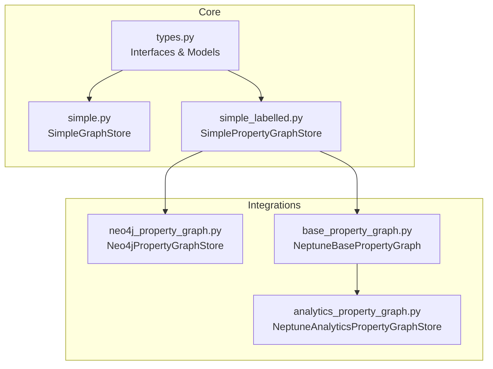
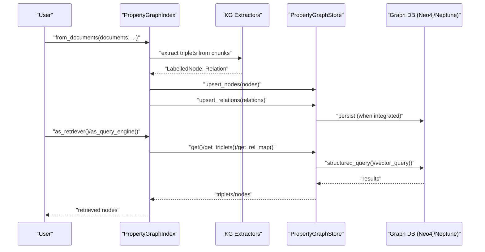
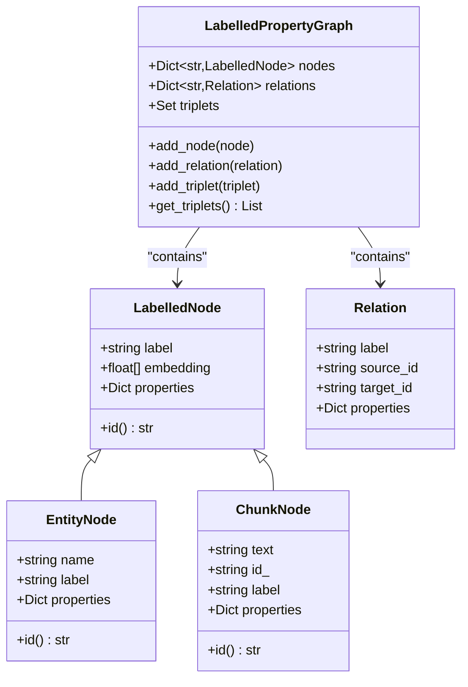
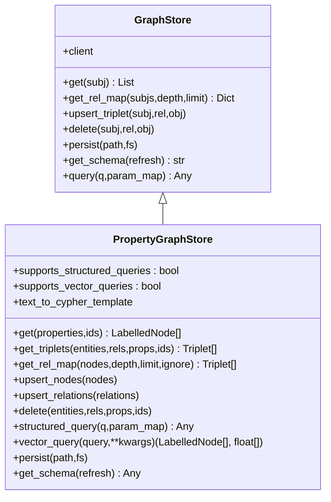
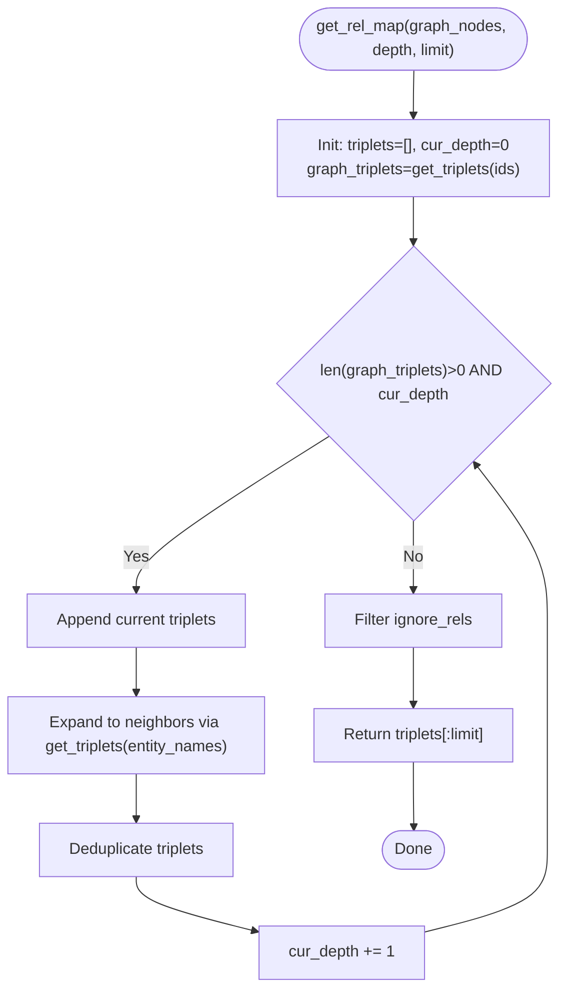
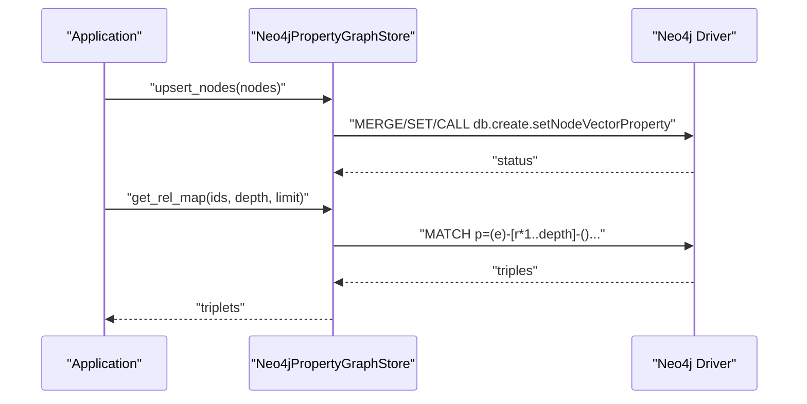
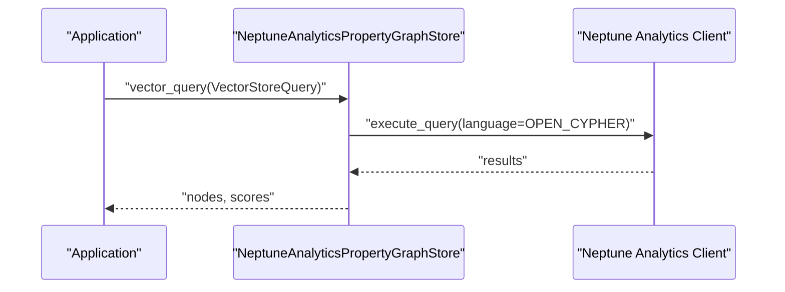
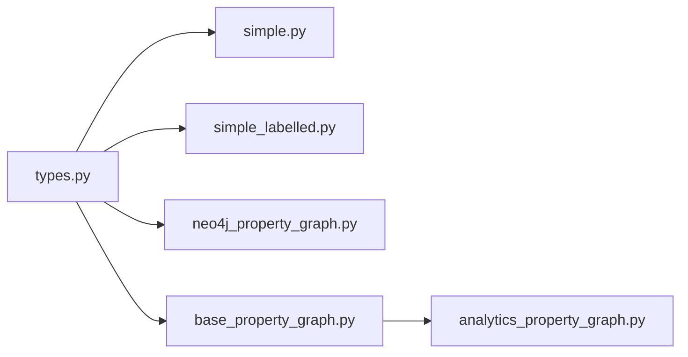

# Property Graph Modeling

<cite>
**Referenced Files in This Document**
- [types.py](file://llama-index-core/llama_index/core/graph_stores/types.py)
- [simple.py](file://llama-index-core/llama_index/core/graph_stores/simple.py)
- [simple_labelled.py](file://llama-index-core/llama_index/core/graph_stores/simple_labelled.py)
- [__init__.py](file://llama-index-core/llama_index/core/graph_stores/__init__.py)
- [neo4j_property_graph.py](file://llama-index-integrations/graph_stores/llama-index-graph-stores-neo4j/llama_index/graph_stores/neo4j/neo4j_property_graph.py)
- [base_property_graph.py](file://llama-index-integrations/graph_stores/llama-index-graph-stores-neptune/llama_index/graph_stores/neptune/base_property_graph.py)
- [analytics_property_graph.py](file://llama-index-integrations/graph_stores/llama-index-graph-stores-neptune/llama_index/graph_stores/neptune/analytics_property_graph.py)
- [property_graph_basic.ipynb](file://docs/examples/property_graph/property_graph_basic.ipynb)
- [property_graph_advanced.ipynb](file://docs/examples/property_graph/property_graph_advanced.ipynb)
</cite>

## Table of Contents
1. [Introduction](#introduction)
2. [Project Structure](#project-structure)
3. [Core Components](#core-components)
4. [Architecture Overview](#architecture-overview)
5. [Detailed Component Analysis](#detailed-component-analysis)
6. [Dependency Analysis](#dependency-analysis)
7. [Performance Considerations](#performance-considerations)
8. [Troubleshooting Guide](#troubleshooting-guide)
9. [Conclusion](#conclusion)
10. [Appendices](#appendices)

## Introduction
This document explains property graph modeling in LlamaIndex, focusing on data structures, schema definition, graph traversal, Cypher-like queries, and integration with property graph databases such as Neo4j and Amazon Neptune. It covers how LlamaIndex constructs labeled property graphs from documents, how to query and filter nodes and edges, and how to evolve schemas over time. Guidance is also provided for optimization, indexing, visualization, and best practices.

## Project Structure
LlamaIndex organizes property graph capabilities across core graph store abstractions and multiple integrations:
- Core graph store interfaces and simple in-memory implementations
- Integrations with Neo4j and Amazon Neptune (both database-backed and analytics)
- Example notebooks demonstrating construction, querying, and visualization

**Diagram sources**
- [types.py](file://llama-index-core/llama_index/core/graph_stores/types.py#L215-L528)
- [simple.py](file://llama-index-core/llama_index/core/graph_stores/simple.py#L72-L187)
- [simple_labelled.py](file://llama-index-core/llama_index/core/graph_stores/simple_labelled.py#L20-L311)
- [neo4j_property_graph.py](file://llama-index-integrations/graph_stores/llama-index-graph-stores-neo4j/llama_index/graph_stores/neo4j/neo4j_property_graph.py#L94-L800)
- [base_property_graph.py](file://llama-index-integrations/graph_stores/llama-index-graph-stores-neptune/llama_index/graph_stores/neptune/base_property_graph.py#L22-L387)
- [analytics_property_graph.py](file://llama-index-integrations/graph_stores/llama-index-graph-stores-neptune/llama_index/graph_stores/neptune/analytics_property_graph.py#L20-L220)

**Section sources**
- [__init__.py](file://llama-index-core/llama_index/core/graph_stores/__init__.py#L1-L22)
- [types.py](file://llama-index-core/llama_index/core/graph_stores/types.py#L1-L528)
- [simple.py](file://llama-index-core/llama_index/core/graph_stores/simple.py#L1-L187)
- [simple_labelled.py](file://llama-index-core/llama_index/core/graph_stores/simple_labelled.py#L1-L311)
- [neo4j_property_graph.py](file://llama-index-integrations/graph_stores/llama-index-graph-stores-neo4j/llama_index/graph_stores/neo4j/neo4j_property_graph.py#L1-L800)
- [base_property_graph.py](file://llama-index-integrations/graph_stores/llama-index-graph-stores-neptune/llama_index/graph_stores/neptune/base_property_graph.py#L1-L387)
- [analytics_property_graph.py](file://llama-index-integrations/graph_stores/llama-index-graph-stores-neptune/llama_index/graph_stores/neptune/analytics_property_graph.py#L1-L220)

## Core Components
- Property graph data structures
  - LabelledNode: base node with label, optional embedding, and arbitrary properties
  - EntityNode: labeled entity with name and properties
  - ChunkNode: labeled text chunk with text content and optional id
  - Relation: typed relationship with source/target ids and properties
  - LabelledPropertyGraph: in-memory graph holding nodes, relations, and triplets
- Graph store interfaces
  - GraphStore: generic triple-store interface for simple adjacency graphs
  - PropertyGraphStore: labeled property graph interface with get/get_triplets/get_rel_map/upsert/delete plus vector and structured query support
- Simple implementations
  - SimpleGraphStore: in-memory triple store persisted as JSON
  - SimplePropertyGraphStore: in-memory labeled property graph with filtering and persistence

Key capabilities:
- Node and edge property filtering
- Depth-aware relational map extraction
- Upsert and delete semantics for nodes and relations
- Persistence to JSON for simple stores
- Vector similarity queries against node embeddings (when supported)

**Section sources**
- [types.py](file://llama-index-core/llama_index/core/graph_stores/types.py#L36-L214)
- [types.py](file://llama-index-core/llama_index/core/graph_stores/types.py#L215-L528)
- [simple.py](file://llama-index-core/llama_index/core/graph_stores/simple.py#L72-L187)
- [simple_labelled.py](file://llama-index-core/llama_index/core/graph_stores/simple_labelled.py#L20-L311)

## Architecture Overview
LlamaIndex’s property graph architecture separates concerns between:
- Construction: extractors produce labeled nodes and relations from documents
- Storage: PropertyGraphStore implementations persist and query graphs
- Retrieval: retrievers select seed nodes and traverse to collect relevant triplets
- Querying: PropertyGraphStore supports Cypher-like structured queries and vector similarity

**Diagram sources**
- [types.py](file://llama-index-core/llama_index/core/graph_stores/types.py#L276-L528)
- [simple_labelled.py](file://llama-index-core/llama_index/core/graph_stores/simple_labelled.py#L133-L142)
- [neo4j_property_graph.py](file://llama-index-integrations/graph_stores/llama-index-graph-stores-neo4j/llama_index/graph_stores/neo4j/neo4j_property_graph.py#L329-L408)
- [base_property_graph.py](file://llama-index-integrations/graph_stores/llama-index-graph-stores-neptune/llama_index/graph_stores/neptune/base_property_graph.py#L264-L359)

## Detailed Component Analysis

### Data Model and Schema Definition
- Nodes
  - LabelledNode: base with label, optional embedding, properties
  - EntityNode: labeled entity with name and properties
  - ChunkNode: labeled text chunk with text and optional id
- Edges
  - Relation: typed edge with source_id, target_id, label, properties
- Triplets
  - LabelledPropertyGraph maintains sets of triplets and ensures uniqueness

**Diagram sources**
- [types.py](file://llama-index-core/llama_index/core/graph_stores/types.py#L36-L214)
- [types.py](file://llama-index-core/llama_index/core/graph_stores/types.py#L119-L214)

**Section sources**
- [types.py](file://llama-index-core/llama_index/core/graph_stores/types.py#L36-L214)

### Property Graph Store Interfaces
- GraphStore
  - Provides get, get_rel_map, upsert_triplet, delete, persist, get_schema, query
- PropertyGraphStore
  - Adds get, get_triplets, get_rel_map, upsert_nodes, upsert_relations, delete, structured_query, vector_query
  - Async variants included
  - Supports vector and structured query flags

**Diagram sources**
- [types.py](file://llama-index-core/llama_index/core/graph_stores/types.py#L215-L528)

**Section sources**
- [types.py](file://llama-index-core/llama_index/core/graph_stores/types.py#L215-L528)

### Simple Implementations
- SimpleGraphStore
  - In-memory adjacency map persisted as JSON
  - get_rel_map supports depth-limited traversal with limit
- SimplePropertyGraphStore
  - In-memory LabelledPropertyGraph
  - Filtering by properties and ids for nodes/triplets
  - get_rel_map performs iterative depth expansion
  - save_networkx_graph and show_jupyter_graph helpers for visualization

**Diagram sources**
- [simple_labelled.py](file://llama-index-core/llama_index/core/graph_stores/simple_labelled.py#L103-L131)

**Section sources**
- [simple.py](file://llama-index-core/llama_index/core/graph_stores/simple.py#L72-L187)
- [simple_labelled.py](file://llama-index-core/llama_index/core/graph_stores/simple_labelled.py#L20-L311)

### Neo4j Integration
Neo4jPropertyGraphStore implements PropertyGraphStore with:
- Structured schema discovery and enhancement
- Upsert of nodes and relations with batching and chunking
- Cypher-based get, get_triplets, get_rel_map
- Vector similarity via vector index or fallback cosine similarity
- Constraints and indexes for performance

**Diagram sources**
- [neo4j_property_graph.py](file://llama-index-integrations/graph_stores/llama-index-graph-stores-neo4j/llama_index/graph_stores/neo4j/neo4j_property_graph.py#L329-L408)
- [neo4j_property_graph.py](file://llama-index-integrations/graph_stores/llama-index-graph-stores-neo4j/llama_index/graph_stores/neo4j/neo4j_property_graph.py#L543-L610)
- [neo4j_property_graph.py](file://llama-index-integrations/graph_stores/llama-index-graph-stores-neo4j/llama_index/graph_stores/neo4j/neo4j_property_graph.py#L659-L720)

**Section sources**
- [neo4j_property_graph.py](file://llama-index-integrations/graph_stores/llama-index-graph-stores-neo4j/llama_index/graph_stores/neo4j/neo4j_property_graph.py#L94-L800)

### Amazon Neptune Integration
NeptuneBasePropertyGraph and NeptuneAnalyticsPropertyGraph provide:
- Base Cypher query support and schema introspection
- Upsert and deletion of nodes and relations
- Vector similarity via Neptune algorithms
- Schema caching and refresh

**Diagram sources**
- [analytics_property_graph.py](file://llama-index-integrations/graph_stores/llama-index-graph-stores-neptune/llama_index/graph_stores/neptune/analytics_property_graph.py#L75-L128)

**Section sources**
- [base_property_graph.py](file://llama-index-integrations/graph_stores/llama-index-graph-stores-neptune/llama_index/graph_stores/neptune/base_property_graph.py#L22-L387)
- [analytics_property_graph.py](file://llama-index-integrations/graph_stores/llama-index-graph-stores-neptune/llama_index/graph_stores/neptune/analytics_property_graph.py#L20-L220)

### Construction, Querying, and Visualization
- Construction
  - PropertyGraphIndex.from_documents builds nodes and relations from documents
  - Extractors (e.g., SchemaLLMPathExtractor) can constrain schema
- Querying
  - Retrievers combine synonym expansion and vector context retrieval
  - Query engines assemble results from retrieved triplets
- Visualization
  - SimplePropertyGraphStore.save_networkx_graph writes HTML for inspection

**Section sources**
- [property_graph_basic.ipynb](file://docs/examples/property_graph/property_graph_basic.ipynb#L103-L192)
- [property_graph_advanced.ipynb](file://docs/examples/property_graph/property_graph_advanced.ipynb#L282-L293)
- [simple_labelled.py](file://llama-index-core/llama_index/core/graph_stores/simple_labelled.py#L262-L277)

## Dependency Analysis
- Core abstractions in types.py underpin all implementations
- Simple implementations are standalone and useful for development/testing
- Neo4j and Neptune integrations depend on their respective clients and expose Cypher-based APIs
- Retrievers and query engines consume PropertyGraphStore interfaces

**Diagram sources**
- [types.py](file://llama-index-core/llama_index/core/graph_stores/types.py#L1-L528)
- [simple.py](file://llama-index-core/llama_index/core/graph_stores/simple.py#L1-L187)
- [simple_labelled.py](file://llama-index-core/llama_index/core/graph_stores/simple_labelled.py#L1-L311)
- [neo4j_property_graph.py](file://llama-index-integrations/graph_stores/llama-index-graph-stores-neo4j/llama_index/graph_stores/neo4j/neo4j_property_graph.py#L1-L800)
- [base_property_graph.py](file://llama-index-integrations/graph_stores/llama-index-graph-stores-neptune/llama_index/graph_stores/neptune/base_property_graph.py#L1-L387)
- [analytics_property_graph.py](file://llama-index-integrations/graph_stores/llama-index-graph-stores-neptune/llama_index/graph_stores/neptune/analytics_property_graph.py#L1-L220)

**Section sources**
- [__init__.py](file://llama-index-core/llama_index/core/graph_stores/__init__.py#L1-L22)

## Performance Considerations
- Indexing and constraints
  - Neo4jPropertyGraphStore creates unique constraints and vector indexes when supported
- Batching and chunking
  - Neo4j upserts are chunked to reduce transaction overhead
- Vector similarity
  - Prefer vector index when available; otherwise compute cosine similarity
- Traversal limits
  - get_rel_map enforces depth and limit to bound result sizes
- Schema caching
  - Neptune stores cache schema to avoid repeated expensive introspection

[No sources needed since this section provides general guidance]

## Troubleshooting Guide
- Neo4j errors
  - Structured queries handle specific Neo4j exceptions and fall back to session-based execution
- Missing client or schema support
  - SimplePropertyGraphStore raises NotImplementedError for unsupported operations
- Vector and structured query availability
  - Check supports_structured_queries and supports_vector_queries flags on stores
- Parameter sanitization
  - Neo4j store can sanitize query output values when enabled

**Section sources**
- [neo4j_property_graph.py](file://llama-index-integrations/graph_stores/llama-index-graph-stores-neo4j/llama_index/graph_stores/neo4j/neo4j_property_graph.py#L612-L657)
- [simple_labelled.py](file://llama-index-core/llama_index/core/graph_stores/simple_labelled.py#L233-L253)

## Conclusion
LlamaIndex provides a robust, extensible property graph framework:
- Clear data models for nodes, edges, and triplets
- Flexible storage backends with Cypher-like query support
- Practical construction and retrieval patterns
- Visualization aids for debugging
Adopting schema constraints, leveraging vector indexes, and carefully managing traversal depth yields scalable and efficient graph applications.

## Appendices

### Property Filtering and Graph Traversal Patterns
- Property filtering
  - Filter nodes by ids and properties; filter triplets by entity/relation names and properties
- Relational map extraction
  - Iterative expansion from seed nodes with configurable depth and limit
- Cypher-like queries
  - Neo4j and Neptune stores translate get/get_triplets/get_rel_map into Cypher statements

**Section sources**
- [simple_labelled.py](file://llama-index-core/llama_index/core/graph_stores/simple_labelled.py#L40-L101)
- [neo4j_property_graph.py](file://llama-index-integrations/graph_stores/llama-index-graph-stores-neo4j/llama_index/graph_stores/neo4j/neo4j_property_graph.py#L409-L541)
- [base_property_graph.py](file://llama-index-integrations/graph_stores/llama-index-graph-stores-neptune/llama_index/graph_stores/neptune/base_property_graph.py#L108-L182)

### Schema Evolution and Best Practices
- Define explicit schemas during extraction to constrain entity and relation types
- Use vector indexes in Neo4j for efficient similarity search
- Persist and reload graph stores to disk for reuse
- Visualize graphs for debugging and validation

**Section sources**
- [property_graph_advanced.ipynb](file://docs/examples/property_graph/property_graph_advanced.ipynb#L128-L142)
- [simple_labelled.py](file://llama-index-core/llama_index/core/graph_stores/simple_labelled.py#L164-L196)
- [simple_labelled.py](file://llama-index-core/llama_index/core/graph_stores/simple_labelled.py#L262-L310)