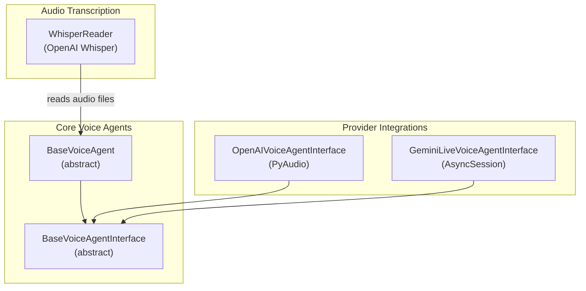
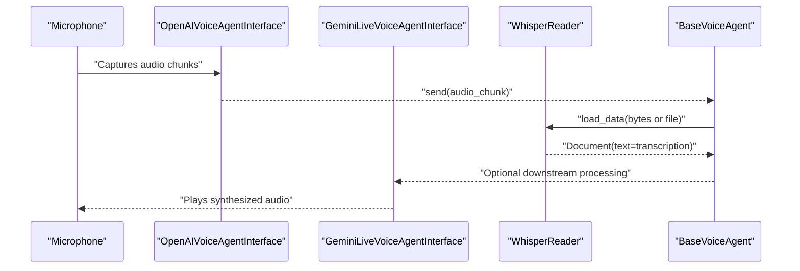
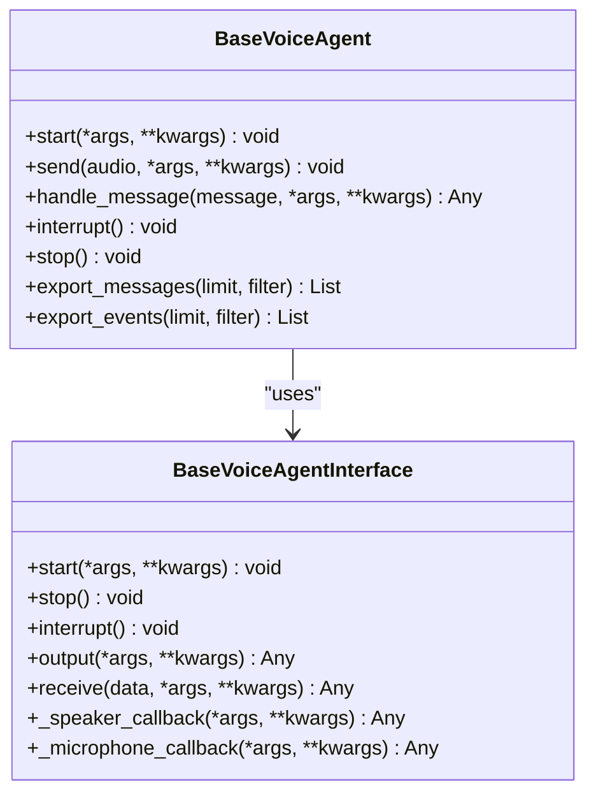
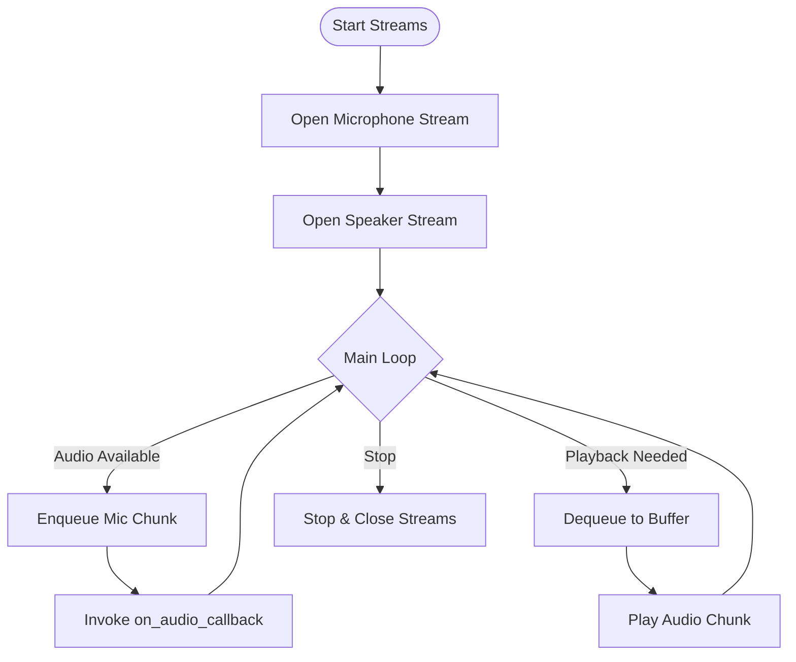
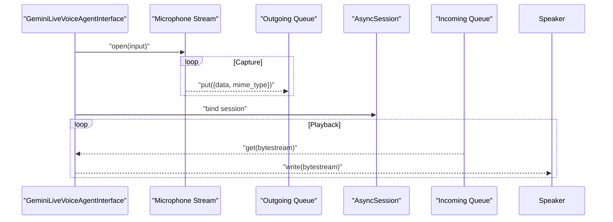
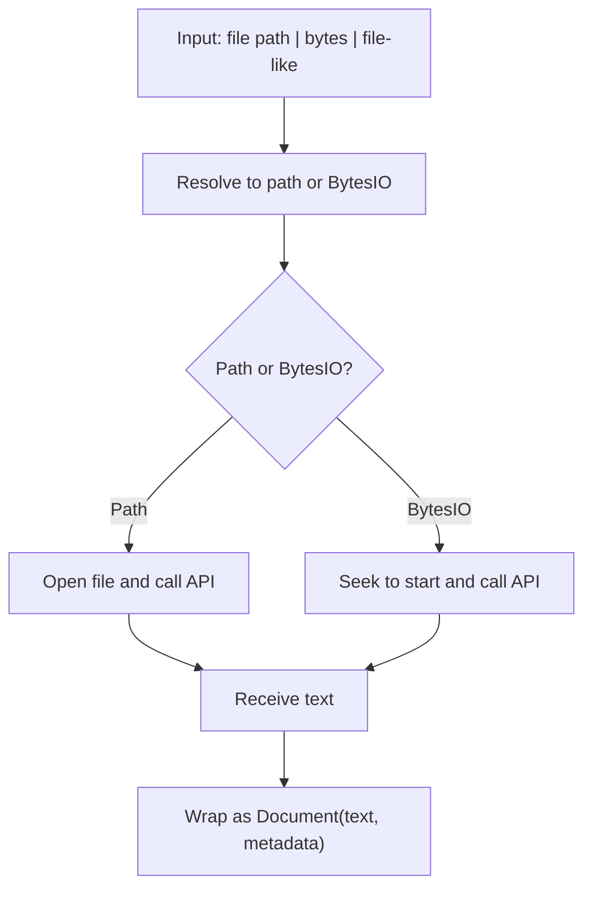
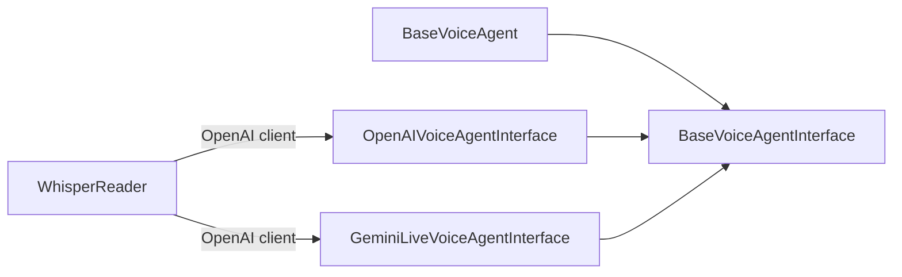

# Audio Processing

<cite>
**Referenced Files in This Document**
- [base.py](file://llama-index-core/llama_index/core/voice_agents/base.py)
- [interface.py](file://llama-index-core/llama_index/core/voice_agents/interface.py)
- [audio_interface.py](file://llama-index-integrations/voice_agents/llama-index-voice-agents-openai/llama_index/voice_agents/openai/audio_interface.py)
- [audio_interface.py](file://llama-index-integrations/voice_agents/llama-index-voice-agents-gemini-live/llama_index/voice_agents/gemini_live/audio_interface.py)
- [base.py](file://llama-index-integrations/readers/llama-index-readers-whisper/llama_index/readers/whisper/base.py)
- [__init__.py](file://llama-index-integrations/readers/llama-index-readers-whisper/llama_index/readers/whisper/__init__.py)
- [test_readers_whisper.py](file://llama-index-integrations/readers/llama-index-readers-whisper/tests/test_readers_whisper.py)
</cite>

## Table of Contents
1. [Introduction](#introduction)
2. [Project Structure](#project-structure)
3. [Core Components](#core-components)
4. [Architecture Overview](#architecture-overview)
5. [Detailed Component Analysis](#detailed-component-analysis)
6. [Dependency Analysis](#dependency-analysis)
7. [Performance Considerations](#performance-considerations)
8. [Troubleshooting Guide](#troubleshooting-guide)
9. [Conclusion](#conclusion)
10. [Appendices](#appendices)

## Introduction
This document explains audio processing capabilities in LlamaIndex multi-modal systems with a focus on speech-to-text conversion, audio transcription, voice activity detection, integration with ASR models, speaker diarization, audio feature extraction, audio embedding generation, acoustic modeling, and noise reduction. It also covers practical examples such as voice-enabled retrieval-augmented generation (RAG), audio question answering, and speech synthesis integration, along with real-time audio processing, latency optimization, multi-language support, audio quality assessment, background noise filtering, and audio format compatibility.

## Project Structure
The repository organizes audio-related functionality across:
- Core voice agent abstractions under the voice agents module
- Integration-specific audio interfaces for providers (OpenAI and Gemini Live)
- A Whisper-based reader for audio transcription
- Tests validating Whisper reader behavior

**Diagram sources**
- [base.py](file://llama-index-core/llama_index/core/voice_agents/base.py#L11-L163)
- [interface.py](file://llama-index-core/llama_index/core/voice_agents/interface.py#L5-L116)
- [audio_interface.py](file://llama-index-integrations/voice_agents/llama-index-voice-agents-openai/llama_index/voice_agents/openai/audio_interface.py#L21-L126)
- [audio_interface.py](file://llama-index-integrations/voice_agents/llama-index-voice-agents-gemini-live/llama_index/voice_agents/gemini_live/audio_interface.py#L19-L150)
- [base.py](file://llama-index-integrations/readers/llama-index-readers-whisper/llama_index/readers/whisper/base.py#L15-L175)

**Section sources**
- [base.py](file://llama-index-core/llama_index/core/voice_agents/base.py#L1-L163)
- [interface.py](file://llama-index-core/llama_index/core/voice_agents/interface.py#L1-L116)
- [audio_interface.py](file://llama-index-integrations/voice_agents/llama-index-voice-agents-openai/llama_index/voice_agents/openai/audio_interface.py#L1-L126)
- [audio_interface.py](file://llama-index-integrations/voice_agents/llama-index-voice-agents-gemini-live/llama_index/voice_agents/gemini_live/audio_interface.py#L1-L150)
- [base.py](file://llama-index-integrations/readers/llama-index-readers-whisper/llama_index/readers/whisper/base.py#L1-L175)

## Core Components
- Voice Agent Abstractions
  - BaseVoiceAgent defines asynchronous lifecycle methods for starting, sending audio, handling messages, interrupting, and stopping, plus utilities to export messages and events.
  - BaseVoiceAgentInterface defines the contract for audio input/output, including callbacks, start/stop/interrupt, output processing, and receiving audio data.

- Provider Interfaces
  - OpenAIVoiceAgentInterface integrates PyAudio for real-time capture/playback, buffering, and callback-driven streaming with configurable sample rate and chunk size.
  - GeminiLiveVoiceAgentInterface integrates with Google GenAI live sessions, managing separate input/output queues and sample rates for sending/receiving audio.

- WhisperReader
  - Provides synchronous and asynchronous audio transcription via the OpenAI Whisper API, supporting local files, bytes, and file-like objects, with configurable language and prompt.

**Section sources**
- [base.py](file://llama-index-core/llama_index/core/voice_agents/base.py#L11-L163)
- [interface.py](file://llama-index-core/llama_index/core/voice_agents/interface.py#L5-L116)
- [audio_interface.py](file://llama-index-integrations/voice_agents/llama-index-voice-agents-openai/llama_index/voice_agents/openai/audio_interface.py#L21-L126)
- [audio_interface.py](file://llama-index-integrations/voice_agents/llama-index-voice-agents-gemini-live/llama_index/voice_agents/gemini_live/audio_interface.py#L19-L150)
- [base.py](file://llama-index-integrations/readers/llama-index-readers-whisper/llama_index/readers/whisper/base.py#L15-L175)

## Architecture Overview
The audio pipeline combines voice agent interfaces with transcription and optional downstream RAG or synthesis.

**Diagram sources**
- [audio_interface.py](file://llama-index-integrations/voice_agents/llama-index-voice-agents-openai/llama_index/voice_agents/openai/audio_interface.py#L40-L121)
- [audio_interface.py](file://llama-index-integrations/voice_agents/llama-index-voice-agents-gemini-live/llama_index/voice_agents/gemini_live/audio_interface.py#L41-L149)
- [base.py](file://llama-index-integrations/readers/llama-index-readers-whisper/llama_index/readers/whisper/base.py#L148-L174)
- [base.py](file://llama-index-core/llama_index/core/voice_agents/base.py#L56-L112)

## Detailed Component Analysis

### Voice Agent Abstractions
- BaseVoiceAgent
  - Responsibilities: orchestrate websocket-backed voice services, manage tool use, maintain conversation history and events, and expose lifecycle hooks for async operation.
  - Key methods: start, send, handle_message, interrupt, stop, export_messages, export_events.

- BaseVoiceAgentInterface
  - Responsibilities: define the audio I/O contract for input/output devices, including callbacks, streaming control, and data reception.

**Diagram sources**
- [base.py](file://llama-index-core/llama_index/core/voice_agents/base.py#L11-L163)
- [interface.py](file://llama-index-core/llama_index/core/voice_agents/interface.py#L5-L116)

**Section sources**
- [base.py](file://llama-index-core/llama_index/core/voice_agents/base.py#L11-L163)
- [interface.py](file://llama-index-core/llama_index/core/voice_agents/interface.py#L5-L116)

### OpenAI Voice Agent Interface
- Real-time audio capture and playback using PyAudio
- Microphone callback enqueues captured chunks; speaker callback drains buffers for playback
- Configurable sample rate, chunk size, and format
- Thread-safe queue usage and re-engagement delay handling

**Diagram sources**
- [audio_interface.py](file://llama-index-integrations/voice_agents/llama-index-voice-agents-openai/llama_index/voice_agents/openai/audio_interface.py#L74-L121)

**Section sources**
- [audio_interface.py](file://llama-index-integrations/voice_agents/llama-index-voice-agents-openai/llama_index/voice_agents/openai/audio_interface.py#L21-L126)

### Gemini Live Voice Agent Interface
- Asynchronous integration with Google GenAI live sessions
- Separate queues for outgoing and incoming audio
- Dedicated input/output sample rates and chunk sizes
- Non-blocking reads/writes using asyncio threads

**Diagram sources**
- [audio_interface.py](file://llama-index-integrations/voice_agents/llama-index-voice-agents-gemini-live/llama_index/voice_agents/gemini_live/audio_interface.py#L41-L149)

**Section sources**
- [audio_interface.py](file://llama-index-integrations/voice_agents/llama-index-voice-agents-gemini-live/llama_index/voice_agents/gemini_live/audio_interface.py#L19-L150)

### WhisperReader: Speech-to-Text and Transcription
- Supports local file paths, bytes, and file-like objects
- Synchronous and asynchronous transcription via OpenAI Whisper API
- Configurable model, language, prompt, and additional transcribe arguments
- Returns a single Document containing the transcribed text and optional metadata

**Diagram sources**
- [base.py](file://llama-index-integrations/readers/llama-index-readers-whisper/llama_index/readers/whisper/base.py#L59-L174)

**Section sources**
- [base.py](file://llama-index-integrations/readers/llama-index-readers-whisper/llama_index/readers/whisper/base.py#L15-L175)
- [__init__.py](file://llama-index-integrations/readers/llama-index-readers-whisper/llama_index/readers/whisper/__init__.py#L1-L4)
- [test_readers_whisper.py](file://llama-index-integrations/readers/llama-index-readers-whisper/tests/test_readers_whisper.py)

## Dependency Analysis
- Voice Agent Core depends on:
  - BaseVoiceAgentInterface for audio I/O contracts
  - WebSocket transport abstraction (external to this module)
- Provider Interfaces depend on:
  - PyAudio for real-time capture/playback
  - Google GenAI live session bindings for Gemini integration
- WhisperReader depends on:
  - OpenAI client for audio.transcriptions API
  - fsspec and pathlib for flexible input handling

**Diagram sources**
- [base.py](file://llama-index-core/llama_index/core/voice_agents/base.py#L11-L163)
- [interface.py](file://llama-index-core/llama_index/core/voice_agents/interface.py#L5-L116)
- [audio_interface.py](file://llama-index-integrations/voice_agents/llama-index-voice-agents-openai/llama_index/voice_agents/openai/audio_interface.py#L21-L126)
- [audio_interface.py](file://llama-index-integrations/voice_agents/llama-index-voice-agents-gemini-live/llama_index/voice_agents/gemini_live/audio_interface.py#L19-L150)
- [base.py](file://llama-index-integrations/readers/llama-index-readers-whisper/llama_index/readers/whisper/base.py#L48-L51)

**Section sources**
- [base.py](file://llama-index-core/llama_index/core/voice_agents/base.py#L1-L163)
- [interface.py](file://llama-index-core/llama_index/core/voice_agents/interface.py#L1-L116)
- [audio_interface.py](file://llama-index-integrations/voice_agents/llama-index-voice-agents-openai/llama_index/voice_agents/openai/audio_interface.py#L1-L126)
- [audio_interface.py](file://llama-index-integrations/voice_agents/llama-index-voice-agents-gemini-live/llama_index/voice_agents/gemini_live/audio_interface.py#L1-L150)
- [base.py](file://llama-index-integrations/readers/llama-index-readers-whisper/llama_index/readers/whisper/base.py#L1-L53)

## Performance Considerations
- Real-time audio processing
  - Use appropriate chunk sizes and sample rates to balance latency and throughput.
  - Minimize blocking operations; leverage queues and callbacks for non-blocking I/O.
- Latency optimization
  - Reduce queue depths and buffer sizes for lower latency.
  - Use asynchronous patterns (asyncio) for network-bound steps (e.g., Whisper API).
- Multi-language support
  - Configure language and prompt parameters in the transcription reader to improve accuracy for target languages.
- Noise reduction and quality
  - Apply pre-processing filters before sending audio to ASR.
  - Use voice activity detection to gate capture and reduce background noise impact.
- Audio format compatibility
  - Ensure input formats align with provider requirements (e.g., PCM, sample rates).
  - Convert formats as needed before transcription or playback.

[No sources needed since this section provides general guidance]

## Troubleshooting Guide
- Audio device errors
  - Verify device availability and permissions; check PyAudio initialization and stream callbacks.
- Transcription failures
  - Confirm API keys and endpoint reachability; validate input file types and sizes.
- Real-time interruptions
  - Ensure interrupt handlers stop active streams and reset internal states.
- Event/message export
  - Use export utilities to inspect conversation state for debugging.

**Section sources**
- [audio_interface.py](file://llama-index-integrations/voice_agents/llama-index-voice-agents-openai/llama_index/voice_agents/openai/audio_interface.py#L95-L121)
- [audio_interface.py](file://llama-index-integrations/voice_agents/llama-index-voice-agents-gemini-live/llama_index/voice_agents/gemini_live/audio_interface.py#L84-L110)
- [base.py](file://llama-index-integrations/readers/llama-index-readers-whisper/llama_index/readers/whisper/base.py#L82-L113)
- [base.py](file://llama-index-core/llama_index/core/voice_agents/base.py#L114-L162)

## Conclusion
LlamaIndex provides a modular foundation for audio processing in multi-modal systems:
- Voice agent abstractions enable provider-agnostic real-time audio I/O
- Integration-specific interfaces deliver robust capture/playback experiences
- WhisperReader offers reliable speech-to-text via OpenAI’s Whisper API
- These components can be combined to build voice-enabled RAG, audio QA, and speech synthesis workflows with attention to latency, quality, and multi-language support.

[No sources needed since this section summarizes without analyzing specific files]

## Appendices

### Practical Examples and Workflows
- Voice-enabled RAG
  - Capture microphone audio via the OpenAI or Gemini Live interface
  - Transcribe using WhisperReader
  - Feed transcription into a RAG pipeline to generate grounded answers
- Audio question answering
  - Stream audio to a live session interface
  - Transcribe and route queries to a chat engine or query engine
- Speech synthesis integration
  - Synthesize responses and play them back through the speaker callback

[No sources needed since this section provides general guidance]