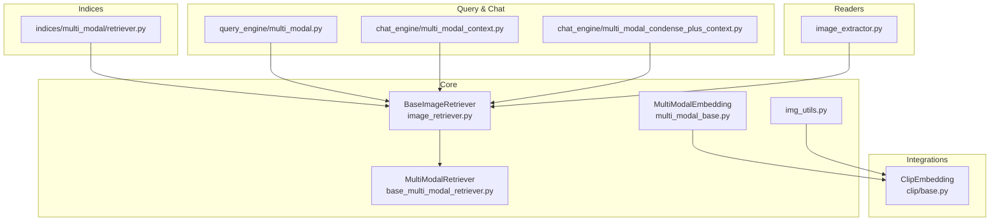
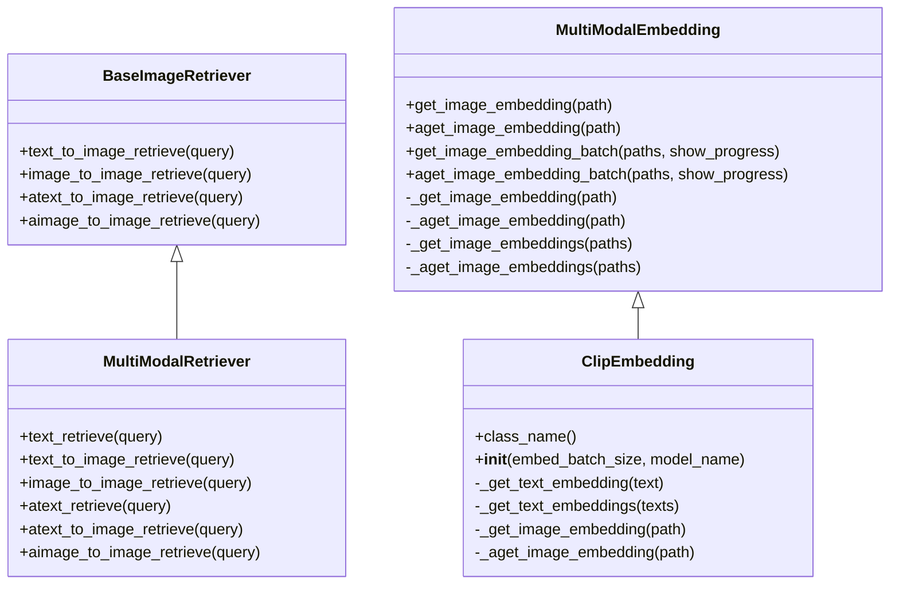
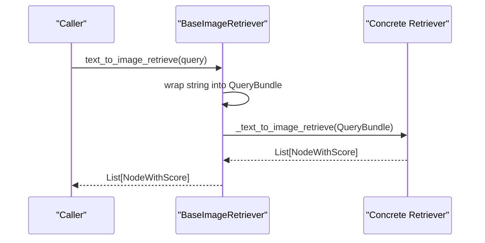
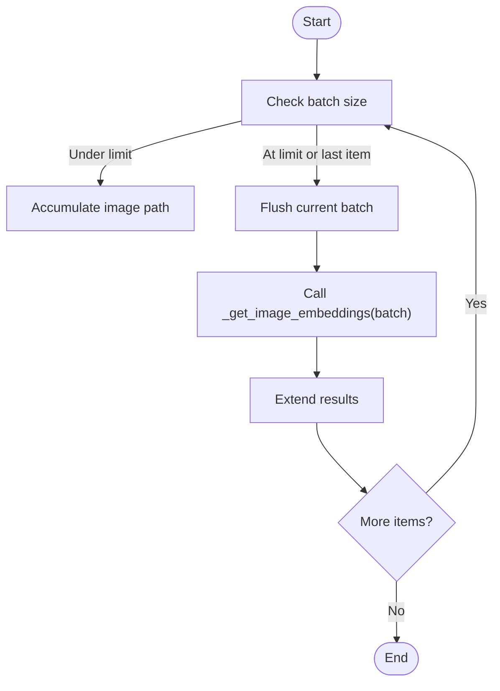
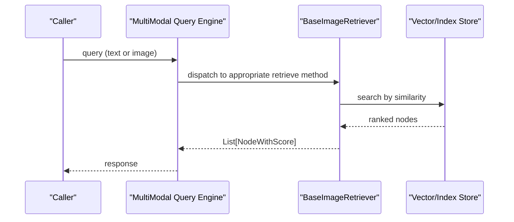
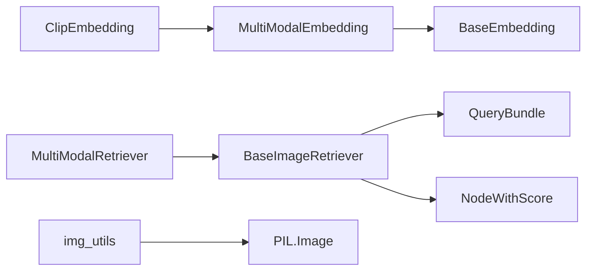

# Image Processing

<cite>
**Referenced Files in This Document**
- [image_retriever.py](file://llama-index-core/llama_index/core/image_retriever.py)
- [img_utils.py](file://llama-index-core/llama_index/core/img_utils.py)
- [multi_modal_base.py](file://llama-index-core/llama_index/core/embeddings/multi_modal_base.py)
- [base.py](file://llama-index-integrations/embeddings/llama-index-embeddings-clip/llama_index/embeddings/clip/base.py)
- [base_multi_modal_retriever.py](file://llama-index-core/llama_index/core/base/base_multi_modal_retriever.py)
- [retriever.py](file://llama-index-core/llama_index/core/indices/multi_modal/retriever.py)
- [multi_modal.py](file://llama-index-core/llama_index/core/query_engine/multi_modal.py)
- [multi_modal_context.py](file://llama-index-core/llama_index/core/chat_engine/multi_modal_context.py)
- [multi_modal_condense_plus_context.py](file://llama-index-core/llama_index/core/chat_engine/multi_modal_condense_plus_context.py)
- [image_extractor.py](file://llama-index-integrations/readers/llama-index-readers-file/llama_index/readers/file/slides/image_extractor.py)
- [test_packs_deeplake_multimodal_retrieval.py](file://llama-index-packs/llama-index-packs-deeplake-multimodal-retrieval/tests/test_packs_deeplake_multimodal_retrieval.py)
</cite>

## Table of Contents
1. [Introduction](#introduction)
2. [Project Structure](#project-structure)
3. [Core Components](#core-components)
4. [Architecture Overview](#architecture-overview)
5. [Detailed Component Analysis](#detailed-component-analysis)
6. [Dependency Analysis](#dependency-analysis)
7. [Performance Considerations](#performance-considerations)
8. [Troubleshooting Guide](#troubleshooting-guide)
9. [Conclusion](#conclusion)
10. [Appendices](#appendices)

## Introduction
This document explains image processing capabilities in LlamaIndex multi-modal systems. It covers image embedding extraction, visual feature recognition, and cross-modal retrieval techniques. It also documents supported image formats, preprocessing pipelines, quality enhancement methods, integration with popular vision models such as CLIP, BLIP, and custom image encoders. Practical examples include document image analysis, screenshot processing, and visual content indexing. Guidance is provided for performance optimization, memory management, batch operations, image metadata extraction, OCR integration, and visual search implementation.

## Project Structure
LlamaIndex organizes image-related capabilities across core abstractions, integrations, and specialized packs:
- Core abstractions define multi-modal retrieval and embedding interfaces.
- Integrations provide concrete implementations for popular models (e.g., CLIP).
- Packs demonstrate end-to-end multi-modal retrieval pipelines.

**Diagram sources**
- [image_retriever.py](file://llama-index-core/llama_index/core/image_retriever.py#L10-L113)
- [base_multi_modal_retriever.py](file://llama-index-core/llama_index/core/base/base_multi_modal_retriever.py#L12-L78)
- [multi_modal_base.py](file://llama-index-core/llama_index/core/embeddings/multi_modal_base.py#L16-L187)
- [base.py](file://llama-index-integrations/embeddings/llama-index-embeddings-clip/llama_index/embeddings/clip/base.py#L17-L132)
- [retriever.py](file://llama-index-core/llama_index/core/indices/multi_modal/retriever.py)
- [multi_modal.py](file://llama-index-core/llama_index/core/query_engine/multi_modal.py)
- [multi_modal_context.py](file://llama-index-core/llama_index/core/chat_engine/multi_modal_context.py)
- [multi_modal_condense_plus_context.py](file://llama-index-core/llama_index/core/chat_engine/multi_modal_condense_plus_context.py)
- [image_extractor.py](file://llama-index-integrations/readers/llama-index-readers-file/llama_index/readers/file/slides/image_extractor.py)
- [img_utils.py](file://llama-index-core/llama_index/core/img_utils.py#L11-L41)

**Section sources**
- [image_retriever.py](file://llama-index-core/llama_index/core/image_retriever.py#L10-L113)
- [base_multi_modal_retriever.py](file://llama-index-core/llama_index/core/base/base_multi_modal_retriever.py#L12-L78)
- [multi_modal_base.py](file://llama-index-core/llama_index/core/embeddings/multi_modal_base.py#L16-L187)
- [base.py](file://llama-index-integrations/embeddings/llama-index-embeddings-clip/llama_index/embeddings/clip/base.py#L17-L132)
- [retriever.py](file://llama-index-core/llama_index/core/indices/multi_modal/retriever.py)
- [multi_modal.py](file://llama-index-core/llama_index/core/query_engine/multi_modal.py)
- [multi_modal_context.py](file://llama-index-core/llama_index/core/chat_engine/multi_modal_context.py)
- [multi_modal_condense_plus_context.py](file://llama-index-core/llama_index/core/chat_engine/multi_modal_condense_plus_context.py)
- [image_extractor.py](file://llama-index-integrations/readers/llama-index-readers-file/llama_index/readers/file/slides/image_extractor.py)
- [img_utils.py](file://llama-index-core/llama_index/core/img_utils.py#L11-L41)

## Core Components
- BaseImageRetriever: Defines synchronous and asynchronous retrieval APIs for text-to-image and image-to-image retrieval, accepting either text queries or image paths via a unified QueryBundle abstraction.
- MultiModalEmbedding: Provides a base class for multi-modal embeddings with sync/async single and batch image embedding methods, progress reporting, and batching via embed_batch_size.
- ClipEmbedding: Concrete CLIP-based image encoder implementing the multi-modal embedding interface, including device selection and preprocessing.
- MultiModalRetriever: Extends BaseRetriever and BaseImageRetriever to support text, text-to-image, and image-to-image retrieval in a unified interface.
- img_utils: Utilities for converting between PIL Images and base64-encoded strings, enabling transport and interoperability.

Key capabilities:
- Cross-modal retrieval: text-to-image and image-to-image retrieval flows.
- Batch processing: configurable batch sizes and async batching for throughput.
- Preprocessing hooks: CLIP preprocessing pipeline integrated into image embeddings.
- Interoperability: base64 conversion utilities for images.

**Section sources**
- [image_retriever.py](file://llama-index-core/llama_index/core/image_retriever.py#L10-L113)
- [multi_modal_base.py](file://llama-index-core/llama_index/core/embeddings/multi_modal_base.py#L16-L187)
- [base.py](file://llama-index-integrations/embeddings/llama-index-embeddings-clip/llama_index/embeddings/clip/base.py#L17-L132)
- [base_multi_modal_retriever.py](file://llama-index-core/llama_index/core/base/base_multi_modal_retriever.py#L12-L78)
- [img_utils.py](file://llama-index-core/llama_index/core/img_utils.py#L11-L41)

## Architecture Overview
The multi-modal image processing architecture centers around retrieval and embedding abstractions, with integrations plugging in specific models.

**Diagram sources**
- [image_retriever.py](file://llama-index-core/llama_index/core/image_retriever.py#L10-L113)
- [base_multi_modal_retriever.py](file://llama-index-core/llama_index/core/base/base_multi_modal_retriever.py#L12-L78)
- [multi_modal_base.py](file://llama-index-core/llama_index/core/embeddings/multi_modal_base.py#L16-L187)
- [base.py](file://llama-index-integrations/embeddings/llama-index-embeddings-clip/llama_index/embeddings/clip/base.py#L17-L132)

## Detailed Component Analysis

### Image Retrieval Interfaces
- BaseImageRetriever exposes:
  - Synchronous and asynchronous retrieval methods for text-to-image and image-to-image.
  - Unified QueryBundle handling for flexible input types (text or image path).
- MultiModalRetriever extends BaseImageRetriever and adds text retrieval alongside image retrieval, enabling hybrid retrieval workflows.

**Diagram sources**
- [image_retriever.py](file://llama-index-core/llama_index/core/image_retriever.py#L13-L38)

**Section sources**
- [image_retriever.py](file://llama-index-core/llama_index/core/image_retriever.py#L10-L113)
- [base_multi_modal_retriever.py](file://llama-index-core/llama_index/core/base/base_multi_modal_retriever.py#L12-L78)

### Image Embedding Extraction
- MultiModalEmbedding defines:
  - Single and batch image embedding methods with progress reporting.
  - Configurable embed_batch_size for throughput control.
  - Async variants for concurrent processing.
- ClipEmbedding implements:
  - Device selection (GPU/CPU) and model loading.
  - Text and image embedding via CLIP.
  - Integrated preprocessing pipeline for images.

**Diagram sources**
- [multi_modal_base.py](file://llama-index-core/llama_index/core/embeddings/multi_modal_base.py#L95-L129)

**Section sources**
- [multi_modal_base.py](file://llama-index-core/llama_index/core/embeddings/multi_modal_base.py#L16-L187)
- [base.py](file://llama-index-integrations/embeddings/llama-index-embeddings-clip/llama_index/embeddings/clip/base.py#L17-L132)

### Preprocessing and Quality Enhancement
- img_utils provides:
  - Converting PIL Images to base64 strings and vice versa.
  - Useful for transporting images across APIs and storing compact representations.
- CLIP integration includes:
  - Standardized preprocessing via clip.preprocess for image tensors.
  - Device-aware inference (CUDA if available).

Practical tips:
- Normalize and resize images to model-specific input shapes before embedding.
- Use base64 utilities for interop when passing images to external services.

**Section sources**
- [img_utils.py](file://llama-index-core/llama_index/core/img_utils.py#L11-L41)
- [base.py](file://llama-index-integrations/embeddings/llama-index-embeddings-clip/llama_index/embeddings/clip/base.py#L80-L89)

### Supported Image Formats and Readers
- Reader integration extracts images from slides and other document sources, enabling downstream multi-modal processing.
- Typical formats handled by PIL include JPEG, PNG, BMP, TIFF, and others commonly used in documents and screenshots.

Note: Specific format support depends on underlying libraries (PIL, OpenCV, etc.) and reader implementations.

**Section sources**
- [image_extractor.py](file://llama-index-integrations/readers/llama-index-readers-file/llama_index/readers/file/slides/image_extractor.py)

### Cross-Modal Retrieval Techniques
- Hybrid retrieval combines:
  - Text queries generating image embeddings (text-to-image).
  - Image queries generating image embeddings (image-to-image).
- MultiModalRetriever supports:
  - text_retrieve for text-only nodes.
  - text_to_image_retrieve for cross-modal retrieval.
  - image_to_image_retrieve for pure image retrieval.

**Diagram sources**
- [multi_modal.py](file://llama-index-core/llama_index/core/query_engine/multi_modal.py)
- [image_retriever.py](file://llama-index-core/llama_index/core/image_retriever.py#L10-L113)

**Section sources**
- [multi_modal.py](file://llama-index-core/llama_index/core/query_engine/multi_modal.py)
- [base_multi_modal_retriever.py](file://llama-index-core/llama_index/core/base/base_multi_modal_retriever.py#L12-L78)

### Integration with Vision Models
- CLIP integration:
  - Provides both text and image encoders.
  - Handles device selection and preprocessing.
- BLIP and custom encoders:
  - Can be integrated by subclassing MultiModalEmbedding and implementing the abstract methods for image embedding.
  - Use the same batch and async patterns for consistency.

Guidance:
- Implement _get_image_embedding and _aget_image_embedding.
- Respect embed_batch_size and integrate preprocessing compatible with your model.

**Section sources**
- [base.py](file://llama-index-integrations/embeddings/llama-index-embeddings-clip/llama_index/embeddings/clip/base.py#L17-L132)
- [multi_modal_base.py](file://llama-index-core/llama_index/core/embeddings/multi_modal_base.py#L16-L187)

### Practical Examples
- Document image analysis:
  - Extract images from slides and PDFs using readers.
  - Compute image embeddings and index them for retrieval.
- Screenshot processing:
  - Load screenshots as PIL Images, convert to base64 if needed, compute embeddings, and index.
- Visual content indexing:
  - Index both text and image nodes in the same vector store for cross-modal search.

Evidence of multi-modal retrieval packs:
- Deeper integration demonstrated by multimodal retrieval packs and tests.

**Section sources**
- [image_extractor.py](file://llama-index-integrations/readers/llama-index-readers-file/llama_index/readers/file/slides/image_extractor.py)
- [test_packs_deeplake_multimodal_retrieval.py](file://llama-index-packs/llama-index-packs-deeplake-multimodal-retrieval/tests/test_packs_deeplake_multimodal_retrieval.py)

## Dependency Analysis
- BaseImageRetriever depends on QueryBundle and NodeWithScore for unified query and result handling.
- MultiModalEmbedding depends on BaseEmbedding and integrates batching and async patterns.
- ClipEmbedding depends on the CLIP library and torch for device-aware inference.
- MultiModalRetriever composes BaseRetriever and BaseImageRetriever to unify retrieval modes.
- img_utils depends on PIL for image manipulation.

**Diagram sources**
- [image_retriever.py](file://llama-index-core/llama_index/core/image_retriever.py#L4-L7)
- [multi_modal_base.py](file://llama-index-core/llama_index/core/embeddings/multi_modal_base.py#L7-L13)
- [base.py](file://llama-index-integrations/embeddings/llama-index-embeddings-clip/llama_index/embeddings/clip/base.py#L6-L9)
- [base_multi_modal_retriever.py](file://llama-index-core/llama_index/core/base/base_multi_modal_retriever.py#L6-L9)
- [img_utils.py](file://llama-index-core/llama_index/core/img_utils.py#L7-L8)

**Section sources**
- [image_retriever.py](file://llama-index-core/llama_index/core/image_retriever.py#L4-L7)
- [multi_modal_base.py](file://llama-index-core/llama_index/core/embeddings/multi_modal_base.py#L7-L13)
- [base.py](file://llama-index-integrations/embeddings/llama-index-embeddings-clip/llama_index/embeddings/clip/base.py#L6-L9)
- [base_multi_modal_retriever.py](file://llama-index-core/llama_index/core/base/base_multi_modal_retriever.py#L6-L9)
- [img_utils.py](file://llama-index-core/llama_index/core/img_utils.py#L7-L8)

## Performance Considerations
- Batch sizing:
  - Control embed_batch_size to balance memory and throughput.
  - Use get_image_embedding_batch and aget_image_embedding_batch for efficient processing.
- Asynchronous processing:
  - Prefer async batch methods for I/O-bound workloads.
- Device utilization:
  - CLIP automatically selects CUDA if available; ensure GPU drivers and torch are installed.
- Memory management:
  - Process images in batches; avoid loading all images into memory simultaneously.
  - Use base64 utilities judiciously to minimize redundant conversions.
- Progress reporting:
  - Enable show_progress to monitor long-running batch operations.

[No sources needed since this section provides general guidance]

## Troubleshooting Guide
Common issues and resolutions:
- Missing CLIP dependency:
  - Ensure the clip package and torch are installed as required by ClipEmbedding.
- Model load errors:
  - Verify model_name and network access; check logs for device availability.
- Batch size constraints:
  - embed_batch_size must be greater than zero; adjust according to memory limits.
- Image format problems:
  - Confirm PIL supports the image format; preprocess images if necessary.
- Retrieval failures:
  - Validate QueryBundle construction and ensure the index contains image nodes.

**Section sources**
- [base.py](file://llama-index-integrations/embeddings/llama-index-embeddings-clip/llama_index/embeddings/clip/base.py#L65-L89)
- [multi_modal_base.py](file://llama-index-core/llama_index/core/embeddings/multi_modal_base.py#L69-L93)

## Conclusion
LlamaIndex provides a robust foundation for multi-modal image processing through standardized retrieval and embedding interfaces. With CLIP integration and extensible abstractions, developers can implement cross-modal retrieval, batch processing, and scalable indexing. By leveraging preprocessing utilities, batching, and async patterns, teams can build efficient visual search systems for documents, screenshots, and other visual content.

[No sources needed since this section summarizes without analyzing specific files]

## Appendices

### Supported Image Formats
- Common formats include JPEG, PNG, BMP, TIFF, and others supported by PIL.
- Reader integrations extract images from slides and PDFs for downstream processing.

**Section sources**
- [image_extractor.py](file://llama-index-integrations/readers/llama-index-readers-file/llama_index/readers/file/slides/image_extractor.py)

### OCR Integration
- OCR can be integrated upstream of image embedding to associate textual content with images.
- Combine extracted text with image embeddings for richer multi-modal retrieval.

[No sources needed since this section provides general guidance]

### Visual Search Implementation
- Build a pipeline: extract images → compute embeddings → index → retrieve by text or image.
- Use MultiModalRetriever and QueryEngine for unified search experiences.

**Section sources**
- [multi_modal.py](file://llama-index-core/llama_index/core/query_engine/multi_modal.py)
- [base_multi_modal_retriever.py](file://llama-index-core/llama_index/core/base/base_multi_modal_retriever.py#L12-L78)