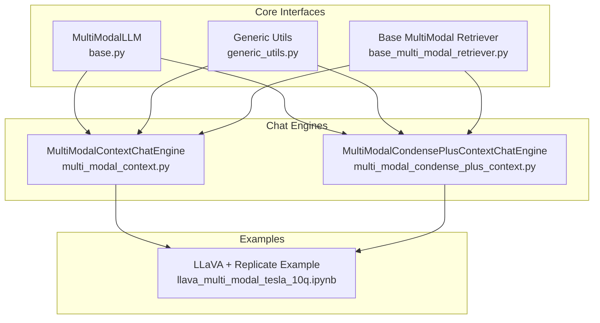
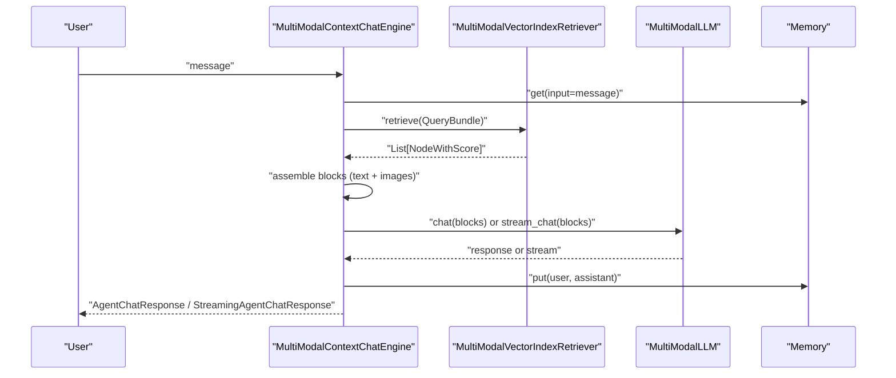
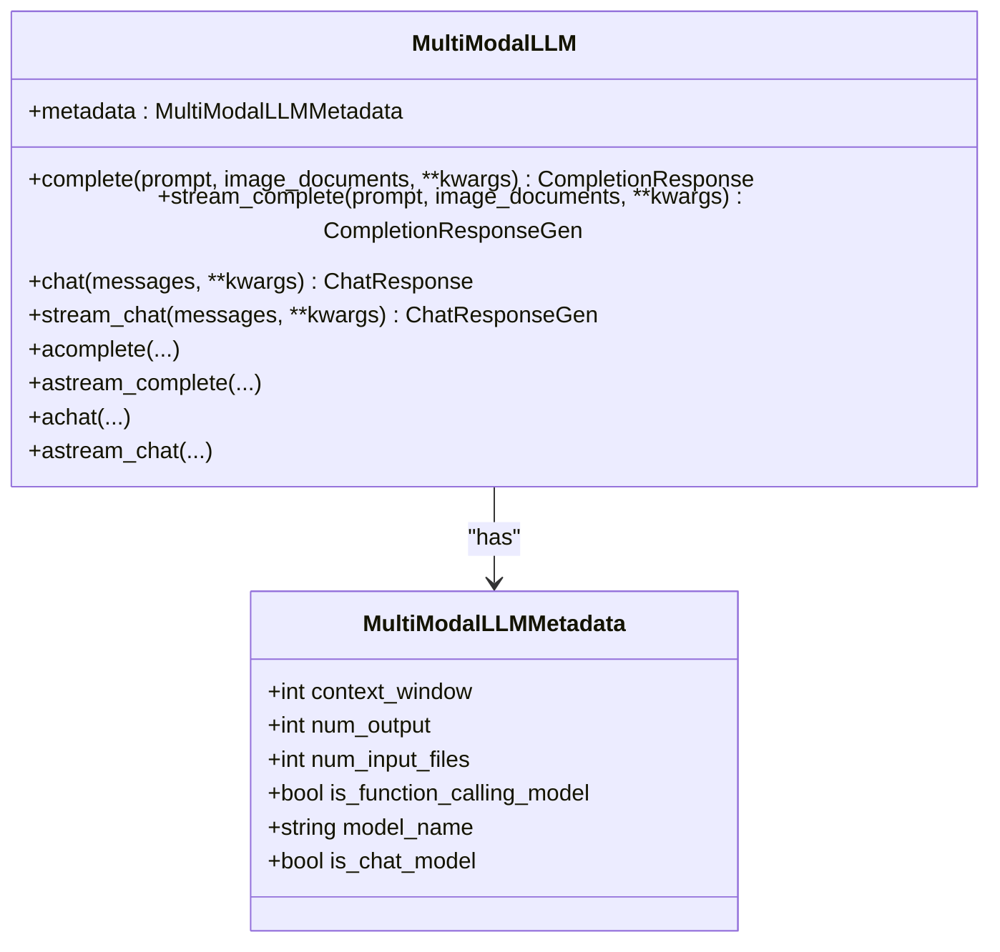
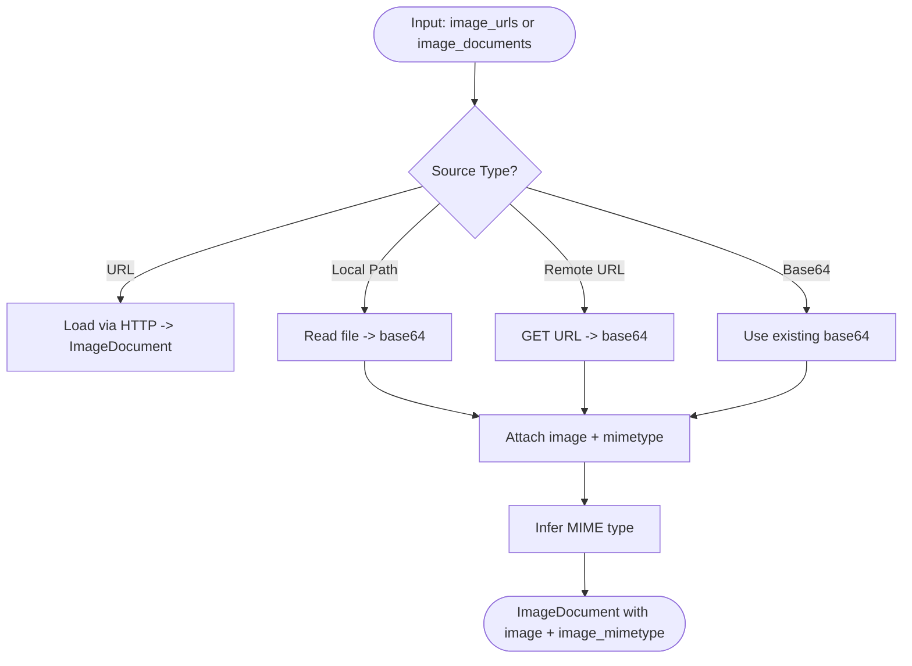
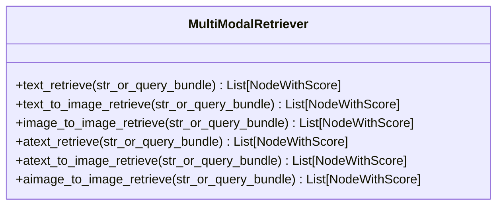
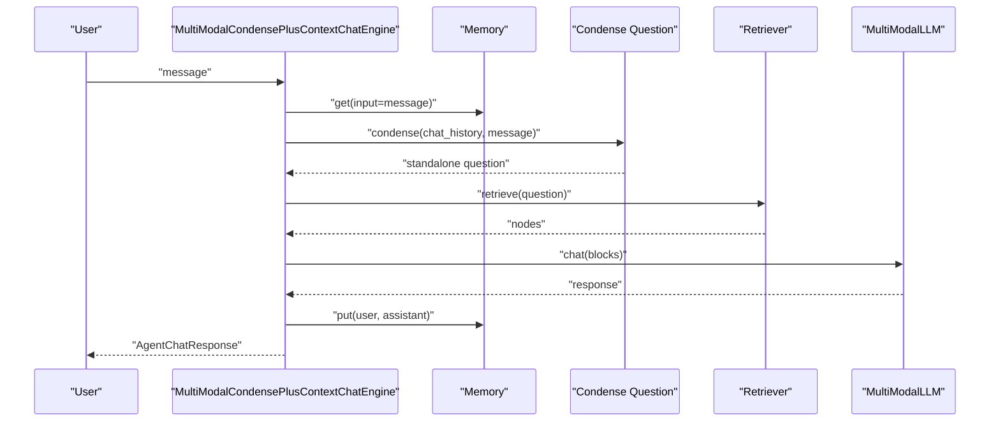
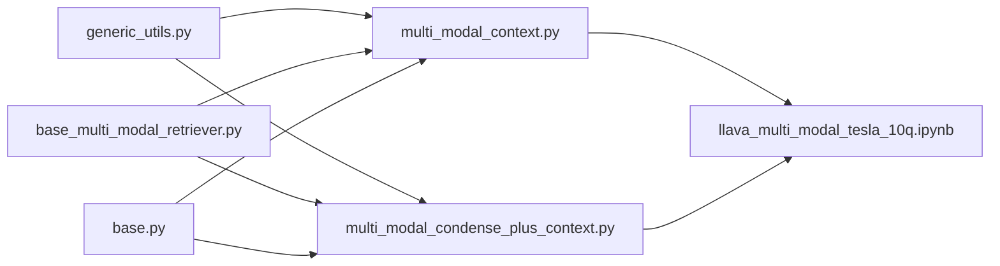

# Model Integration

<cite>
**Referenced Files in This Document**
- [base.py](file://llama-index-core/llama_index/core/multi_modal_llms/base.py)
- [generic_utils.py](file://llama-index-core/llama_index/core/multi_modal_llms/generic_utils.py)
- [base_multi_modal_retriever.py](file://llama-index-core/llama_index/core/base/base_multi_modal_retriever.py)
- [multi_modal_context.py](file://llama-index-core/llama_index/core/chat_engine/multi_modal_context.py)
- [multi_modal_condense_plus_context.py](file://llama-index-core/llama_index/core/chat_engine/multi_modal_condense_plus_context.py)
- [llava_multi_modal_tesla_10q.ipynb](file://docs/examples/multi_modal/llava_multi_modal_tesla_10q.ipynb)
</cite>

## Table of Contents
1. [Introduction](#introduction)
2. [Project Structure](#project-structure)
3. [Core Components](#core-components)
4. [Architecture Overview](#architecture-overview)
5. [Detailed Component Analysis](#detailed-component-analysis)
6. [Dependency Analysis](#dependency-analysis)
7. [Performance Considerations](#performance-considerations)
8. [Troubleshooting Guide](#troubleshooting-guide)
9. [Conclusion](#conclusion)
10. [Appendices](#appendices)

## Introduction
This document explains how multi-modal models are integrated and orchestrated in LlamaIndex. It covers unified interfaces for heterogeneous multi-modal models, input/output format standardization, compatibility considerations across modalities, deployment strategies, resource allocation, load balancing, model chaining, conditional routing, fallback mechanisms, versioning, A/B testing, continuous learning, and cost optimization with GPU utilization and distributed processing.

## Project Structure
LlamaIndex provides:
- A unified multi-modal LLM interface and utilities for image handling
- Multi-modal chat engines that integrate retrieval, context assembly, and multi-modal LLM invocation
- Example notebooks demonstrating multi-modal retrieval-augmented generation with heterogeneous providers

**Diagram sources**
- [base.py](file://llama-index-core/llama_index/core/multi_modal_llms/base.py#L75-L183)
- [generic_utils.py](file://llama-index-core/llama_index/core/multi_modal_llms/generic_utils.py#L15-L171)
- [base_multi_modal_retriever.py](file://llama-index-core/llama_index/core/base/base_multi_modal_retriever.py#L12-L78)
- [multi_modal_context.py](file://llama-index-core/llama_index/core/chat_engine/multi_modal_context.py#L63-L454)
- [multi_modal_condense_plus_context.py](file://llama-index-core/llama_index/core/chat_engine/multi_modal_condense_plus_context.py#L49-L483)
- [llava_multi_modal_tesla_10q.ipynb](file://docs/examples/multi_modal/llava_multi_modal_tesla_10q.ipynb#L1-L282)

**Section sources**
- [base.py](file://llama-index-core/llama_index/core/multi_modal_llms/base.py#L1-L183)
- [generic_utils.py](file://llama-index-core/llama_index/core/multi_modal_llms/generic_utils.py#L1-L171)
- [base_multi_modal_retriever.py](file://llama-index-core/llama_index/core/base/base_multi_modal_retriever.py#L1-L78)
- [multi_modal_context.py](file://llama-index-core/llama_index/core/chat_engine/multi_modal_context.py#L1-L454)
- [multi_modal_condense_plus_context.py](file://llama-index-core/llama_index/core/chat_engine/multi_modal_condense_plus_context.py#L1-L483)
- [llava_multi_modal_tesla_10q.ipynb](file://docs/examples/multi_modal/llava_multi_modal_tesla_10q.ipynb#L1-L282)

## Core Components
- MultiModalLLM: Defines a unified interface for multi-modal LLMs with synchronous and asynchronous completion/chat endpoints, plus streaming variants. It standardizes metadata such as context window, output token limits, and function-calling capability.
- Generic image utilities: Provide helpers to load images from URLs, encode to base64, infer MIME types, and attach base64 and MIME info to ImageDocument objects.
- MultiModalRetriever: Base interface for retrieving text and images given text or image queries, with sync and async variants.
- MultiModalContextChatEngine and MultiModalCondensePlusContextChatEngine: Orchestrate retrieval, context assembly, and multi-modal LLM invocation with optional conversation condensation and streaming.

**Section sources**
- [base.py](file://llama-index-core/llama_index/core/multi_modal_llms/base.py#L30-L183)
- [generic_utils.py](file://llama-index-core/llama_index/core/multi_modal_llms/generic_utils.py#L15-L171)
- [base_multi_modal_retriever.py](file://llama-index-core/llama_index/core/base/base_multi_modal_retriever.py#L12-L78)
- [multi_modal_context.py](file://llama-index-core/llama_index/core/chat_engine/multi_modal_context.py#L63-L454)
- [multi_modal_condense_plus_context.py](file://llama-index-core/llama_index/core/chat_engine/multi_modal_condense_plus_context.py#L49-L483)

## Architecture Overview
The system integrates heterogeneous multi-modal providers behind a single interface. Retrievers fetch heterogeneous nodes (text and images). The chat engines assemble prompts and multi-modal blocks, then call the configured MultiModalLLM. Responses are streamed or returned synchronously, with memory and post-processing hooks.

**Diagram sources**
- [multi_modal_context.py](file://llama-index-core/llama_index/core/chat_engine/multi_modal_context.py#L158-L213)
- [multi_modal_context.py](file://llama-index-core/llama_index/core/chat_engine/multi_modal_context.py#L214-L269)
- [multi_modal_context.py](file://llama-index-core/llama_index/core/chat_engine/multi_modal_context.py#L271-L306)
- [multi_modal_context.py](file://llama-index-core/llama_index/core/chat_engine/multi_modal_context.py#L309-L356)
- [multi_modal_context.py](file://llama-index-core/llama_index/core/chat_engine/multi_modal_context.py#L359-L394)
- [multi_modal_context.py](file://llama-index-core/llama_index/core/chat_engine/multi_modal_context.py#L397-L445)

## Detailed Component Analysis

### Unified Multi-Modal LLM Interface
- Purpose: Provide a single contract for multi-modal LLMs with both chat and completion semantics, including streaming and async variants.
- Key capabilities:
  - Metadata: context_window, num_output, num_input_files, function calling flag, model_name, chat capability flag.
  - Endpoints: complete, stream_complete, chat, stream_chat, and async counterparts.
  - Instrumentation: built-in callback wrappers for tracing and metrics.

**Diagram sources**
- [base.py](file://llama-index-core/llama_index/core/multi_modal_llms/base.py#L30-L90)
- [base.py](file://llama-index-core/llama_index/core/multi_modal_llms/base.py#L92-L183)

**Section sources**
- [base.py](file://llama-index-core/llama_index/core/multi_modal_llms/base.py#L30-L183)

### Image Utilities and Input Normalization
- Purpose: Normalize heterogeneous image inputs (URLs, local files, base64) into a consistent internal representation with MIME type detection.
- Key functions:
  - Load image URLs to ImageDocument
  - Encode local files to base64
  - Infer MIME types from file paths or base64
  - Attach base64 and MIME type to ImageDocument

**Diagram sources**
- [generic_utils.py](file://llama-index-core/llama_index/core/multi_modal_llms/generic_utils.py#L15-L86)
- [generic_utils.py](file://llama-index-core/llama_index/core/multi_modal_llms/generic_utils.py#L89-L171)

**Section sources**
- [generic_utils.py](file://llama-index-core/llama_index/core/multi_modal_llms/generic_utils.py#L15-L171)

### Multi-Modal Retriever Base
- Purpose: Define retrieval APIs for text and images under a unified interface, with both sync and async variants.
- Capabilities:
  - text_retrieve, text_to_image_retrieve, image_to_image_retrieve
  - Async equivalents: atext_retrieve, atext_to_image_retrieve, aimage_to_image_retrieve

**Diagram sources**
- [base_multi_modal_retriever.py](file://llama-index-core/llama_index/core/base/base_multi_modal_retriever.py#L12-L78)

**Section sources**
- [base_multi_modal_retriever.py](file://llama-index-core/llama_index/core/base/base_multi_modal_retriever.py#L12-L78)

### Multi-Modal Chat Engines
- MultiModalContextChatEngine
  - Retrieves nodes, separates text vs image nodes, formats context, builds blocks (images + text), invokes MultiModalLLM, manages memory, and supports streaming.
- MultiModalCondensePlusContextChatEngine
  - Adds conversation condensation: converts chat history + latest message into a standalone question, retrieves context, then synthesizes with MultiModalLLM.

**Diagram sources**
- [multi_modal_condense_plus_context.py](file://llama-index-core/llama_index/core/chat_engine/multi_modal_condense_plus_context.py#L131-L162)
- [multi_modal_condense_plus_context.py](file://llama-index-core/llama_index/core/chat_engine/multi_modal_condense_plus_context.py#L183-L209)
- [multi_modal_condense_plus_context.py](file://llama-index-core/llama_index/core/chat_engine/multi_modal_condense_plus_context.py#L237-L292)
- [multi_modal_condense_plus_context.py](file://llama-index-core/llama_index/core/chat_engine/multi_modal_condense_plus_context.py#L349-L373)

**Section sources**
- [multi_modal_context.py](file://llama-index-core/llama_index/core/chat_engine/multi_modal_context.py#L63-L454)
- [multi_modal_condense_plus_context.py](file://llama-index-core/llama_index/core/chat_engine/multi_modal_condense_plus_context.py#L49-L483)

### Practical Example: LLaVA + Replicate RAG
- Demonstrates multi-modal RAG with LLaVA via Replicate, combining image understanding with text retrieval and synthesis.
- Highlights provider-specific setup, environment configuration, and integration with LlamaIndex components.

**Section sources**
- [llava_multi_modal_tesla_10q.ipynb](file://docs/examples/multi_modal/llava_multi_modal_tesla_10q.ipynb#L1-L282)

## Dependency Analysis
- MultiModalLLM is consumed by chat engines to execute multi-modal prompts.
- Generic image utilities normalize inputs for both retrieval and chat engines.
- MultiModalRetriever abstracts heterogeneous retrieval backends (text and images).
- Chat engines depend on memory, post-processors, and templating.

**Diagram sources**
- [base.py](file://llama-index-core/llama_index/core/multi_modal_llms/base.py#L75-L183)
- [generic_utils.py](file://llama-index-core/llama_index/core/multi_modal_llms/generic_utils.py#L15-L171)
- [base_multi_modal_retriever.py](file://llama-index-core/llama_index/core/base/base_multi_modal_retriever.py#L12-L78)
- [multi_modal_context.py](file://llama-index-core/llama_index/core/chat_engine/multi_modal_context.py#L63-L454)
- [multi_modal_condense_plus_context.py](file://llama-index-core/llama_index/core/chat_engine/multi_modal_condense_plus_context.py#L49-L483)
- [llava_multi_modal_tesla_10q.ipynb](file://docs/examples/multi_modal/llava_multi_modal_tesla_10q.ipynb#L1-L282)

**Section sources**
- [base.py](file://llama-index-core/llama_index/core/multi_modal_llms/base.py#L75-L183)
- [generic_utils.py](file://llama-index-core/llama_index/core/multi_modal_llms/generic_utils.py#L15-L171)
- [base_multi_modal_retriever.py](file://llama-index-core/llama_index/core/base/base_multi_modal_retriever.py#L12-L78)
- [multi_modal_context.py](file://llama-index-core/llama_index/core/chat_engine/multi_modal_context.py#L63-L454)
- [multi_modal_condense_plus_context.py](file://llama-index-core/llama_index/core/chat_engine/multi_modal_condense_plus_context.py#L49-L483)
- [llava_multi_modal_tesla_10q.ipynb](file://docs/examples/multi_modal/llava_multi_modal_tesla_10q.ipynb#L1-L282)

## Performance Considerations
- Token budgeting: Chat engines configure memory token limits based on model metadata to prevent overflow.
- Streaming: Prefer streaming responses to reduce latency and improve UX.
- Image normalization: Efficiently encode and infer MIME types to avoid redundant conversions.
- Retrieval filtering: Apply node postprocessors to reduce context size and improve relevance.
- Provider throughput: Use async endpoints and batch retrievals where supported.

[No sources needed since this section provides general guidance]

## Troubleshooting Guide
- Image loading failures: Verify image URLs, local paths, and permissions; ensure base64 encoding succeeds and MIME type inference is correct.
- Context overflow: Reduce retrieved nodes or adjust context template to fit model’s context window.
- Streaming issues: Confirm provider supports streaming and that the engine is configured to stream.
- Memory drift: Reset memory periodically or cap token limits to avoid excessive history growth.

**Section sources**
- [generic_utils.py](file://llama-index-core/llama_index/core/multi_modal_llms/generic_utils.py#L15-L171)
- [multi_modal_context.py](file://llama-index-core/llama_index/core/chat_engine/multi_modal_context.py#L113-L126)
- [multi_modal_condense_plus_context.py](file://llama-index-core/llama_index/core/chat_engine/multi_modal_condense_plus_context.py#L113-L116)

## Conclusion
LlamaIndex offers a cohesive framework for multi-modal integration:
- A unified MultiModalLLM interface and standardized image utilities
- Robust chat engines that orchestrate retrieval, context assembly, and multi-modal LLM invocation
- Extensible patterns for heterogeneous providers, streaming, memory, and post-processing
- Practical examples demonstrating real-world multi-modal RAG pipelines

These building blocks enable scalable, cross-platform deployments with controllable performance, cost, and reliability.

## Appendices

### Model Selection Criteria
- Capability match: Is the model chat-capable and multi-modal (image/text)?
- Context window and output limits: Does it fit your prompt and response sizes?
- Function calling: Required for tool-use scenarios.
- Provider stability and latency: Consider SLA and latency for production workloads.

### Compatibility Matrices (Conceptual)
- LLMs: Chat vs. completion, streaming, async support, function calling
- Retrievers: Text-only vs. multi-modal, sync/async availability
- Providers: Cloud APIs, self-hosted, edge devices

[No sources needed since this section provides general guidance]

### Deployment Strategies and Resource Allocation
- Containerization: Package providers and models with appropriate GPUs/CPU resources.
- Auto-scaling: Scale replicas based on request rate and queue depth.
- GPU utilization: Prefer models optimized for GPU; batch inference where feasible.
- Edge deployment: Quantized models for constrained environments.

[No sources needed since this section provides general guidance]

### Load Balancing and Fallback Mechanisms
- Multi-provider routing: Distribute requests across providers to balance load.
- Health checks: Monitor latency and error rates; route around unhealthy endpoints.
- Fallback chains: If primary provider fails, switch to secondary; if multi-modal unavailable, fall back to text-only.

[No sources needed since this section provides general guidance]

### Model Versioning, A/B Testing, and Continuous Learning
- Versioning: Pin provider versions and model aliases; track performance per version.
- A/B testing: Randomize providers/models per request; measure latency, accuracy, cost.
- Continuous learning: Capture feedback loops; retrain or adapt prompts based on outcomes.

[No sources needed since this section provides general guidance]