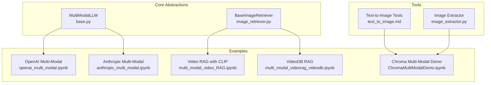
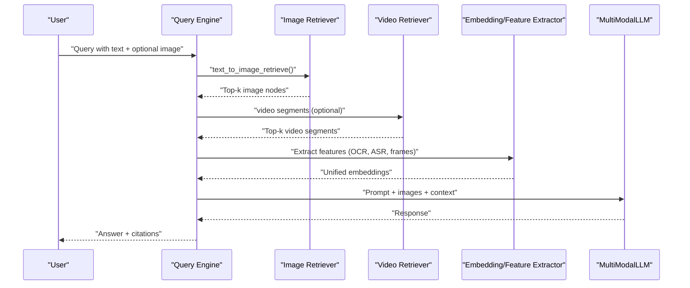
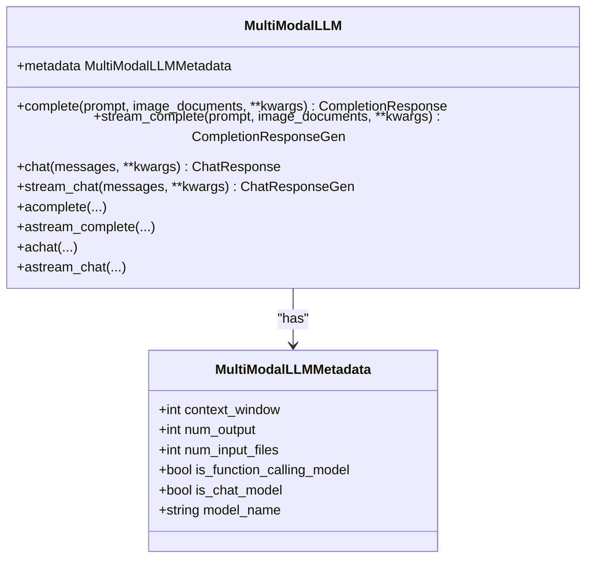
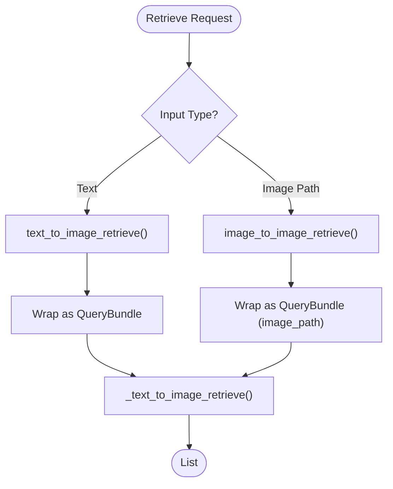
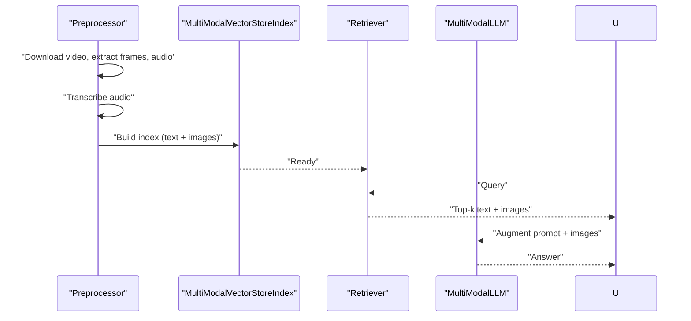
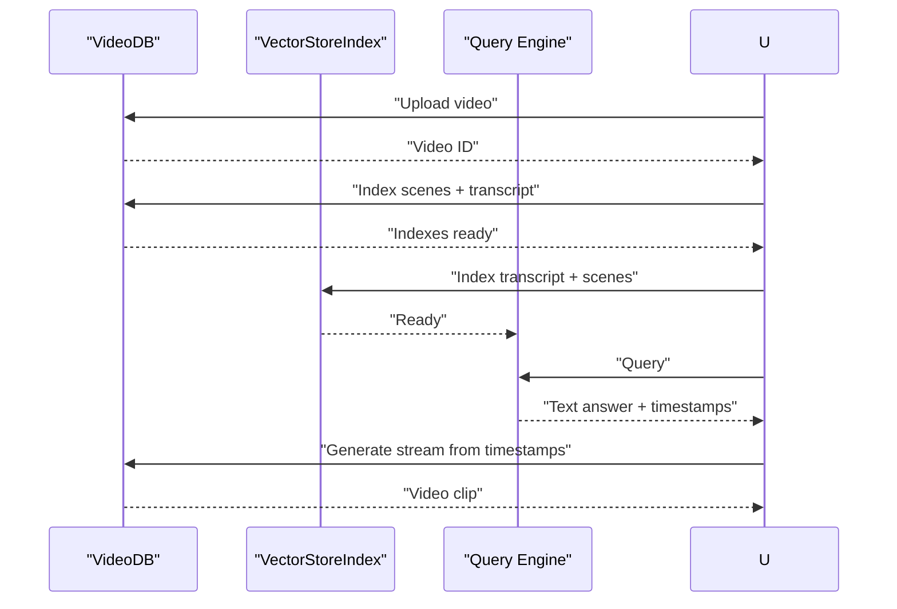
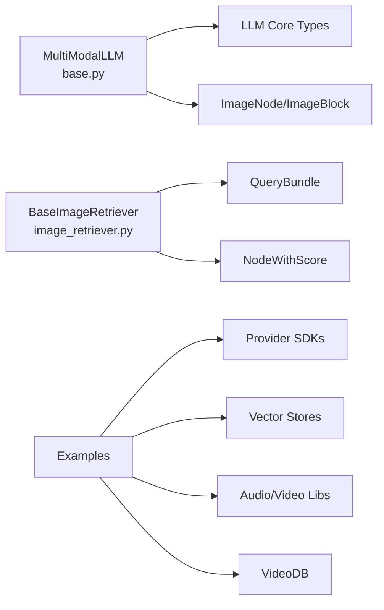

# Multi-Modal Processing

<cite>
**Referenced Files in This Document**
- [multi_modal_llms/base.py](file://llama-index-core/llama_index/core/multi_modal_llms/base.py)
- [image_retriever.py](file://llama-index-core/llama_index/core/image_retriever.py)
- [ChromaMultiModalDemo.ipynb](file://docs/examples/multi_modal/ChromaMultiModalDemo.ipynb)
- [openai_multi_modal.ipynb](file://docs/examples/multi_modal/openai_multi_modal.ipynb)
- [anthropic_multi_modal.ipynb](file://docs/examples/multi_modal/anthropic_multi_modal.ipynb)
- [azure_openai_multi_modal.ipynb](file://docs/examples/multi_modal/azure_openai_multi_modal.ipynb)
- [dashscope_multi_modal.ipynb](file://docs/examples/multi_modal/dashscope_multi_modal.ipynb)
- [gemini.ipynb](file://docs/examples/multi_modal/gemini.ipynb)
- [gpt4v_experiments_cot.ipynb](file://docs/examples/multi_modal/gpt4v_experiments_cot.ipynb)
- [llamaindex_mongodb_voyageai_multimodal.ipynb](file://docs/examples/multi_modal/llamaindex_mongodb_voyageai_multimodal.ipynb)
- [multi_modal_pydantic.ipynb](file://docs/examples/multi_modal/multi_modal_pydantic.ipynb)
- [multi_modal_video_RAG.ipynb](file://docs/examples/multi_modal/multi_modal_video_RAG.ipynb)
- [multi_modal_videorag_videodb.ipynb](file://docs/examples/multi_modal/multi_modal_videorag_videodb.ipynb)
- [multimodal_rag_guardrail_gemini_llmguard_llmguard.ipynb](file://docs/examples/multi_modal/multimodal_rag_guardrail_gemini_llmguard_llmguard.ipynb)
- [nvidia_multi_modal.ipynb](file://docs/examples/multi_modal/nvidia_multi_modal.ipynb)
- [openvino_multimodal.ipynb](file://docs/examples/multi_modal/openvino_multimodal.ipynb)
- [replicate_multi_modal.ipynb](file://docs/examples/multi_modal/replicate_multi_modal.ipynb)
- [simple_multi_modal.md](file://docs/api_reference/api_reference/query_engine/simple_multi_modal.md)
- [multi_modal.md](file://docs/api_reference/api_reference/evaluation/multi_modal.md)
- [multi_modal.md](file://docs/api_reference/api_reference/program/multi_modal.md)
- [image_to_image_retrieval.ipynb](file://docs/examples/multi_modal/image_to_image_retrieval.ipynb)
- [structured_image_retrieval.ipynb](file://docs/examples/multi_modal/structured_image_retrieval.ipynb)
- [text_to_image.md](file://docs/api_reference/api_reference/tools/text_to_image.md)
- [videodb.md](file://docs/api_reference/api_reference/retrievers/videodb.md)
- [image_figure_slides.pdf](file://docs/examples/data/figures/image_figure_slides.pdf)
- [image_extractor.py](file://llama-index-integrations/readers/llama-index-readers-file/llama_index/readers/file/slides/image_extractor.py)
- [multimodal_openai_image.ipynb](file://llama-index-integrations/tools/llama-index-tools-openai/examples/multimodal_openai_image.ipynb)
- [openai_image_generation_agent.ipynb](file://llama-index-integrations/tools/llama-index-tools-openai/examples/openai_image_generation_agent.ipynb)
- [text_to_image-pg.ipynb](file://llama-index-integrations/tools/llama-index-tools-text-to-image/examples/text_to_image-pg.ipynb)
- [text_to_image.ipynb](file://llama-index-integrations/tools/llama-index-tools-text-to-image/examples/text_to_image.ipynb)
- [test_tools_openai_image_generation.py](file://llama-index-integrations/tools/llama-index-tools-openai/tests/test_tools_openai_image_generation.py)
- [test_tools_text_to_image.py](file://llama-index-integrations/tools/llama-index-tools-text-to-image/tests/test_tools_text_to_image.py)
- [test_image_vision_llm.py](file://llama-index-integrations/readers/llama-index-readers-file/tests/test_image_vision_llm.py)
- [test_image_document.py](file://llama-index-core/tests/schema/test_image_document.py)
- [image_retriever.py](file://llama-index-core/llama_index/core/image_retriever.py)
- [base.py](file://llama-index-core/llama_index/core/multi_modal_llms/base.py)
- [__init__.py](file://llama-index-core/llama_index/core/multi_modal_llms/__init__.py)
</cite>

## Table of Contents
1. [Introduction](#introduction)
2. [Project Structure](#project-structure)
3. [Core Components](#core-components)
4. [Architecture Overview](#architecture-overview)
5. [Detailed Component Analysis](#detailed-component-analysis)
6. [Dependency Analysis](#dependency-analysis)
7. [Performance Considerations](#performance-considerations)
8. [Troubleshooting Guide](#troubleshooting-guide)
9. [Conclusion](#conclusion)
10. [Appendices](#appendices)

## Introduction
This document explains how to build multi-modal processing systems with LlamaIndex, focusing on integrating text, images, audio, and video within Retrieval-Augmented Generation (RAG) pipelines. It covers multi-modal Large Language Model (LLM) interfaces, cross-modal retrieval strategies, unified embedding approaches, and practical examples such as document analysis, visual question answering, and multimedia content synthesis. Guidance is also provided on data preprocessing, feature extraction, model selection criteria, system optimization, latency reduction, quality assessment, multi-modal agents, custom multi-modal models, and production deployment patterns.

## Project Structure
LlamaIndex provides:
- A multi-modal LLM abstraction enabling text and image inputs to LLMs
- Image retrieval interfaces supporting text-to-image and image-to-image retrieval
- Extensive examples across providers (OpenAI, Anthropic, Azure OpenAI, Gemini, DashScope, NVIDIA, Replicate, OpenVINO)
- Tools for text-to-image generation and multimodal image readers
- Video RAG notebooks leveraging external services (e.g., VideoDB) and CLIP-based embeddings

**Diagram sources**
- [multi_modal_llms/base.py](file://llama-index-core/llama_index/core/multi_modal_llms/base.py#L75-L183)
- [image_retriever.py](file://llama-index-core/llama_index/core/image_retriever.py#L10-L113)
- [openai_multi_modal.ipynb](file://docs/examples/multi_modal/openai_multi_modal.ipynb)
- [anthropic_multi_modal.ipynb](file://docs/examples/multi_modal/anthropic_multi_modal.ipynb)
- [multi_modal_video_RAG.ipynb](file://docs/examples/multi_modal/multi_modal_video_RAG.ipynb)
- [multi_modal_videorag_videodb.ipynb](file://docs/examples/multi_modal/multi_modal_videorag_videodb.ipynb)
- [ChromaMultiModalDemo.ipynb](file://docs/examples/multi_modal/ChromaMultiModalDemo.ipynb)
- [text_to_image.md](file://docs/api_reference/api_reference/tools/text_to_image.md)
- [image_extractor.py](file://llama-index-integrations/readers/llama-index-readers-file/llama_index/readers/file/slides/image_extractor.py)

**Section sources**
- [multi_modal_llms/base.py](file://llama-index-core/llama_index/core/multi_modal_llms/base.py#L1-L183)
- [image_retriever.py](file://llama-index-core/llama_index/core/image_retriever.py#L1-L113)

## Core Components
- MultiModalLLM: Defines a multi-modal LLM interface with completion, streaming, and chat endpoints, plus metadata for capabilities such as context window, output token limits, and function-calling support.
- BaseImageRetriever: Provides abstractions for text-to-image and image-to-image retrieval, with synchronous and asynchronous methods.

Key capabilities:
- Unified input handling for text prompts and image documents
- Streaming and async variants for responsive inference
- Metadata-driven model selection and capability checks

**Section sources**
- [multi_modal_llms/base.py](file://llama-index-core/llama_index/core/multi_modal_llms/base.py#L30-L183)
- [image_retriever.py](file://llama-index-core/llama_index/core/image_retriever.py#L10-L113)

## Architecture Overview
The multi-modal RAG pipeline integrates heterogeneous modalities (text, images, audio, video) through:
- Preprocessing and feature extraction (OCR, audio transcription, frame sampling)
- Embedding generation (text, image, audio, video embeddings)
- Cross-modal retrieval (text-to-image, image-to-image, video-to-text)
- Augmented prompting and generation via multi-modal LLMs
- Post-processing and synthesis (image generation, video clips)

[No sources needed since this diagram shows conceptual workflow, not actual code structure]

## Detailed Component Analysis

### MultiModalLLM Interface
The interface defines:
- Metadata fields for context window, output tokens, input files, function-calling support, and chat capability
- Synchronous and asynchronous endpoints for completion and chat
- Streaming variants for progressive responses

**Diagram sources**
- [multi_modal_llms/base.py](file://llama-index-core/llama_index/core/multi_modal_llms/base.py#L30-L183)

**Section sources**
- [multi_modal_llms/base.py](file://llama-index-core/llama_index/core/multi_modal_llms/base.py#L30-L183)
- [__init__.py](file://llama-index-core/llama_index/core/multi_modal_llms/__init__.py#L1-L10)

### Image Retrieval Abstractions
The base image retriever supports:
- text_to_image_retrieve and image_to_image_retrieve
- Asynchronous counterparts
- QueryBundle handling for flexible query forms

**Diagram sources**
- [image_retriever.py](file://llama-index-core/llama_index/core/image_retriever.py#L13-L68)

**Section sources**
- [image_retriever.py](file://llama-index-core/llama_index/core/image_retriever.py#L10-L113)

### Practical Examples and Workflows

#### Text-to-Image Retrieval
- Demonstrated in examples for Chroma and other stores
- Uses BaseImageRetriever to convert text queries into relevant image nodes

**Section sources**
- [image_to_image_retrieval.ipynb](file://docs/examples/multi_modal/image_to_image_retrieval.ipynb)
- [structured_image_retrieval.ipynb](file://docs/examples/multi_modal/structured_image_retrieval.ipynb)
- [image_retriever.py](file://llama-index-core/llama_index/core/image_retriever.py#L10-L113)

#### Video RAG with CLIP Embeddings
- Downloads video, extracts frames and audio, transcribes audio, builds a multi-modal index
- Retrieves both text and image embeddings, augments prompts, and answers with a multi-modal LLM

**Diagram sources**
- [multi_modal_video_RAG.ipynb](file://docs/examples/multi_modal/multi_modal_video_RAG.ipynb)

**Section sources**
- [multi_modal_video_RAG.ipynb](file://docs/examples/multi_modal/multi_modal_video_RAG.ipynb)

#### Video RAG with VideoDB
- Uploads video to VideoDB, indexes scenes and transcripts
- Builds a simple RAG pipeline combining transcript and scene nodes
- Streams relevant video clips based on node timestamps

**Diagram sources**
- [multi_modal_videorag_videodb.ipynb](file://docs/examples/multi_modal/multi_modal_videorag_videodb.ipynb)

**Section sources**
- [multi_modal_videorag_videodb.ipynb](file://docs/examples/multi_modal/multi_modal_videorag_videodb.ipynb)
- [videodb.md](file://docs/api_reference/api_reference/retrievers/videodb.md)

#### Multi-Modal Providers and Agents
- OpenAI, Anthropic, Azure OpenAI, Gemini, DashScope, NVIDIA, Replicate, OpenVINO notebooks demonstrate provider-specific multi-modal capabilities
- Text-to-image tools and agents enable multimodal synthesis and agent workflows

**Section sources**
- [openai_multi_modal.ipynb](file://docs/examples/multi_modal/openai_multi_modal.ipynb)
- [anthropic_multi_modal.ipynb](file://docs/examples/multi_modal/anthropic_multi_modal.ipynb)
- [azure_openai_multi_modal.ipynb](file://docs/examples/multi_modal/azure_openai_multi_modal.ipynb)
- [gemini.ipynb](file://docs/examples/multi_modal/gemini.ipynb)
- [dashscope_multi_modal.ipynb](file://docs/examples/multi_modal/dashscope_multi_modal.ipynb)
- [nvidia_multi_modal.ipynb](file://docs/examples/multi_modal/nvidia_multi_modal.ipynb)
- [replicate_multi_modal.ipynb](file://docs/examples/multi_modal/replicate_multi_modal.ipynb)
- [openvino_multimodal.ipynb](file://docs/examples/multi_modal/openvino_multimodal.ipynb)
- [text_to_image.md](file://docs/api_reference/api_reference/tools/text_to_image.md)
- [multimodal_openai_image.ipynb](file://llama-index-integrations/tools/llama-index-tools-openai/examples/multimodal_openai_image.ipynb)
- [openai_image_generation_agent.ipynb](file://llama-index-integrations/tools/llama-index-tools-openai/examples/openai_image_generation_agent.ipynb)
- [text_to_image-pg.ipynb](file://llama-index-integrations/tools/llama-index-tools-text-to-image/examples/text_to_image-pg.ipynb)
- [text_to_image.ipynb](file://llama-index-integrations/tools/llama-index-tools-text-to-image/examples/text_to_image.ipynb)

## Dependency Analysis
- MultiModalLLM depends on:
  - LLM abstractions and callback infrastructure
  - ImageNode/ImageBlock types for image inputs
- BaseImageRetriever depends on:
  - QueryBundle for flexible query forms
  - NodeWithScore for retrieval results
- Examples depend on:
  - Provider SDKs (OpenAI, Anthropic, Gemini, etc.)
  - Vector stores (e.g., LanceDB)
  - Audio/video processing libraries (e.g., Whisper, moviepy)
  - External services (VideoDB)

**Diagram sources**
- [multi_modal_llms/base.py](file://llama-index-core/llama_index/core/multi_modal_llms/base.py#L1-L28)
- [image_retriever.py](file://llama-index-core/llama_index/core/image_retriever.py#L1-L8)

**Section sources**
- [multi_modal_llms/base.py](file://llama-index-core/llama_index/core/multi_modal_llms/base.py#L1-L28)
- [image_retriever.py](file://llama-index-core/llama_index/core/image_retriever.py#L1-L8)

## Performance Considerations
- Latency reduction:
  - Use streaming endpoints for progressive responses
  - Offload heavy preprocessing (audio transcription, OCR) to batch jobs or async workers
  - Cache embeddings and retrieval results
- Quality assessment:
  - Evaluate retrieval accuracy (text-to-image, image-to-image) with relevance metrics
  - Measure hallucination rates and grounding quality in multi-modal answers
- Optimization:
  - Tune chunk sizes and overlap for text and image segmentation
  - Select appropriate embedding models for each modality
  - Employ hybrid retrieval combining dense and sparse embeddings

[No sources needed since this section provides general guidance]

## Troubleshooting Guide
Common issues and remedies:
- Provider API errors:
  - Validate API keys and quotas; retry with backoff
- Embedding mismatches:
  - Ensure consistent normalization and dimensionality across modalities
- Retrieval drift:
  - Adjust similarity thresholds and fusion strategies
- Audio/video processing failures:
  - Verify codecs and container formats; use robust transcoders

**Section sources**
- [multi_modal_video_RAG.ipynb](file://docs/examples/multi_modal/multi_modal_video_RAG.ipynb)
- [multi_modal_videorag_videodb.ipynb](file://docs/examples/multi_modal/multi_modal_videorag_videodb.ipynb)

## Conclusion
LlamaIndex enables robust multi-modal RAG pipelines by unifying heterogeneous modalities—text, images, audio, and video—through standardized interfaces and retrieval abstractions. With provider integrations, embedding strategies, and practical examples spanning document analysis, visual question answering, and multimedia synthesis, teams can build scalable, high-quality multi-modal systems tailored to production needs.

[No sources needed since this section summarizes without analyzing specific files]

## Appendices

### A. Multi-Modal LLM Architectures
- Chat-style multi-modal LLMs accept sequences of messages with images
- Completion-style multi-modal LLMs accept text prompts with images
- Streaming and async endpoints improve responsiveness

**Section sources**
- [multi_modal_llms/base.py](file://llama-index-core/llama_index/core/multi_modal_llms/base.py#L75-L183)

### B. Cross-Modal Retrieval Strategies
- Text-to-image retrieval using CLIP or provider-specific encoders
- Image-to-image retrieval via learned image embeddings
- Video-to-text retrieval via scene indexing and transcript segmentation

**Section sources**
- [image_retriever.py](file://llama-index-core/llama_index/core/image_retriever.py#L10-L113)
- [multi_modal_video_RAG.ipynb](file://docs/examples/multi_modal/multi_modal_video_RAG.ipynb)
- [multi_modal_videorag_videodb.ipynb](file://docs/examples/multi_modal/multi_modal_videorag_videodb.ipynb)

### C. Unified Embedding Approaches
- Use CLIP for text-image alignment
- Combine text, image, audio, and video embeddings in a shared vector space
- Apply fusion strategies (late fusion, weighted combination) for multi-modal retrieval

**Section sources**
- [multi_modal_video_RAG.ipynb](file://docs/examples/multi_modal/multi_modal_video_RAG.ipynb)

### D. Data Preprocessing and Feature Extraction
- OCR and layout analysis for document figures
- Audio transcription with Whisper
- Frame sampling and temporal segmentation for video
- Structured extraction for slides and charts

**Section sources**
- [image_figure_slides.pdf](file://docs/examples/data/figures/image_figure_slides.pdf)
- [image_extractor.py](file://llama-index-integrations/readers/llama-index-readers-file/llama_index/readers/file/slides/image_extractor.py)
- [test_image_vision_llm.py](file://llama-index-integrations/readers/llama-index-readers-file/tests/test_image_vision_llm.py)
- [test_image_document.py](file://llama-index-core/tests/schema/test_image_document.py)

### E. Model Selection Criteria
- Provider capabilities (function calling, chat vs. completion, multimodal support)
- Cost and throughput characteristics
- Latency and quality trade-offs per modality
- Compliance and safety features (e.g., guardrails)

**Section sources**
- [simple_multi_modal.md](file://docs/api_reference/api_reference/query_engine/simple_multi_modal.md)
- [multi_modal.md](file://docs/api_reference/api_reference/evaluation/multi_modal.md)
- [multi_modal.md](file://docs/api_reference/api_reference/program/multi_modal.md)

### F. Production Deployment Patterns
- Containerized ingestion pipelines for preprocessing
- Managed vector stores for scalability
- Edge-friendly models for latency-sensitive applications
- Observability and guardrails for safety

**Section sources**
- [multimodal_rag_guardrail_gemini_llmguard_llmguard.ipynb](file://docs/examples/multi_modal/multimodal_rag_guardrail_gemini_llmguard_llmguard.ipynb)
- [gpt4v_experiments_cot.ipynb](file://docs/examples/multi_modal/gpt4v_experiments_cot.ipynb)