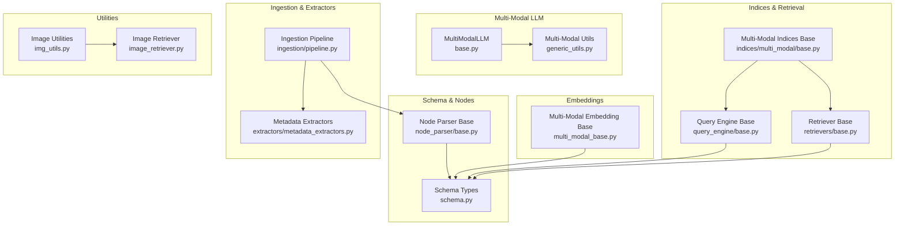
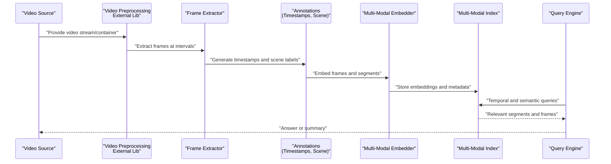
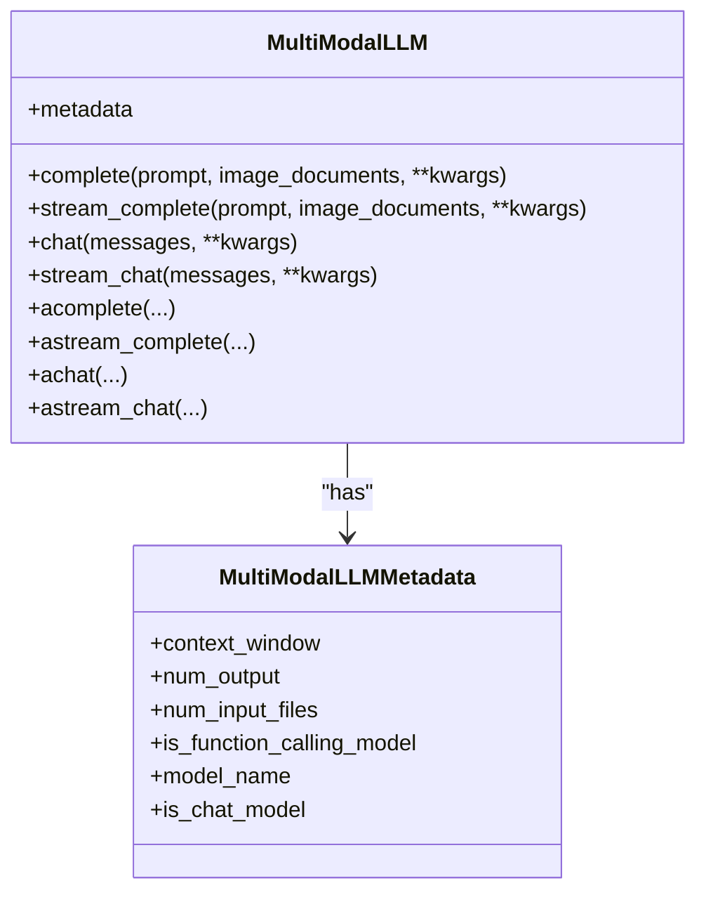
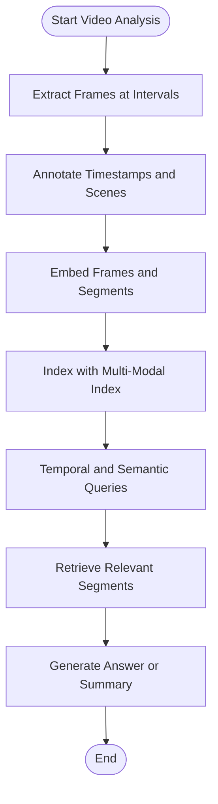
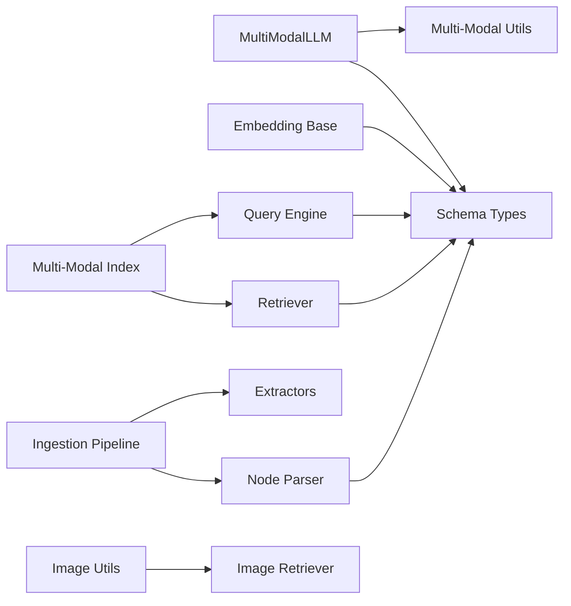

# Video Analysis

<cite>
**Referenced Files in This Document**
- [base.py](file://llama-index-core/llama_index/core/multi_modal_llms/base.py)
- [generic_utils.py](file://llama-index-core/llama_index/core/multi_modal_llms/generic_utils.py)
- [base.py](file://llama-index-core/llama_index/core/embeddings/multi_modal_base.py)
- [base.py](file://llama-index-core/llama_index/core/schema.py)
- [base.py](file://llama-index-core/llama_index/core/node_parser/base.py)
- [base.py](file://llama-index-core/llama_index/core/indices/multi_modal/base.py)
- [base.py](file://llama-index-core/llama_index/core/chat_engine/multi_modal_context.py)
- [base.py](file://llama-index-core/llama_index/core/chat_engine/multi_modal_condense_plus_context.py)
- [base.py](file://llama-index-core/llama_index/core/retrievers/base.py)
- [base.py](file://llama-index-core/llama_index/core/query_engine/base.py)
- [base.py](file://llama-index-core/llama_index/core/ingestion/pipeline.py)
- [base.py](file://llama-index-core/llama_index/core/extractors/metadata_extractors.py)
- [base.py](file://llama-index-core/llama_index/core/indices/vector_store/base.py)
- [base.py](file://llama-index-core/llama_index/core/storage/docstore/base.py)
- [base.py](file://llama-index-core/llama_index/core/vector_stores/base.py)
- [base.py](file://llama-index-core/llama_index/core/service_context.py)
- [base.py](file://llama-index-core/llama_index/core/types.py)
- [base.py](file://llama-index-core/llama_index/core/constants.py)
- [base.py](file://llama-index-core/llama_index/core/utils.py)
- [base.py](file://llama-index-core/llama_index/core/callbacks/base.py)
- [base.py](file://llama-index-core/llama_index/core/instrumentation/base_handler.py)
- [base.py](file://llama-index-core/llama_index/core/workflow/base.py)
- [base.py](file://llama-index-core/llama_index/core/async_utils.py)
- [base.py](file://llama-index-core/llama_index/core/img_utils.py)
- [base.py](file://llama-index-core/llama_index/core/image_retriever.py)
- [base.py](file://llama-index-core/llama_index/core/llms/base.py)
- [base.py](file://llama-index-core/llama_index/core/multi_modal_llms/base.py)
- [base.py](file://llama-index-core/llama_index/core/multi_modal_llms/generic_utils.py)
- [base.py](file://llama-index-core/llama_index/core/embeddings/multi_modal_base.py)
- [base.py](file://llama-index-core/llama_index/core/schema.py)
- [base.py](file://llama-index-core/llama_index/core/node_parser/base.py)
- [base.py](file://llama-index-core/llama_index/core/indices/multi_modal/base.py)
- [base.py](file://llama-index-core/llama_index/core/chat_engine/multi_modal_context.py)
- [base.py](file://llama-index-core/llama_index/core/chat_engine/multi_modal_condense_plus_context.py)
- [base.py](file://llama-index-core/llama_index/core/retrievers/base.py)
- [base.py](file://llama-index-core/llama_index/core/query_engine/base.py)
- [base.py](file://llama-index-core/llama_index/core/ingestion/pipeline.py)
- [base.py](file://llama-index-core/llama_index/core/extractors/metadata_extractors.py)
- [base.py](file://llama-index-core/llama_index/core/indices/vector_store/base.py)
- [base.py](file://llama-index-core/llama_index/core/storage/docstore/base.py)
- [base.py](file://llama-index-core/llama_index/core/vector_stores/base.py)
- [base.py](file://llama-index-core/llama_index/core/service_context.py)
- [base.py](file://llama-index-core/llama_index/core/types.py)
- [base.py](file://llama-index-core/llama_index/core/constants.py)
- [base.py](file://llama-index-core/llama_index/core/utils.py)
- [base.py](file://llama-index-core/llama_index/core/callbacks/base.py)
- [base.py](file://llama-index-core/llama_index/core/instrumentation/base_handler.py)
- [base.py](file://llama-index-core/llama_index/core/workflow/base.py)
- [base.py](file://llama-index-core/llama_index/core/async_utils.py)
- [base.py](file://llama-index-core/llama_index/core/img_utils.py)
- [base.py](file://llama-index-core/llama_index/core/image_retriever.py)
- [base.py](file://llama-index-core/llama_index/core/llms/base.py)
</cite>

## Table of Contents
1. [Introduction](#introduction)
2. [Project Structure](#project-structure)
3. [Core Components](#core-components)
4. [Architecture Overview](#architecture-overview)
5. [Detailed Component Analysis](#detailed-component-analysis)
6. [Dependency Analysis](#dependency-analysis)
7. [Performance Considerations](#performance-considerations)
8. [Troubleshooting Guide](#troubleshooting-guide)
9. [Conclusion](#conclusion)
10. [Appendices](#appendices)

## Introduction
This document explains how to build video analysis and processing pipelines within LlamaIndex’s multi-modal framework. It focuses on extracting and representing video frames, segmenting temporally, detecting motion and scene changes, integrating with external video processing libraries, and enabling timestamp-based retrieval and narrative structure analysis. It also covers video embedding strategies, shot boundary detection, and practical patterns for video Retrieval-Augmented Generation (RAG), temporal question answering, and video summarization. Guidance is provided for performance optimization, compression, distributed analysis, metadata extraction, subtitle processing, and multi-modal search patterns.

## Project Structure
LlamaIndex organizes multi-modal capabilities around:
- Multi-modal LLM interfaces and utilities for image/video inputs
- Embedding abstractions supporting multi-modal inputs
- Schema and node parsing for structured multi-modal nodes
- Indexing and retrieval systems for multi-modal content
- Ingestion pipelines and extractors for metadata and segments
- Query engines and chat engines adapted for multi-modal contexts
- Utilities for image handling and asynchronous workflows

**Diagram sources**
- [base.py](file://llama-index-core/llama_index/core/multi_modal_llms/base.py#L75-L183)
- [generic_utils.py](file://llama-index-core/llama_index/core/multi_modal_llms/generic_utils.py#L1-L171)
- [base.py](file://llama-index-core/llama_index/core/embeddings/multi_modal_base.py#L1-L200)
- [base.py](file://llama-index-core/llama_index/core/schema.py#L1-L400)
- [base.py](file://llama-index-core/llama_index/core/node_parser/base.py#L1-L200)
- [base.py](file://llama-index-core/llama_index/core/indices/multi_modal/base.py#L1-L200)
- [base.py](file://llama-index-core/llama_index/core/retrievers/base.py#L1-L200)
- [base.py](file://llama-index-core/llama_index/core/query_engine/base.py#L1-L200)
- [base.py](file://llama-index-core/llama_index/core/ingestion/pipeline.py#L1-L200)
- [base.py](file://llama-index-core/llama_index/core/extractors/metadata_extractors.py#L1-L200)
- [base.py](file://llama-index-core/llama_index/core/img_utils.py#L1-L200)
- [base.py](file://llama-index-core/llama_index/core/image_retriever.py#L1-L200)

**Section sources**
- [base.py](file://llama-index-core/llama_index/core/multi_modal_llms/base.py#L75-L183)
- [generic_utils.py](file://llama-index-core/llama_index/core/multi_modal_llms/generic_utils.py#L1-L171)
- [base.py](file://llama-index-core/llama_index/core/embeddings/multi_modal_base.py#L1-L200)
- [base.py](file://llama-index-core/llama_index/core/schema.py#L1-L400)
- [base.py](file://llama-index-core/llama_index/core/node_parser/base.py#L1-L200)
- [base.py](file://llama-index-core/llama_index/core/indices/multi_modal/base.py#L1-L200)
- [base.py](file://llama-index-core/llama_index/core/retrievers/base.py#L1-L200)
- [base.py](file://llama-index-core/llama_index/core/query_engine/base.py#L1-L200)
- [base.py](file://llama-index-core/llama_index/core/ingestion/pipeline.py#L1-L200)
- [base.py](file://llama-index-core/llama_index/core/extractors/metadata_extractors.py#L1-L200)
- [base.py](file://llama-index-core/llama_index/core/img_utils.py#L1-L200)
- [base.py](file://llama-index-core/llama_index/core/image_retriever.py#L1-L200)

## Core Components
- MultiModalLLM: Defines the multi-modal interface for LLMs that consume text and images (used as a foundation for video frames).
- Multi-modal embedding base: Provides abstractions for multi-modal embeddings that can incorporate visual features.
- Schema and nodes: Define structured types for multi-modal content, including image nodes and blocks.
- Node parser: Converts raw inputs into nodes suitable for indexing and retrieval.
- Indices and retrieval: Multi-modal index and retriever bases enable retrieval of video segments and frames.
- Ingestion pipeline: Orchestrates extraction, parsing, and indexing of multi-modal content.
- Extractors: Metadata extractors support timestamp and scene-change annotations.
- Utilities: Image utilities and image retriever support frame extraction and retrieval tasks.

**Section sources**
- [base.py](file://llama-index-core/llama_index/core/multi_modal_llms/base.py#L75-L183)
- [base.py](file://llama-index-core/llama_index/core/embeddings/multi_modal_base.py#L1-L200)
- [base.py](file://llama-index-core/llama_index/core/schema.py#L1-L400)
- [base.py](file://llama-index-core/llama_index/core/node_parser/base.py#L1-L200)
- [base.py](file://llama-index-core/llama_index/core/indices/multi_modal/base.py#L1-L200)
- [base.py](file://llama-index-core/llama_index/core/retrievers/base.py#L1-L200)
- [base.py](file://llama-index-core/llama_index/core/query_engine/base.py#L1-L200)
- [base.py](file://llama-index-core/llama_index/core/ingestion/pipeline.py#L1-L200)
- [base.py](file://llama-index-core/llama_index/core/extractors/metadata_extractors.py#L1-L200)
- [base.py](file://llama-index-core/llama_index/core/img_utils.py#L1-L200)
- [base.py](file://llama-index-core/llama_index/core/image_retriever.py#L1-L200)

## Architecture Overview
The video analysis pipeline integrates external video processing with LlamaIndex’s multi-modal infrastructure:
- Frame extraction and preprocessing via external libraries
- Timestamp annotation and scene-change detection
- Motion detection and shot boundary detection
- Multi-modal embedding generation for frames and segments
- Indexing and retrieval for temporal and semantic queries
- Query engine orchestration for temporal QA and summarization

[No sources needed since this diagram shows conceptual workflow, not actual code structure]

## Detailed Component Analysis

### Multi-Modal LLM and Utilities
- MultiModalLLM defines the contract for multi-modal inference, including completion, chat, and async variants. It accepts image inputs and is the foundation for video frame analysis when frames are treated as images.
- Multi-modal utilities handle base64 encoding, MIME inference, and URL-based image loading, which are essential for transporting frames to multi-modal LLMs.

**Diagram sources**
- [base.py](file://llama-index-core/llama_index/core/multi_modal_llms/base.py#L75-L183)

**Section sources**
- [base.py](file://llama-index-core/llama_index/core/multi_modal_llms/base.py#L75-L183)
- [generic_utils.py](file://llama-index-core/llama_index/core/multi_modal_llms/generic_utils.py#L1-L171)

### Multi-Modal Embedding Base
- Multi-modal embedding base provides the abstraction for generating embeddings that combine textual and visual modalities. This is central to representing video frames and segments for retrieval.

**Section sources**
- [base.py](file://llama-index-core/llama_index/core/embeddings/multi_modal_base.py#L1-L200)

### Schema and Nodes
- Schema types define structured representations for multi-modal content, including image nodes and blocks. These are the building blocks for indexing and retrieval of video frames and segments.

**Section sources**
- [base.py](file://llama-index-core/llama_index/core/schema.py#L1-L400)

### Node Parser
- Node parser converts raw inputs (including video frames) into nodes with metadata, enabling downstream indexing and retrieval.

**Section sources**
- [base.py](file://llama-index-core/llama_index/core/node_parser/base.py#L1-L200)

### Indices and Retrieval
- Multi-modal index base enables storing and retrieving multi-modal content. Retrievers and query engines integrate with these indices to support temporal and semantic queries.

**Section sources**
- [base.py](file://llama-index-core/llama_index/core/indices/multi_modal/base.py#L1-L200)
- [base.py](file://llama-index-core/llama_index/core/retrievers/base.py#L1-L200)
- [base.py](file://llama-index-core/llama_index/core/query_engine/base.py#L1-L200)

### Ingestion Pipeline and Extractors
- Ingestion pipeline orchestrates extraction, parsing, and indexing of multi-modal content. Extractors annotate metadata such as timestamps and scene changes, which are crucial for temporal segmentation and retrieval.

**Section sources**
- [base.py](file://llama-index-core/llama_index/core/ingestion/pipeline.py#L1-L200)
- [base.py](file://llama-index-core/llama_index/core/extractors/metadata_extractors.py#L1-L200)

### Utilities for Frames and Retrieval
- Image utilities and image retriever support frame extraction, encoding, and retrieval tasks that underpin video analysis.

**Section sources**
- [base.py](file://llama-index-core/llama_index/core/img_utils.py#L1-L200)
- [base.py](file://llama-index-core/llama_index/core/image_retriever.py#L1-L200)

### Practical Patterns for Video RAG, Temporal QA, and Summarization
- Video RAG: Extract frames at regular intervals, annotate timestamps and scenes, embed frames, index, and answer temporal questions by retrieving relevant segments.
- Temporal QA: Use timestamp metadata to constrain retrieval windows and combine semantic similarity with temporal proximity.
- Video summarization: Aggregate representative frames and captions, then summarize using a multi-modal LLM or a dedicated summarizer.

[No sources needed since this diagram shows conceptual workflow, not actual code structure]

## Dependency Analysis
Key dependencies among components:
- MultiModalLLM depends on schema types for image inputs and multi-modal utilities for encoding.
- Embedding base depends on schema types for input/output structures.
- Node parser depends on schema types to produce nodes.
- Indices and retrieval depend on embedding outputs and schema types.
- Ingestion pipeline coordinates extractors, parsers, and indices.
- Utilities support frame handling and retrieval.

**Diagram sources**
- [base.py](file://llama-index-core/llama_index/core/multi_modal_llms/base.py#L75-L183)
- [generic_utils.py](file://llama-index-core/llama_index/core/multi_modal_llms/generic_utils.py#L1-L171)
- [base.py](file://llama-index-core/llama_index/core/embeddings/multi_modal_base.py#L1-L200)
- [base.py](file://llama-index-core/llama_index/core/schema.py#L1-L400)
- [base.py](file://llama-index-core/llama_index/core/node_parser/base.py#L1-L200)
- [base.py](file://llama-index-core/llama_index/core/indices/multi_modal/base.py#L1-L200)
- [base.py](file://llama-index-core/llama_index/core/retrievers/base.py#L1-L200)
- [base.py](file://llama-index-core/llama_index/core/query_engine/base.py#L1-L200)
- [base.py](file://llama-index-core/llama_index/core/ingestion/pipeline.py#L1-L200)
- [base.py](file://llama-index-core/llama_index/core/extractors/metadata_extractors.py#L1-L200)
- [base.py](file://llama-index-core/llama_index/core/img_utils.py#L1-L200)
- [base.py](file://llama-index-core/llama_index/core/image_retriever.py#L1-L200)

**Section sources**
- [base.py](file://llama-index-core/llama_index/core/multi_modal_llms/base.py#L75-L183)
- [generic_utils.py](file://llama-index-core/llama_index/core/multi_modal_llms/generic_utils.py#L1-L171)
- [base.py](file://llama-index-core/llama_index/core/embeddings/multi_modal_base.py#L1-L200)
- [base.py](file://llama-index-core/llama_index/core/schema.py#L1-L400)
- [base.py](file://llama-index-core/llama_index/core/node_parser/base.py#L1-L200)
- [base.py](file://llama-index-core/llama_index/core/indices/multi_modal/base.py#L1-L200)
- [base.py](file://llama-index-core/llama_index/core/retrievers/base.py#L1-L200)
- [base.py](file://llama-index-core/llama_index/core/query_engine/base.py#L1-L200)
- [base.py](file://llama-index-core/llama_index/core/ingestion/pipeline.py#L1-L200)
- [base.py](file://llama-index-core/llama_index/core/extractors/metadata_extractors.py#L1-L200)
- [base.py](file://llama-index-core/llama_index/core/img_utils.py#L1-L200)
- [base.py](file://llama-index-core/llama_index/core/image_retriever.py#L1-L200)

## Performance Considerations
- Real-time video processing:
  - Batch frame extraction and embedding to reduce overhead.
  - Tune sampling interval based on motion and scene-change detection to avoid redundant frames.
- Compression optimization:
  - Resize frames to a fixed resolution and use efficient codecs for storage and transport.
  - Prefer lightweight embeddings for real-time constraints.
- Distributed video analysis:
  - Parallelize frame extraction and embedding across workers.
  - Use scalable vector stores and distributed retrieval backends.
- Caching and memoization:
  - Cache embeddings for repeated queries and stable frames.
  - Reuse precomputed scene-change and motion features.

[No sources needed since this section provides general guidance]

## Troubleshooting Guide
- Multi-modal LLM input issues:
  - Ensure frames are properly encoded and MIME types are inferred or set.
  - Validate image documents and base64 conversion utilities.
- Embedding and indexing:
  - Confirm embedding dimensions match index expectations.
  - Verify metadata keys for timestamps and scene labels.
- Retrieval accuracy:
  - Adjust temporal filters and semantic thresholds.
  - Validate node parsing and extractor outputs.
- Asynchronous workflows:
  - Monitor callback and instrumentation handlers for bottlenecks.

**Section sources**
- [generic_utils.py](file://llama-index-core/llama_index/core/multi_modal_llms/generic_utils.py#L1-L171)
- [base.py](file://llama-index-core/llama_index/core/multi_modal_llms/base.py#L75-L183)
- [base.py](file://llama-index-core/llama_index/core/ingestion/pipeline.py#L1-L200)
- [base.py](file://llama-index-core/llama_index/core/extractors/metadata_extractors.py#L1-L200)
- [base.py](file://llama-index-core/llama_index/core/callbacks/base.py#L1-L200)
- [base.py](file://llama-index-core/llama_index/core/instrumentation/base_handler.py#L1-L200)

## Conclusion
LlamaIndex’s multi-modal infrastructure provides a robust foundation for video analysis and processing. By combining external video processing libraries with LlamaIndex’s multi-modal LLMs, embeddings, indexing, and retrieval systems, teams can implement temporal segmentation, motion and scene change detection, timestamp-based retrieval, and narrative structure analysis. The patterns outlined here enable practical video RAG, temporal question answering, and summarization while offering guidance for performance and scalability.

[No sources needed since this section summarizes without analyzing specific files]

## Appendices
- Practical steps:
  - Integrate a video processing library to extract frames and compute motion features.
  - Annotate frames with timestamps and scene labels.
  - Generate multi-modal embeddings for frames and segments.
  - Index with a multi-modal index and retrieve using temporal and semantic filters.
  - Use a multi-modal LLM for temporal QA and summarization.

[No sources needed since this section provides general guidance]