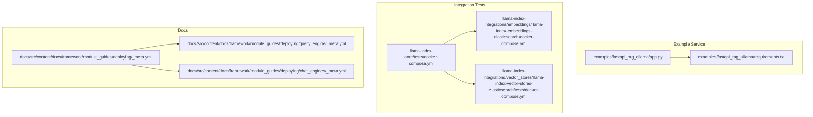
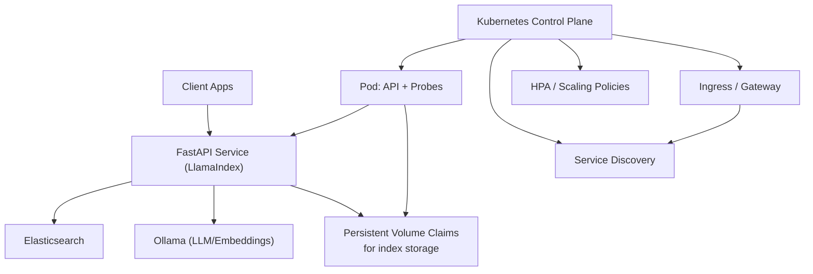
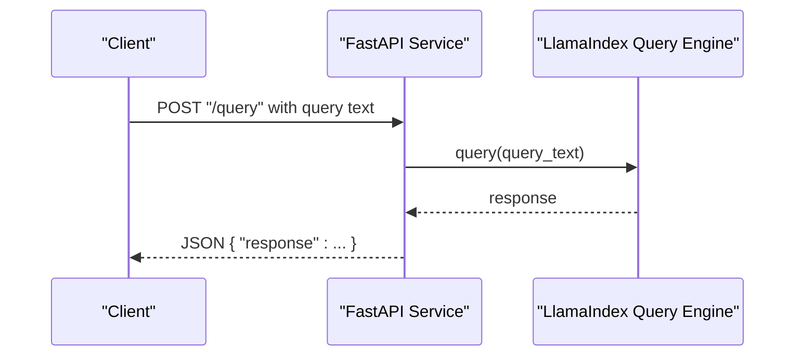
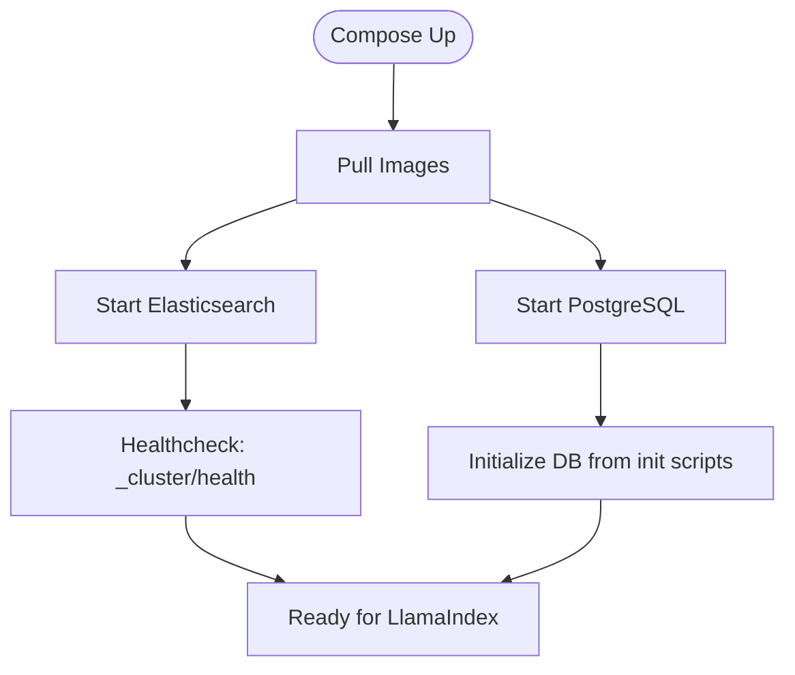
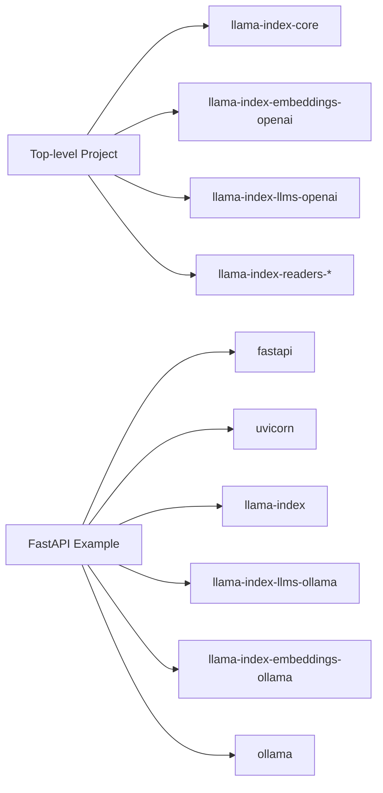

# Containerization and Orchestration

<cite>
**Referenced Files in This Document**
- [README.md](file://README.md)
- [pyproject.toml](file://pyproject.toml)
- [examples/fastapi_rag_ollama/app.py](file://examples/fastapi_rag_ollama/app.py)
- [examples/fastapi_rag_ollama/requirements.txt](file://examples/fastapi_rag_ollama/requirements.txt)
- [llama-index-core/tests/docker-compose.yml](file://llama-index-core/tests/docker-compose.yml)
- [llama-index-integrations/embeddings/llama-index-embeddings-elasticsearch/docker-compose.yml](file://llama-index-integrations/embeddings/llama-index-embeddings-elasticsearch/docker-compose.yml)
- [llama-index-integrations/vector_stores/llama-index-vector-stores-elasticsearch/tests/docker-compose.yml](file://llama-index-integrations/vector_stores/llama-index-vector-stores-elasticsearch/tests/docker-compose.yml)
- [docs/src/content/docs/framework/module_guides/deploying/_meta.yml](file://docs/src/content/docs/framework/module_guides/deploying/_meta.yml)
- [docs/src/content/docs/framework/module_guides/deploying/query_engine/_meta.yml](file://docs/src/content/docs/framework/module_guides/deploying/query_engine/_meta.yml)
- [docs/src/content/docs/framework/module_guides/deploying/chat_engines/_meta.yml](file://docs/src/content/docs/framework/module_guides/deploying/chat_engines/_meta.yml)
</cite>

## Table of Contents
1. [Introduction](#introduction)
2. [Project Structure](#project-structure)
3. [Core Components](#core-components)
4. [Architecture Overview](#architecture-overview)
5. [Detailed Component Analysis](#detailed-component-analysis)
6. [Dependency Analysis](#dependency-analysis)
7. [Performance Considerations](#performance-considerations)
8. [Troubleshooting Guide](#troubleshooting-guide)
9. [Conclusion](#conclusion)
10. [Appendices](#appendices)

## Introduction
This document provides production-grade guidance for containerizing and orchestrating LlamaIndex applications. It covers Docker containerization strategies, multi-stage builds, dependency management, Kubernetes deployment patterns, Helm chart deployment, namespace and resource management, security best practices, health checks, graceful shutdown, scaling, rolling updates, and blue-green deployments. The content synthesizes patterns present in the repository’s example FastAPI service and Docker Compose configurations, and aligns them with LlamaIndex’s modular architecture and integrations.

## Project Structure
The repository includes:
- A FastAPI example service that demonstrates a minimal LlamaIndex RAG workload
- Docker Compose files for Elasticsearch and other integrations
- Documentation sections under “Deploying” that outline deployment modules

**Diagram sources**
- [examples/fastapi_rag_ollama/app.py](file://examples/fastapi_rag_ollama/app.py#L1-L30)
- [examples/fastapi_rag_ollama/requirements.txt](file://examples/fastapi_rag_ollama/requirements.txt#L1-L7)
- [llama-index-core/tests/docker-compose.yml](file://llama-index-core/tests/docker-compose.yml#L1-L40)
- [llama-index-integrations/embeddings/llama-index-embeddings-elasticsearch/docker-compose.yml](file://llama-index-integrations/embeddings/llama-index-embeddings-elasticsearch/docker-compose.yml#L1-L21)
- [llama-index-integrations/vector_stores/llama-index-vector-stores-elasticsearch/tests/docker-compose.yml](file://llama-index-integrations/vector_stores/llama-index-vector-stores-elasticsearch/tests/docker-compose.yml#L1-L20)
- [docs/src/content/docs/framework/module_guides/deploying/_meta.yml](file://docs/src/content/docs/framework/module_guides/deploying/_meta.yml#L1-L3)
- [docs/src/content/docs/framework/module_guides/deploying/query_engine/_meta.yml](file://docs/src/content/docs/framework/module_guides/deploying/query_engine/_meta.yml#L1-L3)
- [docs/src/content/docs/framework/module_guides/deploying/chat_engines/_meta.yml](file://docs/src/content/docs/framework/module_guides/deploying/chat_engines/_meta.yml#L1-L3)

**Section sources**
- [README.md](file://README.md#L1-L224)
- [pyproject.toml](file://pyproject.toml#L1-L229)
- [examples/fastapi_rag_ollama/app.py](file://examples/fastapi_rag_ollama/app.py#L1-L30)
- [examples/fastapi_rag_ollama/requirements.txt](file://examples/fastapi_rag_ollama/requirements.txt#L1-L7)
- [llama-index-core/tests/docker-compose.yml](file://llama-index-core/tests/docker-compose.yml#L1-L40)
- [llama-index-integrations/embeddings/llama-index-embeddings-elasticsearch/docker-compose.yml](file://llama-index-integrations/embeddings/llama-index-embeddings-elasticsearch/docker-compose.yml#L1-L21)
- [llama-index-integrations/vector_stores/llama-index-vector-stores-elasticsearch/tests/docker-compose.yml](file://llama-index-integrations/vector_stores/llama-index-vector-stores-elasticsearch/tests/docker-compose.yml#L1-L20)
- [docs/src/content/docs/framework/module_guides/deploying/_meta.yml](file://docs/src/content/docs/framework/module_guides/deploying/_meta.yml#L1-L3)
- [docs/src/content/docs/framework/module_guides/deploying/query_engine/_meta.yml](file://docs/src/content/docs/framework/module_guides/deploying/query_engine/_meta.yml#L1-L3)
- [docs/src/content/docs/framework/module_guides/deploying/chat_engines/_meta.yml](file://docs/src/content/docs/framework/module_guides/deploying/chat_engines/_meta.yml#L1-L3)

## Core Components
- FastAPI service: A minimal RAG API built on LlamaIndex, configured with Ollama-backed LLM and embeddings, and exposing a /query endpoint.
- Docker Compose configurations: Examples for Elasticsearch and PostgreSQL, including health checks and port exposure.
- Documentation modules: “Deploying,” “Query Engine,” and “Chat Engines” sections that guide deployment strategies.

Key implementation references:
- FastAPI app definition and endpoint: [examples/fastapi_rag_ollama/app.py](file://examples/fastapi_rag_ollama/app.py#L1-L30)
- Dependencies and integrations: [examples/fastapi_rag_ollama/requirements.txt](file://examples/fastapi_rag_ollama/requirements.txt#L1-L7)
- Elasticsearch health checks and ports: [llama-index-integrations/embeddings/llama-index-embeddings-elasticsearch/docker-compose.yml](file://llama-index-integrations/embeddings/llama-index-embeddings-elasticsearch/docker-compose.yml#L1-L21), [llama-index-integrations/vector_stores/llama-index-vector-stores-elasticsearch/tests/docker-compose.yml](file://llama-index-integrations/vector_stores/llama-index-vector-stores-elasticsearch/tests/docker-compose.yml#L1-L20)
- Core Docker Compose for Elasticsearch and PostgreSQL: [llama-index-core/tests/docker-compose.yml](file://llama-index-core/tests/docker-compose.yml#L1-L40)
- Deployment documentation modules: [docs/src/content/docs/framework/module_guides/deploying/_meta.yml](file://docs/src/content/docs/framework/module_guides/deploying/_meta.yml#L1-L3), [docs/src/content/docs/framework/module_guides/deploying/query_engine/_meta.yml](file://docs/src/content/docs/framework/module_guides/deploying/query_engine/_meta.yml#L1-L3), [docs/src/content/docs/framework/module_guides/deploying/chat_engines/_meta.yml](file://docs/src/content/docs/framework/module_guides/deploying/chat_engines/_meta.yml#L1-L3)

**Section sources**
- [examples/fastapi_rag_ollama/app.py](file://examples/fastapi_rag_ollama/app.py#L1-L30)
- [examples/fastapi_rag_ollama/requirements.txt](file://examples/fastapi_rag_ollama/requirements.txt#L1-L7)
- [llama-index-integrations/embeddings/llama-index-embeddings-elasticsearch/docker-compose.yml](file://llama-index-integrations/embeddings/llama-index-embeddings-elasticsearch/docker-compose.yml#L1-L21)
- [llama-index-integrations/vector_stores/llama-index-vector-stores-elasticsearch/tests/docker-compose.yml](file://llama-index-integrations/vector_stores/llama-index-vector-stores-elasticsearch/tests/docker-compose.yml#L1-L20)
- [llama-index-core/tests/docker-compose.yml](file://llama-index-core/tests/docker-compose.yml#L1-L40)
- [docs/src/content/docs/framework/module_guides/deploying/_meta.yml](file://docs/src/content/docs/framework/module_guides/deploying/_meta.yml#L1-L3)
- [docs/src/content/docs/framework/module_guides/deploying/query_engine/_meta.yml](file://docs/src/content/docs/framework/module_guides/deploying/query_engine/_meta.yml#L1-L3)
- [docs/src/content/docs/framework/module_guides/deploying/chat_engines/_meta.yml](file://docs/src/content/docs/framework/module_guides/deploying/chat_engines/_meta.yml#L1-L3)

## Architecture Overview
The recommended production architecture combines:
- A containerized FastAPI service backed by LlamaIndex
- Sidecar or external services for vector stores and LLMs (e.g., Ollama, Elasticsearch)
- Kubernetes for orchestration with health checks, readiness/liveness probes, and resource management
- Helm for templated deployments across namespaces

[No sources needed since this diagram shows conceptual workflow, not actual code structure]

## Detailed Component Analysis

### FastAPI Service Containerization
- Purpose: Exposes a /query endpoint powered by a LlamaIndex query engine initialized at startup.
- Dependencies: FastAPI, Uvicorn, LlamaIndex core, Ollama-backed LLM and embeddings.
- Startup behavior: Loads documents and builds a VectorStoreIndex during initialization.

**Diagram sources**
- [examples/fastapi_rag_ollama/app.py](file://examples/fastapi_rag_ollama/app.py#L25-L29)

**Section sources**
- [examples/fastapi_rag_ollama/app.py](file://examples/fastapi_rag_ollama/app.py#L1-L30)
- [examples/fastapi_rag_ollama/requirements.txt](file://examples/fastapi_rag_ollama/requirements.txt#L1-L7)

### Docker Compose Patterns for Integrations
- Elasticsearch: Health checks via curl against cluster health endpoint; single-node configuration for development.
- PostgreSQL: Multi-stage build context and volume mounting for initialization scripts.

**Diagram sources**
- [llama-index-core/tests/docker-compose.yml](file://llama-index-core/tests/docker-compose.yml#L1-L40)
- [llama-index-integrations/embeddings/llama-index-embeddings-elasticsearch/docker-compose.yml](file://llama-index-integrations/embeddings/llama-index-embeddings-elasticsearch/docker-compose.yml#L1-L21)
- [llama-index-integrations/vector_stores/llama-index-vector-stores-elasticsearch/tests/docker-compose.yml](file://llama-index-integrations/vector_stores/llama-index-vector-stores-elasticsearch/tests/docker-compose.yml#L1-L20)

**Section sources**
- [llama-index-core/tests/docker-compose.yml](file://llama-index-core/tests/docker-compose.yml#L1-L40)
- [llama-index-integrations/embeddings/llama-index-embeddings-elasticsearch/docker-compose.yml](file://llama-index-integrations/embeddings/llama-index-embeddings-elasticsearch/docker-compose.yml#L1-L21)
- [llama-index-integrations/vector_stores/llama-index-vector-stores-elasticsearch/tests/docker-compose.yml](file://llama-index-integrations/vector_stores/llama-index-vector-stores-elasticsearch/tests/docker-compose.yml#L1-L20)

### Kubernetes Deployment Patterns
- Pod specification: Define liveness/readiness probes aligned with health checks in Compose; mount persistent volumes for index storage.
- Service discovery: ClusterIP or LoadBalancer depending on ingress gateway; headless services for stateful sets if using stateful vector stores.
- Ingress: Route traffic to the service; configure TLS and rate limiting.
- Helm charts: Template deployments across environments; manage namespaces and resource quotas via values and RBAC.

[No sources needed since this section provides general guidance]

### Helm Chart Deployment and Namespace Management
- Namespaces: Isolate staging vs production; apply resource quotas per namespace.
- Resource quotas: Limit CPU/memory per deployment; enforce limits for GPU-accelerated nodes if applicable.
- Release management: Use Helm values to toggle features (e.g., debug logging, replicas).

[No sources needed since this section provides general guidance]

### Security Best Practices
- Run containers as non-root; drop unnecessary capabilities.
- Restrict network policies; enable mTLS between pods.
- Manage secrets via Kubernetes Secrets or external secret managers; avoid hardcoding credentials.
- Enable image scanning and SBOM verification.

[No sources needed since this section provides general guidance]

### Health Checks and Graceful Shutdown
- Health checks: Mirror Compose health checks for Elasticsearch; implement HTTP endpoints for application readiness.
- Graceful shutdown: Intercept SIGTERM/SIGINT; drain connections and flush caches before termination.

[No sources needed since this section provides general guidance]

### Scaling Strategies
- Horizontal Pod Autoscaler (HPA): Scale on CPU/utilization or custom metrics (QPS, latency).
- Rolling updates: Set maxUnavailable/maxSurge; ensure zero-downtime deployments.
- Blue-green deployments: Maintain two identical releases; switch traffic after validation.

[No sources needed since this section provides general guidance]

## Dependency Analysis
The top-level project depends on core LlamaIndex and several integrations. The example service depends on FastAPI, Uvicorn, and Ollama integrations.

**Diagram sources**
- [pyproject.toml](file://pyproject.toml#L41-L50)
- [examples/fastapi_rag_ollama/requirements.txt](file://examples/fastapi_rag_ollama/requirements.txt#L1-L7)

**Section sources**
- [pyproject.toml](file://pyproject.toml#L41-L50)
- [examples/fastapi_rag_ollama/requirements.txt](file://examples/fastapi_rag_ollama/requirements.txt#L1-L7)

## Performance Considerations
- Optimize embedding and LLM model sizes; leverage quantization where supported.
- Persist index storage to fast block storage; monitor I/O latency.
- Use connection pooling for vector stores; tune batch sizes for ingestion.
- Monitor memory usage; set appropriate JVM/GPU memory limits for model backends.

[No sources needed since this section provides general guidance]

## Troubleshooting Guide
- Elasticsearch readiness: Confirm health endpoint availability and credentials; adjust healthcheck intervals.
- PostgreSQL initialization: Verify init scripts are mounted and executed; check logs for errors.
- FastAPI service: Add logging and structured error responses; expose /health and /ready endpoints.

**Section sources**
- [llama-index-integrations/embeddings/llama-index-embeddings-elasticsearch/docker-compose.yml](file://llama-index-integrations/embeddings/llama-index-embeddings-elasticsearch/docker-compose.yml#L13-L20)
- [llama-index-core/tests/docker-compose.yml](file://llama-index-core/tests/docker-compose.yml#L22-L35)

## Conclusion
By combining the repository’s FastAPI example with Docker Compose health checks and the documented “Deploying” modules, teams can build robust, scalable LlamaIndex services. The guidance emphasizes containerization, secure defaults, observability, and operational excellence across Kubernetes and Helm-based environments.

[No sources needed since this section summarizes without analyzing specific files]

## Appendices
- Related documentation modules for deployment:
  - [Deploying](file://docs/src/content/docs/framework/module_guides/deploying/_meta.yml#L1-L3)
  - [Query Engine](file://docs/src/content/docs/framework/module_guides/deploying/query_engine/_meta.yml#L1-L3)
  - [Chat Engines](file://docs/src/content/docs/framework/module_guides/deploying/chat_engines/_meta.yml#L1-L3)

[No sources needed since this section aggregates links without analyzing specific files]