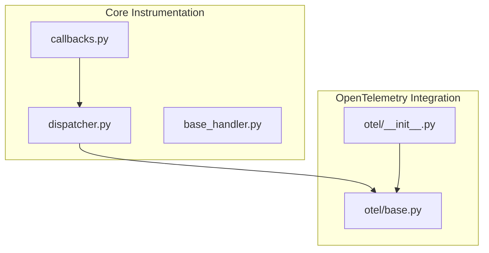
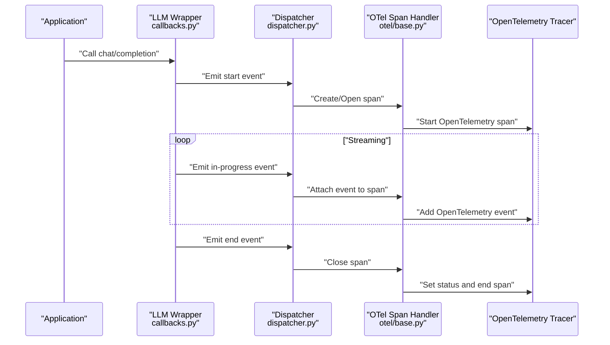
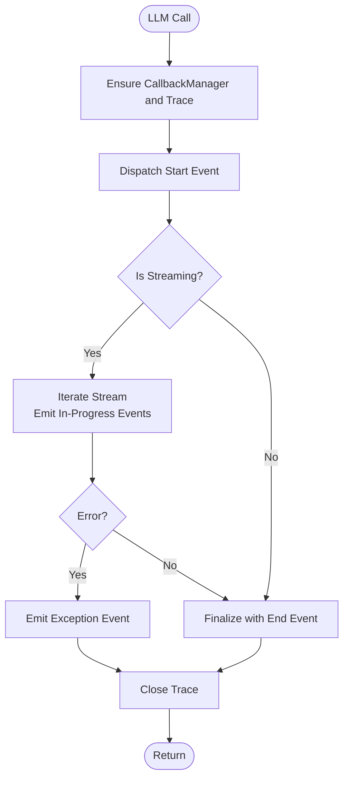
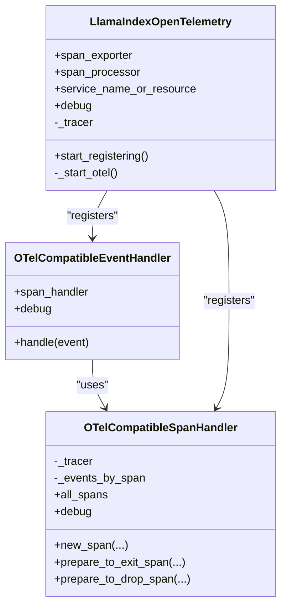
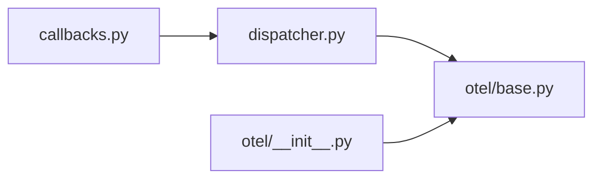

# Monitoring and Observability

<cite>
**Referenced Files in This Document**
- [callbacks.py](file://llama-index-core/llama_index/core/llms/callbacks.py)
- [dispatcher.py](file://llama-index-core/llama_index/core/instrumentation/dispatcher.py)
- [base_handler.py](file://llama-index-core/llama_index/core/instrumentation/base_handler.py)
- [base.py](file://llama-index-integrations/observability/llama-index-observability-otel/llama_index/observability/otel/base.py)
- [__init__.py](file://llama-index-integrations/observability/llama-index-observability-otel/llama_index/observability/otel/__init__.py)
- [README.md](file://llama-index-integrations/observability/llama-index-observability-otel/README.md)
</cite>

## Table of Contents
1. [Introduction](#introduction)
2. [Project Structure](#project-structure)
3. [Core Components](#core-components)
4. [Architecture Overview](#architecture-overview)
5. [Detailed Component Analysis](#detailed-component-analysis)
6. [Dependency Analysis](#dependency-analysis)
7. [Performance Considerations](#performance-considerations)
8. [Troubleshooting Guide](#troubleshooting-guide)
9. [Conclusion](#conclusion)
10. [Appendices](#appendices)

## Introduction
This document explains how to implement monitoring and observability in LlamaIndex production deployments. It covers metrics collection strategies, logging patterns, and tracing implementations, with a focus on integrating with monitoring platforms such as Prometheus, Grafana, and OpenTelemetry. It also details the callback system for performance tracking, token counting, and custom instrumentation, and provides guidance for building dashboards, alerting rules, and performance baselines tailored to Retrieval-Augmented Generation (RAG) applications.

## Project Structure
The observability stack in LlamaIndex is composed of:
- A core instrumentation and dispatch framework that emits structured events and spans during LLM interactions and other operations.
- An OpenTelemetry integration that bridges LlamaIndex spans and events to OpenTelemetry tracers and exporters for centralized observability.

**Diagram sources**
- [dispatcher.py](file://llama-index-core/llama_index/core/instrumentation/dispatcher.py#L1-L9)
- [base_handler.py](file://llama-index-core/llama_index/core/instrumentation/base_handler.py#L1-L2)
- [callbacks.py](file://llama-index-core/llama_index/core/llms/callbacks.py#L1-L546)
- [__init__.py](file://llama-index-integrations/observability/llama-index-observability-otel/llama_index/observability/otel/__init__.py#L1-L6)
- [base.py](file://llama-index-integrations/observability/llama-index-observability-otel/llama_index/observability/otel/base.py#L1-L269)

**Section sources**
- [dispatcher.py](file://llama-index-core/llama_index/core/instrumentation/dispatcher.py#L1-L9)
- [base_handler.py](file://llama-index-core/llama_index/core/instrumentation/base_handler.py#L1-L2)
- [callbacks.py](file://llama-index-core/llama_index/core/llms/callbacks.py#L1-L546)
- [__init__.py](file://llama-index-integrations/observability/llama-index-observability-otel/llama_index/observability/otel/__init__.py#L1-L6)
- [base.py](file://llama-index-integrations/observability/llama-index-observability-otel/llama_index/observability/otel/base.py#L1-L269)

## Core Components
- Callback system for LLM chat and completion:
  - Wraps LLM methods to emit structured start/end/in-progress events and to record spans via the instrumentation dispatcher.
  - Intercepts streaming responses and dispatches progress events.
  - Emits exceptions as events for error tracking.
- OpenTelemetry integration:
  - Provides a configuration class to initialize OpenTelemetry tracer providers and processors.
  - Registers span and event handlers that translate LlamaIndex spans/events into OpenTelemetry spans and attach LlamaIndex event attributes as OpenTelemetry events.

Key responsibilities:
- Emit structured telemetry for LLM operations (chat/completion) and related pipeline stages.
- Bridge LlamaIndex instrumentation to OpenTelemetry for centralized collection and export.

**Section sources**
- [callbacks.py](file://llama-index-core/llama_index/core/llms/callbacks.py#L39-L285)
- [callbacks.py](file://llama-index-core/llama_index/core/llms/callbacks.py#L288-L545)
- [base.py](file://llama-index-integrations/observability/llama-index-observability-otel/llama_index/observability/otel/base.py#L44-L160)
- [base.py](file://llama-index-integrations/observability/llama-index-observability-otel/llama_index/observability/otel/base.py#L162-L208)
- [base.py](file://llama-index-integrations/observability/llama-index-observability-otel/llama_index/observability/otel/base.py#L209-L269)

## Architecture Overview
The following diagram shows how LLM operations are instrumented and exported to OpenTelemetry.

**Diagram sources**
- [callbacks.py](file://llama-index-core/llama_index/core/llms/callbacks.py#L39-L285)
- [dispatcher.py](file://llama-index-core/llama_index/core/instrumentation/dispatcher.py#L1-L9)
- [base.py](file://llama-index-integrations/observability/llama-index-observability-otel/llama_index/observability/otel/base.py#L44-L160)

## Detailed Component Analysis

### LLM Callbacks and Telemetry Emission
The LLM callback decorators wrap LLM chat and completion methods to:
- Ensure a callback manager is present and activate a trace around the operation.
- Dispatch start events with serialized model info and input payloads.
- Intercept streaming generators to emit in-progress events per yielded chunk.
- Dispatch end events with final payloads and close the trace.
- Emit exception events when errors occur.

**Diagram sources**
- [callbacks.py](file://llama-index-core/llama_index/core/llms/callbacks.py#L39-L285)
- [callbacks.py](file://llama-index-core/llama_index/core/llms/callbacks.py#L288-L545)

**Section sources**
- [callbacks.py](file://llama-index-core/llama_index/core/llms/callbacks.py#L39-L285)
- [callbacks.py](file://llama-index-core/llama_index/core/llms/callbacks.py#L288-L545)

### OpenTelemetry Span and Event Handlers
The OpenTelemetry integration provides:
- A span handler that starts OpenTelemetry spans when LlamaIndex spans start and ends them when they complete or drop, attaching LlamaIndex events as OpenTelemetry events.
- An event handler that captures LlamaIndex events and attaches them to the current span’s event buffer for later emission when the span closes.
- A configuration class to initialize the tracer provider, processor, and exporter, and to register the handlers with the dispatcher.

**Diagram sources**
- [base.py](file://llama-index-integrations/observability/llama-index-observability-otel/llama_index/observability/otel/base.py#L44-L160)
- [base.py](file://llama-index-integrations/observability/llama-index-observability-otel/llama_index/observability/otel/base.py#L162-L208)
- [base.py](file://llama-index-integrations/observability/llama-index-observability-otel/llama_index/observability/otel/base.py#L209-L269)

**Section sources**
- [base.py](file://llama-index-integrations/observability/llama-index-observability-otel/llama_index/observability/otel/base.py#L44-L160)
- [base.py](file://llama-index-integrations/observability/llama-index-observability-otel/llama_index/observability/otel/base.py#L162-L208)
- [base.py](file://llama-index-integrations/observability/llama-index-observability-otel/llama_index/observability/otel/base.py#L209-L269)

### Integration with Monitoring Platforms
- OpenTelemetry exporters:
  - Configure an exporter (for example, OTLP) and a processor (simple or batch) to send traces to your backend (for example, Tempo, Jaeger, or Honeycomb).
- Metrics and logs:
  - Use OpenTelemetry metrics and logs to complement traces. For metrics, consider exporting to Prometheus/Grafana using an OpenTelemetry collector or adapter.
- Dashboards and alerts:
  - Build dashboards in Grafana to visualize latency, error rates, throughput, and token usage per stage.
  - Define SLOs and alerts for tail latencies, error spikes, and saturation metrics (for example, queue depth or retries).

**Section sources**
- [README.md](file://llama-index-integrations/observability/llama-index-observability-otel/README.md#L1-L76)
- [base.py](file://llama-index-integrations/observability/llama-index-observability-otel/llama_index/observability/otel/base.py#L224-L235)
- [base.py](file://llama-index-integrations/observability/llama-index-observability-otel/llama_index/observability/otel/base.py#L250-L256)

## Dependency Analysis
The LLM callbacks depend on the instrumentation dispatcher to emit events and manage spans. The OpenTelemetry integration registers handlers with the dispatcher to translate LlamaIndex telemetry into OpenTelemetry spans and events.

**Diagram sources**
- [callbacks.py](file://llama-index-core/llama_index/core/llms/callbacks.py#L24-L36)
- [dispatcher.py](file://llama-index-core/llama_index/core/instrumentation/dispatcher.py#L1-L9)
- [__init__.py](file://llama-index-integrations/observability/llama-index-observability-otel/llama_index/observability/otel/__init__.py#L1-L6)
- [base.py](file://llama-index-integrations/observability/llama-index-observability-otel/llama_index/observability/otel/base.py#L263-L268)

**Section sources**
- [callbacks.py](file://llama-index-core/llama_index/core/llms/callbacks.py#L24-L36)
- [dispatcher.py](file://llama-index-core/llama_index/core/instrumentation/dispatcher.py#L1-L9)
- [base.py](file://llama-index-integrations/observability/llama-index-observability-otel/llama_index/observability/otel/base.py#L263-L268)

## Performance Considerations
- Prefer batch span processors for high-throughput environments to reduce overhead.
- Filter sensitive fields (for example, API keys) when emitting events; the LLM wrappers already remove secret fields from serialized model payloads.
- Minimize event cardinality by avoiding high-cardinality attributes in events and spans.
- Use sampling strategies appropriate for production traffic to balance fidelity and cost.

[No sources needed since this section provides general guidance]

## Troubleshooting Guide
- Spans not appearing in OpenTelemetry:
  - Ensure the OpenTelemetry integration is initialized and handlers are registered before invoking LLM operations.
  - Verify the tracer provider and exporter are configured correctly.
- Events missing on spans:
  - Confirm that events are emitted while a span is active and that the event handler is registered.
- Debug mode:
  - Enable debug flags in the OpenTelemetry integration to print span lifecycle and event registration logs.

**Section sources**
- [base.py](file://llama-index-integrations/observability/llama-index-observability-otel/llama_index/observability/otel/base.py#L54-L57)
- [base.py](file://llama-index-integrations/observability/llama-index-observability-otel/llama_index/observability/otel/base.py#L168-L171)
- [base.py](file://llama-index-integrations/observability/llama-index-observability-otel/llama_index/observability/otel/base.py#L236-L239)
- [README.md](file://llama-index-integrations/observability/llama-index-observability-otel/README.md#L39-L75)

## Conclusion
By leveraging the built-in instrumentation and callback system, and integrating with OpenTelemetry, LlamaIndex applications can achieve comprehensive observability. The callback decorators provide structured telemetry for LLM operations, while the OpenTelemetry integration enables seamless export to modern observability backends. Combined with platform-specific dashboards and alerting, teams can monitor performance, detect anomalies, and maintain reliable RAG services at scale.

[No sources needed since this section summarizes without analyzing specific files]

## Appendices

### Example: Enabling OpenTelemetry Export
- Initialize the OpenTelemetry integration with a custom exporter and service name.
- Register the handlers with the dispatcher.
- Run typical LLM operations to emit spans and events.

**Section sources**
- [README.md](file://llama-index-integrations/observability/llama-index-observability-otel/README.md#L39-L75)
- [base.py](file://llama-index-integrations/observability/llama-index-observability-otel/llama_index/observability/otel/base.py#L258-L269)