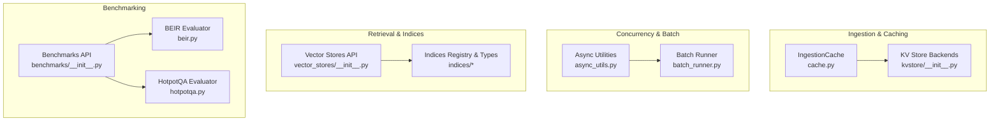
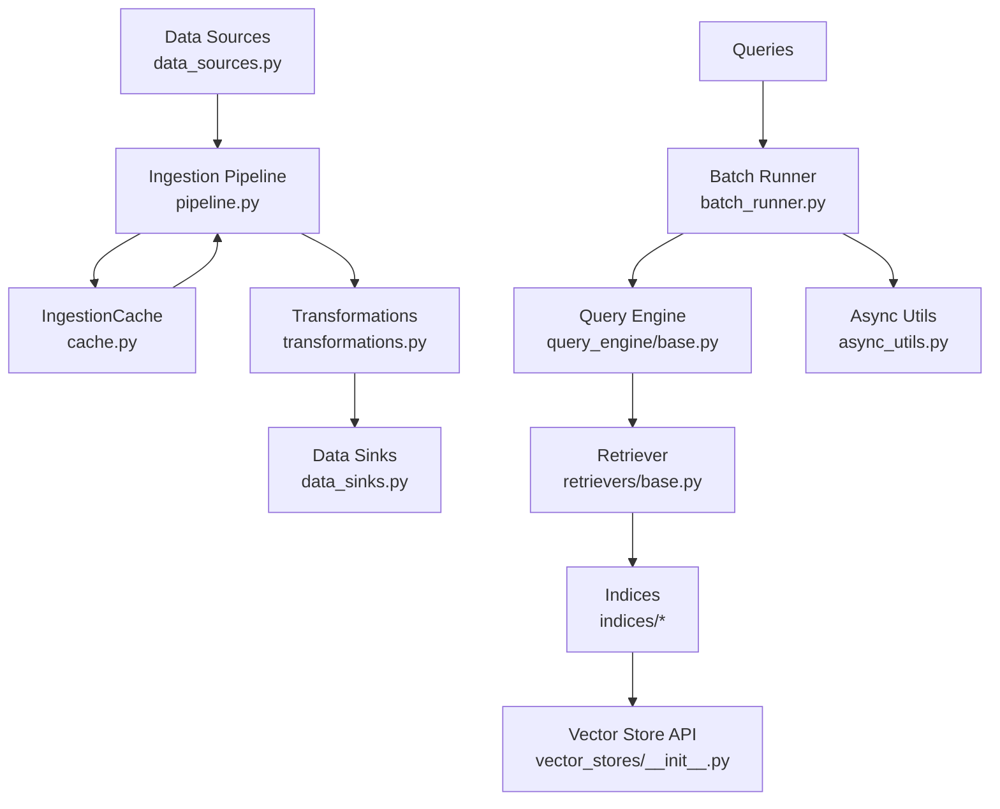
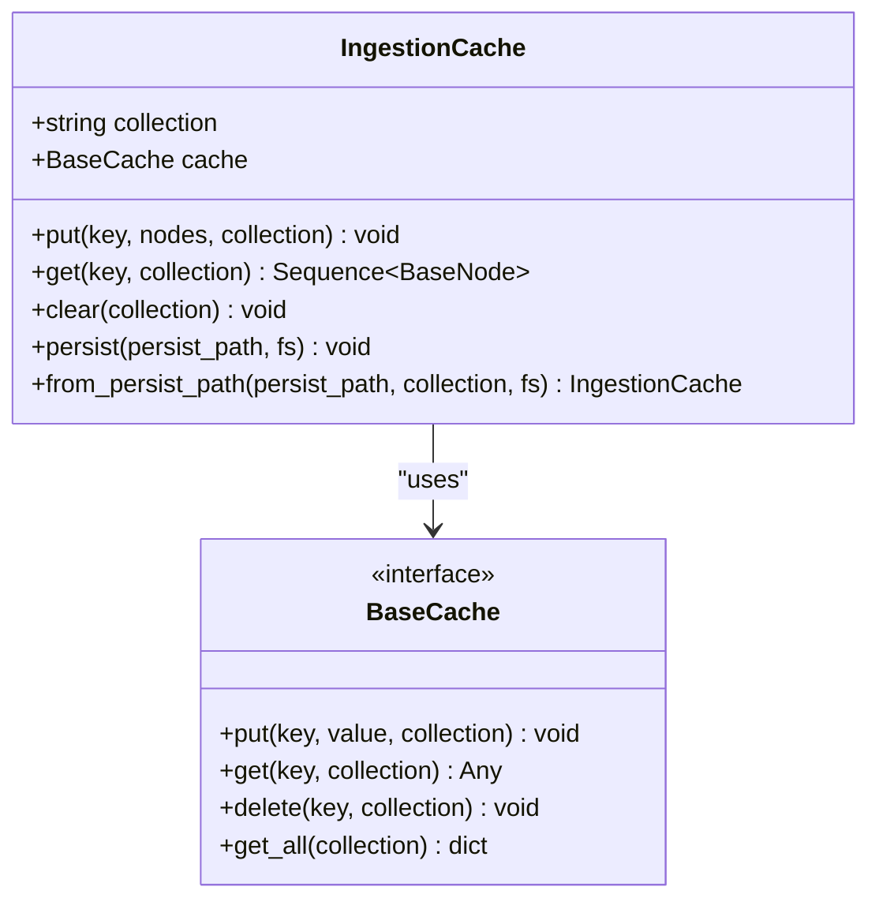
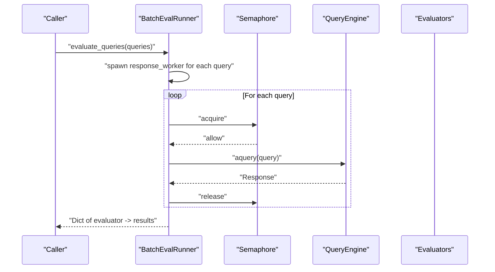
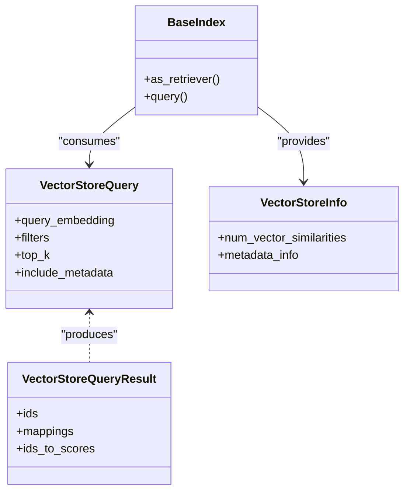
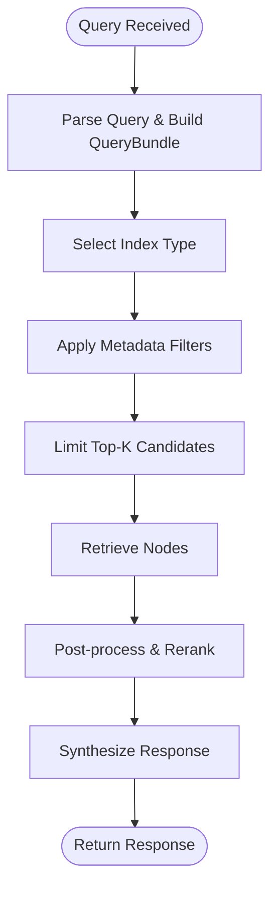
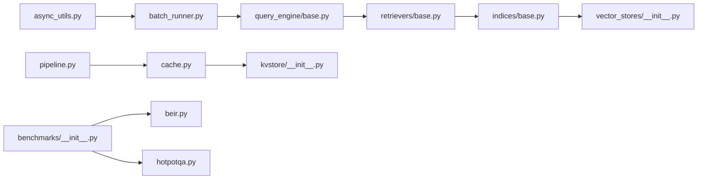

# Performance Optimization

<cite>
**Referenced Files in This Document**
- [batch_runner.py](file://llama-index-core/llama_index/core/evaluation/batch_runner.py)
- [cache.py](file://llama-index-core/llama_index/core/ingestion/cache.py)
- [async_utils.py](file://llama-index-core/llama_index/core/async_utils.py)
- [vector_stores/__init__.py](file://llama-index-core/llama_index/core/vector_stores/__init__.py)
- [kvstore/__init__.py](file://llama-index-core/llama_index/core/storage/kvstore/__init__.py)
- [benchmarks/__init__.py](file://llama-index-core/llama_index/core/evaluation/benchmarks/__init__.py)
- [beir.py](file://llama-index-core/llama_index/core/evaluation/benchmarks/beir.py)
- [hotpotqa.py](file://llama-index-core/llama_index/core/evaluation/benchmarks/hotpotqa.py)
- [service_context.py](file://llama-index-core/llama_index/core/service_context.py)
- [settings.py](file://llama-index-core/llama_index/core/settings.py)
- [constants.py](file://llama-index-core/llama_index/core/constants.py)
- [pipeline.py](file://llama-index-core/llama_index/core/ingestion/pipeline.py)
- [data_sinks.py](file://llama-index-core/llama_index/core/ingestion/data_sinks.py)
- [data_sources.py](file://llama-index-core/llama_index/core/ingestion/data_sources.py)
- [transformations.py](file://llama-index-core/llama_index/core/ingestion/transformations.py)
- [retrievers/base.py](file://llama-index-core/llama_index/core/retrievers/base.py)
- [query_engine/base.py](file://llama-index-core/llama_index/core/query_engine/base.py)
- [indices/vector_store/__init__.py](file://llama-index-core/llama_index/core/indices/vector_store/__init__.py)
- [indices/common/__init__.py](file://llama-index-core/llama_index/core/indices/common/__init__.py)
- [indices/tree/__init__.py](file://llama-index-core/llama_index/core/indices/tree/__init__.py)
- [indices/keyword_table/__init__.py](file://llama-index-core/llama_index/core/indices/keyword_table/__init__.py)
- [indices/list/__init__.py](file://llama-index-core/llama_index/core/indices/list/__init__.py)
- [indices/property_graph/__init__.py](file://llama-index-core/llama_index/core/indices/property_graph/__init__.py)
- [indices/composability/__init__.py](file://llama-index-core/llama_index/core/indices/composability/__init__.py)
- [indices/common_tree/__init__.py](file://llama-index-core/llama_index/core/indices/common_tree/__init__.py)
- [indices/multi_modal/__init__.py](file://llama-index-core/llama_index/core/indices/multi_modal/__init__.py)
- [indices/managed/__init__.py](file://llama-index-core/llama_index/core/indices/managed/__init__.py)
- [indices/empty/__init__.py](file://llama-index-core/llama_index/core/indices/empty/__init__.py)
- [indices/document_summary/__init__.py](file://llama-index-core/llama_index/core/indices/document_summary/__init__.py)
- [indices/knowledge_graph/__init__.py](file://llama-index-core/llama_index/core/indices/knowledge_graph/__init__.py)
- [indices/struct_store/__init__.py](file://llama-index-core/llama_index/core/indices/struct_store/__init__.py)
- [indices/loading.py](file://llama-index-core/llama_index/core/indices/loading.py)
- [indices/utils.py](file://llama-index-core/llama_index/core/indices/utils.py)
- [indices/postprocessor.py](file://llama-index-core/llama_index/core/indices/postprocessor.py)
- [indices/prompt_helper.py](file://llama-index-core/llama_index/core/indices/prompt_helper.py)
- [indices/registry.py](file://llama-index-core/llama_index/core/indices/registry.py)
- [indices/base.py](file://llama-index-core/llama_index/core/indices/base.py)
- [indices/base_retriever.py](file://llama-index-core/llama_index/core/indices/base_retriever.py)
- [indices/query/__init__.py](file://llama-index-core/llama_index/core/indices/query/__init__.py)
- [indices/query/base.py](file://llama-index-core/llama_index/core/indices/query/base.py)
- [indices/query/vector_query.py](file://llama-index-core/llama_index/core/indices/query/vector_query.py)
- [indices/query/keyword_query.py](file://llama-index-core/llama_index/core/indices/query/keyword_query.py)
- [indices/query/text_query.py](file://llama-index-core/llama_index/core/indices/query/text_query.py)
- [indices/query/compose.py](file://llama-index-core/llama_index/core/indices/query/compose.py)
- [indices/query/multi_modal.py](file://llama-index-core/llama_index/core/indices/query/multi_modal.py)
- [indices/query/property_graph.py](file://llama-index-core/llama_index/core/indices/query/property_graph.py)
- [indices/query/graph_query.py](file://llama-index-core/llama_index/core/indices/query/graph_query.py)
- [indices/query/summary_query.py](file://llama-index-core/llama_index/core/indices/query/summary_query.py)
- [indices/query/kg_query.py](file://llama-index-core/llama_index/core/indices/query/kg_query.py)
- [indices/query/struct_query.py](file://llama-index-core/llama_index/core/indices/query/struct_query.py)
- [indices/query/empty_query.py](file://llama-index-core/llama_index/core/indices/query/empty_query.py)
- [indices/query/multi_query.py](file://llama-index-core/llama_index/core/indices/query/multi_query.py)
- [indices/query/llm_query.py](file://llama-index-core/llama_index/core/indices/query/llm_query.py)
- [indices/query/fusion_query.py](file://llama-index-core/llama_index/core/indices/query/fusion_query.py)
- [indices/query/ensemble_query.py](file://llama-index-core/llama_index/core/indices/query/ensemble_query.py)
- [indices/query/weighted_query.py](file://llama-index-core/llama_index/core/indices/query/weighted_query.py)
- [indices/query/override_query.py](file://llama-index-core/llama_index/core/indices/query/override_query.py)
- [indices/query/override_query.py](file://llama-index-core/llama_index/core/indices/query/override_query.py)
- [indices/query/override_query.py](file://llama-index-core/llama_index/core/indices/query/override_query.py)
- [indices/query/override_query.py](file://llama-index-core/llama_index/core/indices/query/override_query.py)
- [indices/query/override_query.py](file://llama-index-core/llama_index/core/indices/query/override_query.py)
- [indices/query/override_query.py](file://llama-index-core/llama_index/core/indices/query/override_query.py)
- [indices/query/override_query.py](file://llama-index-core/llama_index/core/indices/query/override_query.py)
- [indices/query/override_query.py](file://llama-index-core/llama_index/core/indices/query/override_query.py)
- [indices/query/override_query.py](file://llama-index-core/llama_index/core/indices/query/override_query.py)
- [indices/query/override_query.py](file://llama-index-core/llama_index/core/indices/query/override_query.py)
- [indices/query/override_query.py](file://llama-index-core/llama_index/core/indices/query/override_query.py)
- [indices/query/override_query.py](file://llama-index-core/llama_index/core/indices/query/override_query.py)
- [indices/query/override_query.py](file://llama-index-core/llama_index/core/indices/query/override_query.py)
- [indices/query/override_query.py](file://llama-index-core/llama_index/core/indices/query/override_query.py)
- [indices/query/override_query.py](file://llama-index-core/llama_index/core/indices/query/override_query.py)
- [indices/query/override_query.py](file://llama-index-core/llama_index/core/indices/query/override_query.py)
- [indices/query/override_query.py](file://llama-index-core/llama_index/core/indices/query/override_query.py)
- [indices/query/override_query.py](file://llama-index-core/llama_index/core/indices/query/override_query.py)
- [indices/query/override_query.py......](file://llama-index-core/llama_index/core/indices/query/override_query.py)
</cite>

## Table of Contents
1. [Introduction](#introduction)
2. [Project Structure](#project-structure)
3. [Core Components](#core-components)
4. [Architecture Overview](#architecture-overview)
5. [Detailed Component Analysis](#detailed-component-analysis)
6. [Dependency Analysis](#dependency-analysis)
7. [Performance Considerations](#performance-considerations)
8. [Troubleshooting Guide](#troubleshooting-guide)
9. [Conclusion](#conclusion)
10. [Appendices](#appendices)

## Introduction
This document presents a comprehensive guide to performance optimization strategies for LlamaIndex production systems. It focuses on query optimization, caching, memory management, vector database tuning, index optimization, batch processing patterns, latency reduction, concurrent request handling, resource utilization, benchmarking, A/B testing methodologies, capacity planning, cost optimization, autoscaling, and infrastructure efficiency. The guidance is grounded in the repository’s core modules and examples, with diagrams and references mapped to actual source files.

## Project Structure
LlamaIndex organizes performance-critical capabilities across several domains:
- Ingestion and caching for memory efficiency during data preparation
- Async utilities and batch runners for concurrency and throughput
- Vector stores and indices for retrieval performance
- Benchmarks and evaluation utilities for performance measurement
- Service context and settings for global configuration and defaults

**Diagram sources**
- [cache.py](file://llama-index-core/llama_index/core/ingestion/cache.py#L17-L79)
- [kvstore/__init__.py](file://llama-index-core/llama_index/core/storage/kvstore/__init__.py#L1-L4)
- [async_utils.py](file://llama-index-core/llama_index/core/async_utils.py#L1-L175)
- [batch_runner.py](file://llama-index-core/llama_index/core/evaluation/batch_runner.py#L75-L444)
- [vector_stores/__init__.py](file://llama-index-core/llama_index/core/vector_stores/__init__.py#L1-L28)
- [benchmarks/__init__.py](file://llama-index-core/llama_index/core/evaluation/benchmarks/__init__.py#L1-L5)
- [beir.py](file://llama-index-core/llama_index/core/evaluation/benchmarks/beir.py)
- [hotpotqa.py](file://llama-index-core/llama_index/core/evaluation/benchmarks/hotpotqa.py)

**Section sources**
- [cache.py](file://llama-index-core/llama_index/core/ingestion/cache.py#L17-L79)
- [async_utils.py](file://llama-index-core/llama_index/core/async_utils.py#L1-L175)
- [batch_runner.py](file://llama-index-core/llama_index/core/evaluation/batch_runner.py#L75-L444)
- [vector_stores/__init__.py](file://llama-index-core/llama_index/core/vector_stores/__init__.py#L1-L28)
- [benchmarks/__init__.py](file://llama-index-core/llama_index/core/evaluation/benchmarks/__init__.py#L1-L5)

## Core Components
- IngestionCache: Provides a simple, persistent cache for parsed nodes to reduce repeated parsing and embedding work.
- Async utilities: Offer async orchestration, batching, and worker pools to maximize throughput and minimize latency.
- BatchEvalRunner: Enables parallelized evaluation of queries and responses with retries and concurrency limits.
- Vector stores and indices: Define retrieval interfaces and index types optimized for different workloads.
- Benchmarks: Provide standardized evaluation suites for measuring retrieval quality and speed.

Key performance levers:
- Concurrency via semaphores and worker pools
- Batching to amortize overhead
- Caching intermediate artifacts
- Tuning index and vector store parameters

**Section sources**
- [cache.py](file://llama-index-core/llama_index/core/ingestion/cache.py#L17-L79)
- [async_utils.py](file://llama-index-core/llama_index/core/async_utils.py#L137-L175)
- [batch_runner.py](file://llama-index-core/llama_index/core/evaluation/batch_runner.py#L75-L444)
- [vector_stores/__init__.py](file://llama-index-core/llama_index/core/vector_stores/__init__.py#L1-L28)

## Architecture Overview
The production architecture centers on ingestion caching, asynchronous execution, and efficient retrieval via indices and vector stores. Benchmarks and evaluation utilities support continuous performance monitoring and A/B testing.

**Diagram sources**
- [pipeline.py](file://llama-index-core/llama_index/core/ingestion/pipeline.py)
- [cache.py](file://llama-index-core/llama_index/core/ingestion/cache.py#L17-L79)
- [data_sinks.py](file://llama-index-core/llama_index/core/ingestion/data_sinks.py)
- [data_sources.py](file://llama-index-core/llama_index/core/ingestion/data_sources.py)
- [transformations.py](file://llama-index-core/llama_index/core/ingestion/transformations.py)
- [batch_runner.py](file://llama-index-core/llama_index/core/evaluation/batch_runner.py#L75-L444)
- [query_engine/base.py](file://llama-index-core/llama_index/core/query_engine/base.py)
- [retrievers/base.py](file://llama-index-core/llama_index/core/retrievers/base.py)
- [indices/base.py](file://llama-index-core/llama_index/core/indices/base.py)
- [vector_stores/__init__.py](file://llama-index-core/llama_index/core/vector_stores/__init__.py#L1-L28)
- [async_utils.py](file://llama-index-core/llama_index/core/async_utils.py#L1-L175)

## Detailed Component Analysis

### Ingestion Caching Strategy
IngestionCache persists parsed nodes to avoid recomputation during repeated ingestion runs. It integrates with a pluggable KV store backend and supports persistence to disk for durability.

**Diagram sources**
- [cache.py](file://llama-index-core/llama_index/core/ingestion/cache.py#L17-L79)
- [kvstore/__init__.py](file://llama-index-core/llama_index/core/storage/kvstore/__init__.py#L1-L4)

Best practices:
- Use a dedicated collection per dataset or environment
- Persist cache to local SSD/NVMe for fast reads
- Periodically clear stale caches after re-ingestion cycles
- Monitor cache hit ratio to size cache appropriately

**Section sources**
- [cache.py](file://llama-index-core/llama_index/core/ingestion/cache.py#L17-L79)
- [kvstore/__init__.py](file://llama-index-core/llama_index/core/storage/kvstore/__init__.py#L1-L4)

### Concurrent Request Handling and Batch Processing
Async utilities provide robust mechanisms to run many tasks concurrently with bounded workers and optional progress reporting. BatchEvalRunner orchestrates parallel evaluation with retries and concurrency control.

**Diagram sources**
- [batch_runner.py](file://llama-index-core/llama_index/core/evaluation/batch_runner.py#L65-L73)
- [batch_runner.py](file://llama-index-core/llama_index/core/evaluation/batch_runner.py#L319-L348)
- [async_utils.py](file://llama-index-core/llama_index/core/async_utils.py#L137-L175)

Guidelines:
- Tune workers based on CPU-bound vs I/O-bound stages
- Apply exponential backoff for transient failures
- Use progress bars in interactive environments
- Prefer batching for small, frequent requests

**Section sources**
- [batch_runner.py](file://llama-index-core/llama_index/core/evaluation/batch_runner.py#L75-L444)
- [async_utils.py](file://llama-index-core/llama_index/core/async_utils.py#L137-L175)

### Vector Database and Index Optimization
Vector store interfaces define query abstractions and filters. Indices encapsulate different retrieval strategies (tree, keyword table, list, vector store-backed, etc.), enabling selection based on scale and query patterns.

**Diagram sources**
- [vector_stores/__init__.py](file://llama-index-core/llama_index/core/vector_stores/__init__.py#L1-L28)
- [indices/base.py](file://llama-index-core/llama_index/core/indices/base.py)

Recommendations:
- Choose indices aligned with query distribution (dense vectors vs keywords vs hybrid)
- Configure top_k and filters to limit candidate sets early
- Enable metadata filtering to reduce post-processing costs
- Monitor vector dimensionality and similarity metrics impact

**Section sources**
- [vector_stores/__init__.py](file://llama-index-core/llama_index/core/vector_stores/__init__.py#L1-L28)
- [indices/base.py](file://llama-index-core/llama_index/core/indices/base.py)

### Query Optimization Patterns
Common optimization patterns include:
- Early pruning via metadata filters and top_k
- Fusion and ensemble strategies to combine multiple retrievers
- Prompt helper and chunking strategies to manage context sizes
- Multi-modal and property graph indices for specialized workloads

[No sources needed since this diagram shows conceptual workflow, not actual code structure]

### Memory Management Best Practices
- Reuse embeddings and nodes across queries when safe
- Clear caches after major updates
- Use streaming or chunked processing for large documents
- Monitor memory growth in long-running services and restart as needed

[No sources needed since this section provides general guidance]

## Dependency Analysis
The following diagram highlights key dependencies among performance-critical modules.

**Diagram sources**
- [async_utils.py](file://llama-index-core/llama_index/core/async_utils.py#L1-L175)
- [batch_runner.py](file://llama-index-core/llama_index/core/evaluation/batch_runner.py#L75-L444)
- [query_engine/base.py](file://llama-index-core/llama_index/core/query_engine/base.py)
- [retrievers/base.py](file://llama-index-core/llama_index/core/retrievers/base.py)
- [indices/base.py](file://llama-index-core/llama_index/core/indices/base.py)
- [vector_stores/__init__.py](file://llama-index-core/llama_index/core/vector_stores/__init__.py#L1-L28)
- [pipeline.py](file://llama-index-core/llama_index/core/ingestion/pipeline.py)
- [cache.py](file://llama-index-core/llama_index/core/ingestion/cache.py#L17-L79)
- [kvstore/__init__.py](file://llama-index-core/llama_index/core/storage/kvstore/__init__.py#L1-L4)
- [benchmarks/__init__.py](file://llama-index-core/llama_index/core/evaluation/benchmarks/__init__.py#L1-L5)
- [beir.py](file://llama-index-core/llama_index/core/evaluation/benchmarks/beir.py)
- [hotpotqa.py](file://llama-index-core/llama_index/core/evaluation/benchmarks/hotpotqa.py)

**Section sources**
- [async_utils.py](file://llama-index-core/llama_index/core/async_utils.py#L1-L175)
- [batch_runner.py](file://llama-index-core/llama_index/core/evaluation/batch_runner.py#L75-L444)
- [cache.py](file://llama-index-core/llama_index/core/ingestion/cache.py#L17-L79)
- [vector_stores/__init__.py](file://llama-index-core/llama_index/core/vector_stores/__init__.py#L1-L28)
- [benchmarks/__init__.py](file://llama-index-core/llama_index/core/evaluation/benchmarks/__init__.py#L1-L5)

## Performance Considerations
- Latency reduction
  - Use async batching and worker pools to overlap I/O
  - Minimize embedding calls via caching and reuse
  - Apply early filtering and top_k to reduce downstream work
- Throughput scaling
  - Tune workers per stage (embedding, indexing, querying)
  - Use progress-aware async gather for observability
- Resource utilization
  - Monitor CPU, memory, and I/O during peak loads
  - Adjust batch sizes and concurrency dynamically
- Cost optimization
  - Prefer smaller, faster indices for cold data
  - Use caching to reduce repeated compute
  - Right-size vector dimensions and filters

[No sources needed since this section provides general guidance]

## Troubleshooting Guide
- Nested async errors
  - Symptom: Runtime error indicating nested async loops
  - Resolution: Use async entry points or apply nest_asyncio in notebooks; prefer aquery/aretrieve/chat patterns
- Excessive latency
  - Investigate missing filters/top_k, lack of caching, or insufficient workers
  - Validate vector store configuration and index type fit
- High memory usage
  - Clear caches after re-ingestion; avoid retaining large intermediate objects
  - Stream or chunk processing for large documents

**Section sources**
- [async_utils.py](file://llama-index-core/llama_index/core/async_utils.py#L25-L66)

## Conclusion
Production-grade performance in LlamaIndex hinges on combining ingestion caching, asynchronous orchestration, targeted index and vector store selection, and rigorous benchmarking. By tuning concurrency, batching, and resource allocation, teams can achieve low-latency, high-throughput RAG systems while controlling costs and maintaining reliability.

[No sources needed since this section summarizes without analyzing specific files]

## Appendices

### Performance Benchmarking and A/B Testing Methodologies
- Use BatchEvalRunner to evaluate multiple query engines or retrievers consistently
- Implement A/B tests by routing subsets of traffic to different configurations
- Track latency, recall, and cost per query; upload results for centralized analysis

**Section sources**
- [batch_runner.py](file://llama-index-core/llama_index/core/evaluation/batch_runner.py#L75-L444)
- [benchmarks/__init__.py](file://llama-index-core/llama_index/core/evaluation/benchmarks/__init__.py#L1-L5)
- [beir.py](file://llama-index-core/llama_index/core/evaluation/benchmarks/beir.py)
- [hotpotqa.py](file://llama-index-core/llama_index/core/evaluation/benchmarks/hotpotqa.py)

### Capacity Planning and Autoscaling
- Establish baseline latency under steady-state load
- Simulate spikes and measure saturation points for CPU, memory, and I/O
- Scale horizontally by increasing replicas; scale vertically for heavy compute phases
- Use metrics-driven autoscaling policies for dynamic workloads

[No sources needed since this section provides general guidance]

### Infrastructure Efficiency Measures
- Persist caches on fast local storage
- Use SSD-backed vector stores for retrieval-heavy workloads
- Segment hot/cold data; tier accordingly
- Monitor and alert on tail latency increases

[No sources needed since this section provides general guidance]