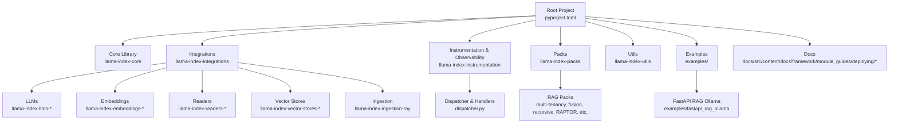
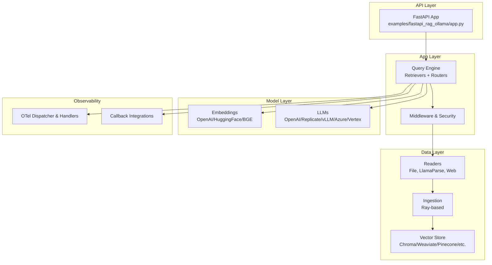
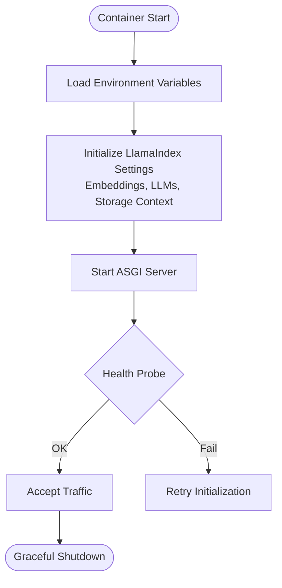
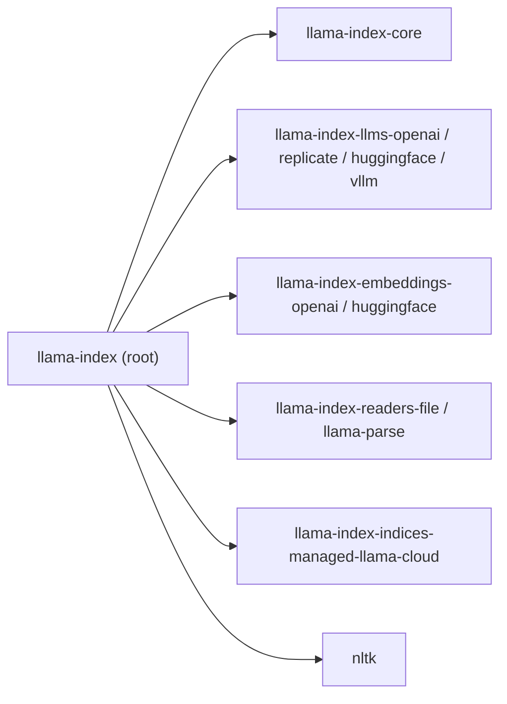
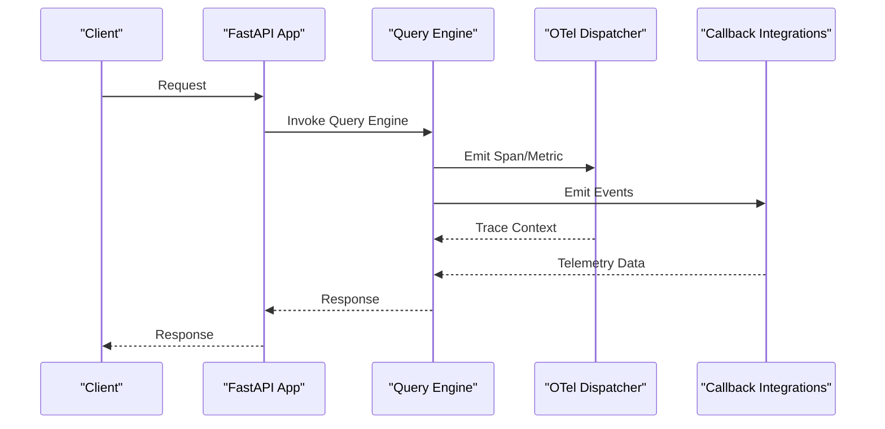
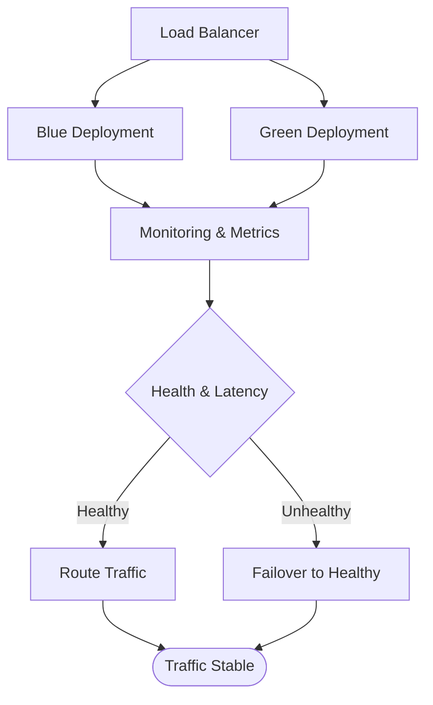

# Production Deployment

<cite>
**Referenced Files in This Document**
- [README.md](file://README.md)
- [pyproject.toml](file://pyproject.toml)
- [docker-compose.yml](file://llama-index-core/tests/docker-compose.yml)
- [mkdocs.yml](file://docs/api_reference/mkdocs.yml)
- [_meta.yml (Deploying)](file://docs/src/content/docs/framework/module_guides/deploying/_meta.yml)
- [_meta.yml (Agents)](file://docs/src/content/docs/framework/module_guides/deploying/agents/_meta.yml)
- [_meta.yml (Chat Engines)](file://docs/src/content/docs/framework/module_guides/deploying/chat_engines/_meta.yml)
- [_meta.yml (Query Engine)](file://docs/src/content/docs/framework/module_guides/deploying/query_engine/_meta.yml)
- [_meta.yml (Llama Deploy)](file://docs/src/content/docs/framework/module_guides/llama_deploy/_meta.yml)
- [app.py](file://examples/fastapi_rag_ollama/app.py)
- [requirements.txt](file://examples/fastapi_rag_ollama/requirements.txt)
- [README.md (fastapi_rag_ollama)](file://examples/fastapi_rag_ollama/README.md)
- [README.md (llama-index-observability-otel)](file://llama-index-integrations/observability/llama-index-observability-otel/README.md)
- [dispatcher.py](file://llama-index-instrumentation/src/llama_index_instrumentation/dispatcher.py)
- [event_handlers](file://llama-index-instrumentation/src/llama_index_instrumentation/event_handlers)
- [span_handlers](file://llama-index-instrumentation/src/llama_index_instrumentation/span_handlers)
- [callbacks](file://llama-index-integrations/callbacks)
- [llama-index-observability-otel](file://llama-index-integrations/observability/llama-index-observability-otel)
- [llama-index-llms-vllm](file://llama-index-integrations/llms/llama-index-llms-vllm)
- [llama-index-embeddings-openai](file://llama-index-integrations/embeddings/llama-index-embeddings-openai)
- [llama-index-indices-managed-llama-cloud](file://llama-index-integrations/indices/llama-index-indices-managed-llama-cloud)
- [llama-index-readers-file](file://llama-index-integrations/readers/llama-index-readers-file)
- [llama-index-readers-llama-parse](file://llama-index-integrations/readers/llama-index-readers-llama-parse)
- [llama-index-llms-openai](file://llama-index-integrations/llms/llama-index-llms-openai)
- [llama-index-llms-replicate](file://llama-index-integrations/llms/llama-index-llms-replicate)
- [llama-index-llms-vllm](file://llama-index-integrations/llms/llama-index-llms-vllm)
- [llama-index-llms-huggingface](file://llama-index-integrations/llms/llama-index-llms-huggingface)
- [llama-index-embeddings-huggingface](file://llama-index-integrations/embeddings/llama-index-embeddings-huggingface)
- [llama-index-embeddings-bge-small-en-v1.5](file://llama-index-integrations/embeddings/llama-index-embeddings-huggingface)
- [llama-index-vector-stores-mariadb](file://llama-index-integrations/vector_stores/llama-index-vector-stores-mariadb)
- [llama-index-ingestion-ray](file://llama-index-integrations/ingestion/llama-index-ingestion-ray)
- [llama-index-packs-agent-search-retriever](file://llama-index-packs/llama-index-packs-agent-search-retriever)
- [llama-index-packs-raptor](file://llama-index-packs/llama-index-packs-raptor)
- [llama-index-packs-recursive-retriever](file://llama-index-packs/llama-index-packs-recursive-retriever)
- [llama-index-packs-fusion-retriever](file://llama-index-packs/llama-index-packs-fusion-retriever)
- [llama-index-packs-multi-tenancy-rag](file://llama-index-packs/llama-index-packs-multi-tenancy-rag)
- [llama-index-packs-voyage-query-engine](file://llama-index-packs/llama-index-packs-voyage-query-engine)
- [llama-index-packs-snowflake-query-engine](file://llama-index-packs/llama-index-packs-snowflake-query-engine)
- [llama-index-packs-llama-guard-moderator](file://llama-index-packs/llama-index-packs-llama-guard-moderator)
- [llama-index-packs-zenguard](file://llama-index-packs/llama-index-packs-zenguard)
- [llama-index-utils-azure](file://llama-index-utils/llama-index-utils-azure)
- [llama-index-utils-huggingface](file://llama-index-utils/llama-index-utils-huggingface)
- [llama-index-utils-qianfan](file://llama-index-utils/llama-index-utils-qianfan)
- [llama-index-utils-oracleai](file://llama-index-utils/llama-index-utils-oracleai)
</cite>

## Table of Contents
1. [Introduction](#introduction)
2. [Project Structure](#project-structure)
3. [Core Components](#core-components)
4. [Architecture Overview](#architecture-overview)
5. [Detailed Component Analysis](#detailed-component-analysis)
6. [Dependency Analysis](#dependency-analysis)
7. [Performance Considerations](#performance-considerations)
8. [Observability and Monitoring](#observability-and-monitoring)
9. [Security and Access Control](#security-and-access-control)
10. [Scalability, Load Balancing, and Auto-Scaling](#scalability-load-balancing-and-auto-scaling)
11. [CI/CD Pipelines and Release Strategies](#cicd-pipelines-and-release-strategies)
12. [Disaster Recovery](#disaster-recovery)
13. [Troubleshooting Guide](#troubleshooting-guide)
14. [Conclusion](#conclusion)

## Introduction
This document provides a comprehensive guide to deploying LlamaIndex applications in production. It covers containerization, cloud deployment patterns, infrastructure provisioning, observability and monitoring, auto-scaling and load balancing, security and access control, performance benchmarking and capacity planning, cost optimization, CI/CD pipelines, blue-green deployments, and disaster recovery strategies. The guidance is grounded in the repository’s documentation, example applications, and integration modules that enable scalable, observable, and secure RAG and LLM-powered systems.

## Project Structure
The repository is a monorepo containing:
- Core library and integrations for LLMs, embeddings, readers, vector stores, retrievers, and query engines
- Instrumentation and observability integrations
- Example applications (e.g., FastAPI RAG with Ollama)
- Documentation modules focused on deployment topics

**Diagram sources**
- [pyproject.toml](file://pyproject.toml#L34-L73)
- [docker-compose.yml](file://llama-index-core/tests/docker-compose.yml)
- [_meta.yml (Deploying)](file://docs/src/content/docs/framework/module_guides/deploying/_meta.yml#L1-L3)
- [README.md (fastapi_rag_ollama)](file://examples/fastapi_rag_ollama/README.md)

**Section sources**
- [README.md](file://README.md#L11-L35)
- [pyproject.toml](file://pyproject.toml#L34-L73)
- [_meta.yml (Deploying)](file://docs/src/content/docs/framework/module_guides/deploying/_meta.yml#L1-L3)

## Core Components
Key production-ready components for deployment:
- LLMs: OpenAI, Replicate, HuggingFace, vLLM, Azure OpenAI, Vertex AI, Bedrock, and others via integration packages
- Embeddings: OpenAI, HuggingFace, BGE, and adapters
- Readers: File, LlamaParse, S3, Web, and many others
- Vector Stores: Chroma, Weaviate, Pinecone, LanceDB, Milvus, Qdrant, and managed solutions
- Ingestion: Ray-based ingestion for distributed processing
- Query Engines and Retrievers: Fusion, Recursive, RAPTOR, Multi-tenancy packs
- Observability: OTel instrumentation and callback integrations
- Utilities: Cloud-specific helpers (Azure, Oracle AI, Qianfan, HuggingFace)

Practical example references:
- FastAPI RAG with Ollama: [app.py](file://examples/fastapi_rag_ollama/app.py), [requirements.txt](file://examples/fastapi_rag_ollama/requirements.txt), [README.md](file://examples/fastapi_rag_ollama/README.md)
- Integrations for LLMs, embeddings, readers, vector stores, ingestion, and packs are available under llama-index-integrations and llama-index-packs

**Section sources**
- [README.md (fastapi_rag_ollama)](file://examples/fastapi_rag_ollama/README.md)
- [app.py](file://examples/fastapi_rag_ollama/app.py)
- [requirements.txt](file://examples/fastapi_rag_ollama/requirements.txt)

## Architecture Overview
A production-grade LlamaIndex deployment typically follows a layered architecture:
- Frontend/API Layer: FastAPI/ASGI application serving queries
- Application Layer: Query engine orchestration, retriever composition, and middleware
- Data Layer: Readers and ingestion pipeline feeding vector stores
- Model Layer: LLM and Embedding providers (local or managed)
- Observability Layer: OTel instrumentation and callback integrations

**Diagram sources**
- [app.py](file://examples/fastapi_rag_ollama/app.py)
- [dispatcher.py](file://llama-index-instrumentation/src/llama_index_instrumentation/dispatcher.py)
- [llama-index-llms-vllm](file://llama-index-integrations/llms/llama-index-llms-vllm)
- [llama-index-embeddings-openai](file://llama-index-integrations/embeddings/llama-index-embeddings-openai)
- [llama-index-readers-file](file://llama-index-integrations/readers/llama-index-readers-file)
- [llama-index-ingestion-ray](file://llama-index-integrations/ingestion/llama-index-ingestion-ray)

## Detailed Component Analysis

### Containerization Strategy
- Base image: Python slim image aligned with the project’s Python requirement
- Entrypoint: ASGI server (uvicorn or similar) pointing to the FastAPI app
- Environment variables: OPENAI_API_KEY, REPLICATE_API_TOKEN, etc., depending on selected integrations
- Health checks: Liveness/readiness probes hitting a lightweight endpoint
- Persistent storage: Mount a volume for the storage directory used by LlamaIndex persistence
- Sidecars: Optional for local LLMs (e.g., Ollama) or external services

**Section sources**
- [README.md (fastapi_rag_ollama)](file://examples/fastapi_rag_ollama/README.md)
- [app.py](file://examples/fastapi_rag_ollama/app.py)
- [requirements.txt](file://examples/fastapi_rag_ollama/requirements.txt)

### Cloud Deployment Patterns
- Kubernetes: Deploy stateless query pods behind a Service/Ingress; mount persistent volumes for storage
- Platform-as-a-Service: Use managed platforms with container support; configure secrets for API keys
- Serverless: Prefer stateless invocations for query engines; offload heavy ingestion to batch jobs or batch compute
- Hybrid: Local LLMs for sensitive data; managed LLMs for broader knowledge

[No sources needed since this section provides general guidance]

### Infrastructure Provisioning
- Networking: Private subnets, NAT gateways, and VPC endpoints for managed services
- Secrets Management: Store API keys and credentials in a secret manager
- Storage: EBS/GP3 volumes for persistence; consider object storage for logs and artifacts
- IAM/Service Accounts: Least privilege policies for read/write access to vector stores and readers

[No sources needed since this section provides general guidance]

### Distributed Processing Patterns
- Ingestion: Use Ray-based ingestion for parallel processing of large datasets
- Retrieval: Compose multiple retrievers (fusion, recursive) for robustness
- Query Engines: Pack-based engines for specialized workflows (multi-tenancy, moderation, etc.)

**Section sources**
- [llama-index-ingestion-ray](file://llama-index-integrations/ingestion/llama-index-ingestion-ray)
- [llama-index-packs-fusion-retriever](file://llama-index-packs/llama-index-packs-fusion-retriever)
- [llama-index-packs-recursive-retriever](file://llama-index-packs/llama-index-packs-recursive-retriever)
- [llama-index-packs-multi-tenancy-rag](file://llama-index-packs/llama-index-packs-multi-tenancy-rag)

## Dependency Analysis
The root project depends on core and a curated set of integrations. These dependencies define the production stack and inform containerization and deployment choices.

**Diagram sources**
- [pyproject.toml](file://pyproject.toml#L41-L50)

**Section sources**
- [pyproject.toml](file://pyproject.toml#L41-L50)

## Performance Considerations
- Token budgeting: Configure tokenizer and max tokens per provider
- Embedding model selection: Trade-off quality vs. latency and cost
- Retrieval tuning: Adjust top_k, similarity thresholds, and reranking
- Caching: Cache embeddings and query results where appropriate
- Batch ingestion: Use Ray-based ingestion for throughput
- GPU acceleration: Prefer providers with GPU support when available

[No sources needed since this section provides general guidance]

## Observability and Monitoring
- OTel Instrumentation: Use the dispatcher and span/event handlers to capture traces and metrics
- Callback Integrations: Integrate with Langfuse, Arize Phoenix, OpenInference, Aim, WandB, AgentOps, and others
- Dashboards: Visualize latency, error rates, token usage, and throughput
- Alerts: Threshold-based alerts for latency p95, error rate, and cost anomalies

**Diagram sources**
- [dispatcher.py](file://llama-index-instrumentation/src/llama_index_instrumentation/dispatcher.py)
- [README.md (llama-index-observability-otel)](file://llama-index-integrations/observability/llama-index-observability-otel/README.md)
- [event_handlers](file://llama-index-instrumentation/src/llama_index_instrumentation/event_handlers)
- [span_handlers](file://llama-index-instrumentation/src/llama_index_instrumentation/span_handlers)
- [callbacks](file://llama-index-integrations/callbacks)

**Section sources**
- [README.md (llama-index-observability-otel)](file://llama-index-integrations/observability/llama-index-observability-otel/README.md)
- [dispatcher.py](file://llama-index-instrumentation/src/llama_index_instrumentation/dispatcher.py)

## Security and Access Control
- Secrets: Store API keys in a secret manager; inject via environment variables
- Network: Restrict inbound/outbound traffic; use private subnets and VPC endpoints
- Encryption: Enable TLS termination at ingress; encrypt at rest for persistent storage
- Access Control: Role-based access to vector stores and readers; audit logs for sensitive operations
- Data Governance: Use moderation packs and guardrails to filter content

**Section sources**
- [llama-index-packs-llama-guard-moderator](file://llama-index-packs/llama-index-packs-llama-guard-moderator)
- [llama-index-packs-zenguard](file://llama-index-packs/llama-index-packs-zenguard)

## Scalability, Load Balancing, and Auto-Scaling
- Horizontal Pod Autoscaling: Scale on CPU/memory or custom metrics (QPS, latency)
- Load Balancing: Use platform LBs or ingress controllers; enable session affinity if needed
- Blue-Green: Shift traffic between two identical deployments; rollback on failure
- Retries and Circuit Breakers: Apply at the LLM and embedding provider boundaries
- Queue-Based Backends: Offload long-running ingestion to job queues

[No sources needed since this diagram shows conceptual workflow, not actual code structure]

## CI/CD Pipelines and Release Strategies
- Build: Use uv or pip with pyproject configuration to install dependencies
- Test: Run unit and integration tests; include health checks
- Package: Publish wheels and sdists; attach attestations where applicable
- Deploy: Blue-green or rolling updates; automated rollback on alert triggers
- Canary: Gradually shift traffic to new versions

**Section sources**
- [pyproject.toml](file://pyproject.toml#L1-L229)

## Disaster Recovery
- Backup: Regular snapshots of persistent volumes and vector store indices
- Restore: Automated restore procedures for storage and vector stores
- Multi-region: Replicate critical components across regions; failover DNS or LB
- Audit: Maintain logs for compliance and incident response

[No sources needed since this section provides general guidance]

## Troubleshooting Guide
- Health Checks: Verify readiness/liveness endpoints and storage persistence
- Logs: Centralize logs; correlate OTel traces with application logs
- Provider Limits: Monitor quotas and adjust batching/token budgets
- Ingestion Failures: Validate reader configuration and retry policies

**Section sources**
- [docker-compose.yml](file://llama-index-core/tests/docker-compose.yml)

## Conclusion
This guide consolidates production deployment practices for LlamaIndex systems using the repository’s documented components and integrations. By leveraging containerization, observability, security controls, and scalable infrastructure patterns, teams can operate reliable, efficient, and cost-effective RAG and LLM applications in production.