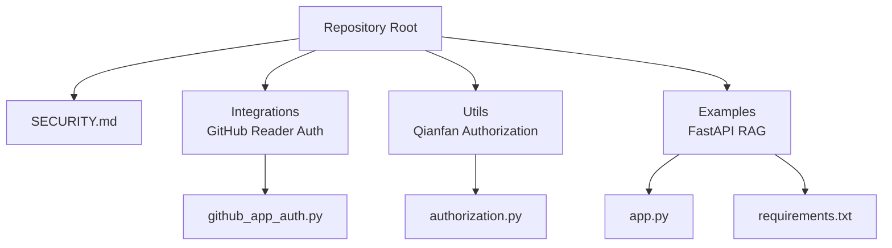
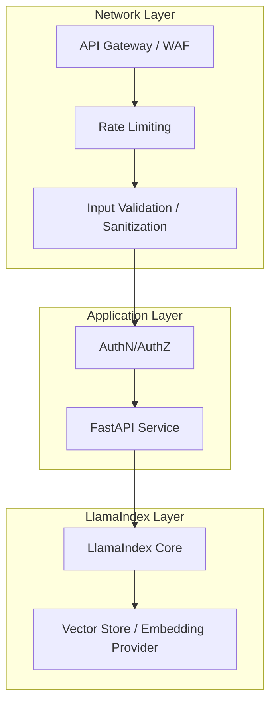
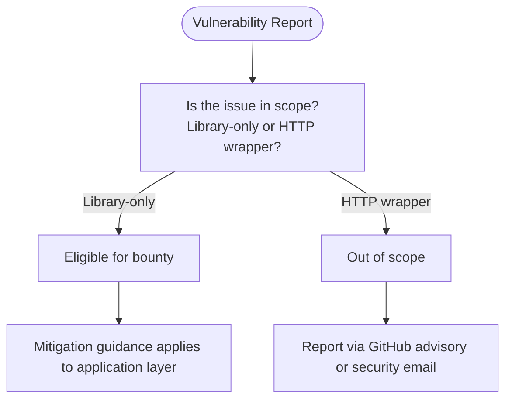
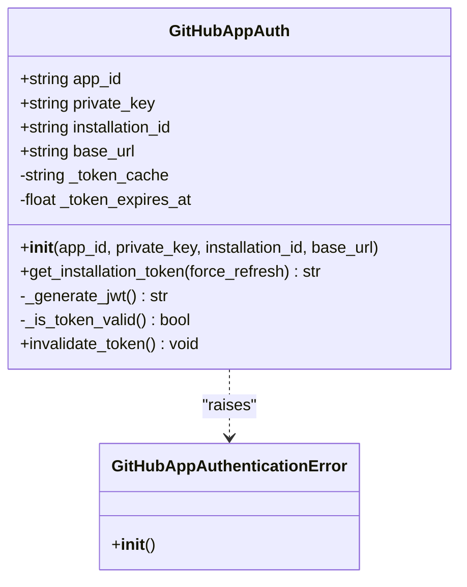
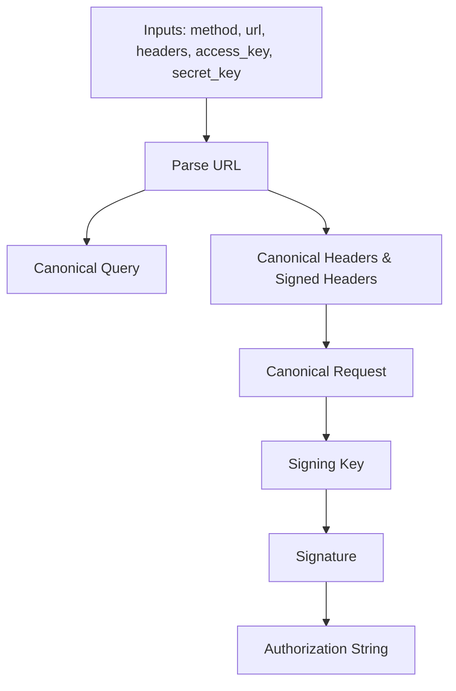
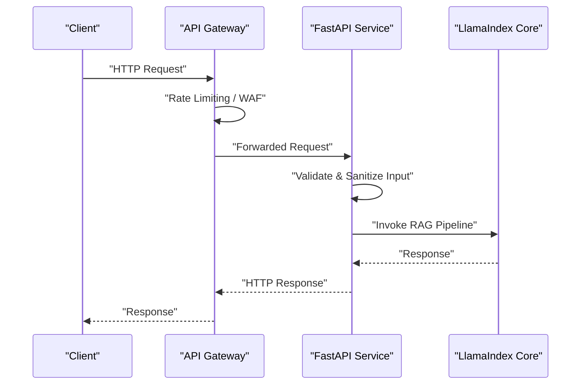
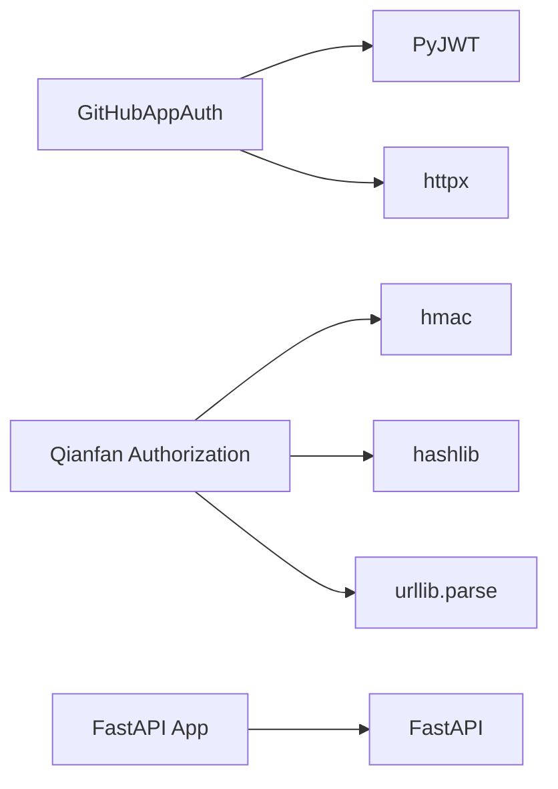

# Security and Compliance

<cite>
**Referenced Files in This Document**
- [SECURITY.md](file://SECURITY.md)
- [github_app_auth.py](file://llama-index-integrations/readers/llama-index-readers-github/llama_index/readers/github/github_app_auth.py)
- [authorization.py](file://llama-index-utils/llama-index-utils-qianfan/llama_index/utils/qianfan/authorization.py)
- [fastapi_rag_ollama/app.py](file://examples/fastapi_rag_ollama/app.py)
- [fastapi_rag_ollama/requirements.txt](file://examples/fastapi_rag_ollama/requirements.txt)
</cite>

## Table of Contents
1. [Introduction](#introduction)
2. [Project Structure](#project-structure)
3. [Core Components](#core-components)
4. [Architecture Overview](#architecture-overview)
5. [Detailed Component Analysis](#detailed-component-analysis)
6. [Dependency Analysis](#dependency-analysis)
7. [Performance Considerations](#performance-considerations)
8. [Troubleshooting Guide](#troubleshooting-guide)
9. [Conclusion](#conclusion)
10. [Appendices](#appendices)

## Introduction
This document consolidates security and compliance considerations for deploying LlamaIndex in production environments. It focuses on encryption at rest and in transit, secure credential management, access control, network security, audit logging, data lineage, and alignment with compliance frameworks such as GDPR, HIPAA, and SOC 2. It also provides practical guidance for secure API gateways, rate limiting, input validation, secrets management, environment variable handling, and secure deployment practices, grounded in the repository’s security policy and example integrations.

## Project Structure
Security-relevant materials in this repository include:
- A security policy and threat model that clarify in-scope and out-of-scope vulnerabilities and responsibilities for input validation, authentication, authorization, and rate limiting.
- Example integrations demonstrating secure credential handling for third-party APIs (GitHub App and Qianfan/Baidu BCE).
- A FastAPI RAG example that illustrates a production-ready HTTP service pattern suitable for applying API gateway protections and input validation.

**Diagram sources**
- [SECURITY.md](file://SECURITY.md#L1-L88)
- [github_app_auth.py](file://llama-index-integrations/readers/llama-index-readers-github/llama_index/readers/github/github_app_auth.py#L1-L218)
- [authorization.py](file://llama-index-utils/llama-index-utils-qianfan/llama_index/utils/qianfan/authorization.py#L1-L113)
- [fastapi_rag_ollama/app.py](file://examples/fastapi_rag_ollama/app.py)
- [fastapi_rag_ollama/requirements.txt](file://examples/fastapi_rag_ollama/requirements.txt)

**Section sources**
- [SECURITY.md](file://SECURITY.md#L1-L88)
- [github_app_auth.py](file://llama-index-integrations/readers/llama-index-readers-github/llama_index/readers/github/github_app_auth.py#L1-L218)
- [authorization.py](file://llama-index-utils/llama-index-utils-qianfan/llama_index/utils/qianfan/authorization.py#L1-L113)
- [fastapi_rag_ollama/app.py](file://examples/fastapi_rag_ollama/app.py)
- [fastapi_rag_ollama/requirements.txt](file://examples/fastapi_rag_ollama/requirements.txt)

## Core Components
- Security policy and threat model define the boundaries of the library’s security scope and responsibilities for input validation, authentication, authorization, and rate limiting.
- GitHub App authentication module provides secure token lifecycle management with caching and automatic refresh.
- Qianfan/BCE authorization utility demonstrates canonical request construction and HMAC signing for secure API calls.
- FastAPI RAG example offers a practical HTTP service scaffold suitable for integrating API gateway protections, rate limiting, and input validation.

**Section sources**
- [SECURITY.md](file://SECURITY.md#L37-L56)
- [github_app_auth.py](file://llama-index-integrations/readers/llama-index-readers-github/llama_index/readers/github/github_app_auth.py#L22-L102)
- [authorization.py](file://llama-index-utils/llama-index-utils-qianfan/llama_index/utils/qianfan/authorization.py#L69-L113)
- [fastapi_rag_ollama/app.py](file://examples/fastapi_rag_ollama/app.py)

## Architecture Overview
The production deployment architecture should separate the LlamaIndex library (trusted execution environment) from the network-facing service layer. The library does not implement HTTP security controls; these must be applied by the hosting application. The example FastAPI service demonstrates a typical boundary where API gateway, rate limiting, and input validation are enforced before requests reach LlamaIndex components.

[No sources needed since this diagram shows conceptual workflow, not actual code structure]

## Detailed Component Analysis

### Security Policy and Threat Model
- Scope: Only the main umbrella package and its first-degree dependencies are eligible for bug bounties via the specified platform. Integrations outside this scope are generally out of scope.
- Responsibilities: Input validation, authentication, authorization, and rate limiting are the hosting application’s responsibility when exposing LlamaIndex via HTTP handlers.
- Out-of-scope classes: SSRF, deserialization/path traversal, prompt injection/prompt leak, denial of service from unbounded payloads, and OWASP Top 10 vulnerabilities occurring in HTTP handler code rather than within the library.

**Section sources**
- [SECURITY.md](file://SECURITY.md#L5-L35)
- [SECURITY.md](file://SECURITY.md#L41-L56)
- [SECURITY.md](file://SECURITY.md#L77-L87)

### GitHub App Authentication
The GitHub App authentication module manages JWT generation and installation access tokens with automatic refresh and caching. It enforces:
- Token expiry buffer and refresh logic.
- Secure initialization with required parameters.
- Async HTTP client usage for token retrieval.

**Diagram sources**
- [github_app_auth.py](file://llama-index-integrations/readers/llama-index-readers-github/llama_index/readers/github/github_app_auth.py#L22-L218)

**Section sources**
- [github_app_auth.py](file://llama-index-integrations/readers/llama-index-readers-github/llama_index/readers/github/github_app_auth.py#L22-L102)
- [github_app_auth.py](file://llama-index-integrations/readers/llama-index-readers-github/llama_index/readers/github/github_app_auth.py#L129-L191)
- [github_app_auth.py](file://llama-index-integrations/readers/llama-index-readers-github/llama_index/readers/github/github_app_auth.py#L193-L218)

### Qianfan/BCE Authorization Utility
The authorization utility constructs canonical requests and computes HMAC signatures for secure API calls. It includes:
- Canonical query encoding.
- Canonical headers encoding with signed headers list.
- Authorization string composition with access key, timestamp, expiration, signed headers, and signature.

**Diagram sources**
- [authorization.py](file://llama-index-utils/llama-index-utils-qianfan/llama_index/utils/qianfan/authorization.py#L69-L113)

**Section sources**
- [authorization.py](file://llama-index-utils/llama-index-utils-qianfan/llama_index/utils/qianfan/authorization.py#L9-L32)
- [authorization.py](file://llama-index-utils/llama-index-utils-qianfan/llama_index/utils/qianfan/authorization.py#L35-L66)
- [authorization.py](file://llama-index-utils/llama-index-utils-qianfan/llama_index/utils/qianfan/authorization.py#L69-L113)

### FastAPI RAG Example
The FastAPI example demonstrates a production-ready HTTP service scaffold. It is recommended to apply:
- API gateway protection and request routing.
- Rate limiting per route or globally.
- Input validation and sanitization before invoking LlamaIndex.
- Secure credential management and environment variable handling.

**Section sources**
- [fastapi_rag_ollama/app.py](file://examples/fastapi_rag_ollama/app.py)
- [fastapi_rag_ollama/requirements.txt](file://examples/fastapi_rag_ollama/requirements.txt)

## Dependency Analysis
- The GitHub App authentication module depends on PyJWT and httpx for cryptographic signing and HTTP operations.
- The Qianfan authorization utility depends on standard libraries for canonical request construction and HMAC signing.
- The FastAPI example depends on FastAPI and related HTTP stack packages.

**Diagram sources**
- [github_app_auth.py](file://llama-index-integrations/readers/llama-index-readers-github/llama_index/readers/github/github_app_auth.py#L12-L15)
- [github_app_auth.py](file://llama-index-integrations/readers/llama-index-readers-github/llama_index/readers/github/github_app_auth.py#L154-L159)
- [authorization.py](file://llama-index-utils/llama-index-utils-qianfan/llama_index/utils/qianfan/authorization.py#L1-L6)
- [fastapi_rag_ollama/requirements.txt](file://examples/fastapi_rag_ollama/requirements.txt)

**Section sources**
- [github_app_auth.py](file://llama-index-integrations/readers/llama-index-readers-github/llama_index/readers/github/github_app_auth.py#L81-L85)
- [github_app_auth.py](file://llama-index-integrations/readers/llama-index-readers-github/llama_index/readers/github/github_app_auth.py#L154-L159)
- [authorization.py](file://llama-index-utils/llama-index-utils-qianfan/llama_index/utils/qianfan/authorization.py#L1-L6)
- [fastapi_rag_ollama/requirements.txt](file://examples/fastapi_rag_ollama/requirements.txt)

## Performance Considerations
- Token caching and refresh buffers reduce redundant API calls for GitHub App authentication.
- Canonical request construction and HMAC signing are lightweight but should be computed only when necessary.
- In HTTP services, avoid excessive logging of sensitive data to prevent performance and security overhead.

[No sources needed since this section provides general guidance]

## Troubleshooting Guide
- GitHub App authentication errors: Validate required parameters, ensure PyJWT and httpx are installed, and confirm network connectivity to the GitHub API base URL.
- Authorization failures for Qianfan/BCE: Verify access key and secret key correctness, check URL encoding, and ensure headers include required signed headers.
- Security policy clarifications: For ambiguous cases, consult the security policy and open a discussion prior to submission.

**Section sources**
- [github_app_auth.py](file://llama-index-integrations/readers/llama-index-readers-github/llama_index/readers/github/github_app_auth.py#L81-L85)
- [github_app_auth.py](file://llama-index-integrations/readers/llama-index-readers-github/llama_index/readers/github/github_app_auth.py#L184-L191)
- [authorization.py](file://llama-index-utils/llama-index-utils-qianfan/llama_index/utils/qianfan/authorization.py#L105-L112)
- [SECURITY.md](file://SECURITY.md#L57-L58)

## Conclusion
Production deployments of LlamaIndex must enforce HTTP-layer security controls externally to the library. Apply API gateway protections, rate limiting, input validation, and robust credential management. Use the provided authentication utilities as secure building blocks for third-party integrations, and follow the security policy to understand scope and responsibilities. Align operational practices with compliance frameworks by implementing encryption, audit logging, and access control at the network and application layers.

[No sources needed since this section summarizes without analyzing specific files]

## Appendices

### Security Controls Checklist for Production Deployments
- Encryption at rest: Encrypt vector database storage and secrets at rest.
- Encryption in transit: Enforce TLS 1.2+/1.3 for all external communications.
- Credential management: Use secrets managers and environment variables; avoid embedding credentials in code.
- Access control: Enforce authentication and authorization at the API gateway and application level.
- Network security: Configure firewalls, restrict inbound/outbound ports, and segment traffic.
- Audit logging: Log security-relevant events with immutable logs and retention policies.
- Data lineage: Track provenance of documents and embeddings; maintain audit trails.
- Compliance alignment: Map controls to GDPR, HIPAA, and SOC 2 requirements.

[No sources needed since this section provides general guidance]