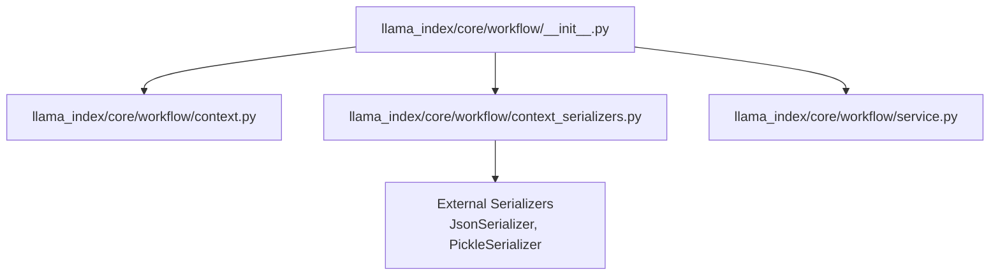
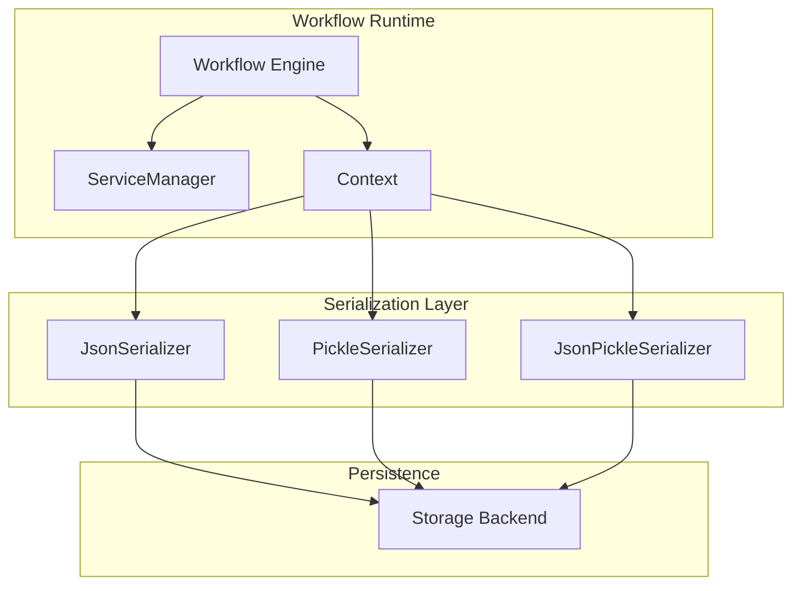
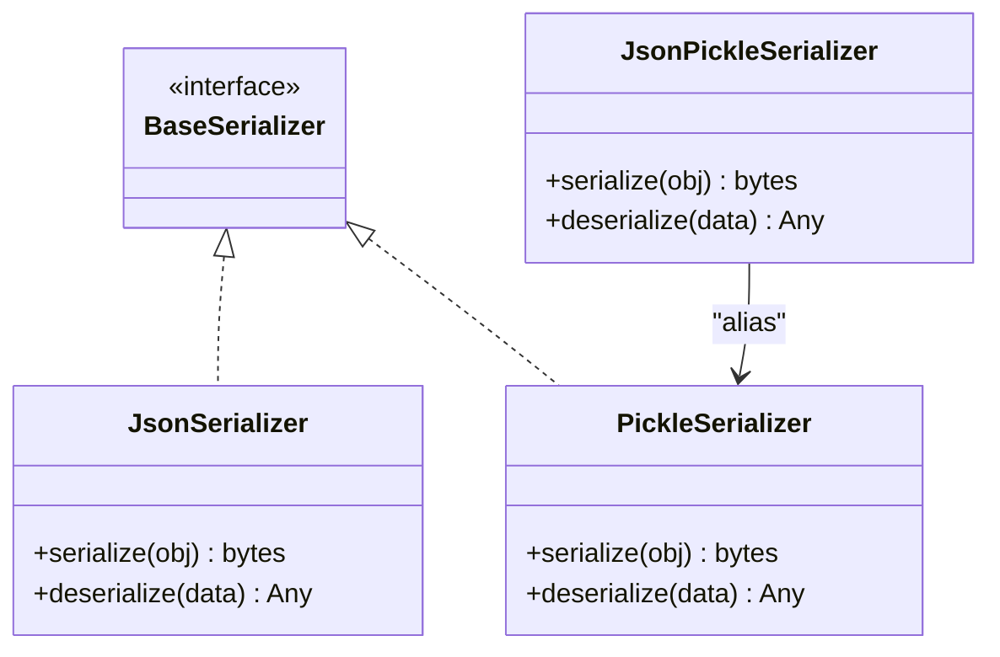
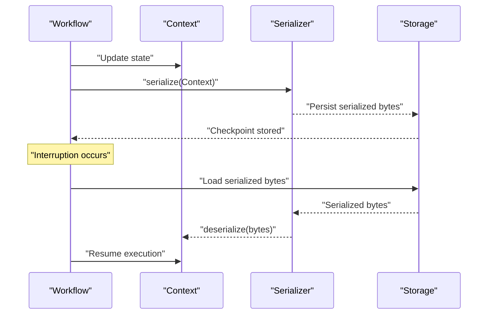
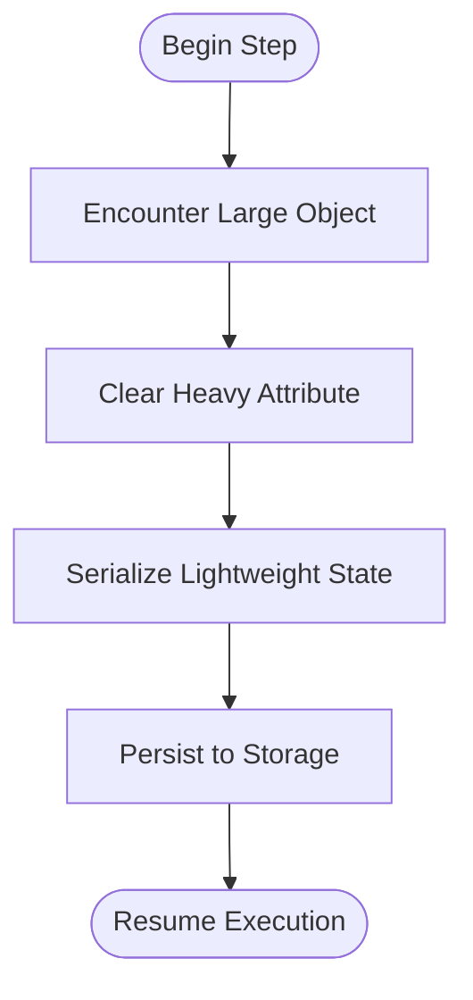
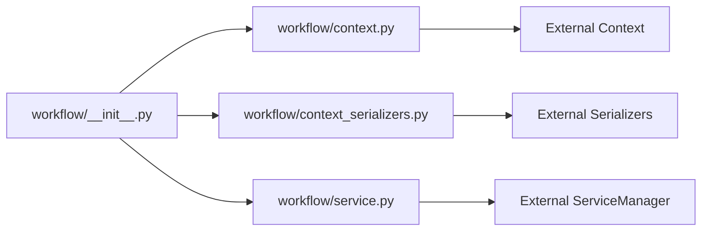

# Checkpointing and State Management

<cite>
**Referenced Files in This Document**
- [__init__.py](file://llama-index-core/llama_index/core/workflow/__init__.py)
- [context_serializers.py](file://llama-index-core/llama_index/core/workflow/context_serializers.py)
- [context.py](file://llama-index-core/llama_index/core/workflow/context.py)
- [service.py](file://llama-index-core/llama_index/core/workflow/service.py)
- [checkpointing_workflows.ipynb](file://docs/examples/workflow/checkpointing_workflows.ipynb)
- [workflows_cookbook.ipynb](file://docs/examples/workflow/workflows_cookbook.ipynb)
- [multi_strategy_workflow.ipynb](file://docs/examples/workflow/multi_strategy_workflow.ipynb)
- [planning_workflow.ipynb](file://docs/examples/workflow/planning_workflow.ipynb)
- [simple_chat_store.py](file://llama-index-core/llama_index/core/storage/chat_store/simple_chat_store.py)
- [types.py](file://llama-index-core/llama_index/core/base/llms/types.py)
- [base.py](file://llama-index-core/llama_index/core/indices/base.py)
- [schema.py](file://llama-index-core/llama_index/core/schema.py)
- [events.py](file://llama-index-core/llama_index/core/voice_agents/events.py)
</cite>

## Table of Contents
1. [Introduction](#introduction)
2. [Project Structure](#project-structure)
3. [Core Components](#core-components)
4. [Architecture Overview](#architecture-overview)
5. [Detailed Component Analysis](#detailed-component-analysis)
6. [Dependency Analysis](#dependency-analysis)
7. [Performance Considerations](#performance-considerations)
8. [Troubleshooting Guide](#troubleshooting-guide)
9. [Conclusion](#conclusion)
10. [Appendices](#appendices)

## Introduction
This document explains checkpointing and state management in LlamaIndex workflows. It covers how workflows preserve state across interruptions, how to persist and restore state, and how the serialization system supports robust checkpointing. It also documents the available serializers, resource management, cleanup procedures, and best practices for production deployments. Examples of fault-tolerant workflows and incremental computation patterns are included via notebook references.

## Project Structure
The workflow-related APIs are exposed through the core workflow module, which re-exports key types and serializers. The actual workflow engine is imported from an external package and integrated into the core namespace.

**Diagram sources**
- [__init__.py](file://llama-index-core/llama_index/core/workflow/__init__.py#L1-L23)
- [context.py](file://llama-index-core/llama_index/core/workflow/context.py#L1-L2)
- [context_serializers.py](file://llama-index-core/llama_index/core/workflow/context_serializers.py#L1-L9)
- [service.py](file://llama-index-core/llama_index/core/workflow/service.py#L1-L2)

**Section sources**
- [__init__.py](file://llama-index-core/llama_index/core/workflow/__init__.py#L1-L23)

## Core Components
- Context: Holds workflow state during execution and is the primary surface for checkpointing and restoration.
- Serializers: Provide mechanisms to serialize/deserialize context and related objects for persistence.
  - JsonSerializer: JSON-based serialization.
  - PickleSerializer: Python pickle-based serialization.
  - JsonPickleSerializer: Backward-compatible alias for pickle-based serializer.
- ServiceManager: Manages services used by workflows and integrates with the broader runtime.

Key exports and their roles:
- Context: Central state container for steps and inter-step data.
- JsonSerializer: Recommended for portability and readability.
- PickleSerializer: For complex Python objects requiring deep serialization.
- JsonPickleSerializer: Compatibility shim for legacy usage.
- ServiceManager: Provides service lifecycle and discovery for workflows.

**Section sources**
- [__init__.py](file://llama-index-core/llama_index/core/workflow/__init__.py#L1-L23)
- [context_serializers.py](file://llama-index-core/llama_index/core/workflow/context_serializers.py#L1-L9)
- [context.py](file://llama-index-core/llama_index/core/workflow/context.py#L1-L2)
- [service.py](file://llama-index-core/llama_index/core/workflow/service.py#L1-L2)

## Architecture Overview
The workflow checkpointing architecture centers around serializing Context to durable storage and restoring it later to resume execution. The serializer selection influences portability, performance, and supported object types.

**Diagram sources**
- [__init__.py](file://llama-index-core/llama_index/core/workflow/__init__.py#L1-L23)
- [context_serializers.py](file://llama-index-core/llama_index/core/workflow/context_serializers.py#L1-L9)

## Detailed Component Analysis

### Serialization System
- JsonSerializer: Suitable for portable, readable state. Use when state contains JSON-serializable data structures.
- PickleSerializer: Supports arbitrary Python objects but is less portable across environments.
- JsonPickleSerializer: Alias for backward compatibility; internally maps to pickle-based serialization.

**Diagram sources**
- [context_serializers.py](file://llama-index-core/llama_index/core/workflow/context_serializers.py#L1-L9)

**Section sources**
- [context_serializers.py](file://llama-index-core/llama_index/core/workflow/context_serializers.py#L1-L9)

### State Preservation and Restoration
- Checkpoint creation: Serialize Context at strategic points (e.g., after each step or periodically) to persistent storage.
- Recovery: Deserialize Context from storage and feed it back into the workflow to resume execution.
- Incremental computation: Resume from the last checkpoint to avoid recomputing prior steps.

[No sources needed since this diagram shows conceptual workflow, not actual code structure]

### Fault-Tolerant Workflows and Examples
- Checkpointing workflows: Demonstrates how to persist and restore workflow state across interruptions.
- Multi-strategy workflow: Shows combining multiple strategies with stateful steps.
- Planning workflow: Illustrates planning steps with intermediate checkpoints.
- Workflows cookbook: General patterns and recipes for building resilient workflows.

References:
- [checkpointing_workflows.ipynb](file://docs/examples/workflow/checkpointing_workflows.ipynb)
- [multi_strategy_workflow.ipynb](file://docs/examples/workflow/multi_strategy_workflow.ipynb)
- [planning_workflow.ipynb](file://docs/examples/workflow/planning_workflow.ipynb)
- [workflows_cookbook.ipynb](file://docs/examples/workflow/workflows_cookbook.ipynb)

**Section sources**
- [checkpointing_workflows.ipynb](file://docs/examples/workflow/checkpointing_workflows.ipynb)
- [multi_strategy_workflow.ipynb](file://docs/examples/workflow/multi_strategy_workflow.ipynb)
- [planning_workflow.ipynb](file://docs/examples/workflow/planning_workflow.ipynb)
- [workflows_cookbook.ipynb](file://docs/examples/workflow/workflows_cookbook.ipynb)

### Resource Management and Cleanup
- Clearing heavy objects: Some components intentionally clear large attributes to reduce serialization overhead.
- Chat message serialization: Uses recursive serialization helpers to safely encode messages.
- Voice agent events: Define serialization aliases to ensure stable field naming.

**Diagram sources**
- [base.py](file://llama-index-core/llama_index/core/indices/base.py#L73-L73)
- [simple_chat_store.py](file://llama-index-core/llama_index/core/storage/chat_store/simple_chat_store.py#L11-L26)
- [events.py](file://llama-index-core/llama_index/core/voice_agents/events.py#L12-L12)

**Section sources**
- [base.py](file://llama-index-core/llama_index/core/indices/base.py#L73-L73)
- [simple_chat_store.py](file://llama-index-core/llama_index/core/storage/chat_store/simple_chat_store.py#L11-L26)
- [events.py](file://llama-index-core/llama_index/core/voice_agents/events.py#L12-L12)

## Dependency Analysis
The workflow module re-exports core types and serializers, while importing the underlying Context and ServiceManager from an external package. This decouples the public API from internal implementation details.

**Diagram sources**
- [__init__.py](file://llama-index-core/llama_index/core/workflow/__init__.py#L1-L23)
- [context.py](file://llama-index-core/llama_index/core/workflow/context.py#L1-L2)
- [context_serializers.py](file://llama-index-core/llama_index/core/workflow/context_serializers.py#L1-L9)
- [service.py](file://llama-index-core/llama_index/core/workflow/service.py#L1-L2)

**Section sources**
- [__init__.py](file://llama-index-core/llama_index/core/workflow/__init__.py#L1-L23)
- [context.py](file://llama-index-core/llama_index/core/workflow/context.py#L1-L2)
- [context_serializers.py](file://llama-index-core/llama_index/core/workflow/context_serializers.py#L1-L9)
- [service.py](file://llama-index-core/llama_index/core/workflow/service.py#L1-L2)

## Performance Considerations
- Serializer choice:
  - JsonSerializer: Faster for simple, JSON-like structures; smaller payloads; easier to inspect.
  - PickleSerializer: Slower and larger payloads; supports complex Python objects.
- Payload size:
  - Minimize stored state by clearing non-essential attributes before serialization.
  - Prefer incremental checkpoints over full-state snapshots when possible.
- Storage backend:
  - Choose low-latency storage for frequent checkpoints.
  - Ensure durability and atomic write semantics for checkpoints.
- Network and I/O:
  - Batch checkpoints periodically to reduce I/O frequency.
  - Compress payloads if supported by the storage backend.

[No sources needed since this section provides general guidance]

## Troubleshooting Guide
Common issues and remedies:
- Serialization failures:
  - Use JsonSerializer for portable state; fall back to PickleSerializer for complex objects.
  - Ensure all custom objects implement safe serialization or are cleared before serialization.
- State drift:
  - Verify that external resources referenced by Context are still available after restoration.
  - Rehydrate services via ServiceManager to ensure dependencies are satisfied.
- Large payloads:
  - Clear heavy attributes (e.g., cached objects) before checkpointing.
  - Split state into smaller, incremental checkpoints.

**Section sources**
- [context_serializers.py](file://llama-index-core/llama_index/core/workflow/context_serializers.py#L1-L9)
- [base.py](file://llama-index-core/llama_index/core/indices/base.py#L73-L73)
- [simple_chat_store.py](file://llama-index-core/llama_index/core/storage/chat_store/simple_chat_store.py#L11-L26)

## Conclusion
LlamaIndex provides a flexible serialization system and a clear checkpointing model centered on Context. By selecting the appropriate serializer, managing resource lifecycles, and adopting incremental checkpointing, teams can build fault-tolerant, production-grade workflows. The included notebooks demonstrate practical patterns for building resilient systems.

[No sources needed since this section summarizes without analyzing specific files]

## Appendices
- Best practices:
  - Prefer JsonSerializer for portability; use PickleSerializer only when necessary.
  - Keep checkpoints small and incremental.
  - Always clear heavy attributes before serialization.
  - Persist checkpoints atomically and maintain multiple recent checkpoints for rollback.
  - Validate restoration by running a short smoke test after loading state.
- Example references:
  - [checkpointing_workflows.ipynb](file://docs/examples/workflow/checkpointing_workflows.ipynb)
  - [multi_strategy_workflow.ipynb](file://docs/examples/workflow/multi_strategy_workflow.ipynb)
  - [planning_workflow.ipynb](file://docs/examples/workflow/planning_workflow.ipynb)
  - [workflows_cookbook.ipynb](file://docs/examples/workflow/workflows_cookbook.ipynb)

[No sources needed since this section aggregates references without analyzing specific files]