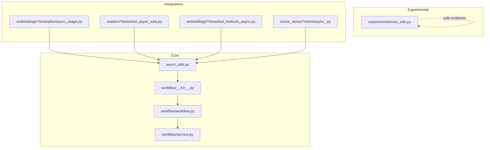
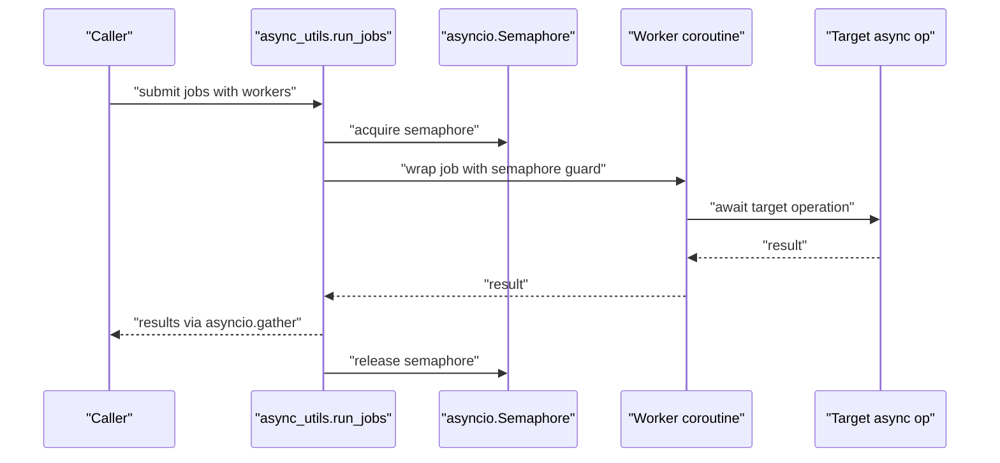
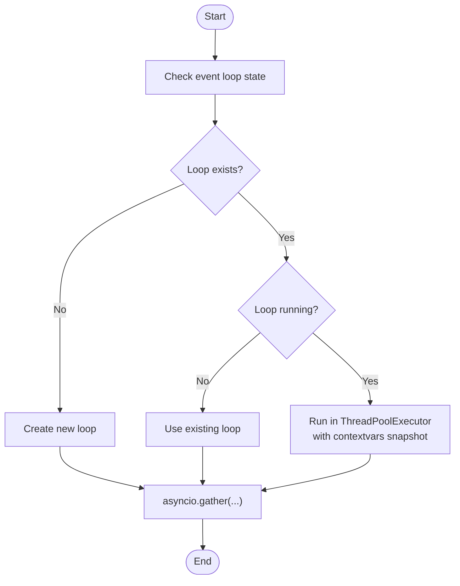
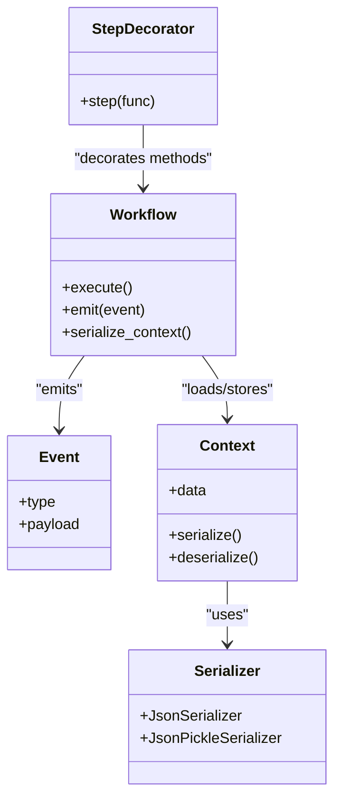
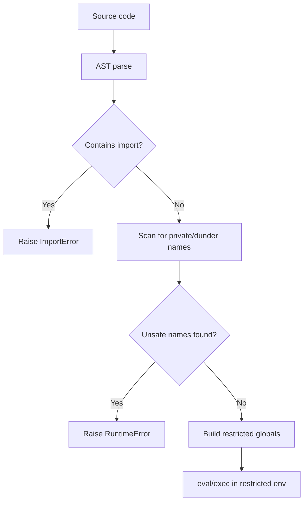
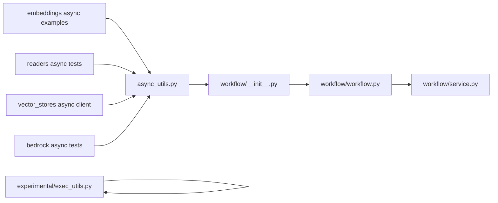

# Parallel Execution and Concurrency

<cite>
**Referenced Files in This Document**
- [async_utils.py](file://llama-index-core/llama_index/core/async_utils.py)
- [exec_utils.py](file://llama-index-experimental/llama_index/experimental/exec_utils.py)
- [service.py](file://llama-index-core/llama_index/core/workflow/service.py)
- [workflow.py](file://llama-index-core/llama_index/core/workflow/workflow.py)
- [__init__.py](file://llama-index-core/llama_index/core/workflow/__init__.py)
- [test_async_utils.py](file://llama-index-core/tests/test_async_utils.py)
- [test_simple_async.py](file://llama-index-core/tests/indices/vector_store/test_simple_async.py)
- [async_usage.py](file://llama-index-integrations/embeddings/llama-index-embeddings-heroku/examples/async_usage.py)
- [test_async_web.py](file://llama-index-integrations/readers/llama-index-readers-web/tests/test_async_web.py)
- [test_bedrock_async.py](file://llama-index-integrations/embeddings/llama-index-embeddings-bedrock/tests/test_bedrock_async.py)
- [async_.py](file://llama-index-integrations/vector_stores/llama-index-vector-stores-solr/llama_index/vector_stores/solr/client/async_.py)
- [test_async_client.py](file://llama-index-integrations/vector_stores/llama-index-vector-stores-solr/tests/test_async_client.py)
</cite>

## Table of Contents
1. [Introduction](#introduction)
2. [Project Structure](#project-structure)
3. [Core Components](#core-components)
4. [Architecture Overview](#architecture-overview)
5. [Detailed Component Analysis](#detailed-component-analysis)
6. [Dependency Analysis](#dependency-analysis)
7. [Performance Considerations](#performance-considerations)
8. [Troubleshooting Guide](#troubleshooting-guide)
9. [Conclusion](#conclusion)
10. [Appendices](#appendices)

## Introduction
This document explains how LlamaIndex supports parallel execution and concurrency across workflows, retrieval, embedding, and vector store operations. It covers concurrent step execution, thread management, resource allocation via semaphores, and scheduling patterns. It also documents asynchronous utilities, batch processing, dependency resolution, and practical examples for parallel RAG pipelines and concurrent retrievers. Guidance is included for avoiding deadlocks, managing nested event loops, and optimizing throughput for scalable deployments.

## Project Structure
The concurrency-related capabilities are primarily implemented in:
- Core async utilities for running and batching coroutines, controlling concurrency with semaphores, and handling nested event loops
- Experimental execution utilities for safe evaluation and execution of untrusted code in restricted contexts
- Workflow service and workflow entry points for orchestrating steps and events
- Integration tests and examples demonstrating async usage across embeddings, readers, and vector stores

**Diagram sources**
- [async_utils.py](file://llama-index-core/llama_index/core/async_utils.py#L1-L175)
- [workflow/__init__.py](file://llama-index-core/llama_index/core/workflow/__init__.py#L1-L23)
- [workflow/workflow.py](file://llama-index-core/llama_index/core/workflow/workflow.py#L1-L2)
- [workflow/service.py](file://llama-index-core/llama_index/core/workflow/service.py#L1-L2)
- [experimental/exec_utils.py](file://llama-index-experimental/llama_index/experimental/exec_utils.py#L1-L173)
- [embeddings/*/examples/async_usage.py](file://llama-index-integrations/embeddings/llama-index-embeddings-heroku/examples/async_usage.py)
- [readers/*/tests/test_async_web.py](file://llama-index-integrations/readers/llama-index-readers-web/tests/test_async_web.py)
- [embeddings/*/tests/test_bedrock_async.py](file://llama-index-integrations/embeddings/llama-index-embeddings-bedrock/tests/test_bedrock_async.py)
- [vector_stores/*/client/async_.py](file://llama-index-integrations/vector_stores/llama-index-vector-stores-solr/llama_index/vector_stores/solr/client/async_.py)

**Section sources**
- [async_utils.py](file://llama-index-core/llama_index/core/async_utils.py#L1-L175)
- [workflow/__init__.py](file://llama-index-core/llama_index/core/workflow/__init__.py#L1-L23)
- [workflow/workflow.py](file://llama-index-core/llama_index/core/workflow/workflow.py#L1-L2)
- [workflow/service.py](file://llama-index-core/llama_index/core/workflow/service.py#L1-L2)
- [experimental/exec_utils.py](file://llama-index-experimental/llama_index/experimental/exec_utils.py#L1-L173)

## Core Components
- Async utilities
  - Event loop management for nested or already-running loops
  - Batch execution with optional progress bars
  - Worker-limited concurrency via semaphores
  - Chunking and gather helpers for large task sets
- Workflow orchestration
  - Step decorator and workflow runtime entry points
  - Event-driven workflow lifecycle and serialization
- Experimental execution utilities
  - Restricted evaluation and execution for safe code execution

Key APIs and responsibilities:
- run_async_tasks: run a list of coroutines with optional progress and fallback behavior
- batch_gather: chunk and run tasks with controlled concurrency
- run_jobs: limit concurrent workers with a semaphore and optionally show progress
- step: decorate workflow steps for execution ordering and dependency resolution
- safe_eval/safe_exec: restricted execution environment for untrusted code

**Section sources**
- [async_utils.py](file://llama-index-core/llama_index/core/async_utils.py#L68-L175)
- [workflow/__init__.py](file://llama-index-core/llama_index/core/workflow/__init__.py#L1-L23)
- [experimental/exec_utils.py](file://llama-index-experimental/llama_index/experimental/exec_utils.py#L151-L173)

## Architecture Overview
The concurrency architecture centers around asyncio primitives and optional progress bars. The workflow subsystem provides a higher-level abstraction for composing steps with explicit dependencies and events. Integrations demonstrate async usage patterns across embeddings, readers, and vector stores.

**Diagram sources**
- [async_utils.py](file://llama-index-core/llama_index/core/async_utils.py#L137-L175)

## Detailed Component Analysis

### Async Utilities: Concurrency Control and Scheduling
- Event loop handling
  - Detects existing loops, handles nested loops gracefully, and falls back to creating a new loop when appropriate
  - Uses ThreadPoolExecutor to avoid blocking when a loop is already running
- Task execution
  - run_async_tasks: runs a list of coroutines, with optional progress via tqdm_asyncio and graceful fallback
  - batch_gather: splits tasks into chunks and runs them in batches, printing progress when enabled
  - run_jobs: wraps each job with a semaphore to cap concurrency, optionally with progress
- Chunking and gather
  - chunks: partitions iterables into fixed-size groups
  - asyncio.gather: aggregates results from multiple coroutines

Concurrency patterns:
- Semaphore-based worker pools to prevent resource saturation
- Batch processing to reduce overhead for large task lists
- Progress-aware execution for interactive environments

**Diagram sources**
- [async_utils.py](file://llama-index-core/llama_index/core/async_utils.py#L25-L66)

**Section sources**
- [async_utils.py](file://llama-index-core/llama_index/core/async_utils.py#L14-L175)

### Workflow Orchestration: Steps, Events, and Serialization
- Workflow entry points and decorators
  - step: marks methods as workflow steps with implicit dependency ordering
  - Workflow: runtime for executing steps, emitting events, and serializing state
  - Events: lifecycle and human-in-the-loop events (start, stop, input required, human response)
  - Serializers: JSON and pickle serializers for context persistence
- Service integration
  - ServiceManager and related service discovery are exposed via the workflow service module

Practical implications:
- Steps execute concurrently up to the worker limit enforced by run_jobs
- Events enable pause/resume and external input during long-running workflows
- Serialization ensures reproducible state across restarts

**Diagram sources**
- [workflow/__init__.py](file://llama-index-core/llama_index/core/workflow/__init__.py#L1-L23)
- [workflow/workflow.py](file://llama-index-core/llama_index/core/workflow/workflow.py#L1-L2)
- [workflow/service.py](file://llama-index-core/llama_index/core/workflow/service.py#L1-L2)

**Section sources**
- [workflow/__init__.py](file://llama-index-core/llama_index/core/workflow/__init__.py#L1-L23)
- [workflow/workflow.py](file://llama-index-core/llama_index/core/workflow/workflow.py#L1-L2)
- [workflow/service.py](file://llama-index-core/llama_index/core/workflow/service.py#L1-L2)

### Experimental Execution Utilities: Safe Evaluation and Execution
- Restricted imports and built-ins
  - Only a curated set of modules and built-ins are allowed
- AST-based safety checks
  - Prevents access to private/dunder names and disallows import statements
- Safe eval/exec
  - Executes expressions/statements within a restricted global namespace

Use cases:
- Executing user-provided transformations or filters safely
- Enforcing sandboxed computation in experimental or plugin-style extensions

**Diagram sources**
- [experimental/exec_utils.py](file://llama-index-experimental/llama_index/experimental/exec_utils.py#L113-L173)

**Section sources**
- [experimental/exec_utils.py](file://llama-index-experimental/llama_index/experimental/exec_utils.py#L1-L173)

### Practical Examples: Parallel RAG Pipelines and Concurrent Retrievers
- Embeddings
  - Async usage examples demonstrate running embedding operations concurrently
- Readers
  - Web reader tests show async fetching and processing of remote content
- Vector stores
  - Async client demonstrates concurrent indexing/search operations
- Bedrock embeddings
  - Async tests illustrate parallel embedding generation against cloud providers

These examples rely on the core async utilities to manage concurrency and progress.

**Section sources**
- [embeddings/*/examples/async_usage.py](file://llama-index-integrations/embeddings/llama-index-embeddings-heroku/examples/async_usage.py)
- [readers/*/tests/test_async_web.py](file://llama-index-integrations/readers/llama-index-readers-web/tests/test_async_web.py)
- [vector_stores/*/client/async_.py](file://llama-index-integrations/vector_stores/llama-index-vector-stores-solr/llama_index/vector_stores/solr/client/async_.py)
- [embeddings/*/tests/test_bedrock_async.py](file://llama-index-integrations/embeddings/llama-index-embeddings-bedrock/tests/test_bedrock_async.py)

## Dependency Analysis
- Core async utilities depend on asyncio, concurrent.futures, and optional tqdm_asyncio for progress
- Workflow components depend on the step decorator and event model to coordinate execution
- Experimental execution utilities depend on AST parsing and restricted namespaces
- Integrations depend on core async utilities to run operations concurrently

**Diagram sources**
- [async_utils.py](file://llama-index-core/llama_index/core/async_utils.py#L1-L175)
- [workflow/__init__.py](file://llama-index-core/llama_index/core/workflow/__init__.py#L1-L23)
- [workflow/workflow.py](file://llama-index-core/llama_index/core/workflow/workflow.py#L1-L2)
- [workflow/service.py](file://llama-index-core/llama_index/core/workflow/service.py#L1-L2)
- [experimental/exec_utils.py](file://llama-index-experimental/llama_index/experimental/exec_utils.py#L1-L173)

**Section sources**
- [async_utils.py](file://llama-index-core/llama_index/core/async_utils.py#L1-L175)
- [workflow/__init__.py](file://llama-index-core/llama_index/core/workflow/__init__.py#L1-L23)
- [workflow/workflow.py](file://llama-index-core/llama_index/core/workflow/workflow.py#L1-L2)
- [workflow/service.py](file://llama-index-core/llama_index/core/workflow/service.py#L1-L2)
- [experimental/exec_utils.py](file://llama-index-experimental/llama_index/experimental/exec_utils.py#L1-L173)

## Performance Considerations
- Concurrency limits
  - Use run_jobs with a tuned workers parameter to balance throughput and resource contention
- Batch sizing
  - batch_gather reduces overhead for large task sets; adjust batch_size per workload characteristics
- Progress reporting
  - tqdm_asyncio enhances visibility in interactive environments; fallback behavior avoids hard dependencies
- Nested loops
  - Prefer async entry methods and apply nest_asyncio when necessary to avoid nested loop errors
- Resource pooling
  - Combine semaphores with batching to smooth bursty workloads and prevent saturation

[No sources needed since this section provides general guidance]

## Troubleshooting Guide
Common issues and resolutions:
- Nested async runtime errors
  - Apply nest_asyncio and use async entry methods; avoid mixing blocking and async loops
- Deadlocks and starvation
  - Ensure every acquired semaphore is released; avoid synchronous waits inside coroutines
- Excessive resource usage
  - Reduce workers or batch_size; monitor memory and network utilization
- Progress bar failures
  - Fallback to non-progress mode when tqdm_asyncio is unavailable

Validation references:
- Core async utilities behavior and error handling
- Integration tests for async patterns and failure modes

**Section sources**
- [async_utils.py](file://llama-index-core/llama_index/core/async_utils.py#L25-L66)
- [test_async_utils.py](file://llama-index-core/tests/test_async_utils.py)
- [test_simple_async.py](file://llama-index-core/tests/indices/vector_store/test_simple_async.py)

## Conclusion
LlamaIndex provides robust primitives for parallel execution and concurrency:
- Core async utilities offer flexible concurrency control, batching, and progress-aware execution
- Workflow orchestration enables step-based composition with explicit events and serialization
- Experimental execution utilities support safe computation in restricted environments
- Integrations demonstrate practical patterns for parallel RAG pipelines and concurrent retrievers

By tuning worker counts, batching, and leveraging semaphores, developers can achieve scalable throughput while avoiding deadlocks and resource exhaustion.

[No sources needed since this section summarizes without analyzing specific files]

## Appendices

### Appendix A: API Surface for Parallel Execution
- run_async_tasks: run a list of coroutines with optional progress
- batch_gather: chunk and run tasks with controlled concurrency
- run_jobs: limit concurrent workers with a semaphore and optional progress
- step: decorate workflow steps for ordered execution
- safe_eval/safe_exec: restricted execution environment

**Section sources**
- [async_utils.py](file://llama-index-core/llama_index/core/async_utils.py#L68-L175)
- [workflow/__init__.py](file://llama-index-core/llama_index/core/workflow/__init__.py#L1-L23)
- [experimental/exec_utils.py](file://llama-index-experimental/llama_index/experimental/exec_utils.py#L151-L173)