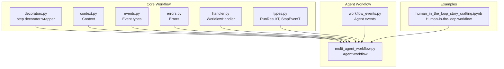
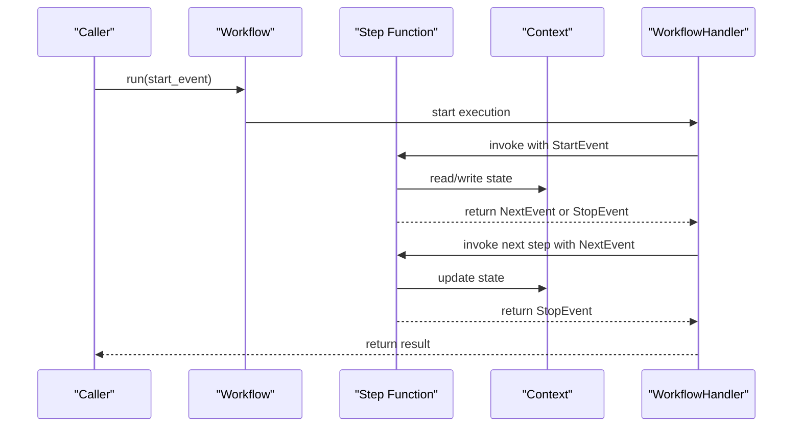
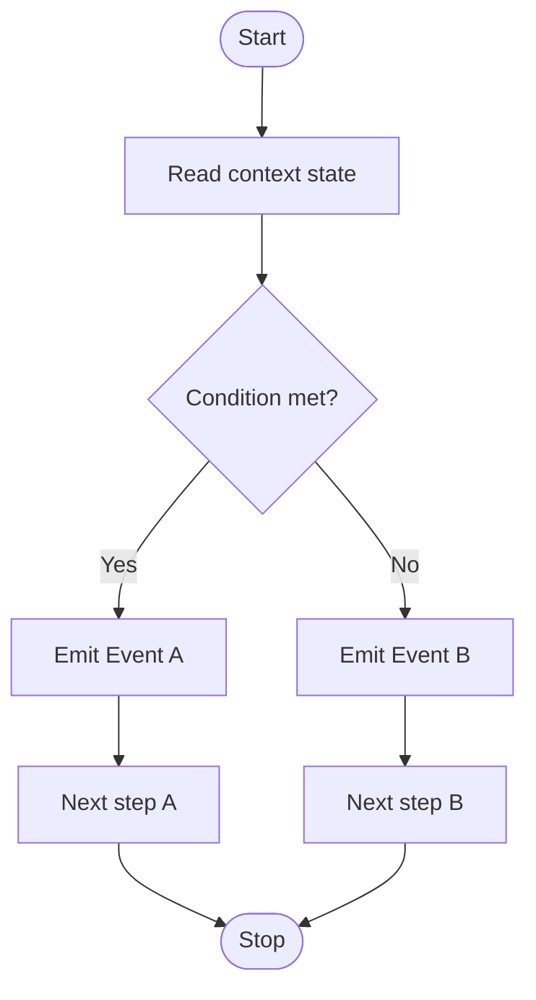
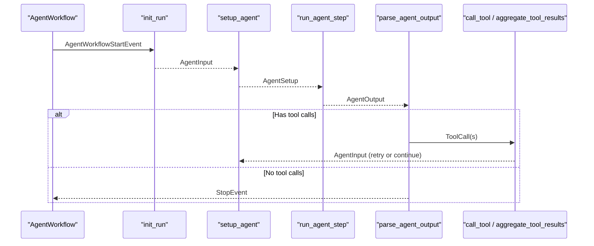
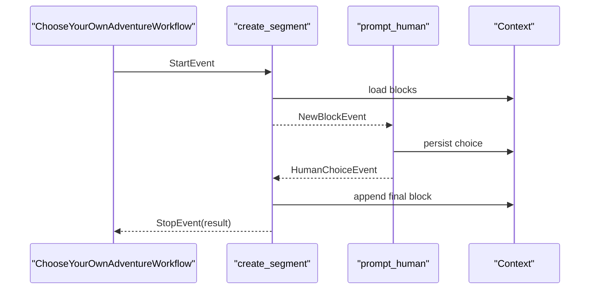
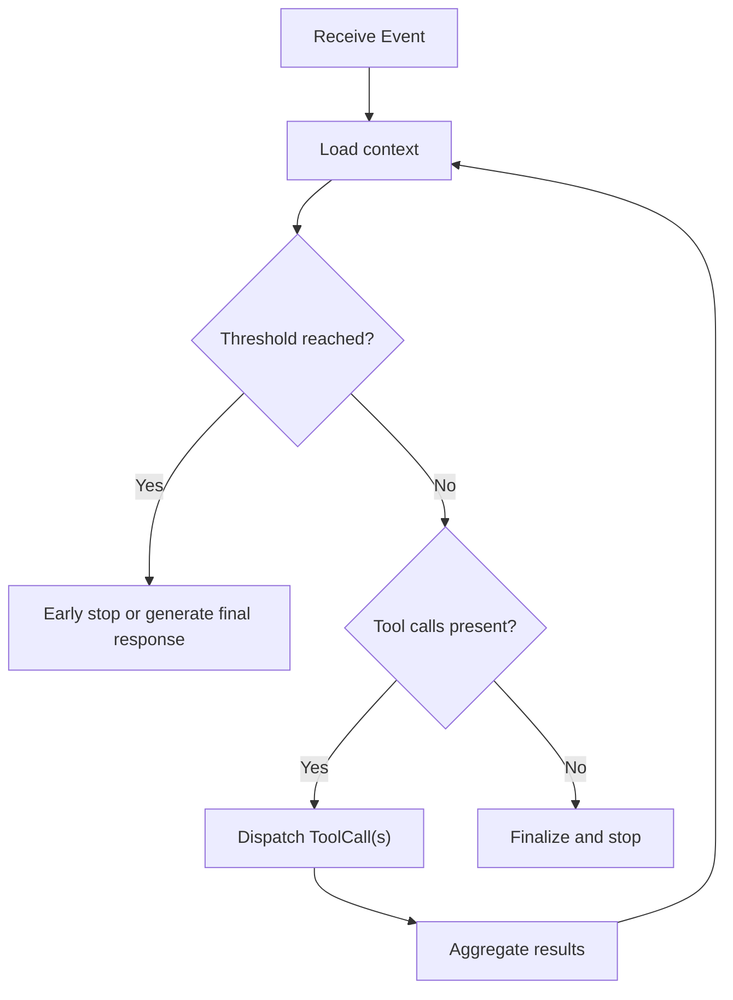
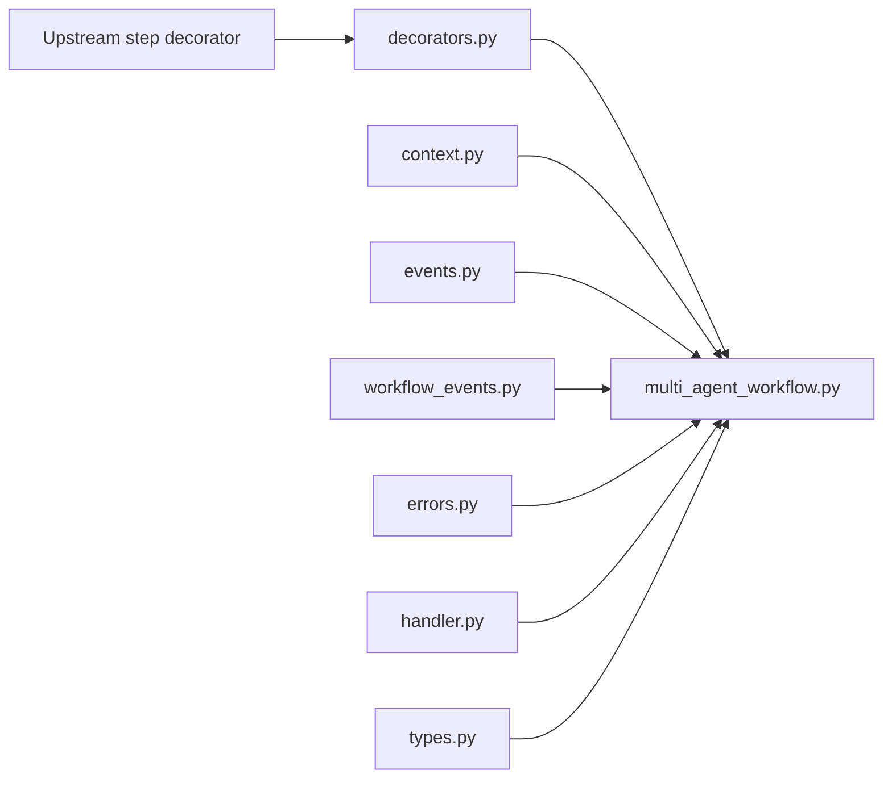

# Planning Workflows

<cite>
**Referenced Files in This Document**
- [decorators.py](file://llama-index-core/llama_index/core/workflow/decorators.py)
- [context.py](file://llama-index-core/llama_index/core/workflow/context.py)
- [events.py](file://llama-index-core/llama_index/core/workflow/events.py)
- [errors.py](file://llama-index-core/llama_index/core/workflow/errors.py)
- [handler.py](file://llama-index-core/llama_index/core/workflow/handler.py)
- [types.py](file://llama-index-core/llama_index/core/workflow/types.py)
- [multi_agent_workflow.py](file://llama-index-core/llama_index/core/agent/workflow/multi_agent_workflow.py)
- [workflow_events.py](file://llama-index-core/llama_index/core/agent/workflow/workflow_events.py)
- [human_in_the_loop_story_crafting.ipynb](file://docs/examples/workflow/human_in_the_loop_story_crafting.ipynb)
</cite>

## Table of Contents
1. [Introduction](#introduction)
2. [Project Structure](#project-structure)
3. [Core Components](#core-components)
4. [Architecture Overview](#architecture-overview)
5. [Detailed Component Analysis](#detailed-component-analysis)
6. [Dependency Analysis](#dependency-analysis)
7. [Performance Considerations](#performance-considerations)
8. [Troubleshooting Guide](#troubleshooting-guide)
9. [Conclusion](#conclusion)

## Introduction
This document explains how to build intelligent planning workflows in LlamaIndex. It focuses on dynamic planning systems that can determine the optimal sequence of operations at runtime, leveraging the step decorator, workflow composition patterns, and decision-making logic. It also covers self-discovering workflows, adaptive planning, conditional step execution, and practical strategies for complex retrieval-augmented generation (RAG) scenarios, multi-step reasoning, and dynamic query transformation. Guidance is provided on workflow validation, error handling, and performance optimization for planning-intensive operations.

## Project Structure
LlamaIndex’s planning workflows are centered around a core workflow abstraction with a step decorator, event-driven orchestration, and context/state management. The agent workflow module composes multiple agents and orchestrates handoffs and tool usage, while the documentation includes a human-in-the-loop example that demonstrates dynamic branching and iterative planning.

**Diagram sources**
- [decorators.py](file://llama-index-core/llama_index/core/workflow/decorators.py#L1-L11)
- [context.py](file://llama-index-core/llama_index/core/workflow/context.py#L1-L2)
- [events.py](file://llama-index-core/llama_index/core/workflow/events.py#L1-L2)
- [errors.py](file://llama-index-core/llama_index/core/workflow/errors.py#L1-L2)
- [handler.py](file://llama-index-core/llama_index/core/workflow/handler.py#L1-L2)
- [types.py](file://llama-index-core/llama_index/core/workflow/types.py#L1-L2)
- [multi_agent_workflow.py](file://llama-index-core/llama_index/core/agent/workflow/multi_agent_workflow.py#L1-L827)
- [workflow_events.py](file://llama-index-core/llama_index/core/agent/workflow/workflow_events.py#L1-L145)
- [human_in_the_loop_story_crafting.ipynb](file://docs/examples/workflow/human_in_the_loop_story_crafting.ipynb#L1-L522)

**Section sources**
- [decorators.py](file://llama-index-core/llama_index/core/workflow/decorators.py#L1-L11)
- [context.py](file://llama-index-core/llama_index/core/workflow/context.py#L1-L2)
- [events.py](file://llama-index-core/llama_index/core/workflow/events.py#L1-L2)
- [errors.py](file://llama-index-core/llama_index/core/workflow/errors.py#L1-L2)
- [handler.py](file://llama-index-core/llama_index/core/workflow/handler.py#L1-L2)
- [types.py](file://llama-index-core/llama_index/core/workflow/types.py#L1-L2)
- [multi_agent_workflow.py](file://llama-index-core/llama_index/core/agent/workflow/multi_agent_workflow.py#L1-L827)
- [workflow_events.py](file://llama-index-core/llama_index/core/agent/workflow/workflow_events.py#L1-L145)
- [human_in_the_loop_story_crafting.ipynb](file://docs/examples/workflow/human_in_the_loop_story_crafting.ipynb#L1-L522)

## Core Components
- Step decorator: A thin wrapper around the upstream step decorator that normalizes parameters and exposes a consistent API surface for defining workflow steps.
- Context: Provides a shared state store and persistence interface for workflows to maintain planning state across steps.
- Events: Typed event classes that carry data between steps and represent lifecycle signals such as start, stop, and intermediate tool interactions.
- Errors: Dedicated exceptions for workflow runtime errors and validation.
- Handler: Manages asynchronous execution, event routing, and lifecycle of a workflow run.
- Types: Exported type aliases for run results and stop events to standardize return types.

These components collectively enable dynamic planning by allowing steps to read/write context, emit typed events, and decide the next step based on runtime conditions.

**Section sources**
- [decorators.py](file://llama-index-core/llama_index/core/workflow/decorators.py#L1-L11)
- [context.py](file://llama-index-core/llama_index/core/workflow/context.py#L1-L2)
- [events.py](file://llama-index-core/llama_index/core/workflow/events.py#L1-L2)
- [errors.py](file://llama-index-core/llama_index/core/workflow/errors.py#L1-L2)
- [handler.py](file://llama-index-core/llama_index/core/workflow/handler.py#L1-L2)
- [types.py](file://llama-index-core/llama_index/core/workflow/types.py#L1-L2)

## Architecture Overview
The planning workflow architecture is event-driven and asynchronous. Steps are decorated functions that receive a context and an event, and they return either a new event to trigger the next step or a stop event to conclude the workflow. The handler manages execution, and the context persists state across steps.

**Diagram sources**
- [multi_agent_workflow.py](file://llama-index-core/llama_index/core/agent/workflow/multi_agent_workflow.py#L378-L432)
- [workflow_events.py](file://llama-index-core/llama_index/core/agent/workflow/workflow_events.py#L114-L145)
- [handler.py](file://llama-index-core/llama_index/core/workflow/handler.py#L1-L2)

## Detailed Component Analysis

### Step Decorator Usage and Dynamic Planning
- The step decorator wraps the upstream step implementation and strips deprecated parameters, ensuring a clean interface for defining steps.
- Steps receive a context and an event, and can conditionally return different event types to steer the workflow dynamically. This enables:
  - Self-discovering workflows: steps can introspect context and emit new events to branch based on detected conditions.
  - Adaptive planning: steps can adjust the next operation depending on prior outputs or external signals.
  - Conditional execution: steps can skip or reorder downstream steps by emitting specialized events.

**Diagram sources**
- [decorators.py](file://llama-index-core/llama_index/core/workflow/decorators.py#L7-L11)
- [context.py](file://llama-index-core/llama_index/core/workflow/context.py#L1-L2)

**Section sources**
- [decorators.py](file://llama-index-core/llama_index/core/workflow/decorators.py#L1-L11)
- [context.py](file://llama-index-core/llama_index/core/workflow/context.py#L1-L2)

### Multi-Agent Workflow Orchestration and Adaptive Planning
The multi-agent workflow composes multiple agents, manages tool selection and invocation, and supports handoffs and early stopping. It demonstrates:
- Iterative planning: steps compute and refine plans across multiple iterations.
- Tool-driven decisions: tool calls and results influence the next step.
- Handoff logic: dynamic delegation between agents based on capability and context.
- Structured output generation: optional structured responses and validation.

**Diagram sources**
- [multi_agent_workflow.py](file://llama-index-core/llama_index/core/agent/workflow/multi_agent_workflow.py#L378-L744)
- [workflow_events.py](file://llama-index-core/llama_index/core/agent/workflow/workflow_events.py#L24-L112)

**Section sources**
- [multi_agent_workflow.py](file://llama-index-core/llama_index/core/agent/workflow/multi_agent_workflow.py#L1-L827)
- [workflow_events.py](file://llama-index-core/llama_index/core/agent/workflow/workflow_events.py#L1-L145)

### Human-in-the-Loop Planning Example
This example demonstrates a self-discovering, iterative workflow that alternates between generating story segments and prompting human choices. It showcases:
- Dynamic branching: based on iteration count, the workflow switches between regular and final segment generation.
- Context persistence: the running story is accumulated and passed into subsequent steps.
- Human-in-the-loop: the workflow pauses to collect human input, which influences the next step.

**Diagram sources**
- [human_in_the_loop_story_crafting.ipynb](file://docs/examples/workflow/human_in_the_loop_story_crafting.ipynb#L300-L352)

**Section sources**
- [human_in_the_loop_story_crafting.ipynb](file://docs/examples/workflow/human_in_the_loop_story_crafting.ipynb#L1-L522)

### Decision-Making Logic and Conditional Step Execution
Decision-making is achieved by:
- Inspecting context state to determine the next step.
- Emitting distinct event types to route execution to different handlers.
- Using early stopping or retry mechanisms when thresholds are exceeded or errors occur.

**Diagram sources**
- [multi_agent_workflow.py](file://llama-index-core/llama_index/core/agent/workflow/multi_agent_workflow.py#L520-L545)
- [workflow_events.py](file://llama-index-core/llama_index/core/agent/workflow/workflow_events.py#L70-L112)

**Section sources**
- [multi_agent_workflow.py](file://llama-index-core/llama_index/core/agent/workflow/multi_agent_workflow.py#L520-L545)
- [workflow_events.py](file://llama-index-core/llama_index/core/agent/workflow/workflow_events.py#L70-L112)

### Complex RAG Scenarios, Multi-Step Reasoning, and Dynamic Query Transformation
Guidance for designing planning workflows in complex RAG contexts:
- Multi-step reasoning: decompose queries into sub-queries, then synthesize answers across steps.
- Dynamic query transformation: adjust prompts or retrieval parameters based on intermediate results.
- Adaptive planning: switch between retrieval, summarization, and generation steps depending on confidence scores or entity detection.
- Structured outputs: use structured prediction to enforce consistent schemas for intermediate artifacts.

[No sources needed since this section provides general guidance]

### Workflow Validation and Error Handling
- Validation: ensure start events conform to expected shapes and that required fields are present.
- Error handling: dedicated runtime errors propagate when limits are exceeded; tool invocation errors are captured and surfaced as tool outputs.
- Early stopping: configurable strategies to either force-stop or generate a final response when iteration limits are reached.

**Section sources**
- [workflow_events.py](file://llama-index-core/llama_index/core/agent/workflow/workflow_events.py#L114-L145)
- [multi_agent_workflow.py](file://llama-index-core/llama_index/core/agent/workflow/multi_agent_workflow.py#L540-L544)
- [errors.py](file://llama-index-core/llama_index/core/workflow/errors.py#L1-L2)

## Dependency Analysis
The workflow stack integrates tightly with the agent workflow module and event types. The step decorator depends on the upstream implementation, while the handler coordinates execution. Context provides the shared state layer.

**Diagram sources**
- [decorators.py](file://llama-index-core/llama_index/core/workflow/decorators.py#L1-L11)
- [multi_agent_workflow.py](file://llama-index-core/llama_index/core/agent/workflow/multi_agent_workflow.py#L1-L827)
- [context.py](file://llama-index-core/llama_index/core/workflow/context.py#L1-L2)
- [events.py](file://llama-index-core/llama_index/core/workflow/events.py#L1-L2)
- [workflow_events.py](file://llama-index-core/llama_index/core/agent/workflow/workflow_events.py#L1-L145)
- [errors.py](file://llama-index-core/llama_index/core/workflow/errors.py#L1-L2)
- [handler.py](file://llama-index-core/llama_index/core/workflow/handler.py#L1-L2)
- [types.py](file://llama-index-core/llama_index/core/workflow/types.py#L1-L2)

**Section sources**
- [decorators.py](file://llama-index-core/llama_index/core/workflow/decorators.py#L1-L11)
- [multi_agent_workflow.py](file://llama-index-core/llama_index/core/agent/workflow/multi_agent_workflow.py#L1-L827)
- [context.py](file://llama-index-core/llama_index/core/workflow/context.py#L1-L2)
- [events.py](file://llama-index-core/llama_index/core/workflow/events.py#L1-L2)
- [workflow_events.py](file://llama-index-core/llama_index/core/agent/workflow/workflow_events.py#L1-L145)
- [errors.py](file://llama-index-core/llama_index/core/workflow/errors.py#L1-L2)
- [handler.py](file://llama-index-core/llama_index/core/workflow/handler.py#L1-L2)
- [types.py](file://llama-index-core/llama_index/core/workflow/types.py#L1-L2)

## Performance Considerations
- Minimize context writes: batch updates to reduce serialization overhead.
- Limit iteration depth: configure early stopping to avoid runaway planning loops.
- Stream outputs: leverage streaming events to provide feedback without blocking.
- Asynchronous tool calls: parallelize independent tool invocations where safe.
- Avoid unnecessary re-runs: reuse cached results when intermediate conditions are unchanged.

[No sources needed since this section provides general guidance]

## Troubleshooting Guide
- Symptom: Workflow stops prematurely.
  - Check early stopping configuration and iteration limits.
  - Verify that tool calls are properly aggregated and that return-direct tools are handled.
- Symptom: Tool invocation errors.
  - Inspect tool outputs flagged as errors and review tool availability in the current agent’s tool set.
- Symptom: Start event validation failures.
  - Ensure required fields are present and that chat histories are properly validated to ChatMessage objects.

**Section sources**
- [multi_agent_workflow.py](file://llama-index-core/llama_index/core/agent/workflow/multi_agent_workflow.py#L540-L544)
- [workflow_events.py](file://llama-index-core/llama_index/core/agent/workflow/workflow_events.py#L114-L145)

## Conclusion
LlamaIndex provides a robust foundation for building intelligent planning workflows. By composing steps with the step decorator, maintaining state in Context, and emitting typed events, you can implement self-discovering, adaptive, and conditional planning systems. The multi-agent workflow and human-in-the-loop example illustrate how to orchestrate complex, multi-step reasoning and dynamic query transformation. With careful validation, error handling, and performance tuning, these workflows can scale to sophisticated RAG and agent-driven use cases.