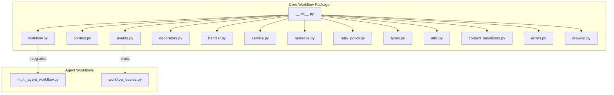
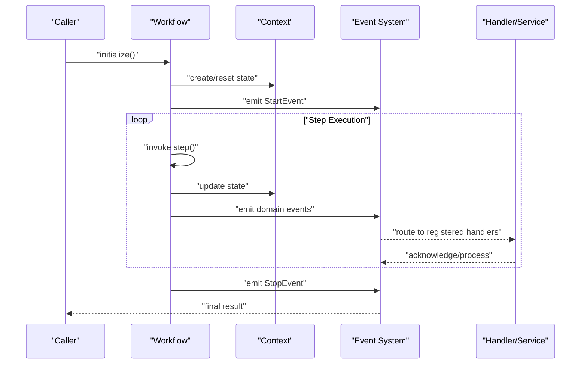
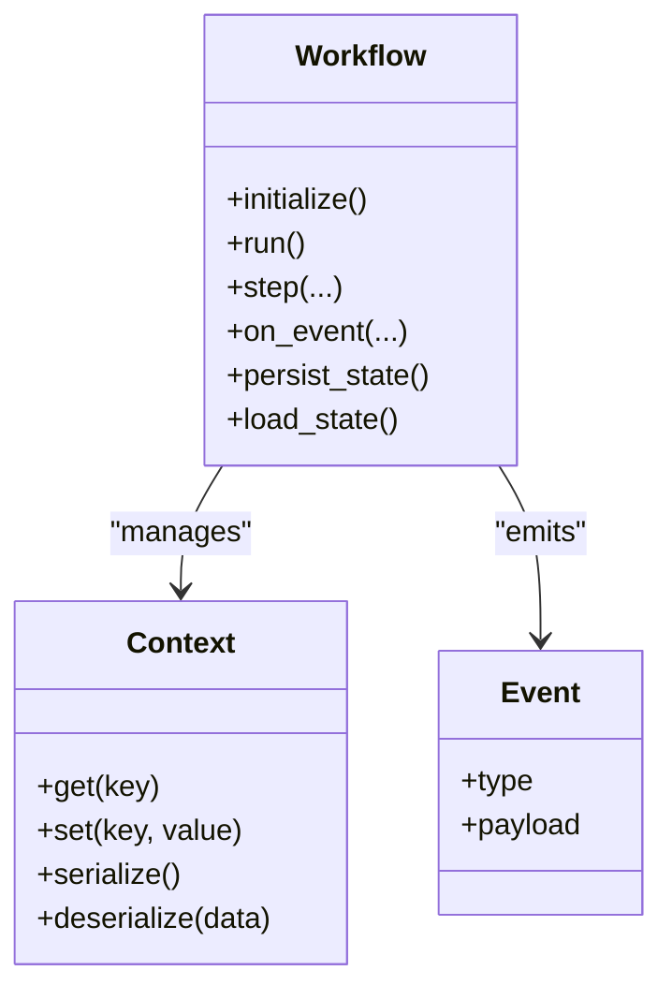
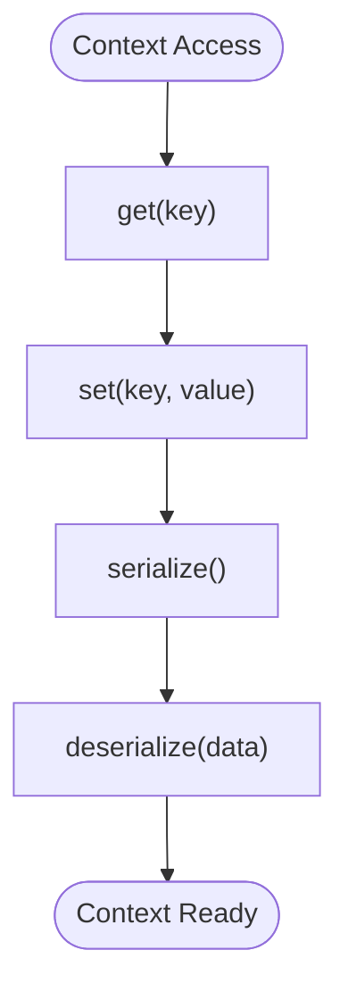
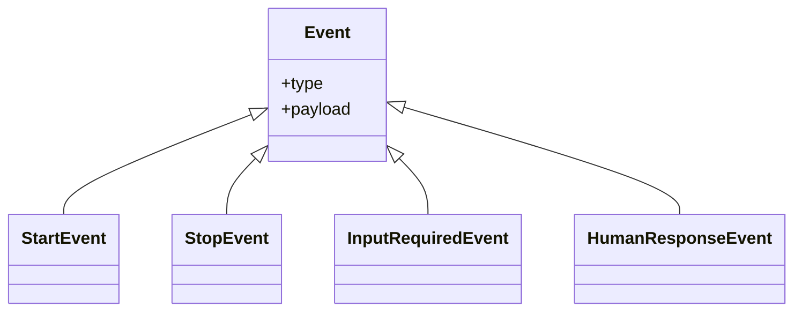
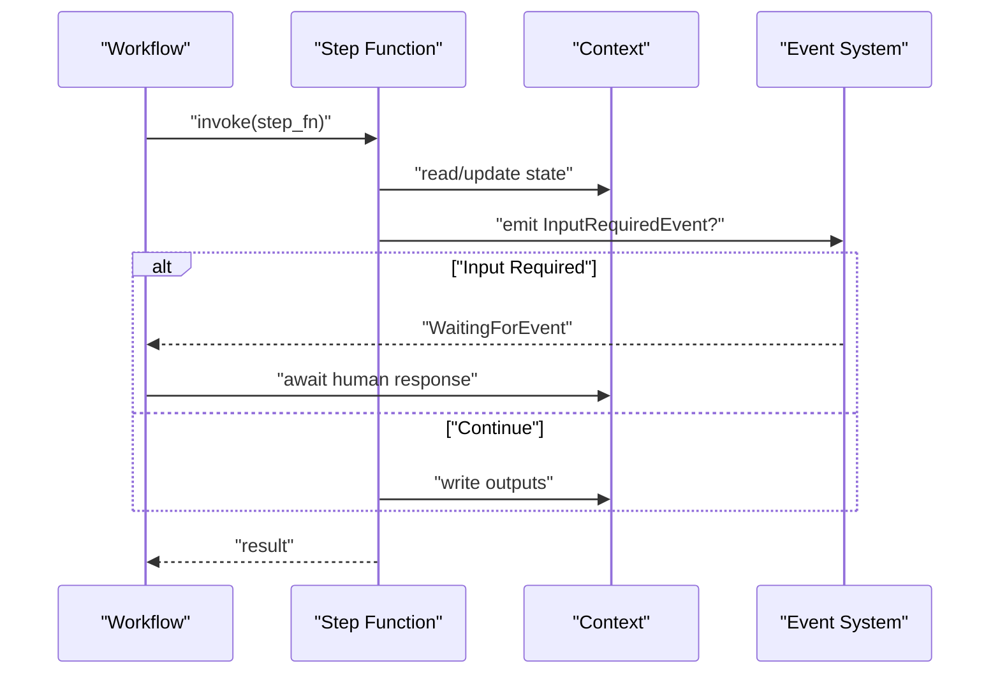
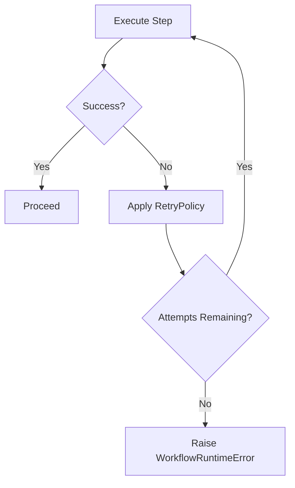
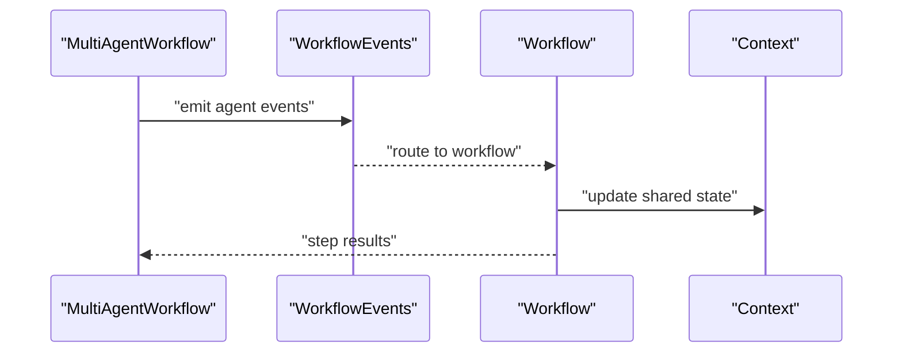
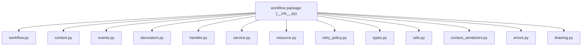

# Workflow Engine Architecture

<cite>
**Referenced Files in This Document**
- [__init__.py](file://llama-index-core/llama_index/core/workflow/__init__.py)
- [workflow.py](file://llama-index-core/llama_index/core/workflow/workflow.py)
- [context.py](file://llama-index-core/llama_index/core/workflow/context.py)
- [events.py](file://llama-index-core/llama_index/core/workflow/events.py)
- [decorators.py](file://llama-index-core/llama_index/core/workflow/decorators.py)
- [handler.py](file://llama-index-core/llama_index/core/workflow/handler.py)
- [service.py](file://llama-index-core/llama_index/core/workflow/service.py)
- [resource.py](file://llama-index-core/llama_index/core/workflow/resource.py)
- [retry_policy.py](file://llama-index-core/llama_index/core/workflow/retry_policy.py)
- [types.py](file://llama-index-core/llama_index/core/workflow/types.py)
- [utils.py](file://llama-index-core/llama_index/core/workflow/utils.py)
- [context_serializers.py](file://llama-index-core/llama_index/core/workflow/context_serializers.py)
- [errors.py](file://llama-index-core/llama_index/core/workflow/errors.py)
- [drawing.py](file://llama-index-core/llama_index/core/workflow/drawing.py)
- [multi_agent_workflow.py](file://llama-index-core/llama_index/core/agent/workflow/multi_agent_workflow.py)
- [workflow_events.py](file://llama-index-core/llama_index/core/agent/workflow/workflow_events.py)
- [checkpointing_workflows.ipynb](file://docs/examples/workflow/checkpointing_workflows.ipynb)
- [multi_strategy_workflow.ipynb](file://docs/examples/workflow/multi_strategy_workflow.ipynb)
- [planning_workflow.ipynb](file://docs/examples/workflow/planning_workflow.ipynb)
- [self_discover_workflow.ipynb](file://docs/examples/workflow/self_discover_workflow.ipynb)
- [workflows_cookbook.ipynb](file://docs/examples/workflow/workflows_cookbook.ipynb)
</cite>

## Table of Contents
1. [Introduction](#introduction)
2. [Project Structure](#project-structure)
3. [Core Components](#core-components)
4. [Architecture Overview](#architecture-overview)
5. [Detailed Component Analysis](#detailed-component-analysis)
6. [Dependency Analysis](#dependency-analysis)
7. [Performance Considerations](#performance-considerations)
8. [Troubleshooting Guide](#troubleshooting-guide)
9. [Conclusion](#conclusion)
10. [Appendices](#appendices)

## Introduction
This document explains the LlamaIndex workflow engine architecture with a focus on the Workflow class, Context management, and the Event system. It documents the workflow lifecycle from initialization to completion, including state transitions and event handling mechanisms. It also details the relationships among workflows, steps, and context objects, and demonstrates the event-driven coordination model. Architectural diagrams illustrate component interactions and data flow patterns, and practical examples show instantiation, configuration, and basic execution patterns.

## Project Structure
The workflow engine resides under the core module and exposes a public API via the workflow package. The structure organizes core building blocks (Workflow, Context, Events, Decorators, Handlers, Service, Resources, Retry Policy, Types, Utils, Serializers, Errors, Drawing) and integrates with agent workflows.

**Diagram sources**
- [__init__.py](file://llama-index-core/llama_index/core/workflow/__init__.py#L1-L23)
- [workflow.py](file://llama-index-core/llama_index/core/workflow/workflow.py#L1-L2)
- [context.py](file://llama-index-core/llama_index/core/workflow/context.py#L1-L2)
- [events.py](file://llama-index-core/llama_index/core/workflow/events.py#L1-L9)
- [decorators.py](file://llama-index-core/llama_index/core/workflow/decorators.py#L1-L2)
- [handler.py](file://llama-index-core/llama_index/core/workflow/handler.py#L1-L2)
- [service.py](file://llama-index-core/llama_index/core/workflow/service.py#L1-L2)
- [resource.py](file://llama-index-core/llama_index/core/workflow/resource.py#L1-L2)
- [retry_policy.py](file://llama-index-core/llama_index/core/workflow/retry_policy.py#L1-L2)
- [types.py](file://llama-index-core/llama_index/core/workflow/types.py#L1-L2)
- [utils.py](file://llama-index-core/llama_index/core/workflow/utils.py#L1-L5)
- [context_serializers.py](file://llama-index-core/llama_index/core/workflow/context_serializers.py#L1-L2)
- [errors.py](file://llama-index-core/llama_index/core/workflow/errors.py#L1-L2)
- [drawing.py](file://llama-index-core/llama_index/core/workflow/drawing.py#L1-L2)
- [multi_agent_workflow.py](file://llama-index-core/llama_index/core/agent/workflow/multi_agent_workflow.py#L1-L200)
- [workflow_events.py](file://llama-index-core/llama_index/core/agent/workflow/workflow_events.py#L1-L200)

**Section sources**
- [__init__.py](file://llama-index-core/llama_index/core/workflow/__init__.py#L1-L23)

## Core Components
- Workflow: Central orchestration class that defines steps, manages execution, and coordinates events.
- Context: Encapsulates runtime state and data shared across steps and events.
- Events: Typed event model enabling asynchronous coordination and human-in-the-loop interactions.
- Decorators: Step definition and configuration utilities.
- Handler/Service/Resource: Runtime support for event handling, service management, and resource provisioning.
- Retry Policy/Types/Utils: Execution policies, type contracts, and helper utilities.
- Serializers/Errors/Drawing: Serialization strategies, error types, and visualization helpers.

Key exports and re-exports are exposed via the package’s public API.

**Section sources**
- [__init__.py](file://llama-index-core/llama_index/core/workflow/__init__.py#L1-L23)
- [workflow.py](file://llama-index-core/llama_index/core/workflow/workflow.py#L1-L2)
- [context.py](file://llama-index-core/llama_index/core/workflow/context.py#L1-L2)
- [events.py](file://llama-index-core/llama_index/core/workflow/events.py#L1-L9)
- [decorators.py](file://llama-index-core/llama_index/core/workflow/decorators.py#L1-L2)
- [handler.py](file://llama-index-core/llama_index/core/workflow/handler.py#L1-L2)
- [service.py](file://llama-index-core/llama_index/core/workflow/service.py#L1-L2)
- [resource.py](file://llama-index-core/llama_index/core/workflow/resource.py#L1-L2)
- [retry_policy.py](file://llama-index-core/llama_index/core/workflow/retry_policy.py#L1-L2)
- [types.py](file://llama-index-core/llama_index/core/workflow/types.py#L1-L2)
- [utils.py](file://llama-index-core/llama_index/core/workflow/utils.py#L1-L5)
- [context_serializers.py](file://llama-index-core/llama_index/core/workflow/context_serializers.py#L1-L2)
- [errors.py](file://llama-index-core/llama_index/core/workflow/errors.py#L1-L2)
- [drawing.py](file://llama-index-core/llama_index/core/workflow/drawing.py#L1-L2)

## Architecture Overview
The workflow engine follows an event-driven architecture:
- Workflows define steps decorated with metadata.
- Steps execute synchronously or asynchronously and emit typed events.
- Events trigger handlers and can pause/resume execution.
- Context carries state and is serializable for persistence and checkpointing.
- Services and resources provide runtime capabilities.
- Retry policies govern transient failure handling.

**Diagram sources**
- [workflow.py](file://llama-index-core/llama_index/core/workflow/workflow.py#L1-L2)
- [events.py](file://llama-index-core/llama_index/core/workflow/events.py#L1-L9)
- [handler.py](file://llama-index-core/llama_index/core/workflow/handler.py#L1-L2)
- [service.py](file://llama-index-core/llama_index/core/workflow/service.py#L1-L2)
- [context.py](file://llama-index-core/llama_index/core/workflow/context.py#L1-L2)

## Detailed Component Analysis

### Workflow Class
The Workflow orchestrates step execution, maintains state transitions, and coordinates events. It integrates with the event system and supports serialization for persistence.

**Diagram sources**
- [workflow.py](file://llama-index-core/llama_index/core/workflow/workflow.py#L1-L2)
- [context.py](file://llama-index-core/llama_index/core/workflow/context.py#L1-L2)
- [events.py](file://llama-index-core/llama_index/core/workflow/events.py#L1-L9)

**Section sources**
- [workflow.py](file://llama-index-core/llama_index/core/workflow/workflow.py#L1-L2)

### Context Management
Context encapsulates runtime state and supports serialization strategies for checkpointing and resumption.

**Diagram sources**
- [context.py](file://llama-index-core/llama_index/core/workflow/context.py#L1-L2)
- [context_serializers.py](file://llama-index-core/llama_index/core/workflow/context_serializers.py#L1-L2)

**Section sources**
- [context.py](file://llama-index-core/llama_index/core/workflow/context.py#L1-L2)
- [context_serializers.py](file://llama-index-core/llama_index/core/workflow/context_serializers.py#L1-L2)

### Event System
Events drive asynchronous coordination. The system defines core event types and supports human-in-the-loop interactions.

**Diagram sources**
- [events.py](file://llama-index-core/llama_index/core/workflow/events.py#L1-L9)

**Section sources**
- [events.py](file://llama-index-core/llama_index/core/workflow/events.py#L1-L9)

### Step Definition and Execution
Steps are defined using decorators and executed within the workflow lifecycle. They can emit events and update context.

**Diagram sources**
- [decorators.py](file://llama-index-core/llama_index/core/workflow/decorators.py#L1-L2)
- [events.py](file://llama-index-core/llama_index/core/workflow/events.py#L1-L9)
- [context.py](file://llama-index-core/llama_index/core/workflow/context.py#L1-L2)

**Section sources**
- [decorators.py](file://llama-index-core/llama_index/core/workflow/decorators.py#L1-L2)

### Handler and Service Coordination
Handlers and services process events and manage external integrations. Service managers resolve and instantiate services.

**Diagram sources**
- [handler.py](file://llama-index-core/llama_index/core/workflow/handler.py#L1-L2)
- [service.py](file://llama-index-core/llama_index/core/workflow/service.py#L1-L2)

**Section sources**
- [handler.py](file://llama-index-core/llama_index/core/workflow/handler.py#L1-L2)
- [service.py](file://llama-index-core/llama_index/core/workflow/service.py#L1-L2)

### Retry Policy and Error Handling
Retry policies define backoff strategies for transient failures. Errors are categorized for robust handling.

**Diagram sources**
- [retry_policy.py](file://llama-index-core/llama_index/core/workflow/retry_policy.py#L1-L2)
- [errors.py](file://llama-index-core/llama_index/core/workflow/errors.py#L1-L2)

**Section sources**
- [retry_policy.py](file://llama-index-core/llama_index/core/workflow/retry_policy.py#L1-L2)
- [errors.py](file://llama-index-core/llama_index/core/workflow/errors.py#L1-L2)

### Agent Workflow Integration
Multi-agent workflows demonstrate event-driven coordination across agents and steps.

**Diagram sources**
- [multi_agent_workflow.py](file://llama-index-core/llama_index/core/agent/workflow/multi_agent_workflow.py#L1-L200)
- [workflow_events.py](file://llama-index-core/llama_index/core/agent/workflow/workflow_events.py#L1-L200)

**Section sources**
- [multi_agent_workflow.py](file://llama-index-core/llama_index/core/agent/workflow/multi_agent_workflow.py#L1-L200)
- [workflow_events.py](file://llama-index-core/llama_index/core/agent/workflow/workflow_events.py#L1-L200)

## Dependency Analysis
The workflow package re-exports core components and integrates with agent workflows. Dependencies are primarily internal, with clear separation of concerns.

**Diagram sources**
- [__init__.py](file://llama-index-core/llama_index/core/workflow/__init__.py#L1-L23)

**Section sources**
- [__init__.py](file://llama-index-core/llama_index/core/workflow/__init__.py#L1-L23)

## Performance Considerations
- Minimize heavy computation inside steps; delegate to services/resources where possible.
- Use efficient serialization strategies for context to reduce I/O overhead.
- Apply retry policies judiciously to avoid tight loops on transient failures.
- Keep event payloads minimal to reduce routing and handler processing costs.
- Persist checkpoints at strategic boundaries to enable fast recovery.

## Troubleshooting Guide
Common issues and resolutions:
- WorkflowRuntimeError: Indicates unrecoverable execution errors; inspect step logs and event sequences.
- WorkflowTimeoutError: Suggests long-running steps or missing event acknowledgments; adjust timeouts and ensure handlers are responsive.
- WorkflowValidationError: Indicates invalid configuration or state; validate step definitions and context keys.
- HumanResponseEvent not progressing: Ensure handlers acknowledge and feed responses back into context.

**Section sources**
- [errors.py](file://llama-index-core/llama_index/core/workflow/errors.py#L1-L2)

## Conclusion
The LlamaIndex workflow engine provides a robust, event-driven framework for orchestrating multi-step processes with strong context management and extensible handlers/services. Its modular design enables scalable composition, reliable error handling, and seamless integration with agent workflows.

## Appendices

### Example Patterns
- Basic workflow instantiation and execution: See the cookbook examples.
- Multi-strategy workflows: Explore multi-strategy patterns.
- Planning workflows: Review planning-oriented workflows.
- Self-discovery workflows: Examine self-discovery patterns.
- Checkpointing workflows: Learn persistence and recovery strategies.

**Section sources**
- [workflows_cookbook.ipynb](file://docs/examples/workflow/workflows_cookbook.ipynb)
- [multi_strategy_workflow.ipynb](file://docs/examples/workflow/multi_strategy_workflow.ipynb)
- [planning_workflow.ipynb](file://docs/examples/workflow/planning_workflow.ipynb)
- [self_discover_workflow.ipynb](file://docs/examples/workflow/self_discover_workflow.ipynb)
- [checkpointing_workflows.ipynb](file://docs/examples/workflow/checkpointing_workflows.ipynb)