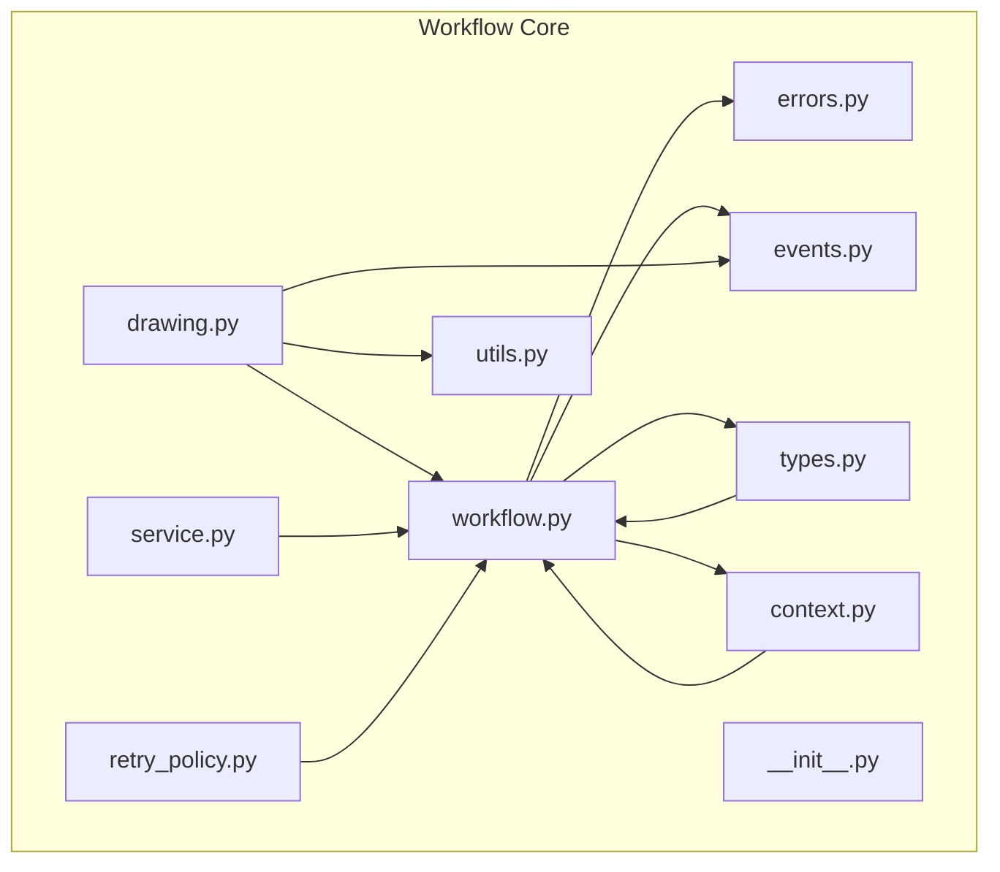
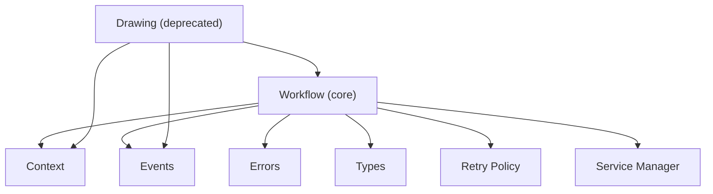
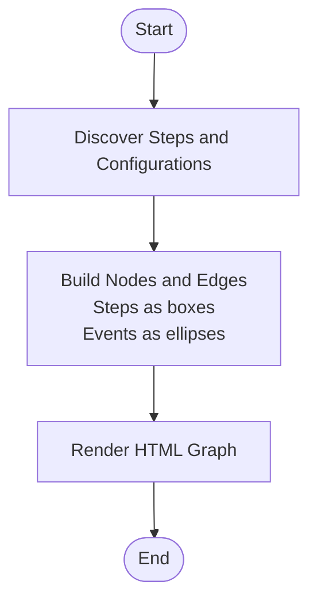
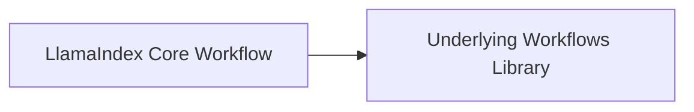

# Workflow Monitoring and Debugging

<cite>
**Referenced Files in This Document**
- [errors.py](file://llama-index-core/llama_index/core/workflow/errors.py)
- [events.py](file://llama-index-core/llama_index/core/workflow/events.py)
- [types.py](file://llama-index-core/llama_index/core/workflow/types.py)
- [context.py](file://llama-index-core/llama_index/core/workflow/context.py)
- [drawing.py](file://llama-index-core/llama_index/core/workflow/drawing.py)
- [service.py](file://llama-index-core/llama_index/core/workflow/service.py)
- [workflow.py](file://llama-index-core/llama_index/core/workflow/workflow.py)
- [retry_policy.py](file://llama-index-core/llama_index/core/workflow/retry_policy.py)
- [utils.py](file://llama-index-core/llama_index/core/workflow/utils.py)
- [__init__.py](file://llama-index-core/llama_index/core/workflow/__init__.py)
</cite>

## Table of Contents
1. [Introduction](#introduction)
2. [Project Structure](#project-structure)
3. [Core Components](#core-components)
4. [Architecture Overview](#architecture-overview)
5. [Detailed Component Analysis](#detailed-component-analysis)
6. [Dependency Analysis](#dependency-analysis)
7. [Performance Considerations](#performance-considerations)
8. [Troubleshooting Guide](#troubleshooting-guide)
9. [Conclusion](#conclusion)
10. [Appendices](#appendices)

## Introduction
This document explains how to monitor and debug workflows in LlamaIndex. It focuses on error handling patterns, exception types surfaced via the workflow module, recovery strategies, logging and diagnostics, visualization and tracing, and production-grade monitoring and alerting. It also covers timeout handling, validation failures, runtime errors, and practical recovery techniques.

## Project Structure
The workflow monitoring and debugging surface in the core workflow package, which re-exports types and exceptions from the underlying workflows library. The primary areas covered here are:
- Exception types and error handling
- Events and execution lifecycle
- Types for stop and run results
- Context for state and persistence
- Visualization utilities for workflow diagrams
- Retry policy and service management
- Utilities for introspection and step discovery

**Diagram sources**
- [errors.py](file://llama-index-core/llama_index/core/workflow/errors.py#L1-L11)
- [events.py](file://llama-index-core/llama_index/core/workflow/events.py#L1-L9)
- [types.py](file://llama-index-core/llama_index/core/workflow/types.py#L1-L2)
- [context.py](file://llama-index-core/llama_index/core/workflow/context.py#L1-L2)
- [drawing.py](file://llama-index-core/llama_index/core/workflow/drawing.py#L1-L117)
- [service.py](file://llama-index-core/llama_index/core/workflow/service.py#L1-L2)
- [workflow.py](file://llama-index-core/llama_index/core/workflow/workflow.py#L1-L2)
- [retry_policy.py](file://llama-index-core/llama_index/core/workflow/retry_policy.py)
- [utils.py](file://llama-index-core/llama_index/core/workflow/utils.py)
- [__init__.py](file://llama-index-core/llama_index/core/workflow/__init__.py)

**Section sources**
- [errors.py](file://llama-index-core/llama_index/core/workflow/errors.py#L1-L11)
- [events.py](file://llama-index-core/llama_index/core/workflow/events.py#L1-L9)
- [types.py](file://llama-index-core/llama_index/core/workflow/types.py#L1-L2)
- [context.py](file://llama-index-core/llama_index/core/workflow/context.py#L1-L2)
- [drawing.py](file://llama-index-core/llama_index/core/workflow/drawing.py#L1-L117)
- [service.py](file://llama-index-core/llama_index/core/workflow/service.py#L1-L2)
- [workflow.py](file://llama-index-core/llama_index/core/workflow/workflow.py#L1-L2)
- [retry_policy.py](file://llama-index-core/llama_index/core/workflow/retry_policy.py)
- [utils.py](file://llama-index-core/llama_index/core/workflow/utils.py)
- [__init__.py](file://llama-index-core/llama_index/core/workflow/__init__.py)

## Core Components
- Exception types: The workflow module exposes runtime, validation, timeout, cancellation, configuration, and step existence errors. These are the primary signals for diagnosing workflow issues.
- Events: Start, stop, human response, and input-required events define the execution lifecycle and interaction points.
- Types: StopEventT and RunResultT provide type-level markers for termination and outcomes.
- Context: Encapsulates workflow state and execution context for inspection and recovery.
- Visualization: Deprecated drawing utilities for static flow diagrams and recent execution traces.
- Retry policy: Defines retry strategies for resilient execution.
- Service management: Service manager and service-not-found errors for orchestration.
- Utilities: Helpers for discovering steps and introspection.

**Section sources**
- [errors.py](file://llama-index-core/llama_index/core/workflow/errors.py#L1-L11)
- [events.py](file://llama-index-core/llama_index/core/workflow/events.py#L1-L9)
- [types.py](file://llama-index-core/llama_index/core/workflow/types.py#L1-L2)
- [context.py](file://llama-index-core/llama_index/core/workflow/context.py#L1-L2)
- [drawing.py](file://llama-index-core/llama_index/core/workflow/drawing.py#L1-L117)
- [retry_policy.py](file://llama-index-core/llama_index/core/workflow/retry_policy.py)
- [service.py](file://llama-index-core/llama_index/core/workflow/service.py#L1-L2)
- [utils.py](file://llama-index-core/llama_index/core/workflow/utils.py)

## Architecture Overview
The workflow subsystem integrates with the underlying workflows library while exposing a thin facade in LlamaIndex core. The diagram below shows how the main components relate during execution and monitoring.

**Diagram sources**
- [workflow.py](file://llama-index-core/llama_index/core/workflow/workflow.py#L1-L2)
- [context.py](file://llama-index-core/llama_index/core/workflow/context.py#L1-L2)
- [events.py](file://llama-index-core/llama_index/core/workflow/events.py#L1-L9)
- [errors.py](file://llama-index-core/llama_index/core/workflow/errors.py#L1-L11)
- [types.py](file://llama-index-core/llama_index/core/workflow/types.py#L1-L2)
- [drawing.py](file://llama-index-core/llama_index/core/workflow/drawing.py#L1-L117)
- [retry_policy.py](file://llama-index-core/llama_index/core/workflow/retry_policy.py)
- [service.py](file://llama-index-core/llama_index/core/workflow/service.py#L1-L2)

## Detailed Component Analysis

### Exception Types and Error Handling Patterns
The workflow module surfaces the following exception categories:
- WorkflowRuntimeError: Raised when a step fails during execution.
- WorkflowTimeoutError: Raised when a step or workflow exceeds configured time limits.
- WorkflowValidationError: Raised when workflow definition or inputs are invalid.
- Additional related exceptions include cancellation, configuration errors, step existence checks, and context serialization errors.

Recommended handling patterns:
- Catch and log specific exceptions to differentiate timeouts, validation errors, and runtime failures.
- Implement retries for transient runtime errors using the retry policy.
- On validation errors, surface actionable messages to the caller and avoid retry loops.
- On timeouts, consider partial state capture via context inspection and graceful degradation.

Recovery strategies:
- Timeout recovery: Shorten timeouts for sensitive steps, increase global limits where appropriate, and persist intermediate results via context.
- Validation recovery: Normalize inputs, enforce schema checks upstream, and provide default values where safe.
- Runtime recovery: Use retry with exponential backoff, circuit breaker patterns, and fallback steps.

**Section sources**
- [errors.py](file://llama-index-core/llama_index/core/workflow/errors.py#L1-L11)

### Events and Execution Lifecycle
Key events:
- StartEvent: Signals the beginning of workflow execution.
- StopEvent: Signals completion or termination.
- HumanResponseEvent: Indicates a step awaiting human input.
- InputRequiredEvent: Indicates a step requiring additional input.

Execution tracing:
- Steps accept specific event types and emit return types or downstream events.
- The context maintains accepted events and execution history for inspection.

Visualization:
- Static flow diagrams can be generated from step configurations and accepted events.
- Recent execution traces can be visualized from context history.

Note: The drawing utilities are marked as deprecated and point users to a dedicated utility package.

**Section sources**
- [events.py](file://llama-index-core/llama_index/core/workflow/events.py#L1-L9)
- [drawing.py](file://llama-index-core/llama_index/core/workflow/drawing.py#L1-L117)
- [utils.py](file://llama-index-core/llama_index/core/workflow/utils.py)

### Types for Termination and Results
- StopEventT: Type marker for stop events.
- RunResultT: Type marker for run results.

These types help statically annotate workflow termination and outcomes, enabling clearer diagnostics and tooling.

**Section sources**
- [types.py](file://llama-index-core/llama_index/core/workflow/types.py#L1-L2)

### Context and State Inspection
- Context encapsulates current state, accepted events, and execution history.
- Useful for:
  - Inspecting partial progress after a failure.
  - Resuming or restarting from a known checkpoint.
  - Capturing metrics and logs per step.

Recommendations:
- Persist context snapshots periodically for long-running workflows.
- Use context to correlate logs and metrics with specific steps.

**Section sources**
- [context.py](file://llama-index-core/llama_index/core/workflow/context.py#L1-L2)

### Visualization and Tracing
Static visualization:
- The deprecated drawing utilities generate HTML diagrams of all possible flows and recent executions.
- They rely on step configurations and accepted events to render nodes and edges.

Recent execution tracing:
- The recent execution renderer builds a sequence of steps and events from context history.

Note: These utilities are deprecated and moved to a separate utility package.

**Diagram sources**
- [drawing.py](file://llama-index-core/llama_index/core/workflow/drawing.py#L13-L71)

**Section sources**
- [drawing.py](file://llama-index-core/llama_index/core/workflow/drawing.py#L1-L117)

### Retry Policy and Resilience
- The retry policy defines strategies for transient failures.
- Combine with exception handling to implement exponential backoff, jitter, and max attempts.
- Use circuit breakers to prevent cascading failures under sustained load.

Best practices:
- Separate retryable vs. non-retryable exceptions.
- Log retry attempts with correlation IDs.
- Fail fast on validation and configuration errors.

**Section sources**
- [retry_policy.py](file://llama-index-core/llama_index/core/workflow/retry_policy.py)

### Service Management
- Service manager coordinates workflow services and handles service-not-found scenarios.
- Use for orchestrating external resources and ensuring availability.

**Section sources**
- [service.py](file://llama-index-core/llama_index/core/workflow/service.py#L1-L2)

### Logging Mechanisms and Diagnostics
- Use structured logging with correlation IDs tied to workflow instances and steps.
- Capture:
  - Start and stop timestamps
  - Step inputs and outputs
  - Exceptions and stack traces
  - Metrics such as latency and throughput
- Integrate with observability platforms for centralized logging and alerting.

[No sources needed since this section provides general guidance]

### Performance Metrics and Health Monitoring
- Track:
  - Step duration percentiles
  - Failure rates by step
  - Queue times and concurrency
  - Timeout ratios
- Monitor health via:
  - Availability dashboards
  - SLI/SLO alignment
  - Alert thresholds for latency and error spikes

[No sources needed since this section provides general guidance]

### Production Monitoring and Alerting
- Define SLOs for workflow completion and latency.
- Alert on:
  - Increased timeout and validation error rates
  - Circuit breaker trips
  - Unhealthy service counts
- Use runbooks to automate remediation for common issues.

[No sources needed since this section provides general guidance]

## Dependency Analysis
The workflow module acts as a facade around the underlying workflows library, re-exporting key types and exceptions. This simplifies imports and ensures compatibility across releases.

**Diagram sources**
- [errors.py](file://llama-index-core/llama_index/core/workflow/errors.py#L1-L11)
- [events.py](file://llama-index-core/llama_index/core/workflow/events.py#L1-L9)
- [types.py](file://llama-index-core/llama_index/core/workflow/types.py#L1-L2)
- [context.py](file://llama-index-core/llama_index/core/workflow/context.py#L1-L2)
- [service.py](file://llama-index-core/llama_index/core/workflow/service.py#L1-L2)
- [workflow.py](file://llama-index-core/llama_index/core/workflow/workflow.py#L1-L2)

**Section sources**
- [errors.py](file://llama-index-core/llama_index/core/workflow/errors.py#L1-L11)
- [events.py](file://llama-index-core/llama_index/core/workflow/events.py#L1-L9)
- [types.py](file://llama-index-core/llama_index/core/workflow/types.py#L1-L2)
- [context.py](file://llama-index-core/llama_index/core/workflow/context.py#L1-L2)
- [service.py](file://llama-index-core/llama_index/core/workflow/service.py#L1-L2)
- [workflow.py](file://llama-index-core/llama_index/core/workflow/workflow.py#L1-L2)

## Performance Considerations
- Prefer asynchronous execution for IO-bound steps.
- Batch and cache where possible to reduce latency.
- Use streaming outputs to provide early feedback.
- Instrument hotspots and optimize slow steps first.

[No sources needed since this section provides general guidance]

## Troubleshooting Guide
Common issues and resolutions:
- WorkflowTimeoutError
  - Symptom: Execution stops due to exceeding time limits.
  - Actions: Increase timeouts for long steps, offload heavy work to background tasks, and persist intermediate results.
- WorkflowValidationError
  - Symptom: Definition or input validation fails.
  - Actions: Validate schemas upstream, normalize inputs, and provide defaults.
- WorkflowRuntimeError
  - Symptom: Step fails unexpectedly.
  - Actions: Retry with backoff, implement fallbacks, and capture detailed logs.
- WorkflowCancelledByUser
  - Symptom: User interrupts execution.
  - Actions: Persist state and allow resumption; notify users of recovery options.
- ContextSerdeError
  - Symptom: Serialization/deserialization issues.
  - Actions: Simplify context payloads, avoid non-serializable objects, and migrate schemas carefully.

Debugging techniques:
- Inspect context for accepted events and execution history.
- Use visualization utilities to confirm expected flow and detect missing transitions.
- Correlate logs with step-level metrics and SLO breaches.

**Section sources**
- [errors.py](file://llama-index-core/llama_index/core/workflow/errors.py#L1-L11)
- [context.py](file://llama-index-core/llama_index/core/workflow/context.py#L1-L2)
- [drawing.py](file://llama-index-core/llama_index/core/workflow/drawing.py#L1-L117)

## Conclusion
LlamaIndex’s workflow module provides a robust foundation for monitoring and debugging workflows. By leveraging typed exceptions, event-driven execution, context inspection, and visualization utilities, teams can build resilient systems with strong observability. Apply structured logging, metrics, and alerting to maintain reliability in production, and use the documented recovery strategies to handle timeouts, validation errors, and runtime failures effectively.

[No sources needed since this section summarizes without analyzing specific files]

## Appendices
- Example references for recovery and tracing:
  - Exception handling patterns: [errors.py](file://llama-index-core/llama_index/core/workflow/errors.py#L1-L11)
  - Event lifecycle: [events.py](file://llama-index-core/llama_index/core/workflow/events.py#L1-L9)
  - Context inspection: [context.py](file://llama-index-core/llama_index/core/workflow/context.py#L1-L2)
  - Visualization utilities: [drawing.py](file://llama-index-core/llama_index/core/workflow/drawing.py#L1-L117)
  - Retry policy: [retry_policy.py](file://llama-index-core/llama_index/core/workflow/retry_policy.py)
  - Service management: [service.py](file://llama-index-core/llama_index/core/workflow/service.py#L1-L2)
  - Types: [types.py](file://llama-index-core/llama_index/core/workflow/types.py#L1-L2)

[No sources needed since this section lists references without analyzing specific files]