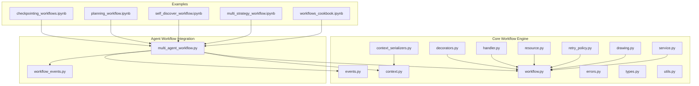
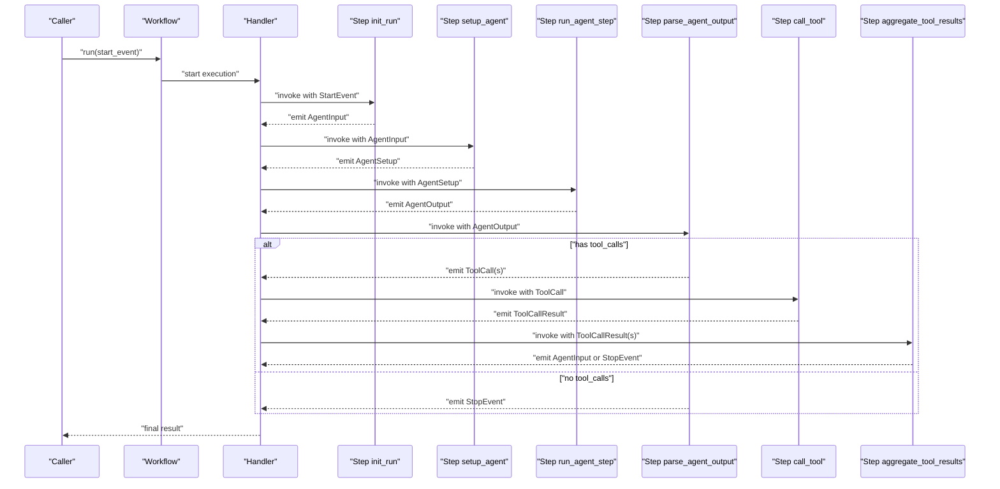
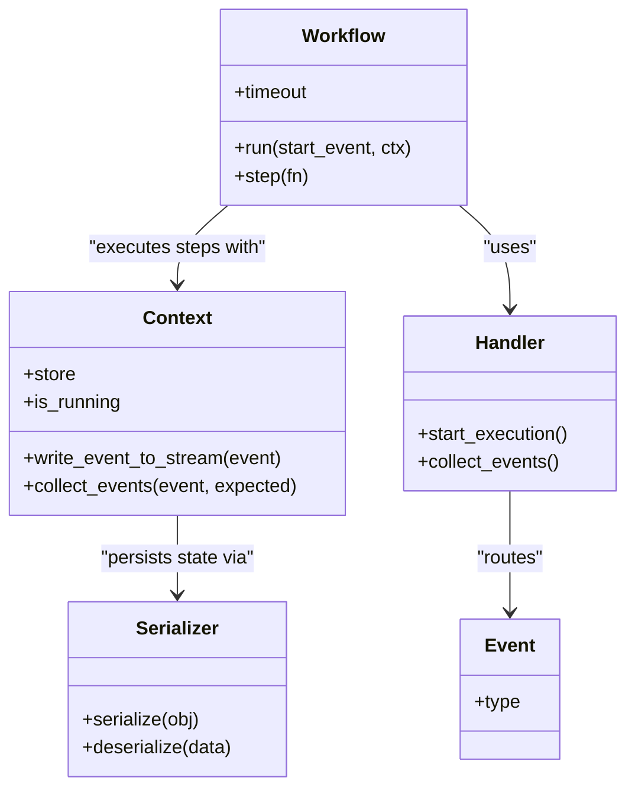
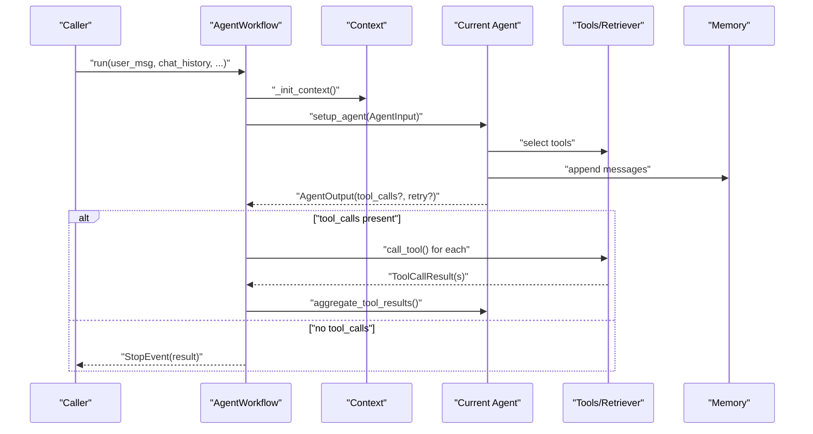
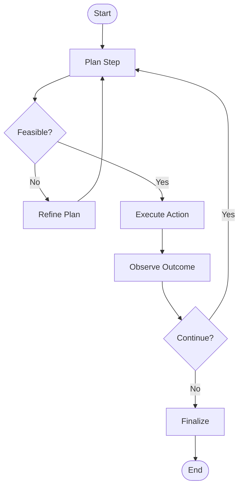
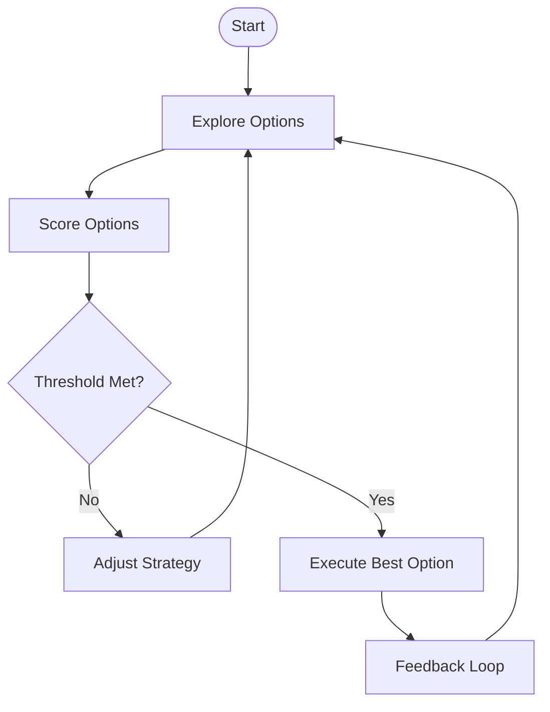
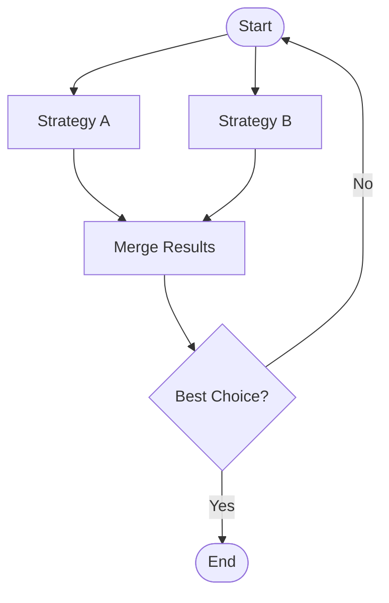
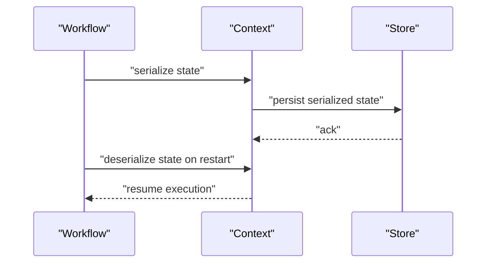
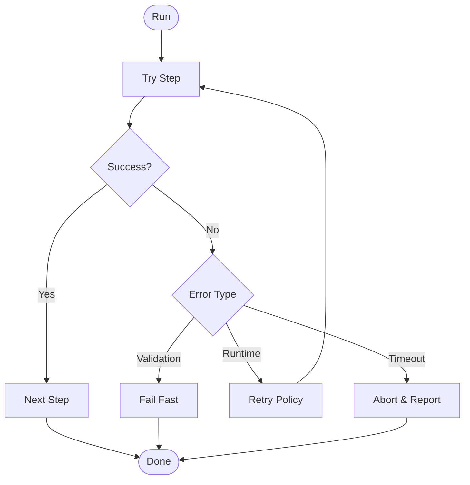
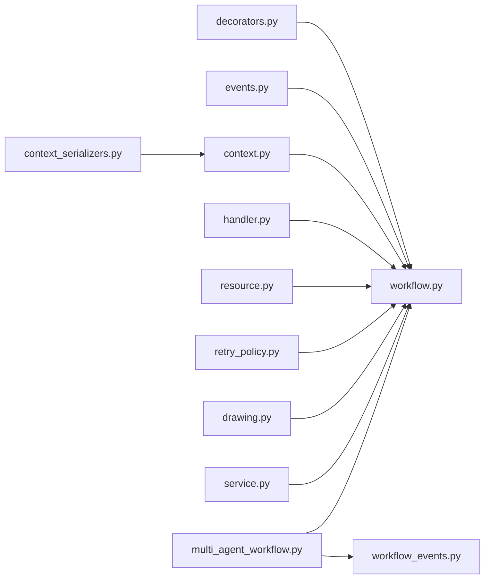

# Workflow Orchestration

<cite>
**Referenced Files in This Document**
- [workflow.py](file://llama-index-core/llama_index/core/workflow/workflow.py)
- [service.py](file://llama-index-core/llama_index/core/workflow/service.py)
- [context.py](file://llama-index-core/llama_index/core/workflow/context.py)
- [__init__.py](file://llama-index-core/llama_index/core/workflow/__init__.py)
- [context_serializers.py](file://llama-index-core/llama_index/core/workflow/context_serializers.py)
- [decorators.py](file://llama-index-core/llama_index/core/workflow/decorators.py)
- [drawing.py](file://llama-index-core/llama_index/core/workflow/drawing.py)
- [errors.py](file://llama-index-core/llama_index/core/workflow/errors.py)
- [events.py](file://llama-index-core/llama_index/core/workflow/events.py)
- [handler.py](file://llama-index-core/llama_index/core/workflow/handler.py)
- [resource.py](file://llama-index-core/llama_index/core/workflow/resource.py)
- [retry_policy.py](file://llama-index-core/llama_index/core/workflow/retry_policy.py)
- [types.py](file://llama-index-core/llama_index/core/workflow/types.py)
- [utils.py](file://llama-index-core/llama_index/core/workflow/utils.py)
- [multi_agent_workflow.py](file://llama-index-core/llama_index/core/agent/workflow/multi_agent_workflow.py)
- [workflow_events.py](file://llama-index-core/llama_index/core/agent/workflow/workflow_events.py)
- [checkpointing_workflows.ipynb](file://docs/examples/workflow/checkpointing_workflows.ipynb)
- [planning_workflow.ipynb](file://docs/examples/workflow/planning_workflow.ipynb)
- [self_discover_workflow.ipynb](file://docs/examples/workflow/self_discover_workflow.ipynb)
- [multi_strategy_workflow.ipynb](file://docs/examples/workflow/multi_strategy_workflow.ipynb)
- [workflows_cookbook.ipynb](file://docs/examples/workflow/workflows_cookbook.ipynb)
</cite>

## Table of Contents
1. [Introduction](#introduction)
2. [Project Structure](#project-structure)
3. [Core Components](#core-components)
4. [Architecture Overview](#architecture-overview)
5. [Detailed Component Analysis](#detailed-component-analysis)
6. [Dependency Analysis](#dependency-analysis)
7. [Performance Considerations](#performance-considerations)
8. [Troubleshooting Guide](#troubleshooting-guide)
9. [Conclusion](#conclusion)
10. [Appendices](#appendices)

## Introduction
This document explains workflow orchestration in LlamaIndex with a focus on the workflow engine architecture, step-by-step execution patterns, state management, planning workflows, checkpointing, parallel execution strategies, and production deployment considerations. It synthesizes the core workflow modules and demonstrates how multi-agent workflows integrate with the engine to support complex, multi-step RAG pipelines, conditional branching, dynamic adaptation, monitoring, error recovery, and performance optimization.

## Project Structure
The workflow engine lives under the core workflow package and integrates with agent workflows for multi-agent orchestration. The key areas are:
- Core workflow engine: steps, events, context, serialization, handlers, and service management
- Agent workflow integration: multi-agent orchestration built on top of the workflow engine
- Examples: notebook-based demonstrations of planning, checkpointing, multi-strategy, and self-discovery workflows

**Diagram sources**
- [workflow.py](file://llama-index-core/llama_index/core/workflow/workflow.py#L1-L2)
- [context.py](file://llama-index-core/llama_index/core/workflow/context.py#L1-L2)
- [context_serializers.py](file://llama-index-core/llama_index/core/workflow/context_serializers.py)
- [decorators.py](file://llama-index-core/llama_index/core/workflow/decorators.py)
- [events.py](file://llama-index-core/llama_index/core/workflow/events.py)
- [errors.py](file://llama-index-core/llama_index/core/workflow/errors.py)
- [handler.py](file://llama-index-core/llama_index/core/workflow/handler.py)
- [resource.py](file://llama-index-core/llama_index/core/workflow/resource.py)
- [retry_policy.py](file://llama-index-core/llama_index/core/workflow/retry_policy.py)
- [types.py](file://llama-index-core/llama_index/core/workflow/types.py)
- [utils.py](file://llama-index-core/llama_index/core/workflow/utils.py)
- [drawing.py](file://llama-index-core/llama_index/core/workflow/drawing.py)
- [service.py](file://llama-index-core/llama_index/core/workflow/service.py#L1-L2)
- [multi_agent_workflow.py](file://llama-index-core/llama_index/core/agent/workflow/multi_agent_workflow.py#L1-L827)
- [workflow_events.py](file://llama-index-core/llama_index/core/agent/workflow/workflow_events.py#L1-L145)
- [checkpointing_workflows.ipynb](file://docs/examples/workflow/checkpointing_workflows.ipynb)
- [planning_workflow.ipynb](file://docs/examples/workflow/planning_workflow.ipynb)
- [self_discover_workflow.ipynb](file://docs/examples/workflow/self_discover_workflow.ipynb)
- [multi_strategy_workflow.ipynb](file://docs/examples/workflow/multi_strategy_workflow.ipynb)
- [workflows_cookbook.ipynb](file://docs/examples/workflow/workflows_cookbook.ipynb)

**Section sources**
- [__init__.py](file://llama-index-core/llama_index/core/workflow/__init__.py#L1-L23)
- [workflow.py](file://llama-index-core/llama_index/core/workflow/workflow.py#L1-L2)
- [service.py](file://llama-index-core/llama_index/core/workflow/service.py#L1-L2)
- [context.py](file://llama-index-core/llama_index/core/workflow/context.py#L1-L2)
- [multi_agent_workflow.py](file://llama-index-core/llama_index/core/agent/workflow/multi_agent_workflow.py#L1-L827)
- [workflow_events.py](file://llama-index-core/llama_index/core/agent/workflow/workflow_events.py#L1-L145)

## Core Components
- Workflow engine: orchestrates steps via a decorator-driven model, manages execution state, events, and lifecycle
- Context: holds runtime state and provides a key-value store abstraction backed by serializers
- Events: typed event model for input, output, tool calls, streaming, and control signals
- Handler: manages asynchronous execution and event collection
- Resource management and retry policy: resource limits and retry strategies for robustness
- Drawing utilities: visualization helpers for workflow graphs
- Agent workflow integration: multi-agent orchestration built on the workflow engine with handoffs and tool invocation

Key exports and entry points are exposed via the workflow package’s public API.

**Section sources**
- [__init__.py](file://llama-index-core/llama_index/core/workflow/__init__.py#L1-L23)
- [context.py](file://llama-index-core/llama_index/core/workflow/context.py#L1-L2)
- [events.py](file://llama-index-core/llama_index/core/workflow/events.py)
- [handler.py](file://llama-index-core/llama_index/core/workflow/handler.py)
- [resource.py](file://llama-index-core/llama_index/core/workflow/resource.py)
- [retry_policy.py](file://llama-index-core/llama_index/core/workflow/retry_policy.py)
- [drawing.py](file://llama-index-core/llama_index/core/workflow/drawing.py)
- [context_serializers.py](file://llama-index-core/llama_index/core/workflow/context_serializers.py)
- [decorators.py](file://llama-index-core/llama_index/core/workflow/decorators.py)
- [types.py](file://llama-index-core/llama_index/core/workflow/types.py)
- [utils.py](file://llama-index-core/llama_index/core/workflow/utils.py)

## Architecture Overview
The workflow engine is a decorator-based step system that runs asynchronously. Steps are decorated functions that receive a Context and an Event, and can emit downstream events. The engine manages:
- Step registration and execution order
- Event routing and collection
- Streaming and structured output
- Timeout and error handling
- Serialization of state for persistence and recovery

Agent workflows extend the engine to coordinate multiple agents, manage tool selection and execution, and support handoffs and early stopping.

**Diagram sources**
- [multi_agent_workflow.py](file://llama-index-core/llama_index/core/agent/workflow/multi_agent_workflow.py#L378-L744)
- [workflow_events.py](file://llama-index-core/llama_index/core/agent/workflow/workflow_events.py#L24-L145)
- [handler.py](file://llama-index-core/llama_index/core/workflow/handler.py)
- [workflow.py](file://llama-index-core/llama_index/core/workflow/workflow.py#L1-L2)

## Detailed Component Analysis

### Workflow Engine Core
- Step decoration and execution: steps are defined using a decorator and executed in order, with automatic event emission and collection
- Context and serialization: Context stores state and supports pluggable serializers for persistence
- Events: typed events enable deterministic routing and structured streaming
- Handler: manages asynchronous execution, event buffering, and collection windows
- Resource and retry: resource limits and retry policies help stabilize long-running workflows
- Drawing and visualization: utilities to render workflow graphs for debugging and documentation

**Diagram sources**
- [workflow.py](file://llama-index-core/llama_index/core/workflow/workflow.py#L1-L2)
- [context.py](file://llama-index-core/llama_index/core/workflow/context.py#L1-L2)
- [events.py](file://llama-index-core/llama_index/core/workflow/events.py)
- [handler.py](file://llama-index-core/llama_index/core/workflow/handler.py)
- [context_serializers.py](file://llama-index-core/llama_index/core/workflow/context_serializers.py)
- [decorators.py](file://llama-index-core/llama_index/core/workflow/decorators.py)

**Section sources**
- [workflow.py](file://llama-index-core/llama_index/core/workflow/workflow.py#L1-L2)
- [context.py](file://llama-index-core/llama_index/core/workflow/context.py#L1-L2)
- [context_serializers.py](file://llama-index-core/llama_index/core/workflow/context_serializers.py)
- [events.py](file://llama-index-core/llama_index/core/workflow/events.py)
- [handler.py](file://llama-index-core/llama_index/core/workflow/handler.py)
- [resource.py](file://llama-index-core/llama_index/core/workflow/resource.py)
- [retry_policy.py](file://llama-index-core/llama_index/core/workflow/retry_policy.py)
- [drawing.py](file://llama-index-core/llama_index/core/workflow/drawing.py)
- [decorators.py](file://llama-index-core/llama_index/core/workflow/decorators.py)

### Multi-Agent Workflow Orchestration
The multi-agent workflow builds on the engine to:
- Initialize context (memory, agents, handoff rules, state)
- Route messages to the current agent
- Execute agent steps (including tool selection and execution)
- Aggregate tool results and decide next actions (handoff, continue, or stop)
- Support early stopping and structured output generation

**Diagram sources**
- [multi_agent_workflow.py](file://llama-index-core/llama_index/core/agent/workflow/multi_agent_workflow.py#L378-L744)
- [workflow_events.py](file://llama-index-core/llama_index/core/agent/workflow/workflow_events.py#L24-L145)

**Section sources**
- [multi_agent_workflow.py](file://llama-index-core/llama_index/core/agent/workflow/multi_agent_workflow.py#L1-L827)
- [workflow_events.py](file://llama-index-core/llama_index/core/agent/workflow/workflow_events.py#L1-L145)

### Planning Workflows
Planning workflows demonstrate structured multi-step reasoning and iterative refinement. They typically:
- Define planning steps that generate candidate actions or plans
- Evaluate feasibility and refine plans iteratively
- Integrate retrieval and synthesis steps conditionally
- Use checkpoints to resume from intermediate states

**Diagram sources**
- [planning_workflow.ipynb](file://docs/examples/workflow/planning_workflow.ipynb)

**Section sources**
- [planning_workflow.ipynb](file://docs/examples/workflow/planning_workflow.ipynb)

### Self-Discover Workflows
Self-discover workflows dynamically adapt the pipeline based on observed outcomes, enabling:
- Dynamic tool selection and plan adjustment
- Conditional branching based on intermediate results
- Iterative exploration until a target is achieved

**Diagram sources**
- [self_discover_workflow.ipynb](file://docs/examples/workflow/self_discover_workflow.ipynb)

**Section sources**
- [self_discover_workflow.ipynb](file://docs/examples/workflow/self_discover_workflow.ipynb)

### Multi-Strategy Workflows
Multi-strategy workflows combine different retrieval or synthesis strategies:
- Parallel or sequential strategy selection
- Dynamic switching based on query characteristics
- Aggregation of results with confidence scoring

**Diagram sources**
- [multi_strategy_workflow.ipynb](file://docs/examples/workflow/multi_strategy_workflow.ipynb)

**Section sources**
- [multi_strategy_workflow.ipynb](file://docs/examples/workflow/multi_strategy_workflow.ipynb)

### Checkpointing Mechanisms
Checkpointing enables durable state persistence and recovery:
- Serialize Context state at key steps
- Resume execution from checkpoints
- Handle partial failures and retries

**Diagram sources**
- [checkpointing_workflows.ipynb](file://docs/examples/workflow/checkpointing_workflows.ipynb)
- [context_serializers.py](file://llama-index-core/llama_index/core/workflow/context_serializers.py)

**Section sources**
- [checkpointing_workflows.ipynb](file://docs/examples/workflow/checkpointing_workflows.ipynb)
- [context_serializers.py](file://llama-index-core/llama_index/core/workflow/context_serializers.py)

### Parallel Execution Strategies
Parallelism can be applied at multiple levels:
- Parallel tool execution within a step
- Parallel strategy evaluation in multi-strategy workflows
- Asynchronous streaming of intermediate results

Guidance:
- Use event collection windows to batch and process parallel results
- Apply resource limits to avoid contention
- Ensure thread-safe tool access and idempotent operations

**Section sources**
- [multi_agent_workflow.py](file://llama-index-core/llama_index/core/agent/workflow/multi_agent_workflow.py#L627-L744)
- [handler.py](file://llama-index-core/llama_index/core/workflow/handler.py)
- [resource.py](file://llama-index-core/llama_index/core/workflow/resource.py)

### Monitoring, Error Recovery, and Validation
- WorkflowRuntimeError, WorkflowTimeoutError, WorkflowValidationError provide explicit failure modes
- RetryPolicy controls transient failure handling
- Structured output validation ensures downstream compatibility

**Diagram sources**
- [errors.py](file://llama-index-core/llama_index/core/workflow/errors.py)
- [retry_policy.py](file://llama-index-core/llama_index/core/workflow/retry_policy.py)
- [workflow_events.py](file://llama-index-core/llama_index/core/agent/workflow/workflow_events.py#L70-L94)

**Section sources**
- [errors.py](file://llama-index-core/llama_index/core/workflow/errors.py)
- [retry_policy.py](file://llama-index-core/llama_index/core/workflow/retry_policy.py)
- [workflow_events.py](file://llama-index-core/llama_index/core/agent/workflow/workflow_events.py#L1-L145)

### Composition, Reusability, and Production Deployment
- Compose reusable steps and events to build domain-specific workflows
- Encapsulate common patterns (retrieval, synthesis, tool orchestration) as step libraries
- Use serializers and service managers for environment-agnostic deployments
- Instrument workflows with observability hooks for production monitoring

**Section sources**
- [__init__.py](file://llama-index-core/llama_index/core/workflow/__init__.py#L1-L23)
- [service.py](file://llama-index-core/llama_index/core/workflow/service.py#L1-L2)
- [drawing.py](file://llama-index-core/llama_index/core/workflow/drawing.py)

## Dependency Analysis
The workflow engine depends on:
- Context for state and serialization
- Events for deterministic routing
- Handler for execution orchestration
- Decorators for step definition
- Resource and retry policies for resilience
- Agent workflow integration for multi-agent scenarios

**Diagram sources**
- [workflow.py](file://llama-index-core/llama_index/core/workflow/workflow.py#L1-L2)
- [context.py](file://llama-index-core/llama_index/core/workflow/context.py#L1-L2)
- [decorators.py](file://llama-index-core/llama_index/core/workflow/decorators.py)
- [events.py](file://llama-index-core/llama_index/core/workflow/events.py)
- [handler.py](file://llama-index-core/llama_index/core/workflow/handler.py)
- [resource.py](file://llama-index-core/llama_index/core/workflow/resource.py)
- [retry_policy.py](file://llama-index-core/llama_index/core/workflow/retry_policy.py)
- [drawing.py](file://llama-index-core/llama_index/core/workflow/drawing.py)
- [context_serializers.py](file://llama-index-core/llama_index/core/workflow/context_serializers.py)
- [service.py](file://llama-index-core/llama_index/core/workflow/service.py#L1-L2)
- [multi_agent_workflow.py](file://llama-index-core/llama_index/core/agent/workflow/multi_agent_workflow.py#L1-L827)
- [workflow_events.py](file://llama-index-core/llama_index/core/agent/workflow/workflow_events.py#L1-L145)

**Section sources**
- [__init__.py](file://llama-index-core/llama_index/core/workflow/__init__.py#L1-L23)

## Performance Considerations
- Minimize context size and use efficient serializers to reduce checkpoint overhead
- Batch tool calls and leverage parallelism judiciously with resource caps
- Stream intermediate results to improve perceived latency
- Tune timeouts and retry policies to balance reliability and responsiveness
- Use selective event collection to avoid excessive memory usage

[No sources needed since this section provides general guidance]

## Troubleshooting Guide
Common issues and remedies:
- Validation failures: ensure inputs conform to expected schemas; use structured output validation
- Runtime errors: inspect step logs and apply retry policies; consider aborting on irrecoverable conditions
- Timeouts: increase timeouts for long-running steps; split workloads into smaller steps
- Deadlocks: avoid synchronous blocking in steps; use asynchronous primitives and event collection windows

**Section sources**
- [errors.py](file://llama-index-core/llama_index/core/workflow/errors.py)
- [retry_policy.py](file://llama-index-core/llama_index/core/workflow/retry_policy.py)
- [handler.py](file://llama-index-core/llama_index/core/workflow/handler.py)

## Conclusion
LlamaIndex’s workflow engine provides a flexible, extensible foundation for orchestrating complex, multi-step RAG pipelines. By combining deterministic step execution, robust state management, and multi-agent coordination, teams can build adaptive, observable, and production-ready systems. The included examples illustrate planning, checkpointing, and multi-strategy patterns, while the engine’s APIs support scalable deployment and maintenance.

[No sources needed since this section summarizes without analyzing specific files]

## Appendices

### Practical Examples Index
- Planning workflows: [planning_workflow.ipynb](file://docs/examples/workflow/planning_workflow.ipynb)
- Self-discover workflows: [self_discover_workflow.ipynb](file://docs/examples/workflow/self_discover_workflow.ipynb)
- Multi-strategy workflows: [multi_strategy_workflow.ipynb](file://docs/examples/workflow/multi_strategy_workflow.ipynb)
- Checkpointing workflows: [checkpointing_workflows.ipynb](file://docs/examples/workflow/checkpointing_workflows.ipynb)
- Workflow cookbook: [workflows_cookbook.ipynb](file://docs/examples/workflow/workflows_cookbook.ipynb)

**Section sources**
- [planning_workflow.ipynb](file://docs/examples/workflow/planning_workflow.ipynb)
- [self_discover_workflow.ipynb](file://docs/examples/workflow/self_discover_workflow.ipynb)
- [multi_strategy_workflow.ipynb](file://docs/examples/workflow/multi_strategy_workflow.ipynb)
- [checkpointing_workflows.ipynb](file://docs/examples/workflow/checkpointing_workflows.ipynb)
- [workflows_cookbook.ipynb](file://docs/examples/workflow/workflows_cookbook.ipynb)