# Basic RAG Patterns

<cite>
**Referenced Files in This Document**
- [__init__.py](file://llama-index-core/llama_index/core/__init__.py)
- [__init__.py](file://llama-index-core/llama_index/core/query_engine/__init__.py)
- [retriever_query_engine.py](file://llama-index-core/llama_index/core/query_engine/retriever_query_engine.py)
- [router_query_engine.py](file://llama-index-core/llama_index/core/query_engine/router_query_engine.py)
- [sub_question_query_engine.py](file://llama-index-core/llama_index/core/query_engine/sub_question_query_engine.py)
- [multistep_query_engine.py](file://llama-index-core/llama_index/core/query_engine/multistep_query_engine.py)
- [retry_query_engine.py](file://llama-index-core/llama_index/core/query_engine/retry_query_engine.py)
- [transform_query_engine.py](file://llama-index-core/llama_index/core/query_engine/transform_query_engine.py)
- [knowledge_graph_query_engine.py](file://llama-index-core/llama_index/core/query_engine/knowledge_graph_query_engine.py)
- [__init__.py](file://llama-index-core/llama_index/core/chat_engine/__init__.py)
- [simple.py](file://llama-index-core/llama_index/core/chat_engine/simple.py)
- [condense_question.py](file://llama-index-core/llama_index/core/chat_engine/condense_question.py)
- [context.py](file://llama-index-core/llama_index/core/chat_engine/context.py)
- [condense_plus_context.py](file://llama-index-core/llama_index/core/chat_engine/condense_plus_context.py)
- [multi_modal_context.py](file://llama-index-core/llama_index/core/chat_engine/multi_modal_context.py)
- [multi_modal_condense_plus_context.py](file://llama-index-core/llama_index/core/chat_engine/multi_modal_condense_plus_context.py)
- [__init__.py](file://llama-index-core/llama_index/core/response_synthesizers/__init__.py)
- [refine.py](file://llama-index-core/llama_index/core/response_synthesizers/refine.py)
- [tree_summarize.py](file://llama-index-core/llama_index/core/response_synthesizers/tree_summarize.py)
- [simple_summarize.py](file://llama-index-core/llama_index/core/response_synthesizers/simple_summarize.py)
- [compact_and_refine.py](file://llama-index-core/llama_index/core/response_synthesizers/compact_and_refine.py)
- [accumulate.py](file://llama-index-core/llama_index/core/response_synthesizers/accumulate.py)
- [generation.py](file://llama-index-core/llama_index/core/response_synthesizers/generation.py)
- [factory.py](file://llama-index-core/llama_index/core/response_synthesizers/factory.py)
- [type.py](file://llama-index-core/llama_index/core/response_synthesizers/type.py)
- [__init__.py](file://llama-index-core/llama_index/core/postprocessor/__init__.py)
- [llm_rerank.py](file://llama-index-core/llama_index/core/postprocessor/llm_rerank.py)
- [sbert_rerank.py](file://llama-index-core/llama_index/core/postprocessor/sbert_rerank.py)
- [structured_llm_rerank.py](file://llama-index-core/llama_index/core/postprocessor/structured_llm_rerank.py)
- [node.py](file://llama-index-core/llama_index/core/postprocessor/node.py)
- [node_recency.py](file://llama-index-core/llama_index/core/postprocessor/node_recency.py)
- [optimizer.py](file://llama-index-core/llama_index/core/postprocessor/optimizer.py)
- [pii.py](file://llama-index-core/llama_index/core/postprocessor/pii.py)
- [__init__.py](file://llama-index-core/llama_index/core/retrievers/__init__.py)
- [router_retriever.py](file://llama-index-core/llama_index/core/retrievers/router_retriever.py)
- [fusion_retriever.py](file://llama-index-core/llama_index/core/retrievers/fusion_retriever.py)
- [recursive_retriever.py](file://llama-index-core/llama_index/core/retrievers/recursive_retriever.py)
- [auto_merging_retriever.py](file://llama-index-core/llama_index/core/retrievers/auto_merging_retriever.py)
- [transform_retriever.py](file://llama-index-core/llama_index/core/retrievers/transform_retriever.py)
- [sql_retriever.py](file://llama-index-core/llama_index/core/indices/struct_store/sql_retriever.py)
- [vector_store_retrievers.py](file://llama-index-core/llama_index/core/indices/vector_store/retrievers.py)
- [keyword_table_retrievers.py](file://llama-index-core/llama_index/core/indices/keyword_table/retrievers.py)
- [tree_all_leaf_retriever.py](file://llama-index-core/llama_index/core/indices/tree/all_leaf_retriever.py)
- [tree_select_leaf_retriever.py](file://llama-index-core/llama_index/core/indices/tree/select_leaf_retriever.py)
- [tree_select_leaf_embedding_retriever.py](file://llama-index-core/llama_index/core/indices/tree/select_leaf_embedding_retriever.py)
- [tree_root_retriever.py](file://llama-index-core/llama_index/core/indices/tree/tree_root_retriever.py)
- [empty_retrievers.py](file://llama-index-core/llama_index/core/indices/empty/retrievers.py)
- [image_retriever.py](file://llama-index-core/llama_index/core/image_retriever.py)
- [service_context.py](file://llama-index-core/llama_index/core/service_context.py)
- [schema.py](file://llama-index-core/llama_index/core/schema.py)
- [response.py](file://llama-index-core/llama_index/core/response/response.py)
- [base.py](file://llama-index-core/llama_index/core/base/base_query_engine.py)
- [base.py](file://llama-index-core/llama_index/core/base/base_retriever.py)
- [base.py](file://llama-index-core/llama_index/core/base/base_node_postprocessor.py)
- [base.py](file://llama-index-core/llama_index/core/base/base_response_synthesizer.py)
- [base.py](file://llama-index-core/llama_index/core/base/base_chat_engine.py)
- [index.md](file://docs/examples/query_engine/custom_query_engine.ipynb)
- [RetrieverRouterQueryEngine.ipynb](file://docs/examples/query_engine/RetrieverRouterQueryEngine.ipynb)
- [RouterQueryEngine.ipynb](file://docs/examples/query_engine/RouterQueryEngine.ipynb)
- [ensemble_query_engine.ipynb](file://docs/examples/query_engine/ensemble_query_engine.ipynb)
- [sub_question_query_engine.ipynb](file://docs/examples/query_engine/sub_question_query_engine.ipynb)
- [knowledge_graph_query_engine.ipynb](file://docs/examples/query_engine/knowledge_graph_query_engine.ipynb)
- [chat_engine_best.ipynb](file://docs/examples/chat_engine/chat_engine_best.ipynb)
- [chat_engine_condense_plus_context.ipynb](file://docs/examples/chat_engine/chat_engine_condense_plus_context.ipynb)
- [chat_engine_condense_question.ipynb](file://docs/examples/chat_engine/chat_engine_condense_question.ipynb)
- [chat_engine_context.ipynb](file://docs/examples/chat_engine/chat_engine_context.ipynb)
- [refine.ipynb](file://docs/examples/response_synthesizers/refine.ipynb)
- [tree_summarize.ipynb](file://docs/examples/response_synthesizers/tree_summarize.ipynb)
- [CohereRerank.ipynb](file://docs/examples/node_postprocessor/CohereRerank.ipynb)
- [SentenceTransformerRerank.ipynb](file://docs/examples/node_postprocessor/SentenceTransformerRerank.ipynb)
- [AIMonRerank.ipynb](file://docs/examples/node_postprocessor/AIMonRerank.ipynb)
- [LongContextReorder.ipynb](file://docs/examples/node_postprocessor/LongContextReorder.ipynb)
- [RecencyPostprocessorDemo.ipynb](file://docs/examples/node_postprocessor/RecencyPostprocessorDemo.ipynb)
- [PrevNextPostprocessorDemo.ipynb](file://docs/examples/node_postprocessor/PrevNextPostprocessorDemo.ipynb)
- [PII.ipynb](file://docs/examples/node_postprocessor/PII.ipynb)
- [OptimizerDemo.ipynb](file://docs/examples/node_postprocessor/OptimizerDemo.ipynb)
</cite>

## Table of Contents
1. [Introduction](#introduction)
2. [Project Structure](#project-structure)
3. [Core Components](#core-components)
4. [Architecture Overview](#architecture-overview)
5. [Detailed Component Analysis](#detailed-component-analysis)
6. [Dependency Analysis](#dependency-analysis)
7. [Performance Considerations](#performance-considerations)
8. [Troubleshooting Guide](#troubleshooting-guide)
9. [Conclusion](#conclusion)
10. [Appendices](#appendices)

## Introduction
This document explains fundamental Retrieval-Augmented Generation (RAG) patterns and workflows in LlamaIndex. It covers basic query engines, chat engines, response synthesizers, and post-processing techniques. It also documents common patterns such as simple retrieval, conversational RAG, and hybrid search approaches, along with guidance on customizing response synthesis, implementing retrieval chains, and adding relevance ranking. The goal is to help you choose appropriate patterns for different use cases and understand how components integrate to form complete RAG systems.

## Project Structure
LlamaIndex organizes RAG capabilities around four primary building blocks:
- Retrievers: fetch relevant nodes from indices or external sources
- Query Engines: orchestrate retrieval, optional routing, and response synthesis
- Chat Engines: manage conversational context and history
- Response Synthesizers: produce final answers from retrieved nodes
- Post-processors: filter, reorder, and refine node lists

**Diagram sources**
- [__init__.py](file://llama-index-core/llama_index/core/retrievers/__init__.py#L1-L89)
- [retriever_query_engine.py](file://llama-index-core/llama_index/core/query_engine/retriever_query_engine.py)
- [router_query_engine.py](file://llama-index-core/llama_index/core/query_engine/router_query_engine.py)
- [sub_question_query_engine.py](file://llama-index-core/llama_index/core/query_engine/sub_question_query_engine.py)
- [multistep_query_engine.py](file://llama-index-core/llama_index/core/query_engine/multistep_query_engine.py)
- [transform_query_engine.py](file://llama-index-core/llama_index/core/query_engine/transform_query_engine.py)
- [knowledge_graph_query_engine.py](file://llama-index-core/llama_index/core/query_engine/knowledge_graph_query_engine.py)
- [__init__.py](file://llama-index-core/llama_index/core/response_synthesizers/__init__.py#L1-L26)
- [__init__.py](file://llama-index-core/llama_index/core/postprocessor/__init__.py#L1-L48)

**Section sources**
- [__init__.py](file://llama-index-core/llama_index/core/__init__.py#L24-L48)
- [__init__.py](file://llama-index-core/llama_index/core/query_engine/__init__.py#L1-L88)
- [__init__.py](file://llama-index-core/llama_index/core/chat_engine/__init__.py#L1-L22)
- [__init__.py](file://llama-index-core/llama_index/core/response_synthesizers/__init__.py#L1-L26)
- [__init__.py](file://llama-index-core/llama_index/core/postprocessor/__init__.py#L1-L48)

## Core Components
- Retrievers: Retrieve relevant nodes from indices or external sources. Examples include vector, keyword, tree, SQL, recursive, fusion, auto-merging, and transform retrievers.
- Query Engines: Orchestrate retrieval and optional routing, then pass nodes to a response synthesizer. Core engines include RetrieverQueryEngine, RouterQueryEngine, SubQuestionQueryEngine, MultiStepQueryEngine, TransformQueryEngine, and KnowledgeGraphQueryEngine.
- Chat Engines: Manage conversational context and history. Available engines include SimpleChatEngine, CondenseQuestionChatEngine, ContextChatEngine, CondensePlusContextChatEngine, and multi-modal variants.
- Response Synthesizers: Produce final answers from retrieved nodes. Options include Refine, TreeSummarize, SimpleSummarize, CompactAndRefine, Accumulate, and Generation.
- Post-processors: Filter, reorder, and refine node lists. Examples include LLM-based rerankers, sentence-transformer rerankers, structured LLM rerankers, similarity and keyword filters, recency processors, and embedding optimizers.

**Section sources**
- [__init__.py](file://llama-index-core/llama_index/core/retrievers/__init__.py#L1-L89)
- [__init__.py](file://llama-index-core/llama_index/core/query_engine/__init__.py#L1-L88)
- [__init__.py](file://llama-index-core/llama_index/core/chat_engine/__init__.py#L1-L22)
- [__init__.py](file://llama-index-core/llama_index/core/response_synthesizers/__init__.py#L1-L26)
- [__init__.py](file://llama-index-core/llama_index/core/postprocessor/__init__.py#L1-L48)

## Architecture Overview
The typical RAG pipeline integrates retrievers, optional routers, and a response synthesizer. Post-processors can refine the node list before synthesis.

**Diagram sources**
- [simple.py](file://llama-index-core/llama_index/core/chat_engine/simple.py)
- [condense_question.py](file://llama-index-core/llama_index/core/chat_engine/condense_question.py)
- [context.py](file://llama-index-core/llama_index/core/chat_engine/context.py)
- [condense_plus_context.py](file://llama-index-core/llama_index/core/chat_engine/condense_plus_context.py)
- [multi_modal_context.py](file://llama-index-core/llama_index/core/chat_engine/multi_modal_context.py)
- [multi_modal_condense_plus_context.py](file://llama-index-core/llama_index/core/chat_engine/multi_modal_condense_plus_context.py)
- [retriever_query_engine.py](file://llama-index-core/llama_index/core/query_engine/retriever_query_engine.py)
- [router_query_engine.py](file://llama-index-core/llama_index/core/query_engine/router_query_engine.py)
- [llm_rerank.py](file://llama-index-core/llama_index/core/postprocessor/llm_rerank.py)
- [sbert_rerank.py](file://llama-index-core/llama_index/core/postprocessor/sbert_rerank.py)
- [structured_llm_rerank.py](file://llama-index-core/llama_index/core/postprocessor/structured_llm_rerank.py)
- [refine.py](file://llama-index-core/llama_index/core/response_synthesizers/refine.py)
- [tree_summarize.py](file://llama-index-core/llama_index/core/response_synthesizers/tree_summarize.py)
- [simple_summarize.py](file://llama-index-core/llama_index/core/response_synthesizers/simple_summarize.py)

## Detailed Component Analysis

### Query Engines: Simple Retrieval and Routing
- RetrieverQueryEngine: Wraps a retriever and passes retrieved nodes to a response synthesizer. Supports optional post-processing steps.
- RouterQueryEngine: Routes queries to different retrievers or indices based on query characteristics.
- RetrieverRouterQueryEngine: A specialized router that selects among multiple retrievers.
- SubQuestionQueryEngine: Decomposes a question into sub-questions, retrieves per sub-question, and aggregates answers.
- MultiStepQueryEngine: Chains multiple query engines or steps for complex workflows.
- TransformQueryEngine: Applies transformations to queries before retrieval.
- KnowledgeGraphQueryEngine: Integrates knowledge graph traversal with retrieval.

**Diagram sources**
- [base.py](file://llama-index-core/llama_index/core/base/base_query_engine.py)
- [retriever_query_engine.py](file://llama-index-core/llama_index/core/query_engine/retriever_query_engine.py)
- [router_query_engine.py](file://llama-index-core/llama_index/core/query_engine/router_query_engine.py)
- [sub_question_query_engine.py](file://llama-index-core/llama_index/core/query_engine/sub_question_query_engine.py)
- [multistep_query_engine.py](file://llama-index-core/llama_index/core/query_engine/multistep_query_engine.py)
- [transform_query_engine.py](file://llama-index-core/llama_index/core/query_engine/transform_query_engine.py)
- [knowledge_graph_query_engine.py](file://llama-index-core/llama_index/core/query_engine/knowledge_graph_query_engine.py)

**Section sources**
- [retriever_query_engine.py](file://llama-index-core/llama_index/core/query_engine/retriever_query_engine.py)
- [router_query_engine.py](file://llama-index-core/llama_index/core/query_engine/router_query_engine.py)
- [sub_question_query_engine.py](file://llama-index-core/llama_index/core/query_engine/sub_question_query_engine.py)
- [multistep_query_engine.py](file://llama-index-core/llama_index/core/query_engine/multistep_query_engine.py)
- [transform_query_engine.py](file://llama-index-core/llama_index/core/query_engine/transform_query_engine.py)
- [knowledge_graph_query_engine.py](file://llama-index-core/llama_index/core/query_engine/knowledge_graph_query_engine.py)

### Chat Engines: Conversational RAG
- SimpleChatEngine: Basic chat without extra context handling.
- CondenseQuestionChatEngine: Condenses conversation history into a single question for retrieval.
- ContextChatEngine: Passes conversation context directly to downstream components.
- CondensePlusContextChatEngine: Combines condensing and context passing strategies.
- MultiModal variants: Support multimodal inputs and outputs.

**Diagram sources**
- [base.py](file://llama-index-core/llama_index/core/base/base_chat_engine.py)
- [simple.py](file://llama-index-core/llama_index/core/chat_engine/simple.py)
- [condense_question.py](file://llama-index-core/llama_index/core/chat_engine/condense_question.py)
- [context.py](file://llama-index-core/llama_index/core/chat_engine/context.py)
- [condense_plus_context.py](file://llama-index-core/llama_index/core/chat_engine/condense_plus_context.py)
- [multi_modal_context.py](file://llama-index-core/llama_index/core/chat_engine/multi_modal_context.py)
- [multi_modal_condense_plus_context.py](file://llama-index-core/llama_index/core/chat_engine/multi_modal_condense_plus_context.py)

**Section sources**
- [simple.py](file://llama-index-core/llama_index/core/chat_engine/simple.py)
- [condense_question.py](file://llama-index-core/llama_index/core/chat_engine/condense_question.py)
- [context.py](file://llama-index-core/llama_index/core/chat_engine/context.py)
- [condense_plus_context.py](file://llama-index-core/llama_index/core/chat_engine/condense_plus_context.py)
- [multi_modal_context.py](file://llama-index-core/llama_index/core/chat_engine/multi_modal_context.py)
- [multi_modal_condense_plus_context.py](file://llama-index-core/llama_index/core/chat_engine/multi_modal_condense_plus_context.py)

### Response Synthesizers: Customizing Answer Generation
- Refine: Iteratively refine an initial answer using each retrieved node.
- TreeSummarize: Build a tree of summaries and aggregate at leaves.
- SimpleSummarize: Summarize all nodes into a single answer.
- CompactAndRefine: Compact context windows and then refine.
- Accumulate: Accumulate answers across nodes.
- Generation: Generate answers directly from context windows.

**Diagram sources**
- [base.py](file://llama-index-core/llama_index/core/base/base_response_synthesizer.py)
- [refine.py](file://llama-index-core/llama_index/core/response_synthesizers/refine.py)
- [tree_summarize.py](file://llama-index-core/llama_index/core/response_synthesizers/tree_summarize.py)
- [simple_summarize.py](file://llama-index-core/llama_index/core/response_synthesizers/simple_summarize.py)
- [compact_and_refine.py](file://llama-index-core/llama_index/core/response_synthesizers/compact_and_refine.py)
- [accumulate.py](file://llama-index-core/llama_index/core/response_synthesizers/accumulate.py)
- [generation.py](file://llama-index-core/llama_index/core/response_synthesizers/generation.py)

**Section sources**
- [refine.py](file://llama-index-core/llama_index/core/response_synthesizers/refine.py)
- [tree_summarize.py](file://llama-index-core/llama_index/core/response_synthesizers/tree_summarize.py)
- [simple_summarize.py](file://llama-index-core/llama_index/core/response_synthesizers/simple_summarize.py)
- [compact_and_refine.py](file://llama-index-core/llama_index/core/response_synthesizers/compact_and_refine.py)
- [accumulate.py](file://llama-index-core/llama_index/core/response_synthesizers/accumulate.py)
- [generation.py](file://llama-index-core/llama_index/core/response_synthesizers/generation.py)

### Post-processing: Relevance Ranking and Filtering
- LLMRerank: Uses an LLM to re-rank nodes.
- SentenceTransformerRerank: Uses dense semantic similarity for reranking.
- StructuredLLMRerank: Produces structured relevance scores.
- SimilarityPostprocessor and KeywordNodePostprocessor: Filter nodes by similarity or keywords.
- PrevNextNodePostprocessor and AutoPrevNextNodePostprocessor: Reorder nodes based on adjacency.
- EmbeddingRecencyPostprocessor, FixedRecencyPostprocessor, TimeWeightedPostprocessor: Apply recency-aware filtering.
- SentenceEmbeddingOptimizer: Reduces token usage by pruning nodes.
- PIINodePostprocessor and NERPIINodePostprocessor: Remove or anonymize PII.

**Diagram sources**
- [llm_rerank.py](file://llama-index-core/llama_index/core/postprocessor/llm_rerank.py)
- [sbert_rerank.py](file://llama-index-core/llama_index/core/postprocessor/sbert_rerank.py)
- [structured_llm_rerank.py](file://llama-index-core/llama_index/core/postprocessor/structured_llm_rerank.py)
- [node.py](file://llama-index-core/llama_index/core/postprocessor/node.py)
- [node_recency.py](file://llama-index-core/llama_index/core/postprocessor/node_recency.py)
- [optimizer.py](file://llama-index-core/llama_index/core/postprocessor/optimizer.py)
- [pii.py](file://llama-index-core/llama_index/core/postprocessor/pii.py)

**Section sources**
- [llm_rerank.py](file://llama-index-core/llama_index/core/postprocessor/llm_rerank.py)
- [sbert_rerank.py](file://llama-index-core/llama_index/core/postprocessor/sbert_rerank.py)
- [structured_llm_rerank.py](file://llama-index-core/llama_index/core/postprocessor/structured_llm_rerank.py)
- [node.py](file://llama-index-core/llama_index/core/postprocessor/node.py)
- [node_recency.py](file://llama-index-core/llama_index/core/postprocessor/node_recency.py)
- [optimizer.py](file://llama-index-core/llama_index/core/postprocessor/optimizer.py)
- [pii.py](file://llama-index-core/llama_index/core/postprocessor/pii.py)

### Retrievers: Implementing Retrieval Chains
- VectorIndexRetriever and VectorIndexAutoRetriever: Vector store-based retrieval with auto mode.
- KeywordTableSimpleRetriever: Keyword table retrieval.
- Tree-based retrievers: TreeAllLeafRetriever, TreeSelectLeafRetriever, TreeSelectLeafEmbeddingRetriever, TreeRootRetriever.
- SQLRetriever: Struct store retrieval for SQL-backed contexts.
- RecursiveRetriever, QueryFusionRetriever, AutoMergingRetriever, TransformRetriever: Advanced chaining and fusion strategies.
- RouterRetriever: Route to different retrievers.
- ImageRetriever: Retrieve images.

```mermaid
classDiagram
class BaseRetriever
class VectorIndexRetriever
class VectorIndexAutoRetriever
class KeywordTableSimpleRetriever
class TreeAllLeafRetriever
class TreeSelectLeafRetriever
class TreeSelectLeafEmbeddingRetriever
class TreeRootRetriever
class SQLRetriever
class RecursiveRetriever
class QueryFusionRetriever
class AutoMergingRetriever
class TransformRetriever
class RouterRetriever
class BaseImageRetriever
BaseRetriever <|-- VectorIndexRetriever
BaseRetriever <|-- VectorIndexAutoRetriever
BaseRetriever <|-- KeywordTableSimpleRetriever
BaseRetriever <|-- TreeAllLeafRetriever
BaseRetriever <|-- TreeSelectLeafRetriever
BaseRetriever <|-- TreeSelectLeafEmbeddingRetriever
BaseRetriever <|-- TreeRootRetriever
BaseRetriever <|-- SQLRetriever
BaseRetriever <|-- RecursiveRetriever
BaseRetriever <|-- QueryFusionRetriever
BaseRetriever <|-- AutoMergingRetriever
BaseRetriever <|-- TransformRetriever
BaseRetriever <|-- RouterRetriever
BaseRetriever <|-- BaseImageRetriever
```

**Diagram sources**
- [base.py](file://llama-index-core/llama_index/core/base/base_retriever.py)
- [vector_store_retrievers.py](file://llama-index-core/llama_index/core/indices/vector_store/retrievers.py)
- [keyword_table_retrievers.py](file://llama-index-core/llama_index/core/indices/keyword_table/retrievers.py)
- [tree_all_leaf_retriever.py](file://llama-index-core/llama_index/core/indices/tree/all_leaf_retriever.py)
- [tree_select_leaf_retriever.py](file://llama-index-core/llama_index/core/indices/tree/select_leaf_retriever.py)
- [tree_select_leaf_embedding_retriever.py](file://llama-index-core/llama_index/core/indices/tree/select_leaf_embedding_retriever.py)
- [tree_root_retriever.py](file://llama-index-core/llama_index/core/indices/tree/tree_root_retriever.py)
- [sql_retriever.py](file://llama-index-core/llama_index/core/indices/struct_store/sql_retriever.py)
- [recursive_retriever.py](file://llama-index-core/llama_index/core/retrievers/recursive_retriever.py)
- [fusion_retriever.py](file://llama-index-core/llama_index/core/retrievers/fusion_retriever.py)
- [auto_merging_retriever.py](file://llama-index-core/llama_index/core/retrievers/auto_merging_retriever.py)
- [transform_retriever.py](file://llama-index-core/llama_index/core/retrievers/transform_retriever.py)
- [router_retriever.py](file://llama-index-core/llama_index/core/retrievers/router_retriever.py)
- [image_retriever.py](file://llama-index-core/llama_index/core/image_retriever.py)

**Section sources**
- [vector_store_retrievers.py](file://llama-index-core/llama_index/core/indices/vector_store/retrievers.py)
- [keyword_table_retrievers.py](file://llama-index-core/llama_index/core/indices/keyword_table/retrievers.py)
- [tree_all_leaf_retriever.py](file://llama-index-core/llama_index/core/indices/tree/all_leaf_retriever.py)
- [tree_select_leaf_retriever.py](file://llama-index-core/llama_index/core/indices/tree/select_leaf_retriever.py)
- [tree_select_leaf_embedding_retriever.py](file://llama-index-core/llama_index/core/indices/tree/select_leaf_embedding_retriever.py)
- [tree_root_retriever.py](file://llama-index-core/llama_index/core/indices/tree/tree_root_retriever.py)
- [sql_retriever.py](file://llama-index-core/llama_index/core/indices/struct_store/sql_retriever.py)
- [recursive_retriever.py](file://llama-index-core/llama_index/core/retrievers/recursive_retriever.py)
- [fusion_retriever.py](file://llama-index-core/llama_index/core/retrievers/fusion_retriever.py)
- [auto_merging_retriever.py](file://llama-index-core/llama_index/core/retrievers/auto_merging_retriever.py)
- [transform_retriever.py](file://llama-index-core/llama_index/core/retrievers/transform_retriever.py)
- [router_retriever.py](file://llama-index-core/llama_index/core/retrievers/router_retriever.py)
- [image_retriever.py](file://llama-index-core/llama_index/core/image_retriever.py)

## Dependency Analysis
- Cohesion: Each module encapsulates a cohesive set of related capabilities (e.g., retrievers, query engines, response synthesizers).
- Coupling: Query engines depend on retrievers and optionally routers; response synthesizers depend on nodes produced by retrievers; post-processors operate on node lists.
- External integrations: SQL retrievers integrate with struct store indices; image retrievers integrate with image indices; various rerankers integrate with LLM providers or sentence transformers.

**Diagram sources**
- [retriever_query_engine.py](file://llama-index-core/llama_index/core/query_engine/retriever_query_engine.py)
- [router_query_engine.py](file://llama-index-core/llama_index/core/query_engine/router_query_engine.py)
- [refine.py](file://llama-index-core/llama_index/core/response_synthesizers/refine.py)
- [llm_rerank.py](file://llama-index-core/llama_index/core/postprocessor/llm_rerank.py)

**Section sources**
- [retriever_query_engine.py](file://llama-index-core/llama_index/core/query_engine/retriever_query_engine.py)
- [router_query_engine.py](file://llama-index-core/llama_index/core/query_engine/router_query_engine.py)
- [refine.py](file://llama-index-core/llama_index/core/response_synthesizers/refine.py)
- [llm_rerank.py](file://llama-index-core/llama_index/core/postprocessor/llm_rerank.py)

## Performance Considerations
- Token window management: Use compact modes and accumulation strategies to fit within model limits.
- Reranking cost: LLM-based rerankers are accurate but expensive; consider sentence-transformer rerankers for speed.
- Retrieval depth: Recursive and fusion retrievers improve recall but increase latency; tune parameters accordingly.
- Index selection: Vector vs. keyword vs. tree vs. SQL retrievers trade off speed, accuracy, and query flexibility.
- Streaming and batching: Prefer streaming synthesis and batched retrieval where supported.

[No sources needed since this section provides general guidance]

## Troubleshooting Guide
- No relevant nodes returned: Verify retriever configuration, embedding quality, and index population.
- Poor answer quality: Adjust response synthesizer mode, enable reranking, or prune irrelevant nodes.
- Memory errors: Reduce context window, use accumulation modes, or apply embedding optimization.
- Privacy concerns: Apply PII removal post-processors before synthesis.
- Recency bias: Use recency-aware post-processors to surface recent information.

**Section sources**
- [optimizer.py](file://llama-index-core/llama_index/core/postprocessor/optimizer.py)
- [pii.py](file://llama-index-core/llama_index/core/postprocessor/pii.py)
- [node_recency.py](file://llama-index-core/llama_index/core/postprocessor/node_recency.py)

## Conclusion
LlamaIndex provides a modular toolkit for building robust RAG systems. By combining retrievers, routers, response synthesizers, and post-processors, you can implement simple retrieval, conversational RAG, and hybrid search patterns. Choose components based on your data modalities, latency budgets, and quality targets, and iterate using the provided examples and notebooks.

[No sources needed since this section summarizes without analyzing specific files]

## Appendices

### Example Notebooks and Patterns
- Query Engine patterns: custom query engine, router query engine, ensemble query engine, sub-question decomposition, knowledge graph integration.
- Chat Engine patterns: best practices, condense-plus-context, condense-question, context-based, and multi-modal variants.
- Response Synthesizer patterns: refine, tree summarize, and long-context testing.
- Post-processing patterns: rerankers (Cohere, SentenceTransformer, AIMon), long-context reordering, recency processors, prev-next processors, PII handling, and optimizer demos.

**Section sources**
- [index.md](file://docs/examples/query_engine/custom_query_engine.ipynb)
- [RetrieverRouterQueryEngine.ipynb](file://docs/examples/query_engine/RetrieverRouterQueryEngine.ipynb)
- [RouterQueryEngine.ipynb](file://docs/examples/query_engine/RouterQueryEngine.ipynb)
- [ensemble_query_engine.ipynb](file://docs/examples/query_engine/ensemble_query_engine.ipynb)
- [sub_question_query_engine.ipynb](file://docs/examples/query_engine/sub_question_query_engine.ipynb)
- [knowledge_graph_query_engine.ipynb](file://docs/examples/query_engine/knowledge_graph_query_engine.ipynb)
- [chat_engine_best.ipynb](file://docs/examples/chat_engine/chat_engine_best.ipynb)
- [chat_engine_condense_plus_context.ipynb](file://docs/examples/chat_engine/chat_engine_condense_plus_context.ipynb)
- [chat_engine_condense_question.ipynb](file://docs/examples/chat_engine/chat_engine_condense_question.ipynb)
- [chat_engine_context.ipynb](file://docs/examples/chat_engine/chat_engine_context.ipynb)
- [refine.ipynb](file://docs/examples/response_synthesizers/refine.ipynb)
- [tree_summarize.ipynb](file://docs/examples/response_synthesizers/tree_summarize.ipynb)
- [CohereRerank.ipynb](file://docs/examples/node_postprocessor/CohereRerank.ipynb)
- [SentenceTransformerRerank.ipynb](file://docs/examples/node_postprocessor/SentenceTransformerRerank.ipynb)
- [AIMonRerank.ipynb](file://docs/examples/node_postprocessor/AIMonRerank.ipynb)
- [LongContextReorder.ipynb](file://docs/examples/node_postprocessor/LongContextReorder.ipynb)
- [RecencyPostprocessorDemo.ipynb](file://docs/examples/node_postprocessor/RecencyPostprocessorDemo.ipynb)
- [PrevNextPostprocessorDemo.ipynb](file://docs/examples/node_postprocessor/PrevNextPostprocessorDemo.ipynb)
- [PII.ipynb](file://docs/examples/node_postprocessor/PII.ipynb)
- [OptimizerDemo.ipynb](file://docs/examples/node_postprocessor/OptimizerDemo.ipynb)