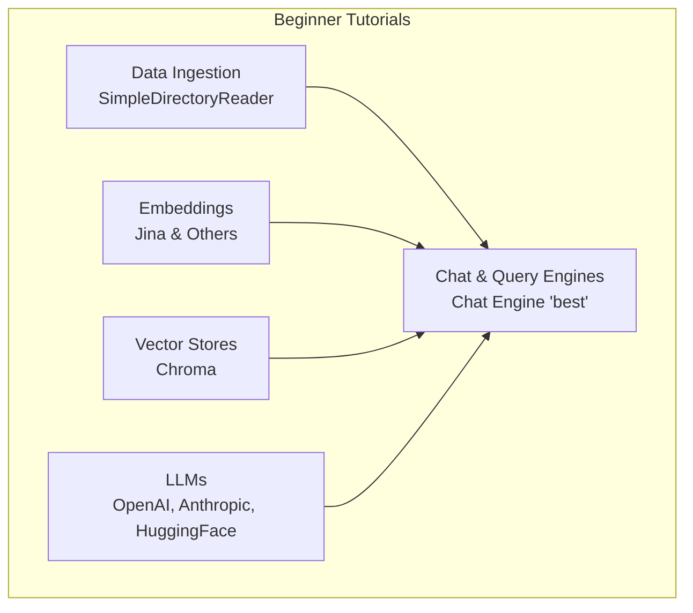
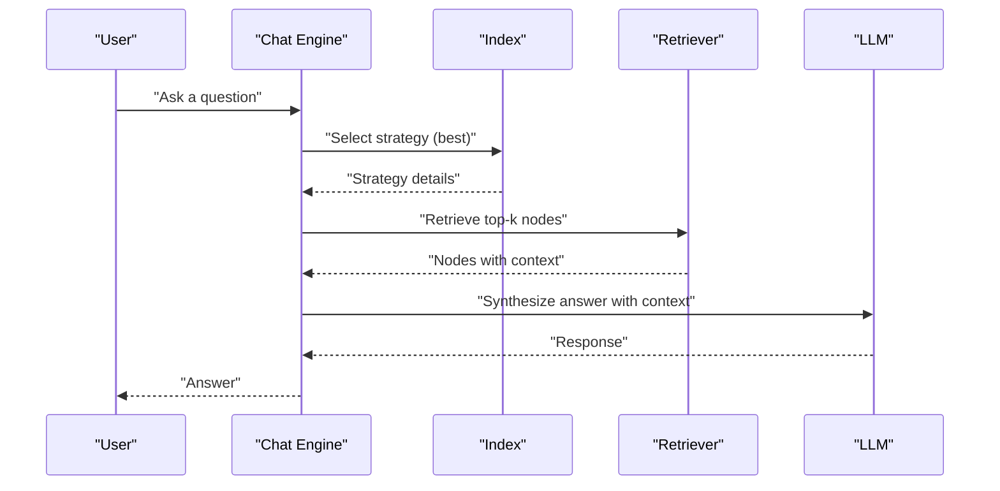
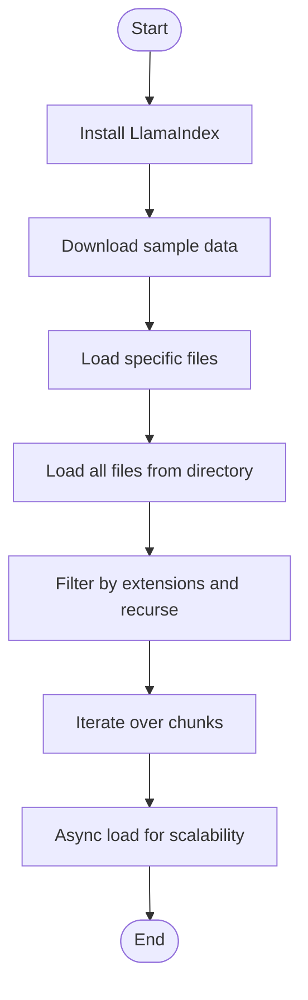
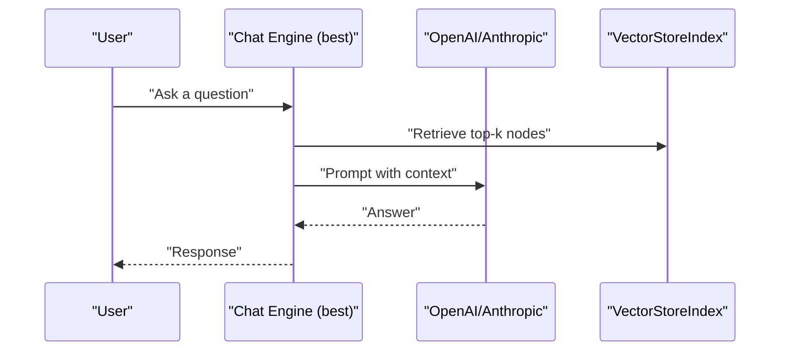
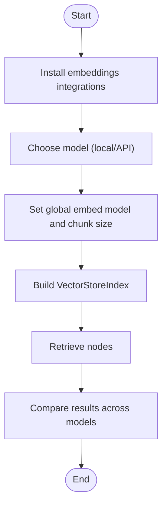
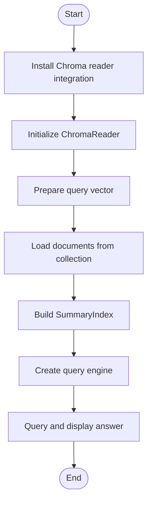
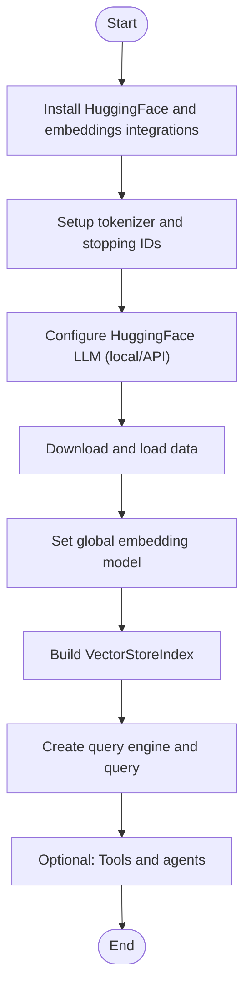
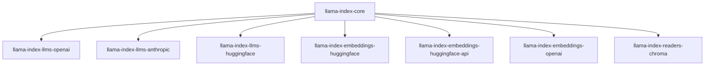

# Beginner Tutorials

<cite>
**Referenced Files in This Document**
- [README.md](file://README.md)
- [llama3_cookbook.ipynb](file://docs/examples/cookbooks/llama3_cookbook.ipynb)
- [simple_directory_reader.ipynb](file://docs/examples/data_connectors/simple_directory_reader.ipynb)
- [chat_engine_best.ipynb](file://docs/examples/chat_engine/chat_engine_best.ipynb)
- [ChromaDemo.ipynb](file://docs/examples/data_connectors/ChromaDemo.ipynb)
- [jina_embeddings.ipynb](file://docs/examples/embeddings/jina_embeddings.ipynb)
</cite>

## Table of Contents
1. [Introduction](#introduction)
2. [Project Structure](#project-structure)
3. [Core Components](#core-components)
4. [Architecture Overview](#architecture-overview)
5. [Detailed Component Analysis](#detailed-component-analysis)
6. [Dependency Analysis](#dependency-analysis)
7. [Performance Considerations](#performance-considerations)
8. [Troubleshooting Guide](#troubleshooting-guide)
9. [Conclusion](#conclusion)
10. [Appendices](#appendices)

## Introduction
This guide introduces beginner-friendly tutorials for building Retrieval-Augmented Generation (RAG) systems with LlamaIndex. You will learn how to:
- Ingest data from various sources
- Configure basic indices and embeddings
- Run simple queries and chat sessions
- Work with popular LLM providers (OpenAI, Anthropic, Hugging Face)
- Use common embedding models and vector stores

Each tutorial is designed as a step-by-step walkthrough with downloadable notebooks and clear explanations of each code block. We also include best practices, common pitfalls, and progression tips to help you move from simple to more advanced patterns.

## Project Structure
The tutorials are organized as Jupyter notebooks under the docs/examples directory. Each notebook focuses on a specific topic:
- Data ingestion: SimpleDirectoryReader
- Chat and query engines: Chat Engine “best” mode
- Embeddings: Jina embeddings and others
- Vector stores: Chroma integration
- LLMs: Llama 3 cookbook and provider-specific examples

**Section sources**
- [README.md](file://README.md#L1-L224)

## Core Components
This section outlines the essential building blocks you will use in the tutorials.

- Data connectors: Load data from files and directories
- Indices: Store and organize nodes for retrieval
- Embeddings: Convert text to vectors
- LLMs: Generate responses using selected providers
- Query engines and chat engines: Retrieve context and synthesize answers

Key beginner-friendly patterns:
- Minimal setup: load data, build index, query in 5 lines
- Provider agnostic defaults: switch LLMs and embeddings without changing core logic
- Persistent storage: save and reload indices for reuse

**Section sources**
- [README.md](file://README.md#L105-L177)

## Architecture Overview
The typical RAG flow consists of ingestion, indexing, retrieval, and synthesis. The “best” chat engine mode automatically selects the optimal strategy depending on your LLM’s capabilities.

**Diagram sources**
- [chat_engine_best.ipynb](file://docs/examples/chat_engine/chat_engine_best.ipynb#L141-L177)

## Detailed Component Analysis

### Tutorial 1: Data Ingestion with SimpleDirectoryReader
Goal: Learn how to load documents from a directory or specific files and iterate over them efficiently.

Steps:
1. Install LlamaIndex
2. Download sample data
3. Load specific files
4. Load all files from a directory
5. Filter by file extensions and recurse into subfolders
6. Iterate over chunks and process asynchronously

**Diagram sources**
- [simple_directory_reader.ipynb](file://docs/examples/data_connectors/simple_directory_reader.ipynb#L188-L438)

**Section sources**
- [simple_directory_reader.ipynb](file://docs/examples/data_connectors/simple_directory_reader.ipynb#L1-L516)

### Tutorial 2: Basic Chat and Query Engines (OpenAI, Anthropic)
Goal: Build a chat session using the “best” mode, which chooses the optimal strategy based on your LLM.

Steps:
1. Install provider integrations
2. Download sample data
3. Load data and build a vector index
4. Configure chat engine with your LLM
5. Chat with your data and review verbose logs

**Diagram sources**
- [chat_engine_best.ipynb](file://docs/examples/chat_engine/chat_engine_best.ipynb#L117-L177)

**Section sources**
- [chat_engine_best.ipynb](file://docs/examples/chat_engine/chat_engine_best.ipynb#L1-L219)

### Tutorial 3: Embeddings with Jina and Others
Goal: Compare embedding models and configure chunk sizes for efficient processing.

Steps:
1. Install embedding integrations
2. Choose a model (local or API)
3. Set global embedding model and chunk size
4. Build indices with different embeddings
5. Retrieve and compare results

**Diagram sources**
- [jina_embeddings.ipynb](file://docs/examples/embeddings/jina_embeddings.ipynb#L90-L184)

**Section sources**
- [jina_embeddings.ipynb](file://docs/examples/embeddings/jina_embeddings.ipynb#L1-L321)

### Tutorial 4: Vector Stores with Chroma
Goal: Load persisted collections and query them to build summaries or answer questions.

Steps:
1. Install Chroma reader integration
2. Initialize ChromaReader with collection name and persist directory
3. Prepare a query vector
4. Load documents from the collection
5. Build a summary index and query engine
6. Display results

**Diagram sources**
- [ChromaDemo.ipynb](file://docs/examples/data_connectors/ChromaDemo.ipynb#L71-L159)

**Section sources**
- [ChromaDemo.ipynb](file://docs/examples/data_connectors/ChromaDemo.ipynb#L1-L188)

### Tutorial 5: Llama 3 with Local and API Modes
Goal: Use Llama 3 via Hugging Face locally or via Hugging Face Inference API, then build a RAG pipeline.

Steps:
1. Install integrations for Hugging Face and embeddings
2. Set up tokenizer and stopping IDs
3. Configure Hugging Face LLM (local or API)
4. Download and load data
5. Set embedding model globally
6. Build index and query engine
7. Try tools and agents (optional)

**Diagram sources**
- [llama3_cookbook.ipynb](file://docs/examples/cookbooks/llama3_cookbook.ipynb#L143-L490)

**Section sources**
- [llama3_cookbook.ipynb](file://docs/examples/cookbooks/llama3_cookbook.ipynb#L1-L1093)

## Dependency Analysis
The tutorials rely on a small set of core and optional integrations. The core package provides the foundational building blocks, while integrations plug in specific LLMs, embeddings, and vector stores.

**Diagram sources**
- [README.md](file://README.md#L96-L101)
- [chat_engine_best.ipynb](file://docs/examples/chat_engine/chat_engine_best.ipynb#L42-L54)
- [llama3_cookbook.ipynb](file://docs/examples/cookbooks/llama3_cookbook.ipynb#L30-L34)
- [jina_embeddings.ipynb](file://docs/examples/embeddings/jina_embeddings.ipynb#L28-L31)
- [ChromaDemo.ipynb](file://docs/examples/data_connectors/ChromaDemo.ipynb#L37-L48)

**Section sources**
- [README.md](file://README.md#L96-L101)

## Performance Considerations
- Chunk size: Adjust chunk size for embeddings to balance recall and cost/performance.
- Top-k: Tune similarity_top_k to trade off relevance and speed.
- Async loading: Use async or iterator patterns for large datasets.
- Provider quotas: Respect rate limits for hosted APIs (e.g., Hugging Face Inference).
- Persistence: Persist indices to disk to avoid re-ingestion overhead.

[No sources needed since this section provides general guidance]

## Troubleshooting Guide
Common issues and fixes:
- Authentication errors: Ensure environment variables for API keys are set before running notebooks.
- Missing dependencies: Install required integrations per tutorial instructions.
- Rate limits: Reduce request frequency or switch to local models where applicable.
- Tokenizer mismatches: Align tokenizer with the selected LLM to prevent errors.
- Persistence paths: Verify persist directories exist and are writable.

**Section sources**
- [README.md](file://README.md#L105-L177)

## Conclusion
These beginner tutorials provide a practical foundation for building RAG systems with LlamaIndex. By progressing through ingestion, embeddings, indices, and query/chat engines—and experimenting with different LLMs and vector stores—you will gain confidence to extend to advanced patterns like custom retrievers, hybrid search, and multi-modal setups.

[No sources needed since this section summarizes without analyzing specific files]

## Appendices
- Downloadable notebooks: Each tutorial is a self-contained notebook under docs/examples. Use the links in the tutorial sections to open and run them.
- Next steps: Explore router query engines, ensemble methods, and provider-specific cookbooks to deepen your understanding.

[No sources needed since this section provides general guidance]