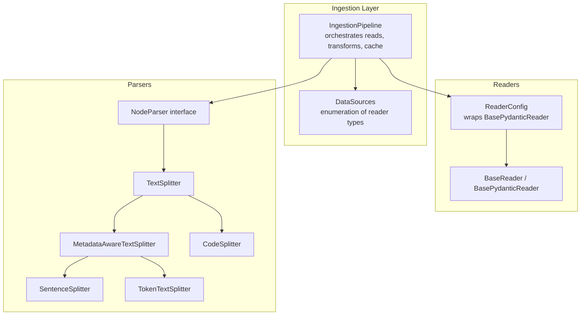
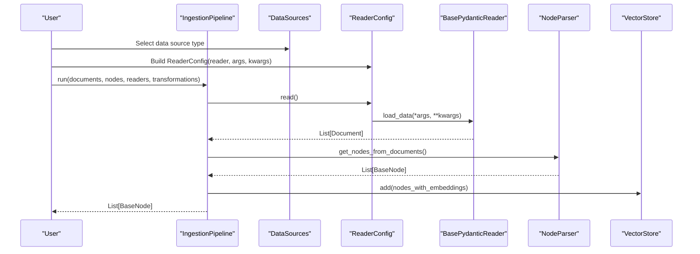
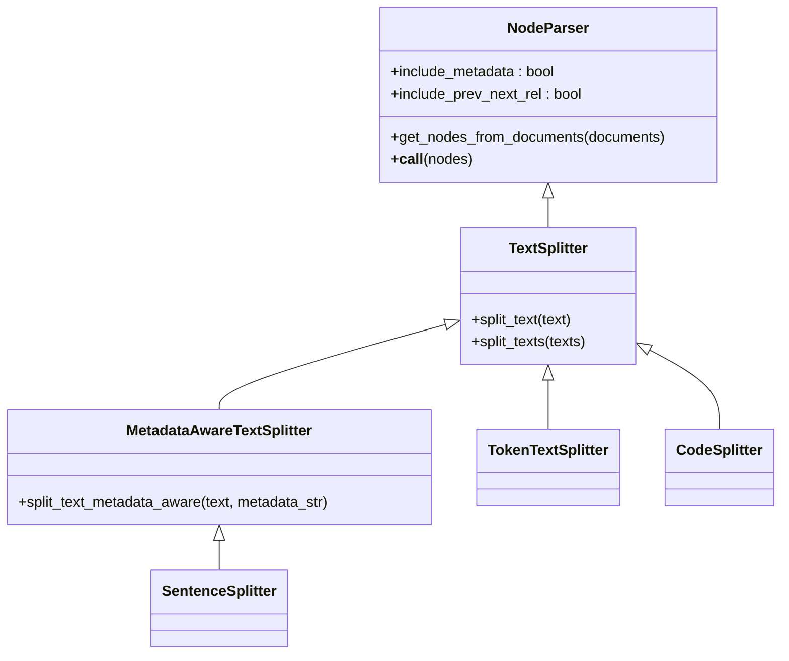
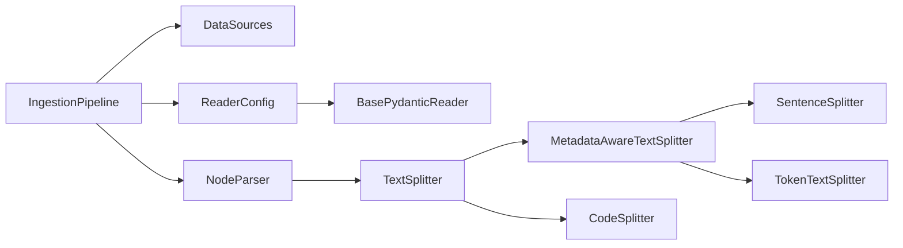

# Data Ingestion

<cite>
**Referenced Files in This Document**
- [pipeline.py](file://llama-index-core/llama_index/core/ingestion/pipeline.py)
- [data_sources.py](file://llama-index-core/llama_index/core/ingestion/data_sources.py)
- [base.py](file://llama-index-core/llama_index/core/readers/base.py)
- [interface.py](file://llama-index-core/llama_index/core/node_parser/interface.py)
- [sentence.py](file://llama-index-core/llama_index/core/node_parser/text/sentence.py)
- [token.py](file://llama-index-core/llama_index/core/node_parser/text/token.py)
- [code.py](file://llama-index-core/llama_index/core/node_parser/text/code.py)
</cite>

## Table of Contents
1. [Introduction](#introduction)
2. [Project Structure](#project-structure)
3. [Core Components](#core-components)
4. [Architecture Overview](#architecture-overview)
5. [Detailed Component Analysis](#detailed-component-analysis)
6. [Dependency Analysis](#dependency-analysis)
7. [Performance Considerations](#performance-considerations)
8. [Troubleshooting Guide](#troubleshooting-guide)
9. [Conclusion](#conclusion)
10. [Appendices](#appendices)

## Introduction
This document explains LlamaIndex’s data ingestion system with a focus on readers and node parsing. It covers supported data formats, chunking strategies, text splitting techniques, custom reader development, preprocessing and metadata handling, and best practices for building robust ingestion pipelines at scale.

## Project Structure
The ingestion system centers around:
- Ingestion Pipeline: orchestrates readers, transformations, caching, and persistence
- Readers: pluggable loaders for diverse data sources
- Node Parsers: text splitters and structural parsers that convert Documents into Nodes
- Transformations: embedding generation and other downstream steps

**Diagram sources**
- [pipeline.py](file://llama-index-core/llama_index/core/ingestion/pipeline.py#L193-L358)
- [data_sources.py](file://llama-index-core/llama_index/core/ingestion/data_sources.py#L89-L438)
- [base.py](file://llama-index-core/llama_index/core/readers/base.py#L19-L250)
- [interface.py](file://llama-index-core/llama_index/core/node_parser/interface.py#L50-L278)
- [sentence.py](file://llama-index-core/llama_index/core/node_parser/text/sentence.py#L34-L332)
- [token.py](file://llama-index-core/llama_index/core/node_parser/text/token.py#L22-L242)
- [code.py](file://llama-index-core/llama_index/core/node_parser/text/code.py#L19-L266)

**Section sources**
- [pipeline.py](file://llama-index-core/llama_index/core/ingestion/pipeline.py#L193-L358)
- [data_sources.py](file://llama-index-core/llama_index/core/ingestion/data_sources.py#L89-L438)
- [base.py](file://llama-index-core/llama_index/core/readers/base.py#L19-L250)
- [interface.py](file://llama-index-core/llama_index/core/node_parser/interface.py#L50-L278)

## Core Components
- IngestionPipeline: runs readers and transformations, manages caching, supports parallel workers, and integrates with a document store and vector store for deduplication and persistence.
- ReaderConfig and BasePydanticReader: define how to configure and invoke readers; readers implement load_data/lazy_load_data and related async variants.
- NodeParser and TextSplitter: define the contract for converting Documents into Nodes; include metadata-aware splitting and relationship building.
- Concrete Splitters: SentenceSplitter (sentence-aware), TokenTextSplitter (token-aware), and CodeSplitter (AST-based for code).

Key capabilities:
- Parallel ingestion via process-based batching
- Caching of transformation results keyed by node content and transformation config
- De-duplication using document store and optional vector store
- Async and sync APIs for readers and parsers

**Section sources**
- [pipeline.py](file://llama-index-core/llama_index/core/ingestion/pipeline.py#L193-L575)
- [base.py](file://llama-index-core/llama_index/core/readers/base.py#L19-L250)
- [interface.py](file://llama-index-core/llama_index/core/node_parser/interface.py#L50-L278)
- [sentence.py](file://llama-index-core/llama_index/core/node_parser/text/sentence.py#L34-L332)
- [token.py](file://llama-index-core/llama_index/core/node_parser/text/token.py#L22-L242)
- [code.py](file://llama-index-core/llama_index/core/node_parser/text/code.py#L19-L266)

## Architecture Overview
End-to-end ingestion flow:
1. Configure readers (files, web, databases, cloud storages, etc.) via ReaderConfig or specialized components.
2. Optionally group related files into DocumentGroup.
3. Run IngestionPipeline to:
   - Prepare inputs (documents + nodes + readers)
   - Deduplicate using docstore/vector store
   - Apply transformations (e.g., SentenceSplitter, embeddings)
   - Persist cache and docstore
   - Add embeddings to vector store

**Diagram sources**
- [data_sources.py](file://llama-index-core/llama_index/core/ingestion/data_sources.py#L89-L438)
- [base.py](file://llama-index-core/llama_index/core/readers/base.py#L223-L250)
- [pipeline.py](file://llama-index-core/llama_index/core/ingestion/pipeline.py#L467-L575)
- [interface.py](file://llama-index-core/llama_index/core/node_parser/interface.py#L157-L207)

## Detailed Component Analysis

### IngestionPipeline
Responsibilities:
- Accept readers, documents, nodes, and transformations
- Prepare inputs from readers and existing documents/nodes
- Deduplicate via docstore strategies (upserts, duplicates_only, upserts_and_delete)
- Run transformations with optional caching and parallel workers
- Persist cache and docstore, add embeddings to vector store

Parallelism:
- Uses process-based batching when num_workers > 1
- Falls back to sequential if disabled or insufficient workers

Caching:
- Hash of node content plus transformation config determines cache keys
- Optional cache collection name for grouping

Deduplication:
- Compares hashes and optionally ref_doc_id for upsert semantics
- Can delete removed documents from docstore and vector store when configured

Persistence:
- Persist cache and docstore to disk or fsspec-compatible filesystems

**Section sources**
- [pipeline.py](file://llama-index-core/llama_index/core/ingestion/pipeline.py#L193-L575)

### DataSources and ReaderConfig
- DataSources enumerates supported reader types and component types
- ReaderConfig wraps a BasePydanticReader with positional and keyword arguments
- ConfiguredDataSource builds a typed data source from a component

Supported reader families (examples):
- Web: SimpleWebPageReader, TrafilaturaWebReader, BeautifulSoupWebReader, RssReader
- Databases and cloud: ElasticsearchReader, S3Reader, GCSReader, Azure Blob, Google Docs/Sheets/Drive, SharePoint, OneDrive
- Collaboration: SlackReader, DiscordReader, NotionPageReader, TwitterTweetReader
- Media: YoutubeTranscriptReader, WikipediaReader
- Structured: JSON readers, CSV readers, RSS feeds, GitHub repositories, web pages, PDFs (via integrations)

Note: The enumeration is built dynamically and only includes readers available in the environment.

**Section sources**
- [data_sources.py](file://llama-index-core/llama_index/core/ingestion/data_sources.py#L89-L438)
- [base.py](file://llama-index-core/llama_index/core/readers/base.py#L223-L250)

### Readers: BaseReader and BasePydanticReader
- BaseReader defines synchronous and asynchronous load/lazy_load methods
- BasePydanticReader extends BaseReader and BaseComponent, enabling serialization and remote flags
- ReaderConfig encapsulates a reader instance with args/kwargs and exposes read()

Practical usage:
- Instantiate a specific reader (e.g., a web or file reader) and wrap it in ReaderConfig
- Pass ReaderConfig to IngestionPipeline along with other readers/documents/nodes

**Section sources**
- [base.py](file://llama-index-core/llama_index/core/readers/base.py#L19-L250)

### NodeParser Interface and Text Splitters
NodeParser contract:
- get_nodes_from_documents builds nodes from Documents
- _postprocess_parsed_nodes sets source relationships, merges metadata, and computes char offsets
- Includes callback hooks for chunking events

TextSplitter and MetadataAwareTextSplitter:
- TextSplitter applies a split_text method to produce chunks
- MetadataAwareTextSplitter adjusts chunk size by subtracting metadata length and merges metadata into nodes

Concrete splitters:
- SentenceSplitter: prefers sentence boundaries, paragraph separators, and regex fallbacks; maintains overlap
- TokenTextSplitter: token-aware splitting with configurable separators and overlap
- CodeSplitter: AST-based splitting using tree-sitter for code; supports char or token counting modes

**Diagram sources**
- [interface.py](file://llama-index-core/llama_index/core/node_parser/interface.py#L50-L278)
- [sentence.py](file://llama-index-core/llama_index/core/node_parser/text/sentence.py#L34-L332)
- [token.py](file://llama-index-core/llama_index/core/node_parser/text/token.py#L22-L242)
- [code.py](file://llama-index-core/llama_index/core/node_parser/text/code.py#L19-L266)

**Section sources**
- [interface.py](file://llama-index-core/llama_index/core/node_parser/interface.py#L50-L278)
- [sentence.py](file://llama-index-core/llama_index/core/node_parser/text/sentence.py#L34-L332)
- [token.py](file://llama-index-core/llama_index/core/node_parser/text/token.py#L22-L242)
- [code.py](file://llama-index-core/llama_index/core/node_parser/text/code.py#L19-L266)

### Supported Data Formats and Practical Examples
- PDFs: Integrations include smart PDF loaders, OCR-based readers, and table extraction readers
- DOCX: Legacy office readers and modern cloud document readers
- CSV: Pandas-based readers and structured data readers
- JSON: JSON readers for structured content
- Web pages: Simple web page reader, Trafilatura-based reader, BeautifulSoup-based reader, RSS feeds
- GitHub repositories: GitHub repository and issue readers with client abstractions

Examples of configuring readers:
- Build a ReaderConfig with a specific reader and pass it to IngestionPipeline
- Use DataSources to enumerate and select reader types dynamically
- Combine multiple readers (e.g., web + file + database) in a single pipeline run

Note: The exact reader classes and availability depend on installed integrations.

**Section sources**
- [data_sources.py](file://llama-index-core/llama_index/core/ingestion/data_sources.py#L89-L438)
- [base.py](file://llama-index-core/llama_index/core/readers/base.py#L223-L250)

### Chunking Strategies and Text Splitting Techniques
- SentenceSplitter: paragraph-aware, sentence-aware, and regex fallbacks; preserves sentence boundaries and manages overlap
- TokenTextSplitter: token-aware with configurable separators and overlap; keeps whitespace behavior configurable
- CodeSplitter: AST-based splitting for code; supports char or token counting modes; preserves syntactic structure

Best-practice selection:
- Use SentenceSplitter for natural language text to minimize fragmenting sentences
- Use TokenTextSplitter when precise token budgeting is required
- Use CodeSplitter for codebases to respect syntax and maintain readability

**Section sources**
- [sentence.py](file://llama-index-core/llama_index/core/node_parser/text/sentence.py#L34-L332)
- [token.py](file://llama-index-core/llama_index/core/node_parser/text/token.py#L22-L242)
- [code.py](file://llama-index-core/llama_index/core/node_parser/text/code.py#L19-L266)

### Custom Reader Development
Steps:
- Implement BasePydanticReader with load_data/lazy_load_data and async variants
- Optionally implement ResourcesReaderMixin to expose list_resources/get_resource_info/load_resource
- Wrap the reader in ReaderConfig and pass to IngestionPipeline
- Use is_remote flag to indicate remote vs local data sources

Validation:
- ReaderConfig.read() invokes the underlying reader with provided args/kwargs
- ReaderConfig.to_dict() enables serialization for persistence

**Section sources**
- [base.py](file://llama-index-core/llama_index/core/readers/base.py#L19-L250)

### Preprocessing, Metadata Extraction, and Large Dataset Handling
Preprocessing:
- NodeParser merges parent document and node metadata, sets source relationships, and records char offsets
- MetadataAwareTextSplitter subtracts metadata length from chunk budgets to fit within token limits

Large datasets:
- IngestionPipeline supports parallel workers via process-based batching
- Caching avoids recomputation across runs; cache collections enable logical grouping
- Deduplication strategies prevent redundant processing and storage

**Section sources**
- [interface.py](file://llama-index-core/llama_index/core/node_parser/interface.py#L84-L155)
- [pipeline.py](file://llama-index-core/llama_index/core/ingestion/pipeline.py#L530-L575)

## Dependency Analysis
High-level dependencies:
- IngestionPipeline depends on ReaderConfig/BasePydanticReader for data ingestion
- NodeParser depends on TextSplitter/MetadataAwareTextSplitter for chunking
- Concrete splitters depend on tokenizers and, for CodeSplitter, tree-sitter parsers
- DataSources enumerates reader types and ensures compatibility with ConfiguredDataSource

**Diagram sources**
- [pipeline.py](file://llama-index-core/llama_index/core/ingestion/pipeline.py#L193-L358)
- [data_sources.py](file://llama-index-core/llama_index/core/ingestion/data_sources.py#L89-L438)
- [base.py](file://llama-index-core/llama_index/core/readers/base.py#L19-L250)
- [interface.py](file://llama-index-core/llama_index/core/node_parser/interface.py#L50-L278)
- [sentence.py](file://llama-index-core/llama_index/core/node_parser/text/sentence.py#L34-L332)
- [token.py](file://llama-index-core/llama_index/core/node_parser/text/token.py#L22-L242)
- [code.py](file://llama-index-core/llama_index/core/node_parser/text/code.py#L19-L266)

**Section sources**
- [pipeline.py](file://llama-index-core/llama_index/core/ingestion/pipeline.py#L193-L358)
- [data_sources.py](file://llama-index-core/llama_index/core/ingestion/data_sources.py#L89-L438)
- [base.py](file://llama-index-core/llama_index/core/readers/base.py#L19-L250)
- [interface.py](file://llama-index-core/llama_index/core/node_parser/interface.py#L50-L278)

## Performance Considerations
- Choose appropriate chunking strategy:
  - SentenceSplitter for readability and coherence
  - TokenTextSplitter for strict token budgeting
  - CodeSplitter for code quality and structure preservation
- Tune chunk size and overlap to balance recall and retrieval quality
- Enable caching to avoid repeated transformations
- Use parallel workers judiciously; ensure CPU headroom and I/O capacity
- Prefer streaming readers and lazy loading where available to reduce memory pressure

[No sources needed since this section provides general guidance]

## Troubleshooting Guide
Common issues and resolutions:
- Excessive chunk overlap or invalid overlap vs chunk size:
  - Ensure chunk_overlap < chunk_size in splitters
- Metadata too large for chunk budget:
  - Increase chunk size or reduce metadata; MetadataAwareTextSplitter warns when resulting chunks are small
- Duplicate or missing documents after ingestion:
  - Verify docstore strategy and ref_doc_id handling
  - Use duplicates_only vs upserts depending on whether you expect updates
- Slow ingestion on large datasets:
  - Enable parallel workers and monitor CPU utilization
  - Use caching and persistent docstore/cache to resume incremental runs
- Code parsing errors:
  - Confirm tree-sitter language pack installation and valid language identifier

**Section sources**
- [sentence.py](file://llama-index-core/llama_index/core/node_parser/text/sentence.py#L83-L87)
- [token.py](file://llama-index-core/llama_index/core/node_parser/text/token.py#L64-L68)
- [pipeline.py](file://llama-index-core/llama_index/core/ingestion/pipeline.py#L530-L575)
- [code.py](file://llama-index-core/llama_index/core/node_parser/text/code.py#L114-L133)

## Conclusion
LlamaIndex’s ingestion system provides a flexible, extensible framework for reading diverse data sources, transforming them into structured nodes, and integrating with vector stores and document stores. By selecting appropriate readers and splitters, leveraging caching and parallelism, and applying sound deduplication strategies, teams can build reliable ingestion pipelines for large-scale retrieval applications.

[No sources needed since this section summarizes without analyzing specific files]

## Appendices

### Best Practices for Organizing Data Sources and Pipelines
- Organize heterogeneous sources by type using DataSources enumeration
- Encapsulate reader configuration with ReaderConfig for reproducibility
- Keep transformations modular (e.g., sentence splitting, embeddings) and cacheable
- Use docstore/vector store pairing for robust de-duplication
- Persist pipeline state (cache and docstore) for incremental runs
- Monitor chunk budgets and adjust overlap and chunk size iteratively

[No sources needed since this section provides general guidance]