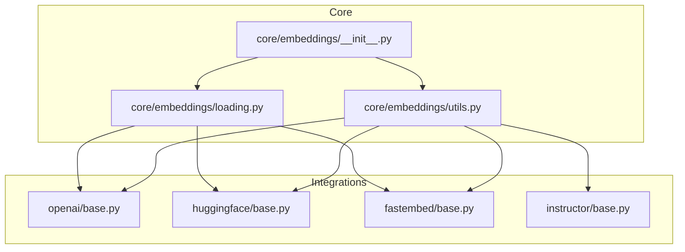
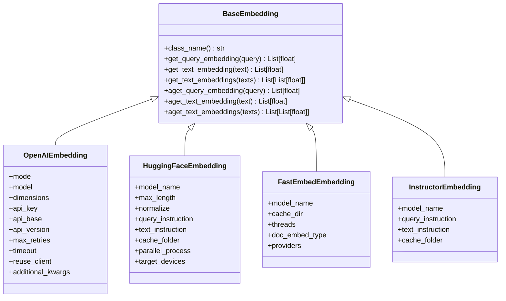
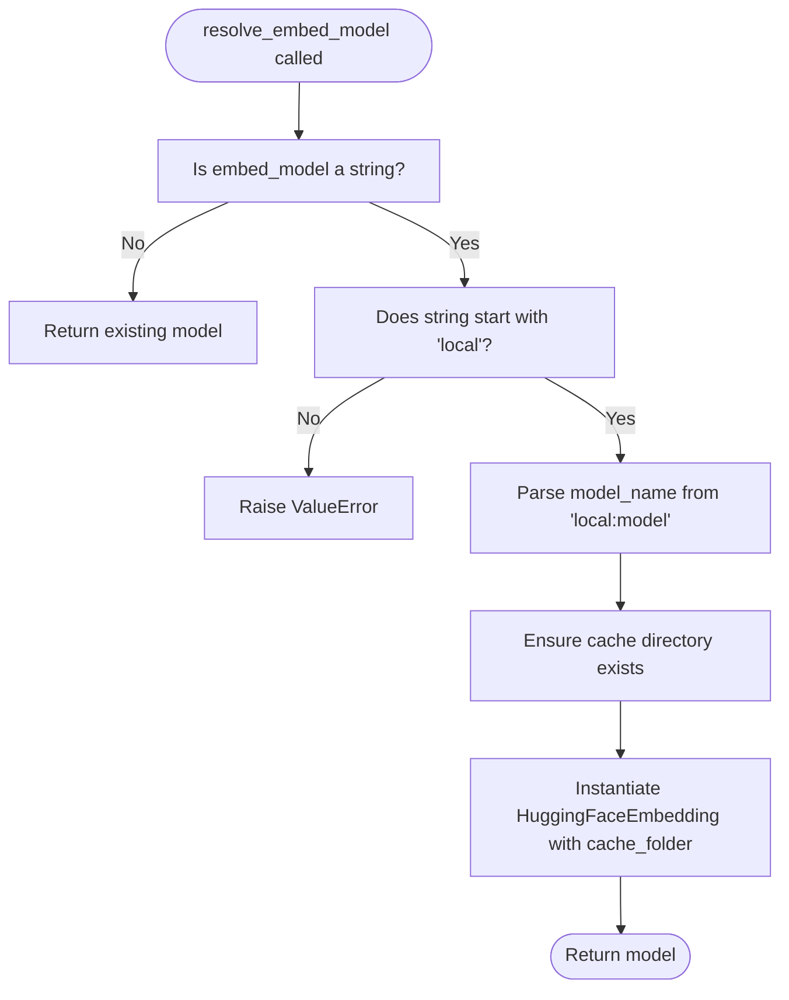
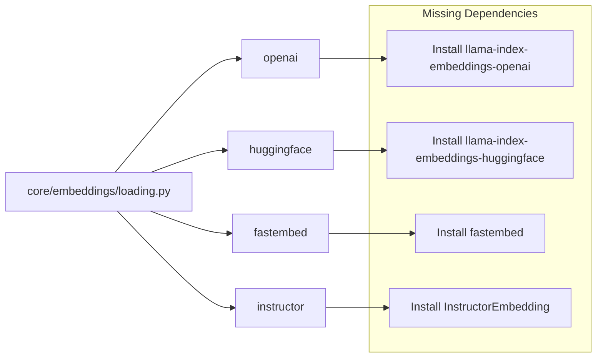

# Embedding Models

<cite>
**Referenced Files in This Document**
- [__init__.py](file://llama-index-core/llama_index/core/embeddings/__init__.py)
- [loading.py](file://llama-index-core/llama_index/core/embeddings/loading.py)
- [utils.py](file://llama-index-core/llama_index/core/embeddings/utils.py)
- [base.py](file://llama-index-integrations/embeddings/llama-index-embeddings-openai/llama_index/embeddings/openai/base.py)
- [base.py](file://llama-index-integrations/embeddings/llama-index-embeddings-huggingface/llama_index/embeddings/huggingface/base.py)
- [base.py](file://llama-index-integrations/embeddings/llama-index-embeddings-fastembed/llama_index/embeddings/fastembed/base.py)
- [base.py](file://llama-index-integrations/embeddings/llama-index-embeddings-instructor/llama_index/embeddings/instructor/base.py)
- [README.md](file://llama-index-integrations/embeddings/llama-index-embeddings-openai/README.md)
- [README.md](file://llama-index-integrations/embeddings/llama-index-embeddings-huggingface/README.md)
- [README.md](file://llama-index-integrations/embeddings/llama-index-embeddings-fastembed/README.md)
- [README.md](file://llama-index-integrations/embeddings/llama-index-embeddings-instructor/README.md)
</cite>

## Table of Contents
1. [Introduction](#introduction)
2. [Project Structure](#project-structure)
3. [Core Components](#core-components)
4. [Architecture Overview](#architecture-overview)
5. [Detailed Component Analysis](#detailed-component-analysis)
6. [Dependency Analysis](#dependency-analysis)
7. [Performance Considerations](#performance-considerations)
8. [Troubleshooting Guide](#troubleshooting-guide)
9. [Conclusion](#conclusion)
10. [Appendices](#appendices)

## Introduction
This document explains how embedding models work in LlamaIndex, covering provider integrations (OpenAI, Hugging Face, BAAI, fastembed, and others), configuration, usage patterns, and practical guidance for selecting the right model for your use case. It also covers embedding dimensions, similarity metrics, performance characteristics, cost and rate-limit considerations, and optimization strategies.

## Project Structure
LlamaIndex separates core embedding abstractions from provider-specific implementations:
- Core abstractions and utilities live under the core embeddings module.
- Provider-specific packages (e.g., OpenAI, Hugging Face, fastembed) are distributed as separate integrations and installed alongside the core.

**Diagram sources**
- [__init__.py](file://llama-index-core/llama_index/core/embeddings/__init__.py#L1-L16)
- [loading.py](file://llama-index-core/llama_index/core/embeddings/loading.py#L1-L50)
- [utils.py](file://llama-index-core/llama_index/core/embeddings/utils.py#L1-L141)
- [base.py](file://llama-index-integrations/embeddings/llama-index-embeddings-openai/llama_index/embeddings/openai/base.py#L1-L489)
- [base.py](file://llama-index-integrations/embeddings/llama-index-embeddings-huggingface/llama_index/embeddings/huggingface/base.py#L1-L565)
- [base.py](file://llama-index-integrations/embeddings/llama-index-embeddings-fastembed/llama_index/embeddings/fastembed/base.py#L1-L126)
- [base.py](file://llama-index-integrations/embeddings/llama-index-embeddings-instructor/llama_index/embeddings/instructor/base.py#L1-L98)

**Section sources**
- [__init__.py](file://llama-index-core/llama_index/core/embeddings/__init__.py#L1-L16)
- [loading.py](file://llama-index-core/llama_index/core/embeddings/loading.py#L1-L50)
- [utils.py](file://llama-index-core/llama_index/core/embeddings/utils.py#L1-L141)

## Core Components
- BaseEmbedding: The abstract interface for all embeddings in LlamaIndex.
- resolve_embed_model: Resolves a user-provided model identifier or object into a concrete embedding instance, including defaults and local model resolution.
- load_embed_model: Loads a previously serialized embedding model by class name.

Key behaviors:
- Default resolution prefers OpenAI when available; otherwise falls back to a mock embedding in testing contexts.
- Local Hugging Face embeddings are resolved via a “local” prefix and cached model downloads.
- CLIP embeddings are supported via a dedicated provider string.

**Section sources**
- [__init__.py](file://llama-index-core/llama_index/core/embeddings/__init__.py#L1-L16)
- [utils.py](file://llama-index-core/llama_index/core/embeddings/utils.py#L31-L141)
- [loading.py](file://llama-index-core/llama_index/core/embeddings/loading.py#L39-L50)

## Architecture Overview
The embedding subsystem composes a small set of core utilities with pluggable providers. Providers implement BaseEmbedding and expose synchronous and asynchronous embedding methods for queries and texts.

**Diagram sources**
- [base.py](file://llama-index-integrations/embeddings/llama-index-embeddings-openai/llama_index/embeddings/openai/base.py#L214-L489)
- [base.py](file://llama-index-integrations/embeddings/llama-index-embeddings-huggingface/llama_index/embeddings/huggingface/base.py#L38-L360)
- [base.py](file://llama-index-integrations/embeddings/llama-index-embeddings-fastembed/llama_index/embeddings/fastembed/base.py#L12-L126)
- [base.py](file://llama-index-integrations/embeddings/llama-index-embeddings-instructor/llama_index/embeddings/instructor/base.py#L17-L98)

## Detailed Component Analysis

### OpenAI Embeddings
OpenAI embeddings support multiple modes and models, including legacy and modern embedding engines. They expose synchronous and asynchronous embedding APIs and support dimensionality selection for newer models.

Key capabilities:
- Modes: similarity and text search.
- Models: legacy davinci/curie/babbage/ada and modern text-embedding-ada-002, -3-small, -3-large.
- Dimensions: configurable for v3 models via additional kwargs.
- Retry and timeout controls; optional client reuse for stability under heavy async loads.

Usage patterns:
- Configure credentials and endpoint via environment or constructor fields.
- Choose model and mode based on downstream similarity tasks.
- For cost control, prefer smaller models or limit dimensions.

**Section sources**
- [base.py](file://llama-index-integrations/embeddings/llama-index-embeddings-openai/llama_index/embeddings/openai/base.py#L20-L112)
- [base.py](file://llama-index-integrations/embeddings/llama-index-embeddings-openai/llama_index/embeddings/openai/base.py#L214-L489)

### Hugging Face Embeddings
Hugging Face embeddings support both local SentenceTransformers models and the Inference API. They offer extensive configuration for device placement, batching, normalization, and optional multi-process encoding.

Key capabilities:
- Local models via SentenceTransformer with caching and device selection.
- Optional query/text instructions per model family.
- Parallel encoding via multi-process pools.
- Deprecated inference API wrapper remains available but superseded by a dedicated integration.

Usage patterns:
- Prefer local models for privacy and offline scenarios.
- Use parallel_process for large-scale batch jobs.
- Normalize embeddings when required by downstream similarity functions.

**Section sources**
- [base.py](file://llama-index-integrations/embeddings/llama-index-embeddings-huggingface/llama_index/embeddings/huggingface/base.py#L38-L360)

### fastembed
FastEmbed provides efficient, ONNX-backed embeddings optimized for speed and low resource usage. It supports a curated set of models and offers both document and query embeddings.

Key capabilities:
- Lightweight runtime leveraging ONNX.
- Passage vs default embedding modes.
- Optional thread and provider tuning.

Usage patterns:
- Install the fastembed package and select a supported model name.
- Use passage mode for dense retrieval tasks.

**Section sources**
- [base.py](file://llama-index-integrations/embeddings/llama-index-embeddings-fastembed/llama_index/embeddings/fastembed/base.py#L12-L126)

### Instructor Embeddings
Instructor embeddings apply instruction-tuned models to produce semantically meaningful vectors by prepending explicit instructions to inputs.

Key capabilities:
- Automatic instruction detection per model.
- Batch-friendly encoding pipeline.

Usage patterns:
- Use when semantic instruction alignment improves downstream retrieval quality.

**Section sources**
- [base.py](file://llama-index-integrations/embeddings/llama-index-embeddings-instructor/llama_index/embeddings/instructor/base.py#L17-L98)

### Local Hugging Face Resolution Flow
The core resolves a “local” model string into a SentenceTransformer-backed embedding, ensuring models are cached and optionally parallelized.

**Diagram sources**
- [utils.py](file://llama-index-core/llama_index/core/embeddings/utils.py#L93-L117)
- [base.py](file://llama-index-integrations/embeddings/llama-index-embeddings-huggingface/llama_index/embeddings/huggingface/base.py#L123-L192)

## Dependency Analysis
Provider availability is gated by optional imports. The loader aggregates recognized providers and raises informative errors when packages are missing.

**Diagram sources**
- [loading.py](file://llama-index-core/llama_index/core/embeddings/loading.py#L6-L49)
- [utils.py](file://llama-index-core/llama_index/core/embeddings/utils.py#L50-L130)
- [base.py](file://llama-index-integrations/embeddings/llama-index-embeddings-fastembed/llama_index/embeddings/fastembed/base.py#L82-L97)
- [base.py](file://llama-index-integrations/embeddings/llama-index-embeddings-instructor/llama_index/embeddings/instructor/base.py#L3-L7)

**Section sources**
- [loading.py](file://llama-index-core/llama_index/core/embeddings/loading.py#L6-L49)
- [utils.py](file://llama-index-core/llama_index/core/embeddings/utils.py#L50-L130)

## Performance Considerations
- Batch sizes: Use embed_batch_size and provider-native batching to reduce overhead.
- Parallelism: Enable multi-process encoding for large batches (Hugging Face).
- Client reuse: For OpenAI, reuse clients under heavy async loads to improve stability.
- Model choice: Smaller models and reduced dimensions lower latency and cost.
- Caching: Local models are cached; leverage cache folders to avoid repeated downloads.
- Hardware: Prefer GPU-enabled environments for local models when available.

[No sources needed since this section provides general guidance]

## Troubleshooting Guide
Common issues and resolutions:
- Missing provider package: Install the appropriate integration package (e.g., openai, huggingface, fastembed).
- Invalid model string: Ensure local model strings start with the “local” prefix and include a valid model name.
- Credentials errors: Verify API keys and endpoints for cloud providers.
- Rate limits: Implement retries and backoff; consider batching and dimension reduction.
- Offline/local failures: Confirm cache directories and model availability; enable parallel encoding for throughput.

**Section sources**
- [utils.py](file://llama-index-core/llama_index/core/embeddings/utils.py#L60-L77)
- [utils.py](file://llama-index-core/llama_index/core/embeddings/utils.py#L113-L117)
- [base.py](file://llama-index-integrations/embeddings/llama-index-embeddings-openai/llama_index/embeddings/openai/base.py#L364-L372)

## Conclusion
LlamaIndex’s embedding system cleanly separates core abstractions from provider implementations. Selecting the right embedding model depends on your data type, performance needs, privacy requirements, and budget. For production, prefer local models for control, and cloud providers for convenience and scale. Tune batch sizes, dimensions, and parallelism to balance accuracy and cost.

[No sources needed since this section summarizes without analyzing specific files]

## Appendices

### Installation and Quick Setup
- OpenAI: Install the integration package and configure credentials.
- Hugging Face: Install the integration package; use “local:model_name” to resolve a local model.
- fastembed: Install the fastembed package; choose a supported model name.
- Instructor: Install the instructor embedding package; use the provided class.

**Section sources**
- [README.md](file://llama-index-integrations/embeddings/llama-index-embeddings-openai/README.md)
- [README.md](file://llama-index-integrations/embeddings/llama-index-embeddings-huggingface/README.md)
- [README.md](file://llama-index-integrations/embeddings/llama-index-embeddings-fastembed/README.md)
- [README.md](file://llama-index-integrations/embeddings/llama-index-embeddings-instructor/README.md)

### Choosing the Right Embedding Model
- General-purpose retrieval: Modern OpenAI embeddings or fastembed small models.
- Privacy-sensitive or offline: Local Hugging Face models.
- Instruction-aligned semantics: Instructor embeddings.
- Cost-sensitive: Smaller models or reduced dimensions; batch and reuse clients.

[No sources needed since this section provides general guidance]