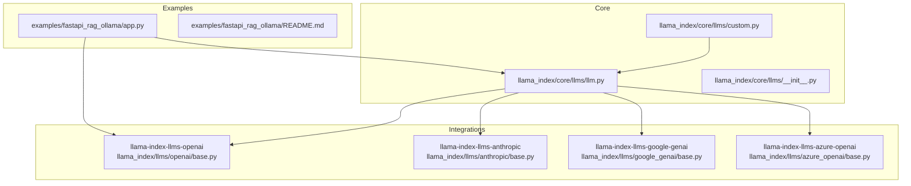
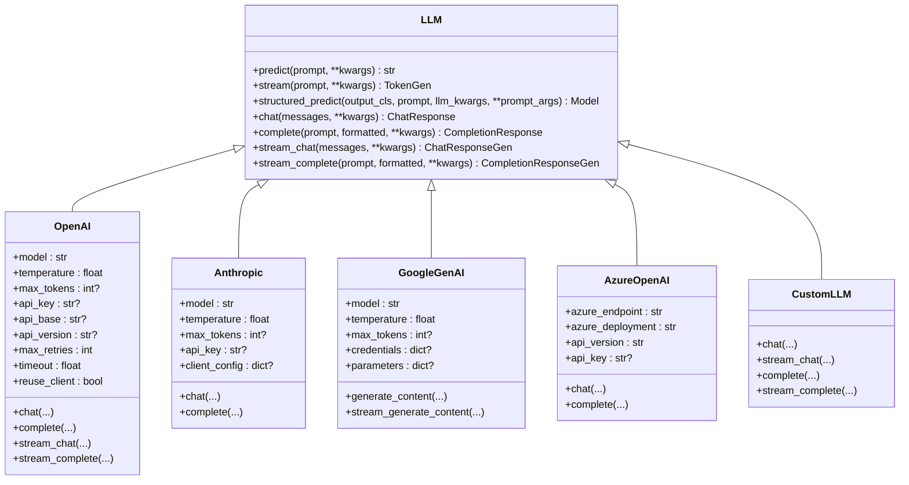
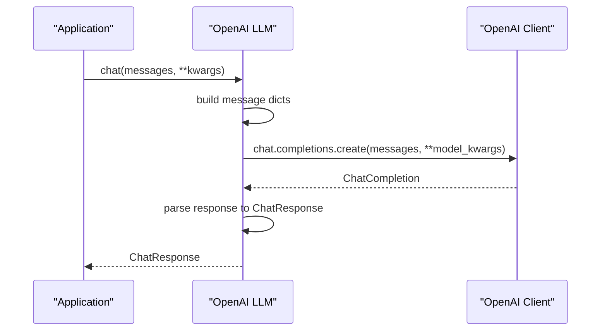
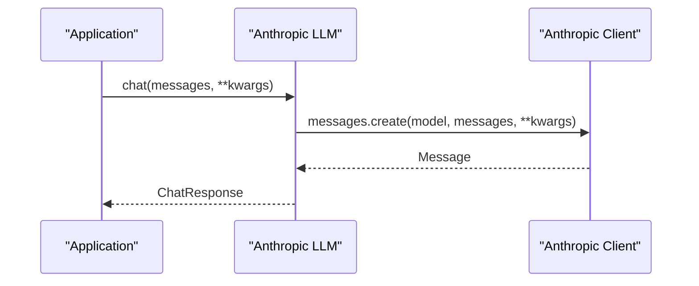
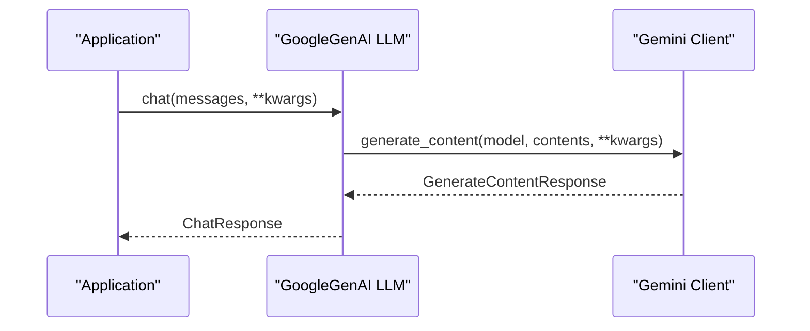
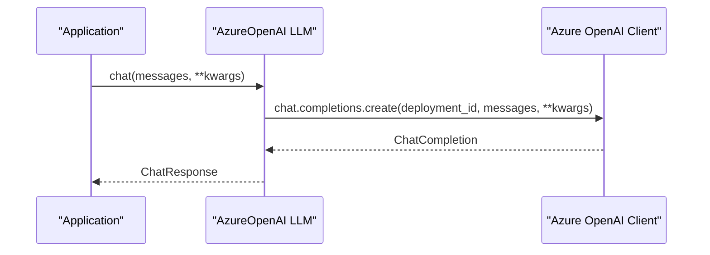
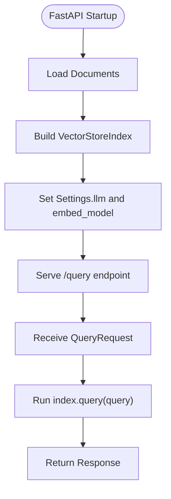
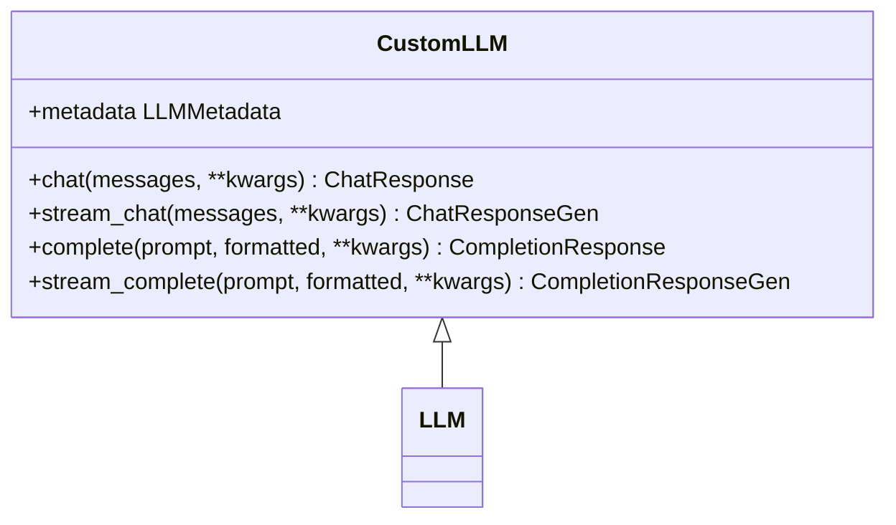
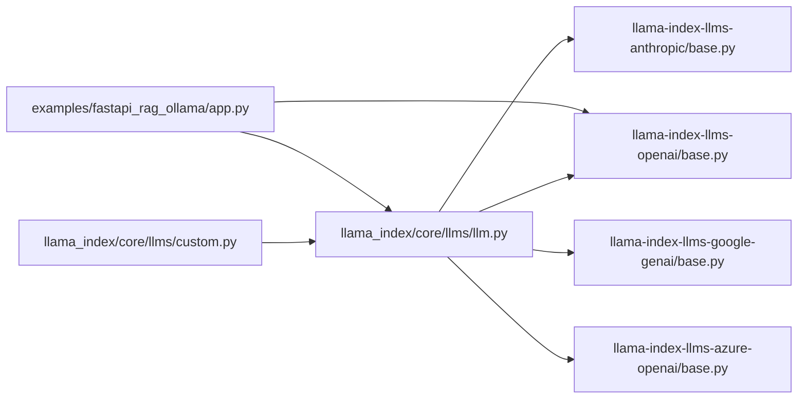

# LLM Providers Integration

<cite>
**Referenced Files in This Document**
- [llm.py](file://llama-index-core/llama_index/core/llms/llm.py)
- [custom.py](file://llama-index-core/llama_index/core/llms/custom.py)
- [__init__.py](file://llama-index-core/llama_index/core/llms/__init__.py)
- [base.py](file://llama-index-integrations/llms/llama-index-llms-openai/llama_index/llms/openai/base.py)
- [__init__.py](file://llama-index-integrations/llms/llama-index-llms-openai/llama_index/llms/openai/__init__.py)
- [base.py](file://llama-index-integrations/llms/llama-index-llms-anthropic/llama_index/llms/anthropic/base.py)
- [__init__.py](file://llama-index-integrations/llms/llama-index-llms-anthropic/llama_index/llms/anthropic/__init__.py)
- [base.py](file://llama-index-integrations/llms/llama-index-llms-google-genai/llama_index/llms/google_genai/base.py)
- [__init__.py](file://llama-index-integrations/llms/llama-index-llms-google-genai/llama_index/llms/google_genai/__init__.py)
- [base.py](file://llama-index-integrations/llms/llama-index-llms-azure-openai/llama_index/llms/azure_openai/base.py)
- [__init__.py](file://llama-index-integrations/llms/llama-index-llms-azure-openai/llama_index/llms/azure_openai/__init__.py)
- [app.py](file://examples/fastapi_rag_ollama/app.py)
- [README.md](file://examples/fastapi_rag_ollama/README.md)
</cite>

## Table of Contents
1. [Introduction](#introduction)
2. [Project Structure](#project-structure)
3. [Core Components](#core-components)
4. [Architecture Overview](#architecture-overview)
5. [Detailed Component Analysis](#detailed-component-analysis)
6. [Dependency Analysis](#dependency-analysis)
7. [Performance Considerations](#performance-considerations)
8. [Troubleshooting Guide](#troubleshooting-guide)
9. [Conclusion](#conclusion)
10. [Appendices](#appendices)

## Introduction
This document explains how to integrate multiple Large Language Model (LLM) providers with LlamaIndex. It covers official integrations for OpenAI, Anthropic Claude, Google Gemini, Azure OpenAI, and local model deployments via Ollama. It also documents the LlamaIndex LLM abstraction, authentication and configuration patterns, model selection, parameter tuning, provider-specific features, rate limiting and retries, cost considerations, production best practices, and performance optimization tips. Where applicable, we map concepts to actual source files in the repository.

## Project Structure
LlamaIndex provides a unified LLM interface and a rich ecosystem of provider integrations. The core LLM abstractions live under the core module, while provider-specific implementations are distributed across the integrations packages. Example applications demonstrate practical usage, including a local Ollama-based FastAPI RAG.

**Diagram sources**
- [llm.py](file://llama-index-core/llama_index/core/llms/llm.py#L163-L931)
- [custom.py](file://llama-index-core/llama_index/core/llms/custom.py#L22-L92)
- [base.py](file://llama-index-integrations/llms/llama-index-llms-openai/llama_index/llms/openai/base.py#L139-L1242)
- [base.py](file://llama-index-integrations/llms/llama-index-llms-anthropic/llama_index/llms/anthropic/base.py)
- [base.py](file://llama-index-integrations/llms/llama-index-llms-google-genai/llama_index/llms/google_genai/base.py)
- [base.py](file://llama-index-integrations/llms/llama-index-llms-azure-openai/llama_index/llms/azure_openai/base.py)
- [app.py](file://examples/fastapi_rag_ollama/app.py#L1-L30)

**Section sources**
- [llm.py](file://llama-index-core/llama_index/core/llms/llm.py#L163-L931)
- [custom.py](file://llama-index-core/llama_index/core/llms/custom.py#L22-L92)
- [base.py](file://llama-index-integrations/llms/llama-index-llms-openai/llama_index/llms/openai/base.py#L139-L1242)
- [base.py](file://llama-index-integrations/llms/llama-index-llms-anthropic/llama_index/llms/anthropic/base.py)
- [base.py](file://llama-index-integrations/llms/llama-index-llms-google-genai/llama_index/llms/google_genai/base.py)
- [base.py](file://llama-index-integrations/llms/llama-index-llms-azure-openai/llama_index/llms/azure_openai/base.py)
- [app.py](file://examples/fastapi_rag_ollama/app.py#L1-L30)
- [README.md](file://examples/fastapi_rag_ollama/README.md#L1-L58)

## Core Components
- LLM abstraction: The central LLM class defines the contract for chat, completion, streaming, structured prediction, and tokenization helpers. It supports system prompts, output parsing, and callback instrumentation.
- CustomLLM: A simplified base class for implementing custom LLMs that adhere to the LlamaIndex interface.
- Provider integrations: Each provider exposes a concrete LLM class (e.g., OpenAI, Anthropic, Google GenAI, Azure OpenAI) that implements the LLM interface and handles provider-specific authentication, request shaping, and response parsing.

Key capabilities:
- Unified predict/stream/structured_predict APIs
- Streaming tokens and chat deltas
- Structured outputs via Pydantic programs
- Token counting and optional logprobs
- Retry decorators and configurable timeouts/retries

**Section sources**
- [llm.py](file://llama-index-core/llama_index/core/llms/llm.py#L163-L931)
- [custom.py](file://llama-index-core/llama_index/core/llms/custom.py#L22-L92)
- [__init__.py](file://llama-index-core/llama_index/core/llms/__init__.py#L1-L49)

## Architecture Overview
The LlamaIndex LLM architecture centers on a single interface implemented by provider-specific classes. Applications configure an LLM instance (or use defaults) and then use it through the LLM’s predict/stream/structured_predict methods. Provider integrations encapsulate credentials, API endpoints, and model-specific parameters.

**Diagram sources**
- [llm.py](file://llama-index-core/llama_index/core/llms/llm.py#L163-L931)
- [base.py](file://llama-index-integrations/llms/llama-index-llms-openai/llama_index/llms/openai/base.py#L139-L1242)
- [base.py](file://llama-index-integrations/llms/llama-index-llms-anthropic/llama_index/llms/anthropic/base.py)
- [base.py](file://llama-index-integrations/llms/llama-index-llms-google-genai/llama_index/llms/google_genai/base.py)
- [base.py](file://llama-index-integrations/llms/llama-index-llms-azure-openai/llama_index/llms/azure_openai/base.py)
- [custom.py](file://llama-index-core/llama_index/core/llms/custom.py#L22-L92)

## Detailed Component Analysis

### OpenAI Integration
- Authentication and configuration: The OpenAI LLM accepts API key, base URL, and API version. Credentials resolution ensures proper precedence and defaults.
- Model selection and parameters: Supports chat vs. completion endpoints, max tokens, temperature, logprobs/top_logprobs, and provider-specific modalities (e.g., audio).
- Streaming and retries: Implements robust retry decorators and streaming deltas for both chat and completion modes.
- Token counting: Parses usage fields from responses to compute prompt/completion/total tokens.

**Diagram sources**
- [base.py](file://llama-index-integrations/llms/llama-index-llms-openai/llama_index/llms/openai/base.py#L487-L522)

**Section sources**
- [base.py](file://llama-index-integrations/llms/llama-index-llms-openai/llama_index/llms/openai/base.py#L139-L1242)
- [__init__.py](file://llama-index-integrations/llms/llama-index-llms-openai/llama_index/llms/openai/__init__.py#L1-L5)

### Anthropic Claude Integration
- Authentication and configuration: Accepts API key and optional client configuration.
- Model selection and parameters: Exposes model, temperature, max tokens, and provider-specific parameters.
- Streaming and function/tool calling: Supports streaming chat responses and tool call handling.

**Diagram sources**
- [base.py](file://llama-index-integrations/llms/llama-index-llms-anthropic/llama_index/llms/anthropic/base.py)

**Section sources**
- [base.py](file://llama-index-integrations/llms/llama-index-llms-anthropic/llama_index/llms/anthropic/base.py)
- [__init__.py](file://llama-index-integrations/llms/llama-index-llms-anthropic/llama_index/llms/anthropic/__init__.py#L1-L4)

### Google Gemini Integration
- Authentication and configuration: Accepts credentials and model parameters.
- Model selection and parameters: Supports model selection, temperature, max output tokens, and multimodal generation.
- Streaming and structured outputs: Provides generate_content and stream_generate_content methods.

**Diagram sources**
- [base.py](file://llama-index-integrations/llms/llama-index-llms-google-genai/llama_index/llms/google_genai/base.py)

**Section sources**
- [base.py](file://llama-index-integrations/llms/llama-index-llms-google-genai/llama_index/llms/google_genai/base.py)
- [__init__.py](file://llama-index-integrations/llms/llama-index-llms-google-genai/llama_index/llms/google_genai/__init__.py#L1-L4)

### Azure OpenAI Integration
- Authentication and configuration: Requires endpoint, deployment, API version, and API key.
- Model selection and parameters: Mirrors OpenAI parameters with Azure-specific routing via deployment.
- Streaming and retries: Same retry and streaming patterns as OpenAI.

**Diagram sources**
- [base.py](file://llama-index-integrations/llms/llama-index-llms-azure-openai/llama_index/llms/azure_openai/base.py)

**Section sources**
- [base.py](file://llama-index-integrations/llms/llama-index-llms-azure-openai/llama_index/llms/azure_openai/base.py)
- [__init__.py](file://llama-index-integrations/llms/llama-index-llms-azure-openai/llama_index/llms/azure_openai/__init__.py#L1-L8)

### Local Model Deployment (Ollama)
- Local LLM via Ollama: Demonstrates configuring a local LLM and embeddings for a FastAPI RAG application.
- Production-style structure: Shows how to wire LlamaIndex with a local model and expose a simple query endpoint.

**Diagram sources**
- [app.py](file://examples/fastapi_rag_ollama/app.py#L1-L30)

**Section sources**
- [app.py](file://examples/fastapi_rag_ollama/app.py#L1-L30)
- [README.md](file://examples/fastapi_rag_ollama/README.md#L1-L58)

### Custom LLM Implementation
- Purpose: Implement a custom LLM when no provider adapter exists or when you need specialized behavior.
- Required methods: Implement chat/complete/stream_chat/stream_complete and define metadata.
- Callbacks and streaming: Leverage the provided decorators and conversion utilities for consistent behavior.

**Diagram sources**
- [custom.py](file://llama-index-core/llama_index/core/llms/custom.py#L22-L92)
- [llm.py](file://llama-index-core/llama_index/core/llms/llm.py#L163-L931)

**Section sources**
- [custom.py](file://llama-index-core/llama_index/core/llms/custom.py#L22-L92)
- [llm.py](file://llama-index-core/llama_index/core/llms/llm.py#L163-L931)

## Dependency Analysis
Provider integrations depend on the core LLM interface and often wrap external SDK clients. The core LLM module orchestrates templating, streaming, structured outputs, and instrumentation.

**Diagram sources**
- [llm.py](file://llama-index-core/llama_index/core/llms/llm.py#L163-L931)
- [custom.py](file://llama-index-core/llama_index/core/llms/custom.py#L22-L92)
- [base.py](file://llama-index-integrations/llms/llama-index-llms-openai/llama_index/llms/openai/base.py#L139-L1242)
- [base.py](file://llama-index-integrations/llms/llama-index-llms-anthropic/llama_index/llms/anthropic/base.py)
- [base.py](file://llama-index-integrations/llms/llama-index-llms-google-genai/llama_index/llms/google_genai/base.py)
- [base.py](file://llama-index-integrations/llms/llama-index-llms-azure-openai/llama_index/llms/azure_openai/base.py)
- [app.py](file://examples/fastapi_rag_ollama/app.py#L1-L30)

**Section sources**
- [llm.py](file://llama-index-core/llama_index/core/llms/llm.py#L163-L931)
- [custom.py](file://llama-index-core/llama_index/core/llms/custom.py#L22-L92)
- [base.py](file://llama-index-integrations/llms/llama-index-llms-openai/llama_index/llms/openai/base.py#L139-L1242)
- [base.py](file://llama-index-integrations/llms/llama-index-llms-anthropic/llama_index/llms/anthropic/base.py)
- [base.py](file://llama-index-integrations/llms/llama-index-llms-google-genai/llama_index/llms/google_genai/base.py)
- [base.py](file://llama-index-integrations/llms/llama-index-llms-azure-openai/llama_index/llms/azure_openai/base.py)
- [app.py](file://examples/fastapi_rag_ollama/app.py#L1-L30)

## Performance Considerations
- Streaming: Prefer streaming APIs for latency-sensitive applications; the LLM base provides token streams for both chat and completion.
- Retry and timeouts: Configure max_retries and timeout to balance reliability and latency; adjust based on provider SLAs.
- Token budgeting: Compute remaining context window and infer max_tokens when unset to avoid truncation.
- Client reuse: Enable reuse_client for high-volume async workloads to reduce connection overhead.
- Structured outputs: Use structured_predict for deterministic parsing and reduced post-processing.
- Observability: Instrumentation and callbacks help track latency, token usage, and error rates.

[No sources needed since this section provides general guidance]

## Troubleshooting Guide
Common issues and resolutions:
- Authentication failures: Verify API keys and base URLs; ensure environment variables are set before constructing LLM instances.
- Unsupported model errors: Some models are restricted to specific APIs; consult provider-specific checks and switch to compatible endpoints.
- Streaming audio modalities: Certain providers do not support audio in streaming modes; use chat/achat instead.
- Context length exceeded: If max_tokens is not set and the prompt is too long, the system raises an error; shorten the prompt or increase context window.
- Rate limits and quotas: Implement exponential backoff and circuit breakers; monitor usage and throttle requests accordingly.

**Section sources**
- [base.py](file://llama-index-integrations/llms/llama-index-llms-openai/llama_index/llms/openai/base.py#L304-L307)
- [base.py](file://llama-index-integrations/llms/llama-index-llms-openai/llama_index/llms/openai/base.py#L415-L418)
- [base.py](file://llama-index-integrations/llms/llama-index-llms-openai/llama_index/llms/openai/base.py#L655-L668)

## Conclusion
LlamaIndex offers a consistent LLM interface across providers and enables rapid integration with OpenAI, Anthropic, Google Gemini, Azure OpenAI, and local models like Ollama. By leveraging the core LLM abstractions, structured outputs, streaming, and instrumentation, developers can build reliable, production-ready RAG systems with minimal provider lock-in.

[No sources needed since this section summarizes without analyzing specific files]

## Appendices

### Provider-Specific Setup and Configuration Patterns
- OpenAI
  - Authentication: API key and optional base URL/API version
  - Model selection: Choose chat or completion-capable model
  - Parameters: temperature, max_tokens, logprobs/top_logprobs, modalities
  - Reference: [base.py](file://llama-index-integrations/llms/llama-index-llms-openai/llama_index/llms/openai/base.py#L139-L1242)
- Anthropic
  - Authentication: API key and optional client config
  - Model selection: Provider model name and parameters
  - Reference: [base.py](file://llama-index-integrations/llms/llama-index-llms-anthropic/llama_index/llms/anthropic/base.py)
- Google Gemini
  - Authentication: Credentials and model parameters
  - Model selection: Model name and generation parameters
  - Reference: [base.py](file://llama-index-integrations/llms/llama-index-llms-google-genai/llama_index/llms/google_genai/base.py)
- Azure OpenAI
  - Authentication: Endpoint, deployment, API version, API key
  - Model selection: Deployment name and parameters
  - Reference: [base.py](file://llama-index-integrations/llms/llama-index-llms-azure-openai/llama_index/llms/azure_openai/base.py)
- Local (Ollama)
  - Authentication: None required
  - Model selection: Local model name and embedding model
  - Reference: [app.py](file://examples/fastapi_rag_ollama/app.py#L1-L30), [README.md](file://examples/fastapi_rag_ollama/README.md#L1-L58)

### Best Practices for Production Usage
- Centralize configuration via environment variables and settings
- Use structured_predict for predictable output schemas
- Enable streaming for interactive experiences
- Monitor token usage and costs; cap max_tokens appropriately
- Implement retries and circuit breakers for resilience
- Instrument with callbacks and observability hooks

[No sources needed since this section provides general guidance]