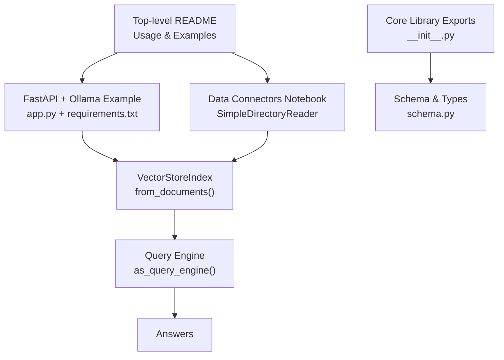
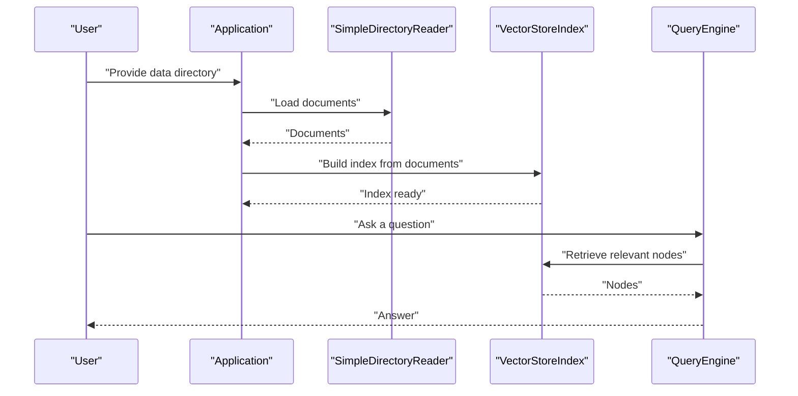
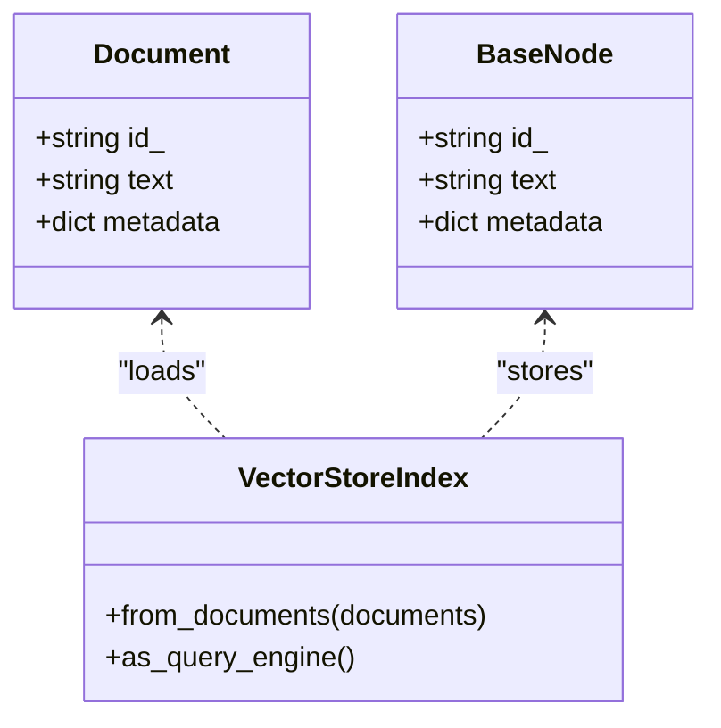
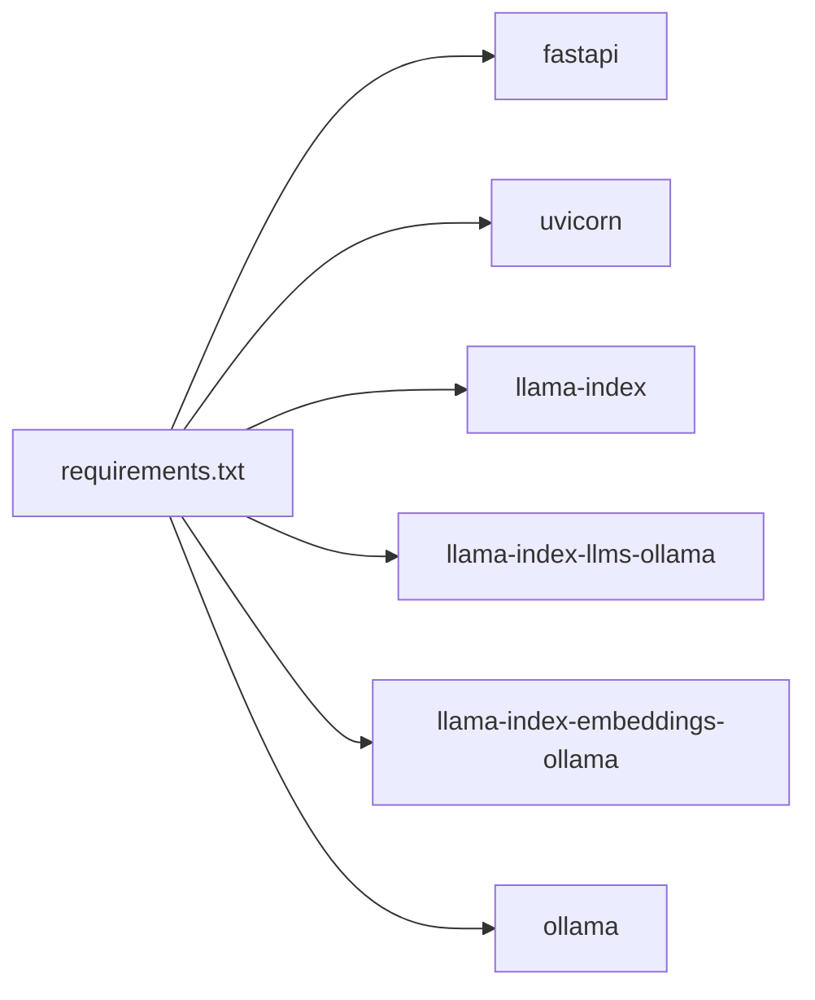

# Quick Start Guide

<cite>
**Referenced Files in This Document**
- [README.md](file://README.md)
- [examples/fastapi_rag_ollama/README.md](file://examples/fastapi_rag_ollama/README.md)
- [examples/fastapi_rag_ollama/app.py](file://examples/fastapi_rag_ollama/app.py)
- [examples/fastapi_rag_ollama/requirements.txt](file://examples/fastapi_rag_ollama/requirements.txt)
- [docs/examples/data_connectors/simple_directory_reader.ipynb](file://docs/examples/data_connectors/simple_directory_reader.ipynb)
- [llama-index-core/llama_index/core/__init__.py](file://llama-index-core/llama_index/core/__init__.py)
- [llama-index-core/llama_index/core/schema.py](file://llama-index-core/llama_index/core/schema.py)
</cite>

## Table of Contents
1. [Introduction](#introduction)
2. [Project Structure](#project-structure)
3. [Core Components](#core-components)
4. [Architecture Overview](#architecture-overview)
5. [Detailed Component Analysis](#detailed-component-analysis)
6. [Dependency Analysis](#dependency-analysis)
7. [Performance Considerations](#performance-considerations)
8. [Troubleshooting Guide](#troubleshooting-guide)
9. [Conclusion](#conclusion)
10. [Appendices](#appendices)

## Introduction
This quick start guide helps you build a Retrieval-Augmented Generation (RAG) application in five minutes using LlamaIndex. You will:
- Set up your environment
- Install dependencies
- Load data from files
- Create a simple vector index
- Perform basic queries
- Persist and reload the index

We also explain core concepts in beginner-friendly terms:
- Nodes: chunks of text extracted from your documents
- Indices: data structures that organize nodes for efficient retrieval
- Retrievers: components that fetch relevant nodes for a query

## Project Structure
The repository includes:
- A top-level README with example commands and usage patterns
- A minimal FastAPI + LlamaIndex + Ollama example
- Jupyter notebooks demonstrating data loading and readers
- Core library exports and foundational schema definitions

**Diagram sources**
- [README.md](file://README.md#L93-L177)
- [examples/fastapi_rag_ollama/app.py](file://examples/fastapi_rag_ollama/app.py#L1-L30)
- [examples/fastapi_rag_ollama/requirements.txt](file://examples/fastapi_rag_ollama/requirements.txt#L1-L7)
- [docs/examples/data_connectors/simple_directory_reader.ipynb](file://docs/examples/data_connectors/simple_directory_reader.ipynb#L242-L315)
- [llama-index-core/llama_index/core/__init__.py](file://llama-index-core/llama_index/core/__init__.py#L24-L48)
- [llama-index-core/llama_index/core/schema.py](file://llama-index-core/llama_index/core/schema.py#L1-L200)

**Section sources**
- [README.md](file://README.md#L93-L177)
- [examples/fastapi_rag_ollama/README.md](file://examples/fastapi_rag_ollama/README.md#L1-L58)
- [examples/fastapi_rag_ollama/app.py](file://examples/fastapi_rag_ollama/app.py#L1-L30)
- [examples/fastapi_rag_ollama/requirements.txt](file://examples/fastapi_rag_ollama/requirements.txt#L1-L7)
- [docs/examples/data_connectors/simple_directory_reader.ipynb](file://docs/examples/data_connectors/simple_directory_reader.ipynb#L242-L315)
- [llama-index-core/llama_index/core/__init__.py](file://llama-index-core/llama_index/core/__init__.py#L24-L48)
- [llama-index-core/llama_index/core/schema.py](file://llama-index-core/llama_index/core/schema.py#L1-L200)

## Core Components
- Data connectors: Load your files into Documents
  - Example: SimpleDirectoryReader loads files from a directory
- Index: Store and organize Documents as Nodes in a retrievable structure
  - Example: VectorStoreIndex stores embeddings and supports similarity search
- Query engine: Combine retrieval, prompt building, and LLM invocation to produce answers
  - Example: index.as_query_engine()

Key exports and types:
- Core exports include indices, readers, settings, and schema types
- Schema defines foundational types like Document and BaseNode

**Section sources**
- [README.md](file://README.md#L93-L177)
- [llama-index-core/llama_index/core/__init__.py](file://llama-index-core/llama_index/core/__init__.py#L24-L48)
- [llama-index-core/llama_index/core/schema.py](file://llama-index-core/llama_index/core/schema.py#L1-L200)

## Architecture Overview
The minimal RAG workflow follows this sequence:
1. Load data → Documents
2. Create index → Nodes + Embeddings
3. Query engine → Retrieve + Synthesize
4. Get answers

**Diagram sources**
- [README.md](file://README.md#L105-L159)
- [docs/examples/data_connectors/simple_directory_reader.ipynb](file://docs/examples/data_connectors/simple_directory_reader.ipynb#L242-L315)
- [examples/fastapi_rag_ollama/app.py](file://examples/fastapi_rag_ollama/app.py#L15-L18)

## Detailed Component Analysis

### Step-by-Step Quick Start
Follow these steps to build a working RAG app:

1) Environment setup
- Install dependencies using the example requirements
  - See: [requirements.txt](file://examples/fastapi_rag_ollama/requirements.txt#L1-L7)

2) Load data from files
- Use a data connector to read your files into Documents
  - Example notebook shows SimpleDirectoryReader usage
  - See: [simple_directory_reader.ipynb](file://docs/examples/data_connectors/simple_directory_reader.ipynb#L242-L315)

3) Create a simple vector index
- Build an index from Documents
  - See: [README.md](file://README.md#L105-L159)

4) Perform basic queries
- Create a query engine and ask questions
  - See: [README.md](file://README.md#L154-L159)

5) Persist and reload the index
- Persist to disk and reload later
  - See: [README.md](file://README.md#L161-L177)

6) Minimal working example (FastAPI + Ollama)
- A runnable example that loads documents at startup and exposes a /query endpoint
  - See: [app.py](file://examples/fastapi_rag_ollama/app.py#L1-L30)
  - See: [README.md](file://examples/fastapi_rag_ollama/README.md#L1-L58)

**Section sources**
- [examples/fastapi_rag_ollama/requirements.txt](file://examples/fastapi_rag_ollama/requirements.txt#L1-L7)
- [docs/examples/data_connectors/simple_directory_reader.ipynb](file://docs/examples/data_connectors/simple_directory_reader.ipynb#L242-L315)
- [README.md](file://README.md#L105-L177)
- [examples/fastapi_rag_ollama/app.py](file://examples/fastapi_rag_ollama/app.py#L1-L30)
- [examples/fastapi_rag_ollama/README.md](file://examples/fastapi_rag_ollama/README.md#L1-L58)

### Core Concepts: Nodes, Indices, and Retrievers
- Nodes: Text chunks extracted from Documents; indices store and index these nodes
- Indices: Data structures that enable fast retrieval (e.g., VectorStoreIndex)
- Retrievers: Components that fetch relevant nodes for a query

**Diagram sources**
- [llama-index-core/llama_index/core/schema.py](file://llama-index-core/llama_index/core/schema.py#L1-L200)
- [llama-index-core/llama_index/core/__init__.py](file://llama-index-core/llama_index/core/__init__.py#L24-L48)

**Section sources**
- [llama-index-core/llama_index/core/schema.py](file://llama-index-core/llama_index/core/schema.py#L1-L200)
- [llama-index-core/llama_index/core/__init__.py](file://llama-index-core/llama_index/core/__init__.py#L24-L48)

### Essential Configuration Options
- LLM and embeddings
  - Configure via Settings or per-module integrations
  - See: [README.md](file://README.md#L105-L159)
- Tokenizer
  - Some LLMs require a matching tokenizer
  - See: [README.md](file://README.md#L118-L152)
- Persistence
  - Persist storage context and reload later
  - See: [README.md](file://README.md#L161-L177)

**Section sources**
- [README.md](file://README.md#L105-L177)

## Dependency Analysis
The example app depends on:
- FastAPI and Uvicorn for the web server
- LlamaIndex core and integrations for LLMs and embeddings
- Ollama for local inference

**Diagram sources**
- [examples/fastapi_rag_ollama/requirements.txt](file://examples/fastapi_rag_ollama/requirements.txt#L1-L7)

**Section sources**
- [examples/fastapi_rag_ollama/requirements.txt](file://examples/fastapi_rag_ollama/requirements.txt#L1-L7)

## Performance Considerations
- Choose appropriate chunk sizes and overlap to balance recall and cost
- Use efficient vector stores and embedding models for your workload
- Persist indices to avoid re-ingestion on restarts
- For large datasets, consider batching and async loading

[No sources needed since this section provides general guidance]

## Troubleshooting Guide
- Missing API keys or tokens
  - Ensure environment variables are set for cloud LLMs or third-party providers
  - See: [README.md](file://README.md#L105-L159)
- Local LLM setup
  - Pull and run local models via Ollama
  - See: [README.md](file://examples/fastapi_rag_ollama/README.md#L20-L38)
- Permission or cache issues
  - Verify build assets and caches if needed
  - See: [README.md](file://README.md#L191-L208)
- Data loading failures
  - Confirm file paths and extensions supported by the reader
  - See: [simple_directory_reader.ipynb](file://docs/examples/data_connectors/simple_directory_reader.ipynb#L242-L315)

**Section sources**
- [README.md](file://README.md#L105-L177)
- [examples/fastapi_rag_ollama/README.md](file://examples/fastapi_rag_ollama/README.md#L20-L38)
- [docs/examples/data_connectors/simple_directory_reader.ipynb](file://docs/examples/data_connectors/simple_directory_reader.ipynb#L242-L315)

## Conclusion
You now have a working RAG pipeline: load data → create an index → query → persist. Explore the example apps and notebooks to tailor the setup to your data and deployment needs.

[No sources needed since this section summarizes without analyzing specific files]

## Appendices
- Additional examples and tutorials are available in the repository’s examples and docs folders
- Refer to the top-level README for links to documentation and ecosystem resources

[No sources needed since this section provides general guidance]