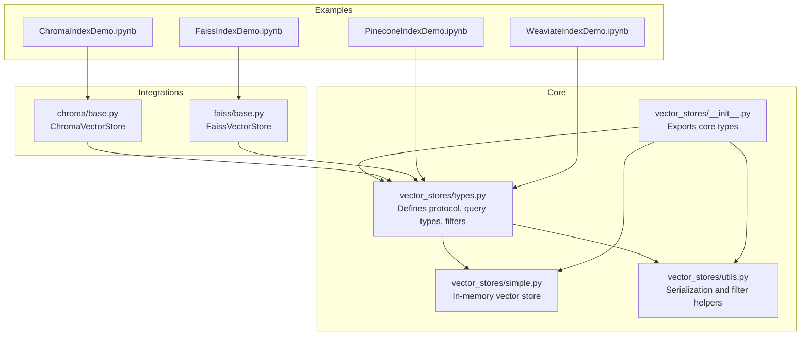
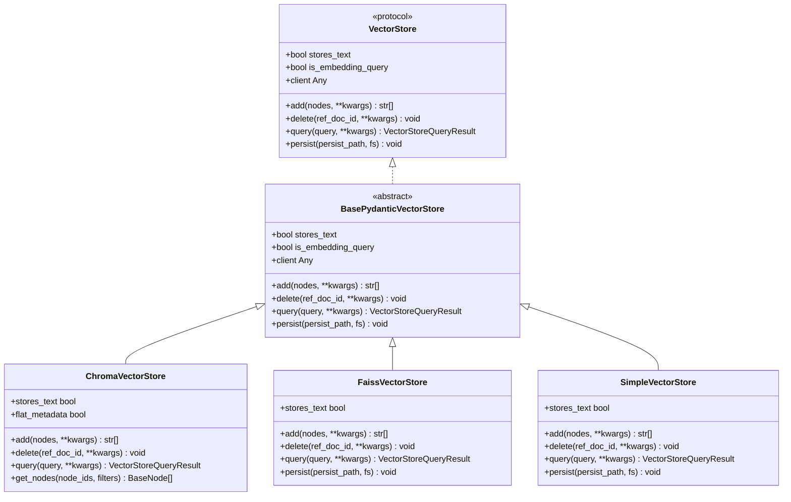
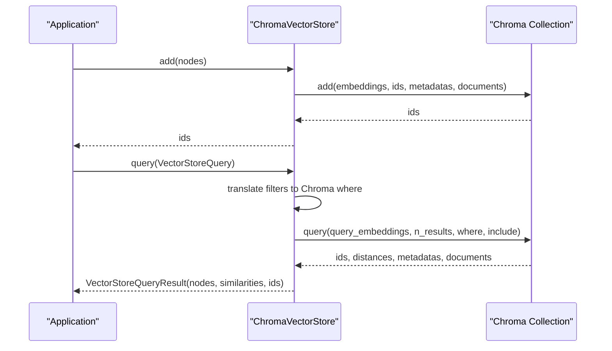
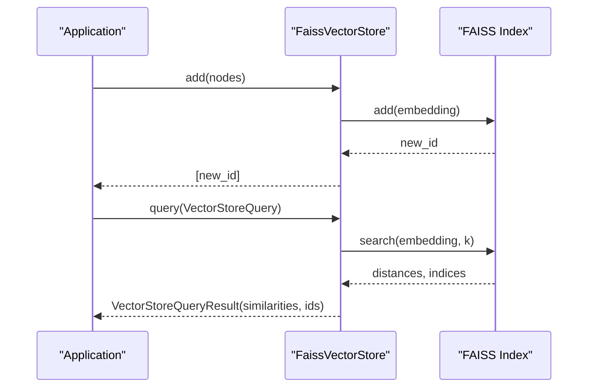
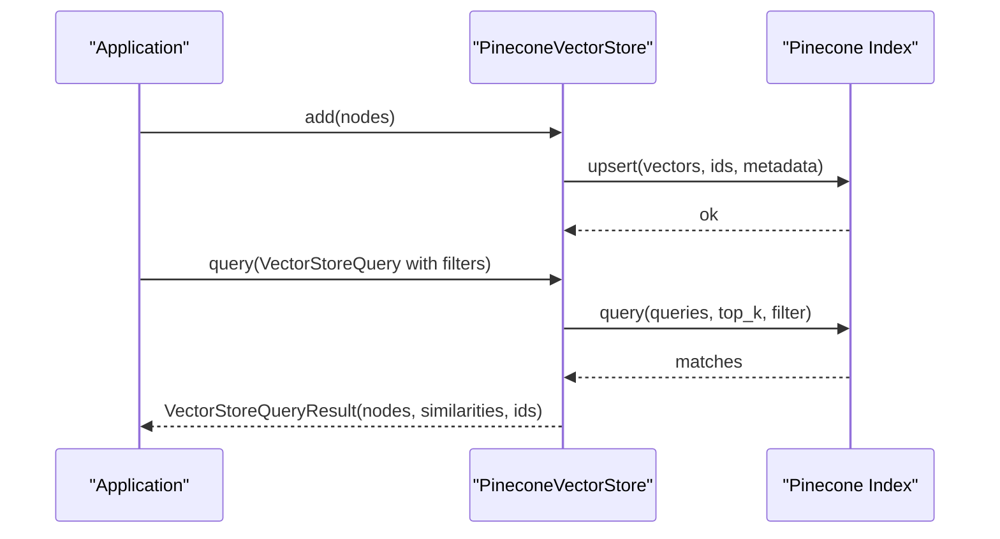
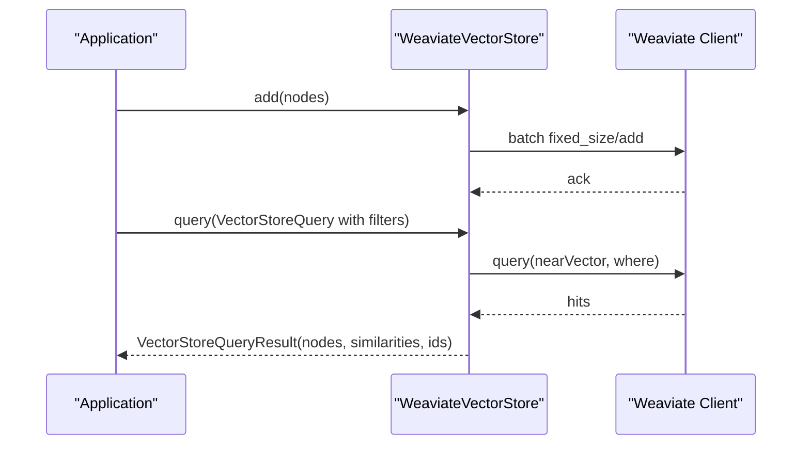
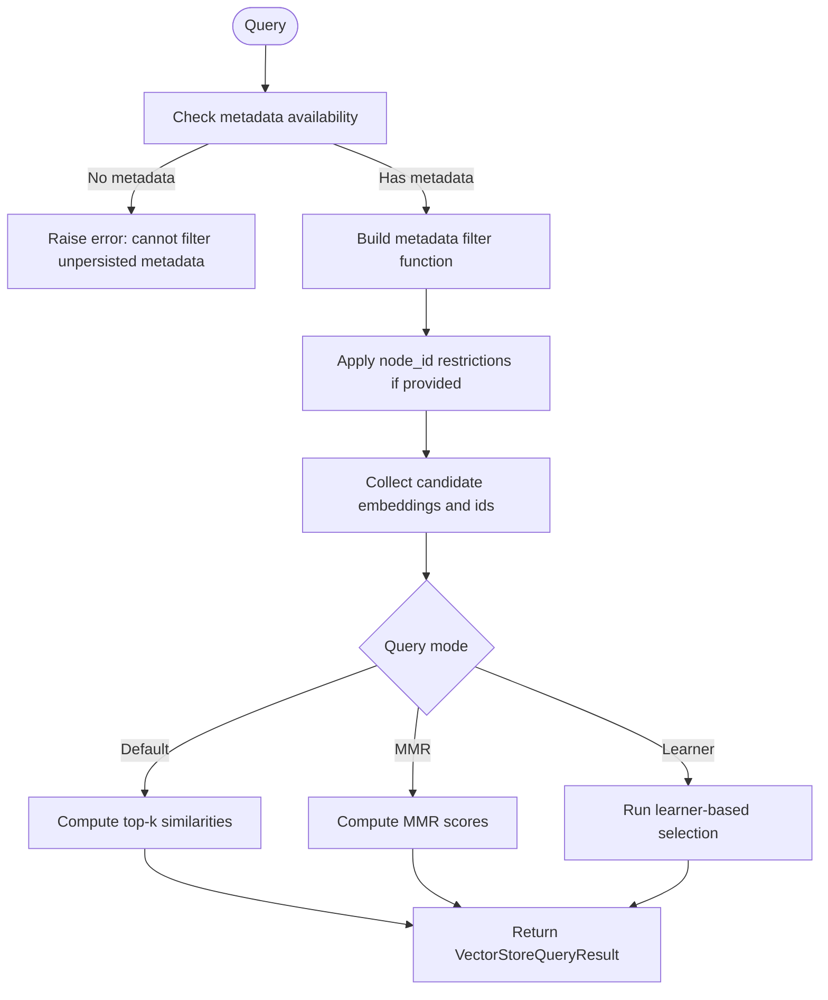
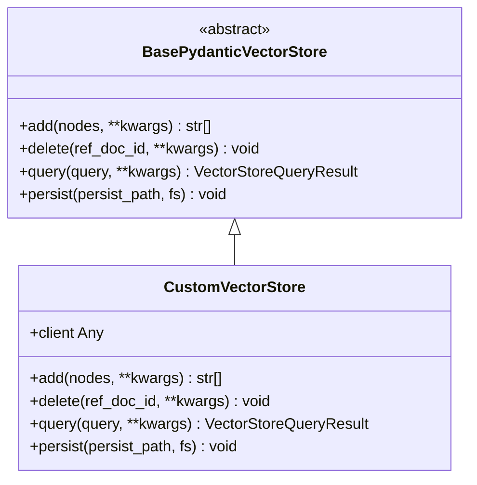
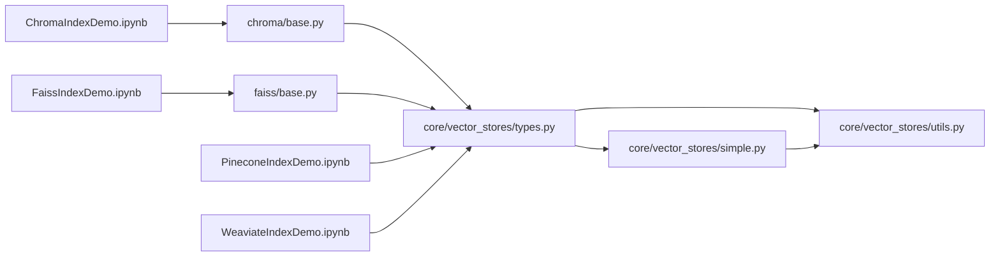

# Vector Stores

<cite>
**Referenced Files in This Document**
- [types.py](file://llama-index-core/llama_index/core/vector_stores/types.py)
- [simple.py](file://llama-index-core/llama_index/core/vector_stores/simple.py)
- [utils.py](file://llama-index-core/llama_index/core/vector_stores/utils.py)
- [__init__.py](file://llama-index-core/llama_index/core/vector_stores/__init__.py)
- [base.py](file://llama-index-integrations/vector_stores/llama-index-vector-stores-chroma/llama_index/vector_stores/chroma/base.py)
- [__init__.py](file://llama-index-integrations/vector_stores/llama-index-vector-stores-chroma/llama_index/vector_stores/chroma/__init__.py)
- [base.py](file://llama-index-integrations/vector_stores/llama-index-vector-stores-faiss/llama_index/vector_stores/faiss/base.py)
- [__init__.py](file://llama-index-integrations/vector_stores/llama-index-vector-stores-faiss/llama_index/vector_stores/faiss/__init__.py)
- [ChromaIndexDemo.ipynb](file://docs/examples/vector_stores/ChromaIndexDemo.ipynb)
- [FaissIndexDemo.ipynb](file://docs/examples/vector_stores/FaissIndexDemo.ipynb)
- [PineconeIndexDemo.ipynb](file://docs/examples/vector_stores/PineconeIndexDemo.ipynb)
- [WeaviateIndexDemo.ipynb](file://docs/examples/vector_stores/WeaviateIndexDemo.ipynb)
</cite>

## Table of Contents
1. [Introduction](#introduction)
2. [Project Structure](#project-structure)
3. [Core Components](#core-components)
4. [Architecture Overview](#architecture-overview)
5. [Detailed Component Analysis](#detailed-component-analysis)
6. [Dependency Analysis](#dependency-analysis)
7. [Performance Considerations](#performance-considerations)
8. [Troubleshooting Guide](#troubleshooting-guide)
9. [Conclusion](#conclusion)
10. [Appendices](#appendices)

## Introduction
This document explains how vector stores integrate with LlamaIndex, focusing on major vector databases and local solutions. It covers installation, configuration, indexing strategies, query optimization, metadata filtering, and production considerations. It also includes guidance for implementing custom vector stores and local development setups.

## Project Structure
LlamaIndex provides:
- A unified vector store protocol and shared types in the core module
- Reference implementations for popular vector databases in the integrations module
- Extensive examples demonstrating setup and usage across Chroma, FAISS, Pinecone, and Weaviate

**Diagram sources**
- [types.py](file://llama-index-core/llama_index/core/vector_stores/types.py#L268-L439)
- [simple.py](file://llama-index-core/llama_index/core/vector_stores/simple.py#L64-L355)
- [utils.py](file://llama-index-core/llama_index/core/vector_stores/utils.py#L40-L235)
- [__init__.py](file://llama-index-core/llama_index/core/vector_stores/__init__.py#L1-L28)
- [base.py](file://llama-index-integrations/vector_stores/llama-index-vector-stores-chroma/llama_index/vector_stores/chroma/base.py#L120-L709)
- [base.py](file://llama-index-integrations/vector_stores/llama-index-vector-stores-faiss/llama_index/vector_stores/faiss/base.py#L33-L223)
- [ChromaIndexDemo.ipynb](file://docs/examples/vector_stores/ChromaIndexDemo.ipynb#L1-L435)
- [FaissIndexDemo.ipynb](file://docs/examples/vector_stores/FaissIndexDemo.ipynb#L1-L261)
- [PineconeIndexDemo.ipynb](file://docs/examples/vector_stores/PineconeIndexDemo.ipynb#L1-L387)
- [WeaviateIndexDemo.ipynb](file://docs/examples/vector_stores/WeaviateIndexDemo.ipynb#L1-L446)

**Section sources**
- [types.py](file://llama-index-core/llama_index/core/vector_stores/types.py#L1-L439)
- [simple.py](file://llama-index-core/llama_index/core/vector_stores/simple.py#L1-L355)
- [utils.py](file://llama-index-core/llama_index/core/vector_stores/utils.py#L1-L235)
- [__init__.py](file://llama-index-core/llama_index/core/vector_stores/__init__.py#L1-L28)
- [base.py](file://llama-index-integrations/vector_stores/llama-index-vector-stores-chroma/llama_index/vector_stores/chroma/base.py#L1-L709)
- [base.py](file://llama-index-integrations/vector_stores/llama-index-vector-stores-faiss/llama_index/vector_stores/faiss/base.py#L1-L223)
- [ChromaIndexDemo.ipynb](file://docs/examples/vector_stores/ChromaIndexDemo.ipynb#L1-L435)
- [FaissIndexDemo.ipynb](file://docs/examples/vector_stores/FaissIndexDemo.ipynb#L1-L261)
- [PineconeIndexDemo.ipynb](file://docs/examples/vector_stores/PineconeIndexDemo.ipynb#L1-L387)
- [WeaviateIndexDemo.ipynb](file://docs/examples/vector_stores/WeaviateIndexDemo.ipynb#L1-L446)

## Core Components
- Vector store protocol and query model
  - Defines the contract for add/query/delete operations and the query/result structures
  - Provides standardized metadata filtering and query modes (e.g., MMR)
- Simple vector store
  - In-memory dictionary-backed store suitable for local development and testing
  - Persists to JSON and supports basic filtering and retrieval
- Utilities
  - Serialization helpers for nodes and metadata
  - Filter builder for applying metadata conditions across stores

Key capabilities:
- Query modes: semantic, sparse, hybrid, text search, MMR
- Metadata filtering: equality, comparison, containment, text match, logical combinations
- Persistence: configurable per-store, with namespacing and filesystem support

**Section sources**
- [types.py](file://llama-index-core/llama_index/core/vector_stores/types.py#L268-L439)
- [simple.py](file://llama-index-core/llama_index/core/vector_stores/simple.py#L64-L355)
- [utils.py](file://llama-index-core/llama_index/core/vector_stores/utils.py#L40-L176)
- [__init__.py](file://llama-index-core/llama_index/core/vector_stores/__init__.py#L1-L28)

## Architecture Overview
The vector store architecture centers on a protocol that abstracts away the underlying database while enabling consistent indexing and querying across implementations.

**Diagram sources**
- [types.py](file://llama-index-core/llama_index/core/vector_stores/types.py#L268-L439)
- [base.py](file://llama-index-integrations/vector_stores/llama-index-vector-stores-chroma/llama_index/vector_stores/chroma/base.py#L120-L709)
- [base.py](file://llama-index-integrations/vector_stores/llama-index-vector-stores-faiss/llama_index/vector_stores/faiss/base.py#L33-L223)
- [simple.py](file://llama-index-core/llama_index/core/vector_stores/simple.py#L64-L355)

## Detailed Component Analysis

### Chroma Vector Store
ChromaVectorStore integrates with ChromaDB collections to provide scalable vector search with metadata filtering and MMR support.

- Setup modes
  - In-memory ephemeral client
  - Persistent client with local directory
  - Remote HTTP client connecting to a Chroma server
- Features
  - Adds nodes with embeddings, documents, and flattened metadata
  - Filters using a translation layer to Chroma’s query syntax
  - MMR search with prefetch factor and threshold controls
  - Retrieval via get or query, returning nodes with reconstructed content
- Usage examples
  - Notebook demonstrates initialization, indexing, persistence, querying, and updates/deletes

**Diagram sources**
- [base.py](file://llama-index-integrations/vector_stores/llama-index-vector-stores-chroma/llama_index/vector_stores/chroma/base.py#L284-L482)
- [ChromaIndexDemo.ipynb](file://docs/examples/vector_stores/ChromaIndexDemo.ipynb#L1-L435)

**Section sources**
- [base.py](file://llama-index-integrations/vector_stores/llama-index-vector-stores-chroma/llama_index/vector_stores/chroma/base.py#L1-L709)
- [ChromaIndexDemo.ipynb](file://docs/examples/vector_stores/ChromaIndexDemo.ipynb#L1-L435)

### FAISS Vector Store
FaissVectorStore wraps a FAISS index for high-performance similarity search, optimized for CPU environments.

- Setup
  - Initialize a FAISS index (e.g., IndexFlatL2) with the appropriate embedding dimension
  - Persist and load FAISS indexes to/from disk
- Features
  - Adds vectors to the index and returns numeric IDs
  - Searches for nearest neighbors using L2 distance
  - No metadata filtering or deletion support in this implementation
- Usage examples
  - Notebook demonstrates creating an index, loading documents, persisting/loading, and querying

**Diagram sources**
- [base.py](file://llama-index-integrations/vector_stores/llama-index-vector-stores-faiss/llama_index/vector_stores/faiss/base.py#L119-L223)
- [FaissIndexDemo.ipynb](file://docs/examples/vector_stores/FaissIndexDemo.ipynb#L1-L261)

**Section sources**
- [base.py](file://llama-index-integrations/vector_stores/llama-index-vector-stores-faiss/llama_index/vector_stores/faiss/base.py#L1-L223)
- [FaissIndexDemo.ipynb](file://docs/examples/vector_stores/FaissIndexDemo.ipynb#L1-L261)

### Pinecone Vector Store
Pinecone integration enables managed vector search with metadata filtering and hybrid search capabilities.

- Setup
  - Create a Pinecone index with the correct dimension and metric
  - Initialize PineconeVectorStore with the index
- Features
  - Metadata filtering via MetadataFilters and FilterOperator
  - Query engine supports top-k and filters
- Usage examples
  - Notebook demonstrates index creation, indexing, querying, and filtering

**Diagram sources**
- [PineconeIndexDemo.ipynb](file://docs/examples/vector_stores/PineconeIndexDemo.ipynb#L1-L387)

**Section sources**
- [PineconeIndexDemo.ipynb](file://docs/examples/vector_stores/PineconeIndexDemo.ipynb#L1-L387)

### Weaviate Vector Store
Weaviate integration supports vector search with rich metadata filtering and optional custom batch configurations.

- Setup
  - Connect to Weaviate cloud or local instance
  - Initialize WeaviateVectorStore with an index name
- Features
  - Custom batch configuration for ingestion control
  - Metadata filtering and index deletion utilities
- Usage examples
  - Notebook demonstrates client setup, indexing, querying, filtering, and cleanup

**Diagram sources**
- [WeaviateIndexDemo.ipynb](file://docs/examples/vector_stores/WeaviateIndexDemo.ipynb#L1-L446)

**Section sources**
- [WeaviateIndexDemo.ipynb](file://docs/examples/vector_stores/WeaviateIndexDemo.ipynb#L1-L446)

### Simple Vector Store
SimpleVectorStore is an in-memory, JSON-persisted store useful for local development and testing.

- Capabilities
  - Stores embeddings and metadata keyed by node IDs
  - Supports filtering via metadata lookup functions
  - Query modes: default, MMR, and learner-based modes
- Persistence
  - Namespaced persistence with configurable directories and filenames

**Diagram sources**
- [simple.py](file://llama-index-core/llama_index/core/vector_stores/simple.py#L244-L316)

**Section sources**
- [simple.py](file://llama-index-core/llama_index/core/vector_stores/simple.py#L1-L355)

### Metadata Filtering and Similarity Functions
- Metadata filtering
  - Standardized operators and conditions across stores
  - Translation helpers for store-specific filter syntax (e.g., Chroma)
- Similarity and scoring
  - Stores convert distances/scores to similarities for consistent results
  - MMR mode improves diversity by balancing relevance and repetition

**Section sources**
- [types.py](file://llama-index-core/llama_index/core/vector_stores/types.py#L63-L186)
- [utils.py](file://llama-index-core/llama_index/core/vector_stores/utils.py#L101-L176)
- [base.py](file://llama-index-integrations/vector_stores/llama-index-vector-stores-chroma/llama_index/vector_stores/chroma/base.py#L483-L656)

### Custom Vector Store Implementation
To implement a custom vector store:
- Implement BasePydanticVectorStore or adhere to the VectorStore protocol
- Define add, delete, query, and persist methods
- Handle metadata serialization/deserialization using node_to_metadata_dict and metadata_dict_to_node
- Translate standard filters to your backend’s native filter syntax if applicable

**Diagram sources**
- [types.py](file://llama-index-core/llama_index/core/vector_stores/types.py#L334-L439)
- [utils.py](file://llama-index-core/llama_index/core/vector_stores/utils.py#L40-L98)

**Section sources**
- [types.py](file://llama-index-core/llama_index/core/vector_stores/types.py#L268-L439)
- [utils.py](file://llama-index-core/llama_index/core/vector_stores/utils.py#L40-L98)

## Dependency Analysis
- Core depends on shared types and utilities
- Integrations depend on external libraries (chromadb, faiss, pinecone, weaviate)
- Examples demonstrate end-to-end flows for each backend

**Diagram sources**
- [types.py](file://llama-index-core/llama_index/core/vector_stores/types.py#L1-L439)
- [simple.py](file://llama-index-core/llama_index/core/vector_stores/simple.py#L1-L355)
- [utils.py](file://llama-index-core/llama_index/core/vector_stores/utils.py#L1-L235)
- [base.py](file://llama-index-integrations/vector_stores/llama-index-vector-stores-chroma/llama_index/vector_stores/chroma/base.py#L1-L709)
- [base.py](file://llama-index-integrations/vector_stores/llama-index-vector-stores-faiss/llama_index/vector_stores/faiss/base.py#L1-L223)
- [ChromaIndexDemo.ipynb](file://docs/examples/vector_stores/ChromaIndexDemo.ipynb#L1-L435)
- [FaissIndexDemo.ipynb](file://docs/examples/vector_stores/FaissIndexDemo.ipynb#L1-L261)
- [PineconeIndexDemo.ipynb](file://docs/examples/vector_stores/PineconeIndexDemo.ipynb#L1-L387)
- [WeaviateIndexDemo.ipynb](file://docs/examples/vector_stores/WeaviateIndexDemo.ipynb#L1-L446)

**Section sources**
- [types.py](file://llama-index-core/llama_index/core/vector_stores/types.py#L1-L439)
- [simple.py](file://llama-index-core/llama_index/core/vector_stores/simple.py#L1-L355)
- [utils.py](file://llama-index-core/llama_index/core/vector_stores/utils.py#L1-L235)
- [base.py](file://llama-index-integrations/vector_stores/llama-index-vector-stores-chroma/llama_index/vector_stores/chroma/base.py#L1-L709)
- [base.py](file://llama-index-integrations/vector_stores/llama-index-vector-stores-faiss/llama_index/vector_stores/faiss/base.py#L1-L223)
- [ChromaIndexDemo.ipynb](file://docs/examples/vector_stores/ChromaIndexDemo.ipynb#L1-L435)
- [FaissIndexDemo.ipynb](file://docs/examples/vector_stores/FaissIndexDemo.ipynb#L1-L261)
- [PineconeIndexDemo.ipynb](file://docs/examples/vector_stores/PineconeIndexDemo.ipynb#L1-L387)
- [WeaviateIndexDemo.ipynb](file://docs/examples/vector_stores/WeaviateIndexDemo.ipynb#L1-L446)

## Performance Considerations
- Embedding dimensionality
  - Ensure the vector store dimension matches the embedding model (e.g., 1536 for text-embedding-ada-002)
- Indexing strategies
  - Batch inserts where supported (e.g., Chroma chunking, Weaviate fixed-size batches)
  - Prefer persistent backends for large-scale deployments
- Query optimization
  - Use MMR to improve diversity when needed
  - Limit top-k and leverage filters to reduce result sets
- Storage and persistence
  - Use namespaced persistence for multi-tenant or multi-index setups
  - For FAISS, persist the index to disk for reuse across sessions

[No sources needed since this section provides general guidance]

## Troubleshooting Guide
- Metadata filtering errors
  - Some stores require metadata to be persisted to enable filtering; otherwise, a clear error is raised
- FAISS limitations
  - Metadata filtering and deletion are not implemented in this store
- Chroma MMR parameters
  - Validate mmr_threshold and prefetch parameters; conflicts are detected and reported
- Weaviate connection lifecycle
  - Always close client connections to avoid resource leaks

**Section sources**
- [simple.py](file://llama-index-core/llama_index/core/vector_stores/simple.py#L244-L259)
- [base.py](file://llama-index-integrations/vector_stores/llama-index-vector-stores-faiss/llama_index/vector_stores/faiss/base.py#L173-L198)
- [base.py](file://llama-index-integrations/vector_stores/llama-index-vector-stores-chroma/llama_index/vector_stores/chroma/base.py#L483-L522)
- [WeaviateIndexDemo.ipynb](file://docs/examples/vector_stores/WeaviateIndexDemo.ipynb#L406-L423)

## Conclusion
LlamaIndex offers a consistent vector store abstraction with robust integrations for Chroma, FAISS, Pinecone, and Weaviate. The core types and utilities enable portable metadata filtering and query modes, while examples illustrate practical setup and optimization. For production, select a managed or scalable backend, configure persistence and batching appropriately, and leverage MMR and filters to balance accuracy and diversity.

[No sources needed since this section summarizes without analyzing specific files]

## Appendices

### Installation and Quick Setup References
- Chroma
  - Install the integration package and follow the notebook example for ephemeral, persistent, and remote clients
  - [ChromaIndexDemo.ipynb](file://docs/examples/vector_stores/ChromaIndexDemo.ipynb#L1-L435)
- FAISS
  - Install the integration package and create a FAISS index with the correct dimension
  - [FaissIndexDemo.ipynb](file://docs/examples/vector_stores/FaissIndexDemo.ipynb#L1-L261)
- Pinecone
  - Create an index with the correct dimension and metric, then initialize PineconeVectorStore
  - [PineconeIndexDemo.ipynb](file://docs/examples/vector_stores/PineconeIndexDemo.ipynb#L1-L387)
- Weaviate
  - Connect to a Weaviate cluster or local instance and initialize WeaviateVectorStore
  - [WeaviateIndexDemo.ipynb](file://docs/examples/vector_stores/WeaviateIndexDemo.ipynb#L1-L446)

### Query Modes and Filters Reference
- Query modes and filter operators are defined in the core types
  - [types.py](file://llama-index-core/llama_index/core/vector_stores/types.py#L45-L186)