# Examples and Tutorials

<cite>
**Referenced Files in This Document**
- [examples/fastapi_rag_ollama/README.md](file://examples/fastapi_rag_ollama/README.md)
- [examples/fastapi_rag_ollama/app.py](file://examples/fastapi_rag_ollama/app.py)
- [examples/token_based_code_splitter_example.py](file://examples/token_based_code_splitter_example.py)
- [docs/examples/cookbooks/GraphRAG_v1.ipynb](file://docs/examples/cookbooks/GraphRAG_v1.ipynb)
- [docs/examples/cookbooks/llama3_cookbook.ipynb](file://docs/examples/cookbooks/llama3_cookbook.ipynb)
- [docs/examples/finetuning/embeddings/eval_utils.py](file://docs/examples/finetuning/embeddings/eval_utils.py)
- [docs/examples/data_connectors/simple_directory_reader.ipynb](file://docs/examples/data_connectors/simple_directory_reader.ipynb)
- [docs/examples/data_connectors/ChromaDemo.ipynb](file://docs/examples/data_connectors/ChromaDemo.ipynb)
- [docs/examples/data_connectors/WeaviateDemo.ipynb](file://docs/examples/data_connectors/WeaviateDemo.ipynb)
- [docs/examples/data_connectors/QdrantDemo.ipynb](file://docs/examples/data_connectors/QdrantDemo.ipynb)
- [docs/examples/chat_engine/chat_engine_best.ipynb](file://docs/examples/chat_engine/chat_engine_best.ipynb)
- [docs/examples/vector_stores/ChromaDemo.ipynb](file://docs/examples/vector_stores/ChromaDemo.ipynb)
- [docs/examples/vector_stores/WeaviateDemo.ipynb](file://docs/examples/vector_stores/WeaviateDemo.ipynb)
- [docs/examples/vector_stores/PineconeDemo.ipynb](file://docs/examples/vector_stores/PineconeDemo.ipynb)
- [docs/examples/retrievers/bm25_retriever.ipynb](file://docs/examples/retrievers/bm25_retriever.ipynb)
- [docs/examples/node_postprocessor/contextual_retrieval.ipynb](file://docs/examples/node_postprocessor/contextual_retrieval.ipynb)
- [docs/examples/customization/streaming/streaming_response.ipynb](file://docs/examples/customization/streaming/streaming_response.ipynb)
- [docs/examples/managed/managed_rag.ipynb](file://docs/examples/managed/managed_rag.ipynb)
- [docs/examples/usecases/enterprise_knowledge_base.ipynb](file://docs/examples/usecases/enterprise_knowledge_base.ipynb)
- [docs/examples/multi_modal/llama3_multimodal.ipynb](file://docs/examples/multi_modal/llama3_multimodal.ipynb)
- [docs/examples/agent/openai_agent_with_query_engine.ipynb](file://docs/examples/agent/openai_agent_with_query_engine.ipynb)
- [docs/examples/workflow/basic_workflow.ipynb](file://docs/examples/workflow/basic_workflow.ipynb)
- [docs/examples/instrumentation/langfuse_demo.ipynb](file://docs/examples/instrumentation/langfuse_demo.ipynb)
</cite>

## Table of Contents
1. [Introduction](#introduction)
2. [Project Structure](#project-structure)
3. [Core Components](#core-components)
4. [Architecture Overview](#architecture-overview)
5. [Detailed Component Analysis](#detailed-component-analysis)
6. [Dependency Analysis](#dependency-analysis)
7. [Performance Considerations](#performance-considerations)
8. [Troubleshooting Guide](#troubleshooting-guide)
9. [Conclusion](#conclusion)
10. [Appendices](#appendices)

## Introduction
This document organizes the LlamaIndex examples and tutorials into a structured learning path that progresses from quick-start RAG setups to advanced, production-ready implementations. It covers:
- Beginner-friendly tutorials for local RAG APIs and ingestion basics
- Intermediate topics like retrieval strategies, post-processing, and connectors
- Advanced implementations including GraphRAG, multimodal systems, managed RAG, and enterprise knowledge bases
- Patterns for observability, streaming, and agent-driven workflows
- Best practices for performance, reliability, and maintainability

## Project Structure
The examples are organized by domain and complexity:
- Quick starts: Minimal FastAPI + Ollama RAG
- Data ingestion and connectors: Readers, vector stores, and storage backends
- Retrieval and ranking: BM25, rerankers, and contextual postprocessors
- Query engines and chat: Engines, chat engines, and streaming
- Advanced architectures: GraphRAG, multimodal, managed RAG, and enterprise KB
- Observability and production: Instrumentation, workflows, and agent integrations

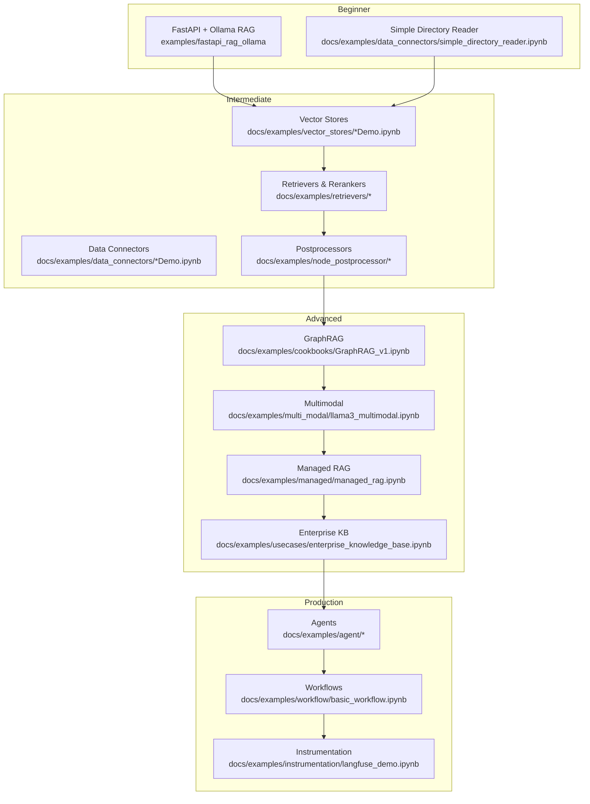

**Diagram sources**
- [examples/fastapi_rag_ollama/app.py](file://examples/fastapi_rag_ollama/app.py#L1-L30)
- [docs/examples/data_connectors/simple_directory_reader.ipynb](file://docs/examples/data_connectors/simple_directory_reader.ipynb)
- [docs/examples/vector_stores/ChromaDemo.ipynb](file://docs/examples/vector_stores/ChromaDemo.ipynb)
- [docs/examples/data_connectors/ChromaDemo.ipynb](file://docs/examples/data_connectors/ChromaDemo.ipynb)
- [docs/examples/retrievers/bm25_retriever.ipynb](file://docs/examples/retrievers/bm25_retriever.ipynb)
- [docs/examples/node_postprocessor/contextual_retrieval.ipynb](file://docs/examples/node_postprocessor/contextual_retrieval.ipynb)
- [docs/examples/cookbooks/GraphRAG_v1.ipynb](file://docs/examples/cookbooks/GraphRAG_v1.ipynb#L1-L200)
- [docs/examples/multi_modal/llama3_multimodal.ipynb](file://docs/examples/multi_modal/llama3_multimodal.ipynb)
- [docs/examples/managed/managed_rag.ipynb](file://docs/examples/managed/managed_rag.ipynb)
- [docs/examples/usecases/enterprise_knowledge_base.ipynb](file://docs/examples/usecases/enterprise_knowledge_base.ipynb)
- [docs/examples/agent/openai_agent_with_query_engine.ipynb](file://docs/examples/agent/openai_agent_with_query_engine.ipynb)
- [docs/examples/workflow/basic_workflow.ipynb](file://docs/examples/workflow/basic_workflow.ipynb)
- [docs/examples/instrumentation/langfuse_demo.ipynb](file://docs/examples/instrumentation/langfuse_demo.ipynb)

**Section sources**
- [examples/fastapi_rag_ollama/README.md](file://examples/fastapi_rag_ollama/README.md#L1-L58)
- [examples/fastapi_rag_ollama/app.py](file://examples/fastapi_rag_ollama/app.py#L1-L30)

## Core Components
- Data ingestion: Readers and connectors for local and cloud sources
- Indexing and retrieval: Vector stores, BM25, and rerankers
- Query engines and chat: Engines, chat engines, and streaming responses
- Postprocessing: Contextual retrieval and other node processors
- Agents and workflows: Tool-use, orchestration, and observability
- Production patterns: Managed RAG, enterprise KB, and multimodal systems

**Section sources**
- [docs/examples/data_connectors/simple_directory_reader.ipynb](file://docs/examples/data_connectors/simple_directory_reader.ipynb)
- [docs/examples/vector_stores/ChromaDemo.ipynb](file://docs/examples/vector_stores/ChromaDemo.ipynb)
- [docs/examples/retrievers/bm25_retriever.ipynb](file://docs/examples/retrievers/bm25_retriever.ipynb)
- [docs/examples/node_postprocessor/contextual_retrieval.ipynb](file://docs/examples/node_postprocessor/contextual_retrieval.ipynb)
- [docs/examples/chat_engine/chat_engine_best.ipynb](file://docs/examples/chat_engine/chat_engine_best.ipynb)
- [docs/examples/customization/streaming/streaming_response.ipynb](file://docs/examples/customization/streaming/streaming_response.ipynb)
- [docs/examples/agent/openai_agent_with_query_engine.ipynb](file://docs/examples/agent/openai_agent_with_query_engine.ipynb)
- [docs/examples/workflow/basic_workflow.ipynb](file://docs/examples/workflow/basic_workflow.ipynb)
- [docs/examples/instrumentation/langfuse_demo.ipynb](file://docs/examples/instrumentation/langfuse_demo.ipynb)

## Architecture Overview
The examples illustrate a layered progression:
- Data ingestion and parsing
- Embedding and indexing
- Retrieval and reranking
- Query synthesis and response streaming
- Agent orchestration and observability

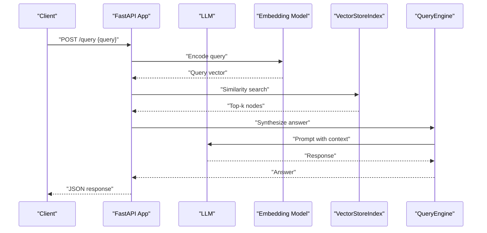

**Diagram sources**
- [examples/fastapi_rag_ollama/app.py](file://examples/fastapi_rag_ollama/app.py#L1-L30)

**Section sources**
- [examples/fastapi_rag_ollama/app.py](file://examples/fastapi_rag_ollama/app.py#L1-L30)

## Detailed Component Analysis

### Beginner: FastAPI + Ollama RAG
- Objective: Build a minimal, local-first RAG API using Ollama for LLM and embeddings
- Highlights: Local deployment, simple ingestion, and a single query endpoint
- Learning outcomes: Understanding of Settings, VectorStoreIndex, and query engine lifecycle

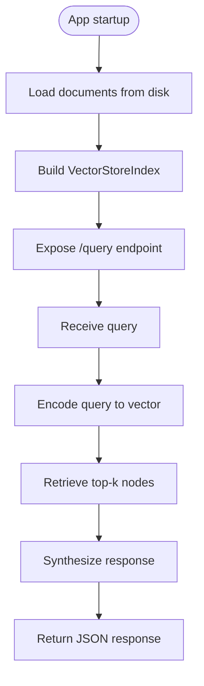

**Diagram sources**
- [examples/fastapi_rag_ollama/app.py](file://examples/fastapi_rag_oolama/app.py#L15-L29)

**Section sources**
- [examples/fastapi_rag_ollama/README.md](file://examples/fastapi_rag_ollama/README.md#L1-L58)
- [examples/fastapi_rag_ollama/app.py](file://examples/fastapi_rag_ollama/app.py#L1-L30)

### Intermediate: Data Connectors and Vector Stores
- Data connectors: Readers for local directories, cloud databases, and document formats
- Vector stores: Chroma, Weaviate, Pinecone demos for indexing and similarity search
- Learning outcomes: Choosing the right connector, configuring vector stores, and scaling retrieval

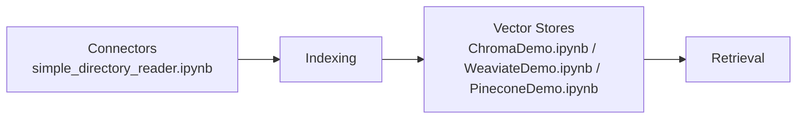

**Diagram sources**
- [docs/examples/data_connectors/simple_directory_reader.ipynb](file://docs/examples/data_connectors/simple_directory_reader.ipynb)
- [docs/examples/vector_stores/ChromaDemo.ipynb](file://docs/examples/vector_stores/ChromaDemo.ipynb)
- [docs/examples/vector_stores/WeaviateDemo.ipynb](file://docs/examples/vector_stores/WeaviateDemo.ipynb)
- [docs/examples/vector_stores/PineconeDemo.ipynb](file://docs/examples/vector_stores/PineconeDemo.ipynb)

**Section sources**
- [docs/examples/data_connectors/simple_directory_reader.ipynb](file://docs/examples/data_connectors/simple_directory_reader.ipynb)
- [docs/examples/data_connectors/ChromaDemo.ipynb](file://docs/examples/data_connectors/ChromaDemo.ipynb)
- [docs/examples/data_connectors/WeaviateDemo.ipynb](file://docs/examples/data_connectors/WeaviateDemo.ipynb)
- [docs/examples/data_connectors/QdrantDemo.ipynb](file://docs/examples/data_connectors/QdrantDemo.ipynb)
- [docs/examples/vector_stores/ChromaDemo.ipynb](file://docs/examples/vector_stores/ChromaDemo.ipynb)
- [docs/examples/vector_stores/WeaviateDemo.ipynb](file://docs/examples/vector_stores/WeaviateDemo.ipynb)
- [docs/examples/vector_stores/PineconeDemo.ipynb](file://docs/examples/vector_stores/PineconeDemo.ipynb)

### Intermediate: Retrievers and Postprocessors
- Retrievers: BM25 for lexical matching
- Postprocessors: Contextual retrieval and others for relevance refinement
- Learning outcomes: Tuning retrieval quality and reducing hallucinations

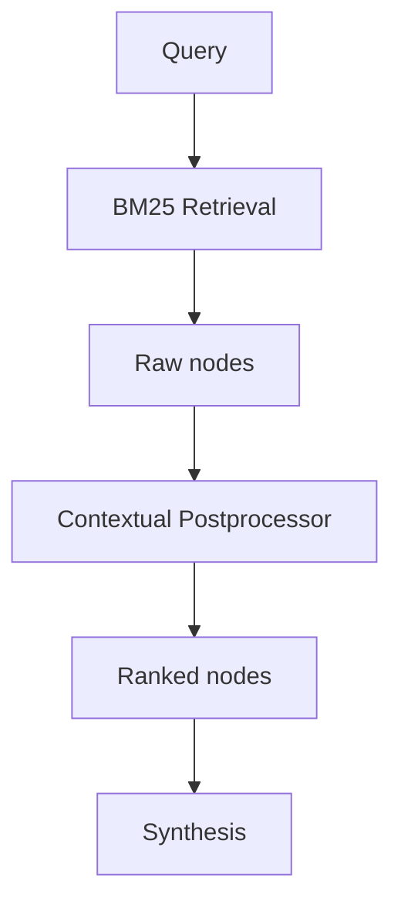

**Diagram sources**
- [docs/examples/retrievers/bm25_retriever.ipynb](file://docs/examples/retrievers/bm25_retriever.ipynb)
- [docs/examples/node_postprocessor/contextual_retrieval.ipynb](file://docs/examples/node_postprocessor/contextual_retrieval.ipynb)

**Section sources**
- [docs/examples/retrievers/bm25_retriever.ipynb](file://docs/examples/retrievers/bm25_retriever.ipynb)
- [docs/examples/node_postprocessor/contextual_retrieval.ipynb](file://docs/examples/node_postprocessor/contextual_retrieval.ipynb)

### Intermediate: Chat Engines and Streaming
- Chat engines: Best practices for context, condensation, and personality
- Streaming: Incremental response generation for improved UX
- Learning outcomes: Building conversational experiences and managing long contexts

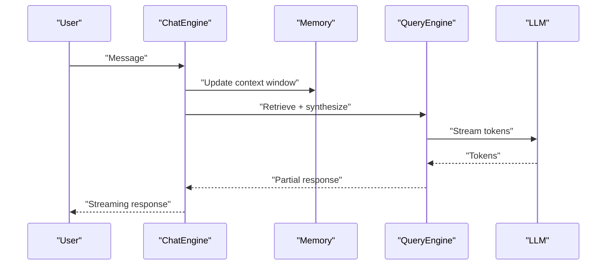

**Diagram sources**
- [docs/examples/chat_engine/chat_engine_best.ipynb](file://docs/examples/chat_engine/chat_engine_best.ipynb)
- [docs/examples/customization/streaming/streaming_response.ipynb](file://docs/examples/customization/streaming/streaming_response.ipynb)

**Section sources**
- [docs/examples/chat_engine/chat_engine_best.ipynb](file://docs/examples/chat_engine/chat_engine_best.ipynb)
- [docs/examples/customization/streaming/streaming_response.ipynb](file://docs/examples/customization/streaming/streaming_response.ipynb)

### Advanced: GraphRAG
- Objective: Hierarchical community detection and summarization for complex queries
- Topics: Element extraction, community partitioning, and global answer synthesis
- Learning outcomes: Scaling retrieval to large corpora and improving thematic understanding

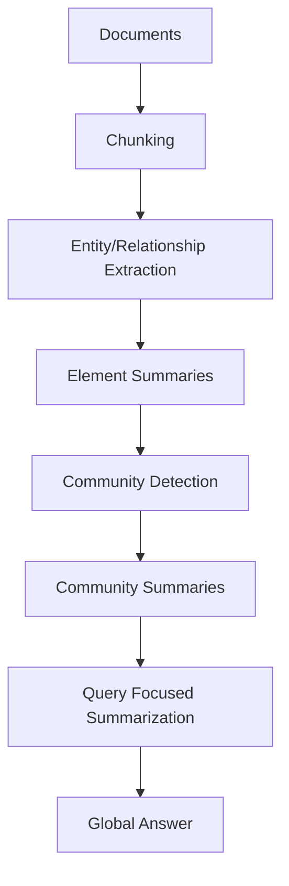

**Diagram sources**
- [docs/examples/cookbooks/GraphRAG_v1.ipynb](file://docs/examples/cookbooks/GraphRAG_v1.ipynb#L25-L71)

**Section sources**
- [docs/examples/cookbooks/GraphRAG_v1.ipynb](file://docs/examples/cookbooks/GraphRAG_v1.ipynb#L1-L200)

### Advanced: Multimodal RAG
- Objective: Extend RAG to images and vision-language models
- Topics: Vision encoders, image retrieval, and multimodal query engines
- Learning outcomes: Integrating images and text for richer retrieval

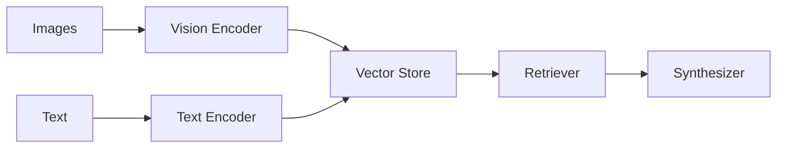

**Diagram sources**
- [docs/examples/multi_modal/llama3_multimodal.ipynb](file://docs/examples/multi_modal/llama3_multimodal.ipynb)

**Section sources**
- [docs/examples/multi_modal/llama3_multimodal.ipynb](file://docs/examples/multi_modal/llama3_multimodal.ipynb)

### Advanced: Managed RAG and Enterprise Knowledge Base
- Managed RAG: Using managed indices and providers for scalability and governance
- Enterprise KB: Structured ingestion, governance, and multi-tenant considerations
- Learning outcomes: Production-grade RAG with managed services and enterprise policies

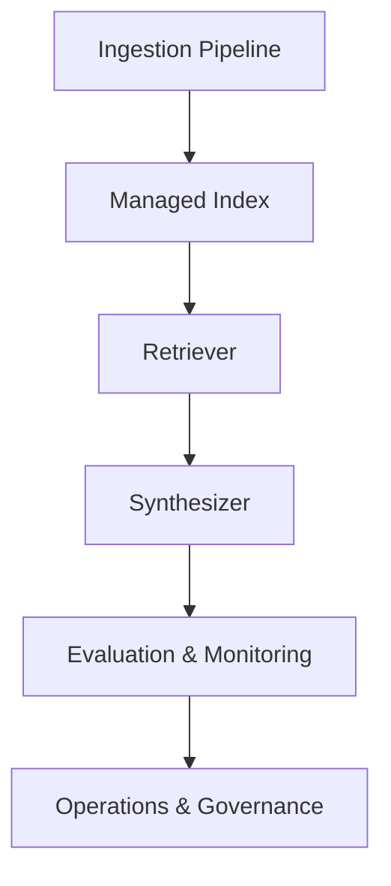

**Diagram sources**
- [docs/examples/managed/managed_rag.ipynb](file://docs/examples/managed/managed_rag.ipynb)
- [docs/examples/usecases/enterprise_knowledge_base.ipynb](file://docs/examples/usecases/enterprise_knowledge_base.ipynb)

**Section sources**
- [docs/examples/managed/managed_rag.ipynb](file://docs/examples/managed/managed_rag.ipynb)
- [docs/examples/usecases/enterprise_knowledge_base.ipynb](file://docs/examples/usecases/enterprise_knowledge_base.ipynb)

### Production: Agents, Workflows, and Instrumentation
- Agents: Tool-use, multi-step reasoning, and orchestrations
- Workflows: Automated pipelines for ingestion and evaluation
- Instrumentation: Observability and tracing for production monitoring
- Learning outcomes: End-to-end automation and operational visibility

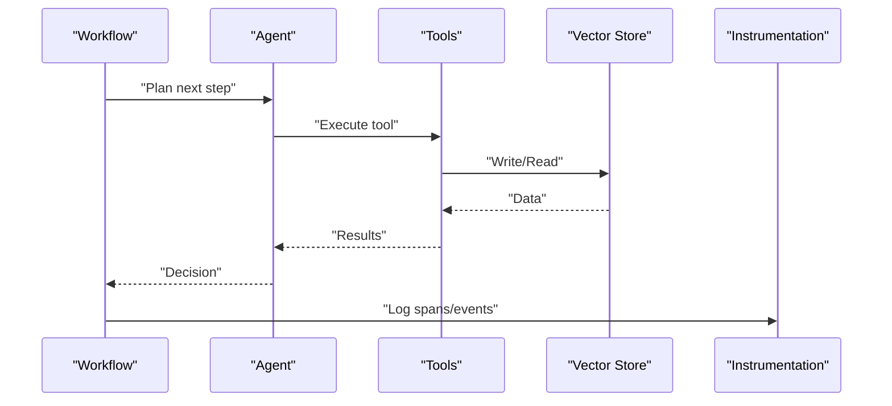

**Diagram sources**
- [docs/examples/agent/openai_agent_with_query_engine.ipynb](file://docs/examples/agent/openai_agent_with_query_engine.ipynb)
- [docs/examples/workflow/basic_workflow.ipynb](file://docs/examples/workflow/basic_workflow.ipynb)
- [docs/examples/instrumentation/langfuse_demo.ipynb](file://docs/examples/instrumentation/langfuse_demo.ipynb)

**Section sources**
- [docs/examples/agent/openai_agent_with_query_engine.ipynb](file://docs/examples/agent/openai_agent_with_query_engine.ipynb)
- [docs/examples/workflow/basic_workflow.ipynb](file://docs/examples/workflow/basic_workflow.ipynb)
- [docs/examples/instrumentation/langfuse_demo.ipynb](file://docs/examples/instrumentation/langfuse_demo.ipynb)

## Dependency Analysis
- Core runtime: FastAPI app depends on LlamaIndex core, Ollama LLM, and Ollama embeddings
- Data connectors: Reader demos depend on specific backend clients (e.g., Chroma, Weaviate, Qdrant)
- Retrieval stack: Vector stores integrate with retrievers and postprocessors
- Advanced stacks: GraphRAG and multimodal rely on specialized components and providers

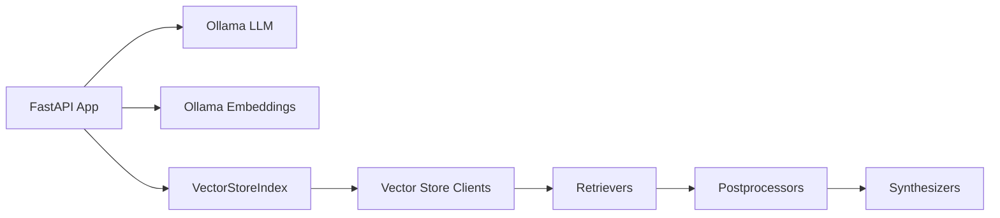

**Diagram sources**
- [examples/fastapi_rag_ollama/app.py](file://examples/fastapi_rag_ollama/app.py#L1-L30)
- [docs/examples/data_connectors/ChromaDemo.ipynb](file://docs/examples/data_connectors/ChromaDemo.ipynb)
- [docs/examples/data_connectors/WeaviateDemo.ipynb](file://docs/examples/data_connectors/WeaviateDemo.ipynb)
- [docs/examples/data_connectors/QdrantDemo.ipynb](file://docs/examples/data_connectors/QdrantDemo.ipynb)

**Section sources**
- [examples/fastapi_rag_ollama/app.py](file://examples/fastapi_rag_ollama/app.py#L1-L30)
- [docs/examples/data_connectors/ChromaDemo.ipynb](file://docs/examples/data_connectors/ChromaDemo.ipynb)
- [docs/examples/data_connectors/WeaviateDemo.ipynb](file://docs/examples/data_connectors/WeaviateDemo.ipynb)
- [docs/examples/data_connectors/QdrantDemo.ipynb](file://docs/examples/data_connectors/QdrantDemo.ipynb)

## Performance Considerations
- Token-aware chunking: Prefer token-based splitting for accurate sizing and reduced truncation
- Retrieval tuning: Adjust top-k, rerankers, and contextual postprocessors to balance precision and recall
- Streaming: Enable incremental responses to improve latency and user experience
- Observability: Instrument workflows and agents to detect bottlenecks and regressions

**Section sources**
- [examples/token_based_code_splitter_example.py](file://examples/token_based_code_splitter_example.py#L1-L264)
- [docs/examples/node_postprocessor/contextual_retrieval.ipynb](file://docs/examples/node_postprocessor/contextual_retrieval.ipynb)
- [docs/examples/customization/streaming/streaming_response.ipynb](file://docs/examples/customization/streaming/streaming_response.ipynb)
- [docs/examples/instrumentation/langfuse_demo.ipynb](file://docs/examples/instrumentation/langfuse_demo.ipynb)

## Troubleshooting Guide
- Local model availability: Ensure Ollama models are pulled and accessible
- Embedding and LLM configuration: Verify provider credentials and model names
- Evaluation utilities: Use evaluation helpers to measure retrieval quality and iterate on embeddings and retrieval settings
- Connector issues: Confirm network access and credentials for remote vector stores and databases

Common checks:
- Validate model availability and provider connectivity
- Inspect logs for embedding failures and retry strategies
- Monitor retrieval metrics and adjust top-k and rerankers
- Use evaluation utilities to track downstream impact of changes

**Section sources**
- [examples/fastapi_rag_ollama/README.md](file://examples/fastapi_rag_ollama/README.md#L15-L58)
- [docs/examples/finetuning/embeddings/eval_utils.py](file://docs/examples/finetuning/embeddings/eval_utils.py#L1-L67)

## Conclusion
This examples and tutorials guide provides a clear pathway from a local FastAPI + Ollama RAG to advanced architectures like GraphRAG, multimodal systems, managed RAG, and enterprise knowledge bases. By following the structured progression and leveraging the included notebooks and utilities, you can implement robust, scalable RAG systems tailored to your use case and production needs.

## Appendices
- Quick-start checklist: Install dependencies, pull local models, ingest data, and test the query endpoint
- Intermediate checklist: Choose connectors and vector stores, tune retrieval, and add postprocessors
- Advanced checklist: Implement GraphRAG or multimodal extensions, enable managed services, and set up enterprise governance
- Production checklist: Add agents, workflows, and instrumentation; monitor and iterate on performance and accuracy