# Cloud Services Integration

<cite>
**Referenced Files in This Document**
- [aws_utils.py](file://llama-index-core/llama_index/core/utilities/aws_utils.py)
- [awsdocdb.md](file://docs/api_reference/api_reference/storage/vector_store/awsdocdb.md)
- [redis.md](file://docs/api_reference/api_reference/storage/vector_store/redis.md)
- [google.md](file://docs/api_reference/api_reference/storage/vector_store/google.md)
- [azure_postgres.md](file://docs/api_reference/api_reference/storage/vector_store/azure_postgres.md)
- [bedrock.md](file://docs/api_reference/api_reference/llms/bedrock.md)
- [vertex.md](file://docs/api_reference/api_reference/llms/vertex.md)
- [sagemaker_endpoint.md](file://docs/api_reference/api_reference/llms/sagemaker_endpoint.md)
- [lancedb.md](file://docs/api_reference/api_reference/llms/lancedb.md)
- [vectara.md](file://docs/api_reference/api_reference/llms/vectara.md)
- [azure.md](file://docs/api_reference/api_reference/storage/vector_store/azure_postgres.md)
- [README.md](file://llama-index-integrations/README.md)
- [redis_ingestion_pipeline.ipynb](file://docs/examples/ingestion/redis_ingestion_pipeline.ipynb)
- [test_indices_managed_google.py](file://llama-index-integrations/indices/llama-index-indices-managed-google/tests/test_indices_managed_google.py)
- [test_llms_google_genai.py](file://llama-index-integrations/llms/llama-index-llms-google-genai/tests/test_llms_google_genai.py)
- [test_llms_google_genai_vertex.py](file://llama-index-integrations/llms/llama-index-llms-google-genai/tests/test_llms_google_genai_vertex.py)
- [test_bedrock.py](file://llama-index-integrations/llms/llama-index-llms-bedrock/tests/test_bedrock.py)
- [test_bedrock_converse_utils.py](file://llama-index-integrations/llms/llama-index-llms-bedrock-converse/tests/test_bedrock_converse_utils.py)
- [test_embeddings_vertex.py](file://llama-index-integrations/embeddings/llama-index-embeddings-vertex/tests/test_embeddings_vertex.py)
- [test_embeddings_vertex_endpoint.py](file://llama-index-integrations/embeddings/llama-index-embeddings-vertex-endpoint/tests/test_embeddings_vertex_endpoint.py)
- [test_indices_managed_vertexai.py](file://llama-index-integrations/indices/llama-index-indices-managed-vertexai/tests/test_indices_managed_vertexai.py)
- [test_llms_sagemaker_endpoint.py](file://llama-index-integrations/llms/llama-index-llms-sagemaker-endpoint/tests/test_llms_sagemaker_endpoint.py)
- [test_vector_stores_lancedb.py](file://llama-index-integrations/vector_stores/llama-index-vector-stores-lancedb/tests/test_vector_stores_lancedb.py)
- [test_indices_managed_vectara.py](file://llama-index-integrations/indices/llama-index-indices-managed-vectara/tests/test_indices_managed_vectara.py)
- [test_tools_vectara_query.py](file://llama-index-integrations/tools/llama-index-tools-vectara-query/tests/test_tools_vectara_query.py)
- [test_packs_vectara_rag.py](file://llama-index-packs/llama-index-packs-vectara-rag/tests/test_packs_vectara_rag.py)
</cite>

## Table of Contents
1. [Introduction](#introduction)
2. [Project Structure](#project-structure)
3. [Core Components](#core-components)
4. [Architecture Overview](#architecture-overview)
5. [Detailed Component Analysis](#detailed-component-analysis)
6. [Dependency Analysis](#dependency-analysis)
7. [Performance Considerations](#performance-considerations)
8. [Troubleshooting Guide](#troubleshooting-guide)
9. [Conclusion](#conclusion)
10. [Appendices](#appendices)

## Introduction
This document explains cloud services integration patterns with LlamaIndex, focusing on major cloud providers (AWS, Google Cloud Platform, Microsoft Azure), managed services, and Redis-based vector stores. It covers cloud-native deployment approaches, managed service configurations, data pipeline integration with cloud storage and managed databases, serverless computing patterns, multi-cloud strategies, disaster recovery, compliance, security, identity management, and network connectivity for Retrieval-Augmented Generation (RAG) systems.

## Project Structure
LlamaIndex integrates cloud capabilities through:
- Core utilities for AWS service clients
- Vector store adapters for cloud-native and managed backends
- Managed index and LLM packages for Google, Vertex AI, and others
- Reader and tool integrations for cloud data sources
- Storage backends for Redis and cloud-specific stores

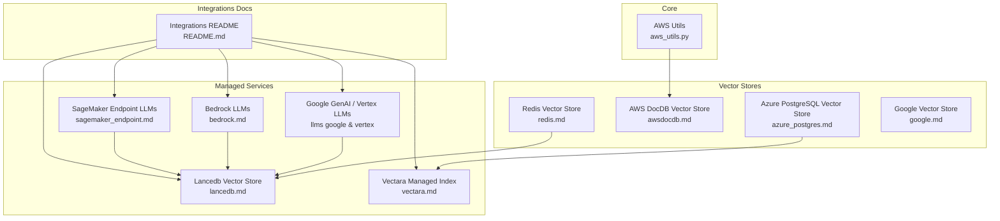

**Diagram sources**
- [aws_utils.py](file://llama-index-core/llama_index/core/utilities/aws_utils.py#L1-L53)
- [redis.md](file://docs/api_reference/api_reference/storage/vector_store/redis.md#L1-L4)
- [awsdocdb.md](file://docs/api_reference/api_reference/storage/vector_store/awsdocdb.md#L1-L4)
- [azure_postgres.md](file://docs/api_reference/api_reference/storage/vector_store/azure_postgres.md#L1-L4)
- [google.md](file://docs/api_reference/api_reference/storage/vector_store/google.md#L1-L4)
- [bedrock.md](file://docs/api_reference/api_reference/llms/bedrock.md)
- [vertex.md](file://docs/api_reference/api_reference/llms/vertex.md)
- [sagemaker_endpoint.md](file://docs/api_reference/api_reference/llms/sagemaker_endpoint.md)
- [lancedb.md](file://docs/api_reference/api_reference/llms/lancedb.md)
- [vectara.md](file://docs/api_reference/api_reference/llms/vectara.md)
- [README.md](file://llama-index-integrations/README.md#L1-L5)

**Section sources**
- [README.md](file://llama-index-integrations/README.md#L1-L5)

## Core Components
- AWS service client utility for secure, configurable access to AWS services via boto3/botocore.
- Vector store adapters for Redis, AWS DocumentDB, Azure PostgreSQL, and Google Cloud.
- Managed index and LLM packages for Google GenAI, Vertex AI, Bedrock, SageMaker, Lancedb, and Vectara.
- Example ingestion pipeline using Redis for vector storage.

Key implementation references:
- AWS client creation and configuration: [aws_utils.py](file://llama-index-core/llama_index/core/utilities/aws_utils.py#L7-L53)
- Redis vector store adapter: [redis.md](file://docs/api_reference/api_reference/storage/vector_store/redis.md#L1-L4)
- AWS DocumentDB vector store adapter: [awsdocdb.md](file://docs/api_reference/api_reference/storage/vector_store/awsdocdb.md#L1-L4)
- Azure PostgreSQL vector store adapter: [azure_postgres.md](file://docs/api_reference/api_reference/storage/vector_store/azure_postgres.md#L1-L4)
- Google vector store adapter: [google.md](file://docs/api_reference/api_reference/storage/vector_store/google.md#L1-L4)
- Managed indices and LLMs (Google, Vertex, Bedrock, SageMaker, Lancedb, Vectara): [README.md](file://llama-index-integrations/README.md#L1-L5)

**Section sources**
- [aws_utils.py](file://llama-index-core/llama_index/core/utilities/aws_utils.py#L1-L53)
- [redis.md](file://docs/api_reference/api_reference/storage/vector_store/redis.md#L1-L4)
- [awsdocdb.md](file://docs/api_reference/api_reference/storage/vector_store/awsdocdb.md#L1-L4)
- [azure_postgres.md](file://docs/api_reference/api_reference/storage/vector_store/azure_postgres.md#L1-L4)
- [google.md](file://docs/api_reference/api_reference/storage/vector_store/google.md#L1-L4)
- [README.md](file://llama-index-integrations/README.md#L1-L5)

## Architecture Overview
Cloud-native RAG architecture typically combines:
- Data ingestion from cloud storage and managed databases
- Embedding generation via managed LLM providers (Google GenAI, Vertex AI, Bedrock, SageMaker)
- Vector storage on managed or cloud-native stores (Redis, AWS DocumentDB, Azure PostgreSQL, Lancedb)
- Query-time retrieval and synthesis with managed LLMs
- Observability and governance across providers

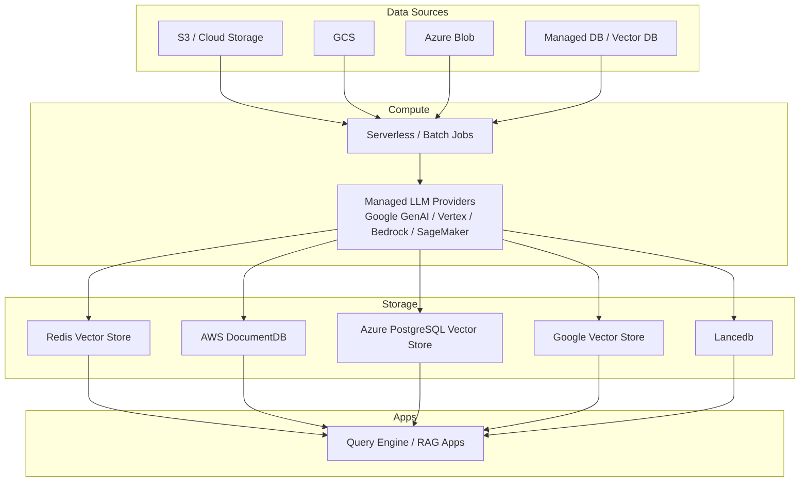

[No sources needed since this diagram shows conceptual workflow, not actual code structure]

## Detailed Component Analysis

### AWS Integration Utilities
- Purpose: Centralized AWS client creation with retry/backoff, timeouts, and credential support (profile or explicit keys).
- Usage pattern: Initialize clients per-region and service, propagate errors for invalid credentials.

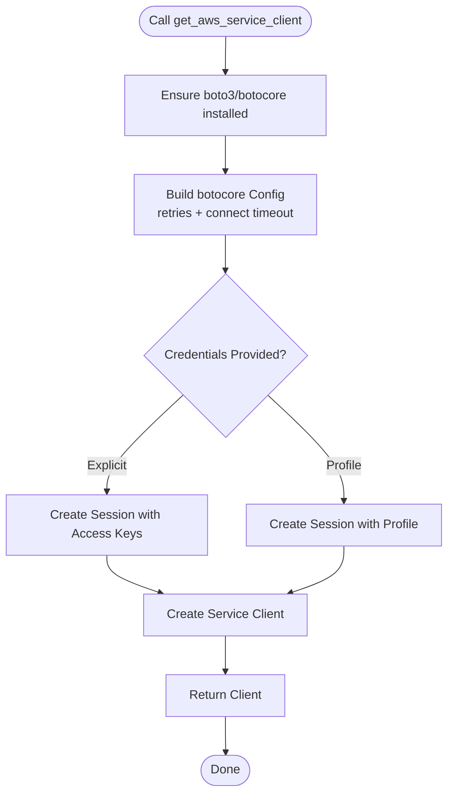

**Diagram sources**
- [aws_utils.py](file://llama-index-core/llama_index/core/utilities/aws_utils.py#L7-L53)

**Section sources**
- [aws_utils.py](file://llama-index-core/llama_index/core/utilities/aws_utils.py#L1-L53)

### Redis Vector Store Integration
- Purpose: Use Redis as a managed vector database for embeddings and similarity search.
- Typical flow: Ingest documents, generate embeddings, upsert vectors into Redis, and perform hybrid search during queries.
- Example pipeline: See ingestion notebook for Redis-backed vector store.

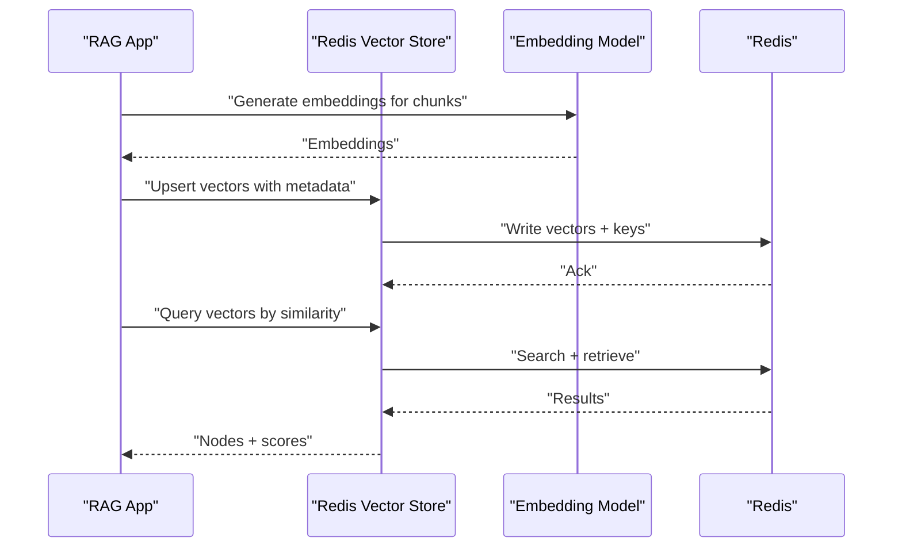

**Diagram sources**
- [redis.md](file://docs/api_reference/api_reference/storage/vector_store/redis.md#L1-L4)
- [redis_ingestion_pipeline.ipynb](file://docs/examples/ingestion/redis_ingestion_pipeline.ipynb)

**Section sources**
- [redis.md](file://docs/api_reference/api_reference/storage/vector_store/redis.md#L1-L4)
- [redis_ingestion_pipeline.ipynb](file://docs/examples/ingestion/redis_ingestion_pipeline.ipynb)

### AWS DocumentDB Vector Store
- Purpose: Use MongoDB-compatible DocumentDB as a managed NoSQL vector store.
- Integration pattern: Similar to Redis but leveraging DocumentDB’s compatibility layer.

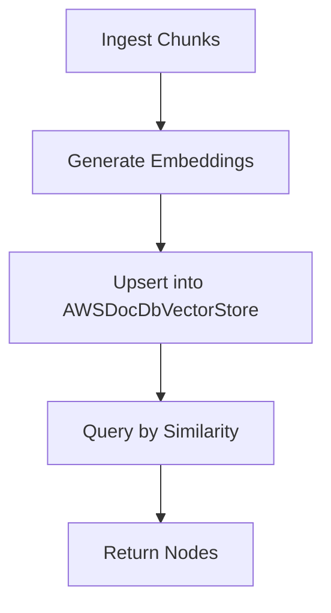

**Diagram sources**
- [awsdocdb.md](file://docs/api_reference/api_reference/storage/vector_store/awsdocdb.md#L1-L4)

**Section sources**
- [awsdocdb.md](file://docs/api_reference/api_reference/storage/vector_store/awsdocdb.md#L1-L4)

### Azure PostgreSQL Vector Store
- Purpose: Use Azure Database for PostgreSQL as a managed relational vector store.
- Integration pattern: Upsert vectors with metadata and perform similarity search using SQL/pgvector.

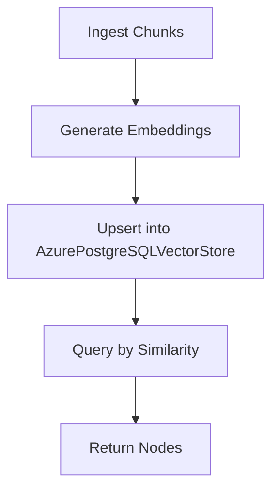

**Diagram sources**
- [azure_postgres.md](file://docs/api_reference/api_reference/storage/vector_store/azure_postgres.md#L1-L4)

**Section sources**
- [azure_postgres.md](file://docs/api_reference/api_reference/storage/vector_store/azure_postgres.md#L1-L4)

### Google Cloud Vector Store
- Purpose: Use Google Cloud vector store integrations for embeddings and retrieval.
- Managed LLMs: Google GenAI and Vertex AI LLMs are supported via managed packages.

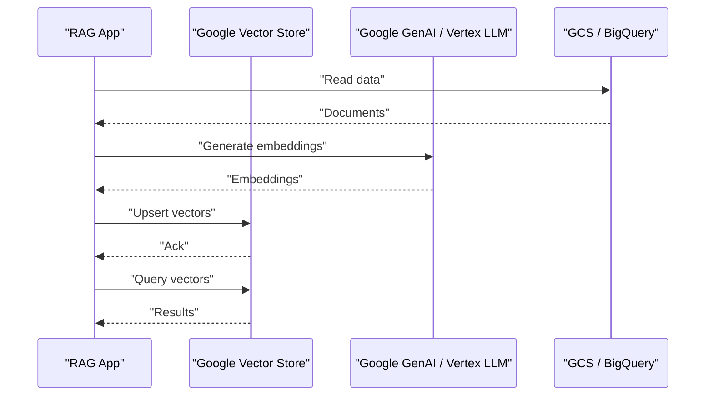

**Diagram sources**
- [google.md](file://docs/api_reference/api_reference/storage/vector_store/google.md#L1-L4)
- [test_llms_google_genai.py](file://llama-index-integrations/llms/llama-index-llms-google-genai/tests/test_llms_google_genai.py)
- [test_llms_google_genai_vertex.py](file://llama-index-integrations/llms/llama-index-llms-google-genai/tests/test_llms_google_genai_vertex.py)

**Section sources**
- [google.md](file://docs/api_reference/api_reference/storage/vector_store/google.md#L1-L4)
- [test_indices_managed_google.py](file://llama-index-integrations/indices/llama-index-indices-managed-google/tests/test_indices_managed_google.py)
- [test_llms_google_genai.py](file://llama-index-integrations/llms/llama-index-llms-google-genai/tests/test_llms_google_genai.py)
- [test_llms_google_genai_vertex.py](file://llama-index-integrations/llms/llama-index-llms-google-genai/tests/test_llms_google_genai_vertex.py)

### Bedrock LLMs (AWS)
- Purpose: Use Amazon Bedrock for hosted LLMs and embeddings; supports both legacy and Converse APIs.
- Integration pattern: Configure credentials and model IDs; use managed packages for embeddings and LLMs.

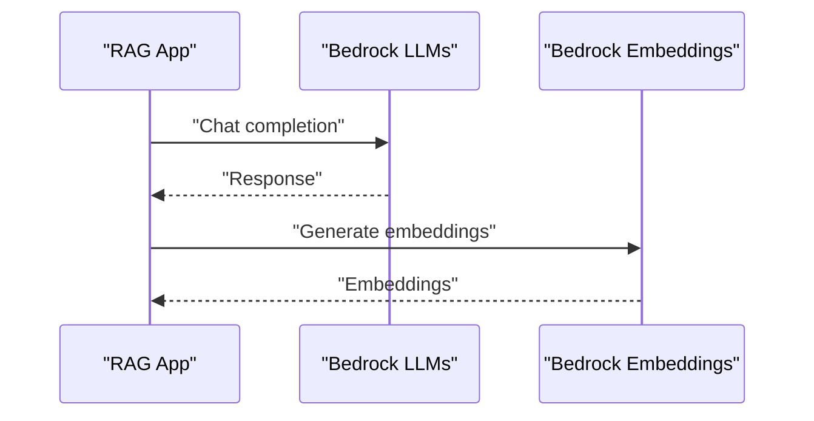

**Diagram sources**
- [bedrock.md](file://docs/api_reference/api_reference/llms/bedrock.md)
- [test_bedrock.py](file://llama-index-integrations/llms/llama-index-llms-bedrock/tests/test_bedrock.py)
- [test_bedrock_converse_utils.py](file://llama-index-integrations/llms/llama-index-llms-bedrock-converse/tests/test_bedrock_converse_utils.py)

**Section sources**
- [bedrock.md](file://docs/api_reference/api_reference/llms/bedrock.md)
- [test_bedrock.py](file://llama-index-integrations/llms/llama-index-llms-bedrock/tests/test_bedrock.py)
- [test_bedrock_converse_utils.py](file://llama-index-integrations/llms/llama-index-llms-bedrock-converse/tests/test_bedrock_converse_utils.py)

### Vertex AI LLMs (Google)
- Purpose: Use Vertex AI for hosted LLMs and embeddings; includes endpoint-based embedding support.
- Integration pattern: Configure service account or IAM credentials; use managed packages.

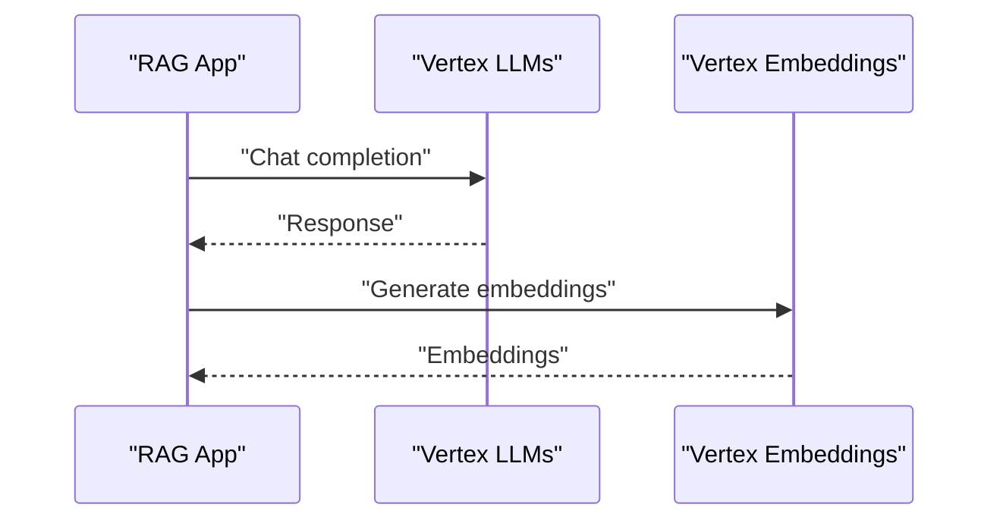

**Diagram sources**
- [vertex.md](file://docs/api_reference/api_reference/llms/vertex.md)
- [test_embeddings_vertex.py](file://llama-index-integrations/embeddings/llama-index-embeddings-vertex/tests/test_embeddings_vertex.py)
- [test_embeddings_vertex_endpoint.py](file://llama-index-integrations/embeddings/llama-index-embeddings-vertex-endpoint/tests/test_embeddings_vertex_endpoint.py)
- [test_indices_managed_vertexai.py](file://llama-index-integrations/indices/llama-index-indices-managed-vertexai/tests/test_indices_managed_vertexai.py)

**Section sources**
- [vertex.md](file://docs/api_reference/api_reference/llms/vertex.md)
- [test_embeddings_vertex.py](file://llama-index-integrations/embeddings/llama-index-embeddings-vertex/tests/test_embeddings_vertex.py)
- [test_embeddings_vertex_endpoint.py](file://llama-index-integrations/embeddings/llama-index-embeddings-vertex-endpoint/tests/test_embeddings_vertex_endpoint.py)
- [test_indices_managed_vertexai.py](file://llama-index-integrations/indices/llama-index-indices-managed-vertexai/tests/test_indices_managed_vertexai.py)

### SageMaker Endpoint LLMs (AWS)
- Purpose: Use hosted inference endpoints on Amazon SageMaker for LLMs and embeddings.
- Integration pattern: Provide endpoint names and optional credentials; use managed packages.

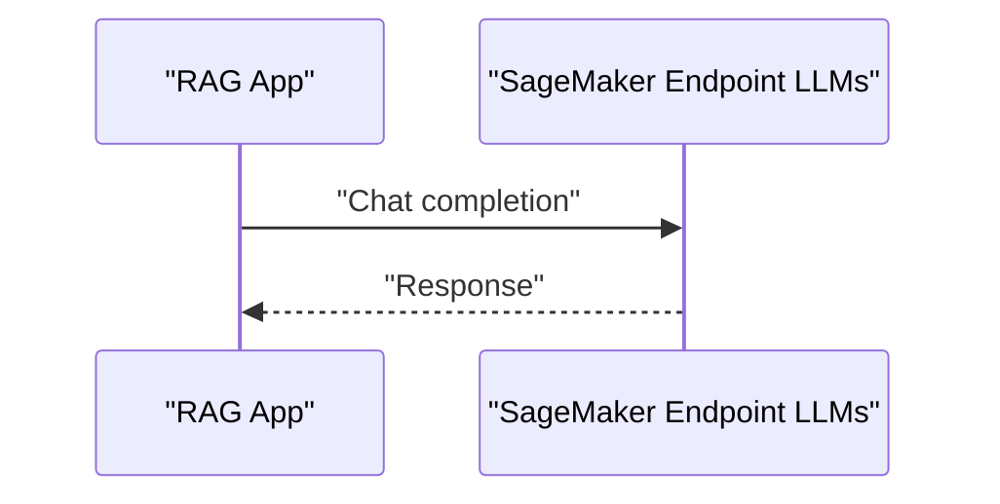

**Diagram sources**
- [sagemaker_endpoint.md](file://docs/api_reference/api_reference/llms/sagemaker_endpoint.md)
- [test_llms_sagemaker_endpoint.py](file://llama-index-integrations/llms/llama-index-llms-sagemaker-endpoint/tests/test_llms_sagemaker_endpoint.py)

**Section sources**
- [sagemaker_endpoint.md](file://docs/api_reference/api_reference/llms/sagemaker_endpoint.md)
- [test_llms_sagemaker_endpoint.py](file://llama-index-integrations/llms/llama-index-llms-sagemaker-endpoint/tests/test_llms_sagemaker_endpoint.py)

### Lancedb Vector Store
- Purpose: Use Lancedb for efficient vector search and analytics-grade performance.
- Integration pattern: Initialize LanceDB dataset, upsert vectors, and query with filters.

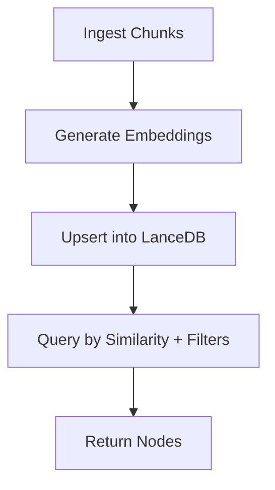

**Diagram sources**
- [lancedb.md](file://docs/api_reference/api_reference/llms/lancedb.md)
- [test_vector_stores_lancedb.py](file://llama-index-integrations/vector_stores/llama-index-vector-stores-lancedb/tests/test_vector_stores_lancedb.py)

**Section sources**
- [lancedb.md](file://docs/api_reference/api_reference/llms/lancedb.md)
- [test_vector_stores_lancedb.py](file://llama-index-integrations/vector_stores/llama-index-vector-stores-lancedb/tests/test_vector_stores_lancedb.py)

### Vectara Managed Index
- Purpose: Use Vectara’s managed index for ingestion and retrieval; includes query tools and packs.
- Integration pattern: Configure API credentials and customer ID; ingest and query via managed services.

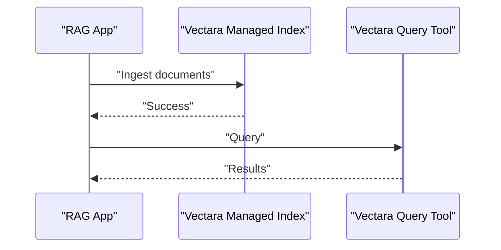

**Diagram sources**
- [vectara.md](file://docs/api_reference/api_reference/llms/vectara.md)
- [test_indices_managed_vectara.py](file://llama-index-integrations/indices/llama-index-indices-managed-vectara/tests/test_indices_managed_vectara.py)
- [test_tools_vectara_query.py](file://llama-index-integrations/tools/llama-index-tools-vectara-query/tests/test_tools_vectara_query.py)
- [test_packs_vectara_rag.py](file://llama-index-packs/llama-index-packs-vectara-rag/tests/test_packs_vectara_rag.py)

**Section sources**
- [vectara.md](file://docs/api_reference/api_reference/llms/vectara.md)
- [test_indices_managed_vectara.py](file://llama-index-integrations/indices/llama-index-indices-managed-vectara/tests/test_indices_managed_vectara.py)
- [test_tools_vectara_query.py](file://llama-index-integrations/tools/llama-index-tools-vectara-query/tests/test_tools_vectara_query.py)
- [test_packs_vectara_rag.py](file://llama-index-packs/llama-index-packs-vectara-rag/tests/test_packs_vectara_rag.py)

## Dependency Analysis
- Cohesion: Each managed service package encapsulates provider-specific configuration and usage patterns.
- Coupling: Core utilities (e.g., AWS client builder) are leveraged by cloud-specific components.
- External dependencies: Managed packages rely on provider SDKs and credentials; ensure proper IAM/Service Account permissions.

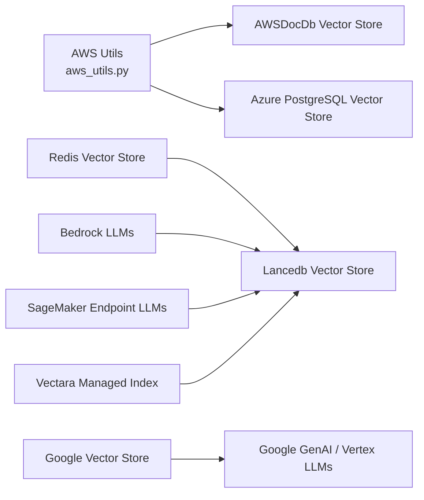

**Diagram sources**
- [aws_utils.py](file://llama-index-core/llama_index/core/utilities/aws_utils.py#L1-L53)
- [awsdocdb.md](file://docs/api_reference/api_reference/storage/vector_store/awsdocdb.md#L1-L4)
- [azure_postgres.md](file://docs/api_reference/api_reference/storage/vector_store/azure_postgres.md#L1-L4)
- [redis.md](file://docs/api_reference/api_reference/storage/vector_store/redis.md#L1-L4)
- [google.md](file://docs/api_reference/api_reference/storage/vector_store/google.md#L1-L4)
- [bedrock.md](file://docs/api_reference/api_reference/llms/bedrock.md)
- [sagemaker_endpoint.md](file://docs/api_reference/api_reference/llms/sagemaker_endpoint.md)
- [lancedb.md](file://docs/api_reference/api_reference/llms/lancedb.md)
- [vectara.md](file://docs/api_reference/api_reference/llms/vectara.md)

**Section sources**
- [aws_utils.py](file://llama-index-core/llama_index/core/utilities/aws_utils.py#L1-L53)
- [README.md](file://llama-index-integrations/README.md#L1-L5)

## Performance Considerations
- Vector store selection: Redis and Lancedb offer strong performance for similarity search; choose based on scale and analytics needs.
- Provider latency: Managed LLMs (Google GenAI, Vertex, Bedrock, SageMaker) introduce network latency; batch requests and cache embeddings when feasible.
- Retry/backoff: Use robust client configuration (as in AWS utilities) to handle transient failures.
- Cost optimization: Prefer serverless compute for ingestion jobs; leverage managed vector stores to reduce operational overhead.

[No sources needed since this section provides general guidance]

## Troubleshooting Guide
Common issues and resolutions:
- AWS credentials errors: Verify profile or explicit keys; confirm region and permissions.
- Managed service authentication failures: Ensure service accounts or API keys are configured correctly for Google, Azure, or AWS.
- Network connectivity: Confirm outbound access to provider endpoints; configure VPC/firewall rules as needed.
- Vector store connectivity: Validate connection strings and indexes; check for schema mismatches.

**Section sources**
- [aws_utils.py](file://llama-index-core/llama_index/core/utilities/aws_utils.py#L1-L53)

## Conclusion
LlamaIndex supports robust cloud-native RAG deployments across AWS, Google Cloud Platform, Microsoft Azure, and Redis-based vector stores. Managed services streamline operations while enabling multi-cloud strategies, disaster recovery, and compliance. Adopt provider-specific SDKs, secure identity management, and optimized data pipelines to achieve scalable, cost-efficient, and secure RAG systems.

[No sources needed since this section summarizes without analyzing specific files]

## Appendices
- Example notebooks and tests demonstrate practical integration patterns for Redis, Google, Vertex, Bedrock, SageMaker, Lancedb, and Vectara.

**Section sources**
- [redis_ingestion_pipeline.ipynb](file://docs/examples/ingestion/redis_ingestion_pipeline.ipynb)
- [test_indices_managed_google.py](file://llama-index-integrations/indices/llama-index-indices-managed-google/tests/test_indices_managed_google.py)
- [test_llms_google_genai.py](file://llama-index-integrations/llms/llama-index-llms-google-genai/tests/test_llms_google_genai.py)
- [test_llms_google_genai_vertex.py](file://llama-index-integrations/llms/llama-index-llms-google-genai/tests/test_llms_google_genai_vertex.py)
- [test_bedrock.py](file://llama-index-integrations/llms/llama-index-llms-bedrock/tests/test_bedrock.py)
- [test_bedrock_converse_utils.py](file://llama-index-integrations/llms/llama-index-llms-bedrock-converse/tests/test_bedrock_converse_utils.py)
- [test_embeddings_vertex.py](file://llama-index-integrations/embeddings/llama-index-embeddings-vertex/tests/test_embeddings_vertex.py)
- [test_embeddings_vertex_endpoint.py](file://llama-index-integrations/embeddings/llama-index-embeddings-vertex-endpoint/tests/test_embeddings_vertex_endpoint.py)
- [test_indices_managed_vertexai.py](file://llama-index-integrations/indices/llama-index-indices-managed-vertexai/tests/test_indices_managed_vertexai.py)
- [test_llms_sagemaker_endpoint.py](file://llama-index-integrations/llms/llama-index-llms-sagemaker-endpoint/tests/test_llms_sagemaker_endpoint.py)
- [test_vector_stores_lancedb.py](file://llama-index-integrations/vector_stores/llama-index-vector-stores-lancedb/tests/test_vector_stores_lancedb.py)
- [test_indices_managed_vectara.py](file://llama-index-integrations/indices/llama-index-indices-managed-vectara/tests/test_indices_managed_vectara.py)
- [test_tools_vectara_query.py](file://llama-index-integrations/tools/llama-index-tools-vectara-query/tests/test_tools_vectara_query.py)
- [test_packs_vectara_rag.py](file://llama-index-packs/llama-index-packs-vectara-rag/tests/test_packs_vectara_rag.py)