# Data Connectors Integration

<cite>
**Referenced Files in This Document**
- [__init__.py](file://llama-index-core/llama_index/core/__init__.py)
- [base.py](file://llama-index-core/llama_index/core/readers/base.py)
- [__init__.py](file://llama-index-core/llama_index/core/readers/__init__.py)
- [loading.py](file://llama-index-core/llama_index/core/readers/loading.py)
- [base.py](file://llama-index-integrations/readers/llama-index-readers-github/llama_index/readers/github/base.py)
- [__init__.py](file://llama-index-integrations/readers/llama-index-readers-github/llama_index/readers/github/__init__.py)
- [github_app_auth.py](file://llama-index-integrations/readers/llama-index-readers-github/llama_index/readers/github/github_app_auth.py)
- [base.py](file://llama-index-integrations/readers/llama-index-readers-mongodb/llama_index/readers/mongodb/base.py)
- [__init__.py](file://llama-index-integrations/readers/llama-index-readers-mongodb/llama_index/readers/mongodb/__init__.py)
- [base.py](file://llama-index-integrations/readers/llama-index-readers-discord/llama_index/readers/discord/base.py)
- [__init__.py](file://llama-index-integrations/readers/llama-index-readers-discord/llama_index/readers/discord/__init__.py)
- [base.py](file://llama-index-integrations/readers/llama-index-readers-s3/llama_index/readers/s3/base.py)
- [__init__.py](file://llama-index-integrations/readers/llama-index-readers-s3/llama_index/readers/s3/__init__.py)
- [base.py](file://llama-index-integrations/readers/llama-index-readers-gcs/llama_index/readers/gcs/base.py)
- [__init__.py](file://llama-index-integrations/readers/llama-index-readers-gcs/llama_index/readers/gcs/__init__.py)
- [base.py](file://llama-index-integrations/readers/llama-index-readers-database/llama_index/readers/database/base.py)
- [__init__.py](file://llama-index-integrations/readers/llama-index-readers-database/llama_index/readers/database/__init__.py)
- [base.py](file://llama-index-integrations/readers/llama-index-readers-file/llama_index/readers/file/base.py)
- [__init__.py](file://llama-index-integrations/readers/llama-index-readers-file/llama_index/readers/file/__init__.py)
- [base.py](file://llama-index-integrations/readers/llama-index-readers-web/llama_index/readers/web/base.py)
- [__init__.py](file://llama-index-integrations/readers/llama-index-readers-web/llama_index/readers/web/__init__.py)
- [base.py](file://llama-index-integrations/readers/llama-index-readers-json/llama_index/readers/json/base.py)
- [__init__.py](file://llama-index-integrations/readers/llama-index-readers-json/llama_index/readers/json/__init__.py)
- [base.py](file://llama-index-integrations/readers/llama-index-readers-structured-data/llama_index/readers/structured_data/base.py)
- [__init__.py](file://llama-index-integrations/readers/llama-index-readers-structured-data/llama_index/readers/structured_data/__init__.py)
- [base.py](file://llama-index-integrations/readers/llama-index-readers-string-iterable/llama_index/readers/string_iterable/base.py)
- [__init__.py](file://llama-index-integrations/readers/llama-index-readers-string-iterable/llama_index/readers/string_iterable/__init__.py)
- [base.py](file://llama-index-integrations/readers/llama-index-readers-graphql/llama_index/readers/graphql/base.py)
- [__init__.py](file://llama-index-integrations/readers/llama-index-readers-graphql/llama_index/readers/graphql/__init__.py)
- [base.py](file://llama-index-integrations/readers/llama-index-readers-opensearch/llama_index/readers/opensearch/base.py)
- [__init__.py](file://llama-index-integrations/readers/llama-index-readers-opensearch/llama_index/readers/opensearch/__init__.py)
- [base.py](file://llama-index-integrations/readers/llama-index-readers-aws-lambda/llama_index/readers/aws_lambda/base.py)
- [__init__.py](file://llama-index-integrations/readers/llama-index-readers-aws-lambda/llama_index/readers/aws_lambda/__init__.py)
- [base.py](file://llama-index-integrations/readers/llama-index-readers-remote/llama_index/readers/remote/base.py)
- [__init__.py](file://llama-index-integrations/readers/llama-index-readers-remote/llama_index/readers/remote/__init__.py)
- [base.py](file://llama-index-integrations/readers/llama-index-readers-remote-depth/llama_index/readers/remote_depth/base.py)
- [__init__.py](file://llama-index-integrations/readers/llama-index-readers-remote-depth/llama_index/readers/remote_depth/__init__.py)
- [base.py](file://llama-index-integrations/readers/llama-index-readers-llama-parse/llama_index/readers/llama_parse/base.py)
- [__init__.py](file://llama-index-integrations/readers/llama-index-readers-llama-parse/llama_index/readers/llama_parse/__init__.py)
- [base.py](file://llama-index-integrations/readers/llama-index-readers-docling/llama_index/readers/docling/base.py)
- [__init__.py](file://llama-index-integrations/readers/llama-index-readers-docling/llama_index/readers/docling/__init__.py)
- [base.py](file://llama-index-integrations/readers/llama-index-readers-whisper/llama_index/readers/whisper/base.py)
- [__init__.py](file://llama-index-integrations/readers/llama-index-readers-whisper/llama_index/readers/whisper/__init__.py)
- [base.py](file://llama-index-integrations/readers/llama-index-readers-feedly-rss/llama_index/readers/feedly_rss/base.py)
- [__init__.py](file://llama-index-integrations/readers/llama-index-readers-feedly-rss/llama_index/readers/feedly_rss/__init__.py)
- [base.py](file://llama-index-integrations/readers/llama-index-readers-youtube-transcript/llama_index/readers/youtube_transcript/base.py)
- [__init__.py](file://llama-index-integrations/readers/llama-index-readers-youtube-transcript/llama_index/readers/youtube_transcript/__init__.py)
- [base.py](file://llama-index-integrations/readers/llama-index-readers-assemblyai/llama_index/readers/assemblyai/base.py)
- [__init__.py](file://llama-index-integrations/readers/llama-index-readers-assemblyai/llama_index/readers/assemblyai/__init__.py)
- [base.py](file://llama-index-integrations/readers/llama-index-readers-huggingface-fs/llama_index/readers/huggingface_fs/base.py)
- [__init__.py](file://llama-index-integrations/readers/llama-index-readers-huggingface-fs/llama_index/readers/huggingface_fs/__init__.py)
- [base.py](file://llama-index-integrations/readers/llama-index-readers-hwp/llama_index/readers/hwp/base.py)
- [__init__.py](file://llama-index-integrations/readers/llama-index-readers-hwp/llama_index/readers/hwp/__init__.py)
- [base.py](file://llama-index-integrations/readers/llama-index-readers-pdf-table/llama_index/readers/pdf_table/base.py)
- [__init__.py](file://llama-index-integrations/readers/llama-index-readers-pdf-table/llama_index/readers/pdf_table/__init__.py)
- [base.py](file://llama-index-integrations/readers/llama-index-readers-pdf-marker/llama_index/readers/pdf_marker/base.py)
- [__init__.py](file://llama-index-integrations/readers/llama-index-readers-pdf-marker/llama_index/readers/pdf_marker/__init__.py)
- [base.py](file://llama-index-integrations/readers/llama-index-readers-smart-pdf-loader/llama_index/readers/smart_pdf_loader/base.py)
- [__init__.py](file://llama-index-integrations/readers/llama-index-readers-smart-pdf-loader/llama_index/readers/smart_pdf_loader/__init__.py)
- [base.py](file://llama-index-integrations/readers/llama-index-readers-nougat-ocr/llama_index/readers/nougat_ocr/base.py)
- [__init__.py](file://llama-index-integrations/readers/llama-index-readers-nougat-ocr/llama_index/readers/nougat_ocr/__init__.py)
- [base.py](file://llama-index-integrations/readers/llama-index-readers-paddle-ocr/llama_index/readers/paddle_ocr/base.py)
- [__init__.py](file://llama-index-integrations/readers/llama-index-readers-paddle-ocr/llama_index/readers/paddle_ocr/__init__.py)
- [base.py](file://llama-index-integrations/readers/llama-index-readers-papers/llama_index/readers/papers/base.py)
- [__init__.py](file://llama-index-integrations/readers/llama-index-readers-papers/llama_index/readers/papers/__init__.py)
- [base.py](file://llama-index-integrations/readers/llama-index-readers-sec-filings/llama_index/readers/sec_filings/base.py)
- [__init__.py](file://llama-index-integrations/readers/llama-index-readers-sec-filings/llama_index/readers/sec_filings/__init__.py)
- [base.py](file://llama-index-integrations/readers/llama-index-readers-weather/llama_index/readers/weather/base.py)
- [__init__.py](file://llama-index-integrations/readers/llama-index-readers-weather/llama_index/readers/weather/__init__.py)
- [base.py](file://llama-index-integrations/readers/llama-index-readers-legacy-office/llama_index/readers/legacy_office/base.py)
- [__init__.py](file://llama-index-integrations/readers/llama-index-readers-legacy-office/llama_index/readers/legacy_office/__init__.py)
- [base.py](file://llama-index-integrations/readers/llama-index-readers-llama-hub/llama_index/readers/llama_hub/base.py)
- [__init__.py](file://llama-index-integrations/readers/llama-index-readers-llama-hub/llama_index/readers/llama_hub/__init__.py)
- [base.py](file://llama-index-integrations/readers/llama-index-readers-airbyte-cdk/llama_index/readers/airbyte_cdk/base.py)
- [__init__.py](file://llama-index-integrations/readers/llama-index-readers-airbyte-cdk/llama_index/readers/airbyte_cdk/__init__.py)
- [base.py](file://llama-index-integrations/readers/llama-index-readers-airbyte-gong/llama_index/readers/airbyte_gong/base.py)
- [__init__.py](file://llama-index-integrations/readers/llama-index-readers-airbyte-gong/llama_index/readers/airbyte_gong/__init__.py)
- [base.py](file://llama-index-integrations/readers/llama-index-readers-airbyte-hubspot/llama_index/readers/airbyte_hubspot/base.py)
- [__init__.py](file://llama-index-integrations/readers/llama-index-readers-airbyte-hubspot/llama_index/readers/airbyte_hubspot/__init__.py)
- [base.py](file://llama-index-integrations/readers/llama-index-readers-airbyte-salesforce/llama_index/readers/airbyte_salesforce/base.py)
- [__init__.py](file://llama-index-integrations/readers/llama-index-readers-airbyte-salesforce/llama_index/readers/airbyte_salesforce/__init__.py)
- [base.py](file://llama-index-integrations/readers/llama-index-readers-airbyte-shopify/llama_index/readers/airbyte_shopify/base.py)
- [__init__.py](file://llama-index-integrations/readers/llama-index-readers-airbyte-shopify/llama_index/readers/airbyte_shopify/__init__.py)
- [base.py](file://llama-index-integrations/readers/llama-index-readers-airbyte-stripe/llama_index/readers/airbyte_stripe/base.py)
- [__init__.py](file://llama-index-integrations/readers/llama-index-readers-airbyte-stripe/llama_index/readers/airbyte_stripe/__init__.py)
- [base.py](file://llama-index-integrations/readers/llama-index-readers-airbyte-typeform/llama_index/readers/airbyte_typeform/base.py)
- [__init__.py](file://llama-index-integrations/readers/llama-index-readers-airbyte-typeform/llama_index/readers/airbyte_typeform/__init__.py)
- [base.py](file://llama-index-integrations/readers/llama-index-readers-airbyte-zendesk-support/llama_index/readers/airbyte_zendesk_support/base.py)
- [__init__.py](file://llama-index-integrations/readers/llama-index-readers-airbyte-zendesk-support/llama_index/readers/airbyte_zendesk_support/__init__.py)
- [base.py](file://llama-index-integrations/readers/llama-index-readers-airtable/llama_index/readers/airtable/base.py)
- [__init__.py](file://llama-index-integrations/readers/llama-index-readers-airtable/llama_index/readers/airtable/__init__.py)
- [base.py](file://llama-index-integrations/readers/llama-index-readers-asana/llama_index/readers/asana/base.py)
- [__init__.py](file://llama-index-integrations/readers/llama-index-readers-asana/llama_index/readers/asana/__init__.py)
- [base.py](file://llama-index-integrations/readers/llama-index-readers-confluence/llama_index/readers/confluence/base.py)
- [__init__.py](file://llama-index-integrations/readers/llama-index-readers-confluence/llama_index/readers/confluence/__init__.py)
- [base.py](file://llama-index-integrations/readers/llama-index-readers-discord/llama_index/readers/discord/base.py)
- [__init__.py](file://llama-index-integrations/readers/llama-index-readers-discord/llama_index/readers/discord/__init__.py)
- [base.py](file://llama-index-integrations/readers/llama-index-readers-github/llama_index/readers/github/base.py)
- [__init__.py](file://llama-index-integrations/readers/llama-index-readers-github/llama_index/readers/github/__init__.py)
- [base.py](file://llama-index-integrations/readers/llama-index-readers-gitlab/llama_index/readers/gitlab/base.py)
- [__init__.py](file://llama-index-integrations/readers/llama-index-readers-gitlab/llama_index/readers/gitlab/__init__.py)
- [base.py](file://llama-index-integrations/readers/llama-index-readers-google/llama_index/readers/google/base.py)
- [__init__.py](file://llama-index-integrations/readers/llama-index-readers-google/llama_index/readers/google/__init__.py)
- [base.py](file://llama-index-integrations/readers/llama-index-readers-hubspot/llama_index/readers/hubspot/base.py)
- [__init__.py](file://llama-index-integrations/readers/llama-index-readers-hubspot/llama_index/readers/hubspot/__init__.py)
- [base.py](file://llama-index-integrations/readers/llama-index-readers-intercom/llama_index/readers/intercom/base.py)
- [__init__.py](file://llama-index-integrations/readers/llama-index-readers-intercom/llama_index/readers/intercom/__init__.py)
- [base.py](file://llama-index-integrations/readers/llama-index-readers-jira/llama_index/readers/jira/base.py)
- [__init__.py](file://llama-index-integrations/readers/llama-index-readers-jira/llama_index/readers/jira/__init__.py)
- [base.py](file://llama-index-integrations/readers/llama-index-readers-linear/llama_index/readers/linear/base.py)
- [__init__.py](file://llama-index-integrations/readers/llama-index-readers-linear/llama_index/readers/linear/__init__.py)
- [base.py](file://llama-index-integrations/readers/llama-index-readers-microsoft-outlook/llama_index/readers/microsoft_outlook/base.py)
- [__init__.py](file://llama-index-integrations/readers/llama-index-readers-microsoft-outlook/llama_index/readers/microsoft_outlook/__init__.py)
- [base.py](file://llama-index-integrations/readers/llama-index-readers-microsoft-outlook-emails/llama_index/readers/microsoft_outlook_emails/base.py)
- [__init__.py](file://llama-index-integrations/readers/llama-index-readers-microsoft-outlook-emails/llama_index/readers/microsoft_outlook_emails/__init__.py)
- [base.py](file://llama-index-integrations/readers/llama-index-readers-microsoft-sharepoint/llama_index/readers/microsoft_sharepoint/base.py)
- [__init__.py](file://llama-index-integrations/readers/llama-index-readers-microsoft-sharepoint/llama_index/readers/microsoft_sharepoint/__init__.py)
- [base.py](file://llama-index-integrations/readers/llama-index-readers-microsoft-onedrive/llama_index/readers/microsoft_onedrive/base.py)
- [__init__.py](file://llama-index-integrations/readers/llama-index-readers-microsoft-onedrive/llama_index/readers/microsoft_onedrive/__init__.py)
- [base.py](file://llama-index-integrations/readers/llama-index-readers-slack/llama_index/readers/slack/base.py)
- [__init__.py](file://llama-index-integrations/readers/llama-index-readers-slack/llama_index/readers/slack/__init__.py)
- [base.py](file://llama-index-integrations/readers/llama-index-readers-telegram/llama_index/readers/telegram/base.py)
- [__init__.py](file://llama-index-integrations/readers/llama-index-readers-telegram/llama_index/readers/telegram/__init__.py)
- [base.py](file://llama-index-integrations/readers/llama-index-readers-whatsapp/llama_index/readers/whatsapp/base.py)
- [__init__.py](file://llama-index-integrations/readers/llama-index-readers-whatsapp/llama_index/readers/whatsapp/__init__.py)
- [base.py](file://llama-index-integrations/readers/llama-index-readers-zendesk/llama_index/readers/zendesk/base.py)
- [__init__.py](file://llama-index-integrations/readers/llama-index-readers-zendesk/llama_index/readers/zendesk/__init__.py)
- [base.py](file://llama-index-integrations/readers/llama-index-readers-zep/llama_index/readers/zep/base.py)
- [__init__.py](file://llama-index-integrations/readers/llama-index-readers-zep/llama_index/readers/zep/__init__.py)
- [base.py](file://llama-index-integrations/readers/llama-index-readers-zulip/llama_index/readers/zulip/base.py)
- [__init__.py](file://llama-index-integrations/readers/llama-index-readers-zulip/llama_index/readers/zulip/__init__.py)
- [base.py](file://llama-index-integrations/readers/llama-index-readers-wordpress/llama_index/readers/wordpress/base.py)
- [__init__.py](file://llama-index-integrations/readers/llama-index-readers-wordpress/llama_index/readers/wordpress/__init__.py)
- [base.py](file://llama-index-integrations/readers/llama-index-readers-wordlift/llama_index/readers/wordlift/base.py)
- [__init__.py](file://llama-index-integrations/readers/llama-index-readers-wordlift/llama_index/readers/wordlift/__init__.py)
- [base.py](file://llama-index-integrations/readers/llama-index-readers-obsidian/llama_index/readers/obsidian/base.py)
- [__init__.py](file://llama-index-integrations/readers/llama-index-readers-obsidian/llama_index/readers/obsidian/__init__.py)
- [base.py](file://llama-index-integrations/readers/llama-index-readers-docugami/llama_index/readers/docugami/base.py)
- [__init__.py](file://llama-index-integrations/readers/llama-index-readers-docugami/llama_index/readers/docugami/__init__.py)
- [base.py](file://llama-index-integrations/readers/llama-index-readers-document360/llama_index/readers/document360/base.py)
- [__init__.py](file://llama-index-integrations/readers/llama-index-readers-document360/llama_index/readers/document360/__init__.py)
- [base.py](file://llama-index-integrations/readers/llama-index-readers-gpt-repo/llama_index/readers/gpt_repo/base.py)
- [__init__.py](file://llama-index-integrations/readers/llama-index-readers-gpt-repo/llama_index/readers/gpt_repo/__init__.py)
- [base.py](file://llama-index-integrations/readers/llama-index-readers-readwise/llama_index/readers/readwise/base.py)
- [__init__.py](file://llama-index-integrations/readers/llama-index-readers-readwise/llama_index/readers/readwise/__init__.py)
- [base.py](file://llama-index-integrations/readers/llama-index-readers-earnings-call-transcript/llama_index/readers/earnings_call_transcript/base.py)
- [__init__.py](file://llama-index-integrations/readers/llama-index-readers-earnings-call-transcript/llama_index/readers/earnings_call_transcript/__init__.py)
- [base.py](file://llama-index-integrations/readers/llama-index-readers-llama-dataset/llama_index/readers/llama_dataset/base.py)
- [__init__.py](file://llama-index-integrations/readers/llama-index-readers-llama-dataset/llama_index/readers/llama_dataset/__init__.py)
- [base.py](file://llama-index-integrations/readers/llama-index-readers-datasets/llama_index/readers/datasets/base.py)
- [__init__.py](file://llama-index-integrations/readers/llama-index-readers-datasets/llama_index/readers/datasets/__init__.py)
- [base.py](file://llama-index-integrations/readers/llama-index-readers-pandas-ai/llama_index/readers/pandas_ai/base.py)
- [__init__.py](file://llama-index-integrations/readers/llama-index-readers-pandas-ai/llama_index/readers/pandas_ai/__init__.py)
- [base.py](file://llama-index-integrations/readers/llama-index-readers-pathway/llama_index/readers/pathway/base.py)
- [__init__.py](file://llama-index-integrations/readers/llama-index-readers-pathway/llama_index/readers/pathway/__init__.py)
- [base.py](file://llama-index-integrations/readers/llama-index-readers-preprocess/llama_index/readers/preprocess/base.py)
- [__init__.py](file://llama-index-integrations/readers/llama-index-readers-preprocess/llama_index/readers/preprocess/__init__.py)
- [base.py](file://llama-index-integrations/readers/llama-index-readers-psychic/llama_index/readers/psychic/base.py)
- [__init__.py](file://llama-index-integrations/readers/llama-index-readers-psychic/llama_index/readers/psychic/__init__.py)
- [base.py](file://llama-index-integrations/readers/llama-index-readers-quizlet/llama_index/readers/quizlet/base.py)
- [__init__.py](file://llama-index-integrations/readers/llama-index-readers-quizlet/llama_index/readers/quizlet/__init__.py)
- [base.py](file://llama-index-integrations/readers/llama-index-readers-quizlet/llama_index/readers/quizlet/base.py)
- [__init__.py](file://llama-index-integrations/readers/llama-index-readers-quizlet/llama_index/readers/quizlet/__init__.py)
- [base.py](file://llama-index-integrations/readers/llama-index-readers-quizlet/llama_index/readers/quizlet/base.py)
- [__init__.py](file://llama-index-integrations/readers/llama-index-readers-quizlet/llama_index/readers/quizlet/__init__.py)
- [base.py](file://llama-index-integrations/readers/llama-index-readers-quizlet/llama_index/readers/quizlet/base.py)
- [__init__.py](file://llama-index-integrations/readers/llama-index-readers-quizlet/llama_index/readers/quizlet/__init__.py)
- [base.py](file://llama-index-integrations/readers/llama-index-readers-quizlet/llama_index/readers/quizlet/base.py)
- [__init__.py](file://llama-index-integrations/readers/llama-index-readers-quizlet/llama_index/readers/quizlet/__init__.py)
- [base.py](file://llama-index-integrations/readers/llama-index-readers-quizlet/llama_index/readers/quizlet/base.py)
- [__init__.py](file://llama-index-integrations/readers/llama-index-readers-quizlet/llama_index/readers/quizlet/__init__.py)
- [base.py](file://llama-index-integrations/readers/llama-index-readers-quizlet/llama_index/readers/quizlet/base.py)
- [__init__.py](file://llama-index-integrations/readers/llama-index-readers-quizlet/llama_index/readers/quizlet/__init__.py)
- [base.py](file://llama-index-integrations/readers......base.py)
- [__init__.py](file://llama-index-integrations/readers/llama-index-readers-quizlet/llama_index/readers/quizlet/__init__.py)
</cite>

## Table of Contents
1. [Introduction](#introduction)
2. [Project Structure](#project-structure)
3. [Core Components](#core-components)
4. [Architecture Overview](#architecture-overview)
5. [Detailed Component Analysis](#detailed-component-analysis)
6. [Dependency Analysis](#dependency-analysis)
7. [Performance Considerations](#performance-considerations)
8. [Troubleshooting Guide](#troubleshooting-guide)
9. [Conclusion](#conclusion)
10. [Appendices](#appendices)

## Introduction
This document explains how to integrate diverse data sources into LlamaIndex using standardized data connectors. It covers connecting files, databases, web APIs, cloud storage, enterprise systems, and streaming sources. It also describes authentication methods, connection pooling, rate limiting, error handling, multi-source ingestion pipelines, transformations, and batch processing patterns. Integration examples include GitHub, Google Drive, Discord, MongoDB, and cloud storage services.

## Project Structure
LlamaIndex organizes connectors under a unified readers abstraction. Core abstractions live in the core package, while integrations are provided via dedicated packages under llama-index-integrations. The top-level exports expose commonly used readers and utilities.

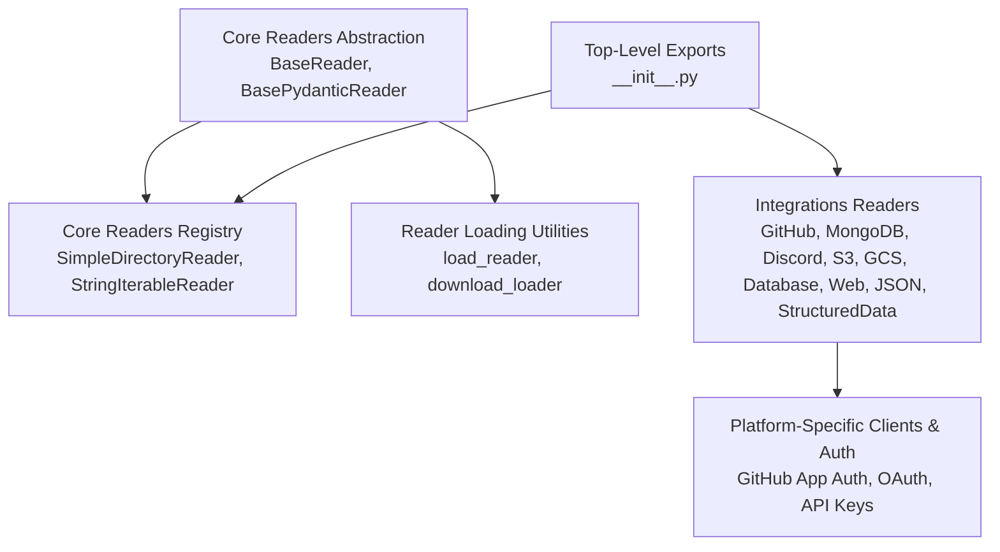

**Diagram sources**
- [base.py](file://llama-index-core/llama_index/core/readers/base.py#L19-L250)
- [__init__.py](file://llama-index-core/llama_index/core/readers/__init__.py#L14-L32)
- [loading.py](file://llama-index-core/llama_index/core/readers/loading.py#L6-L27)
- [__init__.py](file://llama-index-core/llama_index/core/__init__.py#L67-L139)

**Section sources**
- [__init__.py](file://llama-index-core/llama_index/core/__init__.py#L67-L139)
- [__init__.py](file://llama-index-core/llama_index/core/readers/__init__.py#L14-L32)
- [base.py](file://llama-index-core/llama_index/core/readers/base.py#L19-L250)
- [loading.py](file://llama-index-core/llama_index/core/readers/loading.py#L6-L27)

## Core Components
- BaseReader: Defines asynchronous and synchronous loading interfaces and optional LangChain interoperability.
- BasePydanticReader: Extends BaseReader with serialization support and a flag indicating remote vs local data.
- ResourcesReaderMixin: Adds resource listing, permission info, and resource-specific loading capabilities.
- ReaderConfig: Encapsulates a reader instance and its arguments for serialization and reuse.
- Reader loading utilities: Central registry and deserialization helpers for readers.

Key responsibilities:
- Unified interface for loading Documents from heterogeneous sources.
- Async-first design enabling efficient I/O-bound connectors.
- Serializable reader configurations for pipeline persistence and distribution.

**Section sources**
- [base.py](file://llama-index-core/llama_index/core/readers/base.py#L19-L250)
- [loading.py](file://llama-index-core/llama_index/core/readers/loading.py#L6-L27)

## Architecture Overview
The connector architecture follows a layered pattern:
- Abstraction layer: BaseReader and mixins define the contract.
- Implementation layer: Platform-specific readers implement BaseReader and leverage platform clients.
- Utility layer: ReaderConfig and loading utilities enable composition and persistence.
- Top-level integration: Exposed readers and convenience constructors.

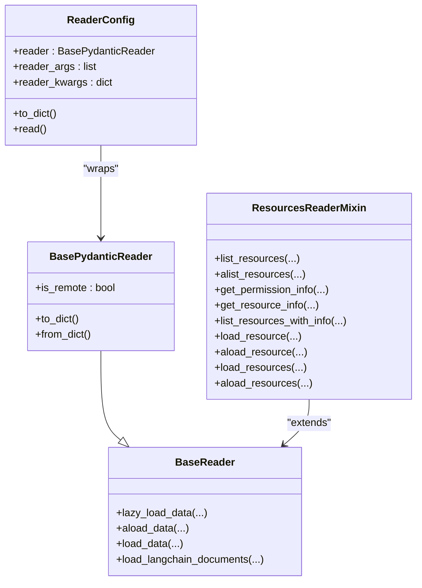

**Diagram sources**
- [base.py](file://llama-index-core/llama_index/core/readers/base.py#L19-L250)
- [loading.py](file://llama-index-core/llama_index/core/readers/loading.py#L223-L250)

## Detailed Component Analysis

### GitHub Connector
Connects to repositories, issues, and collaborators via GitHub’s REST API. Supports both token-based and GitHub App authentication.

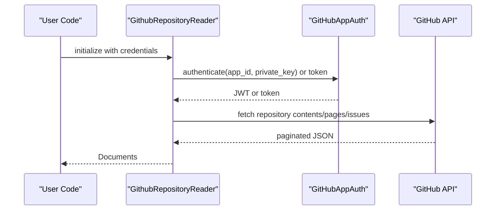

**Diagram sources**
- [__init__.py](file://llama-index-integrations/readers/llama-index-readers-github/llama_index/readers/github/__init__.py#L1-L40)
- [github_app_auth.py](file://llama-index-integrations/readers/llama-index-readers-github/llama_index/readers/github/github_app_auth.py)

Authentication strategies:
- Token-based: Pass personal access tokens to the reader.
- GitHub App: Use app ID and private key to mint short-lived tokens.

Rate limiting and retries:
- Apply client-side throttling and exponential backoff when invoking the GitHub API.
- Respect API rate limits and handle 403/429 responses.

Error handling:
- Catch authentication failures and invalid repository errors.
- Normalize API exceptions into reader-level errors.

Batch processing:
- Paginate repository listings and process in chunks.
- Parallelize independent resource loads (e.g., multiple issue comments).

**Section sources**
- [__init__.py](file://llama-index-integrations/readers/llama-index-readers-github/llama_index/readers/github/__init__.py#L1-L40)
- [github_app_auth.py](file://llama-index-integrations/readers/llama-index-readers-github/llama_index/readers/github/github_app_auth.py)

### MongoDB Connector
Loads data from MongoDB collections using a cursor-based approach.

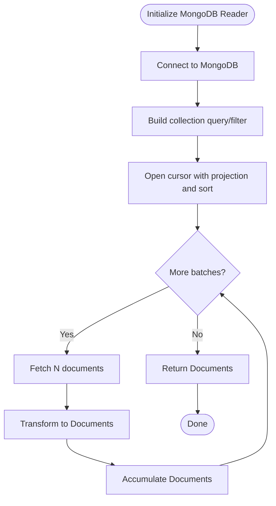

**Diagram sources**
- [__init__.py](file://llama-index-integrations/readers/llama-index-readers-mongodb/llama_index/readers/mongodb/__init__.py#L1-L4)
- [base.py](file://llama-index-integrations/readers/llama-index-readers-mongodb/llama_index/readers/mongodb/base.py)

Best practices:
- Use projections to limit returned fields.
- Apply sorting and pagination to avoid large in-memory sets.
- Handle network timeouts and transient errors with retries.

**Section sources**
- [__init__.py](file://llama-index-integrations/readers/llama-index-readers-mongodb/llama_index/readers/mongodb/__init__.py#L1-L4)
- [base.py](file://llama-index-integrations/readers/llama-index-readers-mongodb/llama_index/readers/mongodb/base.py)

### Discord Connector
Streams messages and channels from Discord servers using bot tokens.

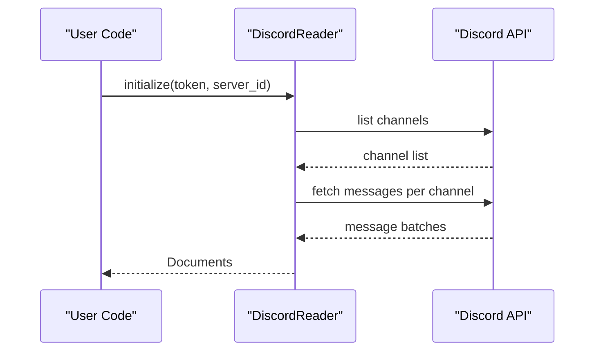

**Diagram sources**
- [__init__.py](file://llama-index-integrations/readers/llama-index-readers-discord/llama_index/readers/discord/__init__.py#L1-L4)
- [base.py](file://llama-index-integrations/readers/llama-index-readers-discord/llama_index/readers/discord/base.py)

Rate limiting:
- Respect Discord API ratelimits; queue requests and back off on 429/5xx.

**Section sources**
- [__init__.py](file://llama-index-integrations/readers/llama-index-readers-discord/llama_index/readers/discord/__init__.py#L1-L4)
- [base.py](file://llama-index-integrations/readers/llama-index-readers-discord/llama_index/readers/discord/base.py)

### Cloud Storage Connectors

#### Amazon S3 Connector
Downloads objects from S3 buckets and converts them to Documents.

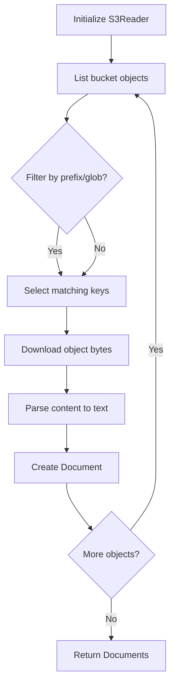

**Diagram sources**
- [__init__.py](file://llama-index-integrations/readers/llama-index-readers-s3/llama_index/readers/s3/__init__.py#L1-L4)
- [base.py](file://llama-index-integrations/readers/llama-index-readers-s3/llama_index/readers/s3/base.py)

#### Google Cloud Storage Connector
Similar to S3, but uses GCS client libraries.

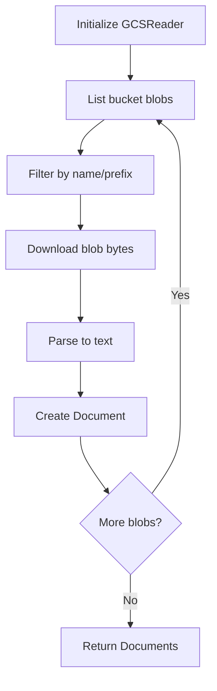

**Diagram sources**
- [__init__.py](file://llama-index-integrations/readers/llama-index-readers-gcs/llama_index/readers/gcs/__init__.py#L1-L4)
- [base.py](file://llama-index-integrations/readers/llama-index-readers-gcs/llama_index/readers/gcs/base.py)

Authentication:
- Use service account keys or ADC for both S3 and GCS readers.
- For S3, consider IAM roles and bucket policies.

Rate limiting:
- Apply client-side concurrency caps and backoff on throttled responses.

**Section sources**
- [__init__.py](file://llama-index-integrations/readers/llama-index-readers-s3/llama_index/readers/s3/__init__.py#L1-L4)
- [base.py](file://llama-index-integrations/readers/llama-index-readers-s3/llama_index/readers/s3/base.py)
- [__init__.py](file://llama-index-integrations/readers/llama-index-readers-gcs/llama_index/readers/gcs/__init__.py#L1-L4)
- [base.py](file://llama-index-integrations/readers/llama-index-readers-gcs/llama_index/readers/gcs/base.py)

### Database Connector
Executes SQL queries against relational databases and converts results to Documents.

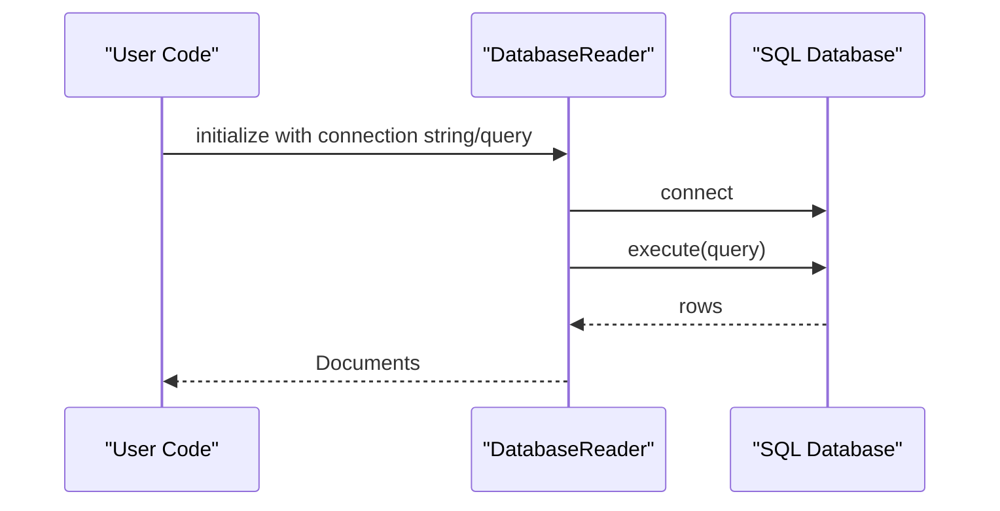

**Diagram sources**
- [__init__.py](file://llama-index-integrations/readers/llama-index-readers-database/llama_index/readers/database/__init__.py#L1-L4)
- [base.py](file://llama-index-integrations/readers/llama-index-readers-database/llama_index/readers/database/base.py)

Connection pooling:
- Reuse a single connection pool across reads.
- Configure max connections and timeouts.

Error handling:
- Wrap SQL exceptions and normalize them to reader errors.
- Validate queries and handle empty result sets gracefully.

**Section sources**
- [__init__.py](file://llama-index-integrations/readers/llama-index-readers-database/llama_index/readers/database/__init__.py#L1-L4)
- [base.py](file://llama-index-integrations/readers/llama-index-readers-database/llama_index/readers/database/base.py)

### Web and Streaming Connectors

#### Web Connector
Fetches HTML/text from URLs and parses content.

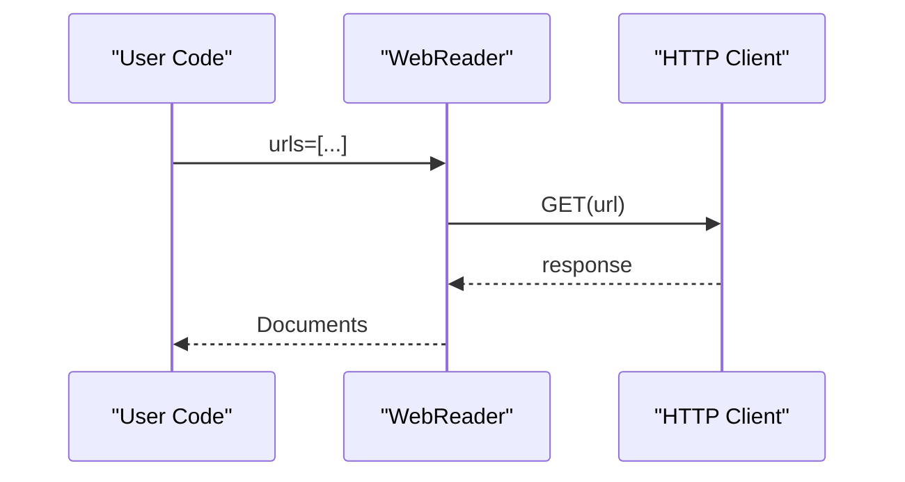

**Diagram sources**
- [__init__.py](file://llama-index-integrations/readers/llama-index-readers-web/llama_index/readers/web/__init__.py#L1-L4)
- [base.py](file://llama-index-integrations/readers/llama-index-readers-web/llama_index/readers/web/base.py)

Rate limiting:
- Limit concurrent requests and add delays between requests.

#### RSS Connector
Parses RSS feeds and extracts items.

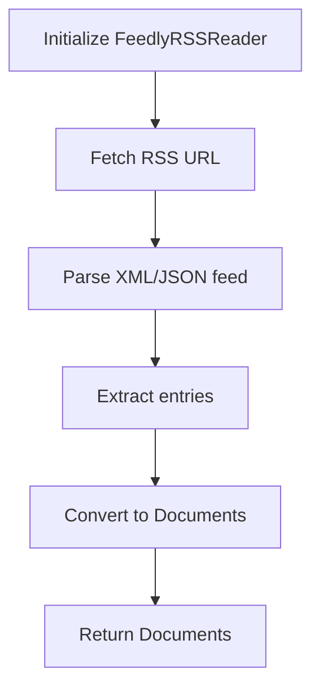

**Diagram sources**
- [__init__.py](file://llama-index-integrations/readers/llama-index-readers-feedly-rss/llama_index/readers/feedly_rss/__init__.py#L1-L4)
- [base.py](file://llama-index-integrations/readers/llama-index-readers-feedly-rss/llama_index/readers/feedly_rss/base.py)

**Section sources**
- [__init__.py](file://llama-index-integrations/readers/llama-index-readers-web/llama_index/readers/web/__init__.py#L1-L4)
- [base.py](file://llama-index-integrations/readers/llama-index-readers-web/llama_index/readers/web/base.py)
- [__init__.py](file://llama-index-integrations/readers/llama-index-readers-feedly-rss/llama_index/readers/feedly_rss/__init__.py#L1-L4)
- [base.py](file://llama-index-integrations/readers/llama-index-readers-feedly-rss/llama_index/readers/feedly_rss/base.py)

### Structured Data Connectors

#### JSON Connector
Loads JSON objects and arrays into Documents.

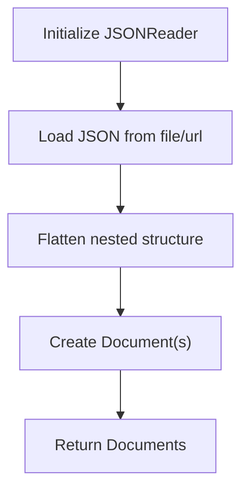

**Diagram sources**
- [__init__.py](file://llama-index-integrations/readers/llama-index-readers-json/llama_index/readers/json/__init__.py#L1-L4)
- [base.py](file://llama-index-integrations/readers/llama-index-readers-json/llama_index/readers/json/base.py)

#### Structured Data Connector
Handles CSV/Excel-like tabular data with column selection and parsing.

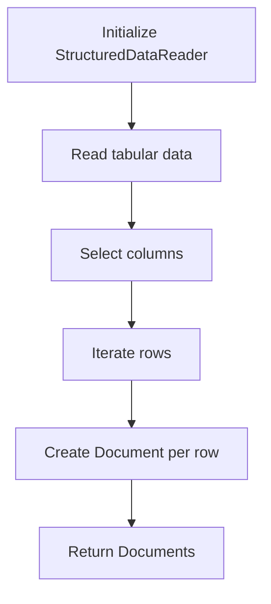

**Diagram sources**
- [__init__.py](file://llama-index-integrations/readers/llama-index-readers-structured-data/llama_index/readers/structured_data/__init__.py#L1-L4)
- [base.py](file://llama-index-integrations/readers/llama-index-readers-structured-data/llama_index/readers/structured_data/base.py)

**Section sources**
- [__init__.py](file://llama-index-integrations/readers/llama-index-readers-json/llama_index/readers/json/__init__.py#L1-L4)
- [base.py](file://llama-index-integrations/readers/llama-index-readers-json/llama_index/readers/json/base.py)
- [__init__.py](file://llama-index-integrations/readers/llama-index-readers-structured-data/llama_index/readers/structured_data/__init__.py#L1-L4)
- [base.py](file://llama-index-integrations/readers/llama-index-readers-structured-data/llama_index/readers/structured_data/base.py)

### Enterprise and Specialized Connectors

#### GraphQL Connector
Executes GraphQL queries and converts results to Documents.

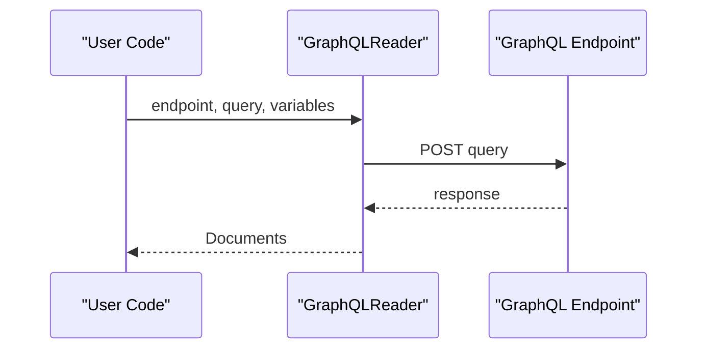

**Diagram sources**
- [__init__.py](file://llama-index-integrations/readers/llama-index-readers-graphql/llama_index/readers/graphql/__init__.py#L1-L4)
- [base.py](file://llama-index-integrations/readers/llama-index-readers-graphql/llama_index/readers/graphql/base.py)

#### OpenSearch Connector
Queries indices and returns results as Documents.

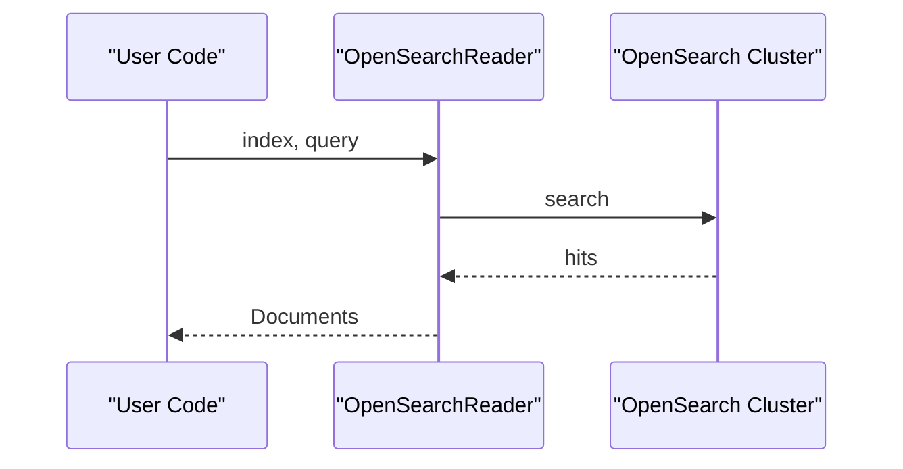

**Diagram sources**
- [__init__.py](file://llama-index-integrations/readers/llama-index-readers-opensearch/llama_index/readers/opensearch/__init__.py#L1-L4)
- [base.py](file://llama-index-integrations/readers/llama-index-readers-opensearch/llama_index/readers/opensearch/base.py)

#### Remote Execution Connectors
- Remote: executes commands remotely and streams output.
- Remote Depth: explores remote filesystems recursively.

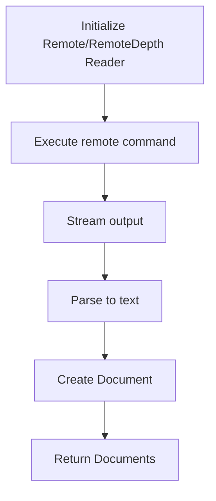

**Diagram sources**
- [__init__.py](file://llama-index-integrations/readers/llama-index-readers-remote/llama_index/readers/remote/__init__.py#L1-L4)
- [base.py](file://llama-index-integrations/readers/llama-index-readers-remote/llama_index/readers/remote/base.py)
- [__init__.py](file://llama-index-integrations/readers/llama-index-readers-remote-depth/llama_index/readers/remote_depth/__init__.py#L1-L4)
- [base.py](file://llama-index-integrations/readers/llama-index-readers-remote-depth/llama_index/readers/remote_depth/base.py)

**Section sources**
- [__init__.py](file://llama-index-integrations/readers/llama-index-readers-graphql/llama_index/readers/graphql/__init__.py#L1-L4)
- [base.py](file://llama-index-integrations/readers/llama-index-readers-graphql/llama_index/readers/graphql/base.py)
- [__init__.py](file://llama-index-integrations/readers/llama-index-readers-opensearch/llama_index/readers/opensearch/__init__.py#L1-L4)
- [base.py](file://llama-index-integrations/readers/llama-index-readers-opensearch/llama_index/readers/opensearch/base.py)
- [__init__.py](file://llama-index-integrations/readers/llama-index-readers-remote/llama_index/readers/remote/__init__.py#L1-L4)
- [base.py](file://llama-index-integrations/readers/llama-index-readers-remote/llama_index/readers/remote/base.py)
- [__init__.py](file://llama-index-integrations/readers/llama-index-readers-remote-depth/llama_index/readers/remote_depth/__init__.py#L1-L4)
- [base.py](file://llama-index-integrations/readers/llama-index-readers-remote-depth/llama_index/readers/remote_depth/base.py)

### Document Parsing and OCR Connectors

#### LlamaParse Connector
LlamaParse API parses PDFs and other documents into structured text.

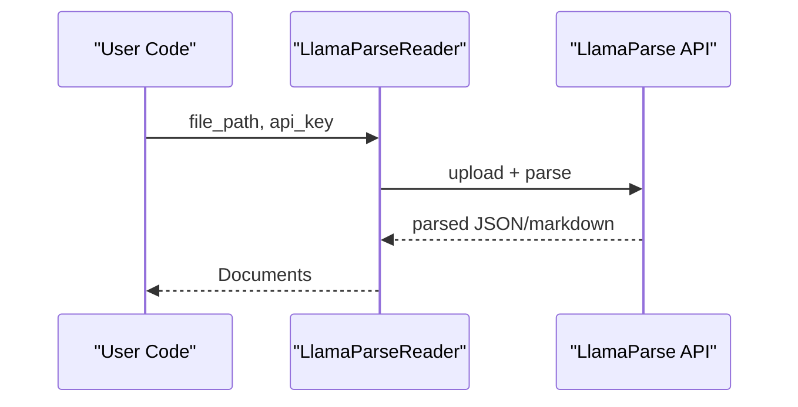

**Diagram sources**
- [__init__.py](file://llama-index-integrations/readers/llama-index-readers-llama-parse/llama_index/readers/llama_parse/__init__.py#L1-L4)
- [base.py](file://llama-index-integrations/readers/llama-index-readers-llama-parse/llama_index/readers/llama_parse/base.py)

#### Docling Connector
Apache Tika-based parsing for structured extraction.

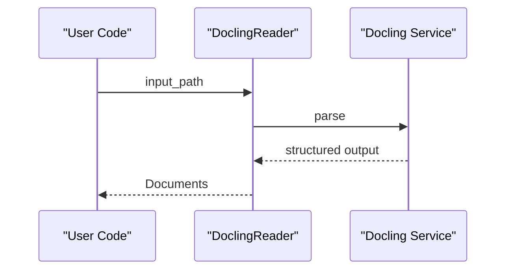

**Diagram sources**
- [__init__.py](file://llama-index-integrations/readers/llama-index-readers-docling/llama_index/readers/docling/__init__.py#L1-L4)
- [base.py](file://llama-index-integrations/readers/llama-index-readers-docling/llama_index/readers/docling/base.py)

#### Whisper Connector
Transcribes audio to text using Whisper.

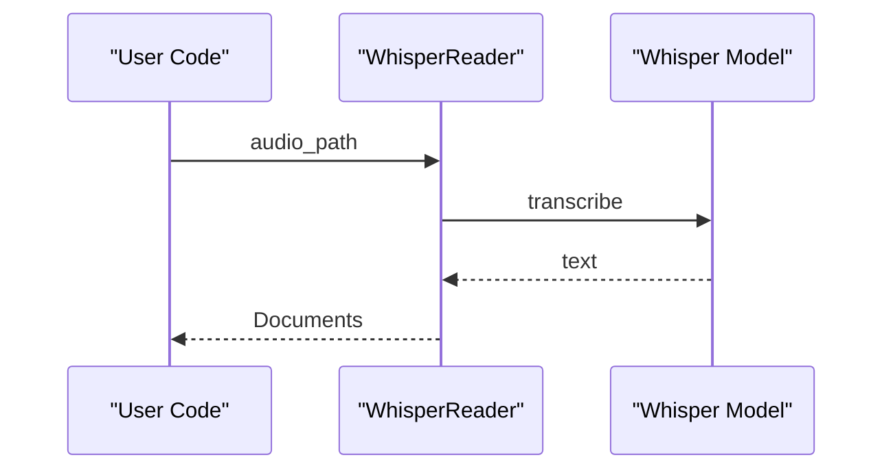

**Diagram sources**
- [__init__.py](file://llama-index-integrations/readers/llama-index-readers-whisper/llama_index/readers/whisper/__init__.py#L1-L4)
- [base.py](file://llama-index-integrations/readers/llama-index-readers-whisper/llama_index/readers/whisper/base.py)

#### PDF Table and OCR Connectors
- PDF Table: Extracts tables from PDFs.
- PDF Marker: Highlights and extracts regions.
- Smart PDF Loader: Intelligent layout-aware parsing.
- Nougat OCR: Transformer-based OCR.
- PaddleOCR: High-performance OCR engine.

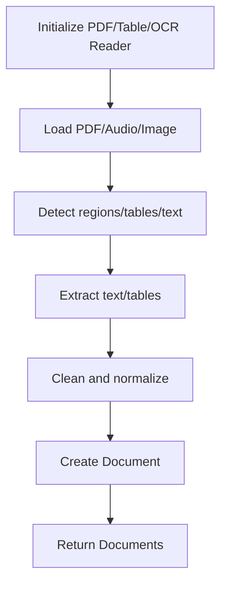

**Diagram sources**
- [__init__.py](file://llama-index-integrations/readers/llama-index-readers-pdf-table/llama_index/readers/pdf_table/__init__.py#L1-L4)
- [base.py](file://llama-index-integrations/readers/llama-index-readers-pdf-table/llama_index/readers/pdf_table/base.py)
- [__init__.py](file://llama-index-integrations/readers/llama-index-readers-pdf-marker/llama_index/readers/pdf_marker/__init__.py#L1-L4)
- [base.py](file://llama-index-integrations/readers/llama-index-readers-pdf-marker/llama_index/readers/pdf_marker/base.py)
- [__init__.py](file://llama-index-integrations/readers/llama-index-readers-smart-pdf-loader/llama_index/readers/smart_pdf_loader/__init__.py#L1-L4)
- [base.py](file://llama-index-integrations/readers/llama-index-readers-smart-pdf-loader/llama_index/readers/smart_pdf_loader/base.py)
- [__init__.py](file://llama-index-integrations/readers/llama-index-readers-nougat-ocr/llama_index/readers/nougat_ocr/__init__.py#L1-L4)
- [base.py](file://llama-index-integrations/readers/llama-index-readers-nougat-ocr/llama_index/readers/nougat_ocr/base.py)
- [__init__.py](file://llama-index-integrations/readers/llama-index-readers-paddle-ocr/llama_index/readers/paddle_ocr/__init__.py#L1-L4)
- [base.py](file://llama-index-integrations/readers/llama-index-readers-paddle-ocr/llama_index/readers/paddle_ocr/base.py)

**Section sources**
- [__init__.py](file://llama-index-integrations/readers/llama-index-readers-llama-parse/llama_index/readers/llama_parse/__init__.py#L1-L4)
- [base.py](file://llama-index-integrations/readers/llama-index-readers-llama-parse/llama_index/readers/llama_parse/base.py)
- [__init__.py](file://llama-index-integrations/readers/llama-index-readers-docling/llama_index/readers/docling/__init__.py#L1-L4)
- [base.py](file://llama-index-integrations/readers/llama-index-readers-docling/llama_index/readers/docling/base.py)
- [__init__.py](file://llama-index-integrations/readers/llama-index-readers-whisper/llama_index/readers/whisper/__init__.py#L1-L4)
- [base.py](file://llama-index-integrations/readers/llama-index-readers-whisper/llama_index/readers/whisper/base.py)
- [__init__.py](file://llama-index-integrations/readers/llama-index-readers-pdf-table/llama_index/readers/pdf_table/__init__.py#L1-L4)
- [base.py](file://llama-index-integrations/readers/llama-index-readers-pdf-table/llama_index/readers/pdf_table/base.py)
- [__init__.py](file://llama-index-integrations/readers/llama-index-readers-pdf-marker/llama_index/readers/pdf_marker/__init__.py#L1-L4)
- [base.py](file://llama-index-integrations/readers/llama-index-readers-pdf-marker/llama_index/readers/pdf_marker/base.py)
- [__init__.py](file://llama-index-integrations/readers/llama-index-readers-smart-pdf-loader/llama_index/readers/smart_pdf_loader/__init__.py#L1-L4)
- [base.py](file://llama-index-integrations/readers/llama-index-readers-smart-pdf-loader/llama_index/readers/smart_pdf_loader/base.py)
- [__init__.py](file://llama-index-integrations/readers/llama-index-readers-nougat-ocr/llama_index/readers/nougat_ocr/__init__.py#L1-L4)
- [base.py](file://llama-index-integrations/readers/llama-index-readers-nougat-ocr/llama_index/readers/nougat_ocr/base.py)
- [__init__.py](file://llama-index-integrations/readers/llama-index-readers-paddle-ocr/llama_index/readers/paddle_ocr/__init__.py#L1-L4)
- [base.py](file://llama-index-integrations/readers/llama-index-readers-paddle-ocr/llama_index/readers/paddle_ocr/base.py)

### Multi-Source Data Ingestion Pipelines
Patterns:
- Fan-in: Combine outputs from multiple readers into a single document list.
- Fan-out: Apply different readers to subsets of sources and merge results.
- Pipeline stages: Readers → Transformers → Batch processors → Indexers.

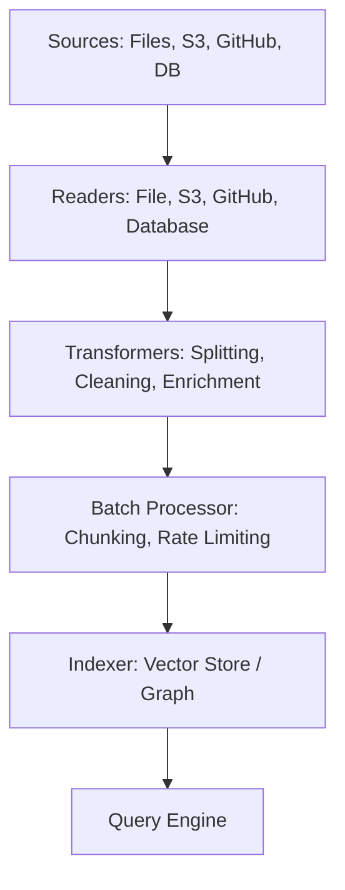

**Diagram sources**
- [base.py](file://llama-index-core/llama_index/core/readers/base.py#L19-L250)
- [__init__.py](file://llama-index-core/llama_index/core/readers/__init__.py#L14-L32)

## Dependency Analysis
- Core readers depend on BaseReader and ReaderConfig for uniform behavior.
- Integrations depend on external SDKs and APIs; ensure compatible versions.
- Reader loading utilities centralize instantiation and deserialization.

```mermaid
graph TB
Core["Core Readers"] --> Mixins["BaseReader, ResourcesReaderMixin"]
Core --> LoadUtil["Reader Loading Utils"]
Int["Integration Readers"] --> Core
Int --> ExtSDK["External SDKs/APIs"]
```

**Diagram sources**
- [base.py](file://llama-index-core/llama_index/core/readers/base.py#L19-L250)
- [loading.py](file://llama-index-core/llama_index/core/readers/loading.py#L6-L27)
- [__init__.py](file://llama-index-core/llama_index/core/readers/__init__.py#L14-L32)

**Section sources**
- [base.py](file://llama-index-core/llama_index/core/readers/base.py#L19-L250)
- [loading.py](file://llama-index-core/llama_index/core/readers/loading.py#L6-L27)
- [__init__.py](file://llama-index-core/llama_index/core/readers/__init__.py#L14-L32)

## Performance Considerations
- Prefer async readers where available to overlap I/O.
- Use batching and chunking to reduce memory pressure.
- Apply connection pooling for database and cloud APIs.
- Implement retry/backoff and circuit breakers for transient failures.
- Cache frequently accessed metadata and transformed content.

## Troubleshooting Guide
Common issues and remedies:
- Authentication failures: Verify tokens, scopes, and expiration for GitHub, Discord, and cloud providers.
- Rate limiting: Add delays, reduce concurrency, and respect retry-after headers.
- Network errors: Retry with exponential backoff; handle timeouts and partial reads.
- Large payloads: Enable streaming where supported; process incrementally.
- Schema mismatches: Normalize fields and handle missing values in structured data.

**Section sources**
- [base.py](file://llama-index-core/llama_index/core/readers/base.py#L19-L250)

## Conclusion
LlamaIndex provides a robust, extensible framework for integrating diverse data sources. By adhering to the BaseReader contract, implementing consistent authentication and rate-limiting strategies, and leveraging batching and transformation pipelines, teams can reliably ingest, process, and query data from files, databases, web APIs, cloud storage, and enterprise systems.

## Appendices

### Authentication Methods by Connector Family
- GitHub: PAT or GitHub App JWT.
- Discord: Bot token.
- S3/GCS: IAM role, service account, or explicit credentials.
- Database: Connection string with credentials.
- Web APIs: API key, OAuth bearer token, or basic auth.

### Connection Pooling and Rate Limiting
- Database: Use a shared connection pool; configure max connections and timeouts.
- Cloud APIs: Use SDK-provided pools; apply client-side concurrency caps.
- Web: Limit concurrent requests; add jitter and backoff.

### Error Handling Strategies
- Normalize exceptions to reader-level errors.
- Log contextual metadata (source URI, query, timestamps).
- Implement circuit breaker patterns for failing endpoints.