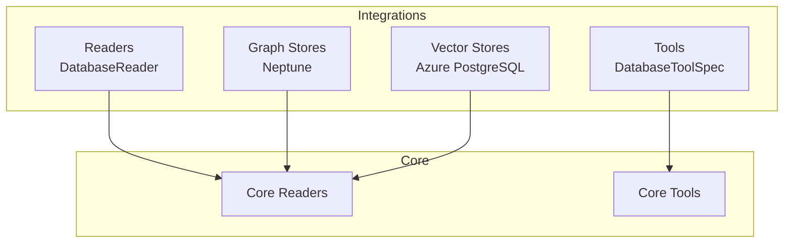
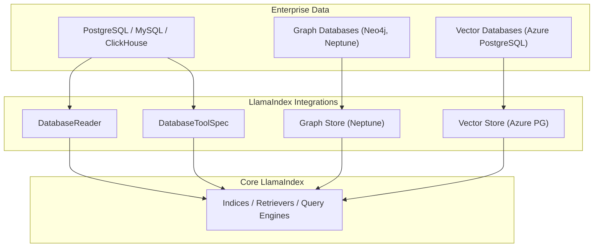
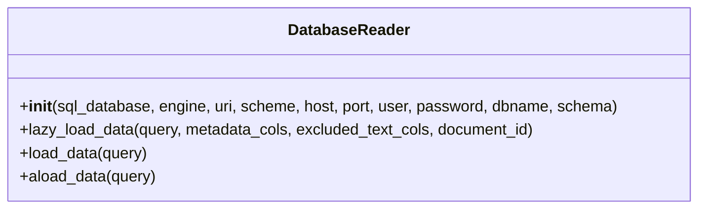
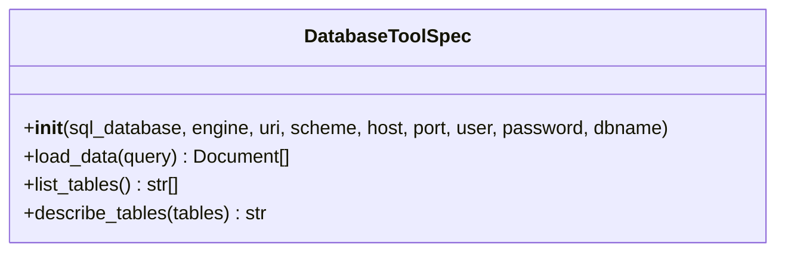
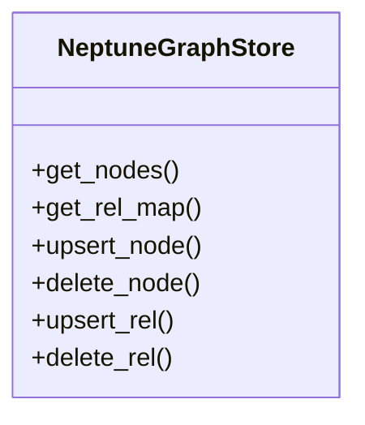
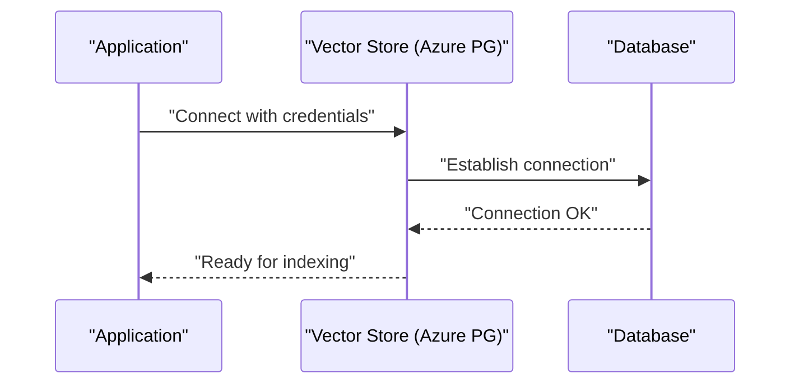
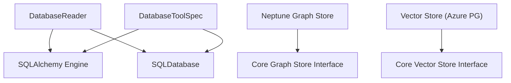

# Enterprise Integration Patterns

<cite>
**Referenced Files in This Document**
- [README.md](file://llama-index-integrations/README.md)
- [database.md](file://docs/api_reference/api_reference/readers/database.md)
- [database.md](file://docs/api_reference/api_reference/tools/database.md)
- [base.py](file://llama-index-integrations/readers/llama-index-readers-database/llama_index/readers/database/base.py)
- [README.md](file://llama-index-integrations/readers/llama-index-readers-database/README.md)
- [base.py](file://llama-index-integrations/tools/llama-index-tools-database/llama_index/tools/database/base.py)
- [README.md](file://llama-index-integrations/tools/llama-index-tools-database/README.md)
- [database.ipynb](file://llama-index-integrations/tools/llama-index-tools-database/examples/database.ipynb)
- [test_readers_database.py](file://llama-index-integrations/readers/llama-index-readers-database/tests/test_readers_database.py)
- [test_tools_database.py](file://llama-index-integrations/tools/llama-index-tools-database/tests/test_tools_database.py)
- [database.py](file://llama-index-integrations/graph_stores/llama-index-graph-stores-neptune/llama_index/graph_stores/neptune/database.py)
- [database_property_graph.py](file://llama-index-integrations/graph_stores/llama-index-graph-stores-neptune/llama_index/graph_stores/neptune/database_property_graph.py)
- [README.md](file://docs/examples/vector_stores/azurepostgresql.ipynb)
</cite>

## Table of Contents
1. [Introduction](#introduction)
2. [Project Structure](#project-structure)
3. [Core Components](#core-components)
4. [Architecture Overview](#architecture-overview)
5. [Detailed Component Analysis](#detailed-component-analysis)
6. [Dependency Analysis](#dependency-analysis)
7. [Performance Considerations](#performance-considerations)
8. [Security and Compliance](#security-and-compliance)
9. [High Availability and Disaster Recovery](#high-availability-and-disaster-recovery)
10. [Troubleshooting Guide](#troubleshooting-guide)
11. [Conclusion](#conclusion)

## Introduction
This document describes enterprise-scale integration patterns for LlamaIndex with enterprise-grade data platforms. It focuses on connecting to relational databases, graph stores, and vector stores commonly used in production environments. It covers integration approaches for PostgreSQL, MySQL, MongoDB, ClickHouse, BigQuery, and other enterprise systems, along with data governance, security, compliance, ETL pipelines, data lineage, audit logging, high availability, backups, and disaster recovery strategies.

## Project Structure
LlamaIndex integrates with enterprise systems through modular packages organized by capability:
- Readers: Extract structured data from databases and other sources
- Tools: Enable agents to introspect and query databases
- Graph Stores: Connect to property graph databases (e.g., Neptune)
- Vector Stores: Integrate with vector databases and cloud-native stores
- Observability and Instrumentation: Enable tracing and metrics for production deployments

**Diagram sources**
- [README.md](file://llama-index-integrations/README.md#L1-L5)
- [database.md](file://docs/api_reference/api_reference/readers/database.md#L1-L4)
- [database.md](file://docs/api_reference/api_reference/tools/database.md#L1-L4)

**Section sources**
- [README.md](file://llama-index-integrations/README.md#L1-L5)

## Core Components
This section outlines the primary enterprise integration components and their responsibilities.

- DatabaseReader: Loads tabular data from SQL databases into LlamaIndex Documents. Supports multiple connection modes (SQLDatabase object, SQLAlchemy Engine, URI, or discrete credentials), schema selection, metadata mapping, text exclusion, and custom document ID generation. It supports streaming and async loading.
- DatabaseToolSpec: Provides agent-friendly tools to list tables, describe schemas, and execute queries against a database. Reflects metadata and generates DDL for introspection.
- Graph Store (Neptune): Implements graph database connectivity for property graphs, enabling retrieval and mutation operations aligned with LlamaIndex’s graph store interface.
- Vector Store (Azure PostgreSQL): Demonstrates integration with enterprise vector stores, including connection and configuration patterns suitable for production-grade deployments.

**Section sources**
- [base.py](file://llama-index-integrations/readers/llama-index-readers-database/llama_index/readers/database/base.py#L26-L246)
- [README.md](file://llama-index-integrations/readers/llama-index-readers-database/README.md#L1-L89)
- [base.py](file://llama-index-integrations/tools/llama-index-tools-database/llama_index/tools/database/base.py#L15-L140)
- [README.md](file://llama-index-integrations/tools/llama-index-tools-database/README.md#L1-L41)
- [database.py](file://llama-index-integrations/graph_stores/llama-index-graph-stores-neptune/llama_index/graph_stores/neptune/database.py)
- [database_property_graph.py](file://llama-index-integrations/graph_stores/llama-index-graph-stores-neptune/llama_index/graph_stores/neptune/database_property_graph.py)
- [README.md](file://docs/examples/vector_stores/azurepostgresql.ipynb)

## Architecture Overview
The enterprise integration architecture centers around secure, scalable connectors that transform enterprise data into semantic-aware embeddings and indices. The following diagram shows how readers, tools, graph stores, and vector stores integrate with core LlamaIndex components.

**Diagram sources**
- [base.py](file://llama-index-integrations/readers/llama-index-readers-database/llama_index/readers/database/base.py#L26-L246)
- [base.py](file://llama-index-integrations/tools/llama-index-tools-database/llama_index/tools/database/base.py#L15-L140)
- [database.py](file://llama-index-integrations/graph_stores/llama-index-graph-stores-neptune/llama_index/graph_stores/neptune/database.py)
- [database_property_graph.py](file://llama-index-integrations/graph_stores/llama-index-graph-stores-neptune/llama_index/graph_stores/neptune/database_property_graph.py)
- [README.md](file://docs/examples/vector_stores/azurepostgresql.ipynb)

## Detailed Component Analysis

### DatabaseReader: Relational Data Ingestion
DatabaseReader encapsulates robust ingestion patterns for relational data, including:
- Multiple connection modes: SQLDatabase object, SQLAlchemy Engine, connection URI, or discrete credentials
- Schema selection and namespace handling
- Column-level metadata mapping and text exclusion
- Custom document ID generation from row data
- Streaming and async loading for large datasets

**Diagram sources**
- [base.py](file://llama-index-integrations/readers/llama-index-readers-database/llama_index/readers/database/base.py#L26-L246)

**Section sources**
- [base.py](file://llama-index-integrations/readers/llama-index-readers-database/llama_index/readers/database/base.py#L26-L246)
- [README.md](file://llama-index-integrations/readers/llama-index-readers-database/README.md#L1-L89)

### DatabaseToolSpec: Agent-Driven Database Access
DatabaseToolSpec exposes three primary functions for agent-driven database interactions:
- list_tables: Enumerates available tables
- describe_tables: Returns DDL for specified tables
- load_data: Executes arbitrary SQL queries and returns Documents

**Diagram sources**
- [base.py](file://llama-index-integrations/tools/llama-index-tools-database/llama_index/tools/database/base.py#L15-L140)

**Section sources**
- [base.py](file://llama-index-integrations/tools/llama-index-tools-database/llama_index/tools/database/base.py#L15-L140)
- [README.md](file://llama-index-integrations/tools/llama-index-tools-database/README.md#L1-L41)

### Graph Store Integration (Neptune)
The Neptune graph store adapter demonstrates how to connect property graphs to LlamaIndex. It implements graph store operations compatible with LlamaIndex’s graph store interface, enabling retrieval and mutation workflows.

**Diagram sources**
- [database.py](file://llama-index-integrations/graph_stores/llama-index-graph-stores-neptune/llama_index/graph_stores/neptune/database.py)
- [database_property_graph.py](file://llama-index-integrations/graph_stores/llama-index-graph-stores-neptune/llama_index/graph_stores/neptune/database_property_graph.py)

**Section sources**
- [database.py](file://llama-index-integrations/graph_stores/llama-index-graph-stores-neptune/llama_index/graph_stores/neptune/database.py)
- [database_property_graph.py](file://llama-index-integrations/graph_stores/llama-index-graph-stores-neptune/llama_index/graph_stores/neptune/database_property_graph.py)

### Vector Store Integration (Azure PostgreSQL)
The Azure PostgreSQL vector store example illustrates production-ready configuration patterns for enterprise vector databases. It demonstrates secure connection handling and index creation suitable for high-throughput scenarios.

**Diagram sources**
- [README.md](file://docs/examples/vector_stores/azurepostgresql.ipynb)

**Section sources**
- [README.md](file://docs/examples/vector_stores/azurepostgresql.ipynb)

## Dependency Analysis
The integrations rely on SQLAlchemy for database connectivity and leverage LlamaIndex core abstractions for readers and tools. The following diagram highlights key dependencies and relationships.

**Diagram sources**
- [base.py](file://llama-index-integrations/readers/llama-index-readers-database/llama_index/readers/database/base.py#L17-L21)
- [base.py](file://llama-index-integrations/tools/llama-index-tools-database/llama_index/tools/database/base.py#L7-L12)
- [database.py](file://llama-index-integrations/graph_stores/llama-index-graph-stores-neptune/llama_index/graph_stores/neptune/database.py)
- [README.md](file://docs/examples/vector_stores/azurepostgresql.ipynb)

**Section sources**
- [base.py](file://llama-index-integrations/readers/llama-index-readers-database/llama_index/readers/database/base.py#L17-L21)
- [base.py](file://llama-index-integrations/tools/llama-index-tools-database/llama_index/tools/database/base.py#L7-L12)

## Performance Considerations
- Streaming and async loading: Use DatabaseReader’s streaming capabilities to process large result sets incrementally, reducing memory overhead.
- Metadata mapping and text exclusion: Limit text content to essential columns and move non-text metadata to metadata_cols to reduce embedding costs.
- Connection pooling: Configure SQLAlchemy Engine with appropriate pool sizes and timeouts for high-throughput environments.
- Batch operations: Prefer batched writes for vector stores and graph stores to minimize round trips.
- Index tuning: Align embedding dimensions and similarity thresholds with workload characteristics to balance recall and latency.

[No sources needed since this section provides general guidance]

## Security and Compliance
- Credential management: Store database credentials in secure secret managers and avoid hardcoding sensitive values. Use environment variables or platform-specific secret stores.
- Network isolation: Deploy database connections within private networks and use VPNs or direct peering to minimize exposure.
- Encryption: Enable TLS for all database connections and consider transparent encryption at rest for sensitive datasets.
- Audit logging: Log all database access events, including queries executed by agents, for compliance and forensic analysis.
- Data governance: Enforce row-level security and column masking to restrict access according to organizational policies.
- Compliance frameworks: Align ingestion and processing workflows with SOX, GDPR, HIPAA, PCI-DSS, and other applicable regulations.

[No sources needed since this section provides general guidance]

## High Availability and Disaster Recovery
- Multi-region deployments: Distribute vector stores and graph stores across regions with synchronous or asynchronous replication.
- Backup strategies: Schedule regular logical and physical backups for relational and graph databases. Automate snapshot creation and retention policies.
- Failover mechanisms: Configure automatic failover for primary databases and maintain warm standby instances for rapid recovery.
- Disaster recovery drills: Conduct periodic DR tests to validate restore procedures and network connectivity.
- Monitoring and alerts: Track replication lag, connection health, and query latency to detect anomalies early.

[No sources needed since this section provides general guidance]

## Troubleshooting Guide
Common issues and resolutions:
- Connection failures: Verify URIs, credentials, and network reachability. Confirm firewall rules and TLS settings.
- Missing tables or columns: Use DatabaseToolSpec’s describe_tables to inspect schema and ensure correct table/column names.
- Large result sets: Switch to streaming with lazy_load_data and apply filters to reduce payload size.
- Metadata mismatches: Validate metadata_cols and excluded_text_cols mappings to prevent missing or duplicate metadata keys.
- Test coverage: Use existing unit tests as references for validating custom integrations.

**Section sources**
- [test_readers_database.py](file://llama-index-integrations/readers/llama-index-readers-database/tests/test_readers_database.py)
- [test_tools_database.py](file://llama-index-integrations/tools/llama-index-tools-database/tests/test_tools_database.py)

## Conclusion
LlamaIndex provides a flexible, modular foundation for enterprise integrations across databases, graph stores, and vector stores. By leveraging DatabaseReader and DatabaseToolSpec for secure, governed data access, integrating graph stores for relationship-aware retrieval, and adopting production-grade vector store configurations, organizations can build scalable, compliant, and resilient AI-powered applications.