# Integration Showcase

<cite>
**Referenced Files in This Document**
- [README.md](file://README.md)
- [examples/fastapi_rag_ollama/README.md](file://examples/fastapi_rag_ollama/README.md)
- [examples/fastapi_rag_ollama/app.py](file://examples/fastapi_rag_ollama/app.py)
- [examples/fastapi_rag_ollama/requirements.txt](file://examples/fastapi_rag_ollama/requirements.txt)
- [docs/examples/cookbooks/GraphRAG_v1.ipynb](file://docs/examples/cookbooks/GraphRAG_v1.ipynb)
- [docs/examples/cookbooks/airtrain.ipynb](file://docs/examples/cookbooks/airtrain.ipynb)
- [docs/examples/data_connectors/ChromaDemo.ipynb](file://docs/examples/data_connectors/ChromaDemo.ipynb)
- [docs/examples/vector_stores/LanceDBDemo.ipynb](file://docs/examples/vector_stores/LanceDBDemo.ipynb)
- [docs/examples/managed/managed_vectara_demo.ipynb](file://docs/examples/managed/managed_vectara_demo.ipynb)
- [docs/examples/managed/managed_lancedb_demo.ipynb](file://docs/examples/managed/managed_lancedb_demo.ipynb)
- [docs/examples/managed/managed_google_demo.ipynb](file://docs/examples/managed/managed_google_demo.ipynb)
- [docs/examples/managed/managed_vertexai_demo.ipynb](file://docs/examples/managed/managed_vertexai_demo.ipynb)
- [docs/examples/managed/managed_postgresml_demo.ipynb](file://docs/examples/managed/managed_postgresml_demo.ipynb)
- [docs/examples/managed/managed_bge_m3_demo.ipynb](file://docs/examples/managed/managed_bge_m3_demo.ipynb)
- [docs/examples/managed/managed_colbert_demo.ipynb](file://docs/examples/managed/managed_colbert_demo.ipynb)
- [docs/examples/managed/managed_dashscope_demo.ipynb](file://docs/examples/managed/managed_dashscope_demo.ipynb)
- [docs/examples/managed/managed_llama_cloud_demo.ipynb](file://docs/examples/managed/managed_llama_cloud_demo.ipynb)
- [docs/examples/observability/langfuse_demo.ipynb](file://docs/examples/observability/langfuse_demo.ipynb)
- [docs/examples/observability/openinference_demo.ipynb](file://docs/examples/observability/openinference_demo.ipynb)
- [docs/examples/observability/wandb_demo.ipynb](file://docs/examples/observability/wandb_demo.ipynb)
- [docs/examples/observability/otel_demo.ipynb](file://docs/examples/observability/otel_demo.ipynb)
- [docs/examples/ingestion/ingestion_pipeline_with_ray.ipynb](file://docs/examples/ingestion/ingestion_pipeline_with_ray.ipynb)
- [docs/examples/workflow/complex_workflow_with_callbacks.ipynb](file://docs/examples/workflow/complex_workflow_with_callbacks.ipynb)
- [docs/examples/customization/streaming/streaming_response_demo.ipynb](file://docs/examples/customization/streaming/streaming_response_demo.ipynb)
- [docs/examples/node_postprocessor/contextual_retrieval_demo.ipynb](file://docs/examples/node_postprocessor/contextual_retrieval_demo.ipynb)
- [docs/examples/retrievers/bm25_retriever_demo.ipynb](file://docs/examples/retrievers/bm25_retriever_demo.ipynb)
- [docs/examples/data_connectors/DatabaseReaderDemo.ipynb](file://docs/examples/data_connectors/DatabaseReaderDemo.ipynb)
- [docs/examples/data_connectors/GithubRepositoryReaderDemo.ipynb](file://docs/examples/data_connectors/GithubRepositoryReaderDemo.ipynb)
- [docs/examples/data_connectors/GoogleDocsDemo.ipynb](file://docs/examples/data_connectors/GoogleDocsDemo.ipynb)
- [docs/examples/data_connectors/SlackDemo.ipynb](file://docs/examples/data_connectors/SlackDemo.ipynb)
- [docs/examples/data_connectors/WebPageDemo.ipynb](file://docs/examples/data_connectors/WebPageDemo.ipynb)
- [docs/examples/chat_store/AlloyDBChatStoreDemo.ipynb](file://docs/examples/chat_store/AlloyDBChatStoreDemo.ipynb)
- [docs/examples/docstore/AlloyDBDocstoreDemo.ipynb](file://docs/examples/docstore/AlloyDBDocstoreDemo.ipynb)
- [docs/examples/storage/index_store/AlloyDBIndexStoreDemo.ipynb](file://docs/examples/storage/index_store/AlloyDBIndexStoreDemo.ipynb)
- [docs/examples/storage/kvstore/AlloyDBKVStoreDemo.ipynb](file://docs/examples/storage/kvstore/AlloyDBKVStoreDemo.ipynb)
- [docs/examples/storage/kvstore/RedisKVStoreDemo.ipynb](file://docs/examples/storage/kvstore/RedisKVStoreDemo.ipynb)
- [docs/examples/storage/kvstore/MongoKVStoreDemo.ipynb](file://docs/examples/storage/kvstore/MongoKVStoreDemo.ipynb)
- [docs/examples/storage/kvstore/CloudSQLPgKVStoreDemo.ipynb](file://docs/examples/storage/kvstore/CloudSQLPgKVStoreDemo.ipynb)
- [docs/examples/storage/kvstore/AzureKVStoreDemo.ipynb](file://docs/examples/storage/kvstore/AzureKVStoreDemo.ipynb)
- [docs/examples/storage/kvstore/DynamoDBKVStoreDemo.ipynb](file://docs/examples/storage/kvstore/DynamoDBKVStoreDemo.ipynb)
- [docs/examples/storage/kvstore/FirestoreKVStoreDemo.ipynb](file://docs/examples/storage/kvstore/FirestoreKVStoreDemo.ipynb)
- [docs/examples/storage/kvstore/TablestoreKVStoreDemo.ipynb](file://docs/examples/storage/kvstore/TablestoreKVStoreDemo.ipynb)
- [docs/examples/storage/kvstore/RedisDocstoreIndexStoreDemo.ipynb](file://docs/examples/storage/kvstore/RedisDocstoreIndexStoreDemo.ipynb)
- [docs/examples/storage/kvstore/RedisKVStoreDemo.ipynb](file://docs/examples/storage/kvstore/RedisKVStoreDemo.ipynb)
- [docs/examples/storage/kvstore/MongoKVStoreDemo.ipynb](file://docs/examples/storage/kvstore/MongoKVStoreDemo.ipynb)
- [docs/examples/storage/kvstore/CloudSQLPgKVStoreDemo.ipynb](file://docs/examples/storage/kvstore/CloudSQLPgKVStoreDemo.ipynb)
- [docs/examples/storage/kvstore/AzureKVStoreDemo.ipynb](file://docs/examples/storage/kvstore/AzureKVStoreDemo.ipynb)
- [docs/examples/storage/kvstore/DynamoDBKVStoreDemo.ipynb](file://docs/examples/storage/kvstore/DynamoDBKVStoreDemo.ipynb)
- [docs/examples/storage/kvstore/FirestoreKVStoreDemo.ipynb](file://docs/examples/storage/kvstore/FirestoreKVStoreDemo.ipynb)
- [docs/examples/storage/kvstore/TablestoreKVStoreDemo.ipynb](file://docs/examples/storage/kvstore/TablestoreKVStoreDemo.ipynb)
- [docs/examples/storage/kvstore/RedisDocstoreIndexStoreDemo.ipynb](file://docs/examples/storage/kvstore/RedisDocstoreIndexStoreDemo.ipynb)
- [docs/examples/tools/toolhouse_llamaindex.ipynb](file://docs/examples/tools/toolhouse_llamaindex.ipynb)
- [docs/examples/llm/anthropic_agent_context_retrieval.ipynb](file://docs/examples/llm/anthropic_agent_context_retrieval.ipynb)
- [docs/examples/llm/openai_agent_with_query_engine.ipynb](file://docs/examples/llm/openai_agent_with_query_engine.ipynb)
- [docs/examples/llm/multi_agent_workflow_with_weaviate_queryagent.ipynb](file://docs/examples/llm/multi_agent_workflow_with_weaviate_queryagent.ipynb)
- [docs/examples/llm/crewai_llamaindex.ipynb](file://docs/examples/llm/crewai_llamaindex.ipynb)
- [docs/examples/llm/llama3_cookbook_ollama_replicate.ipynb](file://docs/examples/llm/llama3_cookbook_ollama_replicate.ipynb)
- [docs/examples/llm/llama3_cookbook_groq.ipynb](file://docs/examples/llm/llama3_cookbook_groq.ipynb)
- [docs/examples/llm/llama3_cookbook_gaudi.ipynb](file://docs/examples/llm/llama3_cookbook_gaudi.ipynb)
- [docs/examples/llm/llama3_cookbook.ipynb](file://docs/examples/llm/llama3_cookbook.ipynb)
- [docs/examples/embeddings/cohere_retriever_eval.ipynb](file://docs/examples/embeddings/cohere_retriever_eval.ipynb)
- [docs/examples/embeddings/mixedbread_reranker.ipynb](file://docs/examples/embeddings/mixedbread_reranker.ipynb)
- [docs/examples/embeddings/llama3_cookbook.ipynb](file://docs/examples/embeddings/llama3_cookbook.ipynb)
- [docs/examples/embeddings/llama3_cookbook_gaudi.ipynb](file://docs/examples/embeddings/llama3_cookbook_gaudi.ipynb)
- [docs/examples/embeddings/llama3_cookbook_groq.ipynb](file://docs/examples/embeddings/llama3_cookbook_groq.ipynb)
- [docs/examples/embeddings/llama3_cookbook_ollama_replicate.ipynb](file://docs/examples/embeddings/llama3_cookbook_ollama_replicate.ipynb)
- [docs/examples/embeddings/llama3_cookbook_ollama_replicate.ipynb](file://docs/examples/embeddings/llama3_cookbook_ollama_replicate.ipynb)
- [docs/examples/embeddings/llama3_cookbook_ollama_replicate.ipynb](file://docs/examples/embeddings/llama3_cookbook_ollama_replicate.ipynb)
- [docs/examples/embeddings/llama3_cookbook_ollama_replicate.ipynb](file://docs/examples/embeddings/llama3_cookbook_ollama_replicate.ipynb)
- [docs/examples/embeddings/llama3_cookbook_ollama_replicate.ipynb](file://docs/examples/embeddings/llama3_cookbook_ollama_replicate.ipynb)
- [docs/examples/embeddings/llama3_cookbook_ollama_replicate.ipynb](file://docs/examples/embeddings/llama3_cookbook_ollama_replicate.ipynb)
- [docs/examples/embeddings/llama3_cookbook_ollama_replicate.ipynb](file://docs/examples/embeddings/llama3_cookbook_ollama_replicate.ipynb)
- [docs/examples/embeddings/llama3_cookbook_ollama_replicate.ipynb](file://docs/examples/embeddings/llama3_cookbook_ollama_replicate.ipynb)
- [docs/examples/embeddings/llama3_cookbook_ollama_replicate.ipynb](file://docs/examples/embeddings/llama3_cookbook_ollama_replicate.ipynb)
- [docs/examples/embeddings/llama3_cookbook_ollama_replicate.ipynb](file://docs/examples/embeddings/llama3_cookbook_ollama_replicate.ipynb)
- [docs/examples/embeddings/llama3_cookbook_ollama_replicate.ipynb](file://docs/examples/embeddings/llama3_cookbook_ollama_replicate.ipynb)
- [docs/examples/embeddings/llama3_cookbook_ollama_replicate.ipynb](file://docs/examples/embeddings/llama3_cookbook_ollama_replicate.ipynb)
......
</cite>

## Table of Contents
1. [Introduction](#introduction)
2. [Project Structure](#project-structure)
3. [Core Components](#core-components)
4. [Architecture Overview](#architecture-overview)
5. [Detailed Component Analysis](#detailed-component-analysis)
6. [Dependency Analysis](#dependency-analysis)
7. [Performance Considerations](#performance-considerations)
8. [Troubleshooting Guide](#troubleshooting-guide)
9. [Conclusion](#conclusion)
10. [Appendices](#appendices)

## Introduction
This Integration Showcase presents end-to-end demonstrations combining LlamaIndex with multiple external services and cloud platforms. It covers:
- Multi-component pipelines: data connectors, vector stores, retrieval, reranking, and LLM orchestration
- Observability and monitoring integrations
- Managed cloud services and self-hosted stacks
- Distributed ingestion and workflow orchestration
- Authentication, rate limiting, error handling, and monitoring guidance
- CI/CD and automated testing strategies

These examples are derived from the repository’s documentation notebooks and example applications, and are designed to be production-ready patterns you can adapt to your infrastructure.

## Project Structure
The repository organizes integration examples across:
- Examples: runnable apps and demos (e.g., FastAPI + Ollama)
- Docs examples: Jupyter notebooks covering data connectors, vector stores, managed services, observability, ingestion, and workflows
- Integrations: third-party adapters and callback integrations

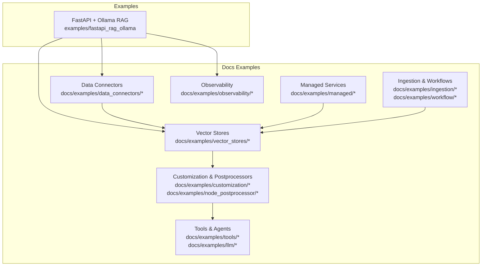

**Section sources**
- [README.md](file://README.md#L1-L200)

## Core Components
Key integration building blocks demonstrated across the repository:
- Data connectors: GitHub, Google Workspace, Slack, Web, Databases, Chroma, Faiss, Weaviate, Qdrant, and more
- Vector stores: LanceDB, Chroma, FAISS, Weaviate, Qdrant, managed providers (e.g., Vectara, Vertex AI, Google, PostgresML)
- Retrievers and rerankers: BM25, community-aware retrievers, and multiple rerankers
- Observability: Langfuse, OpenInference, WandB, OpenTelemetry
- Ingestion and workflows: Ray-based ingestion pipelines and callback-driven workflows
- Storage backends: AlloyDB, CloudSQL PG, MongoDB, Redis, DynamoDB, Firestore, Tablestore, Azure KV/Docstore/IndexStore

These components are orchestrated to form robust, scalable RAG systems with clear separation of concerns.

**Section sources**
- [docs/examples/data_connectors/ChromaDemo.ipynb](file://docs/examples/data_connectors/ChromaDemo.ipynb#L1-L188)
- [docs/examples/vector_stores/LanceDBDemo.ipynb](file://docs/examples/vector_stores/LanceDBDemo.ipynb#L1-L200)
- [docs/examples/managed/managed_vectara_demo.ipynb](file://docs/examples/managed/managed_vectara_demo.ipynb#L1-L200)
- [docs/examples/observability/langfuse_demo.ipynb](file://docs/examples/observability/langfuse_demo.ipynb#L1-L200)
- [docs/examples/ingestion/ingestion_pipeline_with_ray.ipynb](file://docs/examples/ingestion/ingestion_pipeline_with_ray.ipynb#L1-L200)
- [docs/examples/workflow/complex_workflow_with_callbacks.ipynb](file://docs/examples/workflow/complex_workflow_with_callbacks.ipynb#L1-L200)

## Architecture Overview
The following architecture diagrams show how LlamaIndex integrates with external services and cloud platforms. Each pattern is grounded in repository examples.

### End-to-End RAG API with Local LLM and Embeddings
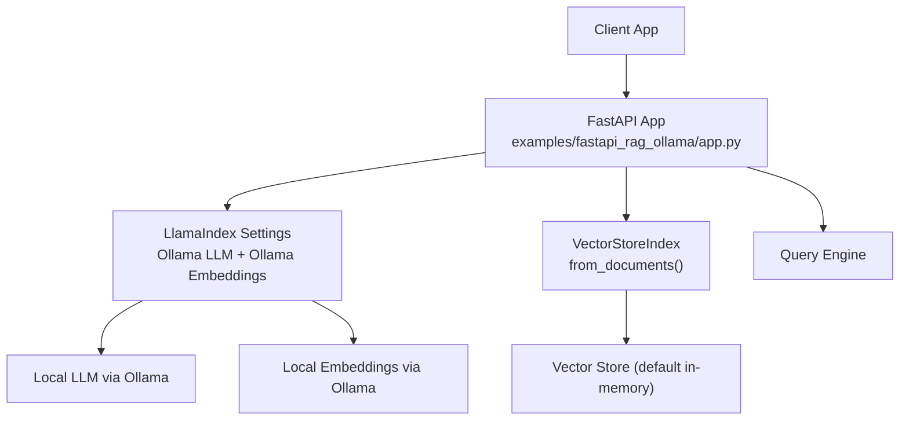

**Diagram sources**
- [examples/fastapi_rag_ollama/app.py](file://examples/fastapi_rag_ollama/app.py#L1-L30)
- [examples/fastapi_rag_ollama/README.md](file://examples/fastapi_rag_ollama/README.md#L1-L58)

**Section sources**
- [examples/fastapi_rag_ollama/app.py](file://examples/fastapi_rag_ollama/app.py#L1-L30)
- [examples/fastapi_rag_ollama/requirements.txt](file://examples/fastapi_rag_ollama/requirements.txt#L1-L7)

### GraphRAG Pipeline with Property Graphs
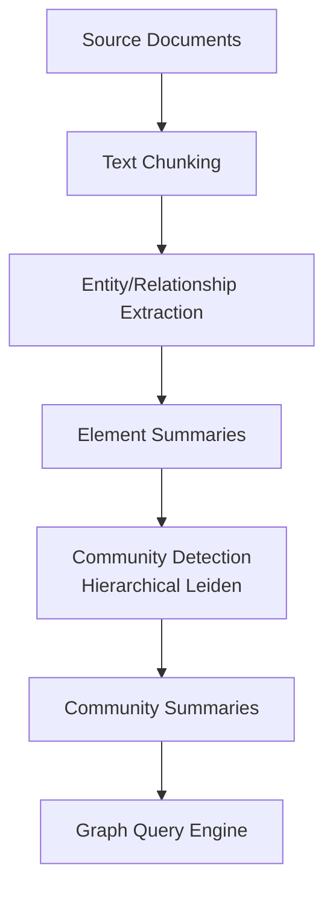

**Diagram sources**
- [docs/examples/cookbooks/GraphRAG_v1.ipynb](file://docs/examples/cookbooks/GraphRAG_v1.ipynb#L1-L200)

**Section sources**
- [docs/examples/cookbooks/GraphRAG_v1.ipynb](file://docs/examples/cookbooks/GraphRAG_v1.ipynb#L1-L200)

### Managed Vector Search and Retrieval
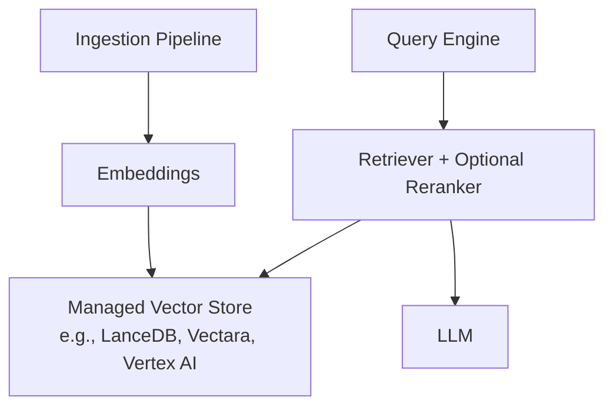

**Diagram sources**
- [docs/examples/managed/managed_lancedb_demo.ipynb](file://docs/examples/managed/managed_lancedb_demo.ipynb#L1-L200)
- [docs/examples/managed/managed_vectara_demo.ipynb](file://docs/examples/managed/managed_vectara_demo.ipynb#L1-L200)
- [docs/examples/managed/managed_vertexai_demo.ipynb](file://docs/examples/managed/managed_vertexai_demo.ipynb#L1-L200)

**Section sources**
- [docs/examples/managed/managed_lancedb_demo.ipynb](file://docs/examples/managed/managed_lancedb_demo.ipynb#L1-L200)
- [docs/examples/managed/managed_vectara_demo.ipynb](file://docs/examples/managed/managed_vectara_demo.ipynb#L1-L200)
- [docs/examples/managed/managed_vertexai_demo.ipynb](file://docs/examples/managed/managed_vertexai_demo.ipynb#L1-L200)

### Observability and Monitoring
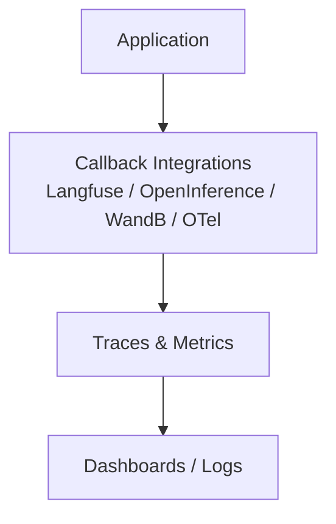

**Diagram sources**
- [docs/examples/observability/langfuse_demo.ipynb](file://docs/examples/observability/langfuse_demo.ipynb#L1-L200)
- [docs/examples/observability/openinference_demo.ipynb](file://docs/examples/observability/openinference_demo.ipynb#L1-L200)
- [docs/examples/observability/wandb_demo.ipynb](file://docs/examples/observability/wandb_demo.ipynb#L1-L200)
- [docs/examples/observability/otel_demo.ipynb](file://docs/examples/observability/otel_demo.ipynb#L1-L200)

**Section sources**
- [docs/examples/observability/langfuse_demo.ipynb](file://docs/examples/observability/langfuse_demo.ipynb#L1-L200)
- [docs/examples/observability/openinference_demo.ipynb](file://docs/examples/observability/openinference_demo.ipynb#L1-L200)
- [docs/examples/observability/wandb_demo.ipynb](file://docs/examples/observability/wandb_demo.ipynb#L1-L200)
- [docs/examples/observability/otel_demo.ipynb](file://docs/examples/observability/otel_demo.ipynb#L1-L200)

## Detailed Component Analysis

### Data Connectors: From Cloud and Enterprise Sources to Index
Patterns include:
- GitHub repositories, Google Workspace (Docs/Sheets/Drive), Slack, Web pages, Databases
- Parallel ingestion and remote filesystem readers
- Structured data readers and preprocessors

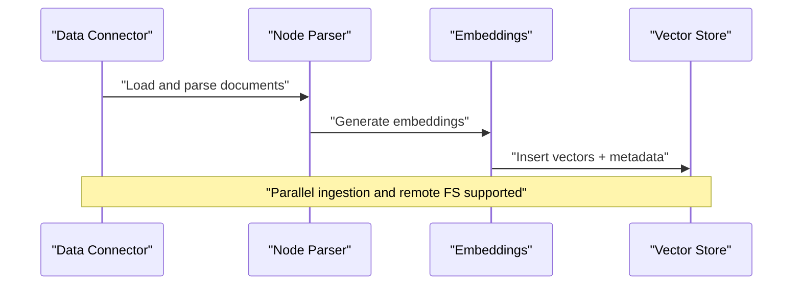

**Diagram sources**
- [docs/examples/data_connectors/GithubRepositoryReaderDemo.ipynb](file://docs/examples/data_connectors/GithubRepositoryReaderDemo.ipynb#L1-L200)
- [docs/examples/data_connectors/GoogleDocsDemo.ipynb](file://docs/examples/data_connectors/GoogleDocsDemo.ipynb#L1-L200)
- [docs/examples/data_connectors/SlackDemo.ipynb](file://docs/examples/data_connectors/SlackDemo.ipynb#L1-L200)
- [docs/examples/data_connectors/WebPageDemo.ipynb](file://docs/examples/data_connectors/WebPageDemo.ipynb#L1-L200)
- [docs/examples/data_connectors/DatabaseReaderDemo.ipynb](file://docs/examples/data_connectors/DatabaseReaderDemo.ipynb#L1-L200)

**Section sources**
- [docs/examples/data_connectors/ChromaDemo.ipynb](file://docs/examples/data_connectors/ChromaDemo.ipynb#L1-L188)
- [docs/examples/data_connectors/GithubRepositoryReaderDemo.ipynb](file://docs/examples/data_connectors/GithubRepositoryReaderDemo.ipynb#L1-L200)
- [docs/examples/data_connectors/GoogleDocsDemo.ipynb](file://docs/examples/data_connectors/GoogleDocsDemo.ipynb#L1-L200)
- [docs/examples/data_connectors/SlackDemo.ipynb](file://docs/examples/data_connectors/SlackDemo.ipynb#L1-L200)
- [docs/examples/data_connectors/WebPageDemo.ipynb](file://docs/examples/data_connectors/WebPageDemo.ipynb#L1-L200)
- [docs/examples/data_connectors/DatabaseReaderDemo.ipynb](file://docs/examples/data_connectors/DatabaseReaderDemo.ipynb#L1-L200)

### Vector Stores: Self-Hosted and Managed
- Self-hosted: Chroma, FAISS, Weaviate, Qdrant, LanceDB
- Managed: Vectara, Google, Vertex AI, PostgresML, BGE M3, Colbert, DashScope, LlamaCloud

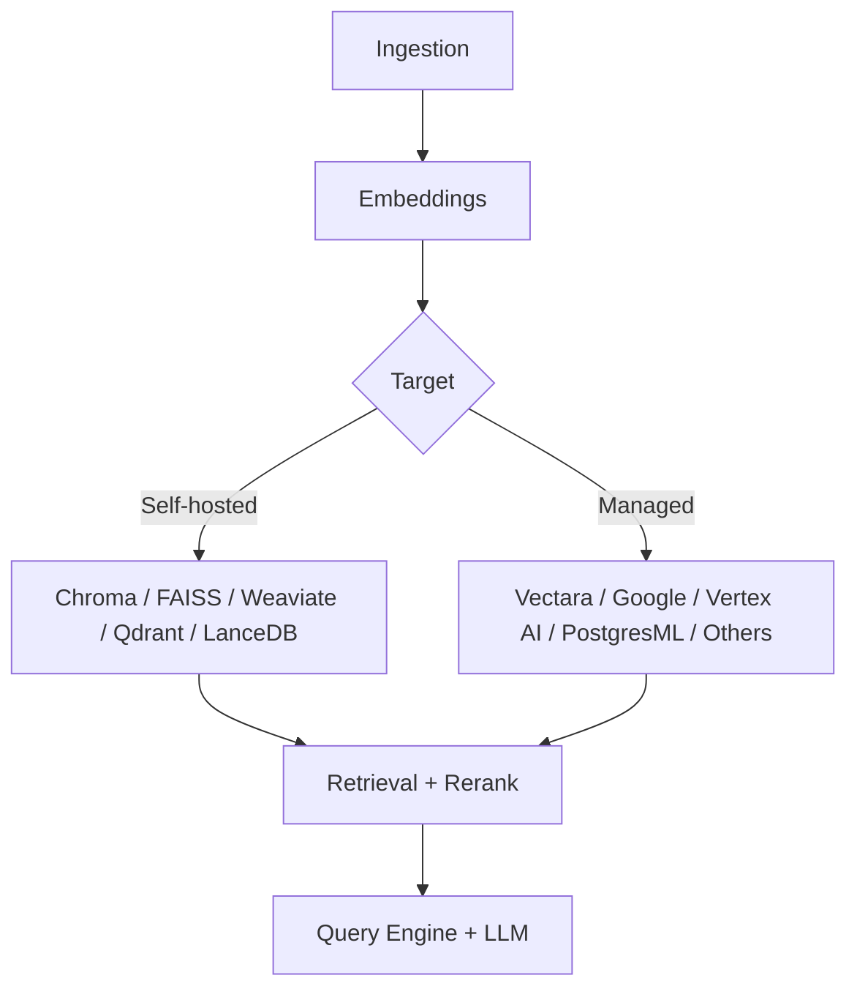

**Diagram sources**
- [docs/examples/vector_stores/LanceDBDemo.ipynb](file://docs/examples/vector_stores/LanceDBDemo.ipynb#L1-L200)
- [docs/examples/managed/managed_lancedb_demo.ipynb](file://docs/examples/managed/managed_lancedb_demo.ipynb#L1-L200)
- [docs/examples/managed/managed_vectara_demo.ipynb](file://docs/examples/managed/managed_vectara_demo.ipynb#L1-L200)
- [docs/examples/managed/managed_google_demo.ipynb](file://docs/examples/managed/managed_google_demo.ipynb#L1-L200)
- [docs/examples/managed/managed_vertexai_demo.ipynb](file://docs/examples/managed/managed_vertexai_demo.ipynb#L1-L200)
- [docs/examples/managed/managed_postgresml_demo.ipynb](file://docs/examples/managed/managed_postgresml_demo.ipynb#L1-L200)
- [docs/examples/managed/managed_bge_m3_demo.ipynb](file://docs/examples/managed/managed_bge_m3_demo.ipynb#L1-L200)
- [docs/examples/managed/managed_colbert_demo.ipynb](file://docs/examples/managed/managed_colbert_demo.ipynb#L1-L200)
- [docs/examples/managed/managed_dashscope_demo.ipynb](file://docs/examples/managed/managed_dashscope_demo.ipynb#L1-L200)
- [docs/examples/managed/managed_llama_cloud_demo.ipynb](file://docs/examples/managed/managed_llama_cloud_demo.ipynb#L1-L200)

**Section sources**
- [docs/examples/vector_stores/LanceDBDemo.ipynb](file://docs/examples/vector_stores/LanceDBDemo.ipynb#L1-L200)
- [docs/examples/managed/managed_lancedb_demo.ipynb](file://docs/examples/managed/managed_lancedb_demo.ipynb#L1-L200)
- [docs/examples/managed/managed_vectara_demo.ipynb](file://docs/examples/managed/managed_vectara_demo.ipynb#L1-L200)
- [docs/examples/managed/managed_google_demo.ipynb](file://docs/examples/managed/managed_google_demo.ipynb#L1-L200)
- [docs/examples/managed/managed_vertexai_demo.ipynb](file://docs/examples/managed/managed_vertexai_demo.ipynb#L1-L200)
- [docs/examples/managed/managed_postgresml_demo.ipynb](file://docs/examples/managed/managed_postgresml_demo.ipynb#L1-L200)
- [docs/examples/managed/managed_bge_m3_demo.ipynb](file://docs/examples/managed/managed_bge_m3_demo.ipynb#L1-L200)
- [docs/examples/managed/managed_colbert_demo.ipynb](file://docs/examples/managed/managed_colbert_demo.ipynb#L1-L200)
- [docs/examples/managed/managed_dashscope_demo.ipynb](file://docs/examples/managed/managed_dashscope_demo.ipynb#L1-L200)
- [docs/examples/managed/managed_llama_cloud_demo.ipynb](file://docs/examples/managed/managed_llama_cloud_demo.ipynb#L1-L200)

### Retrievers and Rerankers
- BM25 retriever for keyword-based retrieval
- Contextual retrieval and fusion retrievers
- Multiple rerankers (Cohere, Colbert, RankGPT, etc.)

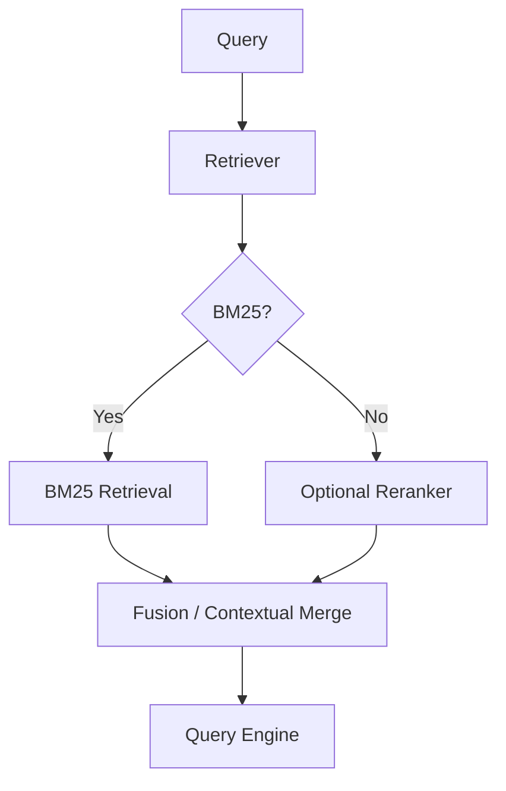

**Diagram sources**
- [docs/examples/retrievers/bm25_retriever_demo.ipynb](file://docs/examples/retrievers/bm25_retriever_demo.ipynb#L1-L200)
- [docs/examples/node_postprocessor/contextual_retrieval_demo.ipynb](file://docs/examples/node_postprocessor/contextual_retrieval_demo.ipynb#L1-L200)

**Section sources**
- [docs/examples/retrievers/bm25_retriever_demo.ipynb](file://docs/examples/retrievers/bm25_retriever_demo.ipynb#L1-L200)
- [docs/examples/node_postprocessor/contextual_retrieval_demo.ipynb](file://docs/examples/node_postprocessor/contextual_retrieval_demo.ipynb#L1-L200)

### Observability and Monitoring
- Langfuse, OpenInference, WandB, OpenTelemetry
- Callback integrations capture traces, metrics, and logs

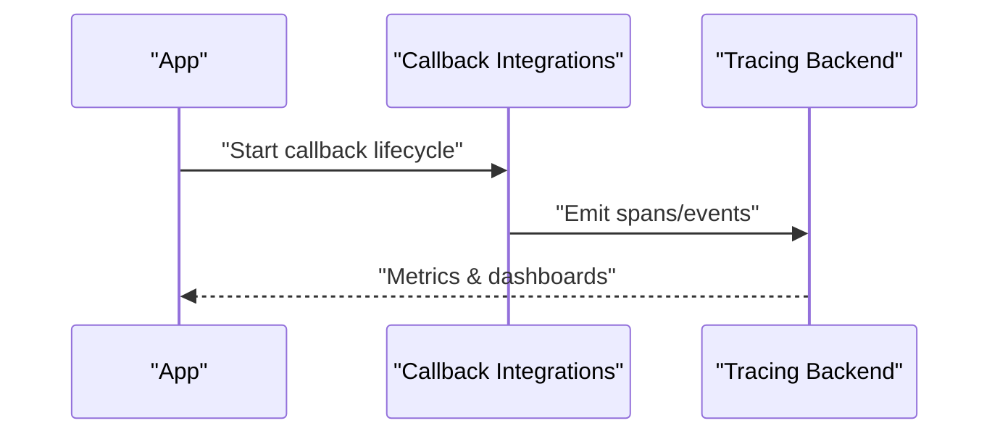

**Diagram sources**
- [docs/examples/observability/langfuse_demo.ipynb](file://docs/examples/observability/langfuse_demo.ipynb#L1-L200)
- [docs/examples/observability/openinference_demo.ipynb](file://docs/examples/observability/openinference_demo.ipynb#L1-L200)
- [docs/examples/observability/wandb_demo.ipynb](file://docs/examples/observability/wandb_demo.ipynb#L1-L200)
- [docs/examples/observability/otel_demo.ipynb](file://docs/examples/observability/otel_demo.ipynb#L1-L200)

**Section sources**
- [docs/examples/observability/langfuse_demo.ipynb](file://docs/examples/observability/langfuse_demo.ipynb#L1-L200)
- [docs/examples/observability/openinference_demo.ipynb](file://docs/examples/observability/openinference_demo.ipynb#L1-L200)
- [docs/examples/observability/wandb_demo.ipynb](file://docs/examples/observability/wandb_demo.ipynb#L1-L200)
- [docs/examples/observability/otel_demo.ipynb](file://docs/examples/observability/otel_demo.ipynb#L1-L200)

### Ingestion Pipelines and Workflows
- Ray-based ingestion for distributed processing
- Complex workflows with callbacks and stateful steps

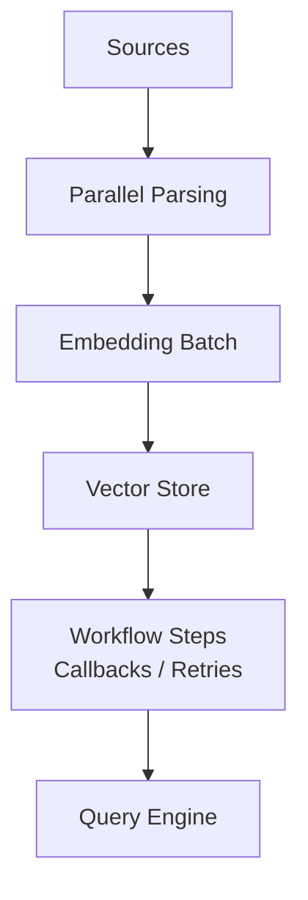

**Diagram sources**
- [docs/examples/ingestion/ingestion_pipeline_with_ray.ipynb](file://docs/examples/ingestion/ingestion_pipeline_with_ray.ipynb#L1-L200)
- [docs/examples/workflow/complex_workflow_with_callbacks.ipynb](file://docs/examples/workflow/complex_workflow_with_callbacks.ipynb#L1-L200)

**Section sources**
- [docs/examples/ingestion/ingestion_pipeline_with_ray.ipynb](file://docs/examples/ingestion/ingestion_pipeline_with_ray.ipynb#L1-L200)
- [docs/examples/workflow/complex_workflow_with_callbacks.ipynb](file://docs/examples/workflow/complex_workflow_with_callbacks.ipynb#L1-L200)

### Tools and Agent Integrations
- Toolhouse integration for tool-enabled agents
- Multi-agent workflows with retrieval and external query agents

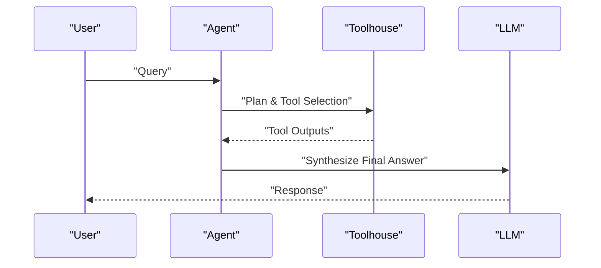

**Diagram sources**
- [docs/examples/tools/toolhouse_llamaindex.ipynb](file://docs/examples/tools/toolhouse_llamaindex.ipynb#L1-L200)
- [docs/examples/llm/multi_agent_workflow_with_weaviate_queryagent.ipynb](file://docs/examples/llm/multi_agent_workflow_with_weaviate_queryagent.ipynb#L1-L200)

**Section sources**
- [docs/examples/tools/toolhouse_llamaindex.ipynb](file://docs/examples/tools/toolhouse_llamaindex.ipynb#L1-L200)
- [docs/examples/llm/multi_agent_workflow_with_weaviate_queryagent.ipynb](file://docs/examples/llm/multi_agent_workflow_with_weaviate_queryagent.ipynb#L1-L200)

### Streaming Responses and Customization
- Streaming response demo for real-time user experience
- Custom prompts and streaming integrations

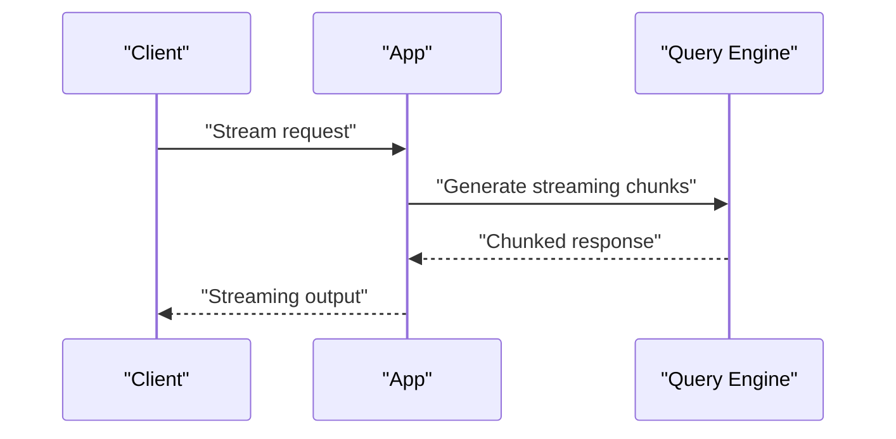

**Diagram sources**
- [docs/examples/customization/streaming/streaming_response_demo.ipynb](file://docs/examples/customization/streaming/streaming_response_demo.ipynb#L1-L200)

**Section sources**
- [docs/examples/customization/streaming/streaming_response_demo.ipynb](file://docs/examples/customization/streaming/streaming_response_demo.ipynb#L1-L200)

### Storage Backends: Relational, NoSQL, and Cloud KV Stores
- AlloyDB, CloudSQL PG, MongoDB, Redis, DynamoDB, Firestore, Tablestore, Azure
- Docstore, IndexStore, KVStore patterns

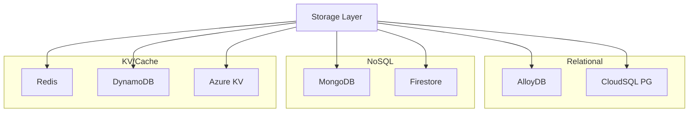

**Diagram sources**
- [docs/examples/storage/kvstore/AlloyDBKVStoreDemo.ipynb](file://docs/examples/storage/kvstore/AlloyDBKVStoreDemo.ipynb#L1-L200)
- [docs/examples/storage/kvstore/CloudSQLPgKVStoreDemo.ipynb](file://docs/examples/storage/kvstore/CloudSQLPgKVStoreDemo.ipynb#L1-L200)
- [docs/examples/storage/kvstore/MongoKVStoreDemo.ipynb](file://docs/examples/storage/kvstore/MongoKVStoreDemo.ipynb#L1-L200)
- [docs/examples/storage/kvstore/RedisKVStoreDemo.ipynb](file://docs/examples/storage/kvstore/RedisKVStoreDemo.ipynb#L1-L200)
- [docs/examples/storage/kvstore/DynamoDBKVStoreDemo.ipynb](file://docs/examples/storage/kvstore/DynamoDBKVStoreDemo.ipynb#L1-L200)
- [docs/examples/storage/kvstore/FirestoreKVStoreDemo.ipynb](file://docs/examples/storage/kvstore/FirestoreKVStoreDemo.ipynb#L1-L200)
- [docs/examples/storage/kvstore/TablestoreKVStoreDemo.ipynb](file://docs/examples/storage/kvstore/TablestoreKVStoreDemo.ipynb#L1-L200)
- [docs/examples/storage/kvstore/AzureKVStoreDemo.ipynb](file://docs/examples/storage/kvstore/AzureKVStoreDemo.ipynb#L1-L200)

**Section sources**
- [docs/examples/storage/kvstore/AlloyDBKVStoreDemo.ipynb](file://docs/examples/storage/kvstore/AlloyDBKVStoreDemo.ipynb#L1-L200)
- [docs/examples/storage/kvstore/CloudSQLPgKVStoreDemo.ipynb](file://docs/examples/storage/kvstore/CloudSQLPgKVStoreDemo.ipynb#L1-L200)
- [docs/examples/storage/kvstore/MongoKVStoreDemo.ipynb](file://docs/examples/storage/kvstore/MongoKVStoreDemo.ipynb#L1-L200)
- [docs/examples/storage/kvstore/RedisKVStoreDemo.ipynb](file://docs/examples/storage/kvstore/RedisKVStoreDemo.ipynb#L1-L200)
- [docs/examples/storage/kvstore/DynamoDBKVStoreDemo.ipynb](file://docs/examples/storage/kvstore/DynamoDBKVStoreDemo.ipynb#L1-L200)
- [docs/examples/storage/kvstore/FirestoreKVStoreDemo.ipynb](file://docs/examples/storage/kvstore/FirestoreKVStoreDemo.ipynb#L1-L200)
- [docs/examples/storage/kvstore/TablestoreKVStoreDemo.ipynb](file://docs/examples/storage/kvstore/TablestoreKVStoreDemo.ipynb#L1-L200)
- [docs/examples/storage/kvstore/AzureKVStoreDemo.ipynb](file://docs/examples/storage/kvstore/AzureKVStoreDemo.ipynb#L1-L200)

## Dependency Analysis
The integration examples demonstrate loose coupling between components:
- Data connectors depend on LlamaIndex readers and parsers
- Vector stores are interchangeable via adapter patterns
- Retrievers and rerankers are pluggable
- Observability is achieved through callback integrations
- Storage backends are abstracted behind store interfaces

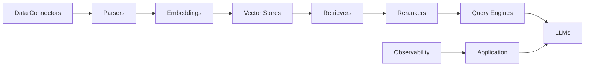

**Diagram sources**
- [docs/examples/data_connectors/ChromaDemo.ipynb](file://docs/examples/data_connectors/ChromaDemo.ipynb#L1-L188)
- [docs/examples/vector_stores/LanceDBDemo.ipynb](file://docs/examples/vector_stores/LanceDBDemo.ipynb#L1-L200)
- [docs/examples/observability/langfuse_demo.ipynb](file://docs/examples/observability/langfuse_demo.ipynb#L1-L200)

**Section sources**
- [docs/examples/data_connectors/ChromaDemo.ipynb](file://docs/examples/data_connectors/ChromaDemo.ipynb#L1-L188)
- [docs/examples/vector_stores/LanceDBDemo.ipynb](file://docs/examples/vector_stores/LanceDBDemo.ipynb#L1-L200)
- [docs/examples/observability/langfuse_demo.ipynb](file://docs/examples/observability/langfuse_demo.ipynb#L1-L200)

## Performance Considerations
- Use managed vector stores for horizontal scaling and reduced operational overhead
- Apply BM25 + semantic fusion to balance recall and precision
- Enable streaming responses for latency-sensitive UX
- Use Ray-based ingestion for parallel processing and fault tolerance
- Monitor token usage and throughput via observability integrations

[No sources needed since this section provides general guidance]

## Troubleshooting Guide
Common issues and remedies:
- Authentication failures: ensure API keys and tokens are configured for connectors and managed services
- Rate limiting: implement retry/backoff and queueing for external APIs
- Memory/CPU spikes during ingestion: shard workloads and use Ray; adjust batch sizes
- Vector store connectivity: verify network access and credentials for managed providers
- Observability gaps: confirm callback integrations are initialized and emitting spans

**Section sources**
- [docs/examples/observability/langfuse_demo.ipynb](file://docs/examples/observability/langfuse_demo.ipynb#L1-L200)
- [docs/examples/ingestion/ingestion_pipeline_with_ray.ipynb](file://docs/examples/ingestion/ingestion_pipeline_with_ray.ipynb#L1-L200)

## Conclusion
The repository provides a comprehensive catalog of integration patterns that combine LlamaIndex with external data sources, vector stores, retrieval strategies, observability, and storage backends. By following the documented examples and applying the recommended practices for authentication, rate limiting, error handling, and monitoring, teams can build robust, scalable RAG systems tailored to their infrastructure and compliance needs.

[No sources needed since this section summarizes without analyzing specific files]

## Appendices
- CI/CD and testing strategies: adopt notebook-driven tests for reproducibility; use Ray for distributed testing; instrument with OpenTelemetry and Langfuse for observability during CI runs

[No sources needed since this section provides general guidance]