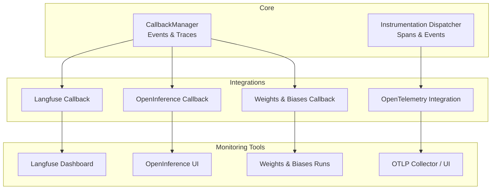
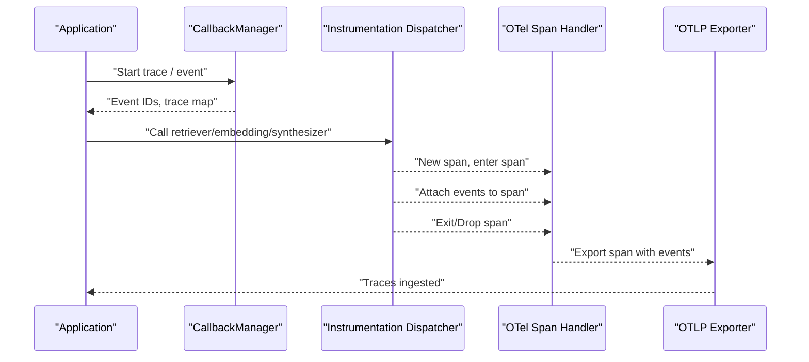
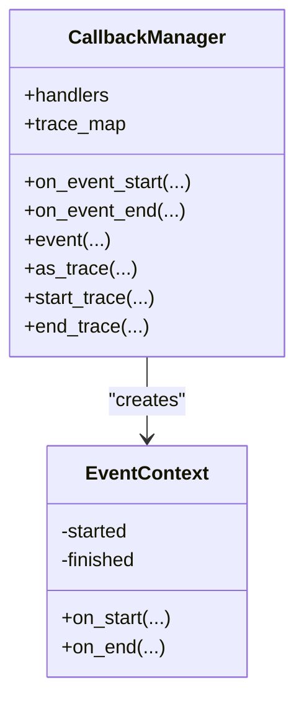
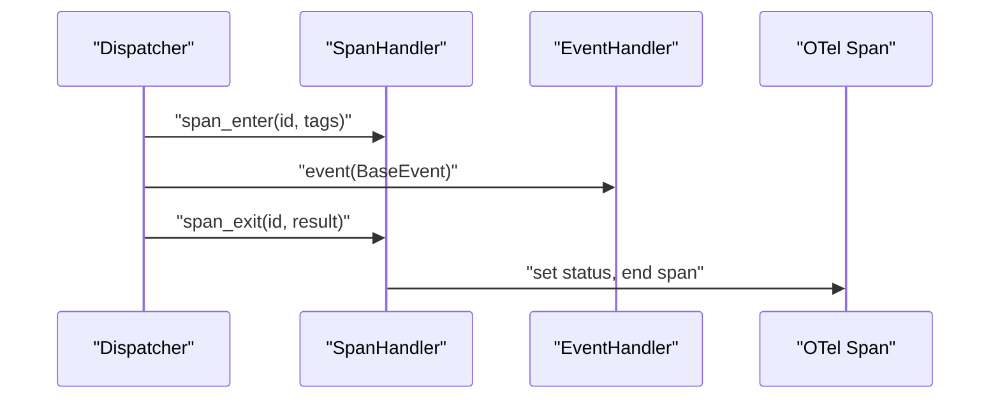
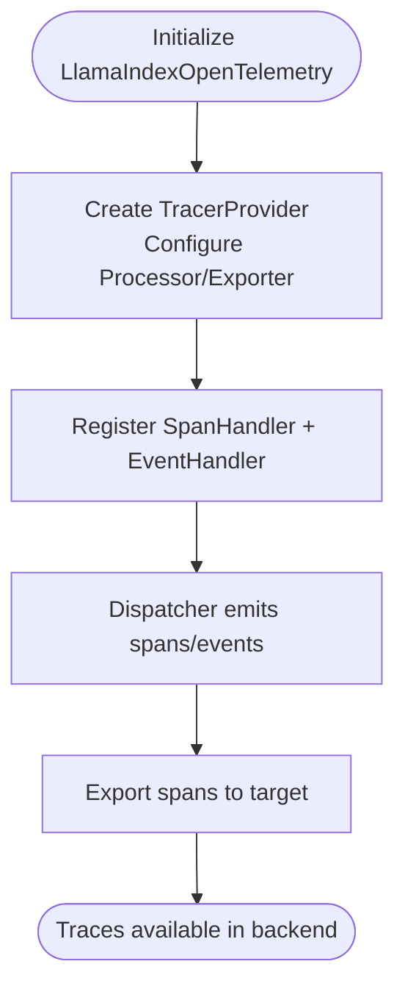
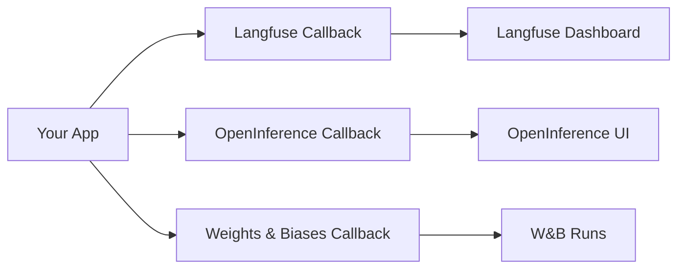
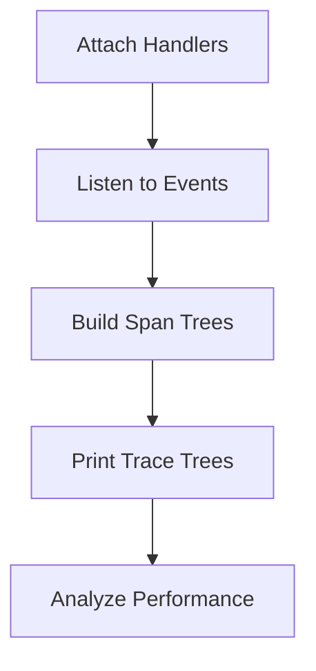
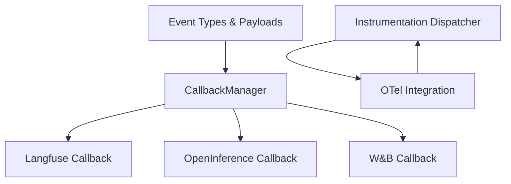

# Observability Integration

<cite>
**Referenced Files in This Document**
- [base.py](file://llama-index-core/llama_index/core/callbacks/base.py)
- [schema.py](file://llama-index-core/llama_index/core/callbacks/schema.py)
- [dispatcher.py](file://llama-index-instrumentation/src/llama_index_instrumentation/dispatcher.py)
- [base.py](file://llama-index-integrations/observability/llama-index-observability-otel/llama_index/observability/otel/base.py)
- [README.md](file://llama-index-integrations/observability/llama-index-observability-otel/README.md)
- [__init__.py](file://llama-index-integrations/callbacks/llama-index-callbacks-langfuse/llama_index/callbacks/langfuse/__init__.py)
- [__init__.py](file://llama-index-integrations/callbacks/llama-index-callbacks-openinference/llama_index/callbacks/openinference/__init__.py)
- [__init__.py](file://llama-index-integrations/callbacks/llama-index-callbacks-wandb/llama_index/callbacks/wandb/__init__.py)
- [instrumentation_observability_rundown.ipynb](file://docs/examples/instrumentation/instrumentation_observability_rundown.ipynb)
</cite>

## Table of Contents
1. [Introduction](#introduction)
2. [Project Structure](#project-structure)
3. [Core Components](#core-components)
4. [Architecture Overview](#architecture-overview)
5. [Detailed Component Analysis](#detailed-component-analysis)
6. [Dependency Analysis](#dependency-analysis)
7. [Performance Considerations](#performance-considerations)
8. [Troubleshooting Guide](#troubleshooting-guide)
9. [Conclusion](#conclusion)
10. [Appendices](#appendices)

## Introduction
This document explains observability integration patterns in LlamaIndex applications. It covers how to integrate with monitoring tools (Langfuse, OpenInference, MLflow, Weights & Biases, and others), how to use the built-in instrumentation and callback systems, and how to collect telemetry, trace distributed workloads, and build dashboards. It also provides guidance on debugging workflows, alerting, privacy considerations, and production-grade monitoring setups.

## Project Structure
LlamaIndex provides:
- A callback system for event-driven telemetry and tracing
- An instrumentation subsystem that emits spans and events around core operations
- Official integrations for observability platforms via dedicated packages
- Example notebooks demonstrating how to consume and visualize these signals

**Diagram sources**
- [base.py](file://llama-index-core/llama_index/core/callbacks/base.py#L28-L303)
- [dispatcher.py](file://llama-index-instrumentation/src/llama_index_instrumentation/dispatcher.py#L48-L426)
- [base.py](file://llama-index-integrations/observability/llama-index-observability-otel/llama_index/observability/otel/base.py#L44-L269)
- [__init__.py](file://llama-index-integrations/callbacks/llama-index-callbacks-langfuse/llama_index/callbacks/langfuse/__init__.py#L1-L4)
- [__init__.py](file://llama-index-integrations/callbacks/llama-index-callbacks-openinference/llama_index/callbacks/openinference/__init__.py#L1-L4)
- [__init__.py](file://llama-index-integrations/callbacks/llama-index-callbacks-wandb/llama_index/callbacks/wandb/__init__.py#L1-L4)

**Section sources**
- [base.py](file://llama-index-core/llama_index/core/callbacks/base.py#L28-L303)
- [dispatcher.py](file://llama-index-instrumentation/src/llama_index_instrumentation/dispatcher.py#L48-L426)
- [base.py](file://llama-index-integrations/observability/llama-index-observability-otel/llama_index/observability/otel/base.py#L44-L269)
- [__init__.py](file://llama-index-integrations/callbacks/llama-index-callbacks-langfuse/llama_index/callbacks/langfuse/__init__.py#L1-L4)
- [__init__.py](file://llama-index-integrations/callbacks/llama-index-callbacks-openinference/llama_index/callbacks/openinference/__init__.py#L1-L4)
- [__init__.py](file://llama-index-integrations/callbacks/llama-index-callbacks-wandb/llama_index/callbacks/wandb/__init__.py#L1-L4)

## Core Components
- CallbackManager: Central event bus that tracks hierarchical traces, fires start/end hooks, and supports per-event payloads and exception capture.
- Event schema: Defines event types and payloads (e.g., LLM, embedding, retrieval, synthesis) enabling consistent telemetry across modules.
- Instrumentation Dispatcher: Emits spans for function calls and events, with support for async and threaded contexts, and integrates with external tracing systems.
- OpenTelemetry integration: Bridges LlamaIndex spans/events to OpenTelemetry tracers and exporters for centralized observability.
- Platform-specific callbacks: Ready-to-use callback handlers for Langfuse, OpenInference, and Weights & Biases.

Key capabilities:
- Distributed tracing across queries, retrievals, embeddings, reranking, synthesis, and LLM calls
- Structured payloads for debugging and analytics
- Async-safe span lifecycle management
- Extensible handler model for custom observability backends

**Section sources**
- [base.py](file://llama-index-core/llama_index/core/callbacks/base.py#L28-L303)
- [schema.py](file://llama-index-core/llama_index/core/callbacks/schema.py#L16-L102)
- [dispatcher.py](file://llama-index-instrumentation/src/llama_index_instrumentation/dispatcher.py#L48-L426)
- [base.py](file://llama-index-integrations/observability/llama-index-observability-otel/llama_index/observability/otel/base.py#L44-L269)

## Architecture Overview
The observability architecture combines two complementary subsystems:
- Callback-based telemetry for high-level orchestration events
- Instrumentation-based tracing for granular operation spans

**Diagram sources**
- [base.py](file://llama-index-core/llama_index/core/callbacks/base.py#L88-L143)
- [dispatcher.py](file://llama-index-instrumentation/src/llama_index_instrumentation/dispatcher.py#L181-L263)
- [base.py](file://llama-index-integrations/observability/llama-index-observability-otel/llama_index/observability/otel/base.py#L83-L160)

## Detailed Component Analysis

### Callback System
The callback system enables:
- Hierarchical tracing with parent-child relationships
- Event payloads for debugging and analytics
- Exception capture and propagation
- Context-aware trace stacks

**Diagram sources**
- [base.py](file://llama-index-core/llama_index/core/callbacks/base.py#L28-L303)

**Section sources**
- [base.py](file://llama-index-core/llama_index/core/callbacks/base.py#L28-L303)
- [schema.py](file://llama-index-core/llama_index/core/callbacks/schema.py#L16-L102)

### Instrumentation Dispatcher
The dispatcher:
- Wraps functions with spans and tags
- Manages active span context across sync and async boundaries
- Emits span enter/exit/drop events and forwards events to handlers
- Integrates with OpenTelemetry via compatible span/event handlers

**Diagram sources**
- [dispatcher.py](file://llama-index-instrumentation/src/llama_index_instrumentation/dispatcher.py#L181-L263)
- [base.py](file://llama-index-integrations/observability/llama-index-observability-otel/llama_index/observability/otel/base.py#L83-L160)

**Section sources**
- [dispatcher.py](file://llama-index-instrumentation/src/llama_index_instrumentation/dispatcher.py#L48-L426)
- [base.py](file://llama-index-integrations/observability/llama-index-observability-otel/llama_index/observability/otel/base.py#L44-L269)

### OpenTelemetry Integration
The OpenTelemetry integration:
- Provides OTel-compatible span and event handlers
- Starts a tracer provider and registers handlers with the dispatcher
- Attaches captured events to spans and sets status codes

**Diagram sources**
- [base.py](file://llama-index-integrations/observability/llama-index-observability-otel/llama_index/observability/otel/base.py#L209-L269)
- [README.md](file://llama-index-integrations/observability/llama-index-observability-otel/README.md#L9-L76)

**Section sources**
- [base.py](file://llama-index-integrations/observability/llama-index-observability-otel/llama_index/observability/otel/base.py#L209-L269)
- [README.md](file://llama-index-integrations/observability/llama-index-observability-otel/README.md#L9-L76)

### Platform-Specific Callbacks
- Langfuse: Exposes a callback handler for capturing query sessions, steps, and generations.
- OpenInference: Provides a callback handler for standardized LLM observability.
- Weights & Biases: Offers a callback handler for experiment tracking and metrics.

**Diagram sources**
- [__init__.py](file://llama-index-integrations/callbacks/llama-index-callbacks-langfuse/llama_index/callbacks/langfuse/__init__.py#L1-L4)
- [__init__.py](file://llama-index-integrations/callbacks/llama-index-callbacks-openinference/llama_index/callbacks/openinference/__init__.py#L1-L4)
- [__init__.py](file://llama-index-integrations/callbacks/llama-index-callbacks-wandb/llama_index/callbacks/wandb/__init__.py#L1-L4)

**Section sources**
- [__init__.py](file://llama-index-integrations/callbacks/llama-index-callbacks-langfuse/llama_index/callbacks/langfuse/__init__.py#L1-L4)
- [__init__.py](file://llama-index-integrations/callbacks/llama-index-callbacks-openinference/llama_index/callbacks/openinference/__init__.py#L1-L4)
- [__init__.py](file://llama-index-integrations/callbacks/llama-index-callbacks-wandb/llama_index/callbacks/wandb/__init__.py#L1-L4)

### Debugging and Visualization Examples
The example notebook demonstrates:
- How to subscribe to events and spans
- How to reconstruct trace trees per span
- How to print timing and hierarchy of spans

**Diagram sources**
- [instrumentation_observability_rundown.ipynb](file://docs/examples/instrumentation/instrumentation_observability_rundown.ipynb#L370-L636)

**Section sources**
- [instrumentation_observability_rundown.ipynb](file://docs/examples/instrumentation/instrumentation_observability_rundown.ipynb#L370-L636)

## Dependency Analysis
- CallbackManager depends on event schema enums and payloads
- Instrumentation Dispatcher depends on span handlers and event handlers
- OpenTelemetry integration depends on dispatcher and OTel SDK
- Platform callbacks depend on the callback manager and platform SDKs

**Diagram sources**
- [schema.py](file://llama-index-core/llama_index/core/callbacks/schema.py#L16-L102)
- [base.py](file://llama-index-core/llama_index/core/callbacks/base.py#L28-L303)
- [dispatcher.py](file://llama-index-instrumentation/src/llama_index_instrumentation/dispatcher.py#L48-L426)
- [base.py](file://llama-index-integrations/observability/llama-index-observability-otel/llama_index/observability/otel/base.py#L44-L269)
- [__init__.py](file://llama-index-integrations/callbacks/llama-index-callbacks-langfuse/llama_index/callbacks/langfuse/__init__.py#L1-L4)
- [__init__.py](file://llama-index-integrations/callbacks/llama-index-callbacks-openinference/llama_index/callbacks/openinference/__init__.py#L1-L4)
- [__init__.py](file://llama-index-integrations/callbacks/llama-index-callbacks-wandb/llama_index/callbacks/wandb/__init__.py#L1-L4)

**Section sources**
- [schema.py](file://llama-index-core/llama_index/core/callbacks/schema.py#L16-L102)
- [base.py](file://llama-index-core/llama_index/core/callbacks/base.py#L28-L303)
- [dispatcher.py](file://llama-index-instrumentation/src/llama_index_instrumentation/dispatcher.py#L48-L426)
- [base.py](file://llama-index-integrations/observability/llama-index-observability-otel/llama_index/observability/otel/base.py#L44-L269)
- [__init__.py](file://llama-index-integrations/callbacks/llama-index-callbacks-langfuse/llama_index/callbacks/langfuse/__init__.py#L1-L4)
- [__init__.py](file://llama-index-integrations/callbacks/llama-index-callbacks-openinference/llama_index/callbacks/openinference/__init__.py#L1-L4)
- [__init__.py](file://llama-index-integrations/callbacks/llama-index-callbacks-wandb/llama_index/callbacks/wandb/__init__.py#L1-L4)

## Performance Considerations
- Prefer batch processors for OTel in production to reduce overhead
- Limit high-cardinality attributes in spans and events
- Use sampling strategies for high-throughput environments
- Avoid heavy serialization in hot paths; filter and truncate payloads
- Instrument selectively during profiling; disable debug modes in production

[No sources needed since this section provides general guidance]

## Troubleshooting Guide
Common issues and resolutions:
- No spans exported: Verify tracer provider initialization and exporter configuration
- Events not attached to spans: Ensure active span context exists when emitting events
- Duplicate or missing handlers: Use the manager’s handler list carefully to avoid duplicates
- Async span mismatch: Confirm async span lifecycle hooks are invoked properly

**Section sources**
- [base.py](file://llama-index-integrations/observability/llama-index-observability-otel/llama_index/observability/otel/base.py#L209-L269)
- [dispatcher.py](file://llama-index-instrumentation/src/llama_index_instrumentation/dispatcher.py#L181-L263)

## Conclusion
LlamaIndex offers a robust observability foundation through its callback and instrumentation systems, plus official integrations for popular platforms. By combining structured events, distributed tracing, and platform-specific callbacks, teams can build comprehensive monitoring, debugging, and analytics workflows tailored to production needs.

[No sources needed since this section summarizes without analyzing specific files]

## Appendices

### Production Monitoring Setup Checklist
- Initialize OpenTelemetry with appropriate exporter and processor
- Register OTel-compatible span and event handlers
- Add platform-specific callbacks (Langfuse/OpenInference/W&B) as needed
- Configure sampling and resource attributes
- Build dashboards and alerts based on event payloads and span timings
- Enable privacy controls (mask PII, limit attributes)

**Section sources**
- [README.md](file://llama-index-integrations/observability/llama-index-observability-otel/README.md#L9-L76)
- [base.py](file://llama-index-integrations/observability/llama-index-observability-otel/llama_index/observability/otel/base.py#L209-L269)

### Example Workflows
- Distributed tracing of a query pipeline: spans for retrieval, embedding, reranking, synthesis, and LLM calls
- Debugging a failing query: capture exceptions and payloads in events and spans
- Benchmarking performance: measure span durations and aggregate metrics per operation type

**Section sources**
- [instrumentation_observability_rundown.ipynb](file://docs/examples/instrumentation/instrumentation_observability_rundown.ipynb#L370-L636)