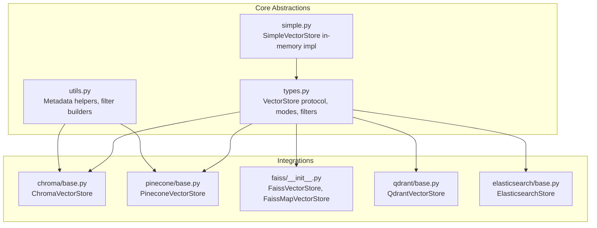
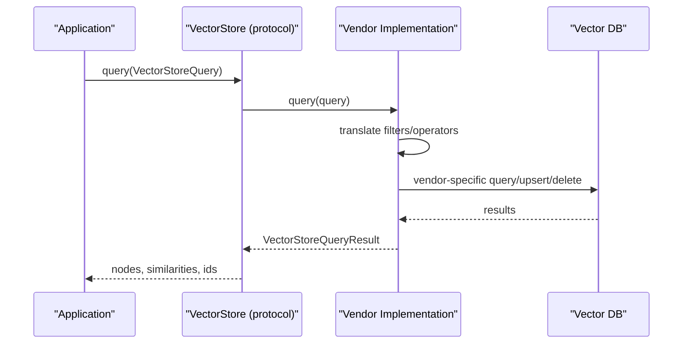
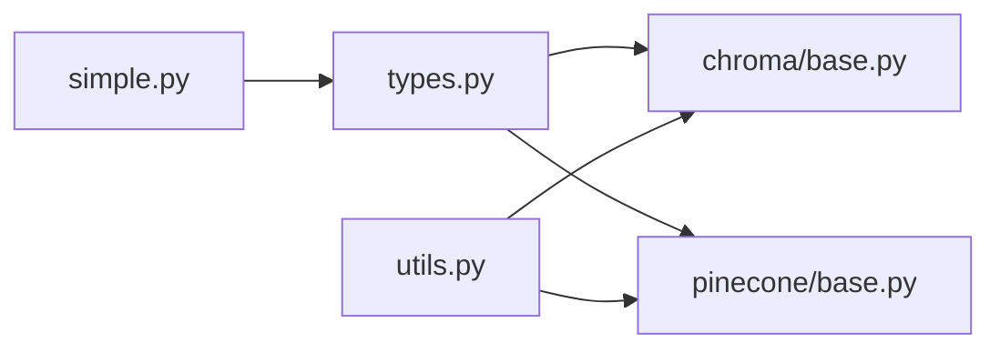

# Vector Stores Integration

<cite>
**Referenced Files in This Document**
- [types.py](file://llama-index-core/llama_index/core/vector_stores/types.py)
- [utils.py](file://llama-index-core/llama_index/core/vector_stores/utils.py)
- [simple.py](file://llama-index-core/llama_index/core/vector_stores/simple.py)
- [base.py](file://llama-index-integrations/vector_stores/llama-index-vector-stores-chroma/llama_index/vector_stores/chroma/base.py)
- [base.py](file://llama-index-integrations/vector_stores/llama-index-vector-stores-pinecone/llama_index/vector_stores/pinecone/base.py)
- [faiss/__init__.py](file://llama-index-integrations/vector_stores/llama-index-vector-stores-faiss/llama_index/vector_stores/faiss/__init__.py)
- [base.py](file://llama-index-integrations/vector_stores/llama-index-vector-stores-qdrant/llama_index/vector_stores/qdrant/base.py)
- [base.py](file://llama-index-integrations/vector_stores/llama-index-vector-stores-elasticsearch/llama_index/vector_stores/elasticsearch/base.py)
- [__init__.py](file://llama-index-core/llama_index/core/vector_stores/__init__.py)
</cite>

## Table of Contents
1. [Introduction](#introduction)
2. [Project Structure](#project-structure)
3. [Core Components](#core-components)
4. [Architecture Overview](#architecture-overview)
5. [Detailed Component Analysis](#detailed-component-analysis)
6. [Dependency Analysis](#dependency-analysis)
7. [Performance Considerations](#performance-considerations)
8. [Troubleshooting Guide](#troubleshooting-guide)
9. [Conclusion](#conclusion)
10. [Appendices](#appendices)

## Introduction
This document provides comprehensive guidance for integrating vector stores in production systems using the LlamaIndex framework. It covers the unified vector store abstraction, metadata filtering, hybrid search, and practical integration patterns with major vector databases: Chroma, Pinecone, Weaviate, FAISS, Qdrant, and Elasticsearch. It also includes best practices for index creation, embedding storage, similarity search configuration, performance optimization, distributed deployments, scaling, backups, and operational monitoring.

## Project Structure
The vector store ecosystem is organized around:
- A core abstraction and shared types that define the contract for all vector stores
- Utilities for metadata handling and filter translation
- A simple in-memory vector store for development and testing
- Integrations for external vector databases, each implementing the core protocol

**Diagram sources**
- [types.py](file://llama-index-core/llama_index/core/vector_stores/types.py#L268-L439)
- [utils.py](file://llama-index-core/llama_index/core/vector_stores/utils.py#L1-L235)
- [simple.py](file://llama-index-core/llama_index/core/vector_stores/simple.py#L64-L355)
- [base.py](file://llama-index-integrations/vector_stores/llama-index-vector-stores-chroma/llama_index/vector_stores/chroma/base.py#L120-L709)
- [base.py](file://llama-index-integrations/vector_stores/llama-index-vector-stores-pinecone/llama_index/vector_stores/pinecone/base.py#L114-L552)
- [faiss/__init__.py](file://llama-index-integrations/vector_stores/llama-index-vector-stores-faiss/llama_index/vector_stores/faiss/__init__.py#L1-L5)
- [base.py](file://llama-index-integrations/vector_stores/llama-index-vector-stores-qdrant/llama_index/vector_stores/qdrant/base.py)
- [base.py](file://llama-index-integrations/vector_stores/llama-index-vector-stores-elasticsearch/llama_index/vector_stores/elasticsearch/base.py#L1-L17)

**Section sources**
- [__init__.py](file://llama-index-core/llama_index/core/vector_stores/__init__.py#L1-L28)
- [types.py](file://llama-index-core/llama_index/core/vector_stores/types.py#L1-L439)
- [utils.py](file://llama-index-core/llama_index/core/vector_stores/utils.py#L1-L235)
- [simple.py](file://llama-index-core/llama_index/core/vector_stores/simple.py#L1-L355)

## Core Components
- VectorStore protocol: Defines the standard interface for adding, deleting, querying, and persisting nodes and embeddings.
- VectorStoreQuery and modes: Encapsulates query intent including semantic, sparse, hybrid, text search, and MMR.
- MetadataFilters and operators: Provides a rich filter DSL for metadata-driven retrieval.
- Utilities: Node-to-metadata conversion, metadata filter function builder, and legacy compatibility helpers.

Key capabilities:
- Embedding storage and retrieval
- Metadata filtering with logical conditions
- Hybrid search (dense + sparse) and MMR
- Asynchronous operations where supported
- Persistence and namespacing for local stores

**Section sources**
- [types.py](file://llama-index-core/llama_index/core/vector_stores/types.py#L240-L439)
- [utils.py](file://llama-index-core/llama_index/core/vector_stores/utils.py#L40-L176)
- [simple.py](file://llama-index-core/llama_index/core/vector_stores/simple.py#L64-L355)

## Architecture Overview
The unified architecture separates concerns:
- Application code interacts with the VectorStore protocol
- Integrations translate queries and filters to vendor-specific APIs
- Utilities normalize metadata and node persistence across stores

**Diagram sources**
- [types.py](file://llama-index-core/llama_index/core/vector_stores/types.py#L268-L439)
- [base.py](file://llama-index-integrations/vector_stores/llama-index-vector-stores-chroma/llama_index/vector_stores/chroma/base.py#L371-L425)
- [base.py](file://llama-index-integrations/vector_stores/llama-index-vector-stores-pinecone/llama_index/vector_stores/pinecone/base.py#L451-L552)

## Detailed Component Analysis

### Unified Vector Store Abstraction
- Protocol and Pydantic base define the contract for add/query/delete and async variants.
- Query modes include DEFAULT, SPARSE, HYBRID, TEXT_SEARCH, SEMANTIC_HYBRID, SVM, logistic regression, linear regression, and MMR.
- Filters support equality, comparison, membership, containment, text match, and emptiness checks, combined with AND/OR/NOT.

Best practices:
- Prefer MetadataFilters for rich filtering; avoid mixing generic filters with vendor-specific where/filter kwargs.
- Use VectorStoreQueryMode.MMR for diverse results; tune mmr_threshold and prefetch factors.
- For hybrid search, configure alpha to balance dense and sparse contributions.

**Section sources**
- [types.py](file://llama-index-core/llama_index/core/vector_stores/types.py#L45-L83)
- [types.py](file://llama-index-core/llama_index/core/vector_stores/types.py#L142-L201)
- [types.py](file://llama-index-core/llama_index/core/vector_stores/types.py#L240-L266)

### Metadata Handling and Filtering Utilities
- node_to_metadata_dict serializes node content and metadata, normalizes keys for downstream stores, and preserves node type.
- build_metadata_filter_fn constructs predicate functions from MetadataFilters for in-memory stores and prefiltering.
- Legacy compatibility helpers support older metadata schemas.

Guidelines:
- Ensure metadata is flat and typed appropriately for stores that require flat metadata.
- Use consistent metadata keys across stores (e.g., doc_id, ref_doc_id) to simplify cross-store portability.

**Section sources**
- [utils.py](file://llama-index-core/llama_index/core/vector_stores/utils.py#L40-L98)
- [utils.py](file://llama-index-core/llama_index/core/vector_stores/utils.py#L101-L176)

### Simple Vector Store (Development)
- In-memory dictionary-backed store for testing and small-scale scenarios.
- Supports add, delete by ref_doc_id, delete_nodes with filters, and query with DEFAULT, MMR, and learner modes.
- Persists JSON to a configurable directory with namespacing support.

Usage tips:
- Ideal for unit tests and demos.
- For production, prefer vendor integrations with proper indexing and persistence.

**Section sources**
- [simple.py](file://llama-index-core/llama_index/core/vector_stores/simple.py#L64-L355)

### Chroma Integration
Capabilities:
- Adds nodes with embeddings, documents, and metadata; supports MMR with prefetch tuning.
- Translates standard filters to Chroma’s $and/$or/$eq/$ne/$gt/$gte/$lt/$lte/$in/$nin operators.
- Query supports DEFAULT and MMR modes; get and delete operations supported.

Operational notes:
- Uses a persistent or ephemeral client depending on constructor parameters.
- Documents are stored separately from embeddings to optimize retrieval.

**Section sources**
- [base.py](file://llama-index-integrations/vector_stores/llama-index-vector-stores-chroma/llama_index/vector_stores/chroma/base.py#L120-L709)

### Pinecone Integration
Capabilities:
- Upserts dense vectors and optional sparse vectors; supports hybrid search with configurable alpha.
- Translates filters to Pinecone’s $and/$or/$eq/$ne/$gt/$gte/$lt/$lte/$in/$nin format.
- Query accepts dense and sparse vectors; includes values/metadata in results.

Hybrid search:
- Requires query_str for SPARSE/HYBRID modes; alpha scales dense contribution.
- Sparse vectors generated via tokenizer or provided sparse embedding model.

**Section sources**
- [base.py](file://llama-index-integrations/vector_stores/llama-index-vector-stores-pinecone/llama_index/vector_stores/pinecone/base.py#L114-L552)

### FAISS Integration
Capabilities:
- Exposes FaissVectorStore and FaissMapVectorStore for local, CPU-based vector search.
- Integrations provide factory exports for easy instantiation.

Guidance:
- Use Faiss for single-node deployments or when local disk is preferred.
- Tune index type and parameters per workload characteristics.

**Section sources**
- [faiss/__init__.py](file://llama-index-integrations/vector_stores/llama-index-vector-stores-faiss/llama_index/vector_stores/faiss/__init__.py#L1-L5)

### Qdrant Integration
Capabilities:
- Provides QdrantVectorStore for integration with Qdrant vector database.
- Supports metadata filtering and vector search through Qdrant’s native API.

Guidance:
- Configure collections and indices according to Qdrant best practices.
- Use metadata keys consistently across nodes for reliable filtering.

**Section sources**
- [base.py](file://llama-index-integrations/vector_stores/llama-index-vector-stores-qdrant/llama_index/vector_stores/qdrant/base.py)

### Elasticsearch Integration
Capabilities:
- Provides ElasticsearchStore and async strategies for BM25, sparse/dense vectors, and retrieval.
- Enables hybrid search and advanced retrieval patterns aligned with Elasticsearch’s strengths.

Guidance:
- Align field mappings and analyzers with retrieval needs.
- Use async strategies for scalable retrieval under load.

**Section sources**
- [base.py](file://llama-index-integrations/vector_stores/llama-index-vector-stores-elasticsearch/llama_index/vector_stores/elasticsearch/base.py#L1-L17)

### Weaviate Integration
Capabilities:
- Provides WeaviateVectorStore with exception types for sync/async client availability.
- Integrations expose store and exceptions for robust error handling.

Guidance:
- Ensure proper client initialization and authentication.
- Use metadata keys compatible with Weaviate schema expectations.

**Section sources**
- [__init__.py](file://llama-index-integrations/vector_stores/llama-index-vector-stores-weaviate/llama_index/vector_stores/weaviate/__init__.py#L1-L12)

## Dependency Analysis
The integrations depend on the core VectorStore protocol and utilities, while maintaining vendor-specific filter and query translations.

**Diagram sources**
- [types.py](file://llama-index-core/llama_index/core/vector_stores/types.py#L268-L439)
- [utils.py](file://llama-index-core/llama_index/core/vector_stores/utils.py#L1-L235)
- [simple.py](file://llama-index-core/llama_index/core/vector_stores/simple.py#L64-L355)
- [base.py](file://llama-index-integrations/vector_stores/llama-index-vector-stores-chroma/llama_index/vector_stores/chroma/base.py#L120-L709)
- [base.py](file://llama-index-integrations/vector_stores/llama-index-vector-stores-pinecone/llama_index/vector_stores/pinecone/base.py#L114-L552)

**Section sources**
- [types.py](file://llama-index-core/llama_index/core/vector_stores/types.py#L268-L439)
- [utils.py](file://llama-index-core/llama_index/core/vector_stores/utils.py#L1-L235)
- [simple.py](file://llama-index-core/llama_index/core/vector_stores/simple.py#L64-L355)
- [base.py](file://llama-index-integrations/vector_stores/llama-index-vector-stores-chroma/llama_index/vector_stores/chroma/base.py#L120-L709)
- [base.py](file://llama-index-integrations/vector_stores/llama-index-vector-stores-pinecone/llama_index/vector_stores/pinecone/base.py#L114-L552)

## Performance Considerations
- Query modes and MMR: Use MMR for diversity; tune mmr_threshold and prefetch factor to balance latency and quality.
- Batch operations: Many integrations support batch sizes for upserts and sparse vector generation.
- Filter translation: Prefer standard MetadataFilters to ensure portability; avoid mixing with vendor-specific where/filter kwargs.
- Hybrid search: For Pinecone, configure alpha to balance dense and sparse contributions; ensure tokenizer or sparse model is efficient.
- Local vs remote: FAISS is suitable for single-node deployments; remote stores offer scalability and persistence.
- Index creation: Configure appropriate index types and parameters for each backend (e.g., IVF, HNSW) to optimize recall and latency.

[No sources needed since this section provides general guidance]

## Troubleshooting Guide
Common issues and resolutions:
- Mixed filter sources: Do not pass both generic filters and vendor-specific where/filter kwargs; use one approach consistently.
- MMR parameter validation: Ensure mmr_threshold is within [0, 1]; avoid specifying both mmr_prefetch_factor and mmr_prefetch_k.
- Sparse vector requirements: For SPARSE/HYBRID modes, provide query_str; otherwise, sparse vector generation will fail.
- Legacy metadata parsing: If metadata parsing fails, fallback logic reconstructs nodes from legacy fields; ensure metadata is normalized.
- Vendor client initialization: Verify credentials and endpoint configuration; ensure index exists and dimensions match.

**Section sources**
- [base.py](file://llama-index-integrations/vector_stores/llama-index-vector-stores-chroma/llama_index/vector_stores/chroma/base.py#L401-L424)
- [base.py](file://llama-index-integrations/vector_stores/llama-index-vector-stores-chroma/llama_index/vector_stores/chroma/base.py#L483-L656)
- [base.py](file://llama-index-integrations/vector_stores/llama-index-vector-stores-pinecone/llama_index/vector_stores/pinecone/base.py#L460-L482)
- [utils.py](file://llama-index-core/llama_index/core/vector_stores/utils.py#L178-L235)

## Conclusion
By leveraging the unified VectorStore protocol and utilities, applications can integrate multiple vector databases seamlessly. Use standard query modes and filters for portability, apply vendor-specific optimizations for performance, and adopt robust operational practices for distributed deployments, scaling, and monitoring.

[No sources needed since this section summarizes without analyzing specific files]

## Appendices

### Best Practices Checklist
- Define clear metadata schemas and keys for cross-store compatibility.
- Use MetadataFilters for rich, portable filtering.
- Choose query modes based on use case: DEFAULT for speed, MMR for diversity, SPARSE/HYBRID for precision.
- Batch upserts and sparse vector generation where supported.
- Monitor latency, recall, and cost; adjust alpha, thresholds, and prefetch parameters accordingly.
- Plan for distributed deployments: remote vector stores, namespaces, and async strategies.
- Implement backup and restore procedures aligned with vendor capabilities.

[No sources needed since this section provides general guidance]