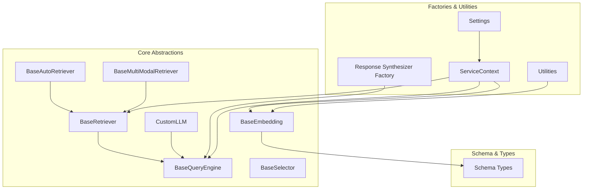
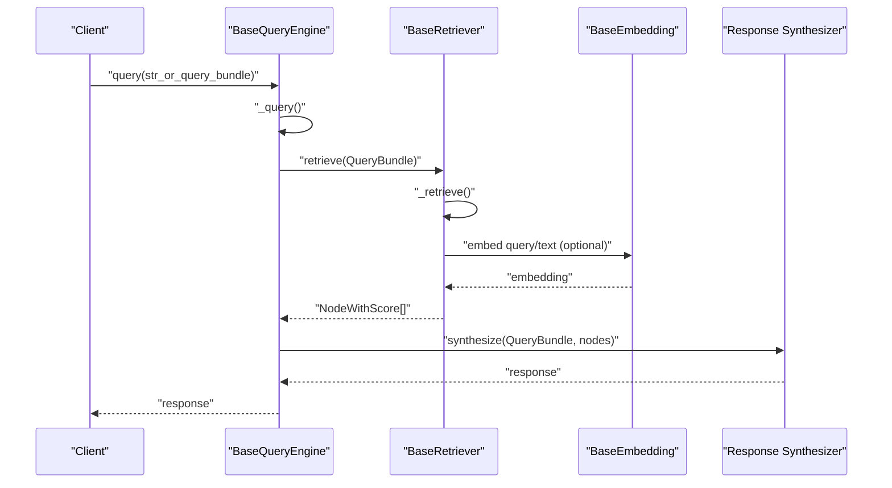
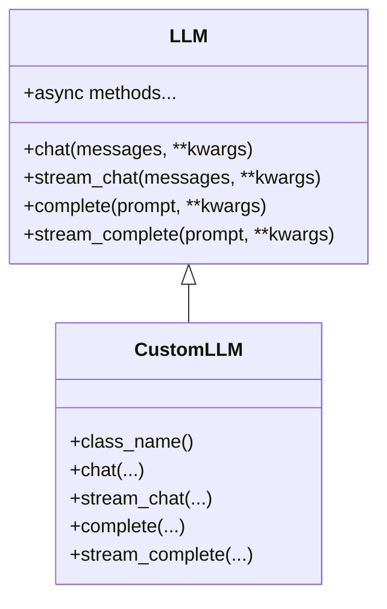
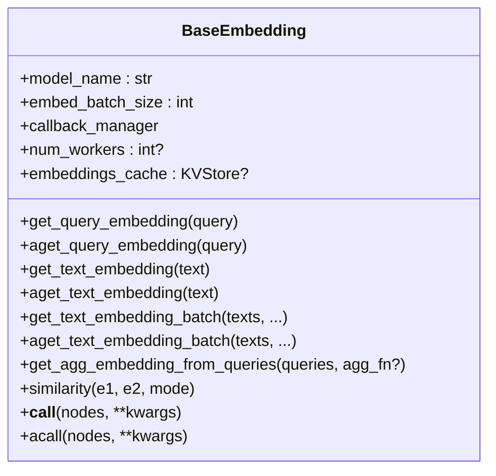
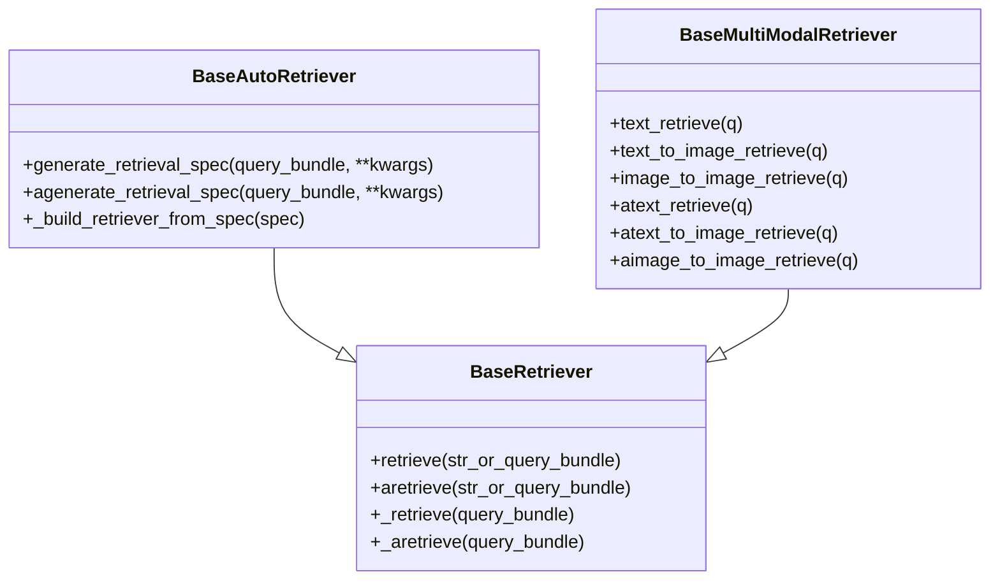
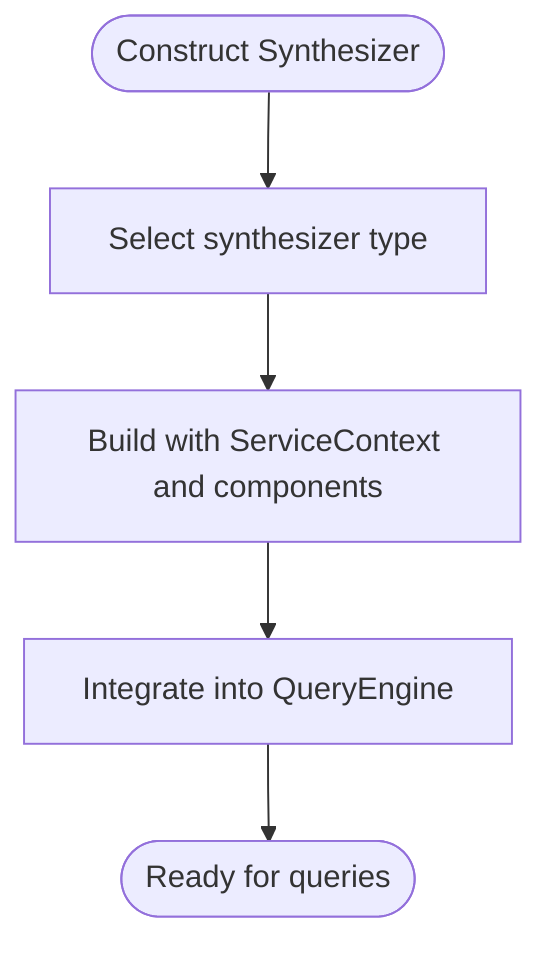
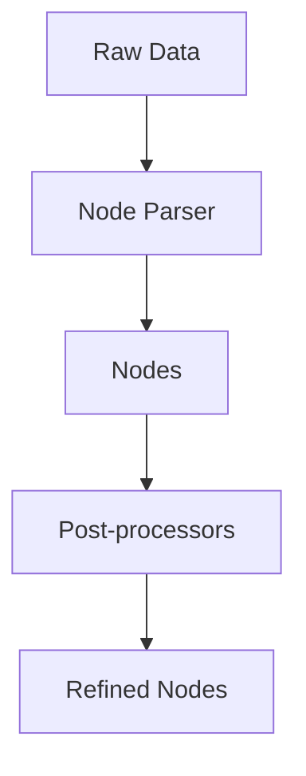
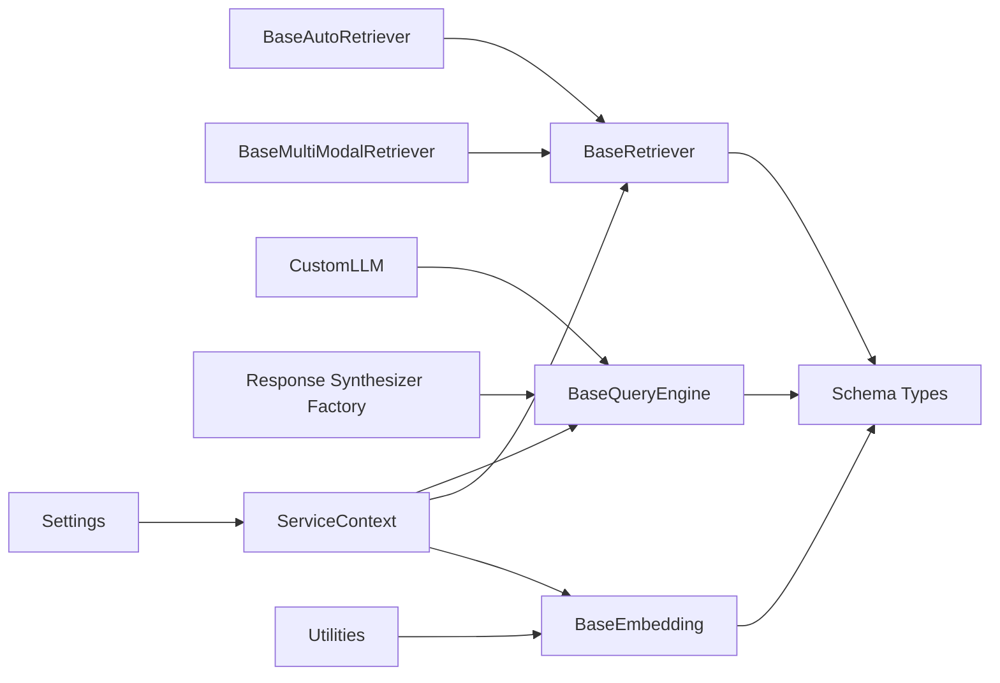

# Custom Component Development

<cite>
**Referenced Files in This Document**
- [llama_index/core/__init__.py](file://llama-index-core/llama_index/core/__init__.py)
- [llama_index/core/base/base_retriever.py](file://llama-index-core/llama_index/core/base/base_retriever.py)
- [llama_index/core/base/base_query_engine.py](file://llama-index-core/llama_index/core/base/base_query_engine.py)
- [llama_index/core/base/base_auto_retriever.py](file://llama-index-core/llama_index/core/base/base_auto_retriever.py)
- [llama_index/core/base/base_selector.py](file://llama-index-core/llama_index/core/base/base_selector.py)
- [llama_index/core/base/base_multi_modal_retriever.py](file://llama-index-core/llama_index/core/base/base_multi_modal_retriever.py)
- [llama_index/core/llms/custom.py](file://llama-index-core/llama_index/core/llms/custom.py)
- [llama_index/core/llms/__init__.py](file://llama-index-core/llama_index/core/llms/__init__.py)
- [llama_index/core/embeddings/__init__.py](file://llama-index-core/llama_index/core/embeddings/__init__.py)
- [llama_index/core/base/embeddings/base.py](file://llama-index-core/llama_index/core/base/embeddings/base.py)
- [llama_index/core/embeddings/mock_embed_model.py](file://llama-index-core/llama_index/core/embeddings/mock_embed_model.py)
- [llama_index/core/response_synthesizers/factory.py](file://llama-index-core/llama_index/core/response_synthesizers/factory.py)
- [llama_index/core/node_parser/__init__.py](file://llama-index-core/llama_index/core/node_parser/__init__.py)
- [llama-index-core/llama_index/core/postprocessor/__init__.py](file://llama-index-core/llama_index/core/postprocessor/__init__.py)
- [llama-index-core/llama_index/core/schema.py](file://llama-index-core/llama_index/core/schema.py)
- [llama-index-core/llama_index/core/service_context.py](file://llama-index-core/llama_index/core/service_context.py)
- [llama-index-core/llama_index/core/settings.py](file://llama-index-core/llama_index/core/settings.py)
- [llama-index-core/llama_index/core/utils.py](file://llama-index-core/llama_index/core/utils.py)
</cite>

## Table of Contents
1. [Introduction](#introduction)
2. [Project Structure](#project-structure)
3. [Core Components](#core-components)
4. [Architecture Overview](#architecture-overview)
5. [Detailed Component Analysis](#detailed-component-analysis)
6. [Dependency Analysis](#dependency-analysis)
7. [Performance Considerations](#performance-considerations)
8. [Troubleshooting Guide](#troubleshooting-guide)
9. [Conclusion](#conclusion)
10. [Appendices](#appendices)

## Introduction
This document explains how to develop custom components in LlamaIndex with a focus on:
- Custom LLM wrappers
- Prompt customization
- Node parsers and post-processors
- Embedding models, response synthesizers, and retrievers

It covers component interface contracts, inheritance patterns, integration requirements, serialization, caching strategies, performance optimization, templates, best practices, testing, and deployment while ensuring compatibility with existing LlamaIndex workflows.

## Project Structure
LlamaIndex organizes core capabilities under a modular structure:
- Base abstractions define contracts for LLMs, embeddings, retrievers, query engines, selectors, and multimodal retrievers.
- Factory utilities expose standardized ways to construct higher-level components like response synthesizers.
- Schema and service context unify data types and runtime configuration across components.

**Diagram sources**
- [llama_index/core/base/base_retriever.py](file://llama-index-core/llama_index/core/base/base_retriever.py#L34-L275)
- [llama_index/core/base/base_query_engine.py](file://llama-index-core/llama_index/core/base/base_query_engine.py#L22-L94)
- [llama_index/core/base/base_auto_retriever.py](file://llama-index-core/llama_index/core/base/base_auto_retriever.py#L9-L44)
- [llama_index/core/base/base_multi_modal_retriever.py](file://llama-index-core/llama_index/core/base/base_multi_modal_retriever.py#L12-L78)
- [llama_index/core/llms/custom.py](file://llama-index-core/llama_index/core/llms/custom.py#L22-L92)
- [llama_index/core/base/embeddings/base.py](file://llama-index-core/llama_index/core/base/embeddings/base.py#L72-L619)
- [llama_index/core/response_synthesizers/factory.py](file://llama-index-core/llama_index/core/response_synthesizers/factory.py)
- [llama_index/core/service_context.py](file://llama-index-core/llama_index/core/service_context.py)
- [llama-index-core/llama_index/core/settings.py](file://llama-index-core/llama_index/core/settings.py)
- [llama-index-core/llama_index/core/utils.py](file://llama-index-core/llama_index/core/utils.py)
- [llama-index-core/llama_index/core/schema.py](file://llama-index-core/llama_index/core/schema.py)

**Section sources**
- [llama_index/core/__init__.py](file://llama-index-core/llama_index/core/__init__.py#L1-L162)
- [llama_index/core/llms/__init__.py](file://llama-index-core/llama_index/core/llms/__init__.py#L1-L49)
- [llama_index/core/embeddings/__init__.py](file://llama-index-core/llama_index/core/embeddings/__init__.py#L1-L16)

## Core Components
This section outlines the primary component families and their contracts.

- BaseRetriever
  - Defines synchronous and asynchronous retrieval APIs and recursive retrieval handling.
  - Provides instrumentation hooks and callback integration.
  - Supports prompt mixin for prompt customization.

- BaseQueryEngine
  - Defines synchronous and asynchronous query APIs.
  - Offers optional retrieve and synthesize methods; subclasses may implement them.

- BaseAutoRetriever
  - Extends BaseRetriever with automatic retrieval spec generation and builder pattern.

- BaseSelector
  - Provides selection APIs for tools and choices with prompt mixin and instrumentation.

- BaseMultiModalRetriever
  - Extends BaseRetriever with multimodal retrieval variants for text and images.

- BaseEmbedding
  - Defines embedding APIs for queries and texts, supports batching, async, aggregation, and caching.
  - Integrates with KVStore-backed caches and callback instrumentation.

- CustomLLM
  - Simplifies building custom LLMs by implementing completion/streaming and metadata.

Integration touchpoints:
- ServiceContext centralizes component configuration and callback managers.
- Settings exposes global defaults and utilities.
- Schema types unify node, query, and response representations.

**Section sources**
- [llama_index/core/base/base_retriever.py](file://llama-index-core/llama_index/core/base/base_retriever.py#L34-L275)
- [llama_index/core/base/base_query_engine.py](file://llama-index-core/llama_index/core/base/base_query_engine.py#L22-L94)
- [llama_index/core/base/base_auto_retriever.py](file://llama-index-core/llama_index/core/base/base_auto_retriever.py#L9-L44)
- [llama_index/core/base/base_selector.py](file://llama-index-core/llama_index/core/base/base_selector.py#L72-L104)
- [llama_index/core/base/base_multi_modal_retriever.py](file://llama-index-core/llama_index/core/base/base_multi_modal_retriever.py#L12-L78)
- [llama_index/core/base/embeddings/base.py](file://llama-index-core/llama_index/core/base/embeddings/base.py#L72-L619)
- [llama_index/core/llms/custom.py](file://llama-index-core/llama_index/core/llms/custom.py#L22-L92)
- [llama_index/core/service_context.py](file://llama-index-core/llama_index/core/service_context.py)
- [llama-index-core/llama_index/core/settings.py](file://llama-index-core/llama_index/core/settings.py)
- [llama-index-core/llama_index/core/schema.py](file://llama-index-core/llama_index/core/schema.py)

## Architecture Overview
The following diagram shows how components interact during a typical retrieval and synthesis workflow.

**Diagram sources**
- [llama_index/core/base/base_query_engine.py](file://llama-index-core/llama_index/core/base/base_query_engine.py#L38-L94)
- [llama_index/core/base/base_retriever.py](file://llama-index-core/llama_index/core/base/base_retriever.py#L185-L275)
- [llama_index/core/base/embeddings/base.py](file://llama-index-core/llama_index/core/base/embeddings/base.py#L130-L443)
- [llama_index/core/response_synthesizers/factory.py](file://llama-index-core/llama_index/core/response_synthesizers/factory.py)

## Detailed Component Analysis

### Custom LLM Wrapper (CustomLLM)
CustomLLM provides a minimal contract for wrapping external LLMs:
- Implement completion and streaming methods plus metadata.
- Leverage built-in callbacks and conversion helpers for chat and streaming.

**Diagram sources**
- [llama_index/core/llms/custom.py](file://llama-index-core/llama_index/core/llms/custom.py#L22-L92)
- [llama_index/core/llms/__init__.py](file://llama-index-core/llama_index/core/llms/__init__.py#L21-L23)

**Section sources**
- [llama_index/core/llms/custom.py](file://llama-index-core/llama_index/core/llms/custom.py#L22-L92)
- [llama_index/core/llms/__init__.py](file://llama-index-core/llama_index/core/llms/__init__.py#L21-L23)

### Embedding Models (BaseEmbedding)
BaseEmbedding defines:
- Query and text embedding APIs (sync and async)
- Batch embedding with configurable batch size and worker count
- Aggregation helpers and similarity computation
- Optional KVStore-backed caching for queries and texts
- Instrumentation and callback integration

**Diagram sources**
- [llama_index/core/base/embeddings/base.py](file://llama-index-core/llama_index/core/base/embeddings/base.py#L72-L619)

**Section sources**
- [llama_index/core/base/embeddings/base.py](file://llama-index-core/llama_index/core/base/embeddings/base.py#L72-L619)
- [llama-index/core/embeddings/mock_embed_model.py](file://llama-index-core/llama_index/core/embeddings/mock_embed_model.py#L10-L84)

### Retrievers (BaseRetriever, BaseAutoRetriever, BaseMultiModalRetriever)
- BaseRetriever
  - Synchronous and asynchronous retrieve methods
  - Recursive retrieval across index nodes and object maps
  - Instrumentation and callback integration

- BaseAutoRetriever
  - Generates retrieval specs and builds a retriever dynamically per query

- BaseMultiModalRetriever
  - Adds multimodal retrieval variants for text/image queries

**Diagram sources**
- [llama_index/core/base/base_retriever.py](file://llama-index-core/llama_index/core/base/base_retriever.py#L34-L275)
- [llama_index/core/base/base_auto_retriever.py](file://llama-index-core/llama_index/core/base/base_auto_retriever.py#L9-L44)
- [llama_index/core/base/base_multi_modal_retriever.py](file://llama-index-core/llama_index/core/base/base_multi_modal_retriever.py#L12-L78)

**Section sources**
- [llama_index/core/base/base_retriever.py](file://llama-index-core/llama_index/core/base/base_retriever.py#L34-L275)
- [llama_index/core/base/base_auto_retriever.py](file://llama-index-core/llama_index/core/base/base_auto_retriever.py#L9-L44)
- [llama_index/core/base/base_multi_modal_retriever.py](file://llama-index-core/llama_index/core/base/base_multi_modal_retriever.py#L12-L78)

### Response Synthesizers
Response synthesizers are constructed via a factory and integrate with query engines and retrievers to produce final answers.

**Diagram sources**
- [llama_index/core/response_synthesizers/factory.py](file://llama-index-core/llama_index/core/response_synthesizers/factory.py)

**Section sources**
- [llama_index/core/response_synthesizers/factory.py](file://llama-index-core/llama_index/core/response_synthesizers/factory.py)

### Node Parsers and Post-processors
- Node parsers transform raw data into structured nodes.
- Post-processors refine and filter retrieved nodes before synthesis.

**Diagram sources**
- [llama-index-core/llama_index/core/node_parser/__init__.py](file://llama-index-core/llama_index/core/node_parser/__init__.py)
- [llama-index-core/llama_index/core/postprocessor/__init__.py](file://llama-index-core/llama_index/core/postprocessor/__init__.py)

**Section sources**
- [llama-index-core/llama_index/core/node_parser/__init__.py](file://llama-index-core/llama_index/core/node_parser/__init__.py)
- [llama-index-core/llama_index/core/postprocessor/__init__.py](file://llama-index-core/llama_index/core/postprocessor/__init__.py)

## Dependency Analysis
Components depend on shared abstractions, schema types, and runtime configuration.

**Diagram sources**
- [llama_index/core/base/embeddings/base.py](file://llama-index-core/llama_index/core/base/embeddings/base.py#L72-L619)
- [llama_index/core/base/base_retriever.py](file://llama-index-core/llama_index/core/base/base_retriever.py#L34-L275)
- [llama_index/core/base/base_query_engine.py](file://llama-index-core/llama_index/core/base/base_query_engine.py#L22-L94)
- [llama_index/core/base/base_auto_retriever.py](file://llama-index-core/llama_index/core/base/base_auto_retriever.py#L9-L44)
- [llama_index/core/base/base_multi_modal_retriever.py](file://llama-index-core/llama_index/core/base/base_multi_modal_retriever.py#L12-L78)
- [llama_index/core/llms/custom.py](file://llama-index-core/llama_index/core/llms/custom.py#L22-L92)
- [llama_index/core/response_synthesizers/factory.py](file://llama-index-core/llama_index/core/response_synthesizers/factory.py)
- [llama_index/core/service_context.py](file://llama-index-core/llama_index/core/service_context.py)
- [llama-index-core/llama_index/core/settings.py](file://llama-index-core/llama_index/core/settings.py)
- [llama-index-core/llama_index/core/utils.py](file://llama-index-core/llama_index/core/utils.py)
- [llama-index-core/llama_index/core/schema.py](file://llama-index-core/llama_index/core/schema.py)

**Section sources**
- [llama_index/core/service_context.py](file://llama-index-core/llama_index/core/service_context.py)
- [llama-index-core/llama_index/core/settings.py](file://llama-index-core/llama_index/core/settings.py)
- [llama-index-core/llama_index/core/utils.py](file://llama-index-core/llama_index/core/utils.py)
- [llama-index-core/llama_index/core/schema.py](file://llama-index-core/llama_index/core/schema.py)

## Performance Considerations
- Embedding batching and async execution
  - Use embed_batch_size to tune throughput.
  - Enable num_workers for parallel embedding requests.
  - Prefer batch APIs for large workloads.

- Caching
  - Configure embeddings_cache with a KVStore-compatible backend to reduce redundant calls.
  - BaseEmbedding supports both sync and async cached retrieval.

- Instrumentation and callbacks
  - CallbackManager integrates with tracing and event payloads for observability.
  - Instrumentation spans wrap retrieval and embedding calls for profiling.

- Retrieval recursion and deduplication
  - BaseRetriever handles recursive retrieval and deduplicates nodes by hash/ref_doc_id.

**Section sources**
- [llama_index/core/base/embeddings/base.py](file://llama-index-core/llama_index/core/base/embeddings/base.py#L78-L98)
- [llama_index/core/base/embeddings/base.py](file://llama-index-core/llama_index/core/base/embeddings/base.py#L446-L585)
- [llama_index/core/base/base_retriever.py](file://llama-index-core/llama_index/core/base/base_retriever.py#L116-L183)
- [llama_index/core/callbacks/base.py](file://llama-index-core/llama_index/core/callbacks/base.py)
- [llama-index-core/llama_index/core/instrumentation/dispatcher.py](file://llama-index-core/llama_index/core/instrumentation/dispatcher.py)

## Troubleshooting Guide
- Missing callback manager
  - Base components initialize with a default CallbackManager if none is provided.

- Retrieval errors
  - BaseRetriever raises a ValueError for non-retrievable objects during recursive retrieval.

- Embedding cache type
  - BaseEmbedding validates that embeddings_cache is a KVStore-compatible type.

- Async execution
  - Ensure async methods are awaited and that num_workers is configured appropriately.

**Section sources**
- [llama_index/core/base/base_retriever.py](file://llama-index-core/llama_index/core/base/base_retriever.py#L52-L95)
- [llama_index/core/base/embeddings/base.py](file://llama-index-core/llama_index/core/base/embeddings/base.py#L100-L110)

## Conclusion
By adhering to the documented base contracts and leveraging ServiceContext, Settings, and instrumentation, developers can build robust custom components that integrate seamlessly with LlamaIndex workflows. Serialization, caching, and performance tuning are first-class concerns enabled by the framework’s abstractions.

## Appendices

### Templates and Best Practices
- Custom LLM
  - Implement completion/streaming and metadata; use CustomLLM to inherit chat/streaming adapters.
  - Reference: [llama_index/core/llms/custom.py](file://llama-index-core/llama_index/core/llms/custom.py#L22-L92)

- Custom Embedding Model
  - Implement query and text embedding methods; optionally override batch and cached retrieval.
  - Reference: [llama_index/core/base/embeddings/base.py](file://llama-index-core/llama_index/core/base/embeddings/base.py#L112-L348)

- Custom Retriever
  - Implement _retrieve and optionally _aretrieve; use recursive retrieval and object maps.
  - Reference: [llama_index/core/base/base_retriever.py](file://llama-index-core/llama_index/core/base/base_retriever.py#L256-L275)

- Response Synthesizer
  - Construct via factory and integrate into a QueryEngine.
  - Reference: [llama_index/core/response_synthesizers/factory.py](file://llama-index-core/llama_index/core/response_synthesizers/factory.py)

- Testing and Deployment
  - Use MockEmbedding/MockMultiModalEmbedding for deterministic tests.
  - Reference: [llama-index-core/llama_index/core/embeddings/mock_embed_model.py](file://llama-index-core/llama_index/core/embeddings/mock_embed_model.py#L10-L84)

- Compatibility
  - Import top-level items from the core init to maintain compatibility across releases.
  - Reference: [llama_index/core/__init__.py](file://llama-index-core/llama_index/core/__init__.py#L93-L150)