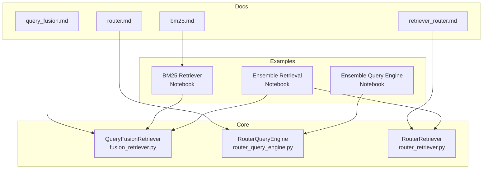
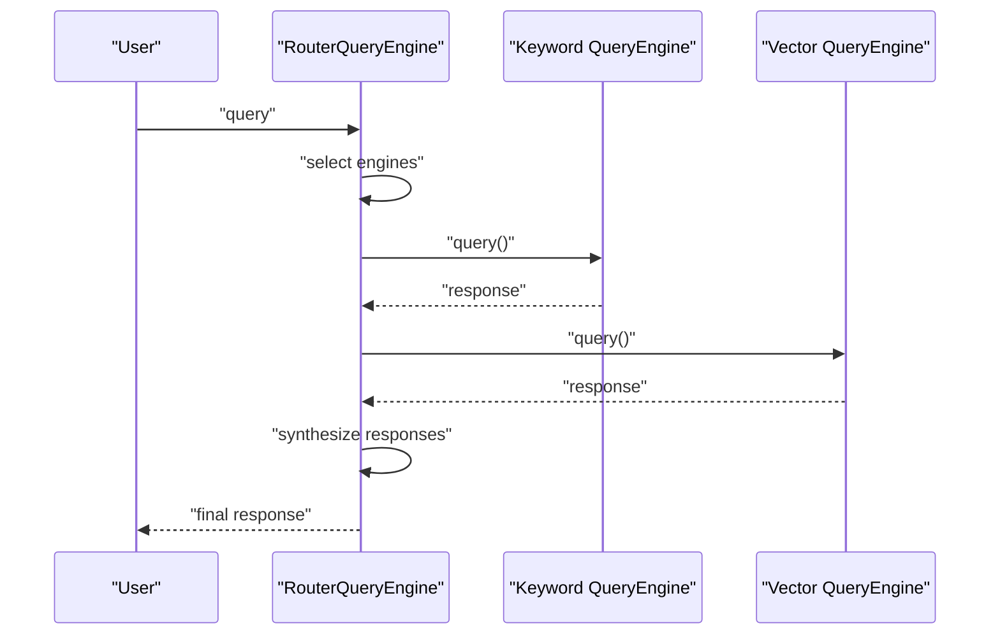
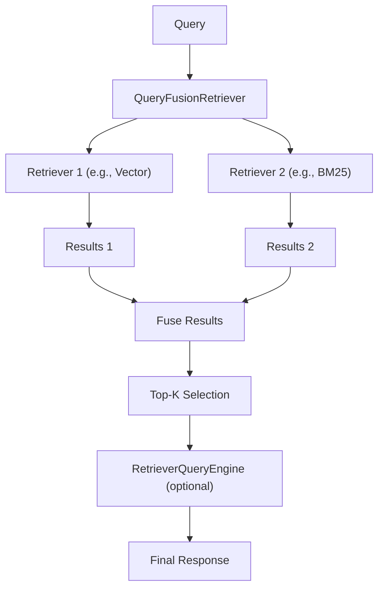
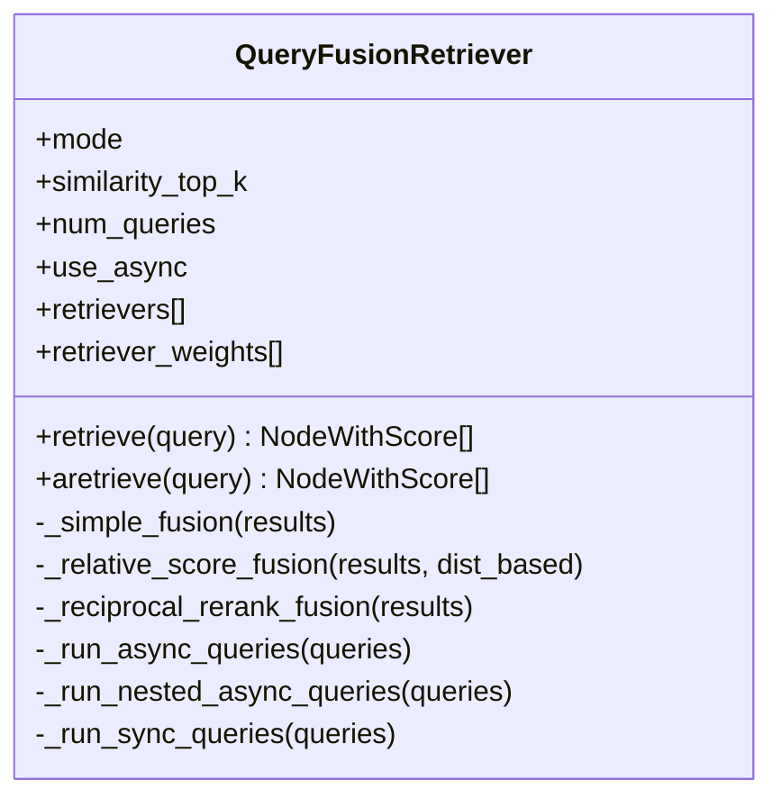
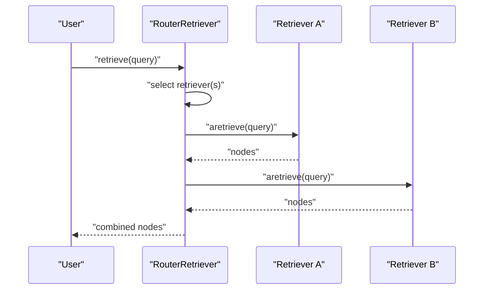
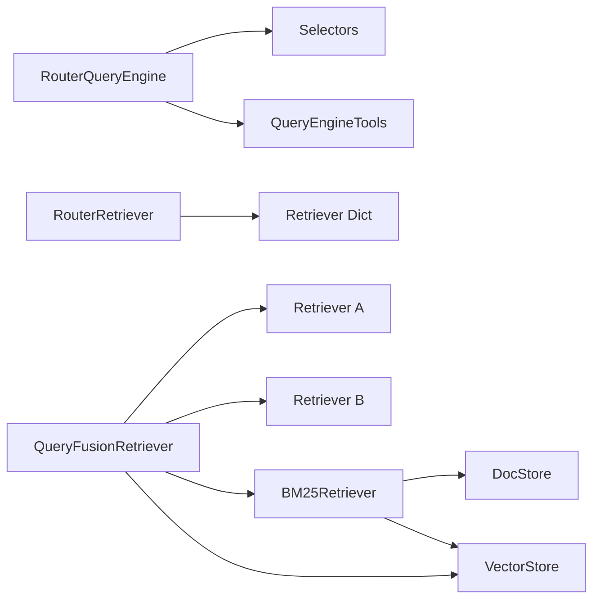

# Ensemble Methods

<cite>
**Referenced Files in This Document**
- [ensemble_query_engine.ipynb](file://docs/examples/query_engine/ensemble_query_engine.ipynb)
- [ensemble_retrieval.ipynb](file://docs/examples/retrievers/ensemble_retrieval.ipynb)
- [fusion_retriever.py](file://llama-index-core/llama_index/core/retrievers/fusion_retriever.py)
- [query_fusion.md](file://docs/api_reference/api_reference/retrievers/query_fusion.md)
- [bm25_retriever.ipynb](file://docs/examples/retrievers/bm25_retriever.ipynb)
- [bm25.md](file://docs/api_reference/api_reference/retrievers/bm25.md)
- [router_query_engine.py](file://llama-index-core/llama_index/core/query_engine/router_query_engine.py)
- [router_retriever.py](file://llama-index-core/llama_index/core/retrievers/router_retriever.py)
- [retriever_router.md](file://docs/api_reference/api_reference/query_engine/retriever_router.md)
- [router.md](file://docs/api_reference/api_reference/query_engine/router.md)
</cite>

## Table of Contents
1. [Introduction](#introduction)
2. [Project Structure](#project-structure)
3. [Core Components](#core-components)
4. [Architecture Overview](#architecture-overview)
5. [Detailed Component Analysis](#detailed-component-analysis)
6. [Dependency Analysis](#dependency-analysis)
7. [Performance Considerations](#performance-considerations)
8. [Troubleshooting Guide](#troubleshooting-guide)
9. [Conclusion](#conclusion)
10. [Appendices](#appendices)

## Introduction
This document explains ensemble methods in LlamaIndex with a focus on ensemble query engines and ensemble retrievers. It covers how to combine multiple retrieval strategies, ranking algorithms, and response synthesis methods. Practical recipes demonstrate weighted voting, stacking, and dynamic ensemble selection using:
- Multiple retrieval strategies (BM25, vector similarity, hybrid)
- Fusion retrievers with reciprocal rank fusion, relative score fusion, and simple fusion
- Router-based selection for dynamic ensemble selection
- Response synthesis and reranking

It also provides guidance on performance tuning, parameter optimization, and trade-offs between ensemble and single-method pipelines, including computational overhead, latency, and memory usage patterns.

## Project Structure
The repository provides:
- Example notebooks for ensemble query engines and ensemble retrievers
- Core fusion retriever implementation
- BM25 retriever examples and API reference
- Router-based query engine and retriever abstractions

**Diagram sources**
- [ensemble_query_engine.ipynb](file://docs/examples/query_engine/ensemble_query_engine.ipynb#L1-L500)
- [ensemble_retrieval.ipynb](file://docs/examples/retrievers/ensemble_retrieval.ipynb#L1-L935)
- [bm25_retriever.ipynb](file://docs/examples/retrievers/bm25_retriever.ipynb#L1-L812)
- [fusion_retriever.py](file://llama-index-core/llama_index/core/retrievers/fusion_retriever.py#L1-L305)
- [router_query_engine.py](file://llama-index-core/llama_index/core/query_engine/router_query_engine.py)
- [router_retriever.py](file://llama-index-core/llama_index/core/retrievers/router_retriever.py)
- [query_fusion.md](file://docs/api_reference/api_reference/retrievers/query_fusion.md#L1-L4)
- [bm25.md](file://docs/api_reference/api_reference/retrievers/bm25.md#L1-L4)
- [retriever_router.md](file://docs/api_reference/api_reference/query_engine/retriever_router.md)
- [router.md](file://docs/api_reference/api_reference/query_engine/router.md)

**Section sources**
- [ensemble_query_engine.ipynb](file://docs/examples/query_engine/ensemble_query_engine.ipynb#L1-L500)
- [ensemble_retrieval.ipynb](file://docs/examples/retrievers/ensemble_retrieval.ipynb#L1-L935)
- [bm25_retriever.ipynb](file://docs/examples/retrievers/bm25_retriever.ipynb#L1-L812)
- [fusion_retriever.py](file://llama-index-core/llama_index/core/retrievers/fusion_retriever.py#L1-L305)
- [router_query_engine.py](file://llama-index-core/llama_index/core/query_engine/router_query_engine.py)
- [router_retriever.py](file://llama-index-core/llama_index/core/retrievers/router_retriever.py)
- [query_fusion.md](file://docs/api_reference/api_reference/retrievers/query_fusion.md#L1-L4)
- [bm25.md](file://docs/api_reference/api_reference/retrievers/bm25.md#L1-L4)
- [retriever_router.md](file://docs/api_reference/api_reference/query_engine/retriever_router.md)
- [router.md](file://docs/api_reference/api_reference/query_engine/router.md)

## Core Components
- Ensemble Query Engine: Orchestrates multiple query engines (e.g., keyword and vector), selects which to run, and synthesizes results.
- Ensemble Retrieval: Runs multiple retrievers (e.g., different chunk sizes, BM25, vector) and fuses results.
- QueryFusionRetriever: Implements multiple fusion strategies (simple, relative score, reciprocal rank, distance-based score) with optional query expansion.
- Router-based selection: Dynamically chooses among retrievers or query engines using an LLM selector.
- BM25Retriever: Sparse lexical retrieval with optional persistence and metadata filtering.

Key capabilities:
- Weighted voting via retriever weights and fusion modes
- Stacking via rerankers and response synthesizers
- Dynamic selection via router selectors

**Section sources**
- [ensemble_query_engine.ipynb](file://docs/examples/query_engine/ensemble_query_engine.ipynb#L314-L422)
- [ensemble_retrieval.ipynb](file://docs/examples/retrievers/ensemble_retrieval.ipynb#L249-L394)
- [fusion_retriever.py](file://llama-index-core/llama_index/core/retrievers/fusion_retriever.py#L33-L305)
- [bm25_retriever.ipynb](file://docs/examples/retrievers/bm25_retriever.ipynb#L564-L735)
- [router_query_engine.py](file://llama-index-core/llama_index/core/query_engine/router_query_engine.py)
- [router_retriever.py](file://llama-index-core/llama_index/core/retrievers/router_retriever.py)

## Architecture Overview
Two primary ensemble patterns are demonstrated:

1) Ensemble Query Engine
- Multiple query engines (tools) are defined and passed to a router query engine.
- The router selects which engines to run and synthesizes results.

**Diagram sources**
- [ensemble_query_engine.ipynb](file://docs/examples/query_engine/ensemble_query_engine.ipynb#L318-L379)

2) Ensemble Retrieval with Fusion
- Multiple retrievers (e.g., BM25 + Vector) are combined using QueryFusionRetriever.
- Fusion strategies combine and rank results across retrievers.

**Diagram sources**
- [bm25_retriever.ipynb](file://docs/examples/retrievers/bm25_retriever.ipynb#L639-L716)
- [fusion_retriever.py](file://llama-index-core/llama_index/core/retrievers/fusion_retriever.py#L33-L305)

## Detailed Component Analysis

### Ensemble Query Engine
- Defines multiple query engines (e.g., keyword and vector) as tools.
- Uses a router selector to choose which tools to run.
- Synthesizes results using a summarizer.

Implementation highlights:
- Tools wrap query engines for router orchestration.
- Router supports multi-select and single-select strategies.
- Summarizer aggregates results and optionally attaches relevance scores.

Practical example path:
- [Define tools and router](file://docs/examples/query_engine/ensemble_query_engine.ipynb#L328-L379)
- [Run ensemble query](file://docs/examples/query_engine/ensemble_query_engine.ipynb#L418-L422)

**Section sources**
- [ensemble_query_engine.ipynb](file://docs/examples/query_engine/ensemble_query_engine.ipynb#L318-L422)
- [router_query_engine.py](file://llama-index-core/llama_index/core/query_engine/router_query_engine.py)
- [router.md](file://docs/api_reference/api_reference/query_engine/router.md)

### Ensemble Retrieval with QueryFusionRetriever
- Combines multiple retrievers (e.g., vector and BM25).
- Supports multiple fusion modes:
  - Simple fusion: keep best per-node score across retrievers
  - Relative score fusion: min-max normalize per-retriever scores, then weight and average
  - Reciprocal rank fusion: combine reciprocal ranks with a tunable k
  - Distance-based score fusion: normalize by mean and std dev per retriever
- Optional query expansion: generate additional queries and run all retrievers per query.

Implementation highlights:
- FUSION_MODES enum defines supported strategies.
- Retriever weights enable weighted voting across retrievers.
- Async execution path reduces latency when running multiple retrievers.

Practical example path:
- [Build hybrid retriever with BM25 + Vector](file://docs/examples/retrievers/bm25_retriever.ipynb#L639-L651)
- [Run fusion retriever](file://docs/examples/retrievers/bm25_retriever.ipynb#L701-L704)

**Diagram sources**
- [fusion_retriever.py](file://llama-index-core/llama_index/core/retrievers/fusion_retriever.py#L33-L305)

**Section sources**
- [fusion_retriever.py](file://llama-index-core/llama_index/core/retrievers/fusion_retriever.py#L24-L305)
- [query_fusion.md](file://docs/api_reference/api_reference/retrievers/query_fusion.md#L1-L4)
- [bm25_retriever.ipynb](file://docs/examples/retrievers/bm25_retriever.ipynb#L639-L716)

### Router-Based Dynamic Selection
- RouterRetriever routes to a dictionary of retrievers keyed by identifiers.
- RouterQueryEngine routes to a list of tools (wrapping query engines).
- Useful for dynamic selection based on query characteristics or routing prompts.

Practical example path:
- [Recursive retriever with router](file://docs/examples/retrievers/ensemble_retrieval.ipynb#L303-L316)
- [Router query engine with tools](file://docs/examples/query_engine/ensemble_query_engine.ipynb#L328-L379)

**Diagram sources**
- [ensemble_retrieval.ipynb](file://docs/examples/retrievers/ensemble_retrieval.ipynb#L296-L316)
- [router_retriever.py](file://llama-index-core/llama_index/core/retrievers/router_retriever.py)
- [retriever_router.md](file://docs/api_reference/api_reference/query_engine/retriever_router.md)

**Section sources**
- [ensemble_retrieval.ipynb](file://docs/examples/retrievers/ensemble_retrieval.ipynb#L296-L316)
- [router_retriever.py](file://llama-index-core/llama_index/core/retrievers/router_retriever.py)
- [retriever_router.md](file://docs/api_reference/api_reference/query_engine/retriever_router.md)

### BM25 Retrieval and Hybrid Fusion
- BM25Retriever supports persistence, metadata filtering, and integration with vector stores.
- Hybrid fusion combines BM25 and vector retrievers using QueryFusionRetriever.

Practical example path:
- [BM25 retriever basics and persistence](file://docs/examples/retrievers/bm25_retriever.ipynb#L149-L231)
- [Hybrid BM25 + Vector fusion](file://docs/examples/retrievers/bm25_retriever.ipynb#L564-L716)

**Section sources**
- [bm25_retriever.ipynb](file://docs/examples/retrievers/bm25_retriever.ipynb#L149-L716)
- [bm25.md](file://docs/api_reference/api_reference/retrievers/bm25.md#L1-L4)

## Dependency Analysis
- Router-based components depend on selectors (single or multi) to choose engines/tools.
- Fusion retriever depends on multiple underlying retrievers and optional LLM for query expansion.
- BM25Retriever integrates with docstores and vector stores for hybrid setups.

**Diagram sources**
- [router_query_engine.py](file://llama-index-core/llama_index/core/query_engine/router_query_engine.py)
- [router_retriever.py](file://llama-index-core/llama_index/core/retrievers/router_retriever.py)
- [fusion_retriever.py](file://llama-index-core/llama_index/core/retrievers/fusion_retriever.py#L33-L70)
- [bm25_retriever.ipynb](file://docs/examples/retrievers/bm25_retriever.ipynb#L564-L716)

**Section sources**
- [router_query_engine.py](file://llama-index-core/llama_index/core/query_engine/router_query_engine.py)
- [router_retriever.py](file://llama-index-core/llama_index/core/retrievers/router_retriever.py)
- [fusion_retriever.py](file://llama-index-core/llama_index/core/retrievers/fusion_retriever.py#L33-L70)
- [bm25_retriever.ipynb](file://docs/examples/retrievers/bm25_retriever.ipynb#L564-L716)

## Performance Considerations
- Computational overhead
  - Running multiple retrievers increases compute and embedding costs.
  - Async execution reduces latency when running retrievers concurrently.
- Latency
  - QueryFusionRetriever supports async gather to parallelize retriever calls.
  - Router-based selection can reduce unnecessary retriever invocations.
- Memory usage
  - Fusion strategies aggregate results; top-k limits reduce memory footprint.
  - Persisted BM25 and vector stores minimize repeated indexing overhead.
- Parameter tuning
  - similarity_top_k controls output size and downstream cost.
  - retriever_weights balance contributions from different retrievers.
  - num_queries in QueryFusionRetriever trades accuracy for latency.
  - Fusion mode choice affects ranking quality and runtime.

[No sources needed since this section provides general guidance]

## Troubleshooting Guide
- QueryFusionRetriever mode errors
  - Ensure mode is one of the supported fusion modes.
  - Verify retriever_weights sum to 1 when provided.
- Router selection issues
  - Confirm selector configuration matches expected behavior (single vs. multi).
  - Validate tool descriptions and retriever keys for RouterRetriever.
- BM25Retriever persistence and filters
  - Ensure docstore and vector store are persisted consistently.
  - Check metadata filter keys and operators for correctness.

**Section sources**
- [fusion_retriever.py](file://llama-index-core/llama_index/core/retrievers/fusion_retriever.py#L24-L70)
- [router_query_engine.py](file://llama-index-core/llama_index/core/query_engine/router_query_engine.py)
- [router_retriever.py](file://llama-index-core/llama_index/core/retrievers/router_retriever.py)
- [bm25_retriever.ipynb](file://docs/examples/retrievers/bm25_retriever.ipynb#L564-L716)

## Conclusion
Ensemble methods in LlamaIndex enable robust retrieval and response synthesis by combining multiple strategies. Use:
- Router-based selection for dynamic, query-aware routing
- QueryFusionRetriever for weighted voting and stacking via fusion
- BM25 + vector hybrid fusion for complementary lexical and semantic coverage

Tune parameters (top-k, weights, num_queries, fusion mode) to balance quality, latency, and cost. Persist BM25 and vector stores to reduce repeated indexing overhead.

[No sources needed since this section summarizes without analyzing specific files]

## Appendices

### Practical Recipes

- Combine BM25 and vector retrieval with fusion
  - Build BM25Retriever and VectorStoreIndex
  - Wrap both as retrievers and pass to QueryFusionRetriever
  - Run retriever and optionally synthesize with a RetrieverQueryEngine

  Reference path:
  - [Hybrid fusion setup](file://docs/examples/retrievers/bm25_retriever.ipynb#L639-L651)
  - [Run fusion retriever](file://docs/examples/retrievers/bm25_retriever.ipynb#L701-L704)

- Ensemble query engine with keyword and vector query engines
  - Create tools for each query engine
  - Configure RouterQueryEngine with a selector and summarizer
  - Execute aquery to leverage dynamic selection and synthesis

  Reference path:
  - [Define tools and router](file://docs/examples/query_engine/ensemble_query_engine.ipynb#L328-L379)
  - [Run ensemble query](file://docs/examples/query_engine/ensemble_query_engine.ipynb#L418-L422)

- Weighted voting across retrievers
  - Provide retriever_weights to QueryFusionRetriever
  - Choose relative score fusion to scale and weight normalized scores

  Reference path:
  - [Fusion modes and weights](file://llama-index-core/llama_index/core/retrievers/fusion_retriever.py#L47-L61)
  - [Relative score fusion](file://llama-index-core/llama_index/core/retrievers/fusion_retriever.py#L137-L198)

- Dynamic ensemble selection
  - Use RouterRetriever with a retriever_dict keyed by identifiers
  - Use RouterQueryEngine with QueryEngineTool wrappers

  Reference path:
  - [Router retriever](file://docs/examples/retrievers/ensemble_retrieval.ipynb#L303-L316)
  - [Router query engine](file://docs/examples/query_engine/ensemble_query_engine.ipynb#L328-L379)