# Intermediate Examples

<cite>
**Referenced Files in This Document**
- [ensemble_query_engine.ipynb](file://docs/examples/query_engine/ensemble_query_engine.ipynb)
- [ensemble_retrieval.ipynb](file://docs/examples/retrievers/ensemble_retrieval.ipynb)
- [tree_summarize.ipynb](file://docs/examples/response_synthesizers/tree_summarize.ipynb)
- [SentenceTransformerRerank.ipynb](file://docs/examples/node_postprocessor/SentenceTransformerRerank.ipynb)
- [openai_multi_modal.ipynb](file://docs/examples/multi_modal/openai_multi_modal.ipynb)
- [RouterQueryEngine.ipynb](file://docs/examples/query_engine/RouterQueryEngine.ipynb)
- [RetrieverRouterQueryEngine.ipynb](file://docs/examples/query_engine/RetrieverRouterQueryEngine.ipynb)
- [custom_query_engine.ipynb](file://docs/examples/query_engine/custom_query_engine.ipynb)
- [simple_fusion.ipynb](file://docs/examples/retrievers/simple_fusion.ipynb)
- [reciprocal_rerank_fusion.ipynb](file://docs/examples/retrievers/reciprocal_rerank_fusion.ipynb)
- [relative_score_dist_fusion.ipynb](file://docs/examples/retrievers/relative_score_dist_fusion.ipynb)
- [multi_doc_auto_retrieval.ipynb](file://docs/examples/query_engine/multi_doc_auto_retrieval/multi_doc_auto_retrieval.ipynb)
- [sub_question_query_engine.ipynb](file://docs/examples/query_engine/sub_question_query_engine.ipynb)
- [SQLRouterQueryEngine.ipynb](file://docs/examples/query_engine/SQLRouterQueryEngine.ipynb)
- [SQLJoinQueryEngine.ipynb](file://docs/examples/query_engine/SQLJoinQueryEngine.ipynb)
- [SQLAutoVectorQueryEngine.ipynb](file://docs/examples/query_engine/SQLAutoVectorQueryEngine.ipynb)
- [RouterQueryEngine.ipynb](file://docs/examples/retrievers/router_retriever.ipynb)
- [auto_merging_retriever.ipynb](file://docs/examples/retrievers/auto_merging_retriever.ipynb)
- [recursive_retriever_nodes.ipynb](file://docs/examples/retrievers/recursive_retriever_nodes.ipynb)
- [composable_retrievers.ipynb](file://docs/examples/retrievers/composable_retrievers.ipynb)
- [multi_doc_together_hybrid.ipynb](file://docs/examples/retrievers/multi_doc_together_hybrid.ipynb)
- [bm25_retriever.ipynb](file://docs/examples/retrievers/bm25_retriever.ipynb)
- [vectara_auto_retriever.ipynb](file://docs/examples/retrievers/vectara_auto_retriever.ipynb)
- [vertex_ai_search_retriever.ipynb](file://docs/examples/retrievers/vertex_ai_search_retriever.ipynb)
- [you_retriever.ipynb](file://docs/examples/retrievers/you_retriever.ipynb)
- [deep_memory.ipynb](file://docs/examples/retrievers/deep_memory.ipynb)
- [videodb_retriever.ipynb](file://docs/examples/retrievers/videodb_retriever.ipynb)
- [CohereRerank.ipynb](file://docs/examples/node_postprocessor/CohereRerank.ipynb)
- [LLMReranker-Lyft-10k.ipynb](file://docs/examples/node_postprocessor/LLMReranker-Lyft-10k.ipynb)
- [rankLLM.ipynb](file://docs/examples/node_postprocessor/rankLLM.ipynb)
- [LongContextReorder.ipynb](file://docs/examples/node_postprocessor/LongContextReorder.ipynb)
- [PrevNextPostprocessorDemo.ipynb](file://docs/examples/node_postprocessor/PrevNextPostprocessorDemo.ipynb)
- [RecencyPostprocessorDemo.ipynb](file://docs/examples/node_postprocessor/RecencyPostprocessorDemo.ipynb)
- [TimeWeightedPostprocessorDemo.ipynb](file://docs/examples/node_postprocessor/TimeWeightedPostprocessorDemo.ipynb)
- [PII.ipynb](file://docs/examples/node_postprocessor/PII.ipynb)
- [Structured-LLMReranker-Lyft-10k.ipynb](file://docs/examples/node_postprocessor/Structured-LLMReranker-Lyft-10k.ipynb)
- [ibm_watsonx.ipynb](file://docs/examples/node_postprocessor/ibm_watsonx.ipynb)
- [openvino_rerank.ipynb](file://docs/examples/node_postprocessor/openvino_rerank.ipynb)
- [rankGPT.ipynb](file://docs/examples/node_postprocessor/rankGPT.ipynb)
- [SentenceTransformerRerank.ipynb](file://docs/examples/node_postprocessor/SentenceTransformerRerank.ipynb)
- [custom_prompt_synthesizer.ipynb](file://docs/examples/response_synthesizers/custom_prompt_synthesizer.ipynb)
- [structured_refine.ipynb](file://docs/examples/response_synthesizers/structured_refine.ipynb)
- [refine.ipynb](file://docs/examples/response_synthesizers/refine.ipynb)
- [long_context_test.ipynb](file://docs/examples/response_synthesizers/long_context_test.ipynb)
- [pydantic_tree_summarize.ipynb](file://docs/examples/response_synthesizers/pydantic_tree_summarize.ipynb)
- [CustomRetrievers.ipynb](file://docs/examples/query_engine/CustomRetrievers.ipynb)
- [JSONalyze_query_engine.ipynb](file://docs/examples/query_engine/JSONalyze_query_engine.ipynb)
- [JointQASummary.ipynb](file://docs/examples/query_engine/JointQASummary.ipynb)
- [flare_query_engine.ipynb](file://docs/examples/query_engine/flare_query_engine.ipynb)
- [json_query_engine.ipynb](file://docs/examples/query_engine/json_query_engine.ipynb)
- [knowledge_graph_query_engine.ipynb](file://docs/examples/query_engine/knowledge_graph_query_engine.ipynb)
- [knowledge_graph_rag_query_engine.ipynb](file://docs/examples/query_engine/knowledge_graph_rag_query_engine.ipynb)
- [pandas_query_engine.ipynb](file://docs/examples/query_engine/pandas_query_engine.ipynb)
- [pgvector_sql_query_engine.ipynb](file://docs/examples/query_engine/pgvector_sql_query_engine.ipynb)
- [polars_query_engine.ipynb](file://docs/examples/query_engine/polars_query_engine.ipynb)
- [pydantic_query_engine.ipynb](file://docs/examples/query_engine/pydantic_query_engine.ipynb)
- [cogniswitch_query_engine.ipynb](file://docs/examples/query_engine/cogniswitch_query_engine.ipynb)
- [citation_query_engine.ipynb](file://docs/examples/query_engine/citation_query_engine.ipynb)
- [SQLAutoVectorQueryEngine.ipynb](file://docs/examples/query_engine/SQLAutoVectorQueryEngine.ipynb)
- [SQLJoinQueryEngine.ipynb](file://docs/examples/query_engine/SQLJoinQueryEngine.ipynb)
- [SQLRouterQueryEngine.ipynb](file://docs/examples/query_engine/SQLRouterQueryEngine.ipynb)
- [RouterQueryEngine.ipynb](file://docs/examples/query_engine/RouterQueryEngine.ipynb)
- [RetrieverRouterQueryEngine.ipynb](file://docs/examples/query_engine/RetrieverRouterQueryEngine.ipynb)
- [custom_query_engine.ipynb](file://docs/examples/query_engine/custom_query_engine.ipynb)
- [ensemble_query_engine.ipynb](file://docs/examples/query_engine/ensemble_query_engine.ipynb)
- [ensemble_retrieval.ipynb](file://docs/examples/retrievers/ensemble_retrieval.ipynb)
- [tree_summarize.ipynb](file://docs/examples/response_synthesizers/tree_summarize.ipynb)
- [SentenceTransformerRerank.ipynb](file://docs/examples/node_postprocessor/SentenceTransformerRerank.ipynb)
- [openai_multi_modal.ipynb](file://docs/examples/multi_modal/openai_multi_modal.ipynb)
</cite>

## Table of Contents
1. [Introduction](#introduction)
2. [Project Structure](#project-structure)
3. [Core Components](#core-components)
4. [Architecture Overview](#architecture-overview)
5. [Detailed Component Analysis](#detailed-component-analysis)
6. [Dependency Analysis](#dependency-analysis)
7. [Performance Considerations](#performance-considerations)
8. [Troubleshooting Guide](#troubleshooting-guide)
9. [Conclusion](#conclusion)
10. [Appendices](#appendices)

## Introduction
This document presents intermediate-level examples showcasing advanced LlamaIndex features and configurations. It focuses on ensemble methods, custom query engines, advanced retrieval strategies, and response synthesis techniques. You will learn how to combine multiple strategies, integrate heterogeneous data sources, apply custom post-processing, and optimize performance. Real-world scenarios include multi-modal retrieval, hybrid search strategies, and custom component development. Architectural decisions, trade-offs, and benchmarking methodologies are explained to help you choose the right approach for your use case.

## Project Structure
The repository organizes examples by functional area:
- Query engines: orchestrate retrieval, routing, and synthesis
- Retrievers: advanced retrieval strategies and fusion
- Response synthesizers: diverse response generation techniques
- Node postprocessors: rerankers and metadata processors
- Multi-modal: image/text reasoning and multimodal retrieval
- Integrations: SQL, graph RAG, and specialized connectors

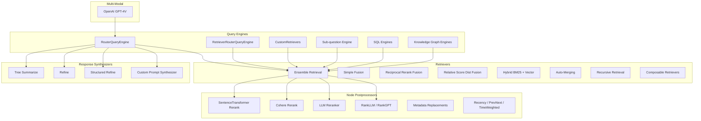

[No sources needed since this diagram shows conceptual structure, not a direct code mapping]

## Core Components
This section highlights representative examples that demonstrate advanced capabilities across the LlamaIndex ecosystem.

- Ensemble Query Engine: Demonstrates combining multiple query strategies and synthesizing results via an LLM selector and tree-summarization.
- Ensemble Retrieval: Builds an ensemble of vector retrievers across chunk sizes and reranks results to benchmark retrieval effectiveness.
- Tree Summarize: Aggregates long-form content into concise summaries using hierarchical summarization.
- SentenceTransformer Rerank: Prunes irrelevant context using cross-encoders to improve latency and quality.
- OpenAI Multi-Modal: Uses GPT-4V for image reasoning and multimodal prompting.
- Router-based Query Engines: Route queries to appropriate retrievers or query engines using selectors.
- Custom Retriever and Query Engine: Build domain-specific retrieval and synthesis pipelines.
- Hybrid Retrieval Strategies: Combine BM25 and dense vectors; auto-merge and recursive retrieval patterns.
- Advanced Postprocessors: Structured rerankers, metadata replacements, recency/time-aware processors.

**Section sources**
- [ensemble_query_engine.ipynb](file://docs/examples/query_engine/ensemble_query_engine.ipynb#L1-L500)
- [ensemble_retrieval.ipynb](file://docs/examples/retrievers/ensemble_retrieval.ipynb#L1-L935)
- [tree_summarize.ipynb](file://docs/examples/response_synthesizers/tree_summarize.ipynb#L1-L197)
- [SentenceTransformerRerank.ipynb](file://docs/examples/node_postprocessor/SentenceTransformerRerank.ipynb#L1-L363)
- [openai_multi_modal.ipynb](file://docs/examples/multi_modal/openai_multi_modal.ipynb#L1-L302)
- [RouterQueryEngine.ipynb](file://docs/examples/query_engine/RouterQueryEngine.ipynb)
- [RetrieverRouterQueryEngine.ipynb](file://docs/examples/query_engine/RetrieverRouterQueryEngine.ipynb)
- [CustomRetrievers.ipynb](file://docs/examples/query_engine/CustomRetrievers.ipynb)
- [simple_fusion.ipynb](file://docs/examples/retrievers/simple_fusion.ipynb)
- [reciprocal_rerank_fusion.ipynb](file://docs/examples/retrievers/reciprocal_rerank_fusion.ipynb)
- [relative_score_dist_fusion.ipynb](file://docs/examples/retrievers/relative_score_dist_fusion.ipynb)
- [bm25_retriever.ipynb](file://docs/examples/retrievers/bm25_retriever.ipynb)
- [auto_merging_retriever.ipynb](file://docs/examples/retrievers/auto_merging_retriever.ipynb)
- [recursive_retriever_nodes.ipynb](file://docs/examples/retrievers/recursive_retriever_nodes.ipynb)
- [composable_retrievers.ipynb](file://docs/examples/retrievers/composable_retrievers.ipynb)
- [multi_doc_together_hybrid.ipynb](file://docs/examples/retrievers/multi_doc_together_hybrid.ipynb)
- [CohereRerank.ipynb](file://docs/examples/node_postprocessor/CohereRerank.ipynb)
- [LLMReranker-Lyft-10k.ipynb](file://docs/examples/node_postprocessor/LLMReranker-Lyft-10k.ipynb)
- [rankLLM.ipynb](file://docs/examples/node_postprocessor/rankLLM.ipynb)
- [LongContextReorder.ipynb](file://docs/examples/node_postprocessor/LongContextReorder.ipynb)
- [PrevNextPostprocessorDemo.ipynb](file://docs/examples/node_postprocessor/PrevNextPostprocessorDemo.ipynb)
- [RecencyPostprocessorDemo.ipynb](file://docs/examples/node_postprocessor/RecencyPostprocessorDemo.ipynb)
- [TimeWeightedPostprocessorDemo.ipynb](file://docs/examples/node_postprocessor/TimeWeightedPostprocessorDemo.ipynb)
- [PII.ipynb](file://docs/examples/node_postprocessor/PII.ipynb)
- [Structured-LLMReranker-Lyft-10k.ipynb](file://docs/examples/node_postprocessor/Structured-LLMReranker-Lyft-10k.ipynb)
- [ibm_watsonx.ipynb](file://docs/examples/node_postprocessor/ibm_watsonx.ipynb)
- [openvino_rerank.ipynb](file://docs/examples/node_postprocessor/openvino_rerank.ipynb)
- [rankGPT.ipynb](file://docs/examples/node_postprocessor/rankGPT.ipynb)

## Architecture Overview
The examples illustrate a layered architecture:
- Data ingestion and indexing
- Retrieval strategies (dense, sparse, hybrid, recursive, ensemble)
- Node postprocessing (rerankers, metadata processors)
- Routing (selectors, tools)
- Response synthesis (tree summarize, refine, structured refine)
- Multi-modal and custom components

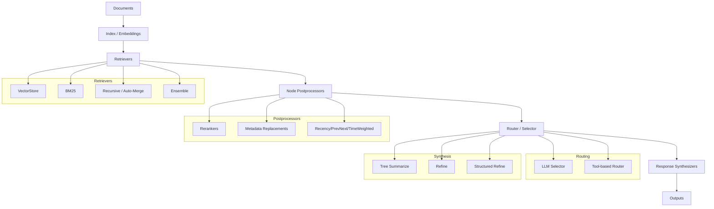

[No sources needed since this diagram shows conceptual architecture, not a direct code mapping]

## Detailed Component Analysis

### Ensemble Query Engine
This example demonstrates:
- Building multiple query engines (keyword and vector) over different chunk sizes
- Using a router to select among engines and a tree-summarizer to combine results
- Evaluating relevance scores and synthesizing coherent answers

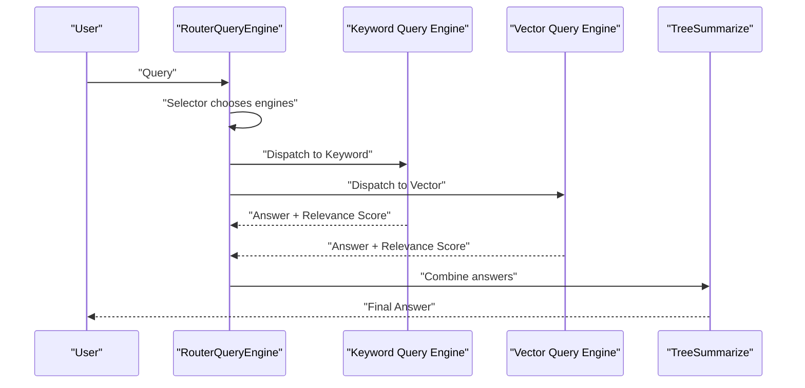

**Diagram sources**
- [ensemble_query_engine.ipynb](file://docs/examples/query_engine/ensemble_query_engine.ipynb#L314-L379)

**Section sources**
- [ensemble_query_engine.ipynb](file://docs/examples/query_engine/ensemble_query_engine.ipynb#L1-L500)

### Ensemble Retrieval and Benchmarking
This example builds an ensemble of vector retrievers across chunk sizes and reranks results:
- Iterates over chunk sizes to build multiple indices
- Uses a recursive retriever pattern to call all retrievers
- Applies a reranker (e.g., Cohere) and evaluates using pairwise comparison and semantic similarity

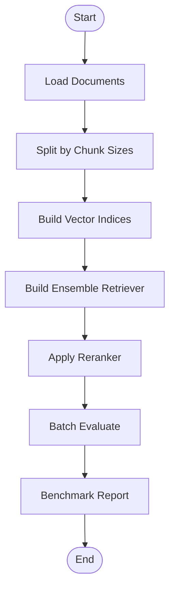

**Diagram sources**
- [ensemble_retrieval.ipynb](file://docs/examples/retrievers/ensemble_retrieval.ipynb#L244-L420)

**Section sources**
- [ensemble_retrieval.ipynb](file://docs/examples/retrievers/ensemble_retrieval.ipynb#L1-L935)

### Response Synthesis: Tree Summarize
Hierarchical summarization aggregates long content into concise summaries:
- Loads a large text document
- Uses TreeSummarize to iteratively compress into a final summary

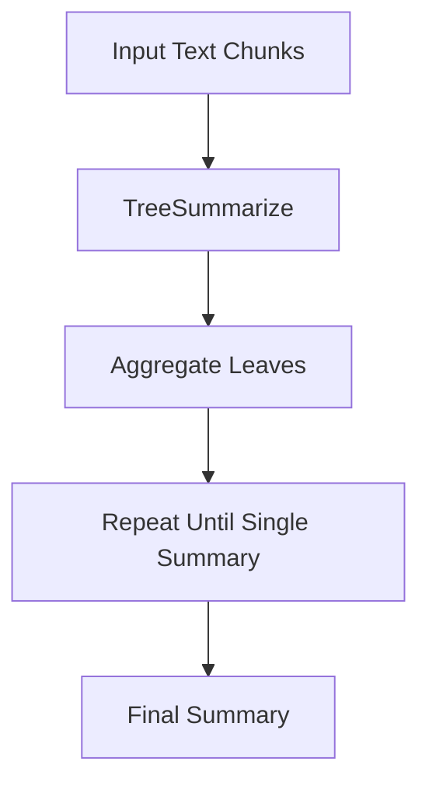

**Diagram sources**
- [tree_summarize.ipynb](file://docs/examples/response_synthesizers/tree_summarize.ipynb#L124-L154)

**Section sources**
- [tree_summarize.ipynb](file://docs/examples/response_synthesizers/tree_summarize.ipynb#L1-L197)

### Node Postprocessors: Rerankers and Metadata Processing
Rerankers prune irrelevant context to reduce latency and improve answer quality:
- SentenceTransformer cross-encoder rerank
- Cohere rerank
- Structured and LLM-based rerankers
- Metadata replacements, recency/post processors, time-weighted processors

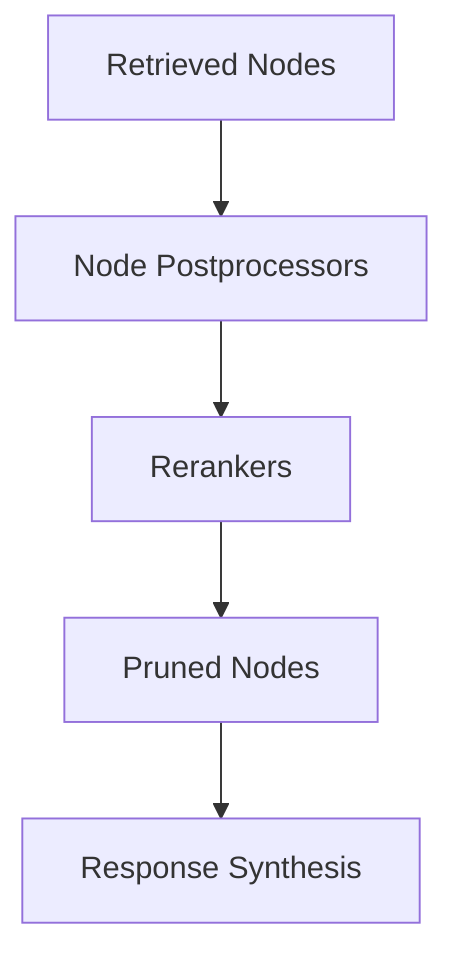

**Diagram sources**
- [SentenceTransformerRerank.ipynb](file://docs/examples/node_postprocessor/SentenceTransformerRerank.ipynb#L135-L140)

**Section sources**
- [SentenceTransformerRerank.ipynb](file://docs/examples/node_postprocessor/SentenceTransformerRerank.ipynb#L1-L363)
- [CohereRerank.ipynb](file://docs/examples/node_postprocessor/CohereRerank.ipynb)
- [LLMReranker-Lyft-10k.ipynb](file://docs/examples/node_postprocessor/LLMReranker-Lyft-10k.ipynb)
- [rankLLM.ipynb](file://docs/examples/node_postprocessor/rankLLM.ipynb)
- [rankGPT.ipynb](file://docs/examples/node_postprocessor/rankGPT.ipynb)
- [Structured-LLMReranker-Lyft-10k.ipynb](file://docs/examples/node_postprocessor/Structured-LLMReranker-Lyft-10k.ipynb)
- [LongContextReorder.ipynb](file://docs/examples/node_postprocessor/LongContextReorder.ipynb)
- [PrevNextPostprocessorDemo.ipynb](file://docs/examples/node_postprocessor/PrevNextPostprocessorDemo.ipynb)
- [RecencyPostprocessorDemo.ipynb](file://docs/examples/node_postprocessor/RecencyPostprocessorDemo.ipynb)
- [TimeWeightedPostprocessorDemo.ipynb](file://docs/examples/node_postprocessor/TimeWeightedPostprocessorDemo.ipynb)
- [PII.ipynb](file://docs/examples/node_postprocessor/PII.ipynb)
- [ibm_watsonx.ipynb](file://docs/examples/node_postprocessor/ibm_watsonx.ipynb)
- [openvino_rerank.ipynb](file://docs/examples/node_postprocessor/openvino_rerank.ipynb)

### Multi-Modal Retrieval: OpenAI GPT-4V
This example demonstrates multimodal retrieval using GPT-4V:
- Initializes OpenAI LLM with GPT-4V
- Loads images from URLs and performs reasoning tasks
- Supports streaming and chat modes

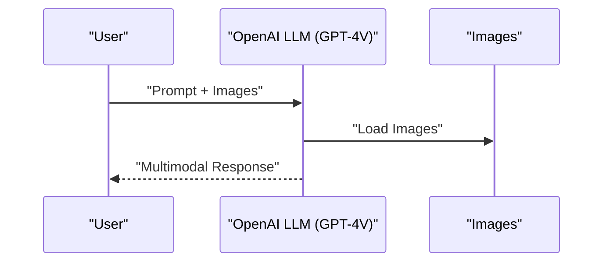

**Diagram sources**
- [openai_multi_modal.ipynb](file://docs/examples/multi_modal/openai_multi_modal.ipynb#L75-L84)

**Section sources**
- [openai_multi_modal.ipynb](file://docs/examples/multi_modal/openai_multi_modal.ipynb#L1-L302)

### Router-based Query Engines
Two router patterns are demonstrated:
- RouterQueryEngine: routes to multiple query engines and combines results
- RetrieverRouterQueryEngine: routes to retrievers and then synthesizes

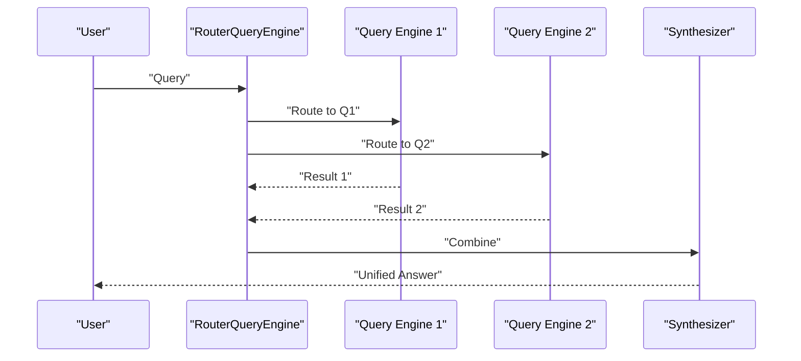

**Diagram sources**
- [RouterQueryEngine.ipynb](file://docs/examples/query_engine/RouterQueryEngine.ipynb)
- [RetrieverRouterQueryEngine.ipynb](file://docs/examples/query_engine/RetrieverRouterQueryEngine.ipynb)

**Section sources**
- [RouterQueryEngine.ipynb](file://docs/examples/query_engine/RouterQueryEngine.ipynb)
- [RetrieverRouterQueryEngine.ipynb](file://docs/examples/query_engine/RetrieverRouterQueryEngine.ipynb)

### Custom Retriever and Query Engine
Examples show building custom retrievers and integrating them into query engines:
- CustomRetrievers: domain-specific retrieval logic
- Custom Prompt Synthesizer: tailored synthesis prompts
- Structured Refine: structured extraction and refinement

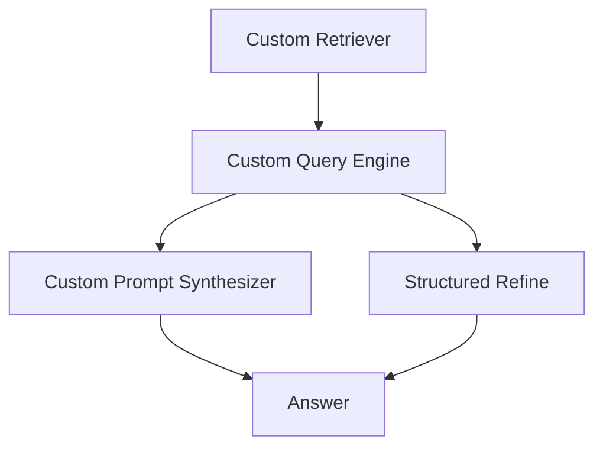

**Diagram sources**
- [CustomRetrievers.ipynb](file://docs/examples/query_engine/CustomRetrievers.ipynb)
- [custom_prompt_synthesizer.ipynb](file://docs/examples/response_synthesizers/custom_prompt_synthesizer.ipynb)
- [structured_refine.ipynb](file://docs/examples/response_synthesizers/structured_refine.ipynb)

**Section sources**
- [CustomRetrievers.ipynb](file://docs/examples/query_engine/CustomRetrievers.ipynb)
- [custom_query_engine.ipynb](file://docs/examples/query_engine/custom_query_engine.ipynb)
- [custom_prompt_synthesizer.ipynb](file://docs/examples/response_synthesizers/custom_prompt_synthesizer.ipynb)
- [structured_refine.ipynb](file://docs/examples/response_synthesizers/structured_refine.ipynb)

### Hybrid Search Strategies
Hybrid retrieval combines BM25 and dense vectors:
- BM25 retriever for lexical matching
- Fusion strategies: simple, reciprocal rank, relative score distribution
- Multi-document hybrid patterns

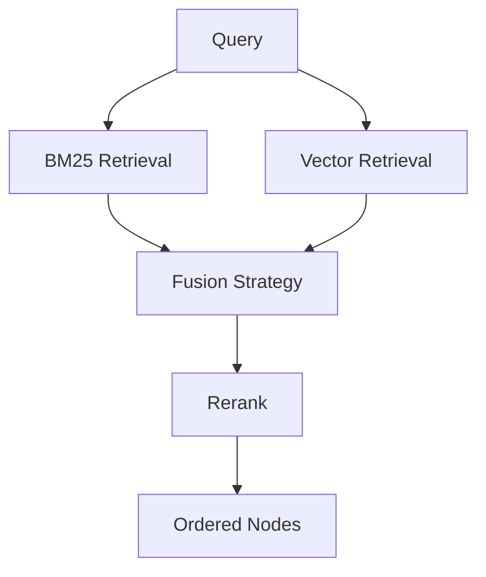

**Diagram sources**
- [bm25_retriever.ipynb](file://docs/examples/retrievers/bm25_retriever.ipynb)
- [simple_fusion.ipynb](file://docs/examples/retrievers/simple_fusion.ipynb)
- [reciprocal_rerank_fusion.ipynb](file://docs/examples/retrievers/reciprocal_rerank_fusion.ipynb)
- [relative_score_dist_fusion.ipynb](file://docs/examples/retrievers/relative_score_dist_fusion.ipynb)
- [multi_doc_together_hybrid.ipynb](file://docs/examples/retrievers/multi_doc_together_hybrid.ipynb)

**Section sources**
- [bm25_retriever.ipynb](file://docs/examples/retrievers/bm25_retriever.ipynb)
- [simple_fusion.ipynb](file://docs/examples/retrievers/simple_fusion.ipynb)
- [reciprocal_rerank_fusion.ipynb](file://docs/examples/retrievers/reciprocal_rerank_fusion.ipynb)
- [relative_score_dist_fusion.ipynb](file://docs/examples/retrievers/relative_score_dist_fusion.ipynb)
- [multi_doc_together_hybrid.ipynb](file://docs/examples/retrievers/multi_doc_together_hybrid.ipynb)

### Advanced Retrieval Patterns
- Auto-merging retriever: merges overlapping results across chunks
- Recursive retrieval: traverses a hierarchy of retrievers
- Composable retrievers: chain multiple retrievers
- Specialized retrievers: Vectara, Vertex AI Search, You.com, VideoDB

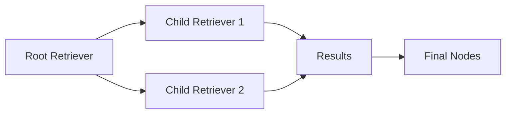

**Diagram sources**
- [auto_merging_retriever.ipynb](file://docs/examples/retrievers/auto_merging_retriever.ipynb)
- [recursive_retriever_nodes.ipynb](file://docs/examples/retrievers/recursive_retriever_nodes.ipynb)
- [composable_retrievers.ipynb](file://docs/examples/retrievers/composable_retrievers.ipynb)
- [vectara_auto_retriever.ipynb](file://docs/examples/retrievers/vectara_auto_retriever.ipynb)
- [vertex_ai_search_retriever.ipynb](file://docs/examples/retrievers/vertex_ai_search_retriever.ipynb)
- [you_retriever.ipynb](file://docs/examples/retrievers/you_retriever.ipynb)
- [deep_memory.ipynb](file://docs/examples/retrievers/deep_memory.ipynb)
- [videodb_retriever.ipynb](file://docs/examples/retrievers/videodb_retriever.ipynb)

**Section sources**
- [auto_merging_retriever.ipynb](file://docs/examples/retrievers/auto_merging_retriever.ipynb)
- [recursive_retriever_nodes.ipynb](file://docs/examples/retrievers/recursive_retriever_nodes.ipynb)
- [composable_retrievers.ipynb](file://docs/examples/retrievers/composable_retrievers.ipynb)
- [vectara_auto_retriever.ipynb](file://docs/examples/retrievers/vectara_auto_retriever.ipynb)
- [vertex_ai_search_retriever.ipynb](file://docs/examples/retrievers/vertex_ai_search_retriever.ipynb)
- [you_retriever.ipynb](file://docs/examples/retrievers/you_retriever.ipynb)
- [deep_memory.ipynb](file://docs/examples/retrievers/deep_memory.ipynb)
- [videodb_retriever.ipynb](file://docs/examples/retrievers/videodb_retriever.ipynb)

### Multi-Source Data Integration and Custom Post-processors
- Multi-document auto-retrieval: orchestrates retrieval across multiple sources
- Sub-question engines: decomposes complex queries into sub-questions
- SQL engines: router, join, and auto-vector SQL query engines
- Knowledge graph engines: graph-aware retrieval and synthesis
- JSON and structured data engines: typed extraction and querying

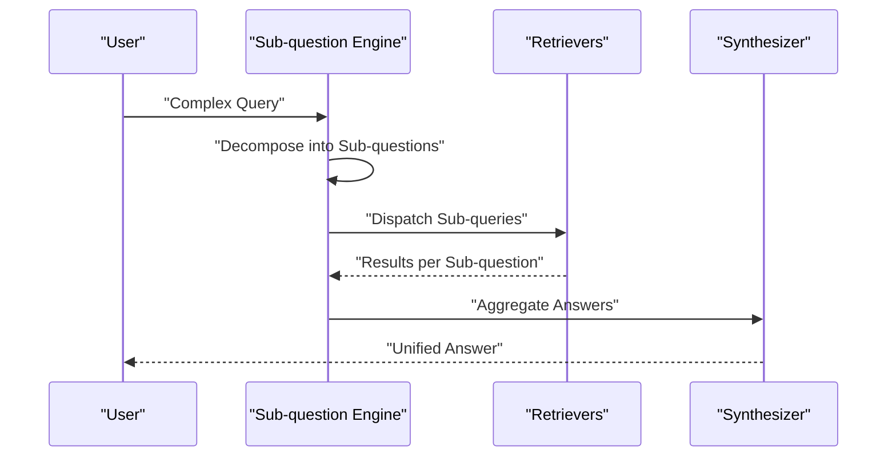

**Diagram sources**
- [sub_question_query_engine.ipynb](file://docs/examples/query_engine/sub_question_query_engine.ipynb)
- [multi_doc_auto_retrieval.ipynb](file://docs/examples/query_engine/multi_doc_auto_retrieval/multi_doc_auto_retrieval.ipynb)

**Section sources**
- [multi_doc_auto_retrieval.ipynb](file://docs/examples/query_engine/multi_doc_auto_retrieval/multi_doc_auto_retrieval.ipynb)
- [sub_question_query_engine.ipynb](file://docs/examples/query_engine/sub_question_query_engine.ipynb)
- [SQLRouterQueryEngine.ipynb](file://docs/examples/query_engine/SQLRouterQueryEngine.ipynb)
- [SQLJoinQueryEngine.ipynb](file://docs/examples/query_engine/SQLJoinQueryEngine.ipynb)
- [SQLAutoVectorQueryEngine.ipynb](file://docs/examples/query_engine/SQLAutoVectorQueryEngine.ipynb)
- [knowledge_graph_query_engine.ipynb](file://docs/examples/query_engine/knowledge_graph_query_engine.ipynb)
- [knowledge_graph_rag_query_engine.ipynb](file://docs/examples/query_engine/knowledge_graph_rag_query_engine.ipynb)
- [JSONalyze_query_engine.ipynb](file://docs/examples/query_engine/JSONalyze_query_engine.ipynb)
- [json_query_engine.ipynb](file://docs/examples/query_engine/json_query_engine.ipynb)
- [pandas_query_engine.ipynb](file://docs/examples/query_engine/pandas_query_engine.ipynb)
- [polars_query_engine.ipynb](file://docs/examples/query_engine/polars_query_engine.ipynb)
- [pydantic_query_engine.ipynb](file://docs/examples/query_engine/pydantic_query_engine.ipynb)
- [cogniswitch_query_engine.ipynb](file://docs/examples/query_engine/cogniswitch_query_engine.ipynb)
- [citation_query_engine.ipynb](file://docs/examples/query_engine/citation_query_engine.ipynb)
- [flare_query_engine.ipynb](file://docs/examples/query_engine/flare_query_engine.ipynb)
- [JointQASummary.ipynb](file://docs/examples/query_engine/JointQASummary.ipynb)

## Dependency Analysis
The examples reveal strong coupling between retrieval, postprocessing, routing, and synthesis components. Key dependencies:
- Retrievers depend on embedding models and index stores
- Postprocessors depend on reranker integrations
- Router components depend on selectors and tool abstractions
- Synthesizers depend on prompt templates and LLMs

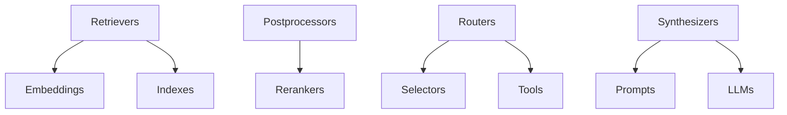

[No sources needed since this diagram shows conceptual dependencies, not a direct code mapping]

## Performance Considerations
- Reranking reduces context size and improves latency while maintaining quality
- Ensemble retrieval and routers increase cost but improve recall and relevance
- Hybrid strategies balance lexical and semantic matching
- Streaming and async patterns reduce perceived latency
- Benchmarking methodologies: pairwise comparison, semantic similarity, and relevance metrics

**Section sources**
- [SentenceTransformerRerank.ipynb](file://docs/examples/node_postprocessor/SentenceTransformerRerank.ipynb#L150-L204)
- [ensemble_retrieval.ipynb](file://docs/examples/retrievers/ensemble_retrieval.ipynb#L611-L763)

## Troubleshooting Guide
Common issues and remedies:
- API rate limits and timeouts: retry with backoff; reduce batch sizes
- Embedding and reranker costs: enable caching; use smaller top_k; apply early pruning
- Selector misrouting: adjust selector prompts; validate tool descriptions
- Multi-modal latency: pre-load images; use streaming responses
- Benchmark inconsistencies: standardize evaluation datasets; use consistent LLMs

**Section sources**
- [SentenceTransformerRerank.ipynb](file://docs/examples/node_postprocessor/SentenceTransformerRerank.ipynb#L150-L204)
- [ensemble_retrieval.ipynb](file://docs/examples/retrievers/ensemble_retrieval.ipynb#L537-L763)

## Conclusion
These intermediate examples demonstrate how to compose LlamaIndex components into robust, scalable RAG systems. By leveraging ensembles, routers, hybrid retrieval, and advanced synthesis techniques—combined with rigorous benchmarking—you can tailor solutions to complex domains and performance constraints.

## Appendices
- Additional response synthesis examples: refine, structured refine, long-context testing, Pydantic summarization
- Additional postprocessor examples: metadata replacements, recency/time-aware processors, structured rerankers
- Additional retrieval examples: BM25, auto-merging, recursive, composable, and specialized retrievers

**Section sources**
- [refine.ipynb](file://docs/examples/response_synthesizers/refine.ipynb)
- [structured_refine.ipynb](file://docs/examples/response_synthesizers/structured_refine.ipynb)
- [long_context_test.ipynb](file://docs/examples/response_synthesizers/long_context_test.ipynb)
- [pydantic_tree_summarize.ipynb](file://docs/examples/response_synthesizers/pydantic_tree_summarize.ipynb)
- [CohereRerank.ipynb](file://docs/examples/node_postprocessor/CohereRerank.ipynb)
- [LLMReranker-Lyft-10k.ipynb](file://docs/examples/node_postprocessor/LLMReranker-Lyft-10k.ipynb)
- [rankLLM.ipynb](file://docs/examples/node_postprocessor/rankLLM.ipynb)
- [rankGPT.ipynb](file://docs/examples/node_postprocessor/rankGPT.ipynb)
- [Structured-LLMReranker-Lyft-10k.ipynb](file://docs/examples/node_postprocessor/Structured-LLMReranker-Lyft-10k.ipynb)
- [LongContextReorder.ipynb](file://docs/examples/node_postprocessor/LongContextReorder.ipynb)
- [PrevNextPostprocessorDemo.ipynb](file://docs/examples/node_postprocessor/PrevNextPostprocessorDemo.ipynb)
- [RecencyPostprocessorDemo.ipynb](file://docs/examples/node_postprocessor/RecencyPostprocessorDemo.ipynb)
- [TimeWeightedPostprocessorDemo.ipynb](file://docs/examples/node_postprocessor/TimeWeightedPostprocessorDemo.ipynb)
- [PII.ipynb](file://docs/examples/node_postprocessor/PII.ipynb)
- [ibm_watsonx.ipynb](file://docs/examples/node_postprocessor/ibm_watsonx.ipynb)
- [openvino_rerank.ipynb](file://docs/examples/node_postprocessor/openvino_rerank.ipynb)