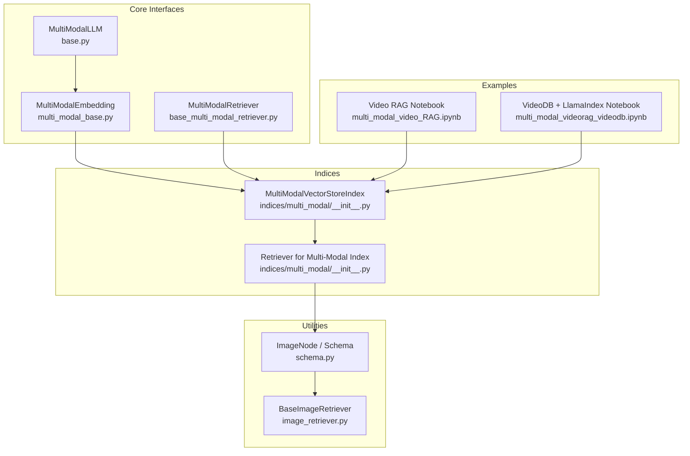
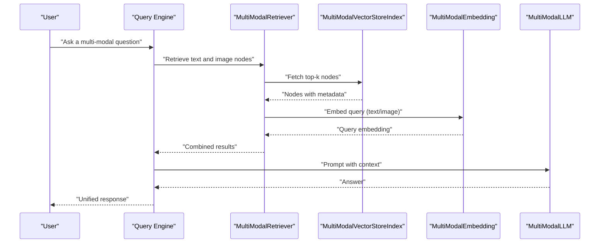
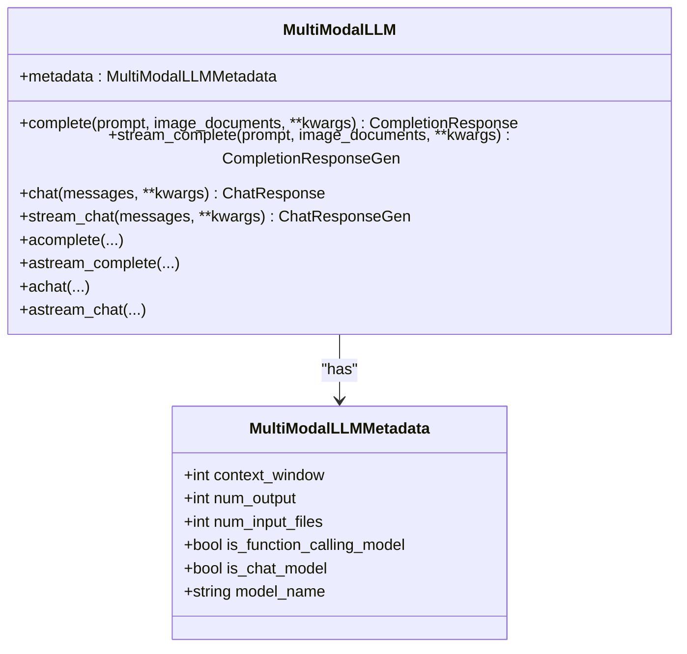
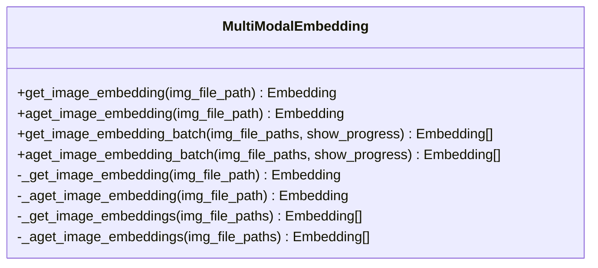
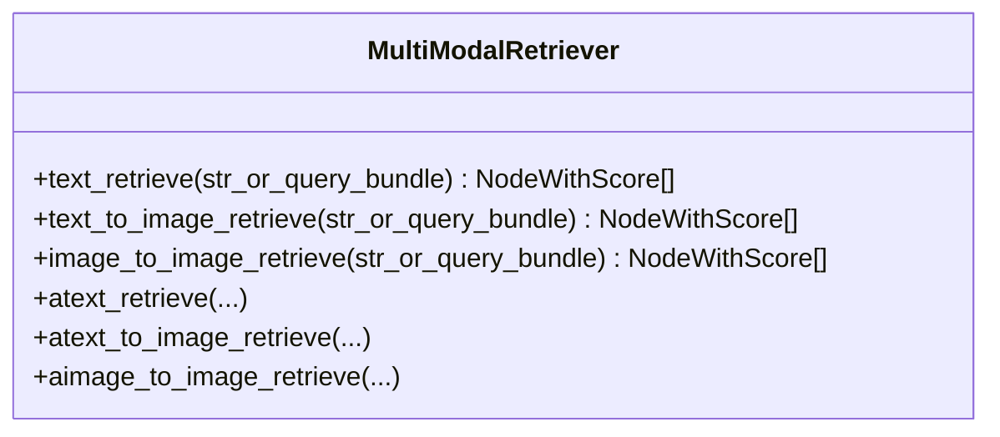
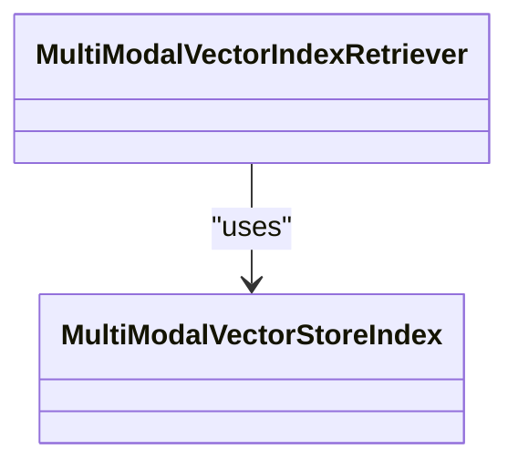
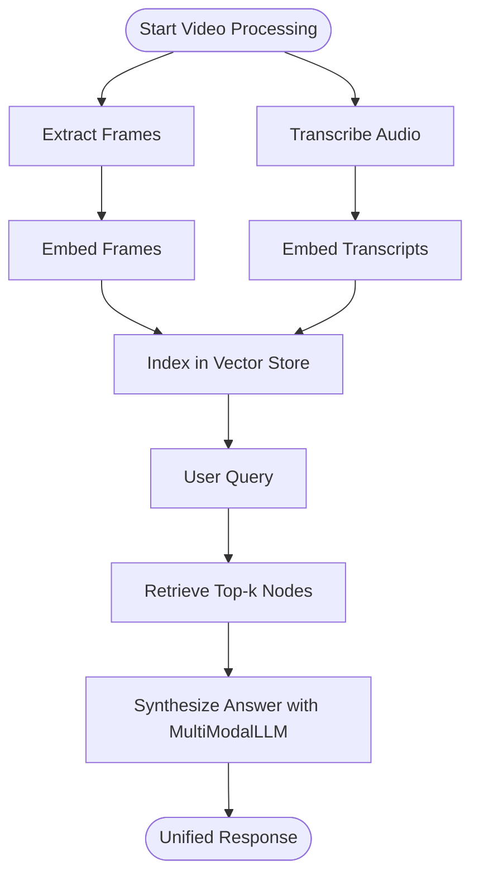
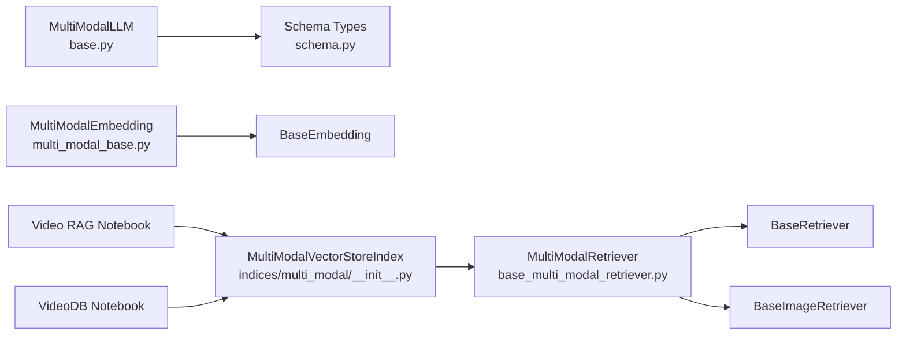

# Multi-Modal Processing

<cite>
**Referenced Files in This Document**
- [base.py](file://llama-index-core/llama_index/core/multi_modal_llms/base.py)
- [__init__.py](file://llama-index-core/llama_index/core/multi_modal_llms/__init__.py)
- [multi_modal_base.py](file://llama-index-core/llama_index/core/embeddings/multi_modal_base.py)
- [base_multi_modal_retriever.py](file://llama-index-core/llama_index/core/base/base_multi_modal_retriever.py)
- [__init__.py](file://llama-index-core/llama_index/core/indices/multi_modal/__init__.py)
- [schema.py](file://llama-index-core/llama_index/core/schema.py)
- [image_retriever.py](file://llama-index-core/llama_index/core/image_retriever.py)
- [multi_modal_video_RAG.ipynb](file://docs/examples/multi_modal/multi_modal_video_RAG.ipynb)
- [multi_modal_videorag_videodb.ipynb](file://docs/examples/multi_modal/multi_modal_videorag_videodb.ipynb)
- [simple_multi_modal.md](file://docs/api_reference/api_reference/query_engine/simple_multi_modal.md)
- [multi_modal.md](file://docs/api_reference/api_reference/evaluation/multi_modal.md)
- [multi_modal.md](file://docs/api_reference/api_reference/program/multi_modal.md)
</cite>

## Table of Contents
1. [Introduction](#introduction)
2. [Project Structure](#project-structure)
3. [Core Components](#core-components)
4. [Architecture Overview](#architecture-overview)
5. [Detailed Component Analysis](#detailed-component-analysis)
6. [Dependency Analysis](#dependency-analysis)
7. [Performance Considerations](#performance-considerations)
8. [Troubleshooting Guide](#troubleshooting-guide)
9. [Conclusion](#conclusion)
10. [Appendices](#appendices)

## Introduction
This document explains multi-modal processing capabilities in LlamaIndex with a focus on text-image, text-video, and structured data integration. It covers multi-modal embedding strategies, cross-modal retrieval techniques, and unified query processing. It also provides practical guidance for integrating vision-language models, video analysis pipelines, and document understanding systems, including data preprocessing, embedding alignment, retrieval optimization, and performance considerations for scalable workloads.

## Project Structure
LlamaIndex organizes multi-modal capabilities across several core areas:
- Multi-modal LLM interface for vision-language generation
- Multi-modal embeddings for images and hybrid modalities
- Retrievers supporting text-to-text, text-to-image, and image-to-image retrieval
- Indices enabling multi-modal vector stores and retrieval
- Example notebooks demonstrating video RAG and multimodal pipelines
- API references for simple multi-modal query engines and evaluation

**Diagram sources**
- [base.py](file://llama-index-core/llama_index/core/multi_modal_llms/base.py#L75-L183)
- [multi_modal_base.py](file://llama-index-core/llama_index/core/embeddings/multi_modal_base.py#L16-L187)
- [base_multi_modal_retriever.py](file://llama-index-core/llama_index/core/base/base_multi_modal_retriever.py#L12-L78)
- [__init__.py](file://llama-index-core/llama_index/core/indices/multi_modal/__init__.py#L1-L12)
- [schema.py](file://llama-index-core/llama_index/core/schema.py#L1-L200)
- [image_retriever.py](file://llama-index-core/llama_index/core/image_retriever.py#L1-L200)
- [multi_modal_video_RAG.ipynb](file://docs/examples/multi_modal/multi_modal_video_RAG.ipynb#L1-L433)
- [multi_modal_videorag_videodb.ipynb](file://docs/examples/multi_modal/multi_modal_videorag_videodb.ipynb#L1-L452)

**Section sources**
- [base.py](file://llama-index-core/llama_index/core/multi_modal_llms/base.py#L1-L183)
- [multi_modal_base.py](file://llama-index-core/llama_index/core/embeddings/multi_modal_base.py#L1-L187)
- [base_multi_modal_retriever.py](file://llama-index-core/llama_index/core/base/base_multi_modal_retriever.py#L1-L78)
- [__init__.py](file://llama-index-core/llama_index/core/indices/multi_modal/__init__.py#L1-L12)
- [schema.py](file://llama-index-core/llama_index/core/schema.py#L1-L200)
- [image_retriever.py](file://llama-index-core/llama_index/core/image_retriever.py#L1-L200)
- [multi_modal_video_RAG.ipynb](file://docs/examples/multi_modal/multi_modal_video_RAG.ipynb#L1-L433)
- [multi_modal_videorag_videodb.ipynb](file://docs/examples/multi_modal/multi_modal_videorag_videodb.ipynb#L1-L452)

## Core Components
- MultiModalLLM: Defines the multi-modal LLM interface with completion/chat endpoints for text plus images, and async variants. See [MultiModalLLM](file://llama-index-core/llama_index/core/multi_modal_llms/base.py#L75-L183).
- MultiModalEmbedding: Base class for multi-modal embeddings with synchronous/asynchronous single and batch image embedding APIs. See [MultiModalEmbedding](file://llama-index-core/llama_index/core/embeddings/multi_modal_base.py#L16-L187).
- MultiModalRetriever: Base interface for cross-modal retrieval including text-to-text, text-to-image, and image-to-image retrieval. See [MultiModalRetriever](file://llama-index-core/llama_index/core/base/base_multi_modal_retriever.py#L12-L78).
- MultiModalVectorStoreIndex and retriever: Multi-modal index and retriever entry points. See [indices/multi_modal/__init__.py](file://llama-index-core/llama_index/core/indices/multi_modal/__init__.py#L1-L12).
- ImageNode and schema: Core node types and schema utilities for multi-modal data. See [schema.py](file://llama-index-core/llama_index/core/schema.py#L1-L200).
- BaseImageRetriever: Shared base for image retrieval. See [image_retriever.py](file://llama-index-core/llama_index/core/image_retriever.py#L1-L200).

**Section sources**
- [base.py](file://llama-index-core/llama_index/core/multi_modal_llms/base.py#L75-L183)
- [multi_modal_base.py](file://llama-index-core/llama_index/core/embeddings/multi_modal_base.py#L16-L187)
- [base_multi_modal_retriever.py](file://llama-index-core/llama_index/core/base/base_multi_modal_retriever.py#L12-L78)
- [__init__.py](file://llama-index-core/llama_index/core/indices/multi_modal/__init__.py#L1-L12)
- [schema.py](file://llama-index-core/llama_index/core/schema.py#L1-L200)
- [image_retriever.py](file://llama-index-core/llama_index/core/image_retriever.py#L1-L200)

## Architecture Overview
The multi-modal pipeline integrates data ingestion, embedding, indexing, and retrieval across modalities. At a high level:
- Data ingestion produces heterogeneous nodes (text, images, structured).
- Multi-modal embeddings produce aligned vectors for text and images.
- A multi-modal index stores vectors and metadata for retrieval.
- Retrievers support cross-modal queries (text-to-image, image-to-image).
- Query engines synthesize answers using multi-modal LLMs.

**Diagram sources**
- [base.py](file://llama-index-core/llama_index/core/multi_modal_llms/base.py#L75-L183)
- [multi_modal_base.py](file://llama-index-core/llama_index/core/embeddings/multi_modal_base.py#L16-L187)
- [base_multi_modal_retriever.py](file://llama-index-core/llama_index/core/base/base_multi_modal_retriever.py#L12-L78)
- [__init__.py](file://llama-index-core/llama_index/core/indices/multi_modal/__init__.py#L1-L12)

## Detailed Component Analysis

### Multi-Modal LLM Interface
- Purpose: Unified interface for vision-language generation with text prompts and image inputs.
- Key methods: complete/stream_complete/chat/stream_chat and async variants.
- Metadata: context window, output tokens, function calling capability, chat capability, model name.

**Diagram sources**
- [base.py](file://llama-index-core/llama_index/core/multi_modal_llms/base.py#L30-L183)

**Section sources**
- [base.py](file://llama-index-core/llama_index/core/multi_modal_llms/base.py#L30-L183)
- [__init__.py](file://llama-index-core/llama_index/core/multi_modal_llms/__init__.py#L1-L10)

### Multi-Modal Embedding Strategy
- Purpose: Produce aligned embeddings for images and text to enable cross-modal retrieval.
- Capabilities: Single image embedding, batch embedding, async variants, and progress reporting.

**Diagram sources**
- [multi_modal_base.py](file://llama-index-core/llama_index/core/embeddings/multi_modal_base.py#L16-L187)

**Section sources**
- [multi_modal_base.py](file://llama-index-core/llama_index/core/embeddings/multi_modal_base.py#L16-L187)

### Cross-Modal Retrieval
- Purpose: Retrieve relevant nodes across modalities using a unified retriever interface.
- Methods: text_retrieve, text_to_image_retrieve, image_to_image_retrieve and async counterparts.

**Diagram sources**
- [base_multi_modal_retriever.py](file://llama-index-core/llama_index/core/base/base_multi_modal_retriever.py#L12-L78)

**Section sources**
- [base_multi_modal_retriever.py](file://llama-index-core/llama_index/core/base/base_multi_modal_retriever.py#L12-L78)

### Multi-Modal Index and Retriever
- Purpose: Provide a multi-modal vector store index and retriever for hybrid retrieval.
- Entry points: MultiModalVectorStoreIndex and MultiModalVectorIndexRetriever.

**Diagram sources**
- [__init__.py](file://llama-index-core/llama_index/core/indices/multi_modal/__init__.py#L1-L12)

**Section sources**
- [__init__.py](file://llama-index-core/llama_index/core/indices/multi_modal/__init__.py#L1-L12)

### Data Structures for Multi-Modal Workflows
- Purpose: Define node types and schema utilities for multi-modal data.
- Highlights: ImageNode and related types, templates, and helpers for pretty-printing and truncation.

**Section sources**
- [schema.py](file://llama-index-core/llama_index/core/schema.py#L1-L200)

### Image Retrieval Utilities
- Purpose: Provide shared base for image retrieval and utilities.
- Highlights: BaseImageRetriever and related interfaces.

**Section sources**
- [image_retriever.py](file://llama-index-core/llama_index/core/image_retriever.py#L1-L200)

### Text-Image, Text-Video, Structured Data Integration
- Text-image: Use MultiModalEmbedding to embed images and store in a vector store alongside text nodes. Retrieve text and images jointly for unified query processing.
- Text-video: Preprocess video into frames/audio transcripts; embed frames and transcripts; retrieve relevant clips and context; synthesize answers via MultiModalLLM.
- Structured data: Integrate structured metadata with text nodes to enrich retrieval and synthesis.

[No sources needed since this section provides conceptual guidance]

### Practical Examples and Pipelines
- Video RAG with CLIP embeddings and LanceDB vector store: Demonstrates frame extraction, audio transcription, multi-modal indexing, and retrieval with a vision-language model.
- VideoDB + LlamaIndex: Integrates VideoDB scene and transcript indexing with LlamaIndex retrieval and streaming video clips.

**Diagram sources**
- [multi_modal_video_RAG.ipynb](file://docs/examples/multi_modal/multi_modal_video_RAG.ipynb#L1-L433)
- [multi_modal_videorag_videodb.ipynb](file://docs/examples/multi_modal/multi_modal_videorag_videodb.ipynb#L1-L452)

**Section sources**
- [multi_modal_video_RAG.ipynb](file://docs/examples/multi_modal/multi_modal_video_RAG.ipynb#L1-L433)
- [multi_modal_videorag_videodb.ipynb](file://docs/examples/multi_modal/multi_modal_videorag_videodb.ipynb#L1-L452)

## Dependency Analysis
- MultiModalLLM depends on schema types (e.g., ImageBlock) and callback infrastructure.
- MultiModalEmbedding extends BaseEmbedding and integrates with callback manager and progress utilities.
- MultiModalRetriever composes BaseRetriever and BaseImageRetriever to support cross-modal retrieval.
- Indices expose MultiModalVectorStoreIndex and retriever entry points.
- Examples depend on external integrations (e.g., CLIP, VideoDB) and vector stores.

**Diagram sources**
- [base.py](file://llama-index-core/llama_index/core/multi_modal_llms/base.py#L1-L183)
- [multi_modal_base.py](file://llama-index-core/llama_index/core/embeddings/multi_modal_base.py#L1-L187)
- [base_multi_modal_retriever.py](file://llama-index-core/llama_index/core/base/base_multi_modal_retriever.py#L1-L78)
- [__init__.py](file://llama-index-core/llama_index/core/indices/multi_modal/__init__.py#L1-L12)
- [schema.py](file://llama-index-core/llama_index/core/schema.py#L1-L200)
- [image_retriever.py](file://llama-index-core/llama_index/core/image_retriever.py#L1-L200)
- [multi_modal_video_RAG.ipynb](file://docs/examples/multi_modal/multi_modal_video_RAG.ipynb#L1-L433)
- [multi_modal_videorag_videodb.ipynb](file://docs/examples/multi_modal/multi_modal_videorag_videodb.ipynb#L1-L452)

**Section sources**
- [base.py](file://llama-index-core/llama_index/core/multi_modal_llms/base.py#L1-L183)
- [multi_modal_base.py](file://llama-index-core/llama_index/core/embeddings/multi_modal_base.py#L1-L187)
- [base_multi_modal_retriever.py](file://llama-index-core/llama_index/core/base/base_multi_modal_retriever.py#L1-L78)
- [__init__.py](file://llama-index-core/llama_index/core/indices/multi_modal/__init__.py#L1-L12)
- [schema.py](file://llama-index-core/llama_index/core/schema.py#L1-L200)
- [image_retriever.py](file://llama-index-core/llama_index/core/image_retriever.py#L1-L200)
- [multi_modal_video_RAG.ipynb](file://docs/examples/multi_modal/multi_modal_video_RAG.ipynb#L1-L433)
- [multi_modal_videorag_videodb.ipynb](file://docs/examples/multi_modal/multi_modal_videorag_videodb.ipynb#L1-L452)

## Performance Considerations
- Embedding batching: Use batch APIs for image embeddings to reduce overhead and improve throughput. See [get_image_embedding_batch](file://llama-index-core/llama_index/core/embeddings/multi_modal_base.py#L95-L129) and [aget_image_embedding_batch](file://llama-index-core/llama_index/core/embeddings/multi_modal_base.py#L131-L186).
- Asynchronous retrieval: Prefer async retrieval APIs to overlap I/O and computation. See [MultiModalRetriever async methods](file://llama-index-core/llama_index/core/base/base_multi_modal_retriever.py#L47-L77).
- Progress reporting: Enable progress indicators for long-running batch operations. See [progress-enabled batches](file://llama-index-core/llama_index/core/embeddings/multi_modal_base.py#L96-L129).
- Vector store selection: Choose a vector store optimized for multi-modal embeddings and large-scale retrieval (e.g., LanceDB as demonstrated in examples).
- Memory management: Limit concurrent embedding requests and chunk sizes to avoid OOM; leverage async concurrency judiciously.
- Scalability: Horizontal scaling via distributed vector stores and sharded retrieval; cache frequently accessed embeddings.

[No sources needed since this section provides general guidance]

## Troubleshooting Guide
- Embedding failures: Verify image paths and formats; ensure batch size aligns with device capacity; monitor callback events for errors. See [MultiModalEmbedding callbacks](file://llama-index-core/llama_index/core/embeddings/multi_modal_base.py#L41-L67).
- Retrieval mismatches: Confirm query modality alignment (text vs. image) and adjust similarity thresholds; validate node metadata for correct modalities. See [MultiModalRetriever methods](file://llama-index-core/llama_index/core/base/base_multi_modal_retriever.py#L15-L77).
- Video pipeline issues: Validate frame extraction and audio transcription steps; ensure vector store indexing completes successfully; confirm LLM prompt templates include both text and image context. See [Video RAG notebook](file://docs/examples/multi_modal/multi_modal_video_RAG.ipynb#L1-L433) and [VideoDB notebook](file://docs/examples/multi_modal/multi_modal_videorag_videodb.ipynb#L1-L452).

**Section sources**
- [multi_modal_base.py](file://llama-index-core/llama_index/core/embeddings/multi_modal_base.py#L41-L67)
- [base_multi_modal_retriever.py](file://llama-index-core/llama_index/core/base/base_multi_modal_retriever.py#L15-L77)
- [multi_modal_video_RAG.ipynb](file://docs/examples/multi_modal/multi_modal_video_RAG.ipynb#L1-L433)
- [multi_modal_videorag_videodb.ipynb](file://docs/examples/multi_modal/multi_modal_videorag_videodb.ipynb#L1-L452)

## Conclusion
LlamaIndex provides a cohesive framework for multi-modal processing across text-image, text-video, and structured data. Its interfaces for multi-modal LLMs, embeddings, retrieval, and indices enable unified query processing and scalable pipelines. Practical examples demonstrate end-to-end workflows for video RAG and integration with external systems like VideoDB and CLIP-based embeddings. By leveraging batching, async APIs, and appropriate vector stores, teams can achieve high-performance, production-ready multi-modal RAG systems.

[No sources needed since this section summarizes without analyzing specific files]

## Appendices
- API references for simple multi-modal query engines and evaluation programs are available under the API reference documentation.

**Section sources**
- [simple_multi_modal.md](file://docs/api_reference/api_reference/query_engine/simple_multi_modal.md#L1-L200)
- [multi_modal.md](file://docs/api_reference/api_reference/evaluation/multi_modal.md#L1-L200)
- [multi_modal.md](file://docs/api_reference/api_reference/program/multi_modal.md#L1-L200)