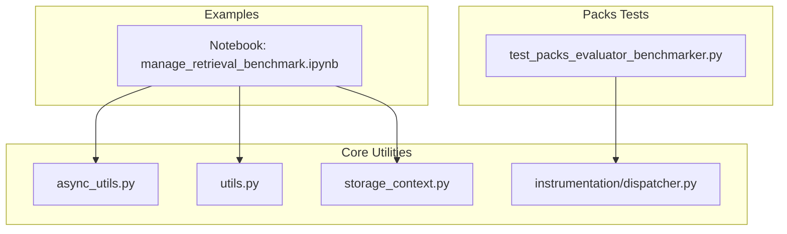
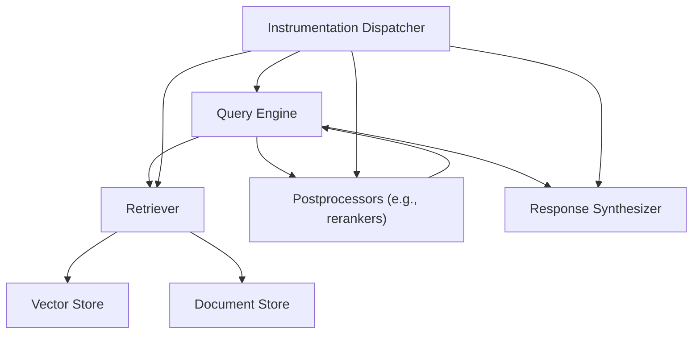
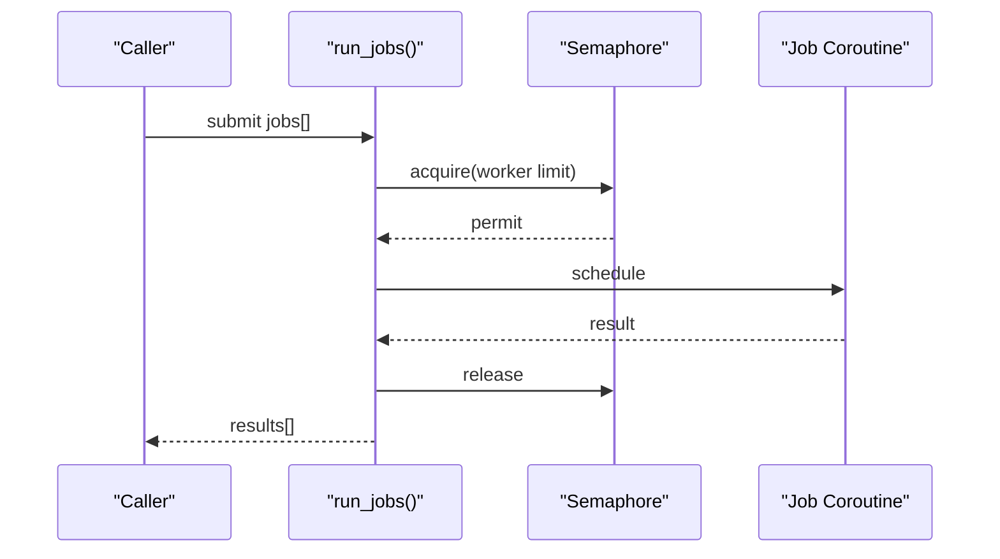
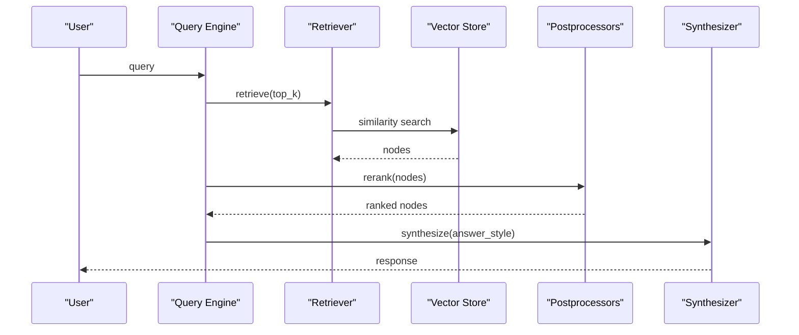
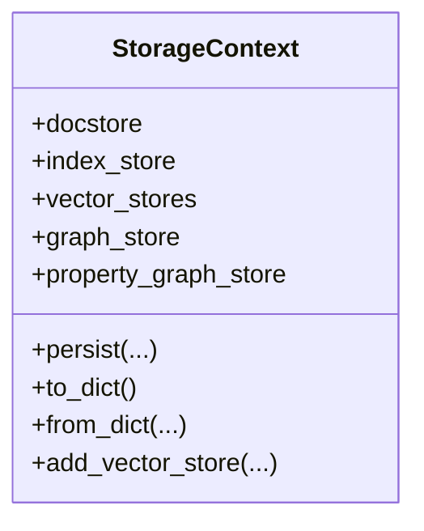
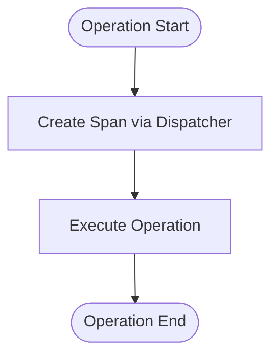
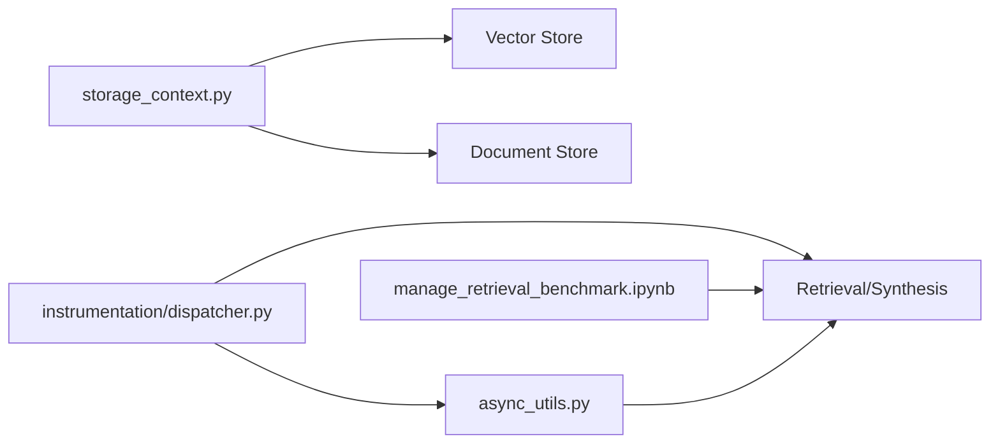

# Performance Optimization

<cite>
**Referenced Files in This Document**
- [manage_retrieval_benchmark.ipynb](file://docs/examples/managed/manage_retrieval_benchmark.ipynb)
- [test_packs_evaluator_benchmarker.py](file://llama-index-packs/llama-index-packs-evaluator-benchmarker/tests/test_packs_evaluator_benchmarker.py)
- [async_utils.py](file://llama-index-core/llama_index/core/async_utils.py)
- [utils.py](file://llama-index-core/llama_index/core/utils.py)
- [storage_context.py](file://llama-index-core/llama_index/core/storage/storage_context.py)
- [dispatcher.py](file://llama-index-core/llama_index/core/instrumentation/dispatcher.py)
</cite>

## Table of Contents
1. [Introduction](#introduction)
2. [Project Structure](#project-structure)
3. [Core Components](#core-components)
4. [Architecture Overview](#architecture-overview)
5. [Detailed Component Analysis](#detailed-component-analysis)
6. [Dependency Analysis](#dependency-analysis)
7. [Performance Considerations](#performance-considerations)
8. [Troubleshooting Guide](#troubleshooting-guide)
9. [Conclusion](#conclusion)
10. [Appendices](#appendices)

## Introduction
This document provides a comprehensive guide to performance optimization for LlamaIndex applications. It covers benchmarking methodologies, parameter tuning, system-level optimizations, memory management, caching, batch processing, profiling and monitoring, bottleneck identification, scaling strategies, and cost-aware trade-offs between performance and accuracy. The guidance is grounded in the repository’s examples and core modules that directly impact throughput, latency, resource utilization, and reliability.

## Project Structure
The repository includes:
- Example notebooks demonstrating retrieval benchmarking across managed providers and hybrid pipelines
- Core utilities for async orchestration, batching, retries, token counting, and device inference
- Storage context for persistence and vector store management
- Instrumentation dispatcher for observability hooks

**Diagram sources**
- [manage_retrieval_benchmark.ipynb](file://docs/examples/managed/manage_retrieval_benchmark.ipynb#L1-L1686)
- [async_utils.py](file://llama-index-core/llama_index/core/async_utils.py#L1-L175)
- [utils.py](file://llama-index-core/llama_index/core/utils.py#L1-L705)
- [storage_context.py](file://llama-index-core/llama_index/core/storage/storage_context.py#L1-L278)
- [dispatcher.py](file://llama-index-core/llama_index/core/instrumentation/dispatcher.py#L1-L9)
- [test_packs_evaluator_benchmarker.py](file://llama-index-packs/llama-index-packs-evaluator-benchmarker/tests/test_packs_evaluator_benchmarker.py#L1-L8)

**Section sources**
- [manage_retrieval_benchmark.ipynb](file://docs/examples/managed/manage_retrieval_benchmark.ipynb#L1-L1686)
- [async_utils.py](file://llama-index-core/llama_index/core/async_utils.py#L1-L175)
- [utils.py](file://llama-index-core/llama_index/core/utils.py#L1-L705)
- [storage_context.py](file://llama-index-core/llama_index/core/storage/storage_context.py#L1-L278)
- [dispatcher.py](file://llama-index-core/llama_index/core/instrumentation/dispatcher.py#L1-L9)
- [test_packs_evaluator_benchmarker.py](file://llama-index-packs/llama-index-packs-evaluator-benchmarker/tests/test_packs_evaluator_benchmarker.py#L1-L8)

## Core Components
- Asynchronous orchestration and batching: Provides concurrency control, progress reporting, and chunked execution to improve throughput and reduce tail latencies.
- Utilities for retries with exponential backoff, token counting, and device inference: Support robustness and efficient resource selection.
- Storage context and vector store management: Centralizes persistence and retrieval store configuration for scalable data access.
- Instrumentation dispatcher: Enables hooking into spans and events for observability and profiling.

Key capabilities:
- Concurrency limiting via semaphores and gather-based pooling
- Batched execution with configurable chunk sizes
- Progress-aware async execution for Jupyter and CLI contexts
- Retry policies with exponential backoff for transient failures
- Tokenization and caching for tokenizer resources
- Device inference for GPU/MPS/CPU selection
- Persistence and namespacing for vector stores

**Section sources**
- [async_utils.py](file://llama-index-core/llama_index/core/async_utils.py#L103-L175)
- [utils.py](file://llama-index-core/llama_index/core/utils.py#L229-L348)
- [utils.py](file://llama-index-core/llama_index/core/utils.py#L401-L404)
- [utils.py](file://llama-index-core/llama_index/core/utils.py#L571-L583)
- [storage_context.py](file://llama-index-core/llama_index/core/storage/storage_context.py#L73-L149)
- [dispatcher.py](file://llama-index-core/llama_index/core/instrumentation/dispatcher.py#L1-L9)

## Architecture Overview
The performance architecture centers on:
- Retrieval and synthesis pipelines with optional reranking
- Async orchestration for parallelism and throughput
- Persistent storage abstractions for vector and document stores
- Observability hooks for tracing and metrics

**Diagram sources**
- [manage_retrieval_benchmark.ipynb](file://docs/examples/managed/manage_retrieval_benchmark.ipynb#L681-L792)
- [dispatcher.py](file://llama-index-core/llama_index/core/instrumentation/dispatcher.py#L1-L9)

## Detailed Component Analysis

### Asynchronous Execution and Batching
This component enables:
- Worker pools with configurable concurrency limits
- Chunked execution to process large task sets efficiently
- Progress bars for visibility in interactive environments
- Nested event loop handling for notebooks

**Diagram sources**
- [async_utils.py](file://llama-index-core/llama_index/core/async_utils.py#L137-L175)

Operational highlights:
- Concurrency control via semaphores to prevent resource saturation
- Batched gather with configurable chunk size to bound memory and improve throughput
- Progress-aware execution with fallbacks for unsupported environments
- Nested loop handling for notebook contexts

**Section sources**
- [async_utils.py](file://llama-index-core/llama_index/core/async_utils.py#L103-L175)

### Benchmarking and Retrieval Pipelines
The notebook demonstrates:
- Comparing retrieval strategies across providers
- Hybrid pipelines combining retrieval, reranking, and synthesis
- Configurable answer styles and rerankers (LLM-based and cross-encoder)

**Diagram sources**
- [manage_retrieval_benchmark.ipynb](file://docs/examples/managed/manage_retrieval_benchmark.ipynb#L681-L792)

Practical guidance:
- Tune similarity_top_k and reranker top_n to balance recall and latency
- Prefer cross-encoder rerankers for latency-sensitive scenarios when feasible
- Use provider-specific answer styles to control response behavior

**Section sources**
- [manage_retrieval_benchmark.ipynb](file://docs/examples/managed/manage_retrieval_benchmark.ipynb#L14-L21)
- [manage_retrieval_benchmark.ipynb](file://docs/examples/managed/manage_retrieval_benchmark.ipynb#L681-L792)

### Storage Context and Vector Stores
The storage context manages:
- Document, index, graph, and vector stores
- Namespaced vector stores for multi-modal or domain isolation
- Persistence and restoration from persistent directories

**Diagram sources**
- [storage_context.py](file://llama-index-core/llama_index/core/storage/storage_context.py#L52-L278)

Best practices:
- Use namespaced vector stores to isolate domains and scale independently
- Persist frequently to reduce cold-start costs during restarts
- Choose appropriate vector store backends for workload characteristics

**Section sources**
- [storage_context.py](file://llama-index-core/llama_index/core/storage/storage_context.py#L73-L149)
- [storage_context.py](file://llama-index-core/llama_index/core/storage/storage_context.py#L151-L203)

### Instrumentation Dispatcher
The dispatcher integrates with the instrumentation subsystem to:
- Wrap spans around performance-sensitive operations
- Enable tagging and event dispatching for observability

**Diagram sources**
- [dispatcher.py](file://llama-index-core/llama_index/core/instrumentation/dispatcher.py#L1-L9)

**Section sources**
- [dispatcher.py](file://llama-index-core/llama_index/core/instrumentation/dispatcher.py#L1-L9)

## Dependency Analysis
Key dependencies and relationships:
- Retrieval pipelines depend on vector stores and document stores managed by the storage context
- Asynchronous utilities underpin parallel execution in retrieval and synthesis
- Instrumentation dispatcher provides hooks for tracing and metrics collection
- Benchmarking notebook orchestrates retrieval, reranking, and synthesis for comparative evaluation

**Diagram sources**
- [async_utils.py](file://llama-index-core/llama_index/core/async_utils.py#L103-L175)
- [storage_context.py](file://llama-index-core/llama_index/core/storage/storage_context.py#L73-L149)
- [manage_retrieval_benchmark.ipynb](file://docs/examples/managed/manage_retrieval_benchmark.ipynb#L681-L792)
- [dispatcher.py](file://llama-index-core/llama_index/core/instrumentation/dispatcher.py#L1-L9)

**Section sources**
- [async_utils.py](file://llama-index-core/llama_index/core/async_utils.py#L103-L175)
- [storage_context.py](file://llama-index-core/llama_index/core/storage/storage_context.py#L73-L149)
- [manage_retrieval_benchmark.ipynb](file://docs/examples/managed/manage_retrieval_benchmark.ipynb#L681-L792)
- [dispatcher.py](file://llama-index-core/llama_index/core/instrumentation/dispatcher.py#L1-L9)

## Performance Considerations
- Throughput and latency
  - Increase concurrency within safe bounds to utilize CPU/GPU cores effectively
  - Use batched execution to amortize overhead and reduce tail latencies
  - Limit simultaneous heavy operations (embedding, reranking) to prevent queueing and saturation

- Memory management
  - Control batch sizes to fit within available memory; adjust chunk sizes dynamically
  - Reuse tokenizers and caches to minimize repeated allocations
  - Persist storage artifacts to reduce cold-start and re-computation costs

- Parameter tuning
  - similarity_top_k and reranker top_n: trade off recall and latency
  - Temperature and answer styles: influence synthesis speed and determinism
  - Worker counts: tune to match hardware and workload profile

- Caching mechanisms
  - Cache tokenizer resources and model artifacts in dedicated cache directories
  - Persist vector stores and indices to accelerate startup and reduce recomputation

- Observability and profiling
  - Use instrumentation spans to identify hotspots and bottlenecks
  - Track end-to-end latency and per-stage breakdowns
  - Monitor resource utilization (CPU, memory, GPU) alongside request rates

- Scaling patterns
  - Vertical scaling: increase instance size for higher concurrency or larger models
  - Horizontal scaling: distribute load across replicas behind a load balancer
  - Domain sharding via namespaced vector stores to scale independently

- Cost optimization
  - Prefer cheaper rerankers or smaller models for warm queries
  - Right-size batch sizes and concurrency to maximize throughput per dollar
  - Use persistence to reduce repeated compute and embedding costs

[No sources needed since this section provides general guidance]

## Troubleshooting Guide
Common issues and remedies:
- Nested async loops in notebooks
  - Apply nested loop handling and use async entry methods where available
  - Prefer async gather with progress bars for deterministic execution

- Transient failures and rate limits
  - Employ retry with exponential backoff for transient exceptions
  - Respect provider quotas and implement jitter to avoid thundering herd

- Tokenization errors
  - Ensure tokenizer cache directory is writable and configured
  - Fall back to default encodings when specialized tokenizers are unavailable

- Device selection
  - Infer optimal device automatically to avoid manual configuration
  - Verify availability of CUDA/MPS before allocating heavy models

**Section sources**
- [async_utils.py](file://llama-index-core/llama_index/core/async_utils.py#L25-L66)
- [utils.py](file://llama-index-core/llama_index/core/utils.py#L229-L348)
- [utils.py](file://llama-index-core/llama_index/core/utils.py#L143-L172)
- [utils.py](file://llama-index-core/llama_index/core/utils.py#L571-L583)

## Conclusion
Optimizing LlamaIndex applications requires a holistic approach: tune retrieval and synthesis parameters, leverage asynchronous batching and concurrency, manage memory and caches effectively, instrument for observability, and scale horizontally or vertically based on workload. The included examples and core utilities provide practical building blocks to achieve high throughput, low latency, and cost-efficient operations while maintaining reliability.

[No sources needed since this section summarizes without analyzing specific files]

## Appendices

### Appendix A: Benchmarking Methodology
- Define baseline retrieval strategies and synthesis modes
- Measure latency, throughput, and quality metrics across configurations
- Use cross-encoder rerankers judiciously to balance latency and relevance
- Compare managed providers and hybrid pipelines to select the optimal combination

**Section sources**
- [manage_retrieval_benchmark.ipynb](file://docs/examples/managed/manage_retrieval_benchmark.ipynb#L14-L21)
- [manage_retrieval_benchmark.ipynb](file://docs/examples/managed/manage_retrieval_benchmark.ipynb#L681-L792)

### Appendix B: Testing Benchmarker Pack
- Validate pack composition and inheritance for benchmarker packs
- Ensure proper integration with core pack infrastructure

**Section sources**
- [test_packs_evaluator_benchmarker.py](file://llama-index-packs/llama-index-packs-evaluator-benchmarker/tests/test_packs_evaluator_benchmarker.py#L1-L8)