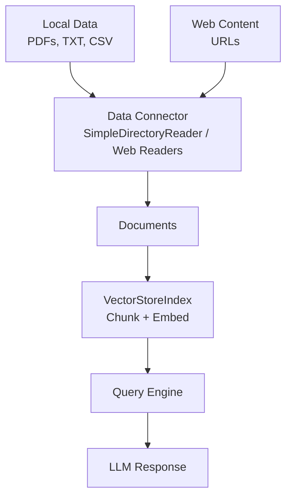
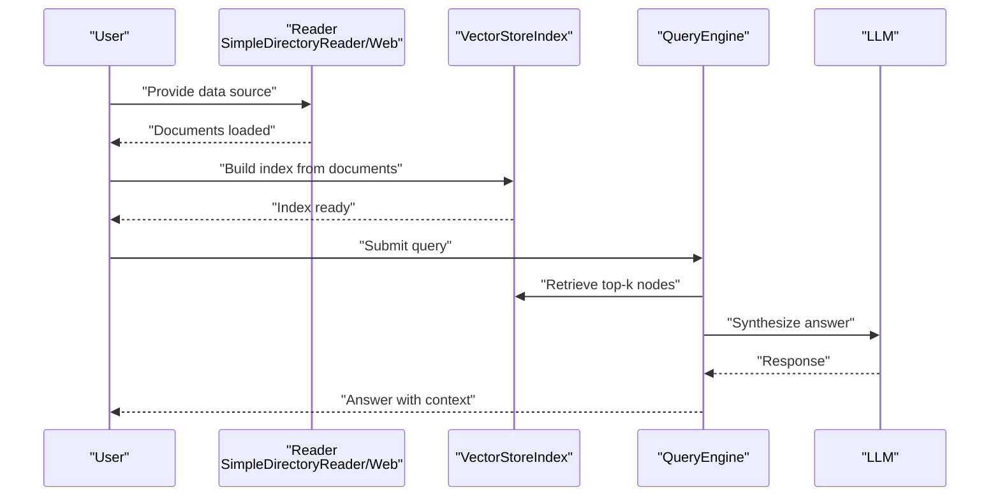
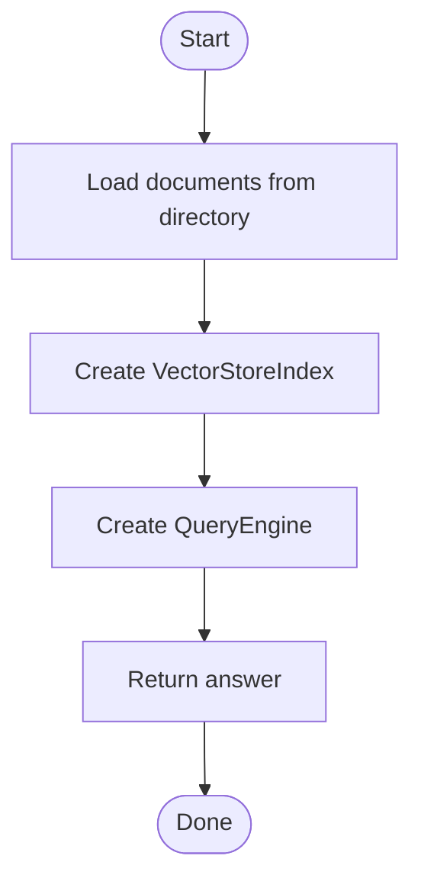
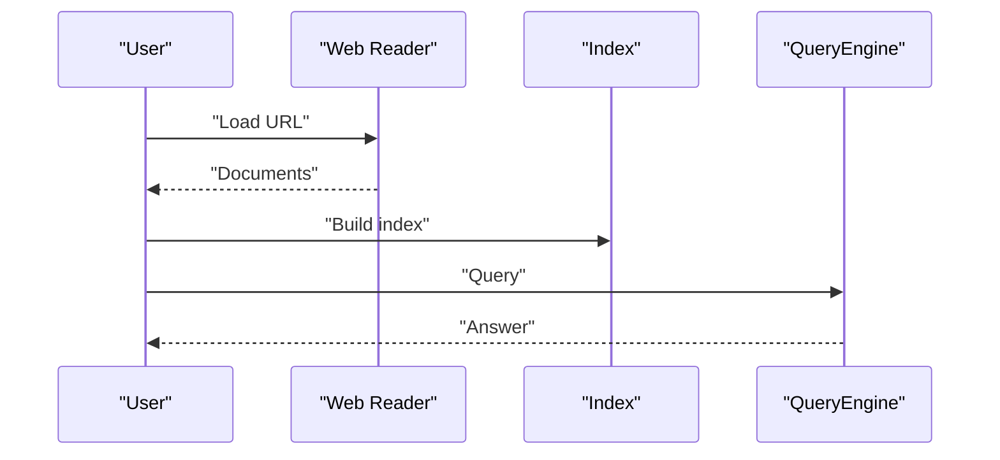
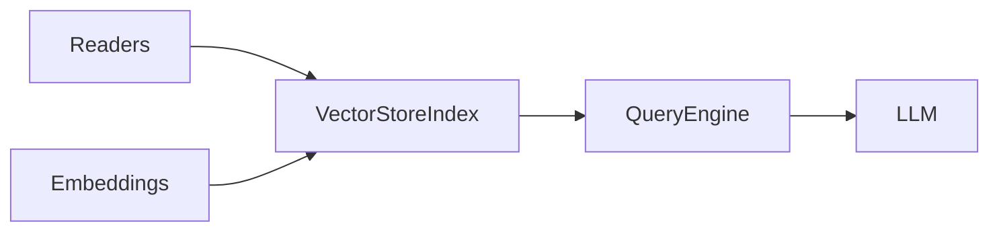

# Quick Start Guide

<cite>
**Referenced Files in This Document**
- [README.md](file://README.md)
- [simple_directory_reader.ipynb](file://docs/examples/data_connectors/simple_directory_reader.ipynb)
- [WebPageDemo.ipynb](file://docs/examples/data_connectors/WebPageDemo.ipynb)
- [llama3_cookbook.ipynb](file://docs/examples/cookbooks/llama3_cookbook.ipynb)
- [advanced_ingestion_pipeline.ipynb](file://docs/examples/ingestion/advanced_ingestion_pipeline.ipynb)
</cite>

## Table of Contents
1. [Introduction](#introduction)
2. [Project Structure](#project-structure)
3. [Core Components](#core-components)
4. [Architecture Overview](#architecture-overview)
5. [Detailed Component Analysis](#detailed-component-analysis)
6. [Dependency Analysis](#dependency-analysis)
7. [Performance Considerations](#performance-considerations)
8. [Troubleshooting Guide](#troubleshooting-guide)
9. [Conclusion](#conclusion)
10. [Appendices](#appendices)

## Introduction
This Quick Start Guide helps you build your first Retrieval-Augmented Generation (RAG) application with LlamaIndex in minutes. You will:
- Set up your environment
- Load common data sources (PDFs, text files, and simple web content)
- Create an index
- Query your data

The guide focuses on minimal prerequisites and beginner-friendly steps, using examples from the repository to keep you grounded in working code.

## Project Structure
At a high level, you will use:
- Data connectors to ingest your data (local files, web pages)
- An index builder to chunk and embed your data
- A query engine to retrieve and synthesize answers

**Diagram sources**
- [README.md](file://README.md#L105-L177)
- [simple_directory_reader.ipynb](file://docs/examples/data_connectors/simple_directory_reader.ipynb#L242-L315)
- [WebPageDemo.ipynb](file://docs/examples/data_connectors/WebPageDemo.ipynb#L80-L120)

**Section sources**
- [README.md](file://README.md#L105-L177)

## Core Components
- Data connectors: Load data from local directories, specific files, or web pages.
- Index builder: Create a vector index from your documents.
- Query engine: Retrieve relevant chunks and synthesize answers with an LLM.

Essential building blocks you will use:
- SimpleDirectoryReader for local files
- Web readers for URLs
- VectorStoreIndex for indexing
- QueryEngine for querying

**Section sources**
- [README.md](file://README.md#L105-L177)
- [simple_directory_reader.ipynb](file://docs/examples/data_connectors/simple_directory_reader.ipynb#L242-L315)
- [WebPageDemo.ipynb](file://docs/examples/data_connectors/WebPageDemo.ipynb#L80-L120)

## Architecture Overview
The end-to-end flow from data to query:

**Diagram sources**
- [README.md](file://README.md#L105-L177)
- [simple_directory_reader.ipynb](file://docs/examples/data_connectors/simple_directory_reader.ipynb#L242-L315)
- [WebPageDemo.ipynb](file://docs/examples/data_connectors/WebPageDemo.ipynb#L80-L120)

## Detailed Component Analysis

### Step 1: Environment Setup
- Install the starter package or core plus chosen integrations.
- Set environment variables for any external APIs you plan to use (e.g., LLM provider keys).
- Verify your environment by running a simple import and basic operation.

Tip: Start with the “starter” package for a batteries-included experience.

**Section sources**
- [README.md](file://README.md#L95-L120)

### Step 2: Choose a Data Source
- Local files: Use SimpleDirectoryReader to load a directory or specific files.
- Web content: Use a web reader to fetch and parse a URL.

Common scenarios:
- Load all files from a directory
- Load only specific file types
- Load a single file
- Load from a URL

**Section sources**
- [simple_directory_reader.ipynb](file://docs/examples/data_connectors/simple_directory_reader.ipynb#L242-L315)
- [WebPageDemo.ipynb](file://docs/examples/data_connectors/WebPageDemo.ipynb#L80-L120)

### Step 3: Create an Index
- Build a VectorStoreIndex from your documents.
- Persist the index to disk if needed.

Notes:
- By default, data is stored in-memory.
- Persisting saves the index to a storage directory for reuse.

**Section sources**
- [README.md](file://README.md#L105-L177)

### Step 4: Query Your Data
- Create a query engine from the index.
- Submit questions and receive answers augmented by retrieved context.

**Section sources**
- [README.md](file://README.md#L154-L177)

### Practical Examples

#### Example A: Local Text Files
- Load a directory of text files
- Build a vector index
- Query the index

**Diagram sources**
- [simple_directory_reader.ipynb](file://docs/examples/data_connectors/simple_directory_reader.ipynb#L242-L315)
- [README.md](file://README.md#L105-L177)

#### Example B: Web Content
- Fetch a web page
- Build an index
- Query the page content

**Diagram sources**
- [WebPageDemo.ipynb](file://docs/examples/data_connectors/WebPageDemo.ipynb#L80-L120)

#### Example C: Non-OpenAI LLM (Optional)
- Configure a non-OpenAI LLM (e.g., a hosted model)
- Set tokenizer and embedding model
- Build and query the index

**Section sources**
- [README.md](file://README.md#L118-L177)

## Dependency Analysis
The quick start relies on a small set of core modules:
- Data connectors (readers)
- Index builder (VectorStoreIndex)
- Query engine
- Optional: LLM and embedding integrations

**Diagram sources**
- [README.md](file://README.md#L105-L177)

**Section sources**
- [README.md](file://README.md#L105-L177)

## Performance Considerations
- Keep your initial setup minimal: start with a small dataset and a lightweight embedding model.
- Persist your index to disk to avoid rebuilding on every run.
- For large datasets, consider chunk size tuning and top-k retrieval adjustments.

[No sources needed since this section provides general guidance]

## Troubleshooting Guide
- Missing dependencies: Install the starter package or add specific integrations as needed.
- Authentication errors: Ensure environment variables for API keys are set correctly.
- Slow ingestion: Reduce chunk size or limit the number of files initially.
- Memory issues: Persist the index and consider smaller embedding models.

**Section sources**
- [README.md](file://README.md#L95-L120)

## Conclusion
You now have the essentials to build a working RAG pipeline:
- Load data from files or URLs
- Build a vector index
- Query with a simple engine

From here, explore advanced ingestion pipelines, custom transformations, and production-grade vector stores.

[No sources needed since this section summarizes without analyzing specific files]

## Appendices

### Appendix A: Minimal Steps Checklist
- Install the package
- Prepare your data (local files or a URL)
- Build the index
- Query the index

**Section sources**
- [README.md](file://README.md#L105-L177)
- [simple_directory_reader.ipynb](file://docs/examples/data_connectors/simple_directory_reader.ipynb#L242-L315)
- [WebPageDemo.ipynb](file://docs/examples/data_connectors/WebPageDemo.ipynb#L80-L120)

### Appendix B: Next Steps
- Explore advanced ingestion pipelines for caching and transformations
- Try different LLMs and embeddings
- Integrate with persistent vector stores

**Section sources**
- [advanced_ingestion_pipeline.ipynb](file://docs/examples/ingestion/advanced_ingestion_pipeline.ipynb#L1-L200)
- [llama3_cookbook.ipynb](file://docs/examples/cookbooks/llama3_cookbook.ipynb#L1-L200)