# Customer Support Systems

<cite>
**Referenced Files in This Document**
- [README.md](file://README.md)
- [test_readers_airbyte_zendesk_support.py](file://llama-index-integrations/readers/llama-index-readers-airbyte-zendesk-support/tests/test_readers_airbyte_zendesk_support.py)
- [EntityExtractionClimate.ipynb](file://docs/examples/metadata_extraction/EntityExtractionClimate.ipynb)
- [MarvinMetadataExtractorDemo.ipynb](file://docs/examples/metadata_extraction/MarvinMetadataExtractorDemo.ipynb)
- [PydanticExtractor.ipynb](file://docs/examples/metadata_extraction/PydanticExtractor.ipynb)
- [MboxReaderDemo.ipynb](file://docs/examples/data_connectors/MboxReaderDemo.ipynb)
- [DiscordDemo.ipynb](file://docs/examples/data_connectors/DiscordDemo.ipynb)
- [GoogleChatDemo.ipynb](file://docs/examples/data_connectors/GoogleChatDemo.ipynb)
- [SlackDemo.ipynb](file://docs/examples/data_connectors/SlackDemo.ipynb)
- [TwitterDemo.ipynb](file://docs/examples/data_connectors/TwitterDemo.ipynb)
- [WeaviateDemo.ipynb](file://docs/examples/data_connectors/WeaviateDemo.ipynb)
- [fastapi_rag_ollama/app.py](file://examples/fastapi_rag_ollama/app.py)
- [fastapi_rag_ollama/README.md](file://examples/fastapi_rag_ollama/README.md)
- [fastapi_rag_ollama/requirements.txt](file://examples/fastapi_rag_ollama/requirements.txt)
</cite>

## Table of Contents
1. [Introduction](#introduction)
2. [Project Structure](#project-structure)
3. [Core Components](#core-components)
4. [Architecture Overview](#architecture-overview)
5. [Detailed Component Analysis](#detailed-component-analysis)
6. [Dependency Analysis](#dependency-analysis)
7. [Performance Considerations](#performance-considerations)
8. [Troubleshooting Guide](#troubleshooting-guide)
9. [Conclusion](#conclusion)
10. [Appendices](#appendices)

## Introduction
This document describes how to build customer support automation systems using LlamaIndex. It focuses on extracting and structuring support data from emails and multi-modal channels, automatically routing tickets, generating intelligent responses, performing sentiment and entity extraction, and enabling dynamic FAQ generation. It also covers escalations, quality assurance, CRM integration, SLA tracking, performance analytics, compliance, and scaling across channels.

## Project Structure
The repository provides:
- Core RAG and retrieval/query engine capabilities
- Extensive integrations for readers/connectors (email, chat platforms, CRMs)
- Metadata extraction and entity extraction examples
- Example applications (e.g., FastAPI RAG server)
- Tests validating integration readers

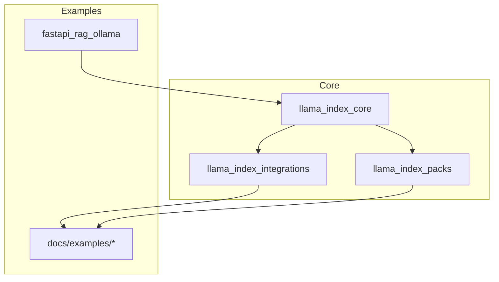

**Section sources**
- [README.md](file://README.md#L1-L50)

## Core Components
- Email and multi-modal data connectors: Readers for mbox, Discord, Google Chat, Slack, Twitter, Weaviate, and CRM connectors (e.g., Zendesk via Airbyte) enable ingestion of support tickets and conversations.
- Metadata extraction and entity extraction: Tools to extract structured metadata and named entities from support content.
- Retrieval and query engines: Core building blocks for semantic search, fusion, and RAG pipelines.
- Integrations: Reader packs and connectors for CRM systems, vector stores, and observability.

Key areas for customer support:
- Email ingestion: Use mailbox readers to parse incoming emails and convert to nodes for indexing.
- Multi-modal channels: Connectors for chat platforms (Discord, Slack, Google Chat, Twitter) capture real-time support conversations.
- CRM ingestion: Airbyte-based reader for Zendesk support data validates against BaseReader interface, ensuring compatibility with LlamaIndex pipelines.
- Metadata/entity extraction: Extract product names, customer IDs, issue categories, and sentiment to power routing and FAQs.

**Section sources**
- [MboxReaderDemo.ipynb](file://docs/examples/data_connectors/MboxReaderDemo.ipynb)
- [DiscordDemo.ipynb](file://docs/examples/data_connectors/DiscordDemo.ipynb)
- [GoogleChatDemo.ipynb](file://docs/examples/data_connectors/GoogleChatDemo.ipynb)
- [SlackDemo.ipynb](file://docs/examples/data_connectors/SlackDemo.ipynb)
- [TwitterDemo.ipynb](file://docs/examples/data_connectors/TwitterDemo.ipynb)
- [WeaviateDemo.ipynb](file://docs/examples/data_connectors/WeaviateDemo.ipynb)
- [test_readers_airbyte_zendesk_support.py](file://llama-index-integrations/readers/llama-index-readers-airbyte-zendesk_support/tests/test_readers_airbyte_zendesk_support.py#L1-L8)

## Architecture Overview
A typical customer support automation pipeline ingests data from multiple channels, extracts metadata and entities, indexes content, routes tickets, generates responses, tracks SLAs, and ensures quality.

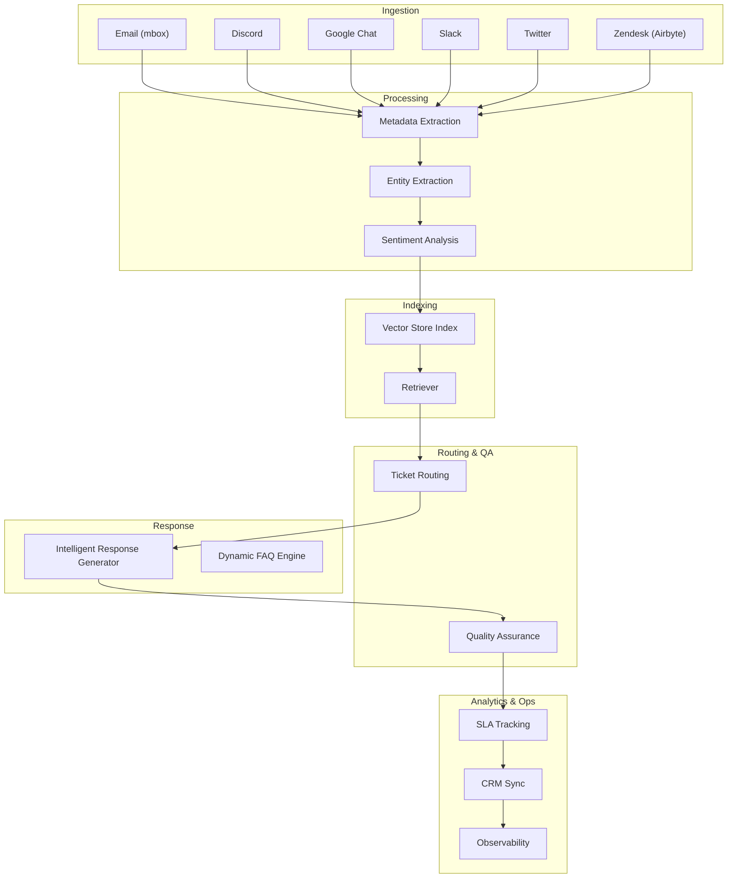

## Detailed Component Analysis

### Email Data Extraction System
- Purpose: Convert inbound emails into structured nodes for indexing and retrieval.
- Implementation pattern: Use a mailbox reader to load messages, then apply parsers and extractors to enrich content with metadata and entities.
- Routing impact: Enriched nodes improve semantic similarity and reduce misrouting.

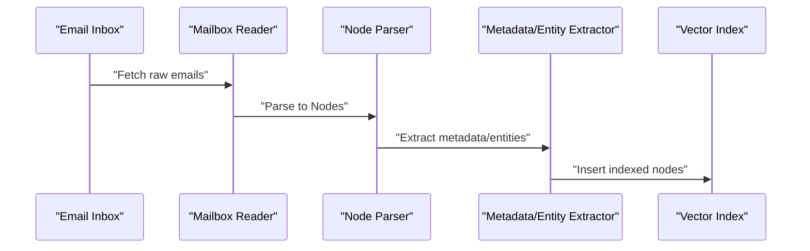

**Section sources**
- [MboxReaderDemo.ipynb](file://docs/examples/data_connectors/MboxReaderDemo.ipynb)

### Automated Ticket Routing
- Purpose: Automatically categorize and assign tickets based on content semantics and extracted entities.
- Implementation pattern: Use retrievers to find similar past tickets and apply classification heuristics or LLM-based routing prompts.
- Quality: Combine entity extraction and sentiment to avoid misclassification and escalate high-risk cases.

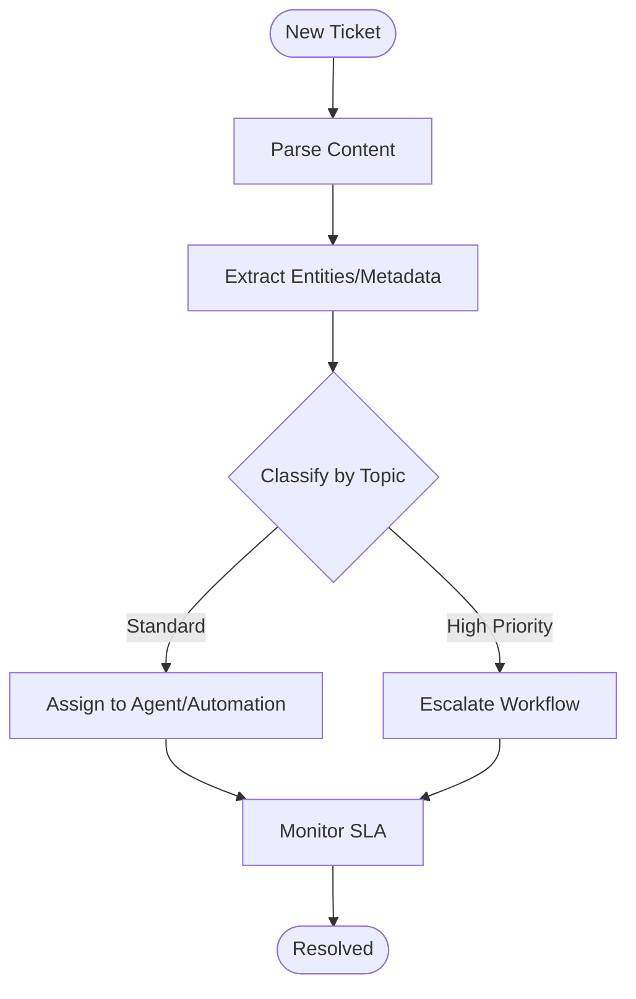

**Section sources**
- [EntityExtractionClimate.ipynb](file://docs/examples/metadata_extraction/EntityExtractionClimate.ipynb)
- [PydanticExtractor.ipynb](file://docs/examples/metadata_extraction/PydanticExtractor.ipynb)

### Intelligent Response Generation
- Purpose: Generate accurate, context-aware responses using retrieved context and prompt templates.
- Implementation pattern: Build a query engine with fusion/re-ranking, then pass top-k nodes to a generator LLM with a tailored prompt.

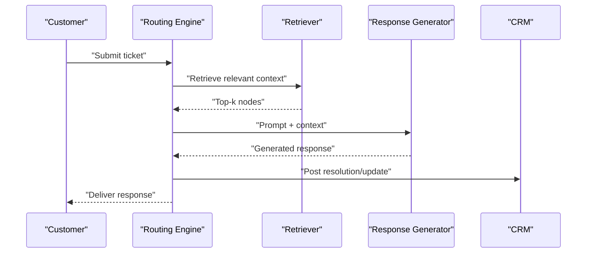

**Section sources**
- [fastapi_rag_ollama/app.py](file://examples/fastapi_rag_ollama/app.py)
- [fastapi_rag_ollama/README.md](file://examples/fastapi_rag_ollama/README.md)

### Sentiment Analysis
- Purpose: Detect sentiment to prioritize urgent tickets and tailor response tone.
- Implementation pattern: Use an extractor to annotate sentiment scores and flags; route negative sentiment to supervisors or escalation.

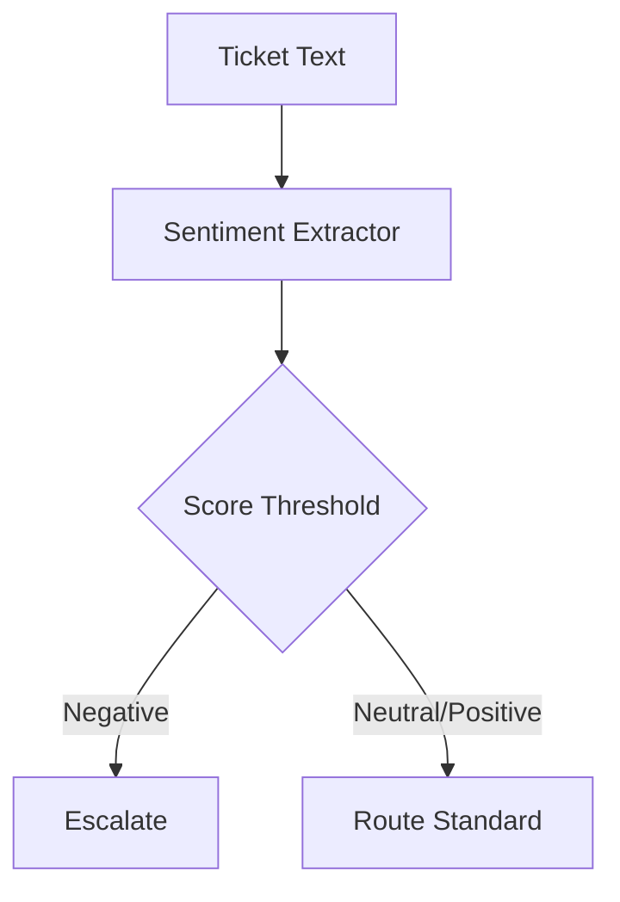

**Section sources**
- [MarvinMetadataExtractorDemo.ipynb](file://docs/examples/metadata_extraction/MarvinMetadataExtractorDemo.ipynb)

### Entity Extraction from Support Tickets
- Purpose: Identify products, customer IDs, account numbers, and topics to improve routing and FAQs.
- Implementation pattern: Use entity extraction notebooks to define extraction prompts and schemas; integrate with retrievers and FAQs.

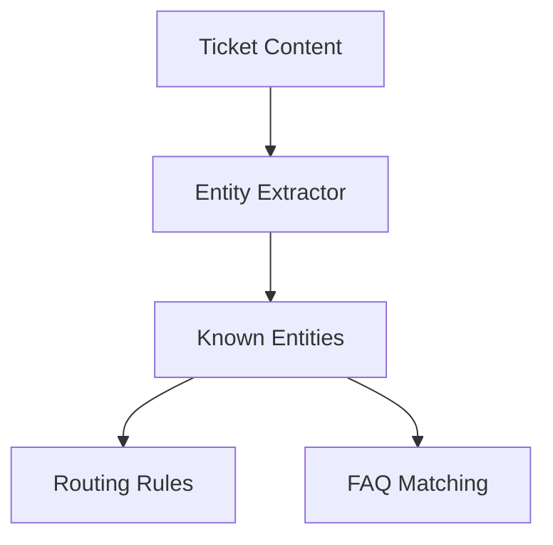

**Section sources**
- [EntityExtractionClimate.ipynb](file://docs/examples/metadata_extraction/EntityExtractionClimate.ipynb)
- [PydanticExtractor.ipynb](file://docs/examples/metadata_extraction/PydanticExtractor.ipynb)

### Dynamic FAQ Generation
- Purpose: Serve relevant FAQs based on extracted entities and intent.
- Implementation pattern: Index FAQ content with entities; retrieve top matches for incoming tickets; optionally augment with LLM for nuanced answers.

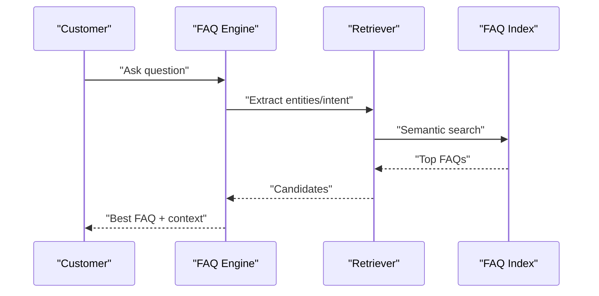

**Section sources**
- [EntityExtractionClimate.ipynb](file://docs/examples/metadata_extraction/EntityExtractionClimate.ipynb)

### Multi-Modal Support Channels
- Purpose: Ingest and process support conversations from Discord, Slack, Google Chat, Twitter, and CRM systems.
- Implementation pattern: Use platform-specific readers to normalize content into nodes; apply shared extraction and routing logic.

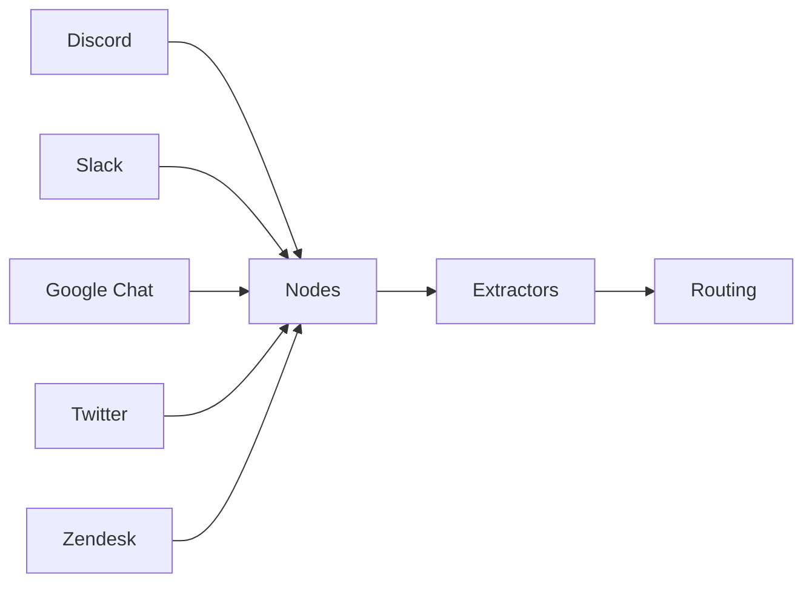

**Section sources**
- [DiscordDemo.ipynb](file://docs/examples/data_connectors/DiscordDemo.ipynb)
- [GoogleChatDemo.ipynb](file://docs/examples/data_connectors/GoogleChatDemo.ipynb)
- [SlackDemo.ipynb](file://docs/examples/data_connectors/SlackDemo.ipynb)
- [TwitterDemo.ipynb](file://docs/examples/data_connectors/TwitterDemo.ipynb)
- [WeaviateDemo.ipynb](file://docs/examples/data_connectors/WeaviateDemo.ipynb)
- [test_readers_airbyte_zendesk_support.py](file://llama-index-integrations/readers/llama-index-readers-airbyte-zendesk_support/tests/test_readers_airbyte_zendesk_support.py#L1-L8)

### Escalation Workflows
- Purpose: Automatically escalate tickets meeting predefined criteria (sentiment, entity type, SLA risk).
- Implementation pattern: Define escalation triggers in routing logic; notify supervisors and update ticket severity.

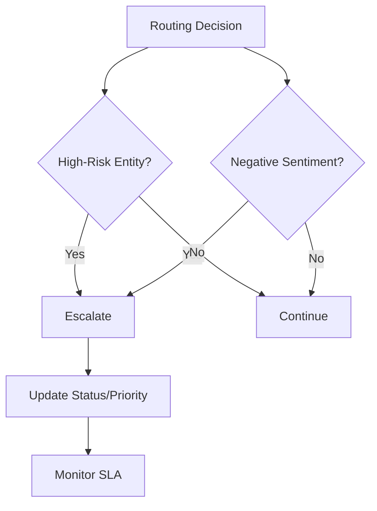

**Section sources**
- [MarvinMetadataExtractorDemo.ipynb](file://docs/examples/metadata_extraction/MarvinMetadataExtractorDemo.ipynb)

### Quality Assurance Pipeline
- Purpose: Ensure response accuracy and consistency.
- Implementation pattern: Post-generation validation using extraction checks, rubric scoring, and human-in-the-loop feedback loops.

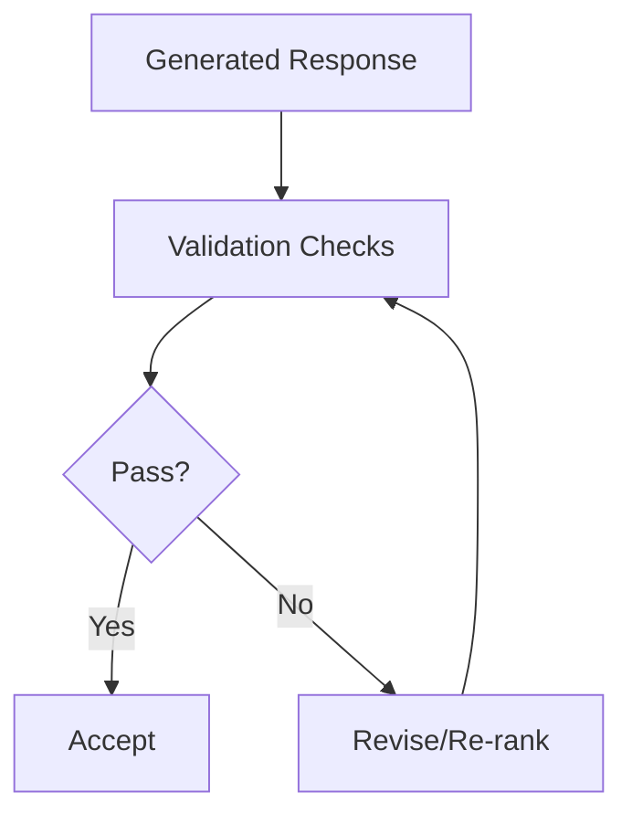

**Section sources**
- [EntityExtractionClimate.ipynb](file://docs/examples/metadata_extraction/EntityExtractionClimate.ipynb)

### CRM Integration and SLA Tracking
- Purpose: Sync ticket states, priorities, and resolutions with CRM; track SLA adherence.
- Implementation pattern: Use CRM connectors (e.g., Airbyte Zendesk) to ingest tickets; maintain a local SLA tracker; export metrics to observability.

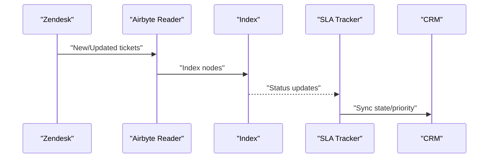

**Section sources**
- [test_readers_airbyte_zendesk_support.py](file://llama-index-integrations/readers/llama-index-readers-airbyte-zendesk_support/tests/test_readers_airbyte_zendesk_support.py#L1-L8)

### Performance Analytics
- Purpose: Measure retrieval quality, response latency, and agent utilization.
- Implementation pattern: Instrument retrieval and generation steps; collect latency and relevance metrics; visualize via observability stacks.

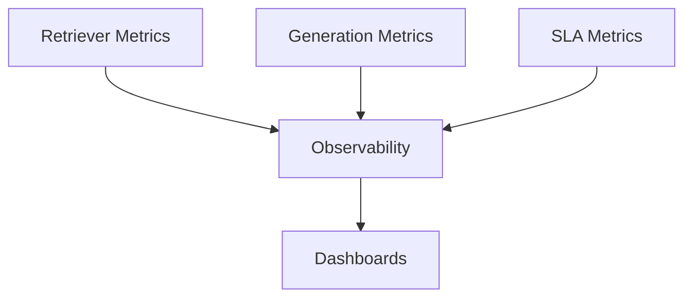

**Section sources**
- [README.md](file://README.md#L1-L50)

## Dependency Analysis
- Readers and connectors depend on core ingestion and parsing APIs.
- Metadata and entity extraction modules depend on LLMs and extractors.
- Retrievers and query engines depend on vector stores and post-processors.
- Integrations (e.g., Airbyte Zendesk) validate against BaseReader to ensure compatibility.

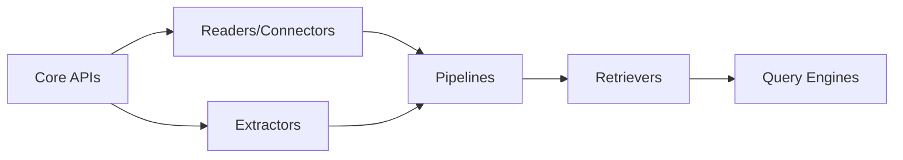

**Section sources**
- [test_readers_airbyte_zendesk_support.py](file://llama-index-integrations/readers/llama-index-readers-airbyte-zendesk_support/tests/test_readers_airbyte_zendesk_support.py#L1-L8)

## Performance Considerations
- Use efficient chunking and embedding strategies to reduce latency.
- Apply fusion and re-ranking to improve retrieval precision.
- Cache frequently accessed FAQs and resolved tickets.
- Scale horizontally with distributed indexing and retrieval.

## Troubleshooting Guide
- Reader validation: Ensure connectors inherit from BaseReader to prevent runtime errors.
- Extraction mismatches: Align extraction schemas with domain entities; validate outputs.
- Retrieval drift: Periodically reindex with fresh data; monitor recall/precision.
- Latency spikes: Profile retriever and generator steps; optimize prompts and chunk sizes.

**Section sources**
- [test_readers_airbyte_zendesk_support.py](file://llama-index-integrations/readers/llama-index-readers-airbyte-zendesk_support/tests/test_readers_airbyte_zendesk_support.py#L1-L8)

## Conclusion
By combining robust ingestion from emails and multi-modal channels, structured metadata and entity extraction, semantic retrieval, and intelligent routing and response generation, organizations can automate scalable, compliant, and high-quality customer support. Integrating CRM and SLA tracking, coupled with observability and QA, ensures continuous improvement and operational excellence.

## Appendices
- Example RAG server: A FastAPI-based deployment demonstrates serving RAG responses with Ollama.

**Section sources**
- [fastapi_rag_ollama/README.md](file://examples/fastapi_rag_ollama/README.md)
- [fastapi_rag_ollama/requirements.txt](file://examples/fastapi_rag_ollama/requirements.txt)