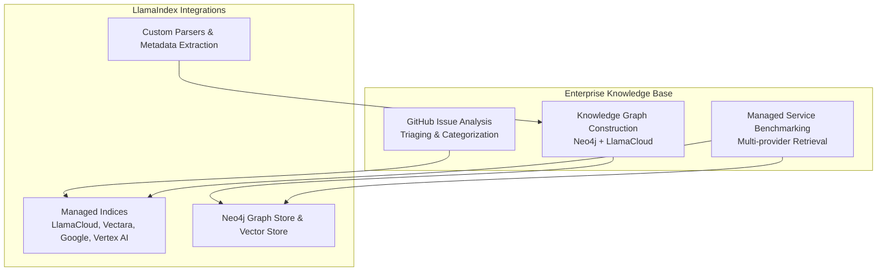
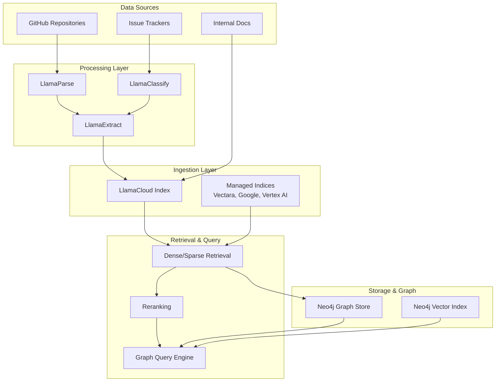
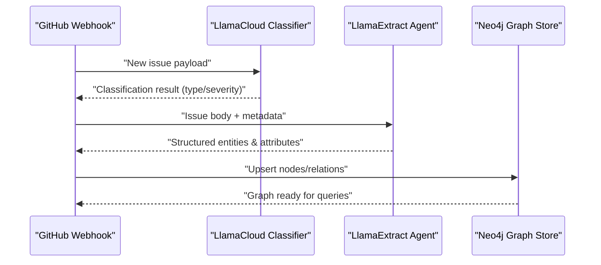
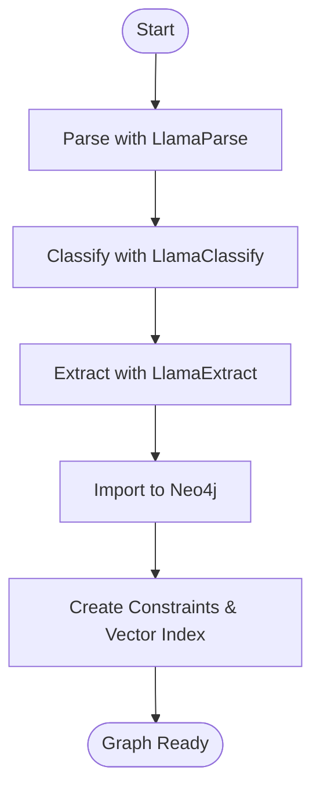
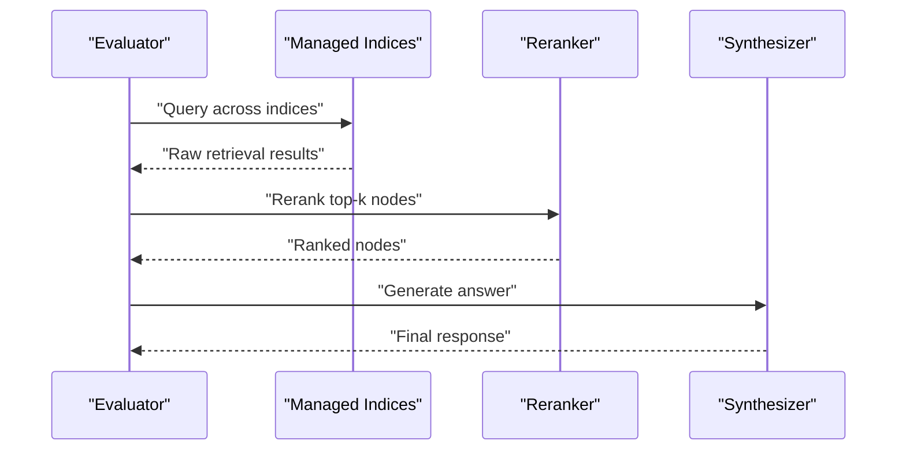
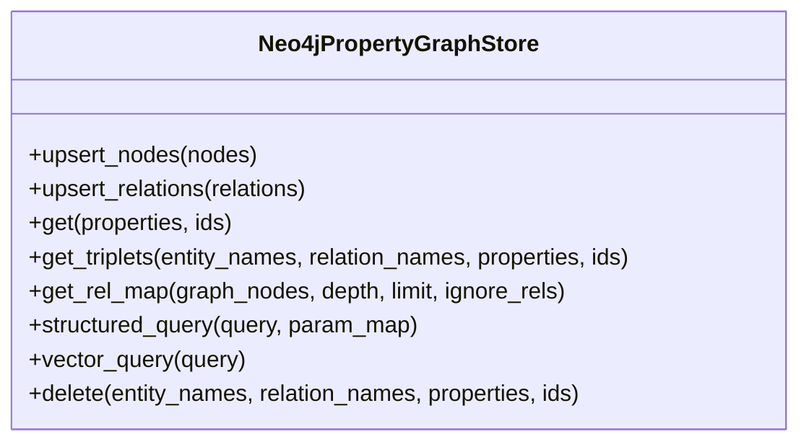
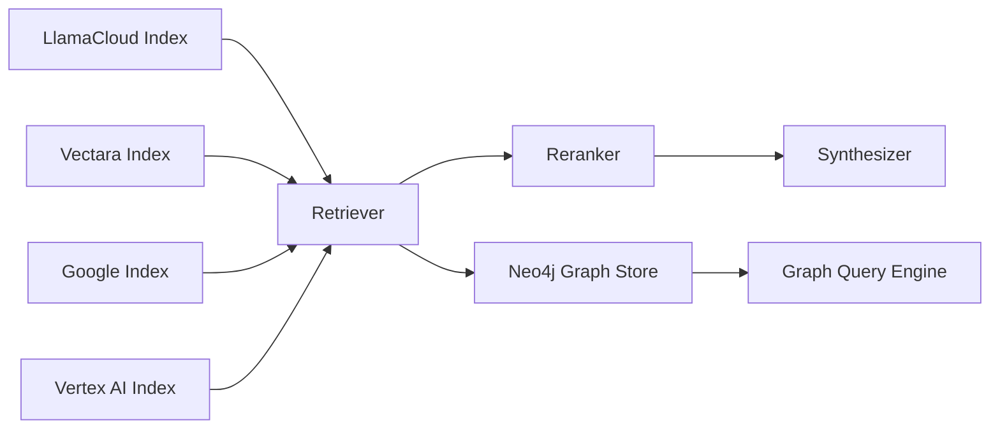

# Enterprise Knowledge Bases

<cite>
**Referenced Files in This Document**
- [build_knowledge_graph_with_neo4j_llamacloud.ipynb](file://docs/examples/cookbooks/build_knowledge_graph_with_neo4j_llamacloud.ipynb)
- [llama_cloud_index.md](file://docs/src/content/docs/framework/module_guides/indexing/llama_cloud_index.md)
- [managed_indices.md](file://docs/src/content/docs/framework/community/integrations/managed_indices.md)
- [manage_retrieval_benchmark.ipynb](file://docs/examples/managed/manage_retrieval_benchmark.ipynb)
- [neo4j_property_graph.py](file://llama-index-integrations/graph_stores/llama-index-graph-stores-neo4j/llama_index/graph_stores/neo4j/neo4j_property_graph.py)
- [neo4j_query_engine.md](file://docs/api_reference/api_reference/packs/neo4j_query_engine.md)
- [neo4j.md](file://docs/api_reference/api_reference/storage/graph_stores/neo4j.md)
- [neo4jvector.md](file://docs/api_reference/api_reference/storage/vector_store/neo4jvector.md)
- [neo4j_metadata_filter.ipynb](file://docs/examples/vector_stores/neo4j_metadata_filter.ipynb)
- [llama_packs_neo4j.ipynb](file://llama-index-packs/llama-index-packs-neo4j-query-engine/examples/llama_packs_neo4j.ipynb)
- [test_indices_managed_llama_cloud.py](file://llama-index-integrations/indices/llama-index-indices-managed-llama-cloud/tests/test_indices_managed_llama_cloud.py)
- [test_indices_managed_vectara.py](file://llama-index-integrations/indices/llama-index-indices-managed-vectara/tests/test_indices_managed_vectara.py)
- [test_indices_managed_google.py](file://llama-index-integrations/indices/llama-index-indices-managed-google/tests/test_indices_managed_google.py)
- [test_indices_managed_colbert.py](file://llama-index-integrations/indices/llama-index-indices-managed-colbert/tests/test_indices_managed_colbert.py)
- [test_indices_managed_vertexai.py](file://llama-index-integrations/indices/llama-index-indices-managed-vertexai/tests/test_indices_managed_vertexai.py)
- [test_indices_managed_postgresml.py](file://llama-index-integrations/indices/llama-index-indices-managed-postgresml/tests/test_indices_managed_postgresml.py)
- [test_packs_neo4j_query_engine.py](file://llama-index-packs/llama-index-packs-neo4j-query-engine/tests/test_packs_neo4j_query_engine.py)
- [test_vector_stores_neo4jvector.py](file://llama-index-integrations/vector_stores/llama-index-vector-stores-neo4jvector/tests/test_vector_stores_neo4jvector.py)
- [test_graph_stores_neo4j.py](file://llama-index-integrations/graph_stores/llama-index-graph-stores-neo4j/tests/test_graph_stores_neo4j.py)
- [test_pg_stores_neo4j.py](file://llama-index-integrations/graph_stores/llama-index-graph-stores-neo4j/tests/test_pg_stores_neo4j.py)
- [evaluator_benchmarker.md](file://docs/api_reference/api_reference/packs/evaluator_benchmarker.md)
- [test_packs_evaluator_benchmarker.py](file://llama-index-packs/llama-index-packs-evaluator-benchmarker/tests/test_packs_evaluator_benchmarker.py)
</cite>

## Table of Contents
1. [Introduction](#introduction)
2. [Project Structure](#project-structure)
3. [Core Components](#core-components)
4. [Architecture Overview](#architecture-overview)
5. [Detailed Component Analysis](#detailed-component-analysis)
6. [Dependency Analysis](#dependency-analysis)
7. [Performance Considerations](#performance-considerations)
8. [Troubleshooting Guide](#troubleshooting-guide)
9. [Conclusion](#conclusion)
10. [Appendices](#appendices)

## Introduction
This document explains how to build enterprise knowledge bases using LlamaIndex with a focus on:
- GitHub issue analysis and triaging workflows
- Knowledge graph construction with Neo4j and LlamaCloud
- Managed service benchmarking across providers
- Large-scale ingestion, metadata extraction, and semantic search optimization
- Deployment architectures, performance tuning, and integration with existing enterprise systems
- Production-ready patterns for custom parsers, retrieval strategies, and monitoring

## Project Structure
The repository provides:
- End-to-end notebooks for building knowledge graphs with Neo4j and LlamaCloud
- Managed index integrations for providers such as LlamaCloud, Vectara, Google, Vertex AI, and others
- Benchmarks comparing retrieval strategies and managed services
- Neo4j graph store and vector store integrations
- Packs and tests validating enterprise-grade capabilities

[No sources needed since this diagram shows conceptual workflow, not actual code structure]

## Core Components
- Managed ingestion and retrieval via LlamaCloud
- Property graph index backed by Neo4j for knowledge discovery
- Multi-provider managed indices for benchmarking and hybrid retrieval
- Retrieval strategies including dense, sparse, and reranking
- Structured extraction and classification for triaging and categorization

**Section sources**
- [llama_cloud_index.md](file://docs/src/content/docs/framework/module_guides/indexing/llama_cloud_index.md#L1-L159)
- [managed_indices.md](file://docs/src/content/docs/framework/community/integrations/managed_indices.md#L1-L157)
- [build_knowledge_graph_with_neo4j_llamacloud.ipynb](file://docs/examples/cookbooks/build_knowledge_graph_with_neo4j_llamacloud.ipynb#L1-L746)
- [neo4j_property_graph.py](file://llama-index-integrations/graph_stores/llama-index-graph-stores-neo4j/llama_index/graph_stores/neo4j/neo4j_property_graph.py#L1-L800)

## Architecture Overview
The enterprise KB architecture combines managed ingestion and retrieval with a Neo4j-backed knowledge graph. The managed services handle ingestion and retrieval optimization, while Neo4j enables complex graph traversals and relationship queries.

**Diagram sources**
- [llama_cloud_index.md](file://docs/src/content/docs/framework/module_guides/indexing/llama_cloud_index.md#L35-L159)
- [build_knowledge_graph_with_neo4j_llamacloud.ipynb](file://docs/examples/cookbooks/build_knowledge_graph_with_neo4j_llamacloud.ipynb#L118-L720)
- [neo4j_property_graph.py](file://llama-index-integrations/graph_stores/llama-index-graph-stores-neo4j/llama_index/graph_stores/neo4j/neo4j_property_graph.py#L94-L205)

## Detailed Component Analysis

### GitHub Issue Analysis and Automated Triaging
- Use LlamaCloud classification to categorize incoming issues (e.g., type, severity).
- Apply structured extraction to pull entities (assignees, components, labels) and attributes (dates, SLA).
- Store normalized entities and relationships in Neo4j for graph-based triaging and trend analysis.

**Diagram sources**
- [build_knowledge_graph_with_neo4j_llamacloud.ipynb](file://docs/examples/cookbooks/build_knowledge_graph_with_neo4j_llamacloud.ipynb#L200-L456)
- [neo4j_property_graph.py](file://llama-index-integrations/graph_stores/llama-index-graph-stores-neo4j/llama_index/graph_stores/neo4j/neo4j_property_graph.py#L329-L408)

**Section sources**
- [build_knowledge_graph_with_neo4j_llamacloud.ipynb](file://docs/examples/cookbooks/build_knowledge_graph_with_neo4j_llamacloud.ipynb#L200-L456)
- [neo4j_property_graph.py](file://llama-index-integrations/graph_stores/llama-index-graph-stores-neo4j/llama_index/graph_stores/neo4j/neo4j_property_graph.py#L329-L408)

### Knowledge Graph Construction with Neo4j and LlamaCloud
- Parse documents with LlamaParse.
- Classify contracts or legal documents with LlamaClassify.
- Extract structured schemas with LlamaExtract and import into Neo4j using Cypher.
- Use Property Graph Index for efficient graph traversal and vector similarity.

**Diagram sources**
- [build_knowledge_graph_with_neo4j_lllamacloud.ipynb](file://docs/examples/cookbooks/build_knowledge_graph_with_neo4j_llamacloud.ipynb#L118-L520)
- [neo4j_property_graph.py](file://llama-index-integrations/graph_stores/llama-index-graph-stores-neo4j/llama_index/graph_stores/neo4j/neo4j_property_graph.py#L155-L205)

**Section sources**
- [build_knowledge_graph_with_neo4j_llamacloud.ipynb](file://docs/examples/cookbooks/build_knowledge_graph_with_neo4j_llamacloud.ipynb#L118-L520)
- [neo4j_property_graph.py](file://llama-index-integrations/graph_stores/llama-index-graph-stores-neo4j/llama_index/graph_stores/neo4j/neo4j_property_graph.py#L155-L205)

### Managed Service Benchmarking
- Compare retrieval strategies across providers: Google Semantic Retrieval, LlamaIndex retrieval, Vectara, and ColBERT.
- Evaluate answer styles (extractive, abstractive, verbose) and reranking effectiveness.
- Use managed composites to route queries across multiple indices.

**Diagram sources**
- [manage_retrieval_benchmark.ipynb](file://docs/examples/managed/manage_retrieval_benchmark.ipynb#L1-L800)
- [managed_indices.md](file://docs/src/content/docs/framework/community/integrations/managed_indices.md#L1-L157)

**Section sources**
- [manage_retrieval_benchmark.ipynb](file://docs/examples/managed/manage_retrieval_benchmark.ipynb#L1-L800)
- [managed_indices.md](file://docs/src/content/docs/framework/community/integrations/managed_indices.md#L1-L157)

### Neo4j Integration Patterns
- Property graph store with vector indexing for entity similarity.
- Upsert nodes and relations in batches.
- Structured and vector queries with filtering and pagination.

**Diagram sources**
- [neo4j_property_graph.py](file://llama-index-integrations/graph_stores/llama-index-graph-stores-neo4j/llama_index/graph_stores/neo4j/neo4j_property_graph.py#L94-L721)

**Section sources**
- [neo4j_property_graph.py](file://llama-index-integrations/graph_stores/llama-index-graph-stores-neo4j/llama_index/graph_stores/neo4j/neo4j_property_graph.py#L94-L721)
- [neo4j_query_engine.md](file://docs/api_reference/api_reference/packs/neo4j_query_engine.md)
- [neo4j.md](file://docs/api_reference/api_reference/storage/graph_stores/neo4j.md)
- [neo4jvector.md](file://docs/api_reference/api_reference/storage/vector_store/neo4jvector.md)
- [neo4j_metadata_filter.ipynb](file://docs/examples/vector_stores/neo4j_metadata_filter.ipynb)

### Large-Scale Document Processing and Metadata Extraction
- Batched upserts for nodes and relations to optimize throughput.
- Schema inference and enhanced typing for long text and embeddings.
- Vector similarity search with optional filters for targeted retrieval.

**Section sources**
- [neo4j_property_graph.py](file://llama-index-integrations/graph_stores/llama-index-graph-stores-neo4j/llama_index/graph_stores/neo4j/neo4j_property_graph.py#L329-L408)
- [neo4j_property_graph.py](file://llama-index-integrations/graph_stores/llama-index-graph-stores-neo4j/llama_index/graph_stores/neo4j/neo4j_property_graph.py#L659-L721)

### Retrieval Strategies and Hybrid Pipelines
- Dense retrieval with vector similarity.
- Sparse retrieval with BM25-style indices.
- Reranking with LLM-based or cross-encoder rerankers.
- Composite retrieval routing across multiple managed indices.

**Section sources**
- [llama_cloud_index.md](file://docs/src/content/docs/framework/module_guides/indexing/llama_cloud_index.md#L82-L159)
- [manage_retrieval_benchmark.ipynb](file://docs/examples/managed/manage_retrieval_benchmark.ipynb#L680-L800)

## Dependency Analysis
The enterprise KB relies on:
- Managed ingestion and retrieval APIs (LlamaCloud, Vectara, Google, Vertex AI)
- Neo4j graph and vector stores for knowledge representation
- Packs and utilities for graph query engines and metadata filtering

**Diagram sources**
- [managed_indices.md](file://docs/src/content/docs/framework/community/integrations/managed_indices.md#L1-L157)
- [llama_cloud_index.md](file://docs/src/content/docs/framework/module_guides/indexing/llama_cloud_index.md#L35-L159)
- [neo4j_property_graph.py](file://llama-index-integrations/graph_stores/llama-index-graph-stores-neo4j/llama_index/graph_stores/neo4j/neo4j_property_graph.py#L94-L205)

**Section sources**
- [managed_indices.md](file://docs/src/content/docs/framework/community/integrations/managed_indices.md#L1-L157)
- [llama_cloud_index.md](file://docs/src/content/docs/framework/module_guides/indexing/llama_cloud_index.md#L35-L159)
- [neo4j_property_graph.py](file://llama-index-integrations/graph_stores/llama-index-graph-stores-neo4j/llama_index/graph_stores/neo4j/neo4j_property_graph.py#L94-L205)

## Performance Considerations
- Use batched upserts for nodes and relations to reduce transaction overhead.
- Enable vector indexes on Neo4j for entity similarity search.
- Tune retrieval parameters (top_k, alpha, rerank_top_n) per workload.
- Prefer managed indices for ingestion and retrieval to offload scaling concerns.
- Monitor latency and throughput of rerankers and synthesizers.

[No sources needed since this section provides general guidance]

## Troubleshooting Guide
- Neo4j driver errors: ensure credentials, database name, and timeouts are configured correctly.
- Schema refresh failures: verify APOC availability and permissions for schema introspection.
- Managed index connectivity: confirm API keys and corpus IDs; validate provider region support.
- Benchmark reproducibility: pin embeddings and reranker models; isolate network variability.

**Section sources**
- [neo4j_property_graph.py](file://llama-index-integrations/graph_stores/llama-index-graph-stores-neo4j/llama_index/graph_stores/neo4j/neo4j_property_graph.py#L612-L658)
- [managed_indices.md](file://docs/src/content/docs/framework/community/integrations/managed_indices.md#L40-L98)
- [llama_cloud_index.md](file://docs/src/content/docs/framework/module_guides/indexing/llama_cloud_index.md#L14-L81)

## Conclusion
By combining managed ingestion and retrieval with a Neo4j-backed knowledge graph, enterprises can scale knowledge discovery, automate triaging, and optimize retrieval quality. The provided integrations, notebooks, and packs offer production-ready patterns for ingestion, extraction, graph construction, and benchmarking.

[No sources needed since this section summarizes without analyzing specific files]

## Appendices

### Implementation Patterns and References
- Managed ingestion and retrieval setup: [LlamaCloud Index Guide](file://docs/src/content/docs/framework/module_guides/indexing/llama_cloud_index.md#L35-L81)
- Managed indices across providers: [Using Managed Indices](file://docs/src/content/docs/framework/community/integrations/managed_indices.md#L1-L157)
- Knowledge graph with Neo4j and LlamaCloud: [Build Knowledge Graph Notebook](file://docs/examples/cookbooks/build_knowledge_graph_with_neo4j_llamacloud.ipynb#L1-L746)
- Neo4j graph store and vector store: [Neo4j Property Graph Store](file://llama-index-integrations/graph_stores/llama-index-graph-stores-neo4j/llama_index/graph_stores/neo4j/neo4j_property_graph.py#L94-L205), [Neo4j Vector Store](file://docs/api_reference/api_reference/storage/vector_store/neo4jvector.md)
- Retrieval benchmarking: [Manage Retrieval Benchmark](file://docs/examples/managed/manage_retrieval_benchmark.ipynb#L1-L800)
- Monitoring and evaluation packs: [Evaluator Benchmarker](file://docs/api_reference/api_reference/packs/evaluator_benchmarker.md)

**Section sources**
- [llama_cloud_index.md](file://docs/src/content/docs/framework/module_guides/indexing/llama_cloud_index.md#L35-L159)
- [managed_indices.md](file://docs/src/content/docs/framework/community/integrations/managed_indices.md#L1-L157)
- [build_knowledge_graph_with_neo4j_llamacloud.ipynb](file://docs/examples/cookbooks/build_knowledge_graph_with_neo4j_llamacloud.ipynb#L1-L746)
- [neo4j_property_graph.py](file://llama-index-integrations/graph_stores/llama-index-graph-stores-neo4j/llama_index/graph_stores/neo4j/neo4j_property_graph.py#L94-L205)
- [manage_retrieval_benchmark.ipynb](file://docs/examples/managed/manage_retrieval_benchmark.ipynb#L1-L800)
- [evaluator_benchmarker.md](file://docs/api_reference/api_reference/packs/evaluator_benchmarker.md)