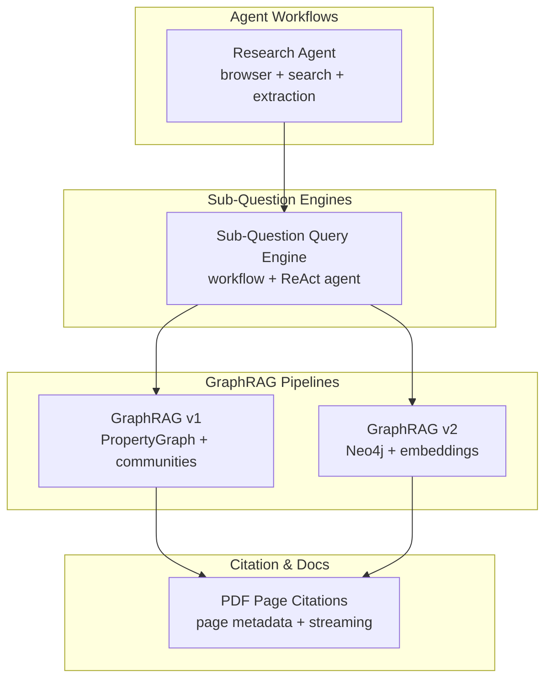
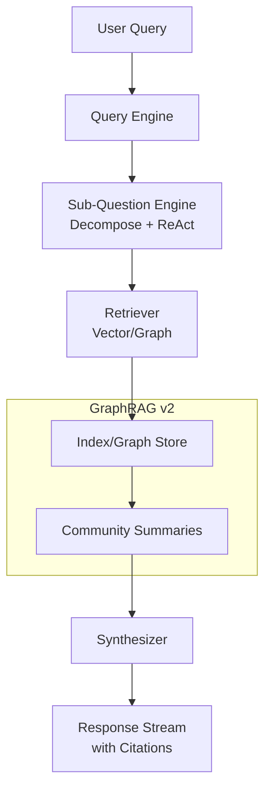
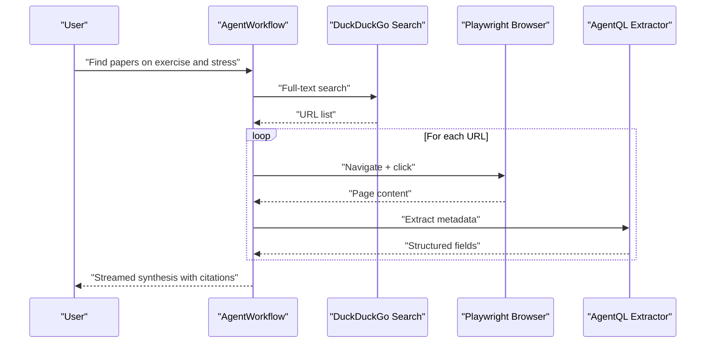
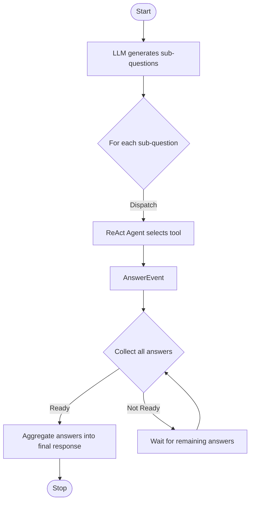
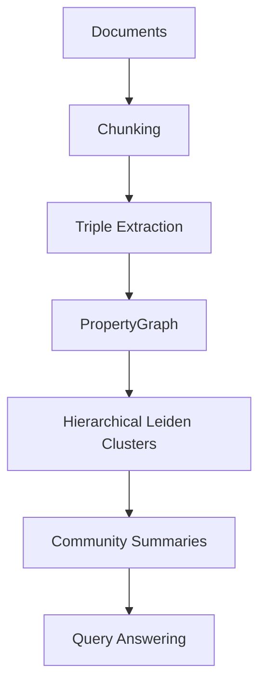
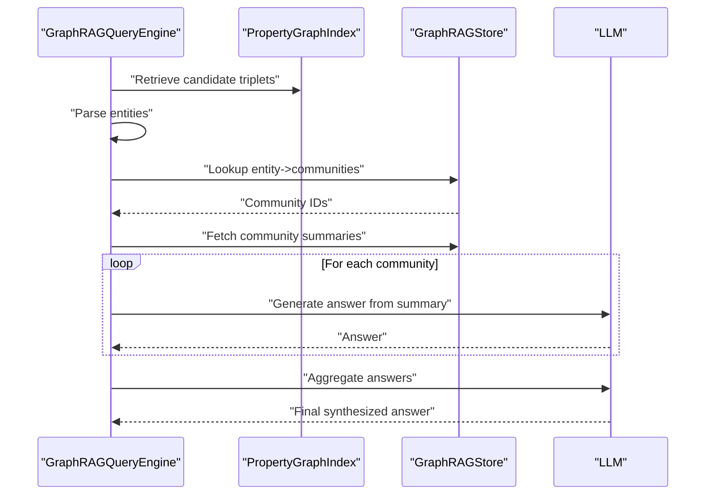
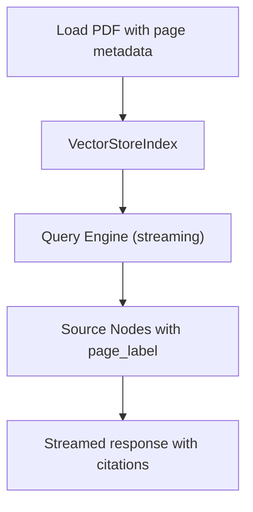
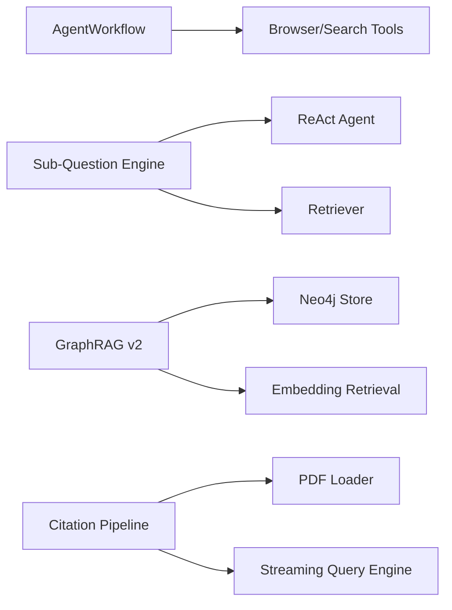

# Research Assistants

<cite>
**Referenced Files in This Document**
- [agent_workflow_research_assistant.ipynb](file://docs/examples/agent/agent_workflow_research_assistant.ipynb)
- [nvidia_sub_question_query_engine.ipynb](file://docs/examples/agent/nvidia_sub_question_query_engine.ipynb)
- [GraphRAG_v1.ipynb](file://docs/examples/cookbooks/GraphRAG_v1.ipynb)
- [GraphRAG_v2.ipynb](file://docs/examples/cookbooks/GraphRAG_v2.ipynb)
- [pdf_page_reference.ipynb](file://docs/examples/citation/pdf_page_reference.ipynb)
</cite>

## Table of Contents
1. [Introduction](#introduction)
2. [Project Structure](#project-structure)
3. [Core Components](#core-components)
4. [Architecture Overview](#architecture-overview)
5. [Detailed Component Analysis](#detailed-component-analysis)
6. [Dependency Analysis](#dependency-analysis)
7. [Performance Considerations](#performance-considerations)
8. [Troubleshooting Guide](#troubleshooting-guide)
9. [Conclusion](#conclusion)
10. [Appendices](#appendices)

## Introduction
This document describes how to build AI-powered research assistance platforms with LlamaIndex. It focuses on:
- Sub-question decomposition workflows for complex queries
- Graph-based reasoning engines for multi-document analysis
- Scientific literature processing, hypothesis generation, and evidence synthesis
- Academic paper analysis, patent research automation, and collaborative research tools
- Integration with research databases, citation management, and collaborative annotation systems
- Handling complex reasoning chains, maintaining research integrity, and supporting iterative research processes

The guidance is grounded in practical examples from the repository, including agent-driven research workflows, sub-question query engines, and GraphRAG pipelines with Neo4j.

## Project Structure
The repository organizes examples by use case and domain. For research assistants, the most relevant areas include:
- Agent workflows for browser automation and multi-tool orchestration
- Sub-question decomposition using workflows and ReAct agents
- GraphRAG pipelines for knowledge graph construction and retrieval
- Citation and page-reference handling for academic documents

[No sources needed since this diagram shows conceptual structure, not a direct code mapping]

## Core Components
- Agent workflows orchestrating browser automation, web search, and structured extraction for research tasks
- Sub-question decomposition that splits complex queries into focused retrievals and synthesizes answers
- GraphRAG pipelines that extract entities/relations, build communities, and answer queries via community summaries
- Citation-aware retrieval that attaches page-level provenance to responses

**Section sources**
- [agent_workflow_research_assistant.ipynb](file://docs/examples/agent/agent_workflow_research_assistant.ipynb#L1-L253)
- [nvidia_sub_question_query_engine.ipynb](file://docs/examples/agent/nvidia_sub_question_query_engine.ipynb#L1-L393)
- [GraphRAG_v1.ipynb](file://docs/examples/cookbooks/GraphRAG_v1.ipynb#L1-L1327)
- [GraphRAG_v2.ipynb](file://docs/examples/cookbooks/GraphRAG_v2.ipynb#L1-L1143)
- [pdf_page_reference.ipynb](file://docs/examples/citation/pdf_page_reference.ipynb#L1-L243)

## Architecture Overview
The research assistant stack integrates modular components:
- Data ingestion and preprocessing (text splitting, metadata preservation)
- Extraction of entities/relations for graph construction
- Community detection and summarization
- Query-time retrieval and answer synthesis
- Streaming responses with citations and provenance

**Diagram sources**
- [GraphRAG_v2.ipynb](file://docs/examples/cookbooks/GraphRAG_v2.ipynb#L540-L700)
- [nvidia_sub_question_query_engine.ipynb](file://docs/examples/agent/nvidia_sub_question_query_engine.ipynb#L129-L230)

**Section sources**
- [GraphRAG_v2.ipynb](file://docs/examples/cookbooks/GraphRAG_v2.ipynb#L540-L700)
- [nvidia_sub_question_query_engine.ipynb](file://docs/examples/agent/nvidia_sub_question_query_engine.ipynb#L129-L230)

## Detailed Component Analysis

### Agent Workflow + Research Assistant
This example demonstrates an AgentWorkflow that:
- Uses browser automation and DuckDuckGo search
- Extracts metadata (title, authors, journal, abstract) from discovered pages
- Streams partial results and supports streaming handlers

**Diagram sources**
- [agent_workflow_research_assistant.ipynb](file://docs/examples/agent/agent_workflow_research_assistant.ipynb#L147-L227)

**Section sources**
- [agent_workflow_research_assistant.ipynb](file://docs/examples/agent/agent_workflow_research_assistant.ipynb#L1-L253)

### Sub-Question Query Engine (NVIDIA NIMs)
This example implements a workflow that:
- Decomposes a complex query into sub-questions
- Executes each sub-question via a ReAct agent with multiple tools
- Aggregates answers into a final response

**Diagram sources**
- [nvidia_sub_question_query_engine.ipynb](file://docs/examples/agent/nvidia_sub_question_query_engine.ipynb#L129-L230)

**Section sources**
- [nvidia_sub_question_query_engine.ipynb](file://docs/examples/agent/nvidia_sub_question_query_engine.ipynb#L1-L393)

### GraphRAG v1: PropertyGraph + Communities
This cookbook builds a knowledge graph from text chunks and:
- Extracts entities and relationships
- Partitions the graph into hierarchical communities
- Summarizes communities for query answering

**Diagram sources**
- [GraphRAG_v1.ipynb](file://docs/examples/cookbooks/GraphRAG_v1.ipynb#L460-L800)

**Section sources**
- [GraphRAG_v1.ipynb](file://docs/examples/cookbooks/GraphRAG_v1.ipynb#L1-L1327)

### GraphRAG v2: Neo4j + Embeddings
This version extends v1 by integrating Neo4j and embedding-based retrieval:
- Uses Neo4jPropertyGraphStore
- Builds communities and summaries
- Retrieves entities via embeddings and synthesizes answers

**Diagram sources**
- [GraphRAG_v2.ipynb](file://docs/examples/cookbooks/GraphRAG_v2.ipynb#L594-L700)

**Section sources**
- [GraphRAG_v2.ipynb](file://docs/examples/cookbooks/GraphRAG_v2.ipynb#L1-L1143)

### Citation-Aware Responses with PDF Page References
This example shows how to:
- Preserve page metadata during ingestion
- Stream responses with page-level citations
- Inspect source nodes and scores

**Diagram sources**
- [pdf_page_reference.ipynb](file://docs/examples/citation/pdf_page_reference.ipynb#L113-L176)

**Section sources**
- [pdf_page_reference.ipynb](file://docs/examples/citation/pdf_page_reference.ipynb#L1-L243)

## Dependency Analysis
- Agent workflows depend on browser automation tools and search providers
- Sub-question engines rely on LLMs and ReAct agents with tool selection
- GraphRAG pipelines depend on property graph stores, community detection, and LLM summarization
- Citation pipelines depend on loaders that preserve page metadata and streaming query engines

**Diagram sources**
- [agent_workflow_research_assistant.ipynb](file://docs/examples/agent/agent_workflow_research_assistant.ipynb#L94-L158)
- [nvidia_sub_question_query_engine.ipynb](file://docs/examples/agent/nvidia_sub_question_query_engine.ipynb#L138-L230)
- [GraphRAG_v2.ipynb](file://docs/examples/cookbooks/GraphRAG_v2.ipynb#L444-L540)
- [pdf_page_reference.ipynb](file://docs/examples/citation/pdf_page_reference.ipynb#L113-L135)

**Section sources**
- [agent_workflow_research_assistant.ipynb](file://docs/examples/agent/agent_workflow_research_assistant.ipynb#L1-L253)
- [nvidia_sub_question_query_engine.ipynb](file://docs/examples/agent/nvidia_sub_question_query_engine.ipynb#L1-L393)
- [GraphRAG_v2.ipynb](file://docs/examples/cookbooks/GraphRAG_v2.ipynb#L1-L1143)
- [pdf_page_reference.ipynb](file://docs/examples/citation/pdf_page_reference.ipynb#L1-L243)

## Performance Considerations
- Parallelism: Use async workflows and worker pools for extraction and retrieval
- Chunking: Tune chunk sizes and overlaps for balanced recall and speed
- Community size: Control max_cluster_size to balance granularity and coherence
- Streaming: Enable streaming responses to reduce latency and improve interactivity
- Tool selection: Limit tool choices per sub-question to avoid combinatorial overhead

[No sources needed since this section provides general guidance]

## Troubleshooting Guide
- Streaming not working: Ensure async browser and streaming-enabled query engine
- Metadata missing: Verify loader preserves page_label and other metadata
- Community summaries empty: Confirm graph has triplets and hierarchical_leiden runs without errors
- Tool failures: Validate tool availability and credentials; constrain tool selection per sub-question

**Section sources**
- [agent_workflow_research_assistant.ipynb](file://docs/examples/agent/agent_workflow_research_assistant.ipynb#L168-L227)
- [pdf_page_reference.ipynb](file://docs/examples/citation/pdf_page_reference.ipynb#L113-L176)
- [GraphRAG_v2.ipynb](file://docs/examples/cookbooks/GraphRAG_v2.ipynb#L444-L540)
- [nvidia_sub_question_query_engine.ipynb](file://docs/examples/agent/nvidia_sub_question_query_engine.ipynb#L138-L230)

## Conclusion
LlamaIndex enables robust research assistance through:
- Agent-driven discovery and extraction
- Sub-question decomposition for complex reasoning
- GraphRAG pipelines for multi-document understanding
- Citation-aware, streaming responses for transparency and trust

These patterns support iterative research, collaborative annotation, and scalable integration with research databases and citation systems.

[No sources needed since this section summarizes without analyzing specific files]

## Appendices
- Academic paper analysis: Use agent workflows to scrape and extract metadata; apply GraphRAG for thematic synthesis
- Patent research automation: Apply sub-question decomposition to claims and prior art; leverage Neo4j for entity/relationship graphs
- Collaborative research tools: Combine streaming responses with citation provenance; integrate annotation via metadata and source nodes

[No sources needed since this section provides general guidance]